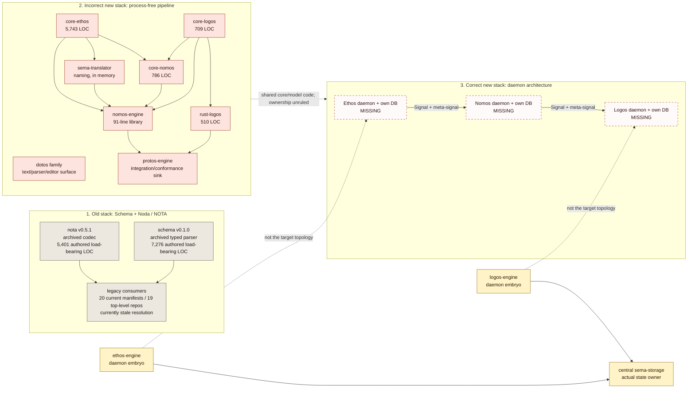
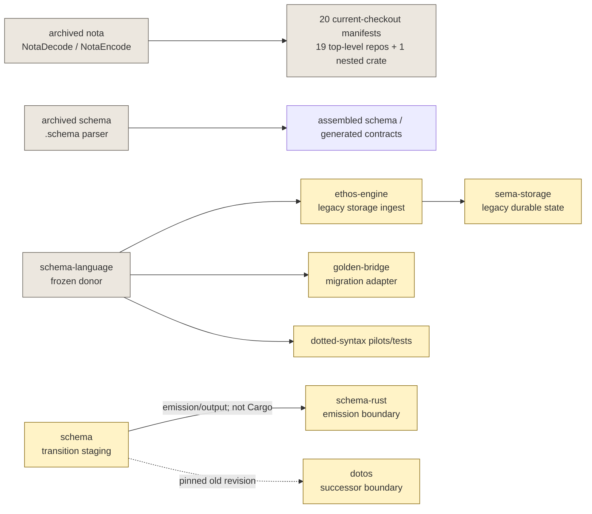
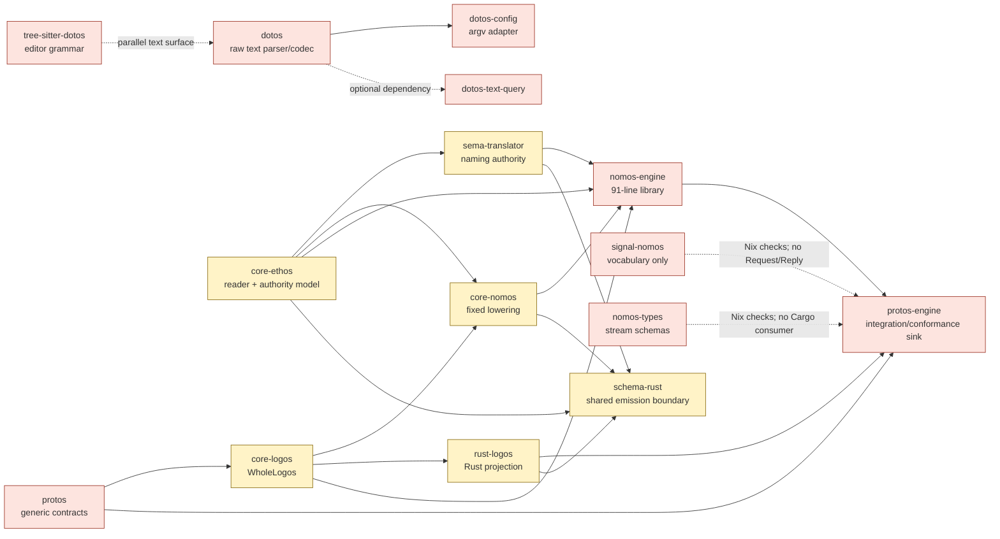
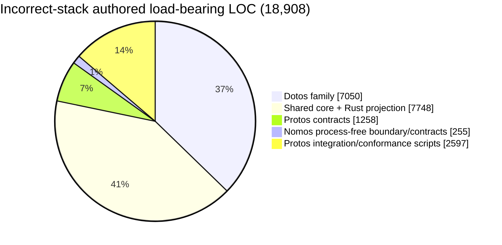
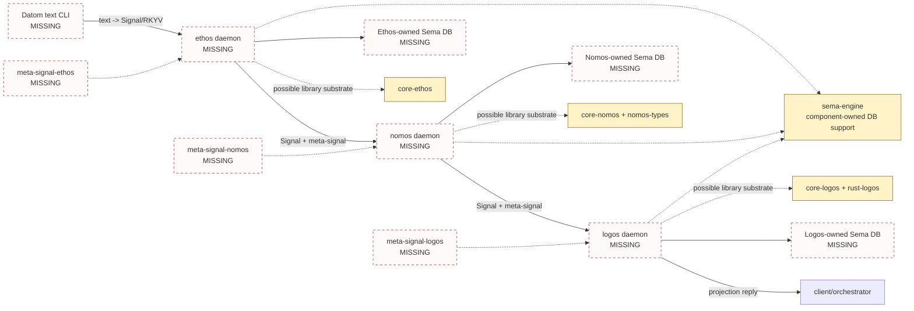
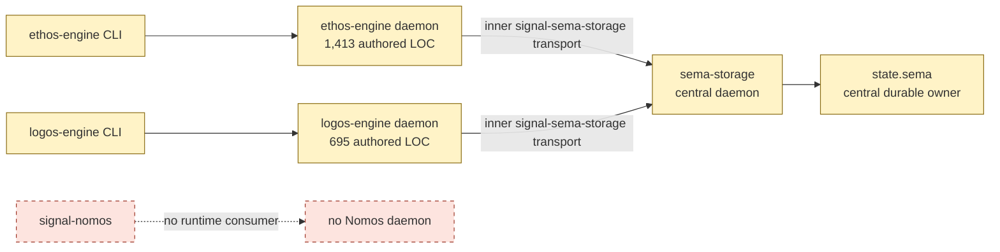
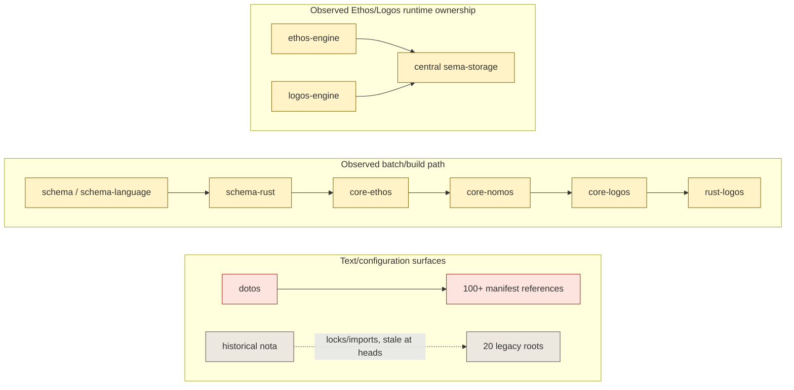

# Protos Three Stacks: Current Filesystem State

**Snapshot:** 2026-08-10

**Scope:** repositories checked out under `/git/github.com/LiGoldragon`, historical repositories under `/home/li/git-archive`, and current cross-repository manifests and source imports.

**Purpose:** show what exists now, not what repository names or architecture documents imply should exist.

## Executive view

Within the incorrect-new-stack cluster, arrows point from a dependency to its consumer. Correct-stack arrows show required message flow; bridge arrows show observed runtime/state ownership.

| Stack | What physically exists | End-to-end state | Authored load-bearing footprint |
|---|---|---|---:|
| Old | Archived `nota` and `schema`; frozen/current transition donors; many historical consumers | Historical implementation exists, but current dependency resolution is stale; one hooked legacy ingest source path remains | **12,677 LOC** in the two archived implementations |
| Incorrect new | Text tooling, core libraries, a process-free Ethos-to-Logos pipeline, contract fragments, and an integration/conformance repository | Substantial batch/library path; no Nomos process or component-owned state | **18,908 LOC** across the 13-repository core roster, of which **7,748 LOC** is shared substrate |
| Correct new | Two daemon embryos, support libraries, and legacy Signal contracts | **Not implemented end to end**; plain daemon repos, meta-signal repos, per-daemon databases, and Nomos daemon are absent | **0 LOC of complete target stack**; **2,108 LOC** in the two daemon embryos before their contracts |

The footprints are deliberately not summed into a migration estimate. Several repositories are shared, renamed, duplicated, dirty, or architecturally misassigned.

## Reading the measurements

`Authored load-bearing LOC` means physical lines in implementation, protocol/model, grammar/query, and CLI/adapter source. Examples are classified with tests/fixtures. Documentation, configuration, lockfiles, generated parsers, vendored code, and build output are reported separately. Blank and comment lines are included. Build directories, `.git`, `.jj`, `.beads`, `target`, `result`, and `node_modules` are excluded.

Visual convention:

- gray: historical or stale;
- pink/red: present incorrect-stack code;
- yellow: shared, ambiguous, or legacy-wired code;
- red dashed outline: required but missing/conceptual.

Status words have specific meanings:

- **wired:** a source call path reaches it now.
- **stubbed:** code exists but does not fulfill its declared boundary.
- **contract-only:** types or build-time contracts exist without a runtime owner.
- **conceptual:** required by the ruled architecture but no repository witness exists.
- **stale:** historical code, duplicate checkout, or a dependency that current heads cannot freshly resolve.

No fresh builds or deployments were run for this inventory. A manifest or lockfile edge is not treated as runtime proof.

## 1. Old stack: Schema + Noda / NOTA

The psyche calls this stack Schema + Noda. The repositories themselves use `schema` and `nota`; the archived NOTA package identifies itself as `nota` v0.5.1 in its [manifest](/home/li/git-archive/nota/Cargo.toml:1).

### Repository layout

| Repository | Actual role now | State owner | Status | Load-bearing / tests / all tracked LOC |
|---|---|---|---|---:|
| `/home/li/git-archive/nota` | Original structural reader and `NotaDecode`/`NotaEncode` codec | Caller | stale archive | **5,401 / 2,651 / 9,118** |
| `/home/li/git-archive/schema` | Early typed NOTA schema parser and assembler | None; build-time model | stale archive | **7,276 / 1,434 / 10,058** |
| `/git/github.com/LiGoldragon/schema-language` | Frozen `.schema` parser/lowering donor | None | stale, with wired legacy adapter | **13,602 / 8,531 / 23,767** |
| `/git/github.com/LiGoldragon/schema` | Extraction staging for `.schema -> TrueSchema -> generated artifacts` | Consumer/build output | contract-only transition | **17,270 / 10,268 / 29,192** |
| `/git/github.com/LiGoldragon/nota` | Directory has the old name, but the package is `dotos` v0.10.0 | Caller | stale renamed checkout | **6,048 / 2,465 / 9,709** |

The active `schema` explicitly says runtime components must consume generated contracts rather than link its parser ([README](/git/github.com/LiGoldragon/schema/README.md:3)). The active `nota` path is not old NOTA: its [manifest](/git/github.com/LiGoldragon/nota/Cargo.toml:1) exports package `dotos`.

### Dependency shape

Observed reverse-dependency surface:

- 20 current-checkout manifests still request `nota` or `nota-next`, and all 20 have source imports. Their locks preserve historical package resolution, while current checkout heads no longer export that package. These edges are **stale**, not evidence of a freshly buildable system. Archived consumer counts are excluded from this current reverse-dependency number.
- 16 current-checkout manifests mention `schema` or `schema-next`, mostly through build, development, test, or patch edges. Representative current build scripts import `schema-rust`, not the parser.
- Seven manifests mention `schema-language`. The material wired path is [`ethos-engine/src/legacy_storage_ingest.rs`](/git/github.com/LiGoldragon/ethos-engine/src/legacy_storage_ingest.rs:15), which lowers legacy text and preserves the historical schema archive in central Sema storage.

## 2. Incorrect new stack: process-free successor

This stack is defined by its missing component boundary: Ethos, Nomos, and Logos were implemented primarily as in-process libraries and batch transforms. The sharpest witness is `nomos-engine`: its [manifest](/git/github.com/LiGoldragon/nomos-engine/Cargo.toml:8) disables binaries, and its [architecture](/git/github.com/LiGoldragon/nomos-engine/ARCHITECTURE.md:5) defines an in-process `VerifiedBootstrapAssembly -> WholeLogos` boundary.

### Current repository dependencies

Arrows point from a dependency to its consumer. They do not claim process boundaries or durable data flow.

`dotos` is a large text surface but is not wired as the first stage of the Ethos-to-Logos pipeline above. The pipeline parses through `core-ethos`; Dotos has its own broad legacy/configuration consumer graph. The successor textual-system name is now ruled as **Datom**, but no Datom repository exists yet ([three-stacks log](/home/li/primary/psyche/Vision/threeStacks.md:82)).

### Core roster and size

| Repository | Role | Status | Authored load-bearing LOC | Tests/fixtures | Generated/build |
|---|---|---|---:|---:|---:|
| `dotos` | Raw text parser/codec | wired, name stale | 6,075 | 2,510 | 172 |
| `dotos-config` | One-source argv/startup adapter | wired | 279 | 229 | 172 |
| `dotos-text-query` | Engine-neutral query utility | wired adjacent | 526 | 200 | 172 |
| `tree-sitter-dotos` | Authored grammar, queries, and editor adapter plus generated parser | wired generated surface | 170 | 51 | 3,675 |
| `protos` | Capsule/population/textual/wire model | contract-only | 1,258 | 562 | 172 |
| `core-ethos` | Bootstrap parser and authority model | wired, shared | 5,743 | 1,063 | 172 |
| `core-nomos` | Fixed Rust lowering | wired, shared, explicitly temporary | 786 | 535 | 172 |
| `core-logos` | `WholeLogos` model | wired, shared | 709 | 127 | 172 |
| `rust-logos` | Rust emitter | wired, shared | 510 | 344 | 172 |
| `nomos-types` | Stream input schemas | contract-only; Nix-check consumer only | 37 | 27 | 172 |
| `nomos-engine` | Process-free assembly library | wired | 91 | 231 | 172 |
| `signal-nomos` | Slot/selector vocabulary | contract-only; no process boundary | 127 | 70 | 172 |
| `protos-engine` | Integration/conformance scripts and Nix orchestration | wired integration, not an engine | 2,597 | 0 | 6,812 |
| **Core roster total** |  |  | **18,908** | **5,949** | **12,379** |

The `18,908` total contains **7,748 LOC** in `core-ethos`, `core-nomos`, `core-logos`, and `rust-logos`. Those repositories are also dependencies of daemon embryos and cannot be assigned exclusively to the incorrect stack. `schema-rust` adds another 526 authored LOC at the old/new emission boundary and is also shared.

### Load concentration

The code volume is not concentrated in an engine daemon. Most of it is the Dotos parser family and shared model/lowering libraries. The nominal `nomos-engine` itself is only 91 authored lines.

## 3. Correct new stack: daemon architecture

The correct topology requires plain Ethos, Nomos, and Logos repositories, each a daemon with its own database, a normal CLI, a metasocket CLI, Signal/RKYV messages, and mandatory Signal and meta-signal contracts ([daemon ruling](/home/li/primary/psyche/Vision/everythingIsInTheDaemon.md:17), [meta-signal ruling](/home/li/primary/psyche/Vision/metaSignalNotOptional.md:4)).

### Required topology and current witnesses

Missing repository witnesses:

- `ethos`, `nomos`, and `logos`
- `meta-signal-ethos`, `meta-signal-nomos`, and `meta-signal-logos`
- Datom textual-form implementation
- persisted textual-form metadata owner
- implemented per-daemon databases and event/state logs
- Nomos Request/Reply contract and process boundary
- target Ethos/Nomos/Logos Signal allocations in `protos`

The workspace protocol manifest identifies `schema-next` and `schema-rust-next` as the canonical replacement schema engine and marks `tree-sitter-schema` as active build-time tooling; none is checked out. Their implementation ownership and placement relative to the temporary successor, Datom tooling, and correct daemon stack remain unresolved, so they are recorded as adjacent missing witnesses rather than silently placed in the diagram.

### Daemon embryos are not the correct stack

| Existing repository | What is load-bearing | Authored LOC | Why it is not a correct-stack witness |
|---|---|---:|---|
| `ethos-engine` | Actor/socket daemon, outer `signal-ethos` contract, and legacy ingest adapters | **1,413** | Inner storage requests use `signal-sema-storage`; durable state and historical schema archive are owned by external central `sema-storage` |
| `logos-engine` | Actor/socket projection daemon, outer `signal-logos` contract, and CLI | **695** | Inner storage requests use `signal-sema-storage`; there is no Logos-owned database |
| `nomos-engine` | Batch library | **91** | No binary, socket, actors, database, restart state, Request/Reply contract, or process boundary |
| `signal-ethos` | Legacy ingest/list/fetch/subscribe DTOs | **77** | Only consumed by `ethos-engine`; contract describes central-storage topology |
| `signal-nomos` | Slot/selector vocabulary | **127** | Explicitly has no Request/Reply process boundary |
| `signal-logos` | Legacy project/list/subscribe DTOs | **61** | Only consumed by `logos-engine`; contract describes central-storage summaries |
| `sema-engine` | Component-owned database support | not measured in this pass | Library capability only; no target daemon currently owns it |
| `sema-translator` | In-memory naming authority | **790** | Explicitly owns no persistence, daemon, store, socket, or wire route |

The correct-stack implementation footprint is therefore reported as **zero complete target-stack LOC**, rather than crediting incorrectly wired daemons as complete. There are 2,108 authored LOC in the two daemon embryos and substantial potentially reusable substrate. Target state ownership is already ruled per daemon; ownership and repository placement of the reusable code remain unruled.

## Cross-stack fault lines

| Fault line | Current fact | Consequence for realization |
|---|---|---|
| Names vs package identity | `nota` checkout exports `dotos`; `schema` is transition staging; Datom has no repository | Rename status cannot identify stack membership |
| Library vs daemon | `nomos-engine` is a 91-line library with binaries disabled | The incorrect stack has no Nomos lifecycle or state owner |
| Central vs component state | `ethos-engine` and `logos-engine` both route to `sema-storage` | Existing daemons embody the topology being replaced |
| Shared core libraries | `core-*`, `rust-logos`, and `schema-rust` serve batch and daemon-adjacent code | They must remain visibly shared until Designer/psyche rules ownership |
| Signal contracts | Ethos/Logos contracts describe legacy central storage; Nomos has no Request/Reply | Contract names overstate target-stack progress |
| Protos | `protos` is generic model code; `protos-engine` is integration/conformance machinery | Neither is the three-daemon engine/runtime |
| Repository duplication | `core-schema`, `nota`, `textual-rust`, and a structural-pipe checkout duplicate or preserve stale lineages | Counts and dependency scans can double-count one implementation |

## What is actually load-bearing today

The observed Ethos/Logos daemon path's state center is central Sema. Separately, the observed generation path centers on the `core-*`/`schema-rust`/`rust-logos` libraries. This is not a claim about storage ownership across the wider workspace, where other durable components own their own engines and databases.

## Decisions still required before repository work

1. Exact repository roster and suffix convention for the incorrect stack.
2. Whether existing `ethos-engine` and `logos-engine` are renamed into the temporary stack, salvaged into the correct stack, or replaced.
3. Ownership and placement of `core-*`, `schema-rust`, `rust-logos`, `sema-engine`, and textual metadata.
4. The functional boundary of “finish the incorrect stack”: which end-to-end workflows must work before it replaces old syntax.
5. How temporariness is made mechanically explicit rather than only documented.
6. Signal/meta-signal schemas, process lifecycle, per-daemon database schemas/lifecycle, and deployment authority.

Until those are ruled, the safe current map is three parallel **categories of code and intent**, not three ready repository families.
