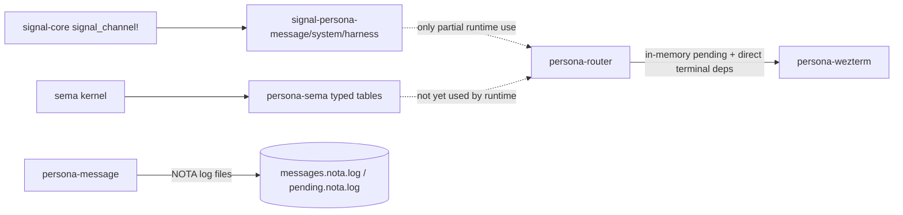
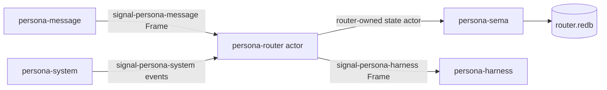

# Recent Code, Signal, and SEMA Audit

Date: 2026-05-09

Role: assistant

## Short Answer

Yes, Signal has a channel macro now. It is
`signal_core::signal_channel!`, a declarative `macro_rules!` macro in
`/git/github.com/LiGoldragon/signal-core/src/channel.rs`. It emits the
paired request/reply enums, channel-local `Frame` and `FrameBody` type
aliases, and `From<payload>` implementations. It does not emit transport,
dispatch, actor code, or process wiring.

SEMA is implemented as the workspace typed-database kernel in
`/git/github.com/LiGoldragon/sema`, and Persona has a typed storage layer in
`/git/github.com/LiGoldragon/persona-sema`.

SEMA is not yet used by the runtime Persona components for their live state.
`persona-sema` itself uses `sema`; the actual daemons and CLIs still mostly use
local NOTA files, in-memory vectors, and direct terminal adapters. The current
state is "substrates and contracts landed; runtime integration is next."

## Audit Basis

I read the workspace discipline again before judging the code: reporting,
autonomous-agent, jj, rust-discipline, contract-repo, micro-components,
beauty, naming, abstractions, push-not-pull, architectural-truth-tests, and
the orchestration protocol.

This is a source-and-history audit. I did not rerun every flake check in the
repos named below; where test counts appear, they come from recent commit
messages or inspected test files.

I also read the recent Signal/SEMA report chain:

| Path | Inline summary |
|---|---|
| `reports/designer/63-sema-as-workspace-database-library.md` | SEMA is the state library; `persona-sema` replaces the shared store actor idea. |
| `reports/designer/64-sema-architecture.md` | SEMA kernel adds schema-version guarded opens and typed tables. |
| `reports/designer/66-skeptical-audit-of-sema-work.md` | Audit corrected `Schema.tables`, legacy-file handling, and `SchemaVersion` privacy. |
| `reports/operator/67-signal-actor-messaging-gap-audit.md` | The old prototype bypassed Signal and durable SEMA state. |
| `reports/designer/76-signal-channel-macro-implementation-and-parallel-plan.md` | `signal_channel!` lands; store channel is later retired. |
| `reports/operator/77-first-stack-channel-boundary-audit.md` | Shared store actor is wrong; each component owns its own state and uses `persona-sema` as a library. |
| `reports/designer/78-convergence-with-operator-77.md` | Designer/operator converge on message/system/harness contracts and no store channel. |
| `reports/operator/83-operator-feedback-on-assistant-orchestration.md` | Router work is explicitly partial; next implementation is router ractor plus `persona-sema` state. |
| `reports/operator/87-architecture-truth-pass.md` | Operator is currently cleaning high-certainty architecture drift across active repos. |

## Recent Touched Repositories

Recent implementation work since 2026-05-08 clusters into four lanes.

| Lane | Repositories | What changed |
|---|---|---|
| Signal kernel and contracts | `/git/github.com/LiGoldragon/signal-core`, `/git/github.com/LiGoldragon/signal-persona-message`, `/git/github.com/LiGoldragon/signal-persona-system`, `/git/github.com/LiGoldragon/signal-persona-harness` | `signal_channel!` landed; three channel contract repos now declare channels with it and have round-trip tests. |
| SEMA kernel and Persona storage | `/git/github.com/LiGoldragon/sema`, `/git/github.com/LiGoldragon/persona-sema` | `Schema`, `SchemaVersion`, `Table<K,V>`, closure-scoped transactions, version guard, and Persona table constants landed. |
| Runtime Persona components | `/git/github.com/LiGoldragon/persona-message`, `/git/github.com/LiGoldragon/persona-router`, `/git/github.com/LiGoldragon/persona-system`, `/git/github.com/LiGoldragon/persona-wezterm` | Message registration, router delivery tests, guarded delivery, Niri focus source, PTY capture, and partial use of system observation types. |
| Apex composition | `/git/github.com/LiGoldragon/persona` | Flake composition imports contract/storage repos; Nix wire-test shims prove a `signal-persona-message` frame round trip, but not router+SEMA persistence yet. |

Other recent repositories such as `/git/github.com/LiGoldragon/horizon-rs`,
`/git/github.com/LiGoldragon/lojix-cli`,
`/git/github.com/LiGoldragon/chroma`,
`/git/github.com/LiGoldragon/chronos`, and CriomOS repos were active too, but
their recent commits are system-specialist or Tier-2 audit work rather than the
Signal/SEMA Persona path.

Operator also has uncommitted architecture-truth cleanup in progress across:

`/git/github.com/LiGoldragon/persona-harness/ARCHITECTURE.md`,
`/git/github.com/LiGoldragon/persona-orchestrate/ARCHITECTURE.md`,
`/git/github.com/LiGoldragon/persona-sema/ARCHITECTURE.md`,
`/git/github.com/LiGoldragon/persona-system/ARCHITECTURE.md`,
`/git/github.com/LiGoldragon/persona-message/ARCHITECTURE.md`,
`/git/github.com/LiGoldragon/persona-router/ARCHITECTURE.md`,
`/git/github.com/LiGoldragon/sema/ARCHITECTURE.md`,
`/git/github.com/LiGoldragon/signal-persona/ARCHITECTURE.md`,
`/git/github.com/LiGoldragon/signal-core/ARCHITECTURE.md`,
`/git/github.com/LiGoldragon/signal/ARCHITECTURE.md`, and
`/git/github.com/LiGoldragon/nexus-cli/ARCHITECTURE.md`.

## Signal Macro Status

`/git/github.com/LiGoldragon/signal-core/src/channel.rs` defines:

```rust
#[macro_export]
macro_rules! signal_channel { ... }
```

The macro input is a paired channel declaration:

```rust
signal_channel! {
    request MessageRequest {
        Submit(SubmitMessage),
        Inbox(InboxQuery),
    }
    reply MessageReply {
        SubmitOk(SubmitReceipt),
        SubmitFailed(SubmitFailed),
        InboxResult(InboxResult),
    }
}
```

The macro emits:

| Emitted item | Status |
|---|---|
| Request enum | Implemented with rkyv archive/serialize/deserialize derives. |
| Reply enum | Implemented with rkyv archive/serialize/deserialize derives. |
| `Frame` alias | Implemented as `signal_core::Frame<Request, Reply>`. |
| `FrameBody` alias | Implemented as `signal_core::FrameBody<Request, Reply>`. |
| `From<payload>` impls | Implemented for each request and reply payload. |
| Transport | Not emitted. |
| Dispatch traits | Not emitted. |
| Actor integration | Not emitted. |

The frame kernel lives in
`/git/github.com/LiGoldragon/signal-core/src/frame.rs`.
`Frame::encode_length_prefixed` writes a 4-byte big-endian length prefix plus
rkyv bytes; `Frame::decode_length_prefixed` validates the length and decodes
the archive.

The macro is used by:

| Repository | Channel |
|---|---|
| `/git/github.com/LiGoldragon/signal-persona-message/src/lib.rs` | `message-cli` -> `persona-router`; `MessageRequest` and `MessageReply`. |
| `/git/github.com/LiGoldragon/signal-persona-system/src/lib.rs` | `persona-system` -> `persona-router`; `SystemRequest` and `SystemEvent`. |
| `/git/github.com/LiGoldragon/signal-persona-harness/src/lib.rs` | `persona-router` <-> `persona-harness`; `HarnessRequest` and `HarnessEvent`. |

There is not a channel derive macro. `/git/github.com/LiGoldragon/signal-derive`
still contains only `#[derive(Schema)]`, which emits `impl signal::Kind for T`;
that crate's own docs say its role is under review because runtime kind
authority moved toward SEMA-resident records.

Small doc drift remains in `signal-core`: comments still mention
`signal-persona-store` and "per-variant constructor methods", and
`tests/channel_macro.rs` still has a stale `FrameEnvelopable` header. The
implementation itself intentionally dropped `FrameEnvelopable`.

## SEMA Status

`/git/github.com/LiGoldragon/sema/src/lib.rs` now has the kernel pieces the
workspace has been asking for:

| Surface | Current status |
|---|---|
| `Schema` | Version-only consumer schema declaration. |
| `SchemaVersion` | Private-field newtype with `new` and `value`. |
| `Sema::open_with_schema` | Creates or opens a database and enforces schema version. |
| Legacy-file guard | Existing redb files without a schema version are refused. |
| `Table<K,V>` | Typed table wrapper over redb, with rkyv encode/decode at the boundary. |
| Transactions | `Sema::read` and `Sema::write` accept closure-scoped transactions. |
| Legacy slot store | Preserved for older consumers, marked as legacy/deprecated where applicable. |

`/git/github.com/LiGoldragon/persona-sema` correctly layers Persona over that
kernel:

| File | Current status |
|---|---|
| `/git/github.com/LiGoldragon/persona-sema/src/store.rs` | `PersonaSema::open` calls `Sema::open_with_schema(path, &SCHEMA)`. |
| `/git/github.com/LiGoldragon/persona-sema/src/tables.rs` | Declares typed `Table<u64, signal_persona::...>` constants such as `MESSAGES`, `OBSERVATIONS`, `DELIVERIES`, and `LOCKS`. |
| `/git/github.com/LiGoldragon/persona-sema/tests/tables.rs` | Writes and reads `signal_persona::Message` and `signal_persona::Observation` through the typed tables. |

So the storage architecture exists as code: SEMA is a library, and
`persona-sema` is the consumer-specific typed layer.

## Runtime Integration Status

The runtime components are not yet using `persona-sema` as their state library.

Evidence:

| Component | Evidence |
|---|---|
| `/git/github.com/LiGoldragon/persona-message` | `Cargo.toml` has no `persona-sema` dependency. `src/store.rs` writes `messages.nota.log` and `pending.nota.log`, scans text, and tails with `thread::sleep(Duration::from_millis(200))`. |
| `/git/github.com/LiGoldragon/persona-router` | `Cargo.toml` has no `persona-sema` dependency. `src/router.rs` keeps `pending: Vec<Message>`, uses NOTA line I/O on a Unix socket, and directly depends on `persona-wezterm`. |
| `/git/github.com/LiGoldragon/persona-router` | `src/delivery.rs` imports `signal_persona_system` observation types, so a slice of the system contract is consumed, but the router is not decoding length-prefixed `signal_core::Frame` traffic yet. |
| `/git/github.com/LiGoldragon/persona-system` | `Cargo.toml` does not depend on `signal-persona-system`; the producer side of the system channel is not wired to the contract yet. |
| `/git/github.com/LiGoldragon/persona-harness` | No `signal-persona-harness` or `persona-sema` dependency yet. |
| `/git/github.com/LiGoldragon/persona` | `flake.nix` imports `persona-sema` checks, but `Cargo.toml` only has `signal-core` and `signal-persona-message` for wire-test shims. `TESTS.md` explicitly says the current wire test does not write a redb file through `persona-sema`. |

Current implementation graph:



Intended graph:



## Why Runtime SEMA Is Not There Yet

The main reason is sequencing, not disagreement.

The workspace just converged away from a shared `persona-store` actor. The new
shape is:

1. `sema` is the generic typed-database kernel.
2. `persona-sema` is the Persona schema/table library.
3. Each state-bearing component owns its actor, write ordering, and redb file.
4. Signal channel contracts land before component implementation.

That convergence happened through `reports/designer/76-*`,
`reports/operator/77-*`, and `reports/designer/78-*`. Since then, the code has
mostly landed the substrates: macro, contracts, SEMA kernel, and `persona-sema`.
The runtime migration remains open.

Open BEADS already reflect that:

| BEADS task | Meaning |
|---|---|
| `primary-2w6` | `persona-message` migrates off text files and polling onto `persona-sema`. |
| `primary-186` | Persona daemons adopt ractor. |
| `primary-3fa` | Focus/input-buffer observation contracts converge. |
| `primary-28v` | Channel naming sweep from verb-form commands to noun-form records. |
| `primary-b7i` | Message body string migrates to typed Nexus record. |
| `primary-nyc` | Add `Table::iter` to SEMA. |
| `primary-4zr` | SEMA hygiene batch: split `lib.rs`, namespace meta tables, move `reader_count`, add open mode. |

## Next Implementation Order

The next high-leverage implementation path is narrow:

1. Make `persona-message` send `signal-persona-message::Frame` bytes to
   `persona-router`, not local daemon envelopes or text logs.
2. Make `persona-router` receive and decode the message channel frame.
3. Introduce the router-owned state actor and route writes through
   `persona-sema`.
4. Add the architectural-truth test already sketched in
   `/git/github.com/LiGoldragon/persona/TESTS.md`: emit frame -> router commit
   -> read redb through `persona-sema` -> reply frame.
5. Remove direct terminal adapter ownership from router when
   `signal-persona-harness`/`persona-harness` takes the delivery boundary.
6. Replace polling/tail behavior with push/subscription behavior.

The first passing architectural witness should prove:

```text
signal-persona-message frame
-> persona-router actor
-> router-owned state actor
-> persona-sema typed table
-> router.redb
-> signal-persona-message reply frame
```

Until that test exists, a behavior-only test can still pass while secretly
using the old text-file or in-memory path.

## Verdict

Signal macros: implemented and used in contract repos.

SEMA as library: implemented in `sema`, consumed by `persona-sema`, tested at
the typed table layer.

SEMA inside runtime components: not yet. The runtime still carries prototype
state paths. That is now the central remaining gap between the architecture and
the code.
