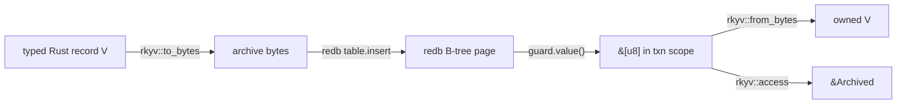

# rkyv + redb Design Research for Sema

Date: 2026-05-09

Role: assistant

## Executive Summary

The rkyv/redb combination is a good fit for Sema if the boundary is kept
sharp:

- redb owns persistence, ACID transactions, MVCC, B-tree ordering, table
  identity, and crash recovery.
- rkyv owns typed value encoding, validation, and optional zero-copy access to
  archived bytes.
- Sema should own the integration contract: stable table constants, rkyv format
  choices, schema/version guard, typed errors, transaction scope, and the rule
  that redb keys are stable query keys while rkyv values are archived records.

The current Sema shape is mostly aligned: `Table<K, V>` wraps a redb
`TableDefinition<K, &[u8]>`, values are rkyv-encoded at insert and
rkyv-decoded at get, transactions are closure-scoped, and rkyv format features
are explicitly pinned to `little_endian`, `pointer_width_32`, and `unaligned`.

The next design work is not "use rkyv more." It is:

1. Add an explicit database header / format record.
2. Add typed table materialization and table-identity witnesses.
3. Add `Table::iter` / `range` / maybe prefix iteration.
4. Keep rkyv out of redb keys unless a key type has a deliberately tested total
   ordering.
5. Treat zero-copy as an optional read-path optimization, not the default API.
6. Make corruption and migration failures hard typed errors, never defaults.

## Source Basis

Primary docs:

| Source | What matters |
|---|---|
| <https://docs.rs/redb/latest/redb/> | redb is an embedded ACID key-value store with copy-on-write B-trees, MVCC, crash safety, savepoints, and typed tables. |
| <https://docs.rs/redb/latest/redb/struct.Database.html> | Multiple reads can run concurrently with one writer; only one write transaction may be active. |
| <https://docs.rs/redb/latest/redb/struct.TableDefinition.html> | A table definition is a name plus key/value types. |
| <https://docs.rs/redb/latest/redb/trait.Value.html> | redb `Value` can be a view over bytes or owned type; `from_bytes` cannot return a typed error. |
| <https://docs.rs/redb/latest/redb/trait.Key.html> | redb keys require a total ordering over encoded bytes. |
| <https://docs.rs/redb/latest/redb/enum.Durability.html> | `Durability::Immediate` means persistence when commit returns; `None` delays persistence until a later immediate commit. |
| <https://docs.rs/rkyv/latest/rkyv/> | rkyv is a zero-copy deserialization framework; format control features can change serialized bytes; compatibility depends on schema, format features, and semver-compatible rkyv. |
| <https://docs.rs/rkyv/latest/rkyv/fn.to_bytes.html> | `to_bytes` serializes to an `AlignedVec`. |
| <https://docs.rs/rkyv/latest/rkyv/fn.from_bytes.html> | `from_bytes` is the safe high-level bytecheck+deserialize path. |
| <https://docs.rs/rkyv/latest/rkyv/fn.access.html> | `access` safely validates and returns an archived view. |
| <https://rkyv.org/faq.html> | Untrusted archive access requires validation or another integrity mechanism. |
| <https://rkyv.org/zero-copy-deserialization.html> | rkyv's zero-copy win comes from accessing archive layout directly, not from converting to owned Rust values. |

External code inspected:

| Project | Link | Evidence level |
|---|---|---|
| Overdrive | <https://github.com/overdrive-sh/overdrive/blob/570cefbb288ffee861d7ef894d3a3f51bd2a4c21/crates/overdrive-store-local/src/observation_backend.rs> | Strongest production-intent example found: public product repo, self-described workload orchestration platform, redb-backed local observation store, rkyv archived rows. |
| Keriox | <https://github.com/THCLab/keriox/blob/ddcd2aba2de6199ec776ea5b1affdf5819dca410/keriox_core/src/database/redb/loging.rs> | Protocol implementation using redb tables/multimaps plus rkyv bytes for KERI event log data. Production deployment not independently proven. |
| Korrosync | <https://github.com/szaffarano/korrosync/blob/9270bcfcfbd747574bb87b829d96b820084e645d/src/service/serialization.rs> and <https://github.com/szaffarano/korrosync/blob/9270bcfcfbd747574bb87b829d96b820084e645d/src/service/db/redb.rs> | Small sync server; implements `redb::Value` and `redb::Key` for a generic `Rkyv<T>` wrapper. Useful as a design contrast. |
| Kaizen | <https://github.com/marquesds/kaizen/blob/084507cb11ab3cc7a449b81f46ecefd71cd89360/src/store/hot_log.rs> | Self-hostable observability tool; uses rkyv append records plus redb indexes, not redb as the only value store. |
| Lithos | <https://github.com/JackMatanky/lithos/blob/781e1718e464a4ebe8106752b87d8ddc36feb1a4/lithos-core/src/db/writer.rs> | Not production evidence, but useful API precedent for closure-scoped batching and read-write units of work. |
| Gather Step | <https://github.com/thedoublejay/gather-step/blob/5fe44c8e4e529f05a07c294d92ed554c5190ed70/crates/gather-step-storage/src/adjacency_blob.rs> | Useful caution: rkyv blob format is tested, but comments say production redb persistence is not wired yet. |

I did not find a large, mature, widely deployed OSS project whose public docs
prove production use of both redb and rkyv together. The strongest direct case
is Overdrive. The rest are live code examples with varying deployment evidence.

## The Correct Mental Model

redb and rkyv overlap in one place: bytes. Everything else is distinct.



The safe baseline is:

- write: typed value -> `rkyv::to_bytes` -> redb value bytes;
- read: redb value bytes -> `rkyv::from_bytes` -> owned typed value;
- zero-copy read: redb value bytes -> `rkyv::access` -> archived view with a
  lifetime tied to the redb access guard and transaction.

That last path is only worth exposing when a caller needs to inspect a large
value without allocating. It is not the default Sema API.

## redb Constraints That Matter

redb's table type is `TableDefinition<K, V>`, where both `K` and `V` implement
redb's traits. The table definition is not just a string; it is a string plus
types. This validates the Sema design choice from the earlier schema audit:
schema cannot be just a list of table names. The key and value type matter.

redb keys require a total order over encoded bytes. This is good for primitive
keys like `u64`, `&str`, fixed byte arrays, and hand-designed composite byte
keys. It is dangerous for arbitrary rkyv archive bytes, because archive layout
does not automatically encode the semantic ordering wanted by an index.

redb values are accessed through guards. `AccessGuard::value()` gives a view
whose validity is scoped to the guard. That means any zero-copy archived view
must stay inside the read transaction's lifetime. If Sema returns owned values,
it can hide that. If Sema returns archived values, its API must carry the guard
lifetime explicitly.

redb permits multiple concurrent readers and one writer. A write transaction
blocks while another writer is active. Any read-compare-write invariant belongs
inside a single write transaction. Producer notifications should happen only
after commit returns.

redb has explicit durability. For Sema's default correctness posture,
`Durability::Immediate` is the default mental model. Durability weakening should
be an explicit consumer policy, not a hidden kernel default.

## rkyv Constraints That Matter

rkyv's compatibility promise is narrower than "Rust type derives Archive
forever." Serialized data is readable later only if:

- the schema has not changed;
- rkyv format-control features have not changed;
- the rkyv crate version is semver-compatible.

This makes Sema's schema guard non-negotiable. A persisted Sema database should
record not only the consumer schema version but also the Sema/rkyv format
identity used to write bytes.

rkyv validation is not optional for database bytes. redb protects the file's
transactional structure; it does not prove that the value bytes match the Rust
archive type currently being requested. The correct public path is
`rkyv::from_bytes` or `rkyv::access`, not unchecked access.

rkyv alignment matters. If archive bytes are stored as redb `&[u8]`, redb does
not promise the returned slice has the alignment needed by aligned rkyv formats.
There are two safe patterns:

1. Pin rkyv to `unaligned` format and decode/access unaligned archive bytes.
2. Copy `guard.value()` into `rkyv::util::AlignedVec<N>` before validation or
   access.

Sema currently chooses the first path:

`/git/github.com/LiGoldragon/sema/Cargo.toml` uses rkyv features
`std`, `bytecheck`, `little_endian`, `pointer_width_32`, and `unaligned`.

That is the right default for storing rkyv archives inside redb value pages.

## Patterns Found in External Projects

### 1. Overdrive: rkyv Values as redb Bytes

Overdrive's local observation store defines redb tables like:

```rust
const ALLOC_STATUS_TABLE: TableDefinition<&[u8], &[u8]> =
    TableDefinition::new("observation_alloc_status");
```

It stores rkyv-archived row values under canonical byte keys. It runs
last-write-wins comparison inside one redb write transaction and emits
subscription events only after the commit succeeds.

Important lessons:

- Keep indexes explicit: the key is canonical application identity bytes.
- Store values as rkyv bytes, not JSON.
- Run read-compare-write invariants inside the write transaction.
- Notify subscribers after commit, not before.
- In async contexts, run redb work in `spawn_blocking`.
- If using aligned rkyv, copy redb bytes into `AlignedVec` before decoding.
- The code comments explicitly call out the missing Phase 1 schema version as a
  temporary weakness.

This is the closest public match to Persona's desired router state actor:
state is local, typed, durable, and emits post-commit observations.

### 2. Keriox: Digest Keys, redb Tables and Multimaps, rkyv Values

Keriox stores KERI event data in redb tables and multimaps. Event digest bytes
are keys; event/signature/seal values are serialized with `rkyv::to_bytes`.

Important lessons:

- Content-derived keys are a clean fit for redb.
- Multimaps are useful for one-to-many relationships like event -> signatures.
- Transaction helper functions keep write transaction ownership explicit.
- rkyv is a value encoding, not an index strategy.

For Sema, this supports keeping content hash / slot indexes as redb-native keys
and storing full records as rkyv values.

### 3. Korrosync: Implement `redb::Value` for `Rkyv<T>`

Korrosync takes the more integrated route: it defines `Rkyv<T>` and implements
`redb::Value` for it. Then tables can be declared as:

```rust
const USERS_TABLE: TableDefinition<&str, Rkyv<User>> =
    TableDefinition::new("users-v2");
```

It also implements `redb::Key` for `Rkyv<T>` where `T: Ord`, by deserializing
both byte slices and comparing the owned values.

Important lessons:

- This is ergonomic at call sites.
- It pushes serialization behind redb's `Value` trait.
- It is not ideal for Sema's kernel, because `redb::Value::from_bytes` cannot
  return a typed error. Korrosync falls back to `Default` on validation or
  deserialization failure. Sema must not do that.
- rkyv-backed keys can be expensive because comparison may deserialize during
  B-tree operations. That is acceptable only for very small key spaces and
  deliberately tested key types.

Sema's current `Table<K, V>` wrapper around `TableDefinition<K, &[u8]>` is the
better kernel design because `Table::get` can return `Result<Option<V>>` and
surface rkyv failures.

### 4. Kaizen: Append-Only rkyv Log, redb Indexes

Kaizen's HOT log stores rkyv event records in an append-only file with magic,
version, lengths, and CRC. redb stores indexes such as session metadata and
sequence offsets.

Important lessons:

- redb does not have to hold every byte.
- Large append-only logs can be better as append files plus redb indexes.
- Magic/version/CRC at the blob layer make replay robust.
- Batching index writes and fsyncs is a meaningful performance tool.

For Sema, this argues that huge artifacts or append-heavy transcript streams
should not automatically be rkyv values inside redb. Sema can store indexes and
small typed state; blob-sized data belongs in Arca or a domain append log.

### 5. Lithos: Closure-Scoped Write and Read-Write Units

Lithos wraps redb with `put`, `batch_write`, and `read_write_unit_of_work`.
This is not evidence of production, but the API shape is directly relevant.

Important lessons:

- The database wrapper should make transaction lifetime explicit and short.
- Batch writes should be one commit.
- Read-modify-write should be a named unit of work, not a read transaction
  followed later by a write transaction.

Sema already has `Sema::read` and `Sema::write`; adding typed helper patterns
for common read-modify-write operations may be useful, but the closure-scoped
shape is already correct.

### 6. Gather Step: rkyv Blob Before Production Wiring

Gather Step's adjacency blob has good rkyv API design: `to_bytes`,
`from_bytes`, and `access`, plus validation tests. But the file itself says the
production redb persistence path is not wired yet.

Important lesson:

- A tested rkyv blob is not the same as an integrated storage architecture.
- Sema tests need redb fixtures and component paths, not just rkyv round trips.

## Design Implications for Sema

### Keep the Current Value Storage Shape

Current Sema:

```rust
pub struct Table<K, V>
where
    K: redb::Key + 'static,
{
    name: &'static str,
    _key: PhantomData<K>,
    _value: PhantomData<V>,
}

fn definition(&self) -> TableDefinition<'_, K, &'static [u8]> {
    TableDefinition::new(self.name)
}
```

This is right. It lets Sema:

- keep redb key ordering native;
- treat stored values as archive bytes;
- return typed `Error::Rkyv` on invalid values;
- centralize rkyv feature choices;
- avoid `redb::Value::from_bytes`'s no-error-return trap.

Do not replace this with a blanket `impl redb::Value for Rkyv<T>` in the
kernel.

### Do Not Store Arbitrary rkyv Archives as redb Keys

Sema keys should be one of:

- `u64` slots;
- fixed-size byte arrays for hashes;
- `&str` / `String` for human names where lexical order is correct;
- hand-designed composite key bytes with tests proving order;
- small newtypes that implement redb `Key` with explicit byte ordering.

Avoid `Table<Rkyv<T>, V>` as a general pattern. It makes B-tree ordering depend
on deserializing values during comparison or on archive byte layout. Neither is
a good kernel invariant.

### Add a Database Header Record

Sema currently guards the consumer schema version. That is not enough for
long-lived databases.

Add a meta record something like:

```rust
struct DatabaseHeader {
    magic: [u8; 4],              // "SEMA"
    sema_format_version: u32,
    consumer_schema_version: u32,
    rkyv_major: u16,
    rkyv_minor: u16,
    rkyv_little_endian: bool,
    rkyv_pointer_width: u8,      // 16, 32, or 64
    rkyv_unaligned: bool,
}
```

The exact field set can be refined, but the database should name its rkyv
format-control choices. rkyv docs explicitly say format-control feature changes
can make previous data unreadable.

### Materialize Typed Tables on Open

The previous audit was right that `Schema` cannot own a bare string table list.
But consumers should still be able to materialize and witness their actual
typed table set.

Instead of:

```rust
Schema { version, tables: &["messages"] }
```

Prefer:

```rust
pub struct PersonaSema {
    sema: Sema,
}

impl PersonaSema {
    pub fn open(path: impl AsRef<Path>) -> Result<Self> {
        let sema = Sema::open_with_schema(path.as_ref(), &SCHEMA)?;
        sema.write(|txn| {
            MESSAGES.ensure(txn)?;
            OBSERVATIONS.ensure(txn)?;
            DELIVERIES.ensure(txn)?;
            Ok(())
        })?;
        Ok(Self { sema })
    }
}
```

This preserves the "table identity is typed" correction while avoiding a
surprise first-write table creation path.

### Add `Table::iter` and `Table::range`

Open BEADS already has `primary-nyc`: add `Table::iter` to Sema. Research
supports that. redb is a B-tree store; Sema should expose typed iteration and
range scans instead of making consumers re-open raw redb tables.

Baseline:

- `Table::iter(&ReadTransaction) -> Result<Vec<(KOwned, V)>>`
- `Table::range(...) -> Result<Vec<(KOwned, V)>>`

The first version can eagerly collect owned values so no redb guard escapes the
transaction. A later zero-copy archived iterator can be designed if profiling
proves need.

### Keep Async Out of Sema Kernel

redb is synchronous. If a runtime uses Tokio, it should wrap blocking database
work at the actor boundary, as Overdrive does with `tokio::task::spawn_blocking`.

Sema should stay synchronous. Persona actors can decide whether to run the Sema
handle on a blocking task, a dedicated writer actor, or a single thread.

### Emit After Commit

Push-not-pull for Persona means:

1. receive command/event;
2. open write transaction;
3. validate and write typed tables;
4. commit;
5. emit subscription event / reply / downstream delivery.

Never emit before the redb commit. Overdrive's local observation store is a
good external precedent: subscribers only receive rows after persistence
succeeds.

### Make Invalid Bytes Loud

Bad examples default on decode failure. That is unacceptable for Sema.

Sema should:

- return typed `Error::Rkyv` on invalid archive bytes;
- include table name and key in higher-level errors where practical;
- have corruption tests that write invalid bytes into redb and assert hard
  failure;
- never synthesize `Default` values on decode failure.

### Decide What Belongs Outside redb

redb+rkyv is excellent for small to medium typed records, current-state tables,
indexes, and transactionally updated domain state.

It is not automatically right for:

- giant blobs;
- transcript streams;
- high-frequency append logs;
- data whose primary operation is sequential replay.

For those, use:

- Arca/content-addressed artifact store;
- append-only domain log plus redb indexes;
- redb table storing hash/slot/offset records only.

Kaizen's append log plus redb offset indexes is the relevant precedent.

## Concrete Sema API Recommendations

### 1. Split the Kernel

Current `src/lib.rs` is doing too much. Split when editing next:

```text
src/
|-- error.rs
|-- schema.rs
|-- store.rs
|-- table.rs
|-- codec.rs
`-- slot.rs
```

This aligns with current `ARCHITECTURE.md`'s own "split past ~300 LoC" note and
will make trait bounds readable.

### 2. Centralize rkyv Bounds

The current `Table<K,V>` bounds are verbose. Put them behind a local trait:

```rust
pub trait SemaValue:
    Archive
    + for<'a> Serialize<...>
where
    Self::Archived: Deserialize<Self, ...> + CheckBytes<...>,
{
}
```

Or a sealed `ArchiveCodec<V>` helper. The goal is not abstraction for its own
sake; it is to keep table operations legible and make all rkyv policy live in
one file.

### 3. Add `Table::ensure`

```rust
impl<K, V> Table<K, V> {
    pub fn ensure(&self, txn: &WriteTransaction) -> Result<()> {
        let _ = txn.open_table(self.definition())?;
        Ok(())
    }
}
```

Consumer typed layers call this on open for every table they own.

### 4. Add Iteration

Add eager owned iteration first:

```rust
pub fn iter(&self, txn: &ReadTransaction) -> Result<Vec<(K::Owned, V)>>;
```

The exact key-owned type needs design because redb's `Key::SelfType<'a>` is
lifetime-parametric. If that gets awkward, start with value-only scans for
specific table types or require an explicit key conversion trait.

### 5. Add Corruption and Format Witness Tests

Minimum test set:

| Test | What it proves |
|---|---|
| invalid_rkyv_value_fails_loudly | Sema does not default or silently skip corrupt bytes. |
| schema_version_mismatch_refuses_open | Consumer upgrades are coordinated. |
| rkyv_format_header_mismatch_refuses_open | Format-control feature drift is caught. |
| table_identity_is_typed | Same name with different key/value type is not treated as same schema. |
| read_modify_write_is_atomic | Invariant logic runs inside one write transaction. |
| post_commit_event_order | Runtime actor emits only after Sema commit. |

### 6. Keep Persona's First Runtime Integration Narrow

For Persona, do not start with generic storage framework work. The first
runtime path should be:

```text
signal-persona-message Submit
-> persona-router actor
-> router-owned write transaction
-> persona-sema::tables::MESSAGES.insert(...)
-> commit
-> signal-persona-message SubmitOk
-> post-commit subscription/delivery event
```

That path should have a Nix-chained architectural truth test where a separate
reader opens the redb file through `persona-sema` and sees the message.

## What This Means for Current Sema

Current good decisions:

- `Table<K,V>` wraps redb `TableDefinition<K, &[u8]>`, not `Rkyv<T>` as a redb
  value.
- rkyv format features are explicit and use `unaligned`.
- `SchemaVersion` is a private-field newtype.
- `open_with_schema` hard-fails legacy files without a schema version.
- Transactions are closure-scoped.
- Runtime write ordering is assigned to component actors, not Sema.

Current gaps:

- No database header naming rkyv format-control choices.
- No typed table materialization on consumer open.
- No `Table::iter` / range API.
- No table-name/type witness beyond redb's open behavior.
- Error context on decode failure does not name table/key.
- `ARCHITECTURE.md` still has a couple stale "schema owns table list" phrases,
  even though the code and later report chain corrected this.

## Recommendation

Do not redesign Sema away from its current kernel shape. Strengthen it.

The most defensible Sema design is:

```text
Sema
  owns redb lifecycle, header, schema guard, typed table wrapper,
  rkyv encode/decode policy, and closure-scoped transactions.

<consumer>-sema
  owns schema version, typed table constants, table materialization,
  and migrations.

consumer runtime actor
  owns ordering, read-modify-write invariants, commit-before-effect,
  and push subscriptions.
```

That is consistent with the best external example (Overdrive), avoids the
error-hiding trap of generic `redb::Value` wrappers, and preserves the
workspace rule that state is typed, durable, inspectable, and owned by the
component whose behavior it records.
