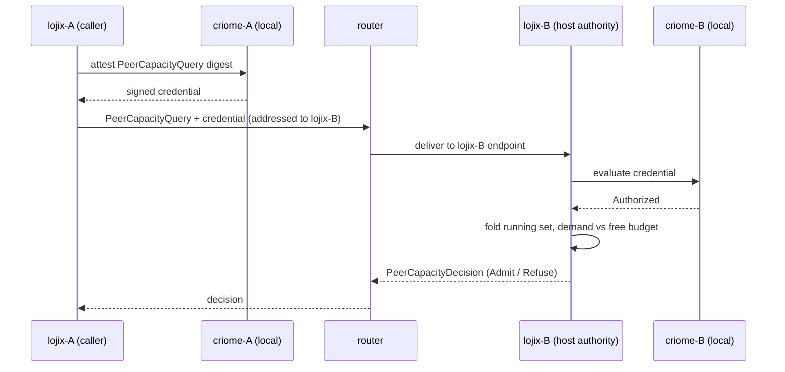
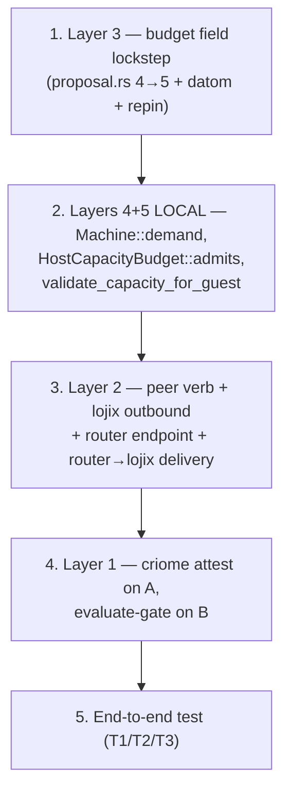

# 1 — Capacity-admission vertical slice

## Intent Anchors

[Enforcement is runtime, daemon-to-daemon. Each component acts through its own
lojix daemon; the local daemon is authoritative for its own local state; a
request travels from one daemon to another through the router; criome
authenticates the peer. This is finish line C, already decided by the psyche.]

[A host admits a new guest only if the guest's declared demand fits the host's
live free budget, where free = host capacity − Σ declared demand of guests
currently running on that host. Budget frees on stop/reap. Static / eval-time
enforcement is out of scope (confirmed in reports/vmhostCapacityGrounding/2).]

## What a slice is here (methodology)

The workspace vertical-slice rule (the Pocock "traceable bullet" discipline
captured in `reports/operator/461-Research-ai-coding-workflows-matt-pocock.md`
and applied by `skills/bead-weaver.md` §"Shape the Graph"): a slice is **thin
but crosses every integration layer to produce one observable, testable
behavior**, built from the outcome backward — name the final observable
outcome, name the smallest proof, then the prerequisites that ship
independently. The anti-pattern it exists to kill is the horizontal cut
("schema first, transport second, auth last") that delays integrated feedback.
`bead-weaver` adds: a good first slice **exposes unknowns through working
failure — one scaffold, one adapter path, one proof domain, one closeable
verification surface.**

So this slice must do all five layers at once, each reduced to the minimum that
lets one admit/refuse decision flow top-to-bottom, with everything else
explicitly deferred. It must NOT build any layer to completion. The five hard
unknowns it exposes: (1) lojix can get a request OUT and a reply BACK; (2) the
router can carry a lojix-addressed payload to a lojix-daemon endpoint; (3)
criome auth can ride in-band and actually gate; (4) the budget field exists and
decodes; (5) the ledger sums a real running guest and decides correctly.

## The slice — one decision, end to end



The slice scenario is the one real configuration (N=1, from
`reports/vmhostCapacityGrounding/1`): host B is `prometheus`, carrying one
running guest `vm-testing` whose declared demand is 4 cores / 8 GiB / 40 GiB.
The query asks B to admit a *second* guest; B decides against its host budget
minus that one running guest. No second host is required — A, B, and the router
run on one machine in the test; the bytes still cross the router and criome
still verifies a signature B did not issue.

## The five per-layer minimal changes

### Layer 1 — criome remote auth (peer authentication)

**Full feature:** criome on every component, a peer routing table (peer
pubkey → host+unix-user), a peer client, a mutual-auth handshake, criome's own
remote transport (`criome/ARCHITECTURE.md:204-209,277-279,414-462` — design,
not code). Today criome is local-Unix-socket only with real local primitives:
BLS signer (`criome/src/actors/signer.rs:198-234`), verifier that resolves a
signer in the **local** registry and checks revocation/scheme/signature/expiry
(`criome/src/actors/verifier.rs:40-109`), and a local registry
(`criome/src/actors/registry.rs:98-202`).

**Slice change (reuse, do not build transport):** the credential becomes a
**transportable token carried in-band by the router**; criome's own daemon
stays local on both ends. lojix-A asks its co-resident criome to **attest** the
outbound query (sign over the request digest + a replay nonce); lojix-B asks
its co-resident criome to **evaluate** the carried credential before admitting
the request to the ledger. Both calls reuse the existing local client
`criome::transport::CriomeClient::from_environment().send(CriomeRequest) ->
CriomeReply` (`criome/src/transport.rs:220,227`) — exactly the co-resident
local-gate pattern spirit already uses (`spirit/src/criome_gate.rs`, "1-of-1
LOCAL criome gate over the per-user Unix socket"). The credential and decision
travel in the existing signal-criome vocabulary already imported by that gate
(`SignalCallAuthorization`, `Evidence`, `ReplayNonce`, `EvaluationDecision`,
`Identity`). B's local registry is **pre-seeded** with A's identity pubkey for
the slice. Net-new criome code: zero new transport — just the request/reply
shaping for "attest-this-digest" / "evaluate-this-credential". `EvaluationDecision`
must be `Authorized` or B refuses before any capacity math runs.

The "cross-host transport" the layer nominally owns is satisfied by piggybacking
on the router (Layer 2). That is the load-bearing thinning move: criome supplies
the *signature*, the router supplies the *wire*.

### Layer 2 — lojix ↔ router daemon mesh (outbound transport + peer verb)

**Full feature:** lojix becomes a full router peer, bidirectional, every verb
routable, a general lojix-over-router payload contract. Today lojix is
local-only and inbound-only: the client dials local Unix sockets only
(`lojix/src/client.rs:22-25,48` — the only `connect(` in lojix), the daemon
binds two local Unix listeners and never opens an outbound connection
(`lojix/src/daemon.rs:85-112`), and the request type is only
`SignalInput::{OrdinaryInput,MetaInput}` with one work item
`NexusWork::SignalArrived` (`lojix/src/schema/nexus.rs:62-64,403-404`) — no
peer/forward variant. The router is a working daemon→daemon fabric but for
Persona `signal-message` only: outbound `RouterPeerDelivery` over TCP
(`router/src/peer_delivery.rs:97-119`, `TcpStream::connect` `:110`), peer table
`RemoteRouterRegistry` (`router/src/remote_router.rs:60-67`), inbound
`TailnetForwardIngress` (`router/src/router.rs:341-421`).

**Slice change — three minimal seams:**

1. **One new peer verb** in signal-lojix's Ordinary contract — the
   `OrdinaryInput` enum at `signal-lojix/src/schema/lib.rs:675`, which
   `signal-lojix/src/lib.rs:4` already calls the **"peer-callable read /
   observe / subscribe surface"**: a `PeerCapacityQuery { guest_demand,
   credential }` request and a `PeerCapacityDecision { Admit | Refuse(reason) }`
   reply, the refusal reusing the typed-rejection path beside the existing
   `QueryRejectionReason` (`signal-lojix/src/schema/lib.rs:581`). One verb, one
   reply — not a general lojix-over-router contract.

2. **One outbound path** in the lojix daemon — the analogue of router's
   `RouterPeerDelivery`: lojix-A writes the `PeerCapacityQuery` frame to the
   router and reads back one `PeerCapacityDecision`. This is the first byte
   lojix ever sends outbound.

3. **The router carries it.** The router treats the lojix peer-request as an
   **opaque payload addressed to a registered lojix-daemon endpoint** — it does
   not learn lojix semantics. Net-new: one `RemoteRouterRegistry` entry mapping
   lojix-B's endpoint identity to its delivery socket, plus one **router →
   lojix-daemon local delivery hop** (the router today delivers to Persona
   working/meta sockets; the slice adds delivery to a lojix daemon socket). The
   router stays a dumb pipe.

This is the literal **daemon→router→daemon** path. (Topology — one router vs
two routers reusing the existing router↔router TCP hop — is Fork 2 below.)

### Layer 3 — VmHost capacity field (NOTA arity 4 → 5, lockstep)

**This layer is irreducible** — the report-2 ROOT-A lockstep IS the minimal
change; it cannot be sub-divided, because the arity-4 `VmHost` datom is live on
goldragon main and decode is count-strict (`expect_service_arity(... 4)` at
`horizon-rs/lib/src/proposal.rs:449`), so any 5th field forces all three edits
to move together or the daemon hard-errors on decode.

**Slice change:** add a typed `HostCapacityBudget { cores: u32, ram_gb: u32,
disk_gb: u32 }` as the 5th field of `NodeService::VmHost`
(`horizon-rs/lib/src/proposal.rs:153-167`), threaded through `to_nota`
(`:401-406`), `from_nota` (arity `4`→`5` at `:448-454`), `VmHostCapability`
(`:223`), and the `vm_host()` accessor (`:343-355`); author it on prometheus's
`VmHost` in `repos/goldragon/datom.nota:97`; repin lojix's horizon-lib in
`Cargo.lock` to the arity-5 rev (`cargo update -p horizon-lib`, from `8d6cbc6`).
One named record, not three loose optionals (typed-records-over-flags). The
slice authors the budget on the **one** host — that is already N=1 reality, not
a thinning shortcut.

### Layer 4 — guarantee per-guest demand (the thin guard, not the type change)

**Full feature (report-2 Fork B, the beauty-true fix):** make `TestVm`
`ram_gb`/`disk_gb` type-required — another breaking `Machine` arity change
moving every `Machine` datom + pin. Today `Machine`
(`horizon-rs/lib/src/machine.rs`) has `cores: u32` required (`:17`) but
`ram_gb`/`disk_gb` `Option` (`:49,:60`).

**Slice change (daemon-local, non-breaking):** a `Machine::demand()` method that
returns a typed `GuestDemand { cores, ram_gb, disk_gb }` only when all three are
present, and a typed refusal `NoGuestDemand` when either optional is absent. The
guarantee the slice needs is "the sum is sound" — enforced at the ledger seam,
not in the type system. The one real guest authors 8/40, so the happy path is
live; the guard is what makes a future unauthored guest refuse instead of
fabricating the silent Nix `or 2`/`or 20` fallbacks
(`CriomOS/modules/nixos/test-vm-host.nix:206-208`). Defer the type-required
Machine arity move to the real feature.

### Layer 5 — the ledger (recompute, not a persisted tally)

**Full feature:** a persisted host-keyed occupancy table, startup reconcile, an
explicit free-on-stop/reap hook, out-of-band-stop reconciliation against live
host state (report-2 Fork A). The crux from report-2 Item 3: **lojix has no
live source of truth for "which guests run on host H"** — none of its six
durable tables is host-keyed-running; the only structure recording a guest's
Started/Stopped lifecycle is `container-lifecycle` (`lojix/src/lib.rs:47-52`),
keyed by event-log position, not host.

**Slice change (recompute-per-placement, no new table):** at admission, **fold
`container-lifecycle` Started−minus−Stopped for host H** into the running set,
sum each running guest's `Machine::demand()`, and decide:

```text
free   = host.vm_host().host_budget − Σ running.demand()    ; per resource
admit if demand.cores ≤ free.cores ∧ demand.ram_gb ≤ free.ram_gb
                                   ∧ demand.disk_gb ≤ free.disk_gb
else refuse HostCapacityExceeded
```

The arithmetic lives on the data types as methods, not free functions
(abstractions / rust-methods): `HostCapacityBudget::admits(demand, used)` and
`Machine::demand()`. The decision attaches as a **sibling of
`ClusterProjection::validate_host_for_node`** (`lojix/src/schema_runtime.rs:475-488`),
reading the host the same way `host_set_of` already does (`:494-505`). It sits
**beside** the existing concurrency cap `at_capacity()` (`daemon.rs:558`), which
answers a different question and is not retired. Recompute earns **free-on-stop
for free**: a Stopped transition simply drops the guest from the next fold, so
the slice writes no freeing code. New typed rejection `HostCapacityExceeded`
joins the rejection enum (triad: signal-lojix / meta-signal-lojix).

## The end-to-end test

One named stateful integration test (per `skills/testing.md`, a `-test` named
output, not a pure flake check) that spins lojix-A, lojix-B, the router, and
two co-resident criome daemons on loopback. Fixtures: B's cluster projection
carries prometheus's `VmHost` with a `HostCapacityBudget` and one running guest
`vm-testing` (4 / 8 / 40) seeded as a `container-lifecycle` Started transition;
B's criome registry pre-seeded with A's identity pubkey.

Three assertions — the slice's closeable verification surface:


T1 and T2 witness the capacity decision flowing daemon→router→daemon over a
real running guest. **T3 is the architectural-truth test** (per
`skills/architectural-truth-tests.md`): it proves criome actually *gates* —
that the auth layer is load-bearing, not decorative — by sending a bad
credential and asserting B refuses *before* the ledger runs. Without T3 the
slice could pass with auth silently bypassed.

## Build order

Vertical, getting to a running end-to-end as fast as the hard dependencies
allow; each step independently witnessed.



1. **Budget field first** — the breaking schema change everything compiles
   against; hardest to retrofit. Witness: lojix decodes the arity-5 prometheus
   datom and reads the budget.
2. **Local decision** (layers 4 + 5 as methods, no networking) — the **proof
   domain**: a pure unit test asserts admit + refuse + `NoGuestDemand`-refuse
   over one running guest. The decision is provably correct before a byte moves.
3. **Transport** — the peer verb + lojix outbound + router carry + router→lojix
   delivery. Witness: two daemons + router, **unauthenticated**, admit/refuse
   routes end-to-end. (End-to-end is reached here.)
4. **Auth** — A attests, B evaluate-gates before the ledger; bad credential
   refuses. Witness: T3 goes red→green while T1/T2 still pass.
5. **The integration test** — T1/T2/T3 as the lane's closeable verification
   surface.

Note this is deliberately *not* the conceptual dependency order
(criome→mesh→field→demand→ledger); the slice builds the **decision proven local
first, then wired out, then hardened** so integrated feedback arrives at step 3,
not at the end.

## Deferred to "real features" after the slice

- **criome propagation to all components** (spirit, orchestrate, mentci, …) —
  the slice wires only lojix-A (attest) and lojix-B (evaluate).
- **criome's own remote transport / peer routing table / peer client /
  mutual-auth handshake** — the slice carries the credential in-band over the
  router; criome stays local-socket on both ends.
- **Real peer-key distribution / cluster-root admission of peers / revocation
  propagation** — the slice pre-seeds B's registry with A's pubkey.
- **Persisted host-keyed occupancy tally + startup reconcile + out-of-band
  stop/reap reconciliation against live host state** (report-2 Fork A) — the
  slice recomputes from `container-lifecycle`, sound only for lifecycle lojix
  itself drove.
- **ROOT-B as a type-required `Machine` arity change** (report-2 Fork B) — the
  slice uses the daemon-local `NoGuestDemand` guard; the silent Nix `or 2`/`or
  20` fallbacks survive until then.
- **Production `Deploy`-path placement** (report-2 Fork E) — the slice rides the
  test-VM seam (`validate_host_for_node` sibling); the production deploy path
  has no placement decision at all today and grows one later.
- **Budget replacing the `maximum_guests` count ceiling** (report-2 Fork C) —
  the slice's budget sits beside the existing count cap; retiring `maximum_guests`
  is a separate cleanup.
- **A general lojix-over-router payload contract / lojix as a full router peer
  for every verb** — the slice carries one payload (`PeerCapacityQuery`) to one
  endpoint kind (lojix daemon).
- **Two-host / real Tailnet topology + the router↔router `RouterPeerDelivery`
  TCP hop in the slice path** — see Fork 2; the existing fabric scales the slice
  to multi-host later, unchanged.
- **Track A reframe coordination** (`Test`→`DeployContained`/`VmHostGuest`
  waves, the churning rejection enums) — a landing concern; see Fork 1.

## Psyche forks before the slice can be built

**Fork 1 — coordination / ownership (HARD blocker, answer first).**
system-designer holds active locks on `lojix`, `goldragon`, `signal-lojix`,
`meta-signal-lojix`, and `CriomOS` (`orchestrate/system-designer.lock`, per
report-2 Item 5) and is mid-reframe of the lojix verb surface and rejection
enums (Track A). This slice edits all of them: a new verb in signal-lojix, the
ledger + outbound transport in lojix, the budget datom in goldragon. It **cannot
be built under another lane's locks** without a decision: fold the slice into
system-designer's Track A arc (it owns the moving placement seam and all the
locks — avoids contention and seam churn) **vs** run it as a separate
coordinated lockstep handed off wave-by-wave against Track A (parallel, but
risks rebasing the ledger onto a moving seam). No edit is authorized until this
is settled.

**Fork 2 — router topology for the slice.** Does "through the router" in the
slice's proof require the existing **router↔router TCP hop** (`RouterPeerDelivery`),
or is one router enough? *Single router* (recommended): lojix-A → one router →
lojix-B — literal daemon→router→daemon, thinnest, but the existing
router↔router TCP fabric sits unused in the slice path (it is proven by the
signal-message tests and reused unchanged when the slice scales to two hosts).
*Two routers on loopback*: also exercises `RouterPeerDelivery` end-to-end,
closer to the real cross-host topology, more setup. **Both** need the net-new
router→lojix-daemon local-delivery hop regardless, so the only difference is
whether the (already-working) TCP hop is in the slice's path. Recommendation:
single router; defer the TCP hop to the scaling feature.

Two report-2 forks are **resolved as slice defaults** (not pre-build blockers,
psyche may override): running set = recompute-per-placement (Fork A); ROOT-B =
daemon-local `NoGuestDemand` guard (Fork B). Two are **deferred whole**: budget
beside the count cap (Fork C), test-VM path only (Fork E).
