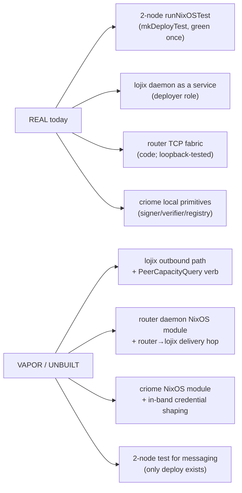

# 2 — VM-test harness as a two-node substrate

## What the "VM-test harness" actually is

Three things are easy to mistake for the harness; only the third is it:

- The `harness` repo (`/git/github.com/LiGoldragon/harness`) is the **AI-harness
  daemon** (Codex / Claude / Pi runtime objects) — unrelated.
- CriomOS's `checks/` are **pure-eval policy checks** — every one builds a
  `lib.nixosSystem` and `assert`s on the evaluated config; **none boots a VM**
  (`flake.nix:120-146`). `runNixOSTest` appears in CriomOS only in *comments*
  (`modules/nixos/test-substrate.nix`) and docs/reports — `mkVmTest` is **never
  defined** in CriomOS (grep: only comment references).
- The real harness lives in **`CriomOS-test-cluster`**:
  `lib/mkVmTest.nix` (single-node), `lib/mkDeployTest.nix` (two-node),
  `lib/standardTest.nix` (role-derived testScript), `lib/deploy-flake.nix`
  (offline-eval closure), wired in `flake.nix:46-305`. It operates on the
  **`fieldlab`** fixture cluster (atlas / mercury / dune / edge-desktop /
  base-home), **not** goldragon/prometheus/vm-testing.

## Per-question verdicts

### 1. Two networked nodes today — WORKS (with drift caveat)

`mkDeployTest.nix` is a genuine **2-node `runNixOSTest`**:
`nodes.deployer = deployerModule; nodes.${vmNode} = targetModule;`
(`lib/mkDeployTest.nix:423-424`). The driver puts both on one VLAN —
"deployer = .1, the vmNode = .2" (`:148-151`). The git log records it green:
`f9910de … C6 lojix-deploy smoke … hermetic 2-node runNixOSTest (RUNS GREEN)`.
This is two **separate** VMs on a shared network — not loopback, not one VM.

`mkVmTest.nix` itself is **single-node** (`nodes.${vmNode}` only, `:378`); its
`hostNode` argument is read for cluster-data slicing and **never booted**
(`:218-245`). So the *generator the suite leans on* (`autoVmChecks`,
`flake.nix:201-203`) is one-node; the two-node capability exists **only** in the
hand-written `mkDeployTest`.

**Caveat:** green was at `f9910de`; three later commits repin CriomOS main
(`1844197`, `0ad9135`, plus the latest) with **no re-confirmation of green** —
drift risk is real and unmeasured. The psyche's "not well tested yet" is fair:
the 2-node substrate has exactly **one** witnessed-green run, for **one**
scenario (deploy), possibly stale.

### 2. Inter-node networking A→B — PARTIAL

Proven for the **SSH / ssh-ng / nix-copy** path only. The deployer reaches the
target by its criome domain name resolved to `192.168.1.2`
(`mkDeployTest.nix:202-208, 317-323`, testScript `:444-449`), and
`nix copy --to ssh-ng://root@target` lands a closure node-to-node
(`:64-71`). That is real cross-node reachability over the test network.

**But there is no daemon-socket-to-daemon-socket inter-node path exercised
anywhere**, and nothing crosses a router. The router's TCP peer delivery
(`router/src/peer_delivery.rs:110` `TcpStream::connect`) and TCP listener
(`router/src/router.rs`) are proven only by the router's *own* (loopback)
signal-message tests — never across two `runNixOSTest` nodes. An arbitrary
daemon TCP port between test nodes would also need a firewall opening (sshd opens
22 for free; a router port does not).

### 3. lojix in a node — PARTIAL; router in a node — VAPOR; criome — VAPOR

- **lojix daemon in a test node: WORKS, for ONE daemon in its DEPLOY role.** The
  deployer runs the real fixed daemon as a service with both sockets
  (`mkDeployTest.nix:329-378`), and CriomOS ships a production module
  (`modules/nixos/lojix.nix:43-75`). But (a) only **one** lojix runs — the target
  (mercury) runs none; (b) lojix is **local-Unix-only** — daemon binds two local
  listeners, client only `UnixStream::connect` (`lojix/src/daemon.rs`,
  `lojix/src/client.rs:48`), so node A's lojix **cannot** message node B's lojix
  or a router; (c) `lojix.nix` hardcodes the startup to `goldragon prometheus`
  (`:27`), so a second host needs that parameterized.
- **Router daemon in a node: VAPOR.** The signal/message router daemon is
  deployed by **no NixOS module anywhere**. CriomOS's `modules/nixos/router/` is
  WiFi/hostapd/networkd only (`router/default.nix`, `wifi-pki.nix`,
  `yggdrasil.nix`) — not the daemon→daemon fabric. Standing a router "across the
  test network" means writing a brand-new systemd service module.
- **criome daemon in a node: VAPOR.** No criome NixOS module exists in CriomOS
  `modules/nixos/` (grep). "Two co-resident criome daemons" is entirely new
  deployment work.

`standardTest.nix` confirms the surface gap: its fragments cover boot+sshd,
edge-desktop, **WiFi** router (hostapd/kea/forwarding, `:76-81`), largeAi, and
home — **no** lojix, router-daemon, criome, or inter-node fragment.

## The concrete gap — "one VM" → "two daemons + router + criome"

**Real (exists / proven):** the 2-node `runNixOSTest` substrate with inter-node
SSH reachability (green once); lojix runnable as a systemd service; the router as
a real TCP daemon in code; criome's local signer/verifier/registry; the
cluster-data → projection plumbing both generators use.

**Unbuilt / broken (the vapor) for a daemon→router→daemon request:**

1. **lojix has no outbound path** — local Unix sockets only; the slice's Layer-2
   "first byte lojix ever sends outbound" (report-1 §Layer 2) does not exist.
2. **No `PeerCapacityQuery` peer verb** / peer-callable reply (report-1 Layer 2)
   — unbuilt.
3. **Router daemon deployed by no module** — a new systemd service is required to
   run a router on any node, test or real.
4. **No router→lojix-daemon delivery hop** and no lojix-payload carry — the
   router today delivers only to Persona signal-message sockets (report-1 Layer
   2) — unbuilt.
5. **criome deployed by no module**, and the in-band attest/evaluate credential
   shaping (report-1 Layer 1) is unbuilt; criome has no remote transport.
6. **mkVmTest is single-node**; a 2-node *messaging* test is a new generator or a
   hand-written `runNixOSTest` with `nodes.A`/`nodes.B` each running
   lojix+router+criome — the only 2-node generator (`mkDeployTest`) is hardwired
   to the ssh/nix-copy deploy scenario.
7. **Wrong fixtures** — the harness cluster is `fieldlab`; the slice's prometheus
   VmHost + vm-testing guest + capacity budget (report-1 fixtures) are not in
   `fixtures/horizon/` (data authoring, not code; the flake even anticipates "a
   second host (prometheus) is a data-only addition", `flake.nix:84`).
8. **The five capacity layers themselves** (budget field arity 4→5, ledger,
   `Machine::demand`) are the slice's own unbuilt work, orthogonal to the
   substrate.

Items 1-5 are load-bearing and **substrate-independent** — they block the slice
on the harness and on real machines equally.

## Real cluster machines vs the harness

Two real hosts would be **lower-risk on the substrate axis**: no hermetic-boot
fragility (the whole C4 PCI-bus/microvm-machine-type saga in
`test-substrate.nix:23-39`, the NSS/sshd/root-shell prebakes, the offline
`nix flake archive` dance, the no-op `bootctl` shim in
`mkDeployTest.nix:219-230`); real KVM, real network, real criome/tailnet — the
production transport the slice ultimately targets; components as their real
services with real sockets.

But real machines carry their own blockers, and **close none of the code gaps**:

- There is **one** real provisioned node today — `prometheus` (LargeAiRouter +
  VmHost). `vm-testing` is a near-empty microvm (hostname + stateVersion, no
  CriomOS, no lojix; `vm-testing/default.nix:162-182`); `tiger` is EdgeTesting
  with no services (`goldragon/datom.nota`). So you do **not** have two
  lojix-running hosts — a second must be provisioned.
- `lojix.nix` deploys lojix only on `PersonaDevelopment` nodes and hardcodes
  `prometheus` (`:27`) — both need parameterizing for a second host.
- The router and criome daemons are deployed by **no module** — identical gap to
  the harness; real hardware does not help.
- Real-machine runs are **not hermetic or repeatable** — state leaks, manual
  reset, slower iteration. The harness's entire value is repeatability, which the
  one green `mkDeployTest` run already demonstrates is achievable for two nodes.

**Net:** the substrate is **not the long pole**. The load-bearing missing work
(lojix outbound + peer verb + router daemon deployment + router→lojix delivery +
criome deployment + in-band credential) is the same regardless of substrate.
Report-1 chose loopback (daemons spun directly in a Rust integration test) to
sidestep all NixOS-module/deployment work — that remains the **lowest-risk**
substrate for proving the code path. The finding that updates report-1: a real
2-node `runNixOSTest` substrate **does** exist and was green once, so the slice
is not *forced* onto loopback — but converting to it costs the router+criome
NixOS modules (unbuilt either way) plus the boot-fragility/repin-drift tax, and
buys real cross-machine networking + systemd that loopback never exercises.
