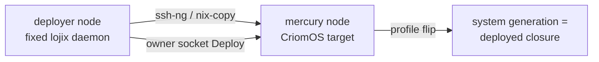

# 3 — Two-node deploy-smoke baseline

## Verdict

**GREEN.** The two-node test builds and passes on this host today.

```
nix build '.#checks.x86_64-linux.lojix-deploy-smoke'  ->  exit 0
vm test script finished in 173.09s
C6 GREEN: lojix build->copy->generation-activated a real nixos-system into mercury
```

This is a real run, not a static read: this host (`ouranos`) has working KVM
(`/dev/kvm` present and world-writable, `vmx` in cpuinfo, 14 cores / ~20 GiB
free), so the hermetic `runNixOSTest` driver booted **both** QEMU guests
(`deployer` and `mercury`) on one VLAN and ran the full deploy scenario. The
workspace substituter `http://nix.prometheus.goldragon.criome` and remote
builder `ssh-ng://nix-ssh@prometheus.goldragon.criome` were reachable; the
`lojix-0.3.4` daemon compiled and the two CriomOS systems realized.

## The check, the attr, the command

The two-node test is **one explicit flake check**, not part of the per-node
auto-pickup VM suite:

- Attr: `checks.x86_64-linux.lojix-deploy-smoke` (x86_64-linux only;
  `flake.nix:296-302`).
- Generator: `lib/mkDeployTest.nix` — `inputs.nixpkgs...testers.runNixOSTest`
  with `nodes.deployer = deployerModule; nodes.${vmNode} = targetModule;`
  (`mkDeployTest.nix:423-424`), invoked with `cluster=fieldlab`,
  `hostNode=atlas`, `vmNode=mercury`.
- Repo location: `/git/github.com/LiGoldragon/CriomOS-test-cluster` (NOTE: this
  repo is **not** symlinked under `~/primary/repos/` despite the brief; it lives
  at the ghq clone path and was read/built directly there).

Run command (from the repo root, this or any VM-testing host with KVM):

```sh
cd /git/github.com/LiGoldragon/CriomOS-test-cluster
nix build '.#checks.x86_64-linux.lojix-deploy-smoke' --no-link --print-build-logs
```

Requirements to reproduce elsewhere: x86_64-linux, a writable `/dev/kvm`
(QEMU/KVM), Nix with flakes, network reach to the LiGoldragon GitHub inputs and
ideally the prometheus substituter/builder. The full cold build realizes 62
derivations (lojix release build + two CriomOS toplevels + the VM runner); with
the prometheus cache warm, the run-script phase itself is ~173s.

## What the test proves (and what it does not)



One concept: the deployer's real fixed `lojix` daemon builds, copies (offline,
`nix copy --to ssh-ng://root@mercury`), and generation-activates a full CriomOS
closure into the booted `mercury` target; the target's
`/nix/var/nix/profiles/system` becomes the lojix-deployed `nixos-system-mercury`
and advances past its booted base. Witnessed this run by:

- `deploy reply: (Deployed (1 (0 0)))` — the owner-socket `Deploy` was accepted.
- The target's system profile polled to the expected deployed closure
  (`nixos-system-mercury-26.05-c6smoke`), distinct from the booted base.
- The daemon's durable ordinary-CLI Query reply records the node, terminal slot,
  and deployed closure together:
  `(Queried ([(1 1 fieldlab mercury FullOs Boot Current <closure>)] ...))`.
- The activated artifact is a real nixos-system dir (`/init`, `/activate`,
  `/bin/switch-to-configuration`), proving the `<drv>^*` fix held.

What it does **not** exercise (load-bearing for the new slice, per report 2):
the only inter-node path here is SSH / ssh-ng / nix-copy plus a bare activation
`ssh`. There is **no daemon-socket -> router -> daemon-socket hop** anywhere in
this test, no router daemon, and no criome daemon. The capacity-admission slice
still needs lojix's outbound path, a `PeerCapacityQuery` verb, a router-daemon
NixOS module, the router->lojix delivery hop, and a criome module — none of which
this green substrate contains.

## Drift assessment — the green held across 61 CriomOS commits

The brief's "witnessed green at `f9910de`, drifted ~3 repins" undercounts the
real input drift. `f9910de` is the **test-cluster** commit that added the smoke
test ("RUNS GREEN"); its committed `criomos` pin was `724fae1a`. The current
on-disk pin is `154b0402` — **61 CriomOS commits** of drift, not three. The
"~3 repins" counts test-cluster repin commits, each of which jumps many CriomOS
commits.

The 61-commit span includes surfaces this test actually touches: lojix-daemon
pins (remote-builder fix, configured-builder fix, deploy logging, 0.3.4
target-only copy), the `test-substrate` changes (C5 complex/home gating, the
`vmTypeModule` cleanup, image-exchange keys), the `vm-testing`/`TestVm`
microVM-guest feature, and the tip `154b0402 CriomOS: emit public cluster DNS
aliases`. Despite all of it: **eval is clean** (the derivation fully constructs)
and **runtime is clean** (the scenario passes). Drift has not broken the
substrate.

## Caveat — what state was actually tested

The build ran against the **dirty working tree** (Nix warned `Git tree is
dirty`), not a clean committed checkout. That dirty state is a coherent
in-progress CriomOS repin, not noise:

- `flake.lock`: `criomos` advanced from the committed-HEAD pin `6646275` to the
  tip `154b0402`, plus matching transitive input bumps (nixpkgs et al.).
- every `fixtures/horizon/*.json`: a new `domainConfiguration` block
  (`internalSuffix` + `publicClusterDomains: fieldlab.criome.net`) — the
  re-projection that matches the tip commit's public-DNS-alias emission, kept
  consistent with the projection (the test built and ran, so fixtures and
  projection agree).
- `clusters/*.nota`, `AGENTS.md`, `INTENT.md`: small source/doc edits.

So GREEN is for **today's most-current on-disk state** (criomos `154b0402`).
The committed test-cluster HEAD (`1844197`, criomos `6646275`) is one repin
behind this and was not separately rebuilt; both are well past the green pin.
The substrate is solid to build the slice onto — with the unbuilt
router/criome/lojix-outbound work (report 2) being the actual long pole, not the
two-node harness.
