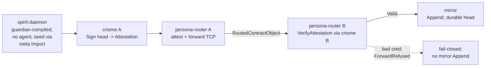
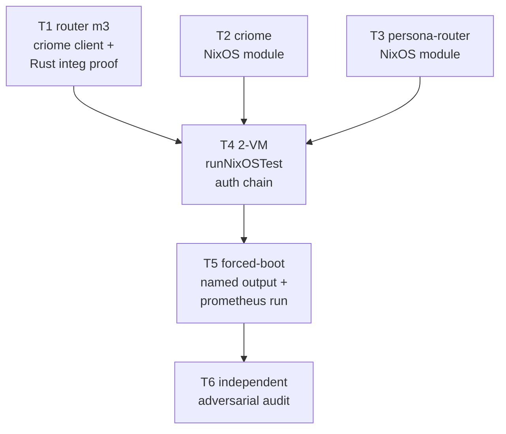

# 6 — Translation: criome-auth witness VM test

## Intent Anchors

[Build a VM test that produces FIRST-HAND, REPRODUCIBLE evidence — not agent
claims — that criome auth propagation through the persona router is real, by
authenticating a real Spirit record across two real VMs that boot on
prometheus.]

[The product is the evidence, not a green check: a timestamped per-link evidence
bundle observed via durable state / introspection trace, not daemon printlns
(intent `beaj`); plus a single documented command the psyche can run himself that
FORCES a real boot every run (defeats the Nix store cache-hit false-green) and is
anchored to a committed revision.]

[NEGATIVE control in the same run: a head with no valid criome credential is
refused, fail-closed, so "propagation" can't be a hollow always-yes.]

[Boundaries: HARDWIRE criome/router peer addresses for v1; do NOT build discovery
or the capacity-admission slice; do NOT do a production Switch on prometheus; run
host is prometheus, never fire QEMU on ouranos. Nothing here is private.]

This brief rests on the grounding in `reports/capacityAdmissionSlice/5-Kickoff-make-vm-testing-infra-real.md` (make the VM-testing infra trustworthy first), the substrate audit `2-Audit-vmtest-harness-two-node-substrate-feasibility.md` (the real 2-node `runNixOSTest` lives in `CriomOS-test-cluster/lib/mkDeployTest.nix`; router and criome daemons are deployed by no NixOS module), and the adversarial re-audit `4-Audit-adversarial-reaudit-deploy-smoke-green.md` (cached check output makes a plain `nix build` a hollow zero-VM green; `--rebuild` forced a real 2-VM boot but on the wrong host).

## What "criome auth propagation through the persona router" is in code

The load-bearing work is **Router Milestone 3**: the persona router today decides accept/refuse on a forwarded object through the `ForwardAttestationVerifier` trait (`router/src/forward_attestation.rs:31-52`), and that trait is wired to the **offline stub** `AcceptFixedTestIdentity` which fabricates literal-string keys and never touches criome. Milestone 3 swaps that stub for a real criome client dialing `config.criome_socket_path` — a field already plumbed end-to-end but **dead at runtime** (`router/src/config.rs:16,106-108`, doc-commented "milestone 3 dials this path"). The swap is a single seam: two construction sites (`router/src/daemon.rs:75-77`, `router/src/router.rs:967-971`); routing/transport code names no concrete verifier type, so it stays untouched ("router claims its routing code changes zero lines").

The forwarded payload is a `RoutedContractObject` (signal-router `schema/lib.schema:136-141`: contract name / op / payload-size / opaque octets) carried inside a `ForwardedMessagePayload`. The router is payload-blind: it hashes the raw octets and authenticates the head/object, never decoding the inner contract. The criome scout confirms the only criome verbs that perform **real BLS** are `Sign` → `SignReceipt{attestation}` (send side) and `VerifyAttestation` → `VerificationResult{Valid|InvalidSignature|UnknownSigner|Expired|Revoked}` (receive side); the `AuthorizeSignalCall` / `VerifyAuthorization` grant path does **not** re-check BLS on receive (`criome/src/actors/authorization.rs:160-172`). So the cryptographic witness uses the `Sign`/`VerifyAttestation` pair.

### Two corrections to the chain description

The scouts found the recorded chain `spirit -> criome -> router -> mirror` is real in shape but two of its words don't match code; both need a psyche decision (see Risks):

- **"no-guardian Spirit daemon" is the wrong build flag.** Building *without* `agent-guardian` does NOT fail closed — a plain `Record` writes straight to the store (`spirit/src/nexus.rs:672-678`). The fail-closed daemon is `agent-guardian` **compiled but with no LLM agent configured**: `daemon.rs:138-140` calls `require_guardian()`, and `nexus.rs:866-892` then rejects ordinary writes with `HarnessUnavailable`, leaving owner-only meta `Import` (`spirit/src/engine.rs:680-705`, CLI `meta-spirit`) as the only seed path. This is exactly the deployed production build (`spirit/flake.nix` daemon package builds `--features agent-guardian`).

- **"mirror verifies the criome attestation" does not exist.** The mirror is payload-blind append storage that validates chain coordinates and digests only; `mirror/src/service.rs:146` literally reads "no per-request auth; criome deferred." The criome verification in the implemented chain happens at the **inbound router** (milestone 3), not at the mirror. The terminal "accept/restore" is the mirror `Append` (`signal-mirror` op `Append EntrySuffix` → `AppendReceipt{head}`) plus, optionally, a consuming component that `Restore`s from the mirror and compares the restored tip digest to the router-delivered `AuthorizedObjectReference` (the in-process pattern in `spirit/tests/end_to_end_offline_full_chain.rs`).

An **existing in-process offline test already runs the whole chain**: `spirit/tests/end_to_end_offline_full_chain.rs` (behind feature `offline-full-chain-e2e`) drives spirit → criome gate → router → mirror → restore → digest-match offline, with the router carrying the typed reference only. The VM test's job is to make that real: real VMs on prometheus, real criome BLS instead of the offline verifier, real router-to-router TCP across two hosts, real systemd daemons over real sockets.

## The runtime chain being witnessed



Caption: source VM runs spirit + criome A + router A; receiver VM runs router B + criome B + mirror. Criome verification is at router B; the dotted edge is the negative control.

A load-bearing piece of plumbing the diagram hides: for criome B's `VerifyAttestation` to return `Valid`, the signing identity must be a **registered Active identity in criome B's own registry**. Each criome self-registers only `Host("criome")` with its own master key (`criome/src/actors/root.rs:1162-1215`); the two VMs run independent criome instances with independent keys. So criome A's signing identity (its public key) must be seeded into criome B's registry via `RegisterIdentity` (gate skipped when no `cluster_root` is configured, or admitted by a shared cluster-root BLS pubkey). This cross-instance trust seed is the hardwired-for-v1 trust anchor and is a first-class task.

## Dependency graph



Caption: T1/T2/T3 run in parallel; T4 assembles them into the witness; T5 makes it reproducible on prometheus; T6 audits. A decision gate (D0, below) precedes T1.

**D0 — decision gate (lead/psyche, not a worker task).** Confirm the witnessed criome-verification point is the inbound router (T1's milestone-3 verify), with the mirror as payload-blind terminal storage, rather than net-new mirror-side criome verification. T1's attestation design depends on this. See Risks.

**Parallelism.** T1 is pure Rust and substrate-independent — it proves the cryptographic seam (real BLS attest on send, real BLS verify on receive, fail-closed refusal) with two in-process `RouterRuntime`s and a real co-resident criome daemon over a Unix socket, before any VM exists. T2 and T3 are independent Nix module authoring. All three can proceed at once after D0. T4 needs all three. T5 needs T4. T6 needs T4 and T5.

**Why T1 first and alone proves the unknown.** The single biggest unknown is the attestation-type mapping (see T1). Proving it in a Rust integration test fails fast and cheap; discovering it inside a VM boot is slow and ambiguous. This is the thin-slice-exposes-unknowns-through-working-failure shape the kickoff asks for.

## Per-worker task cards

### T1 — Persona-router milestone 3: real criome client behind `ForwardAttestationVerifier`

- **Task.** Replace the offline `AcceptFixedTestIdentity` with a `ForwardAttestationVerifier` impl that, on `attest`, calls criome `Sign` to produce the per-forward credential, and on `verify`, calls criome `VerifyAttestation`, accepting iff `VerificationDecision::Valid` and mapping every non-`Valid` outcome to `RouterForwardRefusalReason::AttestationInvalid`. Dial `config.criome_socket_path`. Wire the swap at the two construction sites only. Prove it with a Rust integration test: two in-process `RouterRuntime`s over real loopback TCP, each with a real co-resident criome daemon on a Unix socket; assert a positive forward returns `ForwardAccepted` under a genuine BLS attestation, and a forward with an unregistered signer / mutated payload / expired attestation returns `ForwardRefused(AttestationInvalid)`.
- **Design checkpoint (first deliverable, lead reviews before impl proceeds).** Decide the field mapping between the router's `RouterPeerAttestation` (signer/scheme/public_key/signature/content_digest/issued_at/nonce; signal-router `schema/lib.schema:128-131`) and criome's `Attestation` / `SignRequest{content: ContentReference{digest, purpose, schema_version}}` / `VerifyRequest{attestation, content}`. Pin down what digest criome signs and how it is derived from the forwarded payload octets so that the digest criome signs on VM A equals the digest criome verifies on VM B. Decide the cross-instance identity-trust seed (shared `cluster_root` vs direct `RegisterIdentity` of peer pubkey). This is the load-bearing unknown; the rest of T1 is mechanical once it is fixed.
- **Target repo + working dir.** `/git/github.com/LiGoldragon/router` (likely also a touch in `signal-router` if a field is missing on `RouterPeerAttestation`; if so, that contract edit is a sub-step under the same task).
- **Required reading.** `router/src/forward_attestation.rs:31-130` (trait + stub + content-digest fold); `router/src/router.rs:387-394` (inbound verify decision site), `:943,967-971,1001-1003,1102,1142` (verifier threading + construction); `router/src/peer_delivery.rs:87,97-119` (attest call + outbound connect); `router/src/config.rs:16,61-63,106-108` (the dead dial field); `router/tests/end_to_end_remote_forward.rs` (the adaptable two-runtime harness; replay case already proves the `ForwardRefused` reply path); criome `src/lib.rs:17` + `src/transport.rs:202-259` (`CriomeClient`/`CriomeMetaClient`, synchronous — wrap in `spawn_blocking` or implement an async client over the public `CriomeFrameCodec`); criome `schema/lib.rs` Sign/VerifyAttestation/ContentReference/VerificationDecision; the criome scout map and router scout map embedded in this lane's session context.
- **May edit.** `router/src/forward_attestation.rs` (new verifier impl), the two construction sites (`router/src/daemon.rs`, `router/src/router.rs`), the criome-client module (new file), `router/Cargo.toml` (add criome-client dependency surface), a new `router/tests/` integration test. If `RouterPeerAttestation` lacks a field, the corresponding `signal-router` schema/impl. Must NOT edit routing/transport logic in `router.rs`/`peer_delivery.rs`/`remote_router.rs` beyond the construction-site swap.
- **Completion claim.** "The persona router authenticates forwarded objects through a real criome daemon over `config.criome_socket_path`: a forward under a genuine BLS attestation is accepted, and a forward with no valid criome credential is refused `AttestationInvalid`, fail-closed. Routing/transport code is unchanged except the verifier construction. Proven by a Rust integration test driving two RouterRuntimes and real co-resident criome daemons."
- **Evidence.** A named Nix check (`nix flake check` or `nix run .#test-router-criome-forward`) executing the integration test; the test reads the typed reply outcome (`RemoteForwardOutcome::Accepted` vs `Refused(AttestationInvalid)`) and the positive-path durable trace (`RouterTraceStep::ForwardedRemote` / `RouterDeliveryStatus::ForwardedRemote`), plus criome durable state showing the signed object reference. Witness names read like constraints (`router_accepts_only_real_criome_attestation`, `router_refuses_forward_without_criome_credential`). No print, no grep-as-proof.
- **Suggested role.** `rust-auditor` is the audit; the build is `general-code-implementer` (Rust-heavy, cross-crate). The author must hold the Rust skills (`rust-discipline`, `abstractions`, `naming`, `kameo`, `rust-storage-and-wire`).

### T2 — criome daemon NixOS service module

- **Task.** Author `CriomOS/modules/nixos/criome.nix` deploying the `criome-daemon` binary as a hardened systemd service, modeled closely on `modules/nixos/mirror.nix`. It binds the two 0600 Unix sockets under `/run/criome/` (working `criome.sock` + meta `criome.sock.meta`), a sema store under `/var/lib/criome/`, a NOTA `CriomeDaemonConfiguration` consumed by `ExecStartPre = criome-write-configuration`, and exposes a cross-instance identity-seed hook (a startup step that issues `RegisterIdentity` for the peer criome's public key, per the T1 design decision on the trust anchor). Dedicated `criome` user/group, tmpfiles for both dirs.
- **Target repo + working dir.** `/git/github.com/LiGoldragon/CriomOS`, `modules/nixos/`.
- **Required reading.** `CriomOS/modules/nixos/mirror.nix` (the cleanest daemon template: flake-input package → `write-configuration` → `-daemon` → `/run`+`/var/lib` + tmpfiles + hardened `serviceConfig`); `CriomOS/modules/nixos/lojix.nix:43-75` (second template); criome `flake.nix` package outputs (`packages.default` mainProgram `criome`; daemon binary `criome-daemon`; config writer `criome-write-configuration` is behind the `cluster-witness` feature — confirm/expose a non-witness configuration writer or build with that feature); criome `src/daemon.rs:20-68,122-137,205-212` (socket binding + paths), `signal-criome` `CriomeDaemonConfiguration{socket_path, store_path, meta_socket_path, cluster_root, authorization_mode}` (`schema/lib.rs:698-704`); `criome/src/actors/registry.rs:106-131` + `src/admission.rs` (RegisterIdentity + cluster-root admission, for the seed hook); `nix-discipline` and `testing` skills.
- **May edit.** New `CriomOS/modules/nixos/criome.nix`; `CriomOS/flake.nix` inputs (add `criome.url = "github:LiGoldragon/criome"; criome.inputs.nixpkgs.follows`); the module import list. Must NOT touch the WiFi/hostapd `modules/nixos/router/` (unrelated).
- **Completion claim.** "A criome daemon runs as a hardened systemd service from the criome flake package, with both 0600 sockets and a durable sema store, configurable via NOTA, and able to seed a peer identity into its registry at startup. Proven active in a single-node VM check."
- **Evidence.** `nix build` / `nix eval` of the module-bearing config; a single-node `runNixOSTest` (or reuse of `mkVmTest`) asserting `wait_for_unit("criome.service")` reaches active and `wait_for_file` finds both sockets; a `criome` CLI/witness round-trip proving the daemon answers a request over the working socket. Named `criome_service_reaches_active_with_both_sockets`.
- **Suggested role.** `criomos-implementer`.

### T3 — persona-router daemon NixOS service module

- **Task.** Author `CriomOS/modules/nixos/persona-router.nix` deploying the `router-daemon` binary (signal/message daemon-to-daemon fabric — NOT the WiFi router) as a hardened systemd service modeled on `mirror.nix`. Set the listen address, point `criome_socket_path` at the co-resident criome socket from T2, supply the **hardwired** peer table for v1 (peer name → `192.168.1.x` address) via the router bootstrap document (`Configuration::bootstrap_path`, `router/src/config.rs:85-87`, applied `daemon.rs:95-97`) or the equivalent `InstallRemotePeer`/`InstallRemoteRoute` startup messages, and open the router TCP port with the **global** `networking.firewall.allowedTCPPorts` form (the `tailscale0`-scoped form in `mirror.nix` does not apply in the hermetic runner).
- **Target repo + working dir.** `/git/github.com/LiGoldragon/CriomOS`, `modules/nixos/`.
- **Required reading.** `mirror.nix` (template, incl. its `0.0.0.0:7474` TCP-ingress + firewall pattern, but use the global firewall form per the scaffold scout); router `flake.nix` (`packages.default`, mainProgram `router-daemon`; config writer `router-write-configuration`); `router/src/config.rs:16,85-87,106-108` (criome_socket_path + bootstrap_path); `router/src/remote_router.rs:30-68` + `router/src/router.rs:1165-1191,1292-1305` (peer/route install — the hardwire surface); router scout map; `nix-discipline`, `testing`.
- **May edit.** New `CriomOS/modules/nixos/persona-router.nix`; `CriomOS/flake.nix` inputs (add `router.url = "github:LiGoldragon/router"`). Must NOT conflate with `modules/nixos/router/` (WiFi).
- **Completion claim.** "A persona-router daemon runs as a hardened systemd service, listening on a firewall-opened TCP port, with `criome_socket_path` wired to the local criome socket and a hardwired v1 peer table. Proven active and listening in a single-node VM check."
- **Evidence.** `nix build`/`nix eval`; single-node check asserting `wait_for_unit("persona-router.service")` active, the TCP port open, and the configured `criome_socket_path` present. Named `persona_router_service_active_and_listening`.
- **Suggested role.** `criomos-implementer`.

### T4 — Two-VM criome-auth witness `runNixOSTest`

- **Task.** Author the 2-node criome-auth test (new `CriomOS-test-cluster/lib/mkCriomeAuthTest.nix`, adapted from `mkDeployTest.nix`). Keep the node/VLAN/boot/service-generic scaffold; cut the lojix Deploy/Query specifics. Source node runs spirit-daemon (`agent-guardian` compiled, no LLM agent — fail-closed), criome A, persona-router A; receiver node runs persona-router B, criome B, mirror. Seed a real Spirit record on the source via owner-only meta `Import` (`meta-spirit '(Import (...))'` over `SPIRIT_META_SOCKET`); let spirit's `mirror-shipper` gate (`gate_and_ship_head`, `spirit/src/engine.rs:631-659`) authorize the head via criome A; forward the resulting `RoutedContractObject` over router A → router B; router B verifies via criome B; deliver to the mirror's working socket (`ComponentSocket` → `/run/mirror/working.sock`, op `Append`/`NotifyObject`); assert a durable mirror head. Then run the negative control in the same boot: a forward whose criome credential is invalid (unregistered signer or mutated/expired attestation) → `ForwardRefused(AttestationInvalid)` and **no** corresponding mirror Append. Cross-node resolution via `networking.hosts` `<node>.<cluster>.criome`; hardwired peer addresses; seed criome A's identity into criome B's registry per T1's trust-anchor decision. Emit the per-link evidence bundle (next section).
- **Target repo + working dir.** `/git/github.com/LiGoldragon/CriomOS-test-cluster`, `lib/` + `flake.nix`.
- **Required reading.** `CriomOS-test-cluster/lib/mkDeployTest.nix` — KEEP: the `nodes.deployer`/`nodes.${vmNode}` `runNixOSTest` shape (`:402-424`), cross-node `networking.hosts` criome-domain binding (`:143,202-208,317-323`), SSH pre-seed trio (`:106-109,153,292-295,305-312`), node sizing/`useEFIBoot` (`:188-197`), `node.specialArgs` inputs threading (`:409-421`), the `systemd.services.*` skeleton (`:329-378`), `assertModel` (`:389-399`); CUT: `deployFlake`/`lib/deploy-flake.nix`, lojix packages + offline-eval closure dance (`:96-102,253-289,366-376`), the deploy+Query testScript (`:454-571`). The T2/T3 modules + `mirror.nix` for the four service launches. `spirit/tests/end_to_end_offline_full_chain.rs` (the chain semantics, esp. `RestoreCandidate::from_bundle`/`tip_matches`, router-carries-typed-reference-only); spirit `flake.nix` daemon package (`--features agent-guardian`); `meta-signal-spirit` Import op + `spirit/tests/nix_integration.rs:425-432,467-490` (Import invocation shape); router `tests/end_to_end_remote_forward.rs` (ComponentSocket delivery + ForwardRefused pattern); `testing` skill (stateful tests, QEMU-host gate, artifact discipline, chained derivations).
- **May edit.** New `lib/mkCriomeAuthTest.nix`; `CriomOS-test-cluster/flake.nix` (add criome/router/spirit/mirror flake inputs + the new `checks`/`apps` outputs); fixture/cluster-data additions in `fieldlab` IF needed for the test's model anchor (use the existing fieldlab VmHost `atlas` as the model host; do NOT inject prometheus production facts into fieldlab — see Risks). Must NOT add a production `Switch`; the VMs are throwaway guests.
- **Completion claim.** "On a single boot, the source VM seeds a real Spirit record (guardian-compiled daemon, meta Import), criome attests the head, the persona router forwards it under that attestation to the receiver VM, the inbound router verifies via criome and the mirror durably appends it; in the same boot an unauthorized head is refused fail-closed and never appended. All links witnessed via durable state / introspection, not printlns."
- **Evidence.** The per-link evidence bundle (next section), emitted by the testScript and captured as an inspectable artifact. The negative control is the un-fakeable check: the mirror's durable store contains the authorized head and NOT the unauthorized one. Named `criome_attestation_propagates_through_router_to_mirror` + `unauthorized_head_refused_fail_closed`.
- **Suggested role.** `criomos-implementer` (Nix + test-harness heavy; pairs with the T1 author for the chain wiring).

### T5 — Forced-boot named output + prometheus run path

- **Task.** Expose the criome-auth test as a named stateful output that boots VMs **every** invocation, defeating the cached-`checks` zero-VM green: `apps.<system>.test-criome-auth-witness` whose program executes the `runNixOSTest` driver (`bin/nixos-test-driver` from the test's `.driverInteractive`/`.driver` passthru), so `nix run` runs the driver (only the driver package is cached; the boot is not). Add `scripts/run-criome-auth-on-prometheus` (modeled on the existing `scripts/run-on-prometheus`) that pins/pushes the committed revision, ssh-es to prometheus, runs the app there, and collects the evidence bundle back. Document prometheus as an authorized VM-testing host in `CriomOS-test-cluster/INTENT.md` / `AGENTS.md` prose (public; prometheus has KVM). Confirm the `.driver`/`.driverInteractive` passthru attr exists on the pinned nixpkgs before relying on it.
- **Target repo + working dir.** `/git/github.com/LiGoldragon/CriomOS-test-cluster`, `flake.nix` + `scripts/` + `INTENT.md`/`AGENTS.md`.
- **Required reading.** `CriomOS-test-cluster/flake.nix:201-203,267-302,482-504` (current `checks` + `apps` shape; `apps` today only ssh to prometheus); `scripts/run-on-prometheus` (the ssh-and-`nix flake check --refresh` pattern + push-main-first anchoring); `testing` skill `:17-19,64-73` (named stateful outputs `nix run .#test-<name>`, "a recurring manual command is not a test contract until it is a versioned script and a named flake output"); `INTENT.md:88-99` (VM-testing-host non-negotiable + "no production facts" rule); `4-Audit-adversarial-reaudit-deploy-smoke-green.md` (the cache-hit headline + the dirty-tree anchoring failure to avoid).
- **May edit.** `CriomOS-test-cluster/flake.nix` (`apps` output), new `scripts/run-criome-auth-on-prometheus`, `INTENT.md`/`AGENTS.md` (prose authorization). Must NOT inject prometheus into fieldlab cluster *data* (the machine-consumed VmHost capability is private; see Risks). Must NOT fire QEMU on ouranos.
- **Completion claim.** "A single documented command, run on prometheus and anchored to a committed revision, boots both VMs from cold every invocation and emits the evidence bundle; a plain cached `nix build` of the check cannot satisfy it because the command executes the test driver rather than realizing a cached output."
- **Evidence.** Two consecutive runs of the documented command on prometheus showing a real boot each time (driver machine-up transitions in both), with the recorded host = prometheus and the recorded committed revision; a demonstration that the corresponding `checks` output being store-realized does NOT skip the boot. Named `criome_auth_witness_forces_real_boot_on_committed_revision`.
- **Suggested role.** `repo-operator` (flake output + script + push/anchor mechanics; pairs with `criomos-implementer` for the `apps` wiring).

### T6 — Independent adversarial audit

- **Task.** A separate auditor independently disproves the green. Verify, do not trust: (1) the VMs actually booted on **prometheus**, not ouranos, and not a cache hit (force `--rebuild`/cold or run the T5 driver app and confirm boot transitions; check the run host); (2) the criome BLS is **real** — the offline `AcceptFixedTestIdentity` stub is gone from the forwarding path and the attestation is a genuine `blst` signature criome verified, not a fixed-identity always-yes; (3) the negative control **truly fails closed** — the unauthorized head produces `AttestationInvalid` AND leaves no mirror Append, and the refusal is not silently swallowed; (4) the cross-instance trust is not hollow — criome B returns `Valid` only because criome A's identity is registered, and an unregistered signer is genuinely rejected; (5) the run is anchored to a committed revision against a clean tree.
- **Inputs received.** This Translation Brief; the T1 integration-test evidence; the T4 evidence bundle artifact; the T5 two-run forced-boot evidence; changed-file paths across router, CriomOS, CriomOS-test-cluster (+ any signal-router/criome contract edits).
- **Required reading.** `architectural-truth-tests` and `testing` skills (witness strength, "would a shortcut pass?"); `4-Audit-adversarial-reaudit-deploy-smoke-green.md` (the prior hollow-green teardown as the standard to beat).
- **Completion claim.** "Independently confirmed (or refuted, with specifics): real boot on prometheus, real criome BLS in the forward path, negative control fails closed with no mirror landing, cross-instance trust is load-bearing, run anchored to a committed clean tree." Findings are provisional recommendations until the psyche accepts them.
- **Evidence.** The auditor's own forced run + its captured artifacts, cited against each of the five claims; a verdict per claim (real / narrowly-scoped / hollow) in the prior audits' style.
- **Suggested role.** `rust-auditor` for the attestation/BLS path; `nix-auditor` for the boot/host/cache/anchoring. Two auditors or one covering both; distinct from every implementer.

## Final witness — per-link evidence bundle + reproduce command

The product is the bundle, not a green. Each link is a timestamped line read from durable state / introspection (intent `beaj`), never a daemon println:

- **L1 VM booted on prometheus.** Driver machine-up + `start_all()` transitions for both nodes; recorded host identity (`prometheus`, `/dev/kvm` present) and the committed revision, captured by the T5 run script.
- **L2 daemons active.** `wait_for_unit` active states for `spirit-daemon`, `criome` (A), `persona-router` (A) on source; `persona-router` (B), `criome` (B), `mirror` on receiver; plus `wait_for_file` on each socket. Artifact: the unit-state lines.
- **L3 record seeded + criome attestation emitted.** The owner-only meta `Import` receipt (`Imported{RecordCount, DatabaseMarker}`) on the source spirit; the criome A durable record of the `Sign` over the head's `AuthorizedObjectReference` (criome introspection of the signed object, not stdout).
- **L4 object forwarded across the router.** Router A durable trace `RouterTraceStep::ForwardedRemote` + `RouterDeliveryStatus::ForwardedRemote`; router B inbound delivery. Artifact: the router observation/trace dump.
- **L5 receiver verified + accepted.** Router B `verify` returned Ok (criome B `VerificationDecision::Valid`); the mirror's durable `AppendReceipt{head}` and store head; optionally a consumer `Restore` whose restored tip digest equals the delivered `AuthorizedObjectReference`.
- **L6 unauthorized refused, fail-closed.** The captured refusal outcome `ForwardRefused(AttestationInvalid)` for the bad-credential forward, AND the mirror durable store proving the unauthorized head was never appended (the un-fakeable check). Because a refusal leaves no router-side trace today (only the wire reply — `router/src/router.rs:387-393`), the witness reads the reply outcome at the sender plus the mirror's absence-of-append; see the observation-plane risk below.

**Reproduce-it-yourself command.** On prometheus:

```sh
scripts/run-criome-auth-on-prometheus   # pins+pushes the committed rev, ssh prometheus,
                                         # nix run .#test-criome-auth-witness, collects the bundle
```

It forces a real boot every run because the app executes the `runNixOSTest` **driver** (`bin/nixos-test-driver`) rather than realizing a cached `checks` output — only the driver package is cached, the boot is not. It is anchored to a committed revision via the flake `self` rev the script pins (clean tree, unlike the prior green which was anchored to a dirty uncommitted tree). It never fires QEMU on ouranos.

## Audit recommendation

Substantial cross-repo work → a distinct auditor by default (T6), separate from every implementer. The auditor receives this brief, the T1 Rust-integration evidence, the T4 evidence-bundle artifact, the T5 two-run forced-boot evidence, and the changed-file paths. The audit is a **defect review** against five anti-hollow claims (real boot on prometheus; real BLS not the stub; negative control truly fail-closed with no mirror landing; cross-instance trust load-bearing; committed clean-tree anchor) — distinct from any provisional corpus or guideline observation the auditor might also raise, which stay recommendations until the psyche accepts them. The standard to beat is the prior teardown in `4-Audit-adversarial-reaudit-deploy-smoke-green.md`: the new green must survive the same "could this pass with zero VMs / on the wrong host / from no commit?" attack.

## Risks and open decisions for the lead/psyche

- **D0 — receiver-verification point (decision needed before T1).** Code verifies the criome attestation at the **inbound router** (milestone 3); the mirror has no criome notion ("criome deferred", `mirror/src/service.rs:146`). Recommended: keep the mirror as payload-blind terminal storage and treat the inbound router as the witnessed criome-verification point (matches code, keeps "router routing changes zero lines", and the existing offline e2e test). Alternative the psyche may intend: net-new criome verification in front of / inside the mirror — larger, contradicts router-minimalism, and would need new `signal-mirror` surface. Which is the intended "receiver verifies"?

- **"no-guardian" wording.** The fail-closed daemon is `agent-guardian` **compiled with no LLM agent configured**, not the feature absent (feature-off lets a plain `Record` seed succeed, `spirit/src/nexus.rs:672-678`). Confirm the brief's "no-guardian Spirit daemon" means the guardian-compiled, no-agent build (= deployed production build), so meta `Import` is the only seed path.

- **prometheus declaration — partial blocker.** Two senses of "VmHost" diverge. The **prose** "authorized VM-testing host" rule is public and amendable (prometheus already appears in `scripts/*-on-prometheus`), so authorizing prometheus for this test is publicly doable via T5. But the **machine-consumed** cluster-data `VmHost` capability for prometheus lives in the PRIVATE `goldragon/datom.nota` (per `reports/operator/430-...`: append `(VmHost <guest-subnet> Available (Some <max>))` + a Pod), and `CriomOS-test-cluster/INTENT.md:97-99` + `checks/source-constraints.nix:15-24` forbid injecting prometheus/goldragon production facts into the synthetic fieldlab data. Recommendation: this witness needs only the prose authorization + the ssh-run path (T5), using fieldlab's existing VmHost `atlas` as the test's model anchor; the private datom VmHost edit is NOT required here and defers with the capacity-admission work (the explicit non-goal). Confirm this split, or authorize the private-repo edit if the psyche wants prometheus carrying a real VmHost capability now.

- **Attestation-type impedance (T1 design risk).** `RouterPeerAttestation` (signal-router) and criome's `Attestation`/`ContentReference`/`VerifyRequest` are different types; the field mapping and the shared digest derivation are not established in either repo. This is the single biggest unknown — hence T1's design checkpoint before impl. If a needed field is missing on `RouterPeerAttestation`, a small `signal-router` contract edit is in scope.

- **Refusal observation-plane gap (`beaj`).** A refusal emits only the wire reply `ForwardRefused(AttestationInvalid)` — no router-side durable trace or counter (`router/src/router.rs:387-393`), while the positive path does emit a durable trace. To witness the negative control via durable state rather than a println, the bundle reads the sender's refusal outcome plus the mirror's absence-of-append. Option for the psyche: add a small durable refusal observation to the router's observation plane (slightly beyond "zero routing-line changes," but observation-plane, not transport). Recommended: ship v1 reading the reply outcome + mirror absence; file the durable refusal observation as a follow-up.

- **criome config-writer feature.** criome's `criome-write-configuration` is behind the `cluster-witness` feature; T2 must either build with that feature or expose a non-witness configuration writer. Minor, flagged so T2 doesn't stall.

- **Side observation (not blocking).** `CriomOS/modules/nixos/lojix.nix:27` contains the literal `goldragon prometheus`, which `checks/source-constraints.nix` forbids via `hasInfix` against module source; whether the check currently passes or lojix.nix is exempt was not confirmed. Worth a glance during T3 since it touches the same production-fact boundary.

## Bead weave — file on method approval (not yet)

Method is not approved, so no beads are filed. On approval, file this graph as a weave (titles human-readable, each unit closeable, dependencies wired so order is visible):

- "Router milestone 3: real criome client behind ForwardAttestationVerifier" (T1)
- "criome daemon NixOS service module" (T2)
- "persona-router daemon NixOS service module" (T3)
- "Two-VM criome-auth witness runNixOSTest" (T4) — blocked-by T1, T2, T3
- "Forced-boot named output + prometheus run path" (T5) — blocked-by T4
- "Independent adversarial audit of the criome-auth witness" (T6) — blocked-by T4, T5

`bd dep T1 --blocks T4`, `bd dep T2 --blocks T4`, `bd dep T3 --blocks T4`, `bd dep T4 --blocks T5`, `bd dep T4 --blocks T6`, `bd dep T5 --blocks T6`.
