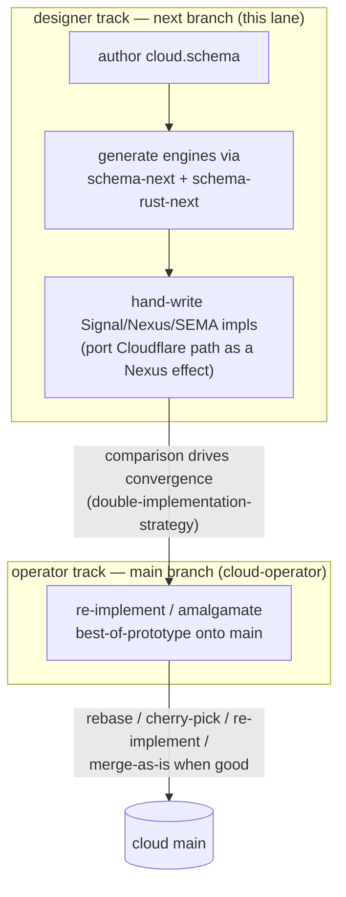
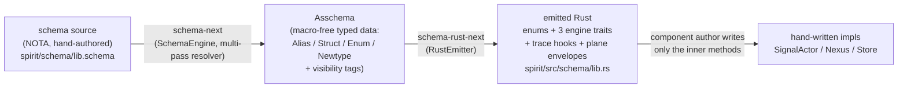
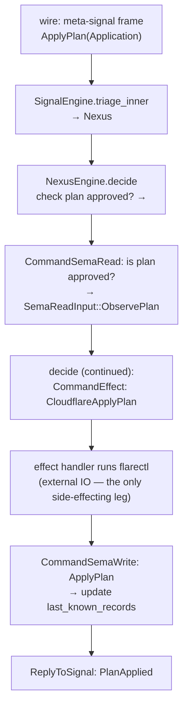

# Cloud component — schema-derived triad port (concept + derivation showcase)

*cloud-designer, 2026-06-04. **Status: draft on disk, NOT committed, NOT on
main.** This is the design the `next`-branch prototype is meant to prove;
it is here for review and redirection before the implementation fan-out
runs. Nothing in this report has material existence on `main` until an
operator integrates it.*

## What this report is

The psyche asked both cloud-designer and cloud-operator to dig up the
cloud component and port it onto the new schema-derived triad-engine
stack — designer proving the forward shape on a `next` branch, operator
re-implementing / integrating on `main`. The psyche specifically wants to
**see the schema and what it produces**: what REST-shaped code, what
interfaces, how interfaces are derived, how traits and implementations are
derived — so design flaws and improvements surface from the derivation
itself.

So this report does three things:

1. Frames the `next`/`main` dual-track workflow for this port.
2. Walks the **derivation chain** end-to-end against the live `spirit`
   reference — schema source → `Asschema` → emitted Rust traits/impls —
   so the chain is reviewable (per Spirit 2565: *seeing what schema
   produces what code is a design-review technique, not just
   documentation*).
3. Proposes the concrete `cloud.schema` the prototype will author, traces
   one cloud operation through the full derivation, and names the design
   flaws + the psyche-gated forks.

## 1. The dual-track workflow for this port

The psyche refined the designer/operator split (Spirit 2556):

> [Designer roles work on a standard next branch by default in each
> repository — next is where breaking changes happen. Operators own main
> and integrate from next at their discretion: rebasing the good parts,
> cherry-picking, re-implementing, or merging the designer branch as-is
> when the code is good. Designer code is not second-class; a clean
> designer branch may be merged to main as-is.]

And on worktree mechanics (Spirit 2557):

> [A standard worktree rotation for next branches is a possible future
> convention but is explicitly deferred; for now designers use the
> existing worktree location for next-branch work.]



Concretely, per repo in the cloud triad (`cloud`, `signal-cloud`,
`owner-signal-cloud`→`meta-signal-cloud`): cloud-designer works on a
`next` branch in a worktree at
`~/wt/github.com/LiGoldragon/<repo>/next/`; cloud-operator owns `main`
and integrates. The two tracks are *compared* — convergence signals the
design is settling; divergence surfaces an open question for the psyche.

## 2. Where the cloud triad stands today

The `active-repositories.md` note "documentation-only at birth" is
**stale**. All three repos are real Rust crates with `schema/`, `src/`,
`tests/`. The current shape:

| Repo | What it is today | Mechanism |
|---|---|---|
| `cloud` | Runtime: ~45 KB `lib.rs`, in-memory `Mutex`-backed `Store`, Cloudflare DNS provider (`flarectl --json` / HTTP), thin CLI | hand-written Rust + `signal_channel!` / `signal_cli!` macros |
| `signal-cloud` | Ordinary **working** contract: `Observe` + `Validate` | `signal_channel!` macro, no daemon |
| `owner-signal-cloud` | Owner **policy** contract: 8 operations | `signal_channel!` macro, no daemon |

Current contract surface:

- **Working** (`signal-cloud`): `Observe(Observation)` where Observation ∈
  {Capabilities, Zones, Records, Redirects, Plan}; `Validate(Validation)`.
  Replies: `Observed`, `Validated`, `RequestUnsupported`, `RequestRejected`.
- **Policy** (`owner-signal-cloud`): `RegisterAccount`, `RotateCredential`,
  `SetPolicy`, `PreparePlan`, `PrepareProjection`, `ApprovePlan`,
  `ApplyPlan`, `RetireAccount`. Replies carry effect notifications +
  `RequestRejected(RejectionReason)`.

Daemon-owned state today (all in `Mutex`, ephemeral):

- **Working state**: `AccountBinding` (provider + account + credential
  handle), `CachedRecordListing` (last-known zone records),
  `DomainProjection`, `Plan` records.
- **Policy state**: `Policy { zones: Vec<ZonePolicy>, capabilities:
  Vec<CapabilityPolicy> }`, `approved_plans`.

The gap to a schema-derived triad component:

1. **No `.schema`** — contracts are hand-written `signal_channel!`, not a
   schema-engine source. There are `*.concept.schema` files but they are
   skeletal pseudo-NOTA placeholders that drive no codegen.
2. **No Signal/Nexus/SEMA planes** — handlers map straight to
   `signal_cloud::Frame` / `owner_signal_cloud::Frame`; there is no triage
   / decision / durable-state separation.
3. **No persistence** — `Store::open()` returns in-memory state; nothing
   reaches `sema-engine`. (Cloud's own ARCH defers this, blocked on
   removing the deprecated `signal-core` dependency.)
4. **Legacy policy-contract name** — `owner-signal-cloud` must become
   `meta-signal-cloud` (Spirit 1567: *the owner-signal to meta-signal
   rename is now active work*).

## 3. What the schema produces — the derivation chain

This is the heart of what the psyche asked to see, grounded in the live
`spirit` reference (the canonical worked example). Per Spirit 1327:

> [Every component runtime in the workspace triad architecture defines its
> Signal / Nexus / SEMA interfaces in schema and conducts core logic
> through schema-emitted traits whose methods take and return root types
> of the concerned interfaces.]

### 3.1 The three lowering stages



`Asschema` is the pivot: it is both `schema-next`'s output AND
`schema-rust-next`'s input, so the two emission layers are independently
testable, and the assembled schema is a reviewable, round-trippable data
object (NOTA + rkyv artifacts).

### 3.2 How interfaces are derived (source → Asschema → Rust)

Four concrete derivations, verbatim from the pipeline mapping:

**Alias** — bare reference binding collapses wrapper noise:
```
schema:    Topic String
Asschema:  (Public Topic (Alias String))
Rust:      pub type Topic = String;
```

**Header variant resolution** — a bare PascalCase variant in the Input/Output
root resolves its payload by namespace lookup (the multi-pass
`SourceTypeResolver` pre-collects namespace type names):
```
schema header:  [(Lookup RecordIdentifier) Count]
+ namespace:    Lookup RecordIdentifier, Count Query
Asschema Input: [(Lookup(Plain RecordIdentifier)) (Count(Plain Query))]
Rust:           pub enum Input { Lookup(RecordIdentifier), Count(Query) }
```

**Newtype vs struct** — single-field bodies become tuple newtypes with
`new`/`payload`/`into_payload`/`From<Payload>`; multi-field bodies stay
structs:
```
schema:    Summary { Description * }
Asschema:  (Public Summary (Newtype (Summary (Plain Description))))
Rust:      pub struct Summary(pub Description);
```

**Cross-crate import** — preserves type identity across crates via
`pub use ... as` (the Spirit 1557-1562 alias pattern):
```
schema:    { Local dependency-crate:module:Type }
Asschema:  [ResolvedImport { local_name: Local, source: {...} }]
Rust:      pub use dependency_crate::schema::module::Type as Local;
```

### 3.3 How traits are derived

The presence of `Input`+`Output` roots plus `NexusWork`/`NexusAction` plus
`SemaWriteInput`/`SemaReadInput` in the Asschema is what *triggers* the
emitter to write the three engine traits. From the spirit reference:

The schema source declares the planes (illustrative shape, from
`spirit/schema/lib.schema`):
```
{}
[Record Observe Lookup Count Remove LookupStash]          <- Input root
[RecordAccepted RecordsObserved RecordsStashed ... Rejected]  <- Output root
{
  NexusWork    [SignalArrived SemaWriteCompleted SemaReadCompleted EffectCompleted]
  NexusAction  [CommandSemaWrite CommandSemaRead ReplyToSignal CommandEffect Continue]
  SemaWriteInput  [Record Remove]
  SemaReadInput   [Observe Lookup Count]
  SemaWriteOutput [Recorded Removed Missed]
  SemaReadOutput  [Observed Found Counted Missed]
}
```

`schema-rust-next` emits the three traits (the surface is uniform across
every component; only the method *bodies* differ per component):
```rust
pub trait SignalEngine {
    fn on_start(&mut self) -> Result<(), ActorStartFailure> { Ok(()) }
    fn triage_inner(&self, input: signal::Signal<signal::Input>) -> nexus::Nexus<nexus::Work>;
    fn reply_inner(&self, output: nexus::Nexus<nexus::Action>) -> signal::Signal<signal::Output>;
    fn triage(&self, input: signal::Signal<signal::Input>) -> nexus::Nexus<nexus::Work> {
        let output = self.triage_inner(input);
        self.trace_signal_triaged();   // typed trace hook, no-op by default
        output
    }
}
pub trait NexusEngine {
    fn decide(&mut self, input: nexus::Nexus<nexus::Work>) -> nexus::Nexus<nexus::Action>;
    fn execute(&mut self, input: nexus::Nexus<nexus::Work>) -> nexus::Nexus<nexus::Action> { /* trace + decide */ }
}
pub trait SemaEngine {
    fn apply_inner(&mut self, input: sema::Sema<sema::WriteInput>) -> sema::Sema<sema::WriteOutput>;
    fn observe_inner(&self, input: sema::Sema<sema::ReadInput>) -> sema::Sema<sema::ReadOutput>;
}
```

Trace identity is *typed* — the emitter projects `SignalObjectName` /
`NexusObjectName` / `SemaObjectName` enums from the plane variants, wrapped
in `ObjectName` and carried as `TraceEvent(ObjectName)`. No stringly trace
names; the trace surface is part of the trait contract, not a side enum
(Spirit 1365).

### 3.4 How implementations are derived (i.e., what the author writes)

The author writes **only the inner methods**, attached to data-bearing
nouns. In the spirit reference exactly three impls carry all hand-written
logic:

```rust
impl SignalEngine for SignalActor { /* triage_inner: wrap Input as NexusWork::SignalArrived, attach origin_route */ }
impl NexusEngine  for Nexus        { /* decide: the decision loop over NexusWork → NexusAction */ }
impl SemaEngine   for Store        { /* apply_inner / observe_inner: redb read/write */ }
```

The REST-shaped wire (Spirit 951) falls out of this: the `Input`/`Output`
roots are typed resource operations, SEMA is the single-writer canonical
state, and the short-header + rkyv framing (`encode_signal_frame`,
`INPUT_RECORD=1`, …) is generated — NOTA never touches the wire, only the
CLI/argv boundary.

## 4. The proposed schemas — two contracts (psyche decision, Spirit 2568)

Per your call, the port authors **two schemas**, one per contract repo,
each emitting its own Signal/Nexus/SEMA engines and sharing record types;
the `cloud` runtime crate imports both and runs two listeners (the triad's
two authority surfaces). The split is clean: the working contract is
read-only (no `SemaWriteInput` at all); the policy contract owns every
mutation. The provider API call (the Cloudflare DNS mutation) becomes a
**Nexus `CommandEffect`** — the cleanest realization of the 5-variant
action set (Spirit 1486) and the single most important shape decision in
the port.

**`signal-cloud.schema` — working contract (peer-callable, read-only):**
```
{}
[ Observe Validate ]                                       # Input root
[ Observed Validated RequestUnsupported RequestRejected ]  # Output root
{
  NexusWork    [SignalArrived SemaReadCompleted EffectCompleted]
  NexusAction  [CommandSemaRead ReplyToSignal CommandEffect Continue]
  Effect       [CloudflareObserveZones CloudflareObserveRecords]
  SemaReadInput   [Observe ObservePlan Validate]
  SemaReadOutput  [Observed Validated PlanObserved Missed]
}
```

**`meta-signal-cloud.schema` — policy contract (owner-only, the mutations):**
```
{}
[ RegisterAccount RotateCredential SetPolicy
  PreparePlan PrepareProjection ApprovePlan ApplyPlan RetireAccount ]
[ AccountRegistered CredentialRotated PolicySet
  PlanPrepared PlanApproved PlanApplied AccountRetired RequestRejected ]
{
  NexusWork    [SignalArrived SemaWriteCompleted SemaReadCompleted EffectCompleted]
  NexusAction  [CommandSemaWrite CommandSemaRead ReplyToSignal CommandEffect Continue]
  Effect       [CloudflareApplyPlan]
  SemaWriteInput  [RegisterAccount RotateCredential SetPolicy PreparePlan PrepareProjection ApprovePlan ApplyPlan RetireAccount]
  SemaReadInput   [ObservePlan]
  SemaWriteOutput [AccountRegistered CredentialRotated PolicySet PlanPrepared PlanApproved PlanApplied AccountRetired]
  SemaReadOutput  [PlanObserved Missed]
}
```

Shared record types (`Provider`, `DomainName`, `Plan`, `CredentialHandle`,
`ProviderAccount`, …) live in a common imported module so both schemas
reference one definition via the cross-crate `pub use … as` path from §3.2.

### 4.1 One operation, fully derived — `ApplyPlan`

The end-to-end trace the prototype must produce for `ApplyPlan` (the
operation that mutates real DNS), showing the effect path:



The author writes: `decide`'s match arm for `ApplyPlan` (orchestrating
read→effect→write→reply via `Continue`), the `Store` SEMA impls, and the
Cloudflare effect handler. Everything else — the enums, the trait
surfaces, the framing, the trace hooks — is generated.

## 5. Design flaws and improvements spotted

From the three maps plus synthesis:

1. **The Cloudflare call belongs as a Nexus `CommandEffect`, not fused in
   a handler.** Today provider IO is inline in the owner handler. The
   schema-derived shape makes the external call an explicit `Effect`
   variant the runner dispatches — testable, traceable, and the natural
   home for retry/rate-limit later.
2. **`Mutex` `Store` → `sema-engine` durability.** All daemon state
   evaporates on restart. The `SemaEngine`/`Store` impl is where redb
   persistence lands — but cloud's ARCH says this is blocked on removing
   the deprecated `signal-core` dependency. So the *first* prototype
   should keep the in-memory `Store` behind the `SemaEngine` trait and
   defer redb (see §6 scope).
3. **Plan identifiers are deterministic strings** (`zone-Cloudflare-plan`)
   — collision risk. Schema-derived `Plan` should carry a minted
   identifier.
4. **Record diffing by `(name, kind)` with no etag/version** → stale-write
   risk if provider state changed between read and apply. Worth a
   version/etag field on `CachedRecordListing`.
5. **`triad_main!` is not generated even in the reference yet** — spirit
   hand-writes the `Nexus::decide` loop with a manual `ContinuationBudget`.
   The cloud port should NOT hand-roll its own runner divergently; it
   should use the same hand-written loop shape as spirit and feed the
   `triad_main!` generation effort, not fork it.
6. **Two `signal_channel!` declarations must merge into the schema** — and
   this collides with the repo-triad's two-contract-repo packaging. That's
   the #1 fork (§6).
7. **`owner-signal-cloud` → `meta-signal-cloud` rename is wide but
   mechanical** — touches the repo name, `Cargo.toml`, every
   `owner_signal_cloud::` import, frame/socket/listener names, and ARCH
   prose. Best done as its own clean slice so the diff is reviewable.

## 6. What the first prototype proves + psyche-gated forks

**Scope of this first `next` prototype** (now running as fan-out
`wxm9l4dvb`): author the two contract schemas (`signal-cloud.schema`
working, `meta-signal-cloud.schema` policy), generate the engines, and
scaffold the cloud daemon's three engine impls with the **Cloudflare DNS
path as a Nexus `CommandEffect`** (`Observe` + `PreparePlan` +
`ApprovePlan` + `ApplyPlan`). `Store` stays the `SemaEngine` impl
**in-memory** for now (redb is blocked on `signal-core` removal). The
`owner-signal-cloud` → `meta-signal-cloud` repo rename is a separate
sibling slice (the policy schema is authored under the new name now). This
proves the schema → engine-trait derivation for a real provider-IO
component without taking on the persistence migration in the same breath.

**Forks** — F1–F3 resolved by your decisions; F4 remains open:

- **F1 — RESOLVED: two schemas** (Spirit 2568). One per contract repo
  (`signal-cloud.schema` working, `meta-signal-cloud.schema` policy), each
  emitting its own engines and sharing record types; `cloud` imports both
  and runs two listeners. The triad-faithful shape; supersedes the
  single-`cloud.schema` target in cloud's ARCHITECTURE.md.
- **F2 — RESOLVED: `meta-signal-cloud`** (Spirit 1567 — the owner-signal →
  meta-signal rename). The repo rename is a separate mechanical slice; the
  policy schema is authored under that name now.
- **F3 — RESOLVED: in-memory `Store`, defer redb.** The prototype keeps
  `Store` behind the `SemaEngine` trait in-memory; `sema-engine`
  persistence is a later slice (blocked on `signal-core` removal).
- **F4 — OPEN: provider feature-flagging.** How should the schema express
  provider-specific capabilities (Cloudflare vs Hetzner vs GoogleCloud)
  that are Cargo features today? The prototype is Cloudflare-only; this
  fork lands when a second provider does.

## 7. Operator's main-track mirror

Per the psyche's "both agents" framing, cloud-operator runs the parallel
track on `main`: re-implementing / amalgamating the same port onto the
cloud repos' `main`, then the two tracks are compared. Convergence between
the designer `next` shape and the operator `main` shape signals the design
is reliable; divergence becomes an explicit question. This is the
double-implementation strategy applied to the cloud port.
