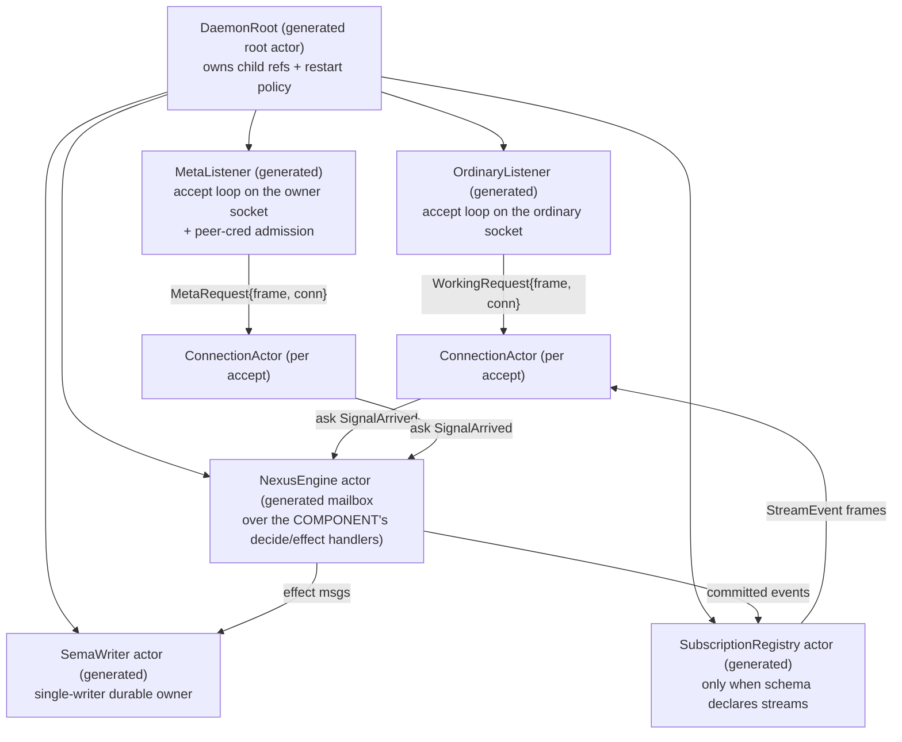

# 2 — proposal B: the ACTOR-NATIVE generated daemon

cloud-designer, 2026-06-07. One of three independent best-architecture proposals
under the zero-backward-compatibility mandate (Spirit `ax2k`, Maximum). Companion
to `0-frame-and-method.md` (the panel method) and proposals `1` / `3`. Ground
facts reused from `33/1-3` (emitter internals, runtime seams, consumer shapes).

**Philosophy in one line.** The single best daemon the emitter generates is a
**kameo actor system**. The truth-pin — *"runtime roots are actors, public actor
nouns carry data, topology/trace tests prove real mailbox paths"* — is taken
LITERALLY and made the generated default, not an aspiration met later. The
thread-per-request `MultiListenerDaemon` + `BoundedWorkers` shell is **deleted**;
the emitter generates an actor topology from the schema, and each component
hand-writes only the engine decision algorithm as actor message handlers.

## The pivotal fork — my hard position

**The one best generated daemon is an actor (kameo) system. The thread-based
`MultiListenerDaemon`/`BoundedWorkers` accept-loop shell is replaced outright.**

The ground-truth surveys (`33/2`, `33/3`) reached "concurrency as a declared
opt-in over a serial accept loop" — but that conclusion was *forced by the
compatibility reflex the psyche has now removed*. `33/3`'s entire verdict rests
on "message and spirit must regenerate byte-identically" and "the default emitted
spine stays exactly as it is." With `ax2k`, that constraint is gone. Once you
stop protecting the serial default, the question collapses: there is no reason for
the emitter to generate a hand-rolled accept loop + a permit-counting thread pool
+ a `Mutex<Engine>` escape valve, when the workspace's own actor-density pin
already mandates the strictly better structure and `message` was *defined* by the
psyche as a kameo actor daemon.

The decisive observation from reading the five consumers: **every one of them is
already an actor system wearing a thread costume.**

- `lojix` `LojixRuntime` (`daemon.rs:121-166`) is a root that owns child residency
  (`BoundedWorkers`), shared state (`Arc<Store>`), and spawns one short-lived
  `RequestWorker` per connection. That IS a root actor spawning per-request child
  actors — hand-rolled with `thread::spawn` + a permit semaphore instead of a
  mailbox + a pool.
- `cloud` `CloudDaemon` is the same root minus the pool: a serial root that builds
  a per-request engine over `Arc<SchemaStore>`. A root actor with a child pool of
  size... unspecified.
- `message` `MessageEngine` (`engine.rs:46-83`) takes `&mut self`, runs one request
  per connection on its own call stack, and is guarded by a `Mutex` PURELY because
  the emitted spine hands it `&Self::Engine`. The schema even emits its lifecycle
  as `on_start`/`on_stop` returning `ActorStartFailure`/`ActorStopFailure`
  (`schema/sema.rs:547-551`, emitter `lib.rs:2057-2061`). The engine trait is
  *already an actor trait*; the `Mutex` is the costume seam — it exists only to
  fake single-writer ownership the actor model gives for free.
- `spirit` has a long-lived `&self` engine, a streaming subscription registry with
  per-subscriber `UnixStream` writers (`EmittedSubscriptions`, emitter
  `daemon_emit.rs:663-716`), and a publish fan-out. A subscription registry that
  owns writer handles and fans out events IS a long-lived actor with a child set.
- `repository-ledger` hand-rolls two `UnixListener` + `thread::spawn` listener
  loops over `Arc<Mutex<Store>>` plus a 2-second spool-ingest background loop
  (`daemon.rs:42-57`). Two listener actors + a periodic actor + a single-writer
  store actor — hand-rolled, outside both the emitter and triad-runtime.

Five components, five hand-rolled actor systems, five different costumes
(`BoundedWorkers`, serial inline, `Mutex<Engine>`, subscription registry, raw
`thread::spawn`). The actor-native proposal is the observation that **the schema
already knows the topology** — it emits Signal/Nexus/SEMA planes, lifecycle hooks,
and a subscription registry. The emitter should generate the *real* mailbox
topology those costumes are imitating, once, and let all five shed the costume.

This honors `skills/actor-systems.md` §"Actors all the way down" and the truth-pin
without a single carve-out. The argument that "the generated daemon layer is the
actor-density exception" (the alternative the brief invited) is **wrong on its own
terms**: the generated daemon is precisely the *runtime root* the pin names first.
Exempting the generated layer would exempt the one layer the pin most directly
governs.

## The generated actor topology — what the emitter emits from the schema

The emitter generates a fixed root topology, parameterized by the schema's planes
and tiers. Every node is a real kameo actor (`impl Actor`, typed `Message<T>`,
spawned, supervised). The component hand-writes only the leaf decision handlers.



### The seven generated actor nouns

| Generated actor | Residency | State it owns | Generated from |
|---|---|---|---|
| `DaemonRoot` | one, long-lived | child `ActorRef`s + restart policy | `NexusDaemonShape` (tiers, streams) |
| `OrdinaryListener` | one per working socket | the bound `UnixListener`, frame bounds | `WorkingListenerTier` |
| `MetaListener` | one per meta socket | listener + owner-uid admission policy | `MetaListenerTier` + owner authority |
| `ConnectionActor` | one per accepted stream | the `UnixStream`, the decoded tier tag | the contract modules (working/meta roots) |
| `NexusEngine` actor | one, long-lived | the component `Engine` value | the `nexus` plane + `ComponentDaemon` decide hook |
| `SemaWriter` | one, long-lived | the durable `Store` (redb / in-mem) | the `sema` plane |
| `SubscriptionRegistry` | one, long-lived | per-subscriber writers + filters | the schema's `streams()` (emitted only if non-empty) |

`ConnectionActor` is the per-request actor. It replaces both `RequestWorker`
(lojix's `thread::spawn` child) and the inline serial path. It is short-lived: it
owns the accepted `UnixStream`, reads + decodes the frame (bounded, timed), `ask`s
the `NexusEngine` actor for the typed reply, writes the reply, and stops. Its
mailbox is the natural backpressure point — kameo's bounded mailbox replaces
`BoundedWorkers`' permit semaphore (`33/2` confirms `BoundedWorkers` is just a
capped thread spawner; a bounded actor mailbox is the same flood-control,
expressed as topology).

### Why these are real actors, not costumes (the `skills/actor-systems.md` test)

Each node passes the three-part test from §"Core rule" (typed domain name; a
failure mode callers act on; independently testable with synthetic input):

- `NexusEngine` actor — owns the decision state, fails with the component `Error`,
  testable by sending it a synthetic `SignalArrived` and asserting the reply. It is
  NOT a ZST costume (§"Zero-sized actors are not actors") because it carries the
  component's real `Engine` data (lojix's `Store` cursor, spirit's redb engine).
- `SemaWriter` — the single-writer durable owner; §"Pattern D — Single-writer
  authority" is enforced by ownership, not a `Mutex`. This is where `message`'s
  `Mutex<MessageEngine>` and the ledger's `Arc<Mutex<Store>>` both dissolve: the
  single writer is an actor; readers are separate; no lock.
- `MetaListener` — owns admission control (peer-cred reject), a real failure mode
  (reject before the engine). §"Actor or data type" keeps it an actor because it
  owns admission policy, not just forwarding.
- `ConnectionActor` — owns the per-request stream + tier; testable by feeding a
  synthetic frame and asserting the written reply. Earns actorhood by owning state
  (the stream) + a failure mode (decode/IO error → typed rejection).
- `DaemonRoot` — the runtime-root exception from §"Actor or data type": it legitimately
  holds child `ActorRef`s because child lifecycle + restart policy ARE its state.

`OrdinaryListener`/`MetaListener` are the one place to be careful: a listener that
only accepts and forwards risks being a `*Phase` forwarding helper. They earn
actorhood because they own the bound `UnixListener` (real state with a failure
mode — bind failure, accept error) and, for the meta listener, admission policy.
If a future design wants the accept loop to be a pure phase, it is named
`IngressPhase` per §"Phase actors" with a trace-witness test — but here they own
the socket, so they are actors.

## The hook surface — what the component hand-writes (ESSENCE clarity thesis)

This is the heart of the proposal. The readability thesis says the hand-written
code should be MOSTLY THE REAL ALGORITHM. Under actor-native, the component
hand-writes ZERO transport, ZERO accept loop, ZERO concurrency primitive, ZERO
lock — it writes the **engine's decision as kameo message handlers on its own
data-bearing engine type**. The emitter generates everything that is not the
algorithm.

The `ComponentDaemon` trait (today's escape-hatch-laden shape, emitter
`daemon_emit.rs:367-416`) is replaced by a small, actor-shaped trait. The
component implements `kameo::Actor` for its engine and one `Message<T>` per
typed work root — and nothing else.

```rust
/// The only daemon code a component hand-writes: its engine IS a kameo actor,
/// and it answers the ONE generated work message. The emitter generates the
/// root, listeners, connection actors, the subscription registry, the bind,
/// the entry, transport bounds, and peer-cred admission — everything that is
/// NOT the component's decision algorithm.
pub trait ComponentEngine: kameo::Actor<Args = Self> + Sized {
    /// The single Nexus root the generated `NexusEngine` actor drives. Both the
    /// ordinary and owner tiers decode into ONE `SignalInput` (the schema-declared
    /// Nexus root); there is no second contract escape hatch.
    type Work: SignalArrivedMessage;       // = NexusWork::SignalArrived(SignalInput)
    type Reply: Send + 'static;            // = SignalOutput
    type Error: ComponentDaemonError;

    /// Open the durable resources and construct the engine value the root spawns
    /// as the `NexusEngine` actor. Called once, inside the actor's `on_start`.
    fn open(configuration: &Self::Configuration) -> Result<Self, Self::Error>;

    type Configuration: DaemonConfiguration;
    const PROCESS_NAME: &'static str;
}

// The component's REAL algorithm — the whole of its hand-written daemon code:
impl kameo::Actor for LojixEngine { type Args = Self; /* on_start opens the Store */ }

impl Message<SignalArrived> for LojixEngine {
    type Reply = SignalOutput;
    async fn handle(&mut self, work: SignalArrived, _ref: Context<'_, Self>) -> SignalOutput {
        // match typed input → make the decision → call the next typed interface →
        // return typed output. This is the engine's `execute` runner, now a handler.
        self.execute(work.into_nexus_work())
    }
}
```

That handler body is the ENTIRE hand-written surface. Compare to today:

- `lojix` hand-writes 275 lines (`ListenerRole`, `LojixRuntime`, `RequestWorker`,
  `serve_ordinary`/`serve_owner`, `BoundedWorkers` wiring, frame codec, read
  timeout, tier re-split, `invariant_rejection`, socket-mode validation). Under
  actor-native, `lojix` hand-writes: `impl Actor for LojixEngine` (open the Store)
  + `impl Message<SignalArrived>` (the existing `execute` body) + the tier re-split
  helpers (`ordinary_reply`/`meta_reply` — and even those become generated, see
  below). Roughly the inner 15 lines of `RequestWorker::execute`.
- `message` hand-writes `impl Actor for MessageEngine` + `impl Message<SignalArrived>`
  (the body of `MessageEngine::handle`, `engine.rs:76-96`). The `Mutex`, the
  `MessageDaemon` ZST selector, the `MessageDaemonError` From-soup — all gone. The
  engine that was *already* `&mut self` becomes a kameo handler with `&mut self`
  natively; the `Mutex` was a workaround for the wrong (shared-ref) emitted spine.

### The two-tier funnel is GENERATED, not hand-written

The "two typed wire contracts → one Nexus root" property (`33/1` property 2) is
emitted entirely. The `ConnectionActor` is generated per tier: it knows, from the
schema, that the ordinary tier decodes `signal_lojix::Input` and wraps
`SignalInput::OrdinaryInput`, the owner tier decodes `meta_signal_lojix::Input`
and wraps `SignalInput::MetaInput`. The reply re-split (`SignalOutput::OrdinaryOutput`
→ ordinary wire, `MetaOutput` → owner wire, wrong-tier → typed
`invariant_rejection`) is generated from the same schema knowledge. lojix's
hand-written `serve_ordinary`/`serve_owner`/`ordinary_reply`/`meta_reply`/
`invariant_rejection` (`daemon.rs:189-274`) ALL become emitted code — they are
pure schema-derived tier plumbing, exactly the "large hand-written plumbing"
ESSENCE says belongs in emission. **The meta tier stops being an escape hatch
for everyone** (this is the zero-compat win spirit could not get under `33/3`).

## How all five consumers become actor daemons

### lojix — root + per-request connection actors + single Store-owner

The `nix`-build concern (`33` headline: a multi-minute build must not block
queries) is solved by actor residency, not a thread pool. The `NexusEngine` actor's
`execute` runs the deploy effect. The key change: **the long-running effect is its
own actor message, not an inline call.** The `NexusEngine` handler for a Deploy,
instead of blocking, spawns/`tell`s a `DeployEffect` child actor and the connection
`ask` is answered when the effect actor replies. Concurrent queries hit the
`SemaReader` path and never wait on the build. lojix's per-request fresh
`SchemaRuntime` cursor (intent 2alg) becomes per-`ConnectionActor`-message state —
the cursor lives on the connection's `ask`, never shared, by construction.

What lojix LOSES: its hand-written `BoundedWorkers`, `RequestWorker`,
`LojixRuntime`, `ListenerRole`, the inline frame codec, the socket-mode validator
(moves to the generated `MetaListener` admission). It keeps only the `execute`
decision and the deploy effect logic, now as actor handlers.

### cloud — identical to lojix, the second proof

cloud is structurally lojix; it becomes the same topology. Its serial-ness (no
pool today) was never a design choice — it was the absence of one. Under
actor-native, cloud gets concurrent serving for free from the `ConnectionActor`
mailbox. `cloud` keeps `SchemaRuntime::reply_to_signal` as the `NexusEngine`
handler body. It LOSES `CloudRuntime`, `serve_*`, the component-owned meta codec
(`handle_meta_stream`, `schema_daemon.rs:93-107` — now the generated `MetaListener`
+ `ConnectionActor` typed path), and the `MAXIMUM_REQUEST_FRAME_BYTES`/timeout
constants (now generated transport bounds, always-on).

### message — the costume comes off

`message` is the consumer this proposal most vindicates. It is *already* the
workspace's named kameo actor daemon; today's source fakes it with `Mutex<MessageEngine>`
because the emitted spine hands a shared ref. Under actor-native: `MessageEngine`
becomes `impl Actor` directly, its `&mut self` `handle` becomes a `Message<SignalArrived>`
handler with native `&mut self`, the `Mutex` is deleted, the `MessageDaemon` ZST
selector is deleted, the `ForwardToRouter` effect becomes a child effect message.
`message` LOSES: the `Mutex`, the ZST daemon marker, the `From`-soup error enum
(the generated `ComponentDaemonError` covers frame/listener/signal arms). It KEEPS
only the forward decision + the router-forward effect — its actual algorithm.
message's `FORWARD_ORIGIN_ROUTE = OriginRoute(1)` constant note ("serves one request
per connection on its own call stack, so there is no concurrent in-flight mail")
is the giveaway: that single-flight property is exactly an actor's single-mailbox
guarantee, hand-asserted in a comment instead of enforced by topology.

### spirit — streaming is the SubscriptionRegistry actor

spirit's `EmittedSubscriptions` (emitter `daemon_emit.rs:663-716`) — a registry of
per-subscriber `UnixStream` writers + a publisher + an `RwLock`-split
(`daemon_emit.rs:704`) — becomes the `SubscriptionRegistry` actor verbatim in
spirit, this time as a real mailbox instead of an `RwLock`-guarded shared struct.
Subscribe = a message that registers a writer child; publish = a message that fans
out. The `Watch`/`SubscriptionToken`/`StreamEvent` surface maps directly onto
`Message<Subscribe>` / `Message<Publish>`. spirit's `Configure` meta (its
request/reply escape hatch, `daemon.rs:130-137`) becomes a typed `MetaInput` arm of
the ONE `SignalInput` Nexus root through the generated `MetaListener` →
`ConnectionActor` → `NexusEngine` path — the escape hatch is gone; `Configure` is
just another owner-tier work message. spirit's `start`/`stop` (`daemon.rs:110-116`)
become the `NexusEngine` actor's `on_start`/`on_stop` — which the schema ALREADY
emits as `ActorStartFailure`/`ActorStopFailure` (`schema/signal.rs:1014-1017`).
spirit LOSES: the `RwLock` split, the `handle_meta_stream` escape hatch, the
hand-written `MetaSignalTransport`, the manual filter/token/event hook wiring (now
the registry's typed messages).

### repository-ledger — joins the emitter for the first time

The ledger is currently outside both the emitter and triad-runtime
(`33/3`). Under zero-compat it ADOPTS the generated actor daemon wholesale. Its two
hand-rolled `thread::spawn` listener loops become the generated `OrdinaryListener`
/ `MetaListener`. Its `Arc<Mutex<Store>>` becomes the `SemaWriter` actor (single
writer, no lock). Its 2-second spool-ingest background loop
(`daemon.rs:51-56`) becomes a generated **periodic actor** — a `SpoolIngest` actor
the `DaemonRoot` spawns with a kameo interval message (this is the one new generated
archetype the ledger forces; see below). The ledger's `handle_ordinary_request` /
`handle_meta_request` become `NexusEngine`/`SemaWriter` handlers. It LOSES its
entire hand-written `daemon.rs` (232 lines), gains an `impl Actor` + handlers + a
NOTA schema declaring its tiers and its periodic spool task.

## Daemon archetypes — how many distinct daemon shapes the emitter generates

**The emitter generates ONE daemon shape with three optional, schema-derived
faces — not three separate daemons.** The merit reason for ONE: the topology
(root → listeners → connection actors → NexusEngine → SemaWriter) is identical for
all five; the faces are presence/absence of child actors the schema already
declares.

1. **Base request/reply face** — root + listener(s) + connection actors +
   NexusEngine + SemaWriter. Every consumer has this. The meta tier is just a
   second listener feeding the same NexusEngine through the same typed `SignalInput`
   root — not a separate archetype. (Collapses the report-33 "single vs multi
   listener" branch into "one or two `Listener` children" — a count, not a shape.)
2. **Streaming face** — adds the `SubscriptionRegistry` child actor. Emitted iff
   `schema.streams()` is non-empty (the precedent already exists: `emits_stream`
   is the one schema-derived daemon flag today, `33/1`). spirit gets it; the
   others do not.
3. **Periodic face** — adds interval-driven actor children (the ledger's spool
   ingest). Emitted iff the schema declares a periodic task. This is the one new
   generated archetype the ledger forces, and it is genuinely actor-shaped (a
   long-lived actor with a self-scheduled interval message) — a clean fit, not a
   bolt-on.

Three FACES, one SHAPE. A consumer's face set is fully schema-derived: tiers from
the contract modules, streaming from `streams()`, periodic from a declared task.
The component never picks an archetype; the schema's content selects the faces.

## Meta / owner tier — the ONE owner model (no escape hatch)

There is exactly ONE owner-tier model: **the `MetaListener` actor is a fail-closed
admission gate, and the owner tier is a typed second leg of the ONE `SignalInput`
Nexus root.** No escape hatch survives — `handle_meta_stream` (cloud, spirit) and
the raw meta listener (ledger) are all deleted.

- **Admission (Spirit `9v7h`, fail-closed).** The `MetaListener` actor reads
  `ConnectionContext::from_stream` (the kernel `SO_PEERCRED`, `33/2`) on every
  accept and REJECTS — drops the stream, never spawns a `ConnectionActor` — when
  the peer uid is not the configured owner uid. This is admission control as actor
  state (the owner-uid policy), enforced BEFORE the engine, exactly
  `skills/actor-systems.md` §"validates authority → actor-shaped." The owner uid is
  config data (`DaemonConfiguration::owner_user_id`, the one accessor `33/2`
  proposes), read by the generated `MetaListener`, comparison generated.
- **Typing.** The owner tier decodes its own `meta_signal_*::Input` and wraps
  `SignalInput::MetaInput` — same generated `ConnectionActor` path as ordinary,
  different decode + wrap, both feeding the ONE `NexusEngine`. Defense-in-depth
  socket-mode bind stays (generated into the `MetaListener` spawn).

No "escape hatch unless argued on merit" — and there is no merit argument for one,
because the only reason it existed (`33/3`: spirit's `Configure` is a different
shape) was a compatibility accommodation. Under `ax2k`, spirit's `Configure`
becomes a typed owner-tier work message like every other.

## Transport + auth — always-on properties, not options

Both are baked into the generated actors, never opt-in (`ax2k`: never preserve a
current shape; non-disruption is not a virtue):

- **Frame bounds (always-on).** The generated `ConnectionActor` reads frames
  through `LengthPrefixedCodec::new(MaximumFrameLength::new(bound))` — NEVER
  `::default()` (the 4 GiB hole, `33/1` property 3). The bound is a
  `NexusDaemonShape` field with a safe default (8 MiB), generated into every
  connection actor. `set_read_timeout` (10 s default) is set on the stream before
  the read, always. Today's `lojix`/`cloud` hand-write these constants; they
  become generated and universal.
- **Peer auth (always-on).** `ConnectionContext::from_stream` is read for EVERY
  accepted connection on EVERY tier (today only the working tier reads it, and the
  meta tier reads nothing — `33/2` the gap). The `ConnectionContext` is carried as
  data on the `WorkingRequest`/`MetaRequest` message into the `ConnectionActor`
  and on to the `NexusEngine` — "public actor nouns carry data" (the pin) realized:
  the peer-cred is a typed field on the request message, available to the engine's
  origin-route minting (replacing lojix's hardcoded `OriginRoute(0)`). The meta
  tier additionally enforces the fail-closed uid reject at the `MetaListener`
  admission gate above.

`ConnectionContext` peer auth is thus an always-on property of the generated
topology, surfaced as message data and enforced as admission — not a hook the
component may forget to call.

## What components lose — honest accounting

Per the mandate, every component is broken at once. The losses:

| Component | What it loses | What it keeps (its real algorithm) |
|---|---|---|
| lojix | 275-line `daemon.rs`: `BoundedWorkers`/`RequestWorker`/`LojixRuntime`/`ListenerRole`, inline codec, read-timeout consts, tier re-split, `invariant_rejection`, socket-mode validator | the `execute` decision + the deploy effect |
| cloud | `CloudRuntime`/`serve_*`/`handle_meta_stream` meta codec, frame/timeout consts | `reply_to_signal` decision |
| message | `Mutex<MessageEngine>`, `MessageDaemon` ZST, `MessageDaemonError` From-soup | the forward decision + router-forward effect |
| spirit | `RwLock` subscription split, `handle_meta_stream` escape hatch, `MetaSignalTransport`, manual stream-hook wiring | the intent engine + filter/event policy (as registry messages) |
| repository-ledger | entire 232-line hand-rolled `daemon.rs` (two `thread::spawn` loops, `Arc<Mutex<Store>>`, spool loop) | `handle_*_request` decisions + spool ingest (as a periodic actor) |

**The whole stack is rewritten.** triad-runtime's `MultiListenerDaemon`,
`BoundedWorkers`, `DaemonRuntime`/`MultiListenerRuntime` traits, and the
`SingleListenerDaemon` are **deleted** (or reduced to the `UnixListener` bind
helper + the frame codec the listener actors reuse). The emitter's entire
`daemon_emit.rs` thread-based spine (`GeneratedDaemonRuntime`, `WorkingTransport`,
`DaemonBinder` over `MultiListenerDaemon`) is **replaced** by actor-topology
emission. kameo becomes a real dependency of every component and of triad-runtime
(today it is a dependency of NONE — confirmed: `kameo` is absent from every
`Cargo.toml`; the actor-density pin is currently aspirational, and this proposal is
what makes it true).

The honest cost: this is the largest rewrite of the three proposals. It introduces
an async runtime (kameo is async; `33/2`'s sync accept loop is gone) into a stack
that is sync today — every `Engine::handle`/`execute` becomes an `async fn handle`.
That async-conversion ripple is real and is this proposal's chief liability. It is
justified only because the workspace has ALREADY decided actors are the runtime
shape (the pin), and `ax2k` removes the only reason (compat) to defer paying it.

## Why this is the most beautiful per the ESSENCE order

- **Clarity (1).** Each layer names exactly one thing: the schema names the planes
  + tiers, the emitter names the actor topology, the generated Rust names the
  actor nouns + message types, and the hand-written code is *literally* the engine
  algorithm as a `Message<SignalArrived>` handler — nothing else. No accept loop,
  no pool, no lock, no codec in component code. This is the readability thesis at
  its strongest of the three proposals: the hook surface is one trait + one handler.
- **Correctness (2).** Every typed boundary is a typed kameo message: `SignalArrived`
  carries `SignalInput` + `ConnectionContext`; the reply is `SignalOutput`. The
  single-writer SEMA invariant is enforced by actor ownership, not a `Mutex` a
  future edit could forget. Peer-cred is a typed field, not an optional hook call.
- **Introspection (3).** This is where actor-native dominates decisively. The pin
  demands "topology/trace tests prove real mailbox paths." A thread-pool daemon is
  opaque (`33/2`: `BoundedWorkers` has no join/inspect surface). An actor topology
  is observable by construction: every request is a traced mailbox hop, the
  generated topology is a testable graph, and `skills/actor-systems.md`'s trace
  witnesses fall out for free. State is visible because state lives in named actors.
- **Beauty (4).** Special cases collapse: single-vs-multi-listener → a child count;
  escape-hatch meta → a typed tier; `Mutex<Engine>` / `Arc<Mutex<Store>>` /
  `RwLock` / `BoundedWorkers` / raw `thread::spawn` → ONE pattern (named actors with
  mailboxes). Five hand-rolled concurrency models resolve into one generated
  topology. The whole point of `skills/actor-systems.md` — repetition resolving into
  one named pattern — is achieved at the emitter level.

## Open questions

1. **Async ripple.** kameo is async; the engines are sync today. Does every
   `execute`/`handle` become `async fn`, or does the `NexusEngine` actor run the
   sync engine on a blocking task inside its handler? The former is cleaner (true
   actor-native) but is the larger rewrite; the latter keeps engine bodies sync at
   the cost of a blocking-task seam. The proposal assumes the former; the synthesis
   should confirm with the psyche.
2. **kameo as a triad-runtime dependency.** Does the generated-actor topology live
   in triad-runtime (so the emitter references `triad_runtime::actor::*`), or does
   the emitter emit kameo code directly into each component? The former keeps the
   reusable actor nouns generic; the latter keeps triad-runtime free of kameo. The
   actor-density pin + `skills/kameo.md` ("one Rust actor library") argues for the
   former.
3. **The periodic-actor archetype** (ledger's spool ingest) is the one new
   generated shape — is a declared periodic task a first-class `NexusDaemonShape`
   face, or does the ledger hand-write its one periodic actor while adopting the
   generated request/reply topology? Cleaner as a generated face; simpler as a
   one-off hand-written child.
4. **DeployEffect residency (lojix).** Is the long `nix` build a child actor the
   `NexusEngine` spawns per deploy (clean isolation, restartable), or a blocking
   task? This is the concrete test of whether actor-native actually delivers the
   "build never blocks queries" property the brief centers on.
