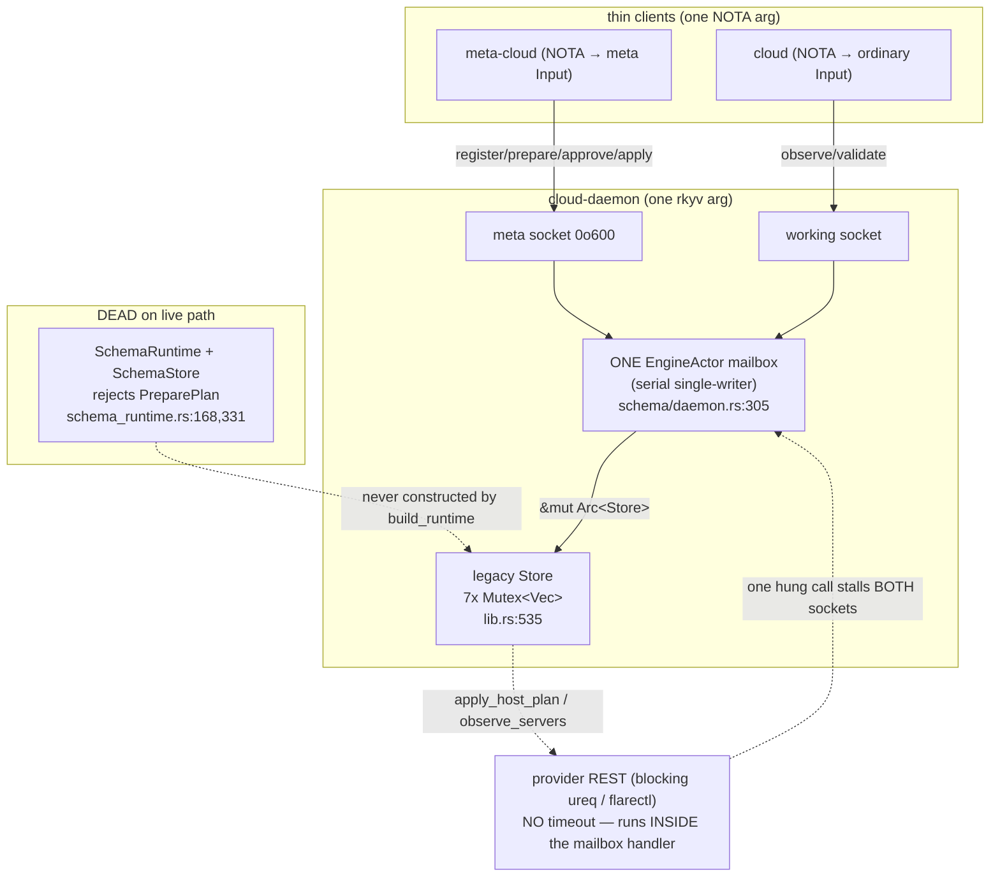

# 1 — daemon and synchronous Store path

cloud-designer, session 68, lane 1. Audit of the `cloud-daemon` entrypoint,
the emitted daemon spine, the synchronous provider `Store` path, and the
parallel sema-engine pilot. HEAD `7f190c3` (= `origin/main`). Read-only;
every claim cites `file:line` on the **production** path and distinguishes it
from what a `#[cfg(test)]` harness can do.

This lane resolves the open question report 36 left at 2026-06-07 ("zero
actors, both runtimes"): the actor adoption **has since happened**
(`469f99d cloud: adopt actor-native generated daemon`), but the blocking
hazard report 36 flagged did not dissolve — it **relocated** from a coarse
`Arc<Mutex<Store>>` into a single kameo mailbox. The verdict below is sharper
than 36's because the code is now post-cutover.

## The one-paragraph answer

cloud's live daemon is a **real kameo actor in form and a serial
single-writer in substance**. The emitted spine spawns exactly one
`EngineActor` holding the whole `Arc<Store>`
(`src/schema/daemon.rs:305`); every working request and every meta request
funnels through that one mailbox, and the meta handler runs **blocking
`ureq` / `flarectl` provider IO inside the actor's `handle`**
(`src/schema_daemon.rs:100` → `src/lib.rs:1465` → `ureq`). So the actor is
"an elaborate Mutex" (the mentci pattern): the `with_concurrency_limit`
(`src/schema/daemon.rs:196`) parallelizes only the decode/encode tasks, not
the engine — one slow provider call stalls the entire daemon, both sockets,
all clients, with no timeout. The HostPlan lifecycle
(RegisterAccount → PrepareHostPlan → ApprovePlan → ApplyPlan → Observe) is
**fully real on the daemon socket path** and routes to live providers — but
only the legacy `Store` carries it. The schema-engine pilot
(`SchemaRuntime` / `SchemaStore`) that the SEMA audit (702/4) called a
storage-TCB consumer is **not on the live path at all**: it rejects
`PreparePlan` / `PrepareHostPlan` and applies nothing to any provider
(`src/schema_runtime.rs:168`, `:331`). And no built code path emits the rkyv
`DaemonConfiguration`, so a daemon (not a test) **cannot be one-command
booted** for a Tier-2 live provision today.

## Is cloud a sema-engine Store consumer? (702/4's TCB question)

**Not on the production path.** The audit's framing — "cloud is a new
sema-engine `Store` consumer that took the kameo fork; is it part of the
storage TCB the sema-engine audit flagged as trusted-not-verified?" — assumes
the sema-engine `Store` is live. It is not.

- The production `Engine` is `Arc<Store>` — the **legacy provider Store**
  (`src/schema_daemon.rs:54`: `type Engine = Arc<Store>;`,
  `src/schema_daemon.rs:67`: `Ok(Arc::new(Store::new()))`). `Store` is the
  hand-written provider runtime in `src/lib.rs:535-1802`. It holds seven
  independent `Mutex<Vec<...>>` fields (`src/lib.rs:537-543`), **not** a
  sema-engine table.
- The sema-engine consumer — `SchemaRuntime` over `SchemaStore`
  (`src/schema_runtime.rs`, `src/schema_store.rs`) — is the "pure
  schema/Nexus/SEMA experiment" (`src/schema_runtime.rs:11-14`) and is
  **never constructed by the daemon**. `build_runtime`
  (`src/schema_daemon.rs:66`) builds `Store`, not `SchemaRuntime`. Grep
  confirms no production wiring: `SchemaRuntime::reply_to_signal`
  (`src/schema_runtime.rs:74`) has no caller outside tests.

So there is **no live `FamilyDirectory`** in cloud. `SchemaStore` is an
in-memory `Mutex<Vec<...>>` (`src/schema_store.rs:55-59`, `:186-188`), not a
sema-engine `redb`/identified-multi-key backing — the header is explicit:
"In-memory for this slice … Durable `sema-engine` backing is the noted
follow-on" (`src/schema_store.rs:11-15`). **The storage-TCB concern 702/4
raised does not reach cloud yet**, because cloud has not adopted sema-engine
storage. When it does (the noted follow-on), the `apply-every-row` /
directory-trust question becomes live; today it is premature.

This is itself a finding: the parallel pilot is **dead weight on the live
path** and a coherence hazard (two divergent state machines, one of them
unreachable, both maintained).

## The HostPlan lifecycle on the daemon socket — what is REAL

The lifecycle the lane was asked to trace is real end-to-end through the
**legacy `Store`**, over the meta socket. The flow, with the production
file:line at each hop:

1. **RegisterAccount** — meta frame → `handle_meta_connection`
   (`src/schema_daemon.rs:87`) decodes a `meta_signal_cloud` `Input`
   (`:99`), calls `engine.handle_schema_meta_input(input)` (`:100`), which
   bridges to `MetaOperation::RegisterAccount` (`src/lib.rs:697` →
   `:1377` → `register_account`, `:1392`). For Cloudflare it verifies the
   credential live (`src/lib.rs:1400`); for Hetzner/DigitalOcean it stores
   the binding without a pre-flight probe. The binding lands in
   `Store.accounts` (`src/lib.rs:1409-1416`).
2. **PrepareHostPlan** — `MetaOperation::PrepareHostPlan` →
   `prepare_host_plan` (`src/lib.rs:1250`). Validates provider built +
   configured + supports `CloudHosts` (`:1258-1272`), mints a
   `HostPlan { intent: Create }` (`:1273-1285`), pushes to
   `Store.host_plans` (`:1286`), replies `HostPlanPrepared`. (Destroy is the
   sibling `prepare_host_destruction`, `:1293`, minting `intent: Destroy`
   with empty create-only fields, `:1325-1328` — matching INTENT.md's reuse
   of the `HostPlanPrepared` reply.)
3. **ApprovePlan** — `approve_plan` (`src/lib.rs:1450`). Checks the plan or
   host-plan exists (`:1451`), pushes the identifier to
   `Store.approved_plans` (`:1456-1459`).
4. **ApplyPlan** — `apply_plan` (`src/lib.rs:1465`). For a host plan it
   routes to `apply_host_plan` (`:1466-1467`, `:1547`), which **re-checks
   approval** (`:1552-1562`) then dispatches by provider:
   `apply_hetzner_host_plan` (`:1578`) or `apply_digitalocean_host_plan`
   (`:1637`). Each resolves the first account binding, then calls the
   blocking provider client: `self.hetzner.create_host(...)` /
   `destroy_host_by_name(...)` (`:1594-1610`) — **real `ureq` REST**.
5. **Observe** — ordinary frame → `handle_working_input`
   (`src/schema_daemon.rs:74`) → `handle_schema_ordinary_input`
   (`src/lib.rs:685`) → `observe_servers` (`:827`) →
   `observe_hetzner_hosts` / `observe_digitalocean_hosts` (`:861`, `:897`) —
   real `ureq` list calls.

Every hop is wired and reachable from the socket. The approval ceremony is
enforced twice (prepare-time policy + apply-time `approved_plans`
membership). **This is genuinely production-shaped**, and that is the
strongest part of the slice.

## Actor shape — single-writer soundness (the mentci pattern)

This is the lane's deepest soundness finding. Three facts establish it:

1. **Exactly one actor, holding everything.** `GeneratedDaemonRuntime`
   spawns one `EngineActor` in `new` (`src/schema/daemon.rs:305`:
   `EngineActor::<Daemon>::spawn(EngineActor { engine })`). The actor's
   field is the entire engine (`src/schema/daemon.rs:239-241`). There is
   **no actor-per-concern tree** — `ARCHITECTURE.md:31-38` still mandates
   `CloudflareProvider` / `PlanStore` / `PolicyStore` / `RateLimitGate` /
   `RemoteOperationTracker` as five actors; none exist. The mandate remains
   frozen aspiration, exactly as report 36 found, now with the twist that a
   *single* actor was adopted instead.
2. **Both tiers share the one mailbox.** Working requests send
   `WorkingInput` (`src/schema/daemon.rs:340`) and meta connections send
   `MetaConnection` (`:352`) to the **same** `ActorRef`
   (`src/schema/daemon.rs:299`). The mailbox serializes them: each `Message`
   handler takes `&mut self` (`:270`, `:286`), so the engine is touched by
   exactly one request at a time. This **is** single-writer — which is sound
   for state, but the soundness is delivered by a mailbox that is
   semantically a global lock.
3. **Blocking IO runs inside the handler.** `handle_meta_connection`
   (`src/schema_daemon.rs:87-109`) calls `engine.handle_schema_meta_input`
   (`:100`) synchronously — that is the apply path that does blocking `ureq`
   (`src/lib.rs:1594`, providers use `ureq::*` per `src/hetzner.rs:141+`,
   `src/digitalocean.rs:157+`, `src/cloudflare_cli.rs` `flarectl` subprocess
   `src/cloudflare_cli.rs:52`). Because this executes on the actor's
   single-threaded `handle`, **a hung provider call blocks the mailbox**, and
   therefore blocks every other working observe and meta operation. There is
   no `spawn_blocking`, no `block_in_place`, no timeout on the provider call
   (grep for `spawn_blocking`/`block_in_place` in `src/` returns nothing).

The `with_concurrency_limit` (`src/schema/daemon.rs:196`) is a red herring
for throughput: it bounds how many connection-handling **tasks** run, but
every one of those tasks must `ask` the single actor and await its reply
(`src/schema/daemon.rs:340`, `:352`). The actual provider work is serial.
This is the textbook "actor is an elaborate Mutex" anti-pattern: the form is
kameo, the substance is `Arc<Mutex<Store>>` with extra ceremony.

**Report 36's hazard survived the cutover.** 36 found a global
`Arc<Mutex<Store>>` held across timeout-free `flarectl`. The fix that
landed (`469f99d`) replaced the explicit mutex with a kameo mailbox — which
has *identical* serialization semantics and the *same* blocking-across-IO
bug. The `actor-systems.md` "blocking is a design bug" rule
(blocking work belongs in a dedicated blocking-plane actor with permits and
timeouts) is **still violated**, just behind a kameo facade now.

## Tier-2 readiness — can a daemon (not a test) drive a live provider today?

**No — two gaps, one hard, one soft.**

- **Hard gap: the rkyv config encoder is library-only** (report 64 §3.1,
  confirmed). `DaemonConfiguration::to_rkyv_bytes` (`src/lib.rs:163`) and
  `CloudDaemonConfigurationFile::write_configuration` (`src/daemon_command.rs:83`)
  exist, but the **only** callers are `#[cfg(test)]`
  (`tests/runtime.rs:296`). There is no `examples/`, no encoder binary, no
  nix app that emits a `DaemonConfiguration.rkyv` on the command line. The
  daemon's `load_configuration` (`src/schema_daemon.rs:59`) reads exactly
  one rkyv file and rejects inline/`.nota` (`src/daemon_command.rs:41-44`),
  so **a human/deploy tool has no built path to produce the daemon's single
  argument**. Tier-2 is a small-adapter-away, not one-command.
- **Soft gap: no live e2e over the daemon socket.** The live test that
  exists (`tests/digitalocean_live.rs:33`) drives `digitalocean::HttpApi`
  **directly** — it bypasses the daemon, the Store, the meta socket, the
  approval ceremony, and the rkyv config (its own header says "adapter /
  Tier 1", `:1-13`). So the **provider HTTP edge is live-proven**, but the
  **production daemon socket lifecycle** (register→prepare→approve→apply→
  observe through real kameo + real Store + real socket) has **zero live
  coverage**. `tests/runtime.rs:291` boots a real daemon binary but only
  asks a capability report — it never applies a plan to a provider.

The capability-vs-surface verdict: **the provider effect is real; the daemon
path to it is real; but the two have never been exercised together against a
live provider, and the boot mechanism a human would use does not exist as
built code.** A confident "cloud can provision a node end-to-end" requires
closing the encoder gap and running one live daemon-socket lifecycle.

## Daemon discipline — one rkyv arg, rejects NOTA, no flags

This is the cleanest part of the audit; cloud **honors** the hard override.

- **Exactly one argument, a signal-encoded rkyv file.** `CloudDaemonCommand`
  delegates to `ComponentCommand` and accepts only
  `ComponentArgument::SignalFile` (`src/daemon_command.rs:36-45`); inline
  NOTA and `.nota` paths return `ArgumentError::ExpectedSignalFile`
  (`:41-44`). The emitted `DaemonCommand` enforces the same
  (`src/schema/daemon.rs:119-129`). `tests/runtime.rs:291` proves a real
  daemon process boots from the rkyv file.
- **Daemon never parses NOTA.** `load_configuration` reads bytes and calls
  `DaemonConfiguration::from_rkyv_bytes` (`src/schema_daemon.rs:62-63`,
  `src/lib.rs:158`) — pure rkyv, no NOTA decoder. The `nota_next` dependency
  is used only at the **CLI** edge (`src/client.rs:154`,
  `src/client.rs:159`), exactly where it belongs.
- **No flags.** The CLI rejects `--`-prefixed arguments
  (`src/client.rs:135-137`, `Error::FlagArgument`), proven by
  `tests/runtime.rs` `command_line_request_rejects_flags_and_extra_arguments`.
- **CLI is the daemon's first client, not a triad leg** — `cloud` and
  `meta-cloud` bins call `Client::run_working_from_environment` /
  `run_meta_from_environment` (`src/bin/cloud.rs:2`, `src/bin/meta-cloud.rs:2`)
  which open a `UnixStream` to the daemon socket (`src/client.rs:50`,
  `:55`). No direct provider call from the CLI. **Honored.**

One minor seam: `DaemonConfiguration::database_path` returns `Path::new("")`
(`src/lib.rs:183-185`) because cloud opens no daemon-owned database — honest
placeholder, but a reader of the `BindingSurface` contract sees an empty
path, which is a latent footgun if a future tier wires storage from it.

## Rust-discipline audit (AGENTS.md overrides as criteria)

| Criterion | Verdict | Evidence |
|---|---|---|
| No free fns outside `#[cfg(test)]`/`main` | **Honored** | grep for `^fn `/`^pub fn ` across `src/{lib,schema_*,client,daemon_command}.rs` returns nothing; all logic is in `impl` blocks. `schema_bridge.rs` is 100% `impl` newtype conversions. |
| No ZST-namespace methods | **Honored** with one watch | `CloudDaemon` (`src/schema_daemon.rs:46`) is a ZST, but it is a legitimate type-level selector for the emitted `ComponentDaemon` associated types (sealed-marker use), not a namespace bag. |
| Typed per-crate `Error` via thiserror | **Honored** | `src/lib.rs:48-133` one `#[derive(thiserror::Error)]` enum; each provider has its own (`src/hetzner.rs:23`, `src/digitalocean.rs:34`). |
| Typed domain newtypes (no primitive obsession) | **Mostly honored** | `Token` (`src/hetzner.rs:41`, `src/digitalocean.rs:53`) wraps the secret; `DomainName`/`PlanIdentifier`/etc. from the contracts. **But** `DaemonConfiguration` socket fields are raw `String` + `u32` (`src/lib.rs:150-155`) — `ordinary_socket_mode: u32` is a primitive where a `SocketMode` newtype exists in triad-runtime. Minor. |
| No hand-rolled parsers (serde only at the edge) | **Honored** | serde is feature-gated to the provider REST edge only (`Cargo.toml:25-28`); NOTA parsing is `nota_next` at the CLI (`src/client.rs:154`). No hand-rolled parser in the daemon. |
| Conversions via `impl From` | **Mostly honored** | `impl From<ProjectedRecord> for DomainNameSystemRecord` (`src/lib.rs:253`) and many bridge conversions use `From`. **But** a large family of `into_*` methods (`ProviderProjection::into_ordinary` `src/schema_store.rs:41`, `RecordKindProjection::into_record_kind` `src/lib.rs:274`, `SchemaCloudInput::into_operation`) are hand-named conversions where `impl From`/`TryFrom` is the idiom. The bridge's `Schema*`/`Legacy*` newtype pairs (`src/schema_bridge.rs:308+`) are dozens of `into_*` rather than `From`. Cleanup-tier, but it is the dominant local idiom-drift. |
| NOTA positional records, bare atoms, no quotes | **N/A to this lane** | cloud emits no NOTA from the daemon; the CLI round-trips contract types through `nota_next`. Covered by lane 3. |
| Spell identifiers as full English words | **Honored** | `provider_account`, `credential_handle`, `commit_sequence`, `request_concurrency_limit` — no abbreviations. |
| No pre-production back-compat presented as virtue | **Watch** | `ARCHITECTURE.md:160-163` frames "the current cutover deliberately preserves provider behavior first" — defensible as sequencing, but the **dead `SchemaRuntime` pilot kept alongside the live `Store`** is exactly the "two live state machines" coupling the no-back-compat rule warns against. The pilot should be cut or promoted, not maintained in parallel. |

## Invariants

| Invariant | Status | Enforced at | Risk if broken |
|---|---|---|---|
| Daemon takes exactly one rkyv arg; rejects NOTA + flags | **Holds** | `src/daemon_command.rs:36-45`; `src/schema/daemon.rs:119-129`; `src/schema_daemon.rs:62` | Config injection / NOTA parsing in the daemon (component-triad violation) |
| Daemon never parses NOTA (config included) | **Holds** | `src/schema_daemon.rs:62-63` (pure rkyv) | Same |
| ApplyPlan requires prior approval | **Holds** | `src/lib.rs:1474-1484` (record plan), `:1552-1562` (host plan) | Unapproved provider mutation — money/resource creation without owner consent |
| Engine state is single-writer | **Holds (by mailbox)** | `src/schema/daemon.rs:268-291` (one actor, `&mut self`) | Concurrent mutation / torn reads — but delivered as a global serialization point |
| Provider calls must not block the listener (`ARCHITECTURE.md:40-41`) | **Violated** | nowhere — blocking `ureq`/`flarectl` runs inside the mailbox handler (`src/schema_daemon.rs:100` → `src/lib.rs:1594`); no timeout | One hung provider call stalls both sockets + all clients, unbounded |
| Actor-per-concern (`ARCHITECTURE.md:31-38`) | **Violated** | nowhere — one `EngineActor` holds the whole `Store` (`src/schema/daemon.rs:305`) | Frozen mandate; the doc lies about the running shape |
| Secrets cross meta only by handle; never echoed | **Holds** | `Token` is private (`src/hetzner.rs:42`, `src/digitalocean.rs:53`); resolved from env handle (`:70`, `:83`); never in `Debug` of `AccountBinding`'s credential path | Credential leak into logs/replies |
| cloud is a sema-engine Store consumer applying every row | **Unverified / not-yet-true** | nowhere — `build_runtime` builds legacy `Store`, not `SchemaStore` (`src/schema_daemon.rs:66`) | The 702/4 TCB concern is premature; becomes live only when sema-engine backing lands |
| Daemon can boot end-to-end without a test harness (Tier-2) | **Violated** | nowhere — rkyv encoder is `#[cfg(test)]`-only (`tests/runtime.rs:296`) | No human/deploy path produces the daemon's one argument |

## Ranked findings

### P1 — gates the next cloud milestone

- **P1-a. No built rkyv config encoder → Tier-2 cannot boot.** The daemon's
  single argument can only be produced by `#[cfg(test)]` code
  (`tests/runtime.rs:296`; library writer `src/daemon_command.rs:83`). A
  live provision needs a tiny encoder (example bin or nix app) emitting
  `DaemonConfiguration.rkyv`. This is the single hardest blocker between the
  repo and a one-command live DO/Hetzner boot. (Confirms report 64 §3.1.)
- **P1-b. No live e2e over the daemon socket lifecycle.** The only live
  test drives `HttpApi` directly (`tests/digitalocean_live.rs:33`), proving
  the provider edge but **not** register→prepare→approve→apply→observe
  through the real kameo daemon + Store + meta socket. The milestone claim
  "cloud provisions a node" is unproven on the production path until one such
  run exists. Depends on P1-a.

### P2 — soundness / coherence

- **P2-a. The actor is an elaborate Mutex; blocking IO inside the single
  mailbox.** One `EngineActor` (`src/schema/daemon.rs:305`) serializes all
  working + meta requests, and the meta handler runs timeout-free blocking
  `ureq`/`flarectl` inside `handle` (`src/schema_daemon.rs:100`). One hung
  provider call stalls both sockets. This is report 36's hazard, survived
  into the kameo era. Fix per `actor-systems.md`: a blocking-plane provider
  actor (`Command`/`CommandPool`, `spawn_blocking` + `DelegatedReply`, bounded
  by permits, with per-call timeouts), so the engine mailbox returns
  immediately while provider work runs off the critical path.
- **P2-b. The sema-engine pilot is dead weight on the live path and a
  coherence hazard.** `SchemaRuntime`/`SchemaStore` are never constructed by
  the daemon (`src/schema_daemon.rs:66`), reject `PreparePlan`/
  `PrepareHostPlan` (`src/schema_runtime.rs:168`, `:331`), and apply nothing
  to providers (`run_effect` returns empty listings, `:516-528`). Two
  divergent state machines maintained, one unreachable. Decide: cut it, or
  commit to promoting it (and only then does the 702/4 directory-TCB question
  become real). Keeping both contradicts the no-pre-production-back-compat
  posture.
- **P2-c. `ARCHITECTURE.md` describes a daemon that does not run.** §"Actor
  Shape" (`:31-38`) mandates five concern-actors and "provider calls must not
  block the listener" (`:40-41`); the code runs one actor and blocks the
  listener. The doc is a frozen aspiration that actively misdescribes the
  shipped shape. Reconcile (retire the five-actor mandate or build it; either
  way stop documenting a non-existent design).

### P3 — cleanup

- **P3-a. `into_*` conversions where `impl From`/`TryFrom` is the idiom.**
  `ProviderProjection::into_ordinary` (`src/schema_store.rs:41`),
  `RecordKindProjection::into_record_kind` (`src/lib.rs:274`), and the
  `schema_bridge.rs` `Schema*`/`Legacy*` pairs (`:308+`) are dozens of
  hand-named conversions. The rule reaches for `impl From<X> for Y`. Mechanical.
- **P3-b. `DaemonConfiguration` primitive obsession.**
  `ordinary_socket_mode: u32` / `meta_socket_mode: u32` (`src/lib.rs:150-155`)
  are raw primitives where triad-runtime's `SocketMode` newtype exists (and
  is even used in `meta_socket_mode()`, `src/lib.rs:188`). Wrap the fields.
- **P3-c. `database_path` returns `Path::new("")`** (`src/lib.rs:183-185`) —
  honest "no storage" placeholder, but an empty path is a latent footgun if a
  future tier reads it. An `Option<&Path>` on the `BindingSurface` would be
  truthful; this is a triad-runtime contract question to raise in lane 4.

## What this lane explicitly did NOT redo

- The kameo-fork-vs-stock split-brain (702's finding; lane 4 owns it).
- Per-adapter typed-error / newtype / credential-source depth (lane 2).
- Contract schema discipline and `@generated` freshness (lane 3).
- The frozen §"Actor Shape" provenance forensics — report 36 established it;
  this lane only updates the verdict to post-cutover.
