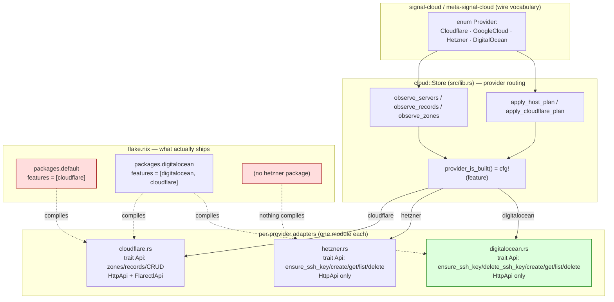

# 68 · 2 — Provider adapters (cloud lane)

cloud-designer, scoped engine-audit session 68. Read-only audit of the
provider-adapter surface at cloud HEAD `7f190c3` (`cloud: read DigitalOcean
token from domain gopass path`, 2026-06-19), against signal-cloud `4e846bc` /
meta-signal-cloud `54d62be`. Method modeled on designer report 702: for each
invariant, what it GUARANTEES, where it is ENFORCED (file:line), where it can
BREAK; soundness-vs-surface separated from change-audit.

Focus: `src/{digitalocean.rs, hetzner.rs, cloudflare.rs, client.rs,
cloudflare_cli.rs}` plus the `Store` routing in `src/lib.rs` that drives them,
and `flake.nix` for the deployment shape. Builds on 35 (actor divergence), 36
(cloud actor audit), 37 (schema-triad port) — the sync-vs-actor mandate divergence
is established there and is NOT re-litigated here; this report is the adapter
layer on its own terms.

## The shape, in one picture

The three adapters are near-identical in shape (typed `Error`, `Token`,
`CredentialSource`, sync `trait Api`, `HttpApi`, `ProviderClient`, a
`HostMapping`/`into_*` projection, a private status-string newtype). Cloudflare
adds a second `Api` impl (`FlarectlApi`, the production default) and the
DNS-record envelope machinery; the two compute adapters are structurally a
mirror pair. The `Store` routes by `match plan.provider` / `if query.provider ==`
with `#[cfg(feature)]` arms; everything else falls through to a typed
unsupported/rejected reply.

## Soundness-vs-surface: the live-proof gradient

This is the deepest finding of the run. The three adapters look equally
finished in source, but their PRODUCTION reality is three different tiers, and
the gap is invisible from the code alone — only `flake.nix` and the test
inventory reveal it.

| Provider | Adapter source | Offline tests | Live test | Ships in a Nix package | Production reality |
|---|---|---|---|---|---|
| Cloudflare | `cloudflare.rs` + `cloudflare_cli.rs` | `tests/runtime.rs` + `cloudflare_cli` unit tests | none (was live-proven historically per report 64 context / ARCHITECTURE §"production-shaped") | `default` and `digitalocean` | DNS read+apply production-shaped (ARCHITECTURE.md:73) |
| DigitalOcean | `digitalocean.rs` | `tests/digitalocean.rs` (mock `Api`) | `tests/digitalocean_live.rs` `#[ignore]` — Tier-1 PROVEN against real API (report 64 §1, droplet `578840636`) | `packages.digitalocean` (`--features digitalocean,cloudflare`) | create→Running→destroy live-proven at the adapter; full daemon chain (Tier-2) not yet |
| Hetzner | `hetzner.rs` | `tests/hetzner.rs` (mock `FixtureHetznerApi`, hetzner.rs:42/69) | **none** | **none** — no `--features hetzner` appears anywhere in `flake.nix` | surface-only: compiles, mock-tested, never run against a real Hetzner account, and not built into any shipped daemon |

**Hetzner is surface-only and unshipped.** `flake.nix` has `packages.default`
(default features = `["cloudflare"]`, Cargo.toml:27) and `packages.digitalocean`
(`digitaloceanCargoExtraArgs = "--features digitalocean,cloudflare"`,
flake.nix:80, 125-129). There is no `packages.hetzner`, no
`--features hetzner` in any `cargoExtraArgs`, no `hetzner-live-test`, no
`tests/hetzner_live.rs`. So in every shipped binary, `provider_is_built(Hetzner)`
returns `false` (lib.rs:1756) and every Hetzner request answers
`UnsupportedReason::ProviderNotBuilt` (lib.rs:1742-1747) or
`CapabilityState::NotBuilt` (lib.rs:1724-1725). The Hetzner adapter's entire
`apply_hetzner_host_plan` create/destroy path (lib.rs:1577-1618) is dead code in
production — it cannot be reached because the feature that compiles it into a
package does not exist.

This directly contradicts INTENT.md's stated priority: *"The cloud component's
active capability is on-demand compute-node provisioning, **Hetzner first**"*
(INTENT.md:18-20) and *"The Hetzner adapter resolves its API token fresh from
the `HCLOUD_TOKEN` credential handle"* (INTENT.md:31). The intended lead provider
is the one that is neither live-proven nor shipped; DigitalOcean — added second,
per the git log (`dfcf9e3 cloud: DigitalOcean compute provider Phase 1`) — is the
one with a live test and a package. The implementation order inverted the intent
order, and nothing in the build closes the gap. This is the P1.

## Feature gating: the guarantee and where it leaks

`provider_is_built` (lib.rs:1752-1759) is a clean single source of truth:
`cfg!(feature = "...")` per `Provider` variant. The `Store` consults it before
every provider touch — `unsupported_provider_reply` (1737-1750),
`capability_state` (1723-1735), `provider_is_configured` (1712-1721), and the
`zones()` policy filter (lib.rs:937). The guarantee — *an unbuilt provider never
reaches a provider call and always answers a typed NotBuilt reply* — holds and is
enforced consistently. Good discipline.

But the gating has two seams that will bite:

1. **The default package is Cloudflare-only and is the one wired to `apps.daemon`
   and `apps.default`** (flake.nix:184-192). An operator who runs `nix run
   .#daemon` gets a daemon that answers `NotBuilt` for BOTH compute providers.
   Report 66 §P2 already flagged this for DigitalOcean and it was partly
   addressed (the `digitalocean` package now exists), but `apps.daemon` still
   points at `packages.default`. The DO-capable daemon is only reachable through
   the separate `apps.daemon-digitalocean` (flake.nix:194-197). The default
   surface is the least-capable build, which is a footgun for whoever deploys.

2. **`apply_host_plan` routing relies on the `_ =>` fall-through for unbuilt
   providers** (lib.rs:1571-1573). This is sound today, but the rejection reason
   for "provider compiled-out" and "provider not configured" collapses to the
   same `ProviderNotConfigured` (lib.rs:1572). On the ordinary read path the two
   states are distinguished (`ProviderNotBuilt` vs `ProviderNotConfigured`,
   1746 vs 786), but the meta apply path loses that distinction — an operator
   gets "not configured" when the real cause is "this daemon wasn't built with
   that provider." A diagnostic-fidelity gap, not a safety one.

## Cross-adapter duplication: earned abstraction or premature mirror?

The three adapters share a striking amount of shape. The question 702 forces:
is the per-module `trait Api` the right seam, or is there one abstraction
straining to collapse?

**The duplication is real and substantial.** `hetzner.rs` and `digitalocean.rs`
are close to line-for-line mirrors: identical `Token`/`CredentialSource`/
`EnvironmentCredentialSource` (hetzner 41-75 ≈ digitalocean 51-88), identical
`HttpApi` HTTP plumbing (`get`/`post`/`delete`/`decode_call`/`error_from_transport`
— hetzner 116-219 ≈ digitalocean 132-237, differing only in the error-envelope
shape and the `delete` 204/404 comment), identical `ProviderClient` with
`create_host`/`observe_hosts`/`destroy_host`/`destroy_host_by_name` (hetzner
271-343 ≈ digitalocean 321-387), identical `HostMapping` projection differing
only in the `Provider::` constant (hetzner 367-378 vs digitalocean 411-422), and
a private status-string newtype that differs only in the match arms
(`HetznerStatus` 501-514 vs `DigitalOceanStatus` 551-563). The module doc
comments even say so out loud: digitalocean.rs:5 *"Mirrors `src/hetzner.rs`"*,
hetzner.rs:3 *"Mirrors `src/cloudflare.rs`"*.

**The genuinely distinct parts are small and well-localized:** DO resolves
SSH-key names to fingerprints before create (digitalocean.rs:274-292) where
Hetzner passes names straight through (hetzner.rs:244-248); DO's error envelope
is a flat `{message}` (digitalocean.rs:425-428) vs Hetzner's nested
`{error:{message}}` (hetzner.rs:381-389); the REST paths differ (`/v2/droplets`
vs `/v1/servers`). These are exactly the provider-specific deltas a shared
`trait ComputeProvider` would leave as the only per-provider code.

**Verdict: the abstraction is currently per-module-duplicated, not earned.** The
`trait Api` lives once per provider; what is missing is the layer above it — a
shared `ComputeApi` shape (HTTP plumbing + `ProviderClient` + `HostMapping` +
status mapping) parameterized over the per-provider envelope/path/key-resolution
deltas. The hard-rule pull is "find or invent the owning noun": the owning noun
is a compute-provider REST client, and there are two byte-for-byte copies of it.
This is a P2 — it is not blocking (the duplication is correct, just doubled), but
every future provider (the git log shows `google-cloud` already stubbed as a
feature, Cargo.toml:30) pays the full copy cost, and a fix to one HTTP helper
(e.g. retry, timeout, the cloudflare-style 404 fidelity below) must be hand-mirrored.
Note this is the OPPOSITE risk from premature abstraction: the cost here is real
present duplication, so collapsing it is safe under the no-backward-compat rule.

## The cloudflare error-fidelity divergence

The two compute adapters route every transport outcome through `decode_call` →
`error_from_transport`, which maps `Status(404,_)` → `HostNotFound`, other
non-2xx → `RequestRejected`, `Transport` → `RequestFailed` (hetzner.rs:201-211,
digitalocean.rs:219-229). **Cloudflare's `HttpApi` does not.** Every `ureq`
call in cloudflare.rs maps ALL errors — including non-2xx HTTP statuses, which
`ureq` surfaces as `Error::Status` — to `Error::RequestFailed(error.to_string())`
(cloudflare.rs:147-148, 169, 190, 204). A Cloudflare 404/403/429 short-circuits
at `.map_err(...)` before `decode_response` runs, so it never reaches the
`{success, errors}` envelope and collapses to `RequestFailed`. The
`Error::ZoneNotFound` and `RequestRejected` variants on the Cloudflare error
enum (cloudflare.rs:19, 25) are reachable only through the envelope's
`success:false` path (a 2xx-with-errors response) and the `FlarectlApi` zone
lookup (cloudflare_cli.rs:108) — never through a real HTTP error status. So the
mapping in `meta_reply_for_cloudflare_error` (lib.rs:1530-1543) that distinguishes
`CredentialUnavailable`/`ZoneNotFound`/`RequestFailed` is partly aspirational:
on the HTTP path, a 404 zone lookup yields `RequestFailed` →
`PlanGenerationFailed`, not `ZoneNotFound` → `ProviderNotConfigured`. Three
adapters with the same shape disagree on error fidelity. P2.

## The `ensure_ssh_key` write-scope subtlety (report 66)

Report 66 §P1 noted that `ensure_ssh_key` "only writes if no key matches by
name/public-key; if `criome-test` already exists it's a bare `GET`." This audit
confirms the production consequence, which is sharper than the test framing:

**`ensure_ssh_key` is never called on the production Store path.** A grep of
`src/lib.rs` for `ensure_ssh_key` returns nothing. The daemon's create path is
`apply_*_host_plan` → `ProviderClient::create_host` → `Api::create_server`
(lib.rs:1593-1607 hetzner, 1652-1666 DO), which POSTs the droplet/server with
`ssh_keys: vec![plan.ssh_key_name...]` and **assumes the key already exists at
the provider**. `ensure_ssh_key`/`delete_ssh_key` are exercised ONLY by
`tests/digitalocean_live.rs` (lines 38, 88, 201) — the harness mints a unique
throwaway key so the live run is a "real pre-droplet write-scope probe"
(digitalocean_live.rs:12-13). The ServerSpec doc states the production
assumption plainly: Hetzner "key must already exist in the project, so the
durable CriomOS root key is registered once as a project resource and referenced
here by name" (hetzner.rs:83-86); DO "resolves each name to its fingerprint…
A name with no live account key is… out of scope for create and is dropped from
the create array" (digitalocean.rs:271-273).

This means: **if the named SSH key is absent at the provider, DO's `create_server`
silently drops it** (digitalocean.rs:279-285, `filter_map` discards unmatched
names) and creates a droplet with NO SSH key — a host nobody can log into,
reported as success. Hetzner instead passes the name straight to the API
(hetzner.rs:408), which Hetzner rejects with a 422 → `RequestRejected` — a loud
failure. So the two providers fail OPPOSITE ways on a missing key: DO succeeds
into an unreachable host, Hetzner errors. The write-scope subtlety is therefore
not just "ensure_ssh_key is a no-op when present" — it is that the production
path does NOT ensure at all, and the two adapters diverge on the consequence.
P2, leaning P1 once Hetzner/DO host-create is the live milestone, because a
silently-unreachable droplet is a real operational hazard.

There is also a trait-shape asymmetry: `digitalocean::Api` declares both
`ensure_ssh_key` and `delete_ssh_key` (digitalocean.rs:119-120);
`hetzner::Api` declares only `ensure_ssh_key`, no `delete_ssh_key`
(hetzner.rs:104). Neither is used in production. Cleanup, P3.

## Typed discipline — where the adapters honor and bend the hard rules

| Rule | Verdict | Evidence |
|---|---|---|
| Typed per-crate `Error` via thiserror | Honored, but per-MODULE not per-crate | each adapter has its own `#[derive(thiserror::Error)] enum Error` + `type Result` (cloudflare.rs:11, hetzner.rs:23, digitalocean.rs:34). Three sibling `Error` types in one crate; `Store` converts each via a hand-written `meta_reply_for_*_error` (lib.rs:1530, 1621, 1680) rather than `impl From`. See below. |
| Typed domain newtypes (no primitive obsession) | Mostly honored | `Token` (cloudflare.rs:32), `RecordIdentifier` (cloudflare.rs:90), `FlarectlBinary` (cloudflare_cli.rs:21), reuse of `HostIdentifier`/`DomainName`/`ServerType`/`IpAddress`/`ImageName` from signal-cloud (hetzner.rs:18-21). BUT `ServerSpec` is all raw `String`/`Vec<String>`/`Option<String>` (hetzner.rs:79-88, digitalocean.rs:92-103) and `ensure_ssh_key` returns a raw `i64` (hetzner) / `String` (digitalocean) fingerprint — primitive at the SSH-key seam. |
| No hand-rolled parsers (serde only at the edge) | Honored | all decoding is serde `Deserialize` structs at the REST edge (cloudflare.rs:435-494, hetzner.rs:381-494, digitalocean.rs:425-542); `serde_json` only in `FlarectlApi::parse_json` (cloudflare_cli.rs:92-98). No byte-poking. |
| Conversions via `impl From`/`TryFrom` | Mixed | cloudflare uses `TryFrom<ZoneRecord>`/`TryFrom<RecordRecord>` (cloudflare.rs:469, 518) and `From<FlarectlZone>` (cloudflare_cli.rs:257) — correct. BUT the compute adapters use `into_api_server`/`into_cloud_host`/`into_host_status` inherent methods (hetzner.rs:442, 367, 506; digitalocean.rs:484, 411, 556) where `impl From<ServerRecord> for ApiServer` / `impl From<HostMapping> for CloudHost` is the rule's stated reach ("For conversions reach for `impl From<X> for Y`, not `fn project_x_to_y`"). These are owned methods on data-bearing types so they pass the method-only rule, but they sidestep the From-conversion rule. P3. |
| Every fn a method/assoc-fn/trait-impl (no free fns, no ZST-namespace) | Honored | every `fn` in all five focus files is inside an `impl` or `trait`; no free functions outside `#[cfg(test)]`. `EnvironmentCredentialSource`, `ProcessRunner` are ZSTs but used as trait-impl carriers (`impl CredentialSource for…`, `impl CommandRunner for…`), the narrow legitimate case, not namespace-fn disguises. Clean. |
| Daemon: one rkyv arg, no flags, never parses NOTA | Honored | `CloudDaemonCommand` takes `ComponentArgument::SignalFile` and rejects `InlineNota`/`NotaFile` (daemon_command.rs:37-44); `cloud-daemon` main is a one-liner over `from_environment().run()` (bin/cloud-daemon.rs). The CLI `Client` is the NOTA edge (client.rs:139-144). Triad-clean. |
| Secret bytes never echoed / cross meta only by handle | Honored | `Token` is a newtype whose `Debug` is custom-redacted on `ProviderClient` (`"<credential source>"`, cloudflare.rs:430, hetzner.rs:350, digitalocean.rs:394); token resolved fresh from env by handle (`EnvironmentCredentialSource::token`, all three); the flarectl runner passes the token via `.env()` not argv (cloudflare_cli.rs:50). |

### The three-sibling-Error / no-`impl From` seam

The crate has three independent `Error` enums (one per adapter module) plus the
crate-level `cloud::Error` (used by `client.rs`). The `Store` bridges each
adapter error to a `MetaReply` through a hand-written matcher
(`meta_reply_for_cloudflare_error` 1530, `_hetzner_` 1621, `_digitalocean_`
1680) — three near-identical match blocks mapping `CredentialUnavailable →
CredentialHandleUnknown`, `*NotFound → ProviderNotConfigured`, `RequestFailed |
RequestRejected → PlanGenerationFailed`. This is the error-side twin of the
adapter duplication: three copies of one mapping, none expressed as `impl
From<hetzner::Error> for MetaRejectionReason`. The rule prefers `impl From`; the
code prefers a per-provider free-standing matcher method. Collapsing the adapters
(P2 above) would collapse this too. P2.

## NOTA discipline at the adapter edge

The adapters themselves do not emit NOTA — they speak REST/JSON to providers and
return typed domain values that the `Store` and `schema_bridge` turn into wire
frames elsewhere. The one NOTA touch in the focus set is `client.rs`: it parses a
single NOTA `Operation` at the CLI edge (`NotaSource::new(&self.text).parse::<
CloudOperation>()`, client.rs:154) and rejects flag arguments (`--`,
client.rs:135-137) and multi-arg invocations (client.rs:131-133), honoring "one
NOTA string/file, no flags." No quotation marks are emitted anywhere (encoding
is via `to_nota()`, client.rs:84). Clean; nothing to flag.

## Invariants

| Invariant | Status | Enforced at | Risk if broken |
|---|---|---|---|
| An unbuilt provider never reaches a provider call; always a typed NotBuilt reply | Holds | `provider_is_built` lib.rs:1752; gated at 1713, 1724, 1742 | Would panic or attempt a call against a `#[cfg]`-stripped field |
| The shipped daemon can actually provision the intended lead provider (Hetzner) | **Violated** | nowhere — no `--features hetzner` package in flake.nix | Hetzner-first intent (INTENT.md:18) unmet; create/destroy path is dead code in every shipped binary |
| DigitalOcean create→Running→destroy works against the real API | Holds (adapter/Tier-1) | `tests/digitalocean_live.rs` `#[ignore]`, report 64 §1 | Tier-2 (full daemon chain) still unverified; a daemon-path regression would not be caught |
| SSH key named in a host plan exists at the provider before create | Unverified / AtRisk | not enforced — production never calls `ensure_ssh_key` (lib.rs has no call); DO silently drops missing keys (digitalocean.rs:279) | DO creates an unreachable droplet reported as success; Hetzner 422-fails |
| Token never leaves the adapter's REST edge / never echoed | Holds | redacted `Debug` (cloudflare.rs:430 etc.); `.env()` not argv (cloudflare_cli.rs:50); resolved by handle | Secret leak into logs/replies |
| Error fidelity is uniform across the three adapters | AtRisk | compute adapters map 404→HostNotFound (hetzner.rs:203); cloudflare maps all transport errors→RequestFailed (cloudflare.rs:147) | Cloudflare zone-not-found surfaces as PlanGenerationFailed, misleading meta replies |
| Daemon takes exactly one rkyv arg, no flags, no NOTA parse | Holds | daemon_command.rs:37-44 | Triad violation; daemon parsing config |
| Every fn is a method/assoc-fn/trait-impl | Holds | all five focus files | Rust-discipline violation |

## Findings, ranked

**P1 — Hetzner is intent's lead provider but is surface-only and unshipped.**
No `--features hetzner` build exists in `flake.nix`; no live test; the entire
`apply_hetzner_host_plan` create/destroy path (lib.rs:1577-1618) is unreachable
in every shipped binary. INTENT.md:18 says "Hetzner first." Either add a
`packages.hetzner` (mirroring `packages.digitalocean`, flake.nix:125) plus a
`tests/hetzner_live.rs` and run it, or capture an explicit intent supersession
that DigitalOcean is now the lead and Hetzner is deferred. Right now the build
and the intent disagree and the gap is silent. (Evidence: flake.nix:80,124-130;
lib.rs:1756; INTENT.md:18-20.)

**P1 — `apps.daemon`/`apps.default` point at the Cloudflare-only build.**
`nix run .#daemon` yields a daemon that answers `NotBuilt` for both compute
providers (flake.nix:124,189-191 → `packages.default` → default features =
`["cloudflare"]`, Cargo.toml:27). The compute-capable daemon is reachable only
via `apps.daemon-digitalocean`. The default deploy surface is the least-capable
one. Decide the intended default build and point `apps.daemon` at it. (Report 66
§P2 raised the DO half; the default app wiring is still unaddressed.)

**P2 — The two compute adapters are byte-for-byte mirrors with no shared owning
noun.** `hetzner.rs` and `digitalocean.rs` duplicate `Token`,
`EnvironmentCredentialSource`, the full `HttpApi` HTTP plumbing, `ProviderClient`,
`HostMapping`, and the status newtype, differing only in envelope shape, REST
path, and key resolution (hetzner.rs:116-378 ≈ digitalocean.rs:132-422). Invent
the owning noun — a shared compute-provider REST client parameterized over the
per-provider deltas — before `google-cloud` (already a feature stub,
Cargo.toml:30) triples the copy. Safe to collapse under the no-backward-compat
rule.

**P2 — Production create never registers the SSH key; the two adapters fail
opposite ways on a missing key.** `ensure_ssh_key` is not called on any Store
path; DO's `create_server` silently drops an unmatched key name and creates an
unreachable droplet reported as success (digitalocean.rs:279-285), while Hetzner
passes the name through and 422-fails (hetzner.rs:408). Either make the create
path call `ensure_ssh_key` (registering the CriomOS root key on demand) or
validate key presence before create and reject loudly and uniformly. (Evidence:
lib.rs:1593-1666 has no ensure call; digitalocean.rs:271-285; hetzner.rs:83-86.)

**P2 — Cloudflare error fidelity diverges from the compute adapters.**
`cloudflare::HttpApi` collapses all HTTP error statuses to `RequestFailed`
(cloudflare.rs:147,169,190,204), so `ZoneNotFound`/`RequestRejected` are
unreachable on the HTTP path and `meta_reply_for_cloudflare_error` (lib.rs:1530)
is partly aspirational. Route cloudflare's `ureq` errors through a
`error_from_transport`-style matcher like the compute adapters, or document that
the HTTP adapter is the non-production fallback and `FlarectlApi` is the real
path (cloudflare.rs:290-295).

**P2 — Three sibling adapter `Error` types bridged by three hand-written
matchers, not `impl From`.** `meta_reply_for_{cloudflare,hetzner,digitalocean}_
error` (lib.rs:1530/1621/1680) are three copies of one mapping. Express as `impl
From<…Error> for meta_signal_cloud::RejectionReason`. Folds into the P2 adapter
collapse.

**P3 — Conversions use inherent `into_*` methods where `impl From` is the rule's
reach.** `into_api_server`/`into_cloud_host`/`into_host_status` (hetzner.rs:442/
367/506; digitalocean.rs:484/411/556) pass the method-only rule but sidestep the
From-conversion preference. cloudflare already does it right with `TryFrom`
(cloudflare.rs:469,518).

**P3 — `Api` trait asymmetry: `hetzner::Api` lacks `delete_ssh_key`,
`digitalocean::Api` has it (hetzner.rs:104 vs digitalocean.rs:119-120); neither
is used in production.** Decide whether SSH-key lifecycle belongs in the trait
at all (it currently serves only the live test) and make the two traits agree.

**P3 — `ServerSpec` and SSH-key fingerprints are primitive-typed.** `ServerSpec`
is raw `String`/`Vec<String>`/`Option<String>` (hetzner.rs:79-88); fingerprints
are raw `i64`/`String`. The wire `CloudHost` is fully newtyped but the create
input is not. Minor primitive obsession at the create seam.

## What this report deliberately does NOT redo

The sync-vs-actor divergence (cloud's `ARCHITECTURE.md` "Actor Shape" mandate vs
the `std::thread`+`Mutex` blocking runtime, the global-lock-across-subprocess
head-of-line block) is fully established in reports 35 and 36 and is unchanged at
this HEAD; the schema-triad port arc is report 37. The adapters inherit that
sync, blocking-call posture (every `Api` method is synchronous `ureq`/`Command`,
invoked under the `Store` mutex), which is correct to note as the substrate but
is not a new adapter-layer finding.
