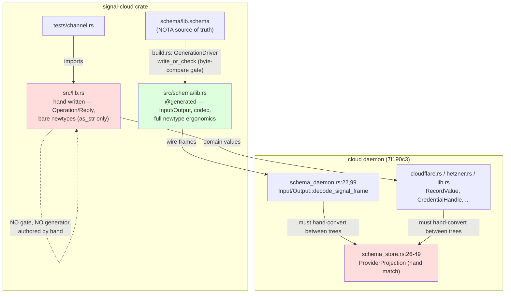

# 68/3 — Cloud wire contracts: signal-cloud + meta-signal-cloud

*cloud-designer, scoped engine-audit session 68 (cloud lane), 702 deep-analysis
method. Read-only. HEADs: signal-cloud `4e846bc`, meta-signal-cloud `54d62be`,
cloud `7f190c3` (all = origin/main). Builds on `35-actor-divergence-forensics`,
`36-cloud-actor-audit`, `37-cloud-component-schema-triad-port`; does not redo
them. Every claim cites `file:line`; capability claims state what the production
daemon path does, not what a `#[cfg(test)]` harness can do.*

## The one-sentence finding

Each cloud contract repo ships **two complete, independently-authored type
trees** — a hand-written one in `src/lib.rs` that is the public API every
consumer imports, and a schema-generated one in `src/schema/lib.rs` that is the
wire-frame codec the daemon actually frames bytes with — and the two have
**already silently diverged** in field names, newtype shapes, variant names, and
newtype ergonomics, with no test or build gate that compares them, so the wire
contract's authority is split between a surface nobody round-trips and a codec
nobody re-exports.

## How the two trees relate (the load-bearing diagram)

The daemon imports from **both** trees: the wire frame layer takes
`signal_cloud::schema::lib::{Input, Output}` (cloud `schema_daemon.rs:22`,
meta frame decode at `schema_daemon.rs:99`), while the provider adapters and the
daemon's own domain types take the hand-written root
(`cloudflare.rs:4` `use meta_signal_cloud::CredentialHandle`; `hetzner.rs:16`;
`cloud/src/lib.rs:195-196` `account: meta_signal_cloud::ProviderAccount`,
`credential: meta_signal_cloud::CredentialHandle`). Whenever a value crosses from
the wire layer to the domain layer it must be hand-converted, because the two
layers' newtypes are distinct Rust types even when structurally identical.

## What each invariant guarantees, where it is enforced, where it breaks

### Invariant 1 — "the generated witness is fresh"

**Guarantees:** the checked-in `src/schema/lib.rs` is exactly what the current
`schema/lib.schema` lowers to; a stale schema fails the build loudly.

**Enforced at:** `signal-cloud/build.rs:23-31` and `meta-signal-cloud/build.rs:23-31`
call `GenerationDriver::new(GenerationPlan::wire_contract(...)).generate().write_or_check(ENV)`.
The gate body is real and stronger than a timestamp: `schema-rust-next/src/build.rs:619-631`
(`GeneratedArtifact::check_with`) regenerates the Rust in-memory and
`matches_existing` (`build.rs:633-642`) **byte-compares** it against the
checked-in file; a mismatch or a missing file returns
`BuildError::StaleGeneratedArtifact` (`build.rs:627`). It also round-trips the
schema source through both text and rkyv binary (`SourceArtifactRoundTrip::validate`,
`build.rs:582-594`). So **YES, cloud has the equivalent of the
schema-rust-next:635 regenerate-and-compare gate** the audit asked to confirm —
in fact `matches_existing` IS `build.rs:633-635`.

**Where it breaks:** the gate only guards the **generated** tree. It says nothing
about the hand-written `src/lib.rs`, which is the public API. The schema can be
fresh against `src/schema/lib.rs` and simultaneously contradict `src/lib.rs` —
which is exactly today's state (see Invariant 2). **Status: Holds, but guards the
wrong surface.**

### Invariant 2 — "schema/lib.schema is the single source of truth for the wire vocabulary"

**Guarantees (intended):** one place defines each record; consumers and codec
agree by construction.

**Enforced at:** nowhere. The hand-written `src/lib.rs` is authored by hand and
re-derives the same vocabulary by eye. The two have measurably drifted:

| Concept | `schema/lib.schema` / generated `src/schema/lib.rs` | hand-written `src/lib.rs` (the public API) |
|---|---|---|
| capability state field | `capability_state: CapabilityState` (`src/schema/lib.rs:277`) | `state: CapabilityState` (`src/lib.rs:237`) |
| zone account field | `provider_account`, `zone_identifier`, `domain_name` (`:298-300`) | `account`, `identifier`, `name` (`:260-262`) |
| host fields | `provider_account`, `host_identifier`, `host_name`, `image_name`, `ipv4_address`, `host_status` (`:321-327`) | `account`, `identifier`, `name`, `image`, `ipv4`, `status` (`:285-291`) |
| CapabilityReport | tuple newtype `CapabilityReport(Vec<…>)` (`:283`) | struct `{ capabilities: Vec<…> }` (`:243`) |
| Observation variants | `ObserveServers`, `ObservePlan` (`:424-425`) | `Servers`, `Plan` (`:398-399`) |
| ObservationResult plan arm | `PlanResult(PlanResult)` (`:467`) | `Plan(Plan)` (`:446`) |
| Validation/Plan field | `domain_name` (`:386`, `:402`) | `zone` (`:356`, `:373`) |

These are not cosmetic: `capability_state` vs `state` and `domain_name` vs `zone`
change the **NOTA field order is positional so they round-trip the same bytes**,
but the Rust-level public API and the generated codec disagree on every accessor
name, so a consumer written against one tree will not compile against the other.
**Status: Violated** — the two trees are out of sync today and nothing detects it.

### Invariant 3 — "wire enums are closed; no Unknown escape hatch"

**Guarantees:** every provider/capability/reason is a typed variant.

**Enforced at:** `src/lib.rs:66-93` (`Provider`, `Capability` are closed enums,
no `Unknown`); `schema/lib.schema:27-34`. Holds in both trees.

**Tension, not a break:** `RejectionReason` is two *different* closed enums across
the split — ordinary has `{InvalidDesiredState, PlanExpired, ProviderRateLimited,
ProviderUnavailable}` (`signal-cloud/src/lib.rs:527-532`); meta has
`{CredentialHandleUnknown, ProviderNotConfigured, AccountUnknown, PlanUnknown,
PlanNotApproved, PlanGenerationFailed, CapabilityUnauthorized}`
(`meta-signal-cloud/src/lib.rs:330-338`). That is defensible (the two channels
reject for different reasons) but means "RejectionReason" names two unrelated
types; a reader must track which contract they are in. **Status: Holds** (closed),
**named tension** on the shared name. The daemon's own `sema.schema:61` carries a
*third* `RejectionReason` superset.

### Invariant 4 — "meta reuses public provider/domain/plan types from signal-cloud"

This is the meta-signal-cloud `ARCHITECTURE.md` constraint (lines 64-65) and
`INTENT.md` (line 60-61): "Reuse public provider/domain/plan types from
`signal-cloud`."

**Guarantees (intended):** one `Provider`, one `DomainName`, one `Plan` across the
ordinary/meta boundary, so no projection code is needed.

**Enforced at:** **partially, and only in the hand-written tree.** The hand-written
`meta-signal-cloud/src/lib.rs:13-15` does `pub use signal_cloud::{Capability,
DesiredState, DomainName, Plan, PlanIdentifier, Provider, ProviderAccount}` —
correct. But the **generated** tree re-declares them: `meta-signal-cloud/src/schema/lib.rs:427`
emits its own `pub enum Provider`, and `meta-signal-cloud/schema/lib.schema:101-108`
re-declares `Provider`, `Capability`, `ProviderAccount`, `DomainName`,
`PlanIdentifier`, `ServerType`, `ImageName` as fresh local types with **no
`Import`/`Local` of signal-cloud** (grep of the schema for `signal-cloud` is
empty). The schema language clearly supports cross-crate import — the daemon's own
`cloud/schema/sema.schema:30-32` uses exactly that syntax
(`Provider signal-cloud:lib:Provider`, `CredentialHandle meta-signal-cloud:lib:CredentialHandle`).
The contract schema simply doesn't.

**Where it breaks — and it has already bitten:** because the generated trees each
own a distinct `Provider`, the daemon must hand-bridge them. `cloud/src/schema_store.rs:26-49`
is a `ProviderProjection` whose entire reason for existing is documented inline:
*"The two contracts declare structurally identical `Provider` enums, but they are
distinct Rust types … a meta-contract registration's provider is mapped through
this projection on the way in"* — a four-arm match (`:43-46`) that exists purely
to launder one generated enum into the other. This is report 37 §5.4
("cross-contract record drift; shared record types should be authored once and
imported via the schema language's Import/Export") **still open at the schema
layer**, papered over in hand-written code. **Status: AtRisk / partially Violated.**

### Invariant 5 — "the daemon never parses NOTA; pure binary client"

**Guarantees (override):** daemons accept binary startup only and never parse NOTA.

**Enforced at:** the contract crates default `nota-text` **off** (`signal-cloud/Cargo.toml:18-19`,
`meta-signal-cloud/Cargo.toml:18-19`) — correct triad hygiene; a binary-only
client links no NOTA codec. **But** the cloud daemon manifest turns it back on
unconditionally: `cloud/Cargo.toml:36,38` declare both contracts with
`features = ["nota-text"]`, so the daemon binary links the NOTA encoder/decoder
into the contract types. Whether the daemon *invokes* NOTA on the wire path (vs.
only `decode_signal_frame`, the rkyv path at generated `src/schema/lib.rs:1790`)
is a runtime-lane question (lane 4), but the contract surface does not stop the
daemon from pulling NOTA in. **Status: contracts Hold; daemon-side AtRisk —
cross-lane flag to lane 4.** The contract layer is not at fault.

### Invariant 6 — "image_name is plumbed so the daemon can reference an image by id (the ad53 dependency)"

**Confirmed plumbed, end-to-end on the wire.** `meta-signal-cloud/schema/lib.schema`
carries `ImageName String` (`:108`) and threads it through both the request and
the reply: `DesiredHostState { … image_name ImageName … }` (`:84-90`, the
`PrepareHostPlan` payload) and `HostPlan { identifier … image_name ImageName
ssh_key_name … intent }` (`:75-83`, carried home by the `HostPlanPrepared`
reply). The hand-written tree matches (`meta-signal-cloud/src/lib.rs:209` in
`DesiredHostState`, `:236` in `HostPlan`) and the generated tree matches
(`meta-signal-cloud/src/schema/lib.rs:287`, `:299`). The reply
`HostPlanPrepared(HostPlan)` (`src/lib.rs:365`) returns the prepared plan
*including its `identifier: PlanIdentifier` and `image_name`*, so a caller can
reference the image by id later. **Status: Holds.** The remaining ad53 gap is
entirely on the CriomOS/image-producer side (lane 5), not the wire — the wire
field is ready and waiting for an image id to put in it.

### Invariant 7 — "codegen never emits a panic; the panic-on-bad-name seam is unreachable for cloud names"

**Guarantees:** no generated cloud type can hit the `Ident::new` panic.

**Enforced at:** the generated files contain zero `panic!`/`unreachable!`/`todo!`/
`unimplemented!` (grep of both `src/schema/lib.rs` empty). The codegen's
name→identifier seam handles reserved keywords correctly by emitting raw
identifiers: `schema-rust-next/src/lib.rs:999-1003` (constructor) and `:1517-1522`
(`RustIdentifier::ident`) branch on `RustKeyword::is_reserved` (`:6945`) and call
`Ident::new_raw` for keywords. The **panic seam survives** on the *other* branch:
`Ident::new` (`:1002`, `:1520`) panics if the string is not a valid Rust
identifier for any non-keyword reason — a leading digit, a hyphen, or the
strict-reserved `Self`/`crate`/`super`/`self` (which `new_raw` also rejects). For
**cloud's current names** the seam is **not reached**: every schema identifier is
clean ASCII PascalCase/snake_case (audited `schema/lib.schema` lines 16-112 and
the meta equivalent — no digits-first, no hyphens, no `Self`). **Status: Holds for
today's names; the seam is latent** — a future cloud schema name like a
provider-region `2gb` server-type token surfaced as a *type* (rather than a
string value) would panic the generator with a raw `proc_macro2` message, not a
typed `BuildError`. P3 watch item, owned upstream by the codegen tier (702).

### Invariant 8 — "newtypes encapsulate (private inner) and carry the right ergonomics"

**The WireContract-only asymmetry, confirmed and inverted from what one would
want.** Both trees keep the inner `String` private (good — no leaky
`is_empty`/`as_bytes`). But the **ergonomics diverge by tree**:

- **Generated** newtypes get the full set: `new(impl Into<String>)`, `payload()`,
  `into_payload()`, `From<String>`, `Display`, `AsRef<str>`, `PartialEq<&str>`
  (e.g. `DomainName` at generated `src/schema/lib.rs:697-732`; `CredentialHandle`
  in meta generated `:956-991` with `Display`/`AsRef`/`PartialEq<&str>`). Integer
  newtypes even get `PartialEq<u64>`/`PartialOrd<u64>` (`CommitSequence` at meta
  generated `:1178-1213`).
- **Hand-written** newtypes get only `new(impl Into<String>)` and `as_str()` — no
  `Display`, no `AsRef`, no `From`, no `PartialEq<&str>`. See the
  `string_newtype!` macro at `signal-cloud/src/lib.rs:13-39` and
  `meta-signal-cloud/src/lib.rs:32-40` (`CredentialHandle`), `:126-134`
  (`ServerType`), etc.

So the **public API** (hand-written) is the *ergonomically poorer* one, and the
richer generated impls are invisible to consumers because the generated tree is
never re-exported (`signal-cloud/src/schema/mod.rs` is just `pub mod lib;` — it is
compiled and freshness-checked but not surfaced through `pub use`). A consumer who
wants `host.name.to_string()` on the public `CloudHost.name: DomainName` cannot,
because the hand-written `DomainName` has no `Display`. **Status: AtRisk** — the
encapsulation is right; the ergonomics are on the wrong tree.

## Dead and stale artifacts (cleanup tier)

- **`schema/signal-cloud.concept.schema` and `schema/owner-signal-cloud.concept.schema`
  are dead.** They encode a long-superseded shape — `Observe [Provider Capability
  Plan]`, placeholder `Text (String)` types, `Status Concept`, and the old
  `owner-signal-cloud` name. `build.rs` reads only `schema/lib.schema`
  (`build.rs:21`, `rerun-if-changed=schema/lib.schema`), so the concept files are
  checked-in noise that will mislead the next reader into thinking the contract is
  still at "concept" status. Pre-production, with no back-compat to protect, they
  should be deleted, not kept "non-disturbingly."
- **The `owner-signal-cloud` name still leaks** into the dead concept filename
  (`owner-signal-cloud.concept.schema`) — the report-37 §6 rename is complete in
  the package/crate/imports but this fossil remains.

## Soundness vs surface — what is real on the production path

- **Real on the daemon path:** the **generated** `Input`/`Output` rkyv frame codec
  (`decode_signal_frame`/`encode_signal_frame`, generated `src/schema/lib.rs:1780-1890`)
  — the daemon genuinely frames and routes bytes with it
  (`cloud/schema_daemon.rs:22,99`). `image_name` is real on the wire. The
  freshness gate is real.
- **Surface-only / test-only:** the **hand-written** `Operation`/`Reply`
  `signal_channel!` surface and its NOTA round-trips are exercised *only* by
  `tests/channel.rs` (which imports the hand-written root and asserts NOTA strings
  like `"(RegisterAccount (Cloudflare primary cloudflare-dns-token))"` —
  positional, bare-atom, quotation-free, correct). The daemon does **not** route
  through `Operation`/`Reply`; it routes through generated `Input`/`Output`. So the
  hand-written tree is a **second, test-only contract** that no production caller
  drives — yet it is the one every downstream crate `use`s for domain types. The
  capability "the public contract round-trips through NOTA" is **true in tests,
  and irrelevant to the daemon**, which never touches that tree's NOTA path.

## Invariants table

| Invariant | Status | Enforced at | Risk if broken |
|---|---|---|---|
| Generated witness is fresh vs schema | Holds (guards wrong surface) | `signal-cloud/build.rs:23-31`; gate `schema-rust-next/build.rs:619-642` | False confidence: schema fresh, public API stale |
| schema/lib.schema is single source of truth | Violated | nowhere (hand-written `src/lib.rs` re-derives) | Two trees drift unseen; consumer/codec name mismatch |
| Wire enums closed, no Unknown | Holds | `src/lib.rs:66-93`; `schema/lib.schema:27-34` | Untyped escape hatch |
| Meta reuses signal-cloud types | AtRisk (hand-written only) | `meta/src/lib.rs:13-15` re-export; schema re-declares `:101-108` | Provider-projection hand-code, drift (`schema_store.rs:26-49`) |
| Daemon never parses NOTA | Holds (contracts); AtRisk (daemon manifest) | contracts `Cargo.toml:18-19` default-off; daemon `cloud/Cargo.toml:36,38` re-enables | NOTA codec linked into daemon — lane 4 |
| image_name plumbed for ad53 | Holds | `meta/schema/lib.schema:75-90`; `src/lib.rs:209,236,365` | (none — wire ready) |
| Codegen emits no panic for cloud names | Holds today (seam latent) | `schema-rust-next/lib.rs:999-1003,1517-1522` raw-ident; `Ident::new` panic branch latent | Future non-keyword-invalid name panics generator with untyped message |
| Newtypes encapsulate + right ergonomics | AtRisk | private inner everywhere; rich impls only on generated tree | Public (hand) API lacks Display/AsRef/From |

## Ranked findings

### P1 — gates the next cloud milestone

**P1-1. The dual-tree split is the contract's central liability.** The
hand-written `src/lib.rs` is the public API (tests + every downstream crate import
it) but is NOT generated, NOT freshness-gated, and has already drifted from the
schema in field names, newtype shapes, and variant names (Invariant 2 table). The
daemon straddles both trees and pays a hand-conversion tax (`schema_store.rs:26-49`
`ProviderProjection`). Git history shows this class of drift has already shipped a
silent wire break once: commit `0ff53ff` ("the prior regeneration silently broke
the Observation wire contract" by dropping payloads). **Recommendation:** finish
the schema cutover the `ARCHITECTURE.md` Schema-emission section (`signal-cloud`
lines 73-87) already names as the remaining work — replace the hand-written
`src/lib.rs` types with `pub use crate::schema::lib::…` re-exports, delete the
duplicate hand-authored types, and update downstream imports. Pre-production, with
no back-compat to protect, this is a clean break, not a staged migration. Until
then the wire contract has two masters.

**P1-2. The meta contract re-declares signal-cloud types instead of importing
them.** `meta-signal-cloud/schema/lib.schema:101-108` re-declares `Provider`,
`Capability`, `DomainName`, `PlanIdentifier`, `ServerType`, `ImageName`,
`ProviderAccount` with no cross-crate import, violating the meta `ARCHITECTURE.md`
"reuse public types" constraint at the generated layer and forcing the
`ProviderProjection` bridge. The schema language supports the import
(`cloud/schema/sema.schema:30-32` proves it). **Recommendation:** change the meta
schema to `Provider signal-cloud:lib:Provider` (and the others), regenerate, and
delete `ProviderProjection`. This is report 37 §5.4 finally closed at the schema
layer.

### P2 — soundness / coherence

**P2-1. Newtype ergonomics live on the wrong tree.** The public hand-written
newtypes have only `new`/`as_str`; the generated ones have `Display`/`AsRef`/`From`/
`PartialEq<&str>`. Resolving P1-1 (re-export generated) fixes this for free —
consumers gain the rich impls. Until then, the public API is the poorer one.

**P2-2. Two `RejectionReason` types (three counting the daemon sema) share a
name.** Defensible per-channel, but the shared identifier across
`signal-cloud/src/lib.rs:527`, `meta-signal-cloud/src/lib.rs:330`, and
`cloud/schema/sema.schema:61` invites confusion. Consider distinct names
(`ObservationRejectionReason` / `MetaRejectionReason`) or accept and document the
overload. Low urgency.

### P3 — cleanup

**P3-1. Delete the dead `*.concept.schema` files** in both repos — superseded
shape, unreferenced by `build.rs`, still carrying the `owner-signal-cloud` fossil
name. They will mislead readers into thinking the contract is at concept status.

**P3-2. Latent codegen panic seam** (`schema-rust-next/lib.rs:1002,1520`
`Ident::new`): unreachable for today's clean cloud names, but a future non-keyword-
invalid type name (leading digit, hyphen, `Self`) would panic the generator with
an untyped `proc_macro2` message. Owned upstream by the codegen tier (702); cloud
should simply keep its schema names Rust-valid, which it does.

## Cross-lane handoffs

- To **lane 1 (daemon/Store):** the `ProviderProjection` (`schema_store.rs:26-49`)
  and the two-tree straddle are the daemon's, not the contract's, problem to feel —
  flagged here as the contract-side root cause.
- To **lane 4 (runtime/nix):** `cloud/Cargo.toml:36,38` enables `nota-text` on
  both contracts in the daemon graph; confirm whether the daemon wire path invokes
  NOTA parsing (override says it must not) or only rkyv `decode_signal_frame`.
- To **lane 5 (image/ad53):** the wire `image_name` field is ready and threaded
  through request, plan, and reply; the gap is entirely the image-producer side.

## Questions for the psyche

1. **Cutover timing:** the `signal-cloud` `ARCHITECTURE.md` (lines 78-81) and
   `INTENT.md` (lines 79-85) both say the hand-written-to-generated re-export
   cutover is "the remaining schema cutover." Is closing P1-1 in scope for the
   next cloud milestone, or is the dual-tree intentionally held until the daemon
   Nexus/SEMA schemas settle? It is the single highest-leverage cloud-contract
   change.
2. **Meta type reuse:** is the generated meta tree's re-declaration of `Provider`
   et al. a deliberate "generated trees are self-contained" stance, or an
   un-actioned drift? If the former, the `ProviderProjection` bridge is permanent
   and should be documented as intended; if the latter, P1-2 deletes it.
