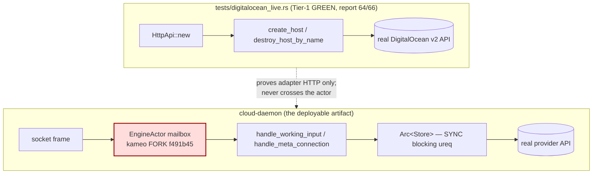

# 68/4 — cloud runtime / kameo fleet / nix witness (deep audit)

Lane 4 of the cloud engine audit (session 68). Scope: `cloud`'s
`Cargo.toml`, `Cargo.lock`, `flake.nix`, `build.rs`, and the
runtime/deploy seam they govern — the kameo-fork exposure, the
fleet-fix bead omission, the nix `checks={}` witness, the DigitalOcean
package variant, and the one-rkyv-argument daemon discipline at the
build layer. All HEADs at audit: cloud `7f190c3`, signal-cloud
`4e846bc`, meta-signal-cloud `54d62be` (= `origin/main`).

Method: 702 template, scoped. Every claim cites `file:line`. The
governing precision rule (the one 702 and report 67 turn on): **state
what the production `cloud-daemon` / `Store` path does, not what a
`#[cfg(test)]` harness can do.** This lane's central correction to
report 67 falls straight out of that rule.

## 0 — The headline correction: the actor path IS the production path

Report 67 §4.2 (this lane's own predecessor) wrote:

> "The live path dodges most of the actor-runtime risk — for now. The
> cloud DO live path is the synchronous `Store` (blocking `ureq`), not
> an actor-mediated path … So the Tier-1 lifecycle I proved green is
> largely insulated from the fork question."

That is true of **the test**, and false of **the daemon**. The
insulation report 67 claimed exists only because the green proof
(`tests/digitalocean_live.rs:3` — *"Drives `digitalocean::HttpApi`
directly against the real DigitalOcean v2"*) never starts the daemon
and never touches kameo. It is a Tier-1 adapter test by construction
(`tests/digitalocean_live.rs:1` *"Live DigitalOcean lifecycle smoke
test (adapter / Tier 1)"*). The moment a request arrives over a socket,
the picture inverts.

The production daemon path:

```
cloud-daemon (fn main)                       src/bin/cloud-daemon.rs:2
  CloudDaemonCommand::run                     src/daemon_command.rs:47
    CloudDaemon::bind(configuration)          src/schema_daemon.rs:128 / schema/daemon.rs:163
      GeneratedDaemonRuntime::new(engine)     src/schema/daemon.rs:303
        EngineActor::<Daemon>::spawn(...)     src/schema/daemon.rs:305   <-- kameo fork
    .run().await
      every working request:
        self.engine.ask(WorkingInput{...})    src/schema/daemon.rs:340   <-- fork mailbox
          EngineActor::handle(WorkingInput)   src/schema/daemon.rs:270
            CloudDaemon::handle_working_input src/schema_daemon.rs:74
              engine.handle_schema_ordinary_input(input)  src/lib.rs:685  (SYNC, blocking ureq)
      every meta request:
        self.engine.ask(MetaConnection{...})  src/schema/daemon.rs:352   <-- fork mailbox
          EngineActor::handle(MetaConnection) src/schema/daemon.rs:284
            CloudDaemon::handle_meta_connection src/schema_daemon.rs:87
              engine.handle_schema_meta_input(input)      src/lib.rs:693
                apply_host_plan -> self.hetzner/digitalocean.create_host(...)
                                                  src/lib.rs:1596 / 1655  (SYNC, blocking ureq)
```

So **every** ordinary read and **every** meta-approved host create /
destroy on the production daemon executes *inside* the kameo
`EngineActor` mailbox (`src/schema/daemon.rs:239-278`), which runs on
the fork (`use triad_runtime::kameo::Actor;` `src/schema/daemon.rs:14`;
resolved fork rev below). The synchronous `Store` is the engine the
actor *owns* (`type Engine = Arc<Store>;` `src/schema_daemon.rs:54`),
not a path around the actor. There is exactly one runtime path for
provisioning over the wire and it is fork-kameo end to end.

The correction is not academic. It changes the fork risk from
"latent, Tier-2-only" (67's framing) to "**on the only production
provisioning path that exists**." The Tier-1 green proves the *adapter
HTTP* works; it proves nothing about whether the deployed daemon
provisions, because the deployed daemon's request loop is the part the
test skips.



The dashed edge is the whole finding: nothing exercises the box that
ships. The fork sits squarely on it, and no test in the repo links the
daemon to a real or in-process provider through the mailbox under the
fork's lifecycle.

## 1 — The kameo fork exposure, pinned exactly

cloud is in the fork camp, confirmed from the lockfile:

| Crate | Declared by | Resolved / pinned | Evidence |
|---|---|---|---|
| `kameo` | cloud `[patch.crates-io]` | fork `f491b45d` | `Cargo.toml:59-60`; `Cargo.lock:497-499` |
| `kameo_macros` | (follows patch) | fork `f491b45d` | `Cargo.lock:511-513` |
| `triad-runtime` | cloud git dep `branch=main` | `f46f66e` | `Cargo.toml:45`; `Cargo.lock:1154-1156` |

The split-brain, sharpened for cloud. triad-runtime is the shared
codegen/actor runtime leg (it `use`s kameo: `Cargo.lock:1158`). cloud
pins triad-runtime at **`f46f66e`**, and that revision's manifest
declares **stock** kameo with no patch:

> `kameo = { version = "0.20.0", default-features = false, features = ["macros", "tracing"] }`
> — `triad-runtime` `f46f66e:Cargo.toml:18`, no `[patch.crates-io]`.

So triad-runtime-as-cloud-pins-it never asked for the fork. cloud's own
top-level `[patch.crates-io] kameo` (`Cargo.toml:60`) reaches across the
dependency graph and rewrites triad-runtime's kameo to fork-`f491b45`
from under it. **triad-runtime f46f66e is compiled against a kameo it
was never pinned against** — 702's exact framing, here proven from
cloud's pin rather than inferred. The actor spine cloud runs
(`EngineActor`, `GeneratedDaemonRuntime`, the `on_start`/`on_stop`/
`stop_gracefully`/`wait_for_shutdown` lifecycle at
`src/schema/daemon.rs:246-259,386-411`) is triad-runtime-generated code
exercising kameo lifecycle hooks that the fork is the thing that
*changed*.

Two further facts the fleet decision must hold:

- **cloud is one revision behind triad-runtime's own fork adoption.**
  triad-runtime HEAD is `60e0ed7 "use Kameo lifecycle fork"`, which now
  declares the fork by git *and* carries its own `[patch.crates-io]
  kameo` (`triad-runtime HEAD Cargo.toml:18,34-35`). cloud still pins
  the prior `f46f66e` (stock-declaring). When cloud bumps triad-runtime
  to `60e0ed7`, cloud's own patch becomes redundant with triad-runtime's
  — and whether the two patches resolve to the *same* fork commit is an
  unwitnessed coherence question. Today they happen to agree
  (`f491b45`), but nothing enforces it.
- **The fork-adoption commit was a pure dep swap, untested.** cloud
  `0768326 "use Kameo lifecycle fork"` changed only `Cargo.lock` and
  `Cargo.toml` (`git show --stat 0768326`: 2 files, +5/-4), no code,
  no test touching the changed lifecycle. cloud adopted a fork whose
  selling point is *changed lifecycle/shutdown semantics* with zero
  in-repo evidence those semantics behave on cloud's actor.

## 2 — The fleet is 25 fork-takers, not 5+cloud

Report 67 §3 already corrected 702's remediation bead (which named
`criome/router/mentci/spirit/mirror`) for omitting cloud + "~10 more."
Re-running the enumeration over the live org checkouts at
`/git/github.com/LiGoldragon` (`grep -l kameo.git */Cargo.toml`) gives
the actual fork camp:

> agent, chroma, clavifaber, **cloud**, criome, domain-criome, harness,
> introspect, kameo-testing, lojix-cli, mentci, message, mind, nexus,
> orchestrate, persona, repository-ledger, router, schema-rust-next,
> system, terminal, terminal-cell, **triad-runtime**, upgrade — 24 repos
> (25 with the kameo fork itself).

This is **larger than 702 or report 67 estimated** (67 said "5 + ~10
= ~15"; the floor is 24). Two of the highest-leverage entries are
infrastructure cloud depends on directly:

- **`triad-runtime`** is itself a fork-taker at HEAD (the actor runtime
  every daemon links). The fleet decision is not "pick a kameo for the
  daemons"; it is "pick a kameo for the *runtime*, then every daemon
  inherits it" — and cloud's standalone `[patch.crates-io]` is exactly
  the per-daemon override that re-forks the inconsistency.
- **`schema-rust-next`** is a fork-taker. That is cloud's
  `[build-dependencies]` codegen driver (`Cargo.toml:49`) — the thing
  that *emits* `src/schema/daemon.rs`. So the generator and the
  generated daemon both ride the fork; a fleet decision that bumps one
  pin without the other can desync the emitted spine from the runtime
  it targets.

**For the fleet-runtime decision: cloud must be enumerated, and so must
triad-runtime and schema-rust-next.** The bead's "one runtime for the
whole fleet" has to mean all 24, decided at triad-runtime (so the
override is unnecessary), not 5 daemons with cloud bolted on. The exact
cloud pin facts to carry into that bead: `kameo` patch → fork
`f491b45d` (`Cargo.toml:60` / `Cargo.lock:499`); `triad-runtime` →
`f46f66e` (`Cargo.toml:45` / `Cargo.lock:1156`), one commit behind
triad-runtime's own fork adoption `60e0ed7`.

## 3 — The nix `checks={}` witness: a build/clippy/test gate, NOT a deploy witness

702's most expensive missing artifact (report 67 §5, ranked there as the
true root) is the **nix witness**: no flake build of any audited HEAD,
so "the deployed binary runs the fork" and "criome enforces quorum" are
both *source-says*, never *binary-does*. The session-68 frame flagged
cloud's `checks={}` block (`flake.nix:132`) as a candidate place cloud
is **ahead** of the fleet. Verified — and the verdict is split.

What `checks` actually contains (`flake.nix:132-182`):

| Check | What it builds/runs | Features |
|---|---|---|
| `build` | `craneLib.cargoBuild` of the workspace | default (`cloudflare`) only |
| `test` | `craneLib.cargoTest` | default only |
| `digitalocean-test` | `cargoTest --test digitalocean` | `digitalocean,cloudflare` |
| `digitalocean-live-test-compiles` | `--test digitalocean_live -- --ignored --list` (compiles + lists, never runs) | `digitalocean` |
| `fmt` | `cargoFmt` | — |
| `clippy` | `--all-targets -- -D warnings` | default |
| `digitalocean-clippy` | clippy | `digitalocean,cloudflare` |

**Where cloud IS ahead of the fleet:** cloud has a *real,
sandbox-hermetic build-and-test gate over its own HEAD*. 702 found the
fleet had none — no daemon had a `nix build` of the audited commit.
cloud's `checks.build` (`flake.nix:133-138`) compiles the daemon under
crane from a clean-sourced tree (`rust.cleanSource`, `flake.nix:29`),
and `checks.clippy` (`flake.nix:167-173`) gates `-D warnings`. That is
a genuine source→artifact witness the rest of the fleet lacks, and it
*does* build the fork-kameo daemon (the patch is in the manifest crane
reads). Running `nix flake check` on cloud HEAD therefore *does* prove
the fork-kameo binary compiles — which is more than 702 could say for
any daemon.

**Where it is NOT a deploy witness, and the claim should not be
overstated:**

1. **It builds the wrong feature set.** `checks.build` /
   `checks.test` / `checks.clippy` run **default features = `cloudflare`
   only** (`Cargo.toml:27`; the checks pass no `cargoExtraArgs`,
   `flake.nix:133-145,167-173`). The deployable provisioning daemon is
   `packages.digitalocean` (DO) or — for Hetzner, INTENT's *named first
   provider* — **nothing** (§4). So the hermetic gate witnesses a
   daemon that **cannot register a Hetzner or DigitalOcean account**
   (`provider_is_built` is `cfg!(feature=...)`, `src/lib.rs:1752-1758`;
   an unbuilt provider returns `ProviderNotConfigured`,
   `src/lib.rs:1393-1396`). The thing `checks` proves builds is not the
   thing that provisions.
2. **No `runNixOSTest` / `nixosTest` / VM witness anywhere** (grep of
   `flake.nix` is empty). There is no check that the *built daemon
   binary* binds its sockets, accepts a frame, and answers — let alone
   provisions. `digitalocean-live-test-compiles` (`flake.nix:155-161`)
   only *compiles and `--list`s* the live test; it never runs it (it
   can't — it needs a real token and spends money). So the witness
   stops at "compiles + unit/integration tests pass," never reaching
   "daemon serves." Compare the fleet's actual deploy target shape
   (e.g. lojix's microvm e2e in this lane's reports 48-49): cloud has
   no equivalent activation/serve witness.
3. **It is unconnected to deploy.** There is no `nixosModule`, no
   systemd unit, no activation test. `checks` answers "does cloud HEAD
   build and pass tests under nix"; it does not answer "does the binary
   the deploy stack ships match this source and run." The
   audited-source-vs-deployed-binary gap 702 named is *narrowed* by the
   hermetic build (you can at least `nix build` the audited commit) but
   not *closed* (nothing proves the deployed daemon is that artifact, or
   that it serves).

Net: cloud is **ahead on the compile-and-test witness** (real, the
fleet lacks it) and **at parity on the serve/deploy witness** (absent,
like the fleet). The right framing for the synthesis: cloud's `checks`
is the cheapest proof-of-concept for the fleet-wide nix witness 702
wants — but it must be (a) re-pointed at the deployed feature set and
(b) extended past `cargoBuild` to a `runNixOSTest` that starts the
daemon from an rkyv config and round-trips one frame, before it
witnesses provisioning rather than compilation.

## 4 — The DigitalOcean package variant exists; Hetzner has no buildable artifact

Report 66 P2 ("Add a DO-enabled daemon package variant") is **landed.**
`packages.digitalocean` (`flake.nix:125-129`) builds
`--features digitalocean,cloudflare` (`flake.nix:80,127`) and is wired
to `apps.daemon-digitalocean` (`flake.nix:194-197`). So a DO-capable
`cloud-daemon` *is* a buildable nix artifact. That P2 closes.

But the frame's question — *"does `packages.default` answer NotBuilt for
DO?"* — resolves **yes, by construction**, and it generalizes to a
sharper gap:

- `packages.default` (`flake.nix:124`) uses `cargoArtifacts` with no
  extra args → **`cloudflare` only**. On that daemon,
  `provider_is_built(DigitalOcean)` and `provider_is_built(Hetzner)`
  are both `false` (`src/lib.rs:1752-1758`), so `RegisterAccount`
  returns `ProviderNotConfigured` (`src/lib.rs:1393-1396`) and
  `apply_host_plan` falls through to the same rejection
  (`src/lib.rs:1571-1573`). The default daemon — the one `apps.daemon`
  (`flake.nix:189-192`) and `apps.default` (`flake.nix:184-187`) point
  at — **cannot provision any compute at all.** It is a DNS-only
  daemon.
- **No nix package enables `hetzner`.** Grepping `flake.nix` for the
  `hetzner` *feature* in any `cargoExtraArgs`/`buildFeatures` returns
  nothing; the only `hetzner` occurrences are the `hcloud` debug-CLI
  symlink (`flake.nix:53-61`) and the gopass token wrapper
  (`flake.nix:97`). `digitaloceanCargoExtraArgs` is
  `--features digitalocean,cloudflare` (`flake.nix:80`) — Hetzner is
  absent from *every* package's feature set. So the Hetzner adapter
  (`src/hetzner.rs`, the synchronous create/observe/destroy that
  INTENT.md §"On-demand compute provisioning" names as **Hetzner
  first**) is live Rust that **no flake output can build into a
  deployable daemon.** It compiles only under `cargo build --features
  hetzner` outside nix, or via the hand-written `CloudDaemonCommand`
  path with a manually-featured build. The intent's headline provider
  has no production artifact.

This is the inverse of a back-compat sin and worth stating plainly per
the no-back-compat override: the feature-gated multi-provider daemon is
the right shape, but the *deploy outputs* lag the *intent*. INTENT says
Hetzner-first; the flake ships Cloudflare-default and DO-on-request and
Hetzner-never. The gap is in `flake.nix`, not the Rust.

## 5 — Daemon discipline at the build layer

The component/daemon hard overrides, audited at the build seam:

**Single rkyv argument, rejects NOTA — HELD.** The daemon takes exactly
one argument and rejects inline NOTA and `.nota` paths at two
independently-enforcing sites:

- hand-written: `CloudDaemonCommand::configuration` matches
  `ComponentArgument::SignalFile` and returns
  `ArgumentError::ExpectedSignalFile` for `InlineNota | NotaFile`
  (`src/daemon_command.rs:37-44`).
- emitted: `DaemonCommand::configuration` does the same
  (`src/schema/daemon.rs:119-129`).

Flags are rejected at the type level — the typed error
`#[error("flag-style arguments are not part of component binaries: {0}")]`
exists (`src/lib.rs:98`) and `ComponentCommand` (triad-runtime) is the
single-arg parser. The config is binary rkyv
(`DaemonConfiguration::from_rkyv_bytes`, `src/lib.rs:158`); the daemon
never parses NOTA for config. This honors the override cleanly.

**The config ENCODER is the still-open report-64 §3.1 gap — partially
addressed, wrongly placed.** The "deploy/bootstrap tools encode typed
NOTA into binary before it reaches the daemon" requirement needs a
*built command-line encoder*. What exists:

- `examples/write_config.rs` — a real argv encoder
  (`examples/write_config.rs:5-52`) that writes the rkyv config via
  `CloudDaemonConfigurationFile::write_configuration`
  (`src/daemon_command.rs:83`). Report 64's suggested adapter, now
  committed. So report 64/66's "no command-line encoder" is **no longer
  strictly true.**
- **But it is an `examples/` target, not a `[[bin]]` and not a nix
  `apps.*`.** It is reachable only via `cargo run --example
  write_config` (`flake.nix` exposes no app for it; `Cargo.toml:14-24`
  declares only `cloud-daemon`/`cloud`/`meta-cloud` bins). On the deploy
  stack there is **no built artifact that emits the daemon's startup
  rkyv.** The two-deploy-stack placement question is unanswered: the
  encoder lives in dev-build land, not in the production deploy tool.
- **It bypasses NOTA entirely.** It takes **three positional CLI args**
  (`<out.rkyv> <ordinary.sock> <meta.sock>`,
  `examples/write_config.rs:20-31`) and *hardcodes* the
  `DaemonConfiguration` shape in Rust (`examples/write_config.rs:39-46`).
  There is no NOTA `DaemonConfiguration` authoring file anywhere — so
  the override's "CLI/text clients take one NOTA string/file … encode
  typed NOTA into binary" pipeline does not exist for cloud's config.
  The authoring edge is a bespoke 3-arg shim, not a NOTA→rkyv encoder.
  This is a NOTA-discipline gap, not just a placement gap.

**Redundant entrypoints — P3 cleanup, and a back-compat-shaped seam.**
There are **two** argv→config→bind→run runners:
- hand-written `CloudDaemonCommand` (`src/daemon_command.rs:19-58`), and
- emitted `DaemonCommand<CloudDaemon>` + `DaemonEntry::run_to_exit_code`
  (`src/schema/daemon.rs:97-140,461-466`).

The shipping bin uses the **hand-written** one
(`src/bin/cloud-daemon.rs:2`: `cloud::CloudDaemonCommand::from_environment().run()`).
So the emitted `DaemonCommand`/`DaemonEntry` argv path is **dead on the
production path** — the emitter produces a uniform entrypoint and cloud
hand-rolls a parallel one beside it. Per the no-back-compat override,
keeping the hand-written runner *because it already exists* is exactly
the "non-disturbing" instinct to reject: the emitted `DaemonEntry` is
the fleet-uniform shape; cloud should delete `CloudDaemonCommand` and
`SchemaDaemon` (`src/schema_daemon.rs:115-134`, another hand-written
`bind().run()` wrapper) and have `fn main` call
`<CloudDaemon as DaemonEntry>::run_to_exit_code()`. Both runners call
the same `CloudDaemon::bind`, so behavior is identical — this is pure
divergence-surface, not a feature.

## 6 — Rust-discipline at the build/runtime files (lane-owned surface)

Applying the overrides to `build.rs`, `daemon_command.rs`,
`examples/write_config.rs`, and the `DaemonConfiguration`/`Error`
types:

- **Free functions / ZST namespaces.** `build.rs` is well-shaped:
  `SchemaBuild`, `ContractSchemaDependencies`, `MissingContractSchemas`
  are all data-bearing structs with methods (`build.rs:18,51,118`); the
  only frees are `fn main` (allowed). `examples/write_config.rs` is the
  same — `ConfigurationRequest` data-bearing struct, methods, `fn main`
  (`examples/write_config.rs:9-52`). **HELD** for the lane-owned files.
- **Typed per-crate `Error` via thiserror — HELD.** `src/lib.rs:48-131`
  is one `thiserror`-derived enum with per-variant `#[error(...)]`,
  including provider-error `From` arms (`Cloudflare`/`Hetzner`/
  `DigitalOcean`, `src/lib.rs:123-131`). The emitted `DaemonError`
  (`src/schema/daemon.rs:426-440`) is likewise thiserror-typed.
- **Typed domain newtypes — AT RISK on `DaemonConfiguration`.** The
  config carries raw `String` socket paths and raw `u32` socket modes
  (`src/lib.rs:150-155`); `BindingSurface::database_path` returns the
  **sentinel empty string** `Path::new("")` (`src/lib.rs:183-185`) to
  signal "no durable path," where the trait offers an `Option` shape for
  the meta socket (`meta_socket_path -> Option<&Path>`,
  `src/lib.rs:175`) but not for the database path. Empty-string-as-absent
  is primitive obsession at a config boundary; a `SocketMode` newtype
  exists in triad-runtime (`src/schema/daemon.rs:189`) yet the config
  stores `u32` and wraps late. Minor, P3 — but it is the kind of
  untyped-primitive-at-the-edge the discipline targets.
- **No hand-rolled parsers — HELD at this layer.** Config decode is
  rkyv (`src/lib.rs:158-167`); NOTA parsing lives in the signal crates,
  not here. `build.rs` round-trips schemas through
  `schema_rust_next`'s typed `SchemaSource`, not a hand parser.
- **Conversions via `impl From` — HELD.** e.g.
  `From<ProjectedRecord> for DomainNameSystemRecord`
  (`src/lib.rs:253`), `From<ArgumentError> for DaemonError`
  (`src/schema/daemon.rs:442`).

## Invariants

| Invariant | Status | Enforced at | Risk if broken |
|---|---|---|---|
| The provisioning daemon's request loop runs on a single, agreed actor runtime | **AtRisk** | `src/schema/daemon.rs:305,340,352` (fork mailbox); pin `Cargo.toml:60` | Every wire-driven provision rides fork-kameo whose lifecycle/shutdown semantics no cloud test exercises; cross-daemon flows may disagree on shutdown outcome |
| triad-runtime is compiled against the kameo it pins | **Violated** | `Cargo.toml:60` patches over `triad-runtime f46f66e:Cargo.toml:18` (stock) | The shared actor runtime links a kameo it never declared; coherence rests on cloud's override matching every peer's |
| The deployed daemon's feature set matches the intent's providers | **Violated** | `flake.nix:27,80,124` (default=cloudflare; no hetzner anywhere) | INTENT's "Hetzner-first" provider has no buildable nix artifact; the default daemon cannot provision compute |
| There is a built nix witness that the deployed binary serves | **AtRisk** | `flake.nix:132-182` (build/test/clippy only; no `runNixOSTest`) | Hermetic *compile* witness exists (ahead of fleet) but no *serve* witness; provisioning is source-says, not binary-does |
| The daemon takes exactly one rkyv argument, never parses NOTA, no flags | **Holds** | `src/daemon_command.rs:37-44`; `src/schema/daemon.rs:119-129`; `src/lib.rs:98` | — (honored) |
| A built deploy tool encodes typed NOTA config into the daemon's rkyv | **AtRisk** | `examples/write_config.rs` (example target, 3-arg, no NOTA) | The encoder exists but is dev-build-only and bypasses NOTA; no production deploy artifact emits the startup rkyv |
| One uniform daemon entrypoint (the emitted spine) | **AtRisk** | bin uses hand-written `CloudDaemonCommand` (`src/bin/cloud-daemon.rs:2`); emitted `DaemonEntry` unused | Two parallel argv runners diverge; the fleet-uniform emitted path is dead on cloud's production path |

## Findings (ranked)

**P1 — the actor request loop runs on the untested fork; this is the
production provisioning path, not a Tier-2 future.** Correction to
report 67 §4.2: every wire-driven ordinary read and meta host
create/destroy executes inside the kameo `EngineActor` mailbox
(`src/schema/daemon.rs:305,340,352,270,284`) running on fork-`f491b45`
(`Cargo.toml:60`, `Cargo.lock:499`); the green Tier-1 proof
(`tests/digitalocean_live.rs:1-3`) is an adapter test that never starts
the daemon and never crosses the actor, so it insulates the *test*, not
the *daemon*. The fork-adoption commit was a pure dep swap with no
lifecycle test (`0768326`, 2 files +5/-4). Gate: the next cloud
milestone is daemon-served provisioning (Tier-2, report 66 P2); it
cannot be treated as wiring while the actor runtime under it is
unwitnessed.

**P1 — cloud's pin makes triad-runtime link a kameo it never declared,
and cloud trails triad-runtime's own fork adoption.** cloud pins
triad-runtime `f46f66e` (stock-declaring, `f46f66e:Cargo.toml:18`) and
force-patches its kameo to the fork via cloud's own
`[patch.crates-io]` (`Cargo.toml:60`); triad-runtime HEAD `60e0ed7`
already adopts the fork itself. The fleet-runtime decision (702 risk #1)
**must enumerate cloud, triad-runtime, and schema-rust-next** — the
fork camp is 24 repos (floor), not the audited 5+cloud; the decision
belongs at triad-runtime so the per-daemon override disappears.
Exact pin facts to carry: kameo→`f491b45d`, triad-runtime→`f46f66e`
(one behind `60e0ed7`).

**P1 — INTENT's Hetzner-first provider has no buildable deploy
artifact, and the default daemon cannot provision.** No nix output
enables the `hetzner` feature (`flake.nix` grep empty; only
DO via `flake.nix:80`); `packages.default` is cloudflare-only
(`flake.nix:27,124`), so `provider_is_built` is false for both compute
providers (`src/lib.rs:1752-1758`) and register/apply reject with
`ProviderNotConfigured` (`src/lib.rs:1393-1396,1571-1573`). The
intent's headline provider ships no daemon. Fix is in `flake.nix`: add
a `hetzner`-featured package (and decide whether `apps.daemon` should
point at a compute-capable variant).

**P2 — the nix `checks` witness is real but compiles the wrong daemon
and never proves the daemon serves.** `checks.build/test/clippy` are a
genuine hermetic gate over cloud HEAD (ahead of the fleet, which 702
found had none, report 67 §5) but run default `cloudflare`-only
features (`flake.nix:133-145,167-173`) and stop at `cargoBuild` —
there is no `runNixOSTest` starting the daemon from an rkyv config
(`flake.nix` grep empty). Re-point the checks at the deployed feature
set and add a serve/round-trip VM test to turn it into the deploy
witness 702 wants.

**P2 — the config encoder bypasses NOTA and isn't a deploy artifact.**
`examples/write_config.rs` closes report 64's "no encoder exists" but as
an `examples/` target (not a `[[bin]]`/`apps.*`) taking three positional
args and hardcoding the config in Rust (`examples/write_config.rs:20-46`);
there is no NOTA `DaemonConfiguration` authoring file, so the
"encode typed NOTA into binary" pipeline the override requires does not
exist. Decide its two-deploy-stack home and make it consume a NOTA
config file.

**P3 — delete the redundant hand-written daemon entrypoints.** The
shipping bin uses `CloudDaemonCommand` (`src/bin/cloud-daemon.rs:2`),
leaving the emitted `DaemonCommand`/`DaemonEntry`
(`src/schema/daemon.rs:97-140,461-466`) dead; `SchemaDaemon`
(`src/schema_daemon.rs:115-134`) is a third `bind().run()` wrapper.
Collapse to `<CloudDaemon as DaemonEntry>::run_to_exit_code()` per the
no-back-compat override.

**P3 — `DaemonConfiguration` primitive obsession / sentinel.** Raw
`String` paths and `u32` modes (`src/lib.rs:150-155`) and
`database_path` returning `Path::new("")` as "absent"
(`src/lib.rs:183-185`) where a typed `SocketMode` and an `Option`/absent
shape are available. Minor edge-typing cleanup.

## Net

cloud's deepest runtime fact is the one report 67 got backwards: the
synchronous `Store` is not a path *around* the actor, it is the engine
the kameo actor *owns*, so the fork sits on the only production
provisioning path that exists, and the green Tier-1 test proves the
adapter HTTP works while skipping the box that ships. cloud is genuinely
**ahead** of the fleet on a hermetic compile witness (`checks`,
flake.nix:132) and genuinely **behind its own intent** on deploy
artifacts (no Hetzner package, compute-incapable default daemon). The
fork question, the deploy-feature gap, and the missing serve-witness all
converge on the same fix the fleet needs: decide the kameo at
triad-runtime for all 24 fork-takers, re-point cloud's nix outputs at
the providers the intent names, and extend `checks` from "compiles" to
"serves." Until then, "cloud provisions over the wire" is a
source-says claim that no built artifact and no test on the production
path witnesses.
