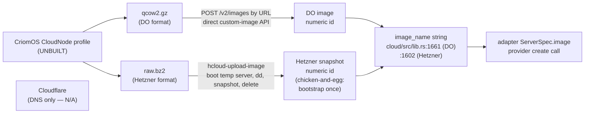

# 68 · Lane 5 — Image home (ad53) + doc freshness

Cloud-designer deep audit, session 68, image-home + context-maintenance
lane. Modeled on report 702's hard-question method (what does each
invariant GUARANTEE, where is it ENFORCED at `file:line`, where can it
BREAK; soundness-vs-surface; design tensions). Read-only: evidence is
source + git log, no builds.

Audit HEADs (all = origin/main): cloud `7f190c3` (working tree at
`3b38cdd`), signal-cloud `4e846bc`, meta-signal-cloud `54d62be`. CriomOS
and horizon-rs read at their checkout HEADs under
`/git/github.com/LiGoldragon`.

## Thesis

Two distinct truths, and the lane's value is keeping them apart:

1. **The wire is ready; the image is not.** `image_name` is plumbed
   end-to-end **on the production `Store` path** — psyche-authored value
   in `DesiredHostState`, copied into `HostPlan` by the daemon, lowered
   into each adapter's `ServerSpec.image` at apply. So the daemon can
   *reference* an image by id today, with zero wire/daemon change. But the
   thing it would reference — the `CloudNode` CriomOS profile that ad53
   decided — **does not exist in any form**: no `NodeSpecies::CloudNode`,
   no facet, no gate module, no `nixos-generators` input, no image-format
   output. ad53 is a recorded Decision with **zero implementation surface.**

2. **The docs describe a different daemon than the one on main.**
   `cloud/INTENT.md` and `cloud/ARCHITECTURE.md` still describe a
   Cloudflare-DNS-first daemon. Neither file contains the strings
   `DigitalOcean`, `synchronous`, `Store`, `ad53`, `CriomOS`, `CloudNode`,
   or `image` — yet DO Phase-1 is the **live-proven** path (report 64
   Tier-1 green) and three provider adapters ship on main. The docs are a
   full provider-generation behind the code.

The deepest finding: **ad53's "no wire change needed" claim is true and
load-bearing, which is exactly why the gap is invisible.** Because the
control-plane side needs no code, nothing in the cloud repo will ever fail
to compile or test for lack of the image — the entire missing half lives
in CriomOS/horizon-rs, two repos the cloud CI never touches. The decision
looks done (Spirit-recorded, wire-confirmed) while the artifact it points
at is unbuilt. This is a soundness-vs-surface trap at the *workspace*
level: the capability is real on the cloud side and entirely absent on the
platform side, and no single repo's green status reveals it.

## 1 · The ad53 gap, stated precisely

ad53 (Decision, Medium): *cloud-node OS images live in CriomOS as a
CloudNode-species profile (mirroring TestVm); the daemon references the
image by id via HostPlan `image_name`.* Report 65 is the design; report 66
§1 confirms ad53 is recorded.

### What exists (the cloud half — DONE)

The `image_name` field is real and plumbed on the **production path**, not
just in tests. Traced end-to-end:

| Stage | Evidence | What it does |
|---|---|---|
| Wire newtype | `meta-signal-cloud/src/lib.rs:148` `pub struct ImageName(String)` | the carried type |
| Desired input | `meta-signal-cloud/src/lib.rs:205-211` `DesiredHostState{…image_name…}` | psyche authors it |
| Plan field | `meta-signal-cloud/src/lib.rs:231-236` `HostPlan{…image_name…}` | survives planning |
| Daemon copy | `cloud/src/lib.rs:1255` destructure → `:1282` re-emit into `HostPlan` | **production `Store::prepare_host_plan`** carries it verbatim |
| Hetzner apply | `cloud/src/lib.rs:1602` `image: plan.image_name.as_str().to_owned()` | into `hetzner::ServerSpec.image` |
| DO apply | `cloud/src/lib.rs:1661` `image: plan.image_name.as_str().to_owned()` | into `digitalocean::ServerSpec.image` |
| Frame bridge | `cloud/src/schema_bridge.rs:3001,3023,3080,3102` | live socket-frame path also threads it both directions |

The production daemon's engine is `Arc<Store>` (`cloud/src/schema_daemon.rs:54`
`type Engine = Arc<Store>;`), so the `Store` methods above ARE the
production path — not the `schema_runtime.rs` pilot (which `grep` shows
never references `image_name` at all). Report 65's "no wire change needed"
verdict is **confirmed against source.** ad53's cloud-side obligation is
satisfied today.

### What does NOT exist (the platform half — the real gap)

Every CriomOS/horizon-rs leg ad53 requires is absent:

- **No species.** `horizon-rs/lib/src/species.rs:13-31` `NodeSpecies` has
  ten variants ending in `TestVm`; **no `CloudNode`.** Confirmed by full
  read.
- **No facet.** `horizon-rs/lib/src/node.rs:152-169` `BehavesAs` and
  `:173-184` `TypeIs` carry `test_vm` but no `cloud_node`; `:187-200`
  `TypeIs::from_species` and `:204-233` `BehavesAs::derive` have no
  CloudNode arm.
- **No gate module.** `CriomOS/modules/nixos/criomos.nix:44` imports
  `./test-vm-guest.nix`; there is no `cloud-image.nix` / `cloud-node.nix`.
  `CriomOS/modules/nixos/disks/` holds exactly four files —
  `default.nix`, `liveiso.nix`, `pod.nix`, `preinstalled.nix` — no cloud
  member.
- **No image build.** `grep` of CriomOS `flake.nix`/`modules`/`packages`
  for `nixos-generators`/`nixosGenerate`/`build-image`/`qcow`/`digital-ocean`
  finds **nothing** (the only `format =` hits are
  `modules/nixos/llm.nix:162` and `router/default.nix:102,110`, both
  `format = "binary"`, unrelated). CriomOS has **no `nixos-generators`
  flake input.**
- **No INTENT trace.** Neither `CriomOS/INTENT.md` nor
  `horizon-rs/INTENT.md` mentions `CloudNode` / cloud-node (grep empty).

So the precise gap is: **the cloud daemon can pass any image id you hand
it, but there is no pipeline that produces one, and no node-role that
declares one as cluster-authored spec.** The id today is hand-authored in
a CLI string (report 64 passes stock `ubuntu-24-04-x64`). ad53's whole
point — a *baked CriomOS image* booted fast — is unbuilt platform-side.

## 2 · The TestVm template — the concrete shape a CloudNode profile follows

ad53 says "mirroring TestVm." The TestVm pattern is **three coordinated
edits, no daemon code**, and it is fully traceable. A CloudNode profile
slots into the identical three seams:

```mermaid
flowchart TD
    subgraph horizon["horizon-rs (the type lane)"]
        SP["species.rs:13-31<br/>NodeSpecies::TestVm<br/>(add CloudNode here)"]
        TI["node.rs:187-200<br/>TypeIs::from_species<br/>test_vm: matches!(s, TestVm)<br/>(add cloud_node arm)"]
        BA["node.rs:204-233<br/>BehavesAs::derive<br/>test_vm = type_is.test_vm<br/>(add cloud_node passthrough)"]
        SP --> TI --> BA
    end
    subgraph criomos["CriomOS (the render lane)"]
        IMP["criomos.nix:44<br/>imports ./test-vm-guest.nix<br/>(add ./disks/cloud-node.nix)"]
        GATE["test-vm-guest.nix:tail<br/>mkIf (behavesAs.testVm or false)<br/>(gate cloud module on<br/>behavesAs.cloudNode)"]
        IMP --> GATE
    end
    subgraph build["NEW — image-format output (not in TestVm template)"]
        GEN["nixos-generators input +<br/>flake attr: qcow2 (DO) / raw (Hetzner)<br/>— absent today"]
    end
    BA -.projects behaves_as.cloudNode.-> GATE
    GATE -.system definition.-> GEN
    GEN -.upload->snapshot id.-> WIRE["image_name on the wire<br/>(meta-signal-cloud:209 — READY)"]
```

What the template guarantees and where it would extend:

- **Leanness mechanism** (`node.rs:214-220`, `test-vm-guest.nix` header):
  TestVm sets `test_vm: true` and *no* heavy `type_is` flags, so
  edge/center/router/large_ai all derive false and their `mkIf`-gated
  module trees go inert automatically. A `CloudNode` would do the same —
  set `cloud_node` and nothing else — inheriting that leanness for free.
- **What the gate actually does** (`test-vm-guest.nix` tail):
  `mkIf (behavesAs.testVm or false)` only *suppresses* weight
  (documentation off) while leaving a real deployable node (sshd, root
  keys, real disk untouched). A CloudNode gate would *add* the
  cloud-specific surface report 65 §1 names (cloud-init, growpart, serial
  console, no GUI) — additive, not suppressive, which is a slightly
  different shape than TestVm.
- **The one piece TestVm does NOT model:** an **image-format output.**
  TestVm boots as a microVM *guest* via the host's substrate
  (`criomos.nix:46` KVM microVM comment); it never produces a
  provider-uploadable disk. The CloudNode profile needs a *new* flake
  attribute (`nixos-generators` qcow2/raw) that the TestVm template gives
  no precedent for. **This is the genuinely new design surface**, not the
  species/facet/gate trio.

So "mirror TestVm" covers two of three legs; the build leg is net-new and
is where the design effort actually lands.

## 3 · Per-provider image pipeline — what the daemon needs vs what it has

Report 65 §3 worked the pipeline; this lane confirms the daemon side
against source and isolates the asymmetry that gates the milestone.



- **DigitalOcean** has a true custom-image upload API (`POST /v2/images`
  by URL) → no throwaway server. Adapter consumes the resulting numeric id
  through `digitalocean::ServerSpec.image` (`cloud/src/digitalocean.rs:95`
  `pub image: String`, set at `cloud/src/lib.rs:1661`).
- **Hetzner** has **no upload API** — the only path is snapshot a running
  server (`create_image type=snapshot`), so the first snapshot needs a
  one-time bootstrap (the chicken-and-egg). Adapter consumes the snapshot
  id through `hetzner::ServerSpec.image` (`cloud/src/hetzner.rs:82`, set at
  `cloud/src/lib.rs:1602`).
- **Cloudflare** is DNS/redirects only (`cloud/src/lib.rs:748-749`
  capabilities are `DomainNameSystemRecords`/`RedirectRules`) — no compute,
  no image. N/A.

**What the daemon needs to reference an image by id: nothing new.** Both
compute adapters already take an arbitrary string in `ServerSpec.image`
and pass it to the provider create call. The daemon is image-agnostic by
construction — it never validates or interprets the id (see §4 tension).
The entire remaining work is *producing* the id (CriomOS build + provider
upload), which is platform/operator work, not cloud-daemon work.

## 4 · Hard questions — invariants, soundness, tensions

### Invariant: image_name is carried end-to-end

- **Guarantees:** a psyche-authored image id reaches the provider create
  call unchanged, so booting from a baked snapshot is a pure value swap.
- **Enforced at:** `cloud/src/lib.rs:1255→1282` (Store copy),
  `:1602`/`:1661` (adapter lowering), `schema_bridge.rs:3001-3102` (frame
  path). **Holds on the production `Store` path.**
- **Where it breaks:** the Destroy path mints `image_name: ImageName::new("")`
  (`cloud/src/lib.rs:1326`) — fine, since destroy resolves by name and
  never reads it (`:1608-1610` routes to `destroy_host_by_name`). The
  invariant is "create carries it; destroy ignores it," and that is
  honored. No break found on this path.

### Tension: ImageName is an unvalidated stringly newtype

`meta-signal-cloud/src/lib.rs:148-158` — `ImageName(String)` has only
`new`/`as_str`, **no validation, no `TryFrom`, no parse.** This is the
typed-domain-values discipline at half-strength: it *is* a newtype (not a
bare `String` in the struct), so it satisfies the letter of "no primitive
obsession," but it carries no invariant — any string, including `""`, is a
valid `ImageName`. **Where it bites:** DO wants a *numeric* id for a custom
image but a *slug* for a stock image (`ubuntu-24-04-x64`); Hetzner wants a
numeric snapshot id or a system-image name. A typo reaches the provider
API and fails *there*, not at the wire edge. For ad53's baked-snapshot
end-state (numeric ids), the lack of any "is this a plausible image
reference" check means the daemon cannot distinguish a real snapshot id
from garbage until the provider rejects it. This is a transitional seam:
acceptable while ids are hand-authored, a latent papercut once they are
cluster-authored spec. **P2** — it does not gate the milestone but it is
the kind of soundness gap report 702's method targets.

### Tension: ad53's "no code change" hides a two-repo dependency

The decision is recorded and the cloud side compiles green forever
*regardless* of whether CloudNode exists, because the missing work is in
CriomOS + horizon-rs. There is **no compile-time or test-time link** from
the cloud daemon to the existence of the image profile. A reader of the
cloud repo sees `image_name` fully plumbed and reasonably concludes ad53
is done. It is half-done, and the unbuilt half is invisible from here.
This is the deepest design tension: **a cross-repo decision with no
single-repo enforcement point.** The only mitigation is documentation
(INTENT.md in three repos) — which §5 shows is also absent. **P1** — this
gates the "boot a baked CriomOS image" milestone and is currently tracked
*nowhere in code.*

### Soundness-vs-surface verdict

| Capability | Real on production path? | Evidence |
|---|---|---|
| Daemon references an image id end-to-end | **YES, production** | `lib.rs:1282,1602,1661` on `Arc<Store>` path |
| Daemon validates the id is a real image | **NO** | `ImageName` unvalidated, `meta-signal-cloud:148` |
| CriomOS produces a baked CloudNode image | **NO — absent** | no species/facet/gate/generator |
| Cluster authors the image id as spec | **NO — hand-authored CLI string** | report 64 passes stock slug |

The capability ad53 names is **real on the cloud control plane and absent
on the platform.** Booting a baked image is gated entirely by §1's
platform gap, not by anything in the cloud repo.

## 5 · Doc freshness — the context-maintenance items

This lane owns the freshness sweep. Findings are concrete and quotable.

### cloud/INTENT.md (81 lines) — a provider-generation stale

- **DigitalOcean entirely absent.** grep for `digitalocean` → **0 hits**,
  yet DO Phase-1 is the *live-proven* path (report 64 Tier-1 green, commit
  `dfcf9e3`). INTENT.md:18-20 still says "Hetzner first" as the *only*
  named provider. **Stale.**
- **Three-provider abstraction unstated.** The code carries
  Cloudflare/Hetzner/DigitalOcean (`cloud/src/lib.rs:124,128,132` Error
  arms; `:748-752` capability map). INTENT.md frames cloud as
  Hetzner-compute-first with no mention that three adapters coexist behind
  one `Provider` enum. **Missing.**
- **Synchronous Store path unstated.** The shipped Phase-1 is explicitly
  the "synchronous Store path" (commits `04876ed`, `dfcf9e3`). INTENT.md
  describes the actor/deferred-effect future (the reuse pool, lines 35-46)
  as if it were the shape, without recording that the *current* path is
  synchronous blocking IO behind the Store. **Missing — and this is the
  single most important runtime fact about today's daemon.**
- **ad53 absent.** grep `ad53`/`image`/`CriomOS`/`CloudNode` → **0 hits.**
  The recorded image-home Decision is reflected in *no* INTENT prose.
  Report 65 §5 listed the exact line to add ("the image is selected by id
  through the existing `image_name`; cloud does not define or build the OS
  image; that is CriomOS's `CloudNode` profile") — **not yet landed.**

### cloud/ARCHITECTURE.md (163 lines) — opens on the wrong provider

- **Opening line is stale** (`ARCHITECTURE.md:3-5`): *"Its first target is
  Cloudflare DNS records and redirect rules. Later provider actors can
  cover Google Cloud DNS, Hetzner Cloud…"* — this predates the compute
  pivot. DO/Hetzner compute is the active capability now; Cloudflare DNS is
  one of three, not "the first target," and the listed "later" providers
  (Google Cloud DNS) are not the ones that shipped. **Stale.**
- **DigitalOcean absent** (grep → 0 hits) despite being the live-proven
  adapter. The "Current Implementation Slice" (`:43-79`) is entirely
  DNS/Cloudflare and never mentions compute-node create/observe/destroy —
  the actual Phase-1 deliverable. **Missing a whole capability.**
- **Actor shape describes a daemon that wasn't built that way**
  (`:30-41`): lists `CloudflareProvider`/`PlanStore`/`PolicyStore`/
  `RateLimitGate`/`RemoteOperationTracker` "one actor per concern" and
  "provider calls must not block the listener." The shipped Phase-1 is the
  **synchronous blocking Store path** (the very thing `:41` warns against).
  ARCHITECTURE.md states the *aspiration* as if it were *fact*. This is the
  no-back-compat-as-virtue inversion in reverse: the doc presents an
  unbuilt non-blocking shape as the architecture. **Stale + misleading.**

### protocols/active-repositories.md:91 — stale, confirmed

Still reads *"Documentation-only at birth; real daemon work is tracked by
bead `primary-kbmi`."* This is false: three provider adapters, a live
daemon spine, and a Tier-1-green DO path have shipped (`cloud/src/lib.rs`,
`digitalocean.rs`, `hetzner.rs`, `cloudflare.rs`; commits `04876ed`
through `3b38cdd`). The session-68 frame already flagged this
(`0-frame-and-method.md:29`); this lane confirms it against the row text.
**Stale.**

### report-66 handoff status vs main — reconciled

Report 66 §2 P0 ("commit the flake.nix gopass `.com` fix") is **landed**:
commit `7f190c3` *"cloud: read DigitalOcean token from domain gopass
path"* is on origin/main; the working tree advances to `3b38cdd`
*"cloud: harden DigitalOcean live test path"* (the P1 test-hardening).
So report 66's P0 and at least part of P1 are **done on main** — the
handoff's "uncommitted change" framing (66 §2 P0) is itself now stale.
P2 items (DO-enabled package variant, Tier-2 live run) are not visibly
reflected in the git log and remain open.

### Concrete doc-maintenance items

1. **cloud/INTENT.md** — add a DigitalOcean line under "On-demand compute
   provisioning"; state the three-provider `Provider`-enum abstraction;
   record that Phase-1 is the **synchronous Store path** (actor/deferred
   shape is staged follow-up); add the ad53 image-home sentence from report
   65 §5. (Operator or cloud-designer; INTENT.md edits land on the work
   branch per AGENTS.md.)
2. **cloud/ARCHITECTURE.md** — rewrite the opening (`:3-5`) from
   "Cloudflare-DNS-first" to "three-provider: Cloudflare DNS + DO/Hetzner
   compute, DO live-proven"; add the compute create/observe/destroy slice
   to "Current Implementation Slice"; reconcile the Actor Shape section
   (`:30-41`) with the shipped synchronous Store path — state plainly that
   the non-blocking actor shape is *aspirational*, not built.
3. **protocols/active-repositories.md:91** — replace "Documentation-only at
   birth" with the real status (three adapters, DO Tier-1 green,
   synchronous Store path; `primary-kbmi` is partly delivered). Primary
   edit — lands straight on main.
4. **CriomOS/INTENT.md + horizon-rs/INTENT.md** — add the `CloudNode`
   stance ad53 implies (CriomOS owns the cloud-node image definition +
   per-provider format build; horizon notes `CloudNode` as a species and
   the image id as cluster-authored spec). **This is the only doc fix that
   closes the §4 cross-repo-invisibility tension** — the platform repos are
   where the gap lives, so the platform INTENTs are where ad53 must be
   written for the work to be discoverable.

## Invariants table

| Invariant | Status | Enforced at | Risk if broken |
|---|---|---|---|
| `image_name` carried end-to-end (create) | **Holds** | `cloud/src/lib.rs:1282,1602,1661` (Store path) | Booting a baked image would need new wire/daemon code — it does not |
| Destroy ignores `image_name` | **Holds** | `cloud/src/lib.rs:1326` (minted empty), `:1608` (resolve by name) | A destroy reading a stale image id would misroute — it never reads it |
| ad53: CloudNode image profile exists in CriomOS | **Violated** | nowhere (`species.rs:13-31` has no variant; no gate module; no generator) | "Boot a baked CriomOS image" milestone has no artifact to reference |
| ad53: daemon references image, never defines it (triad boundary) | **Holds** | `cloud/src/lib.rs:1602,1661` (opaque string passthrough); no image build in cloud repo | Mixing OS bytes into the control plane = triad violation; not present |
| `ImageName` carries a domain invariant | **AtRisk** | `meta-signal-cloud/src/lib.rs:148` (unvalidated `String` newtype) | Garbage/typo image id fails at provider API, not at wire edge |
| cloud docs reflect the shipped daemon | **Violated** | `INTENT.md`/`ARCHITECTURE.md` (no DO/Store/ad53; ARCHITECTURE:3 Cloudflare-first) | Readers trust a Cloudflare-DNS-first, actor-shaped daemon that isn't what ships |
| active-repositories.md reflects cloud status | **Violated** | `protocols/active-repositories.md:91` ("Documentation-only at birth") | Architecture sweeps treat a live 3-provider daemon as a doc stub |

## Ranked findings

### P1 — gates the next cloud milestone

- **ad53's platform half is entirely unbuilt and tracked nowhere in
  code.** No `NodeSpecies::CloudNode` (`horizon-rs/lib/src/species.rs:13-31`),
  no facet (`node.rs:152-200`), no gate module (`criomos.nix:44` imports
  only TestVm), no `nixos-generators` input or image-format output
  (CriomOS flake/modules/packages grep empty). The cloud side is done; the
  decision *looks* done; the milestone "boot a baked CriomOS image fast"
  cannot start. Because no cloud-repo build/test depends on it, the gap is
  invisible from the cloud lane — the §4 cross-repo tension. Needs a bead +
  the platform INTENT writes (item 4) to become discoverable.

### P2 — soundness / coherence

- **`ImageName` is an unvalidated stringly newtype**
  (`meta-signal-cloud/src/lib.rs:148-158`): no parse/validation, `""` is
  valid. Bad ids fail at the provider, not the wire edge. Latent papercut
  once ids are cluster-authored numeric snapshot ids. Add a `TryFrom`/parse
  that at least rejects empty and whitespace, or a typed split between
  "slug" and "numeric id" forms.
- **cloud/ARCHITECTURE.md presents an unbuilt actor shape as the
  architecture** (`:30-41`) while Phase-1 ships the synchronous blocking
  Store path. The doc warns "provider calls must not block the listener"
  — which the shipped path does. Misleading, not just stale; reconcile
  aspiration vs fact.

### P3 — cleanup

- **cloud/INTENT.md + ARCHITECTURE.md provider-generation drift**: add DO,
  the three-provider abstraction, the synchronous Store path, and the ad53
  sentence (items 1-2). Quotable stale opener at `ARCHITECTURE.md:3-5`.
- **protocols/active-repositories.md:91** "Documentation-only at birth" →
  real status (item 3). Already flagged in `0-frame-and-method.md:29`;
  trivial primary-main edit.
- **report 66's P0 "uncommitted flake.nix fix" framing is itself stale**:
  `7f190c3` landed it on main. A one-line status note closes the handoff's
  P0/P1.

## What this lane does NOT claim

- It does not re-audit the daemon/Store actor shape (lane 1), the adapters'
  internal correctness (lane 2), or the wire schema discipline broadly
  (lane 3) — only the `image_name` slice that crosses all three.
- It does not assert the DO/Hetzner upload APIs work as report 65 §3
  describes them — those are web-sourced and carry report 65's own caveats;
  this lane confirms only the *daemon-side* readiness against source.
- "Production path" throughout means the `Arc<Store>` engine
  (`schema_daemon.rs:54`), not the `schema_runtime.rs` pilot, per the
  audit-precision rule.
