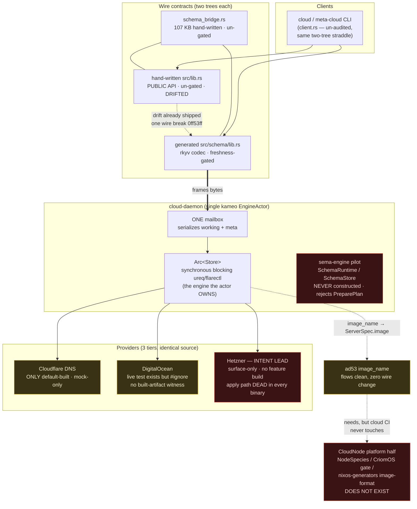
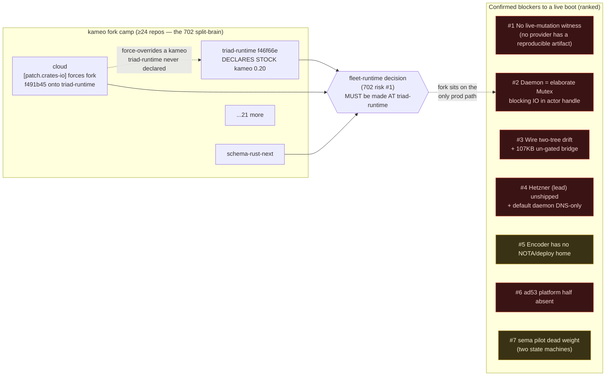

# 68 — cloud engine audit · synthesis

Whole-cloud narrative folding the five lanes plus the completeness pass
into one act-on-able picture. This is the highest-numbered file in the
session directory; it supersedes nothing in the lane reports — it reconciles
their verdicts and carries only **Confirmed** findings forward as standing
risks. Downgraded/Refuted lane claims are recorded in the verdict ledger
(section "What the audit walked back") and do **not** appear as risks.

Pin note: all five lanes audited at cloud `7f190c3` (= `origin/main` at
fan-out), signal-cloud `4e846bc`, meta-signal-cloud `54d62be`. The
completeness lane flagged that cloud HEAD had since advanced one commit to
`3b38cdd` (rewrote `digitalocean_live.rs`, added `write_config.rs`,
reworked `flake.nix`); line citations into those three files are therefore
one commit off. That delta does **not** invalidate the structural findings
below — it only sharpens two of them (it is what closed report 64's "no
encoder" claim, see the ledger).

## Headline

**cloud is a real kameo daemon in form and a serial single-writer in
substance, sitting on an unwitnessed production path: not one cloud provider
has a reproducible artifact proving it can provision a live node, and the
daemon's own one-command boot, its lead provider, and its image milestone
are each unbuilt or unreachable.** The shipped surface is genuinely
finished-looking — three provider adapters, a generated wire codec, a
hermetic build/test/clippy gate, a config encoder — but the *production
spine* (wire bytes → kameo `EngineActor` → synchronous blocking-`ureq`
`Store` → real provider) has never been exercised end-to-end over the daemon
socket against a real account, and the default `nix run .#daemon` builds a
DNS-only daemon that answers `NotBuilt` to every compute request. The honest
state is **"adapter-proven, spine-unproven"**: the parts work in isolation;
the assembled live machine is a claim, not an artifact.

This is not a regression. cloud's report 66 / bead `primary-hpkj` handoff
(operator report 391) correctly landed the P0 gopass `.com` fix at
`7f190c3`, added the DO-capable package, and shipped the config encoder —
real forward motion. The audit's job is to say plainly what that motion has
and has not yet reached: it reached *buildable*, not yet *witnessed-live*.

## Soundness-vs-surface map

The central deception of the cloud repo is that **source completeness and
production reachability are decoupled, and only `flake.nix` + the test
inventory reveal the gap.** A reader of `src/` alone sees three equally
finished providers, two full state machines, two complete wire trees. The
build and test wiring tell a different story.

| Layer | Surface (what `src/` shows) | Sound on the production path? | Confirmed gap |
|---|---|---|---|
| **Codegen / wire** | Two full type trees per contract repo (hand-written `src/lib.rs` + generated `src/schema/lib.rs`); build.rs freshness-gates the generated one | **Partial.** Generated tree is gated and frames bytes; hand-written public API is **un-gated and already drifted** (`capability_state` vs `state`, `domain_name` vs `zone`, tuple vs struct, `ObserveServers` vs `Servers`) | 68-3-P1-1, 68-3-P1-2. Drift already shipped one silent wire break (`0ff53ff`). The daemon *straddles* both trees. |
| **Adapter** | DO / Hetzner / Cloudflare all look complete and symmetric | **Tiered, and the tiers are invisible from code.** DO has a live test + package; Hetzner (intent's *lead*) is surface-only and compiled into **no** shipped binary; Cloudflare is mock-only | P1-hetzner-surface-only, P2-compute-mirror-dup, P2-ssh-key, P2-three-errors |
| **Daemon** | A kameo actor system; ARCHITECTURE.md promises five concern-actors + non-blocking listener | **Form only.** One `EngineActor` owns the whole `Arc<Store>` and serializes *both* sockets; the meta handler runs **timeout-free blocking** `ureq`/`flarectl` *inside* the actor handle | P2-a (elaborate Mutex), P2-c (doc ≠ code), 68-4-F2 (fork on the only path) |
| **Boot / config** | Daemon takes one rkyv arg (override-correct) | **Reachable but homeless.** Encoder exists (`examples/write_config.rs`) but is an `examples/` target taking 3 positional args, hardcoding the shape in Rust — **no NOTA authoring file**, no deploy-stack home | 68-4-F5 |
| **Image-home (ad53)** | cloud side needs **zero** wire change — `image_name` flows cleanly | **Invisibly blocked.** The entire platform half (`NodeSpecies::CloudNode`, the facet, the CriomOS gate module, the nixos-generators image-format output) is **unbuilt and tracked nowhere in code**; lives in CriomOS/horizon-rs, repos cloud CI never touches | F1, F2 |
| **End-to-end live proof** | "DigitalOcean Tier-1 live-proven" (3 lanes lean on this) | **No reproducible witness exists.** The DO live test is `#[ignore]` (real money, gopass token); the only Nix check `--ignored --list`s it and runs nothing; Cloudflare (the *only* default-built provider) has no live test at all; Hetzner has neither | Completeness P1 (no built-artifact witness), P1-b/68-4-F1 (no spine lifecycle test) |

### The one-sentence soundness verdict per layer

- **Codegen** — gated where it generates, un-gated where it's hand-copied; the hand copy is the public API and it has drifted. *Sound mechanism, unsound discipline.*
- **Wire** — the daemon frames the generated tree and reads domain values from the hand-written tree; the meta contract re-declares signal-cloud's types instead of importing them. *Straddle, with a 107 KB hand-written bridge as the materialized tax.*
- **Adapter** — three production tiers wearing identical source clothing. *Sound code, dishonest build.*
- **Daemon** — a Mutex wearing an actor costume; one hung provider call stalls both sockets. *Form without the property the form is supposed to buy.*
- **Image-home** — the control plane is genuinely done; the platform half does not exist and no single-repo build fails for its absence. *Done-looking, unstartable.*

## Visual 1 — cloud production dataflow (what actually runs)

Legend: red = unbuilt/unreachable/dead on the production path; amber =
present but unwitnessed or partial; unstyled = sound mechanism.

## Visual 2 — risk and kameo-fleet map

## Ranked Confirmed risks (each with the single highest-value move)

Ranked by distance-to-a-live-boot and blast radius. P1s first.

### 1 · No provider has a built-artifact witness of a live mutation [P1]
Three lanes lean on "DigitalOcean Tier-1 live-proven," but the DO live test
is `#[ignore]` (spends real money, needs a gopass token) and the only Nix
check referencing it runs `--ignored --list` (`flake.nix:159`) — it *lists*
the test and runs nothing. Cloudflare, the **only** provider in
`packages.default`, has **no** live test at all (mock-only). Hetzner has
neither. "Live-proven" rests on an unrecorded manual run.
**Move:** Treat "cloud provisions a node" as *unproven* until one
authorized live run produces a recorded artifact. The cheapest honest step
is the DO Tier-1 run (it has the test + token path); the load-bearing step
is **risk #2's** spine test run live once. This is the headline gap.

### 2 · The daemon is an elaborate Mutex with blocking IO in the actor handle [P1→derived from P2-a + 68-4-F2/F1]
One `EngineActor` holds the whole `Arc<Store>` and serializes *both* working
and meta requests; the meta handler runs **timeout-free** blocking
`ureq`/`flarectl` provider IO *inside* the actor handle. One hung provider
call stalls both sockets and every client. Report 36's hazard survived the
kameo cutover unchanged, and the kameo **fork** sits on this — the only
production provisioning path that exists. There is also no end-to-end test
over the daemon socket lifecycle (register → prepare → approve → apply →
observe) through the real kameo daemon, Store, and meta socket.
**Move:** Per `actor-systems.md`, move provider IO into a blocking-plane
actor (`Command`/`CommandPool`, `spawn_blocking` + `DelegatedReply`, bounded
by permits, per-call timeout) so the engine mailbox returns immediately —
*then* run that one live daemon-socket lifecycle (closes risk #1's spine
half).

### 3 · Wire two-tree drift, with a 107 KB un-gated hand bridge [P1: 68-3-P1-1 + completeness P2]
Each contract repo ships two divergent type trees. The hand-written
`src/lib.rs` is the public API every consumer and test imports, is **not**
freshness-gated, and has already drifted from the schema in field names,
newtype shapes, and variant names; the daemon frames bytes with the
generated tree but takes domain values from the hand-written tree. The
materialized cost is `schema_bridge.rs` — at 107 KB the **largest file in
the repo** (~1.6× `lib.rs`), entirely hand-written, no freshness gate,
carrying the live CLI-input and daemon-reply path. The CLI (`client.rs`) was
itself un-audited and sits on the *same* straddle, doubling the blast radius.
**Move:** Finish the schema cutover named in `signal-cloud/ARCHITECTURE.md`
lines 73–87 — replace the hand-written `src/lib.rs` types with
`pub use crate::schema::lib` re-exports, delete the duplicates, update
downstream imports. Pre-production this is a clean break, not a staged
migration; it also fixes 68-3-P2-1 (newtype ergonomics) for free.

### 4 · The lead provider is unshipped and the default daemon is DNS-only [P1: P1-hetzner + P1-default-daemon]
Hetzner is intent's lead ("Hetzner first", `INTENT.md:18`) but is
surface-only: no `--features hetzner` build anywhere in `flake.nix`, no live
test, and `apply_hetzner_host_plan` (`lib.rs:1577-1618`) is **dead code in
every shipped binary**. Worse, `apps.daemon` and `apps.default` point at
`packages.default` (default features = `[cloudflare]` only), so
`nix run .#daemon` yields a daemon answering `NotBuilt` to **both** compute
providers — compute capability is reachable only via the non-default
`apps.daemon-digitalocean`. Build and intent disagree *silently*.
**Move:** Two decisions — (a) point `apps.daemon` at the intended default
build (compute-capable), and (b) either add `packages.hetzner` +
`tests/hetzner_live.rs` to make the lead real, **or** capture an explicit
intent supersession that DigitalOcean is now lead and Hetzner deferred.
This is a **psyche question** (see below), not a code call.

### 5 · ad53's image milestone is unstartable — platform half absent [P1: F1]
The cloud-side `image_name` plumbing is done and the ad53 Decision *looks*
done, but the entire platform half is unbuilt and tracked nowhere in code:
no `NodeSpecies::CloudNode`, no `BehavesAs`/`TypeIs` facet, no CriomOS gate
module, no nixos-generators input or image-format output. Because no
cloud-repo build/test depends on it, the gap is invisible from the cloud
lane. The "boot a baked CriomOS image" milestone **cannot start**.
**Move:** Open a bead for the CloudNode profile (3 horizon-rs edits
mirroring TestVm + 1 new CriomOS gate module + a NEW nixos-generators
image-format flake attr — qcow2 for DO, raw for Hetzner, the one leg TestVm
gives no precedent for), and write the CloudNode stance into
`CriomOS/INTENT.md` and `horizon-rs/INTENT.md` so the cross-repo dependency
becomes discoverable.

### 6 · The config encoder has no deploy-stack / NOTA home [P2: 68-4-F5]
The encoder exists (`examples/write_config.rs`, closing report 64's "no
encoder") but is an `examples/` target (not a `[[bin]]` or `apps.*`), takes
three positional CLI args, and hardcodes the `DaemonConfiguration` shape in
Rust. There is **no NOTA `DaemonConfiguration` authoring file**, so the
override's "encode typed NOTA into binary" pipeline does not exist and the
encoder has no two-deploy-stack home.
**Move:** Give the encoder a deploy-stack home (a `bin` or nix app in the
bootstrap tool) and make it consume a NOTA `DaemonConfiguration` file rather
than three positional args.

### 7 · The sema-engine pilot is dead weight; two divergent state machines [P2: P2-b + P2-c]
`SchemaRuntime`/`SchemaStore` are never constructed by the daemon
(`build_runtime` builds the legacy provider Store, `schema_daemon.rs:66`),
reject `PreparePlan`/`PrepareHostPlan`, and apply nothing. Two state
machines are maintained, one unreachable — and `ARCHITECTURE.md` documents a
five-actor daemon that does not run. Maintaining both contradicts the
no-pre-production-back-compat posture. (Corollary: the 702/4 directory-TCB
storage concern is **premature** — cloud is not a live sema-engine Store
consumer, so that question only becomes live *if* the pilot is promoted.)
**Move:** Decide — cut the pilot, **or** commit to promoting it (only then
does the directory-TCB question go live). Then reconcile `ARCHITECTURE.md`
with whichever shape is real (build the actor tree or retire the mandate).

### Lower-severity Confirmed (carry as cleanup, not blockers)
- **P2: compute adapters are near byte-for-byte mirrors** (P2-compute-mirror-dup) — `hetzner.rs`/`digitalocean.rs` differ only in envelope, REST path, key resolution. Invent the shared compute-provider REST client before `google-cloud` (feature stub, `Cargo.toml:30`) triples the copy. Folds in P2-three-sibling-errors (`impl From<...Error> for RejectionReason`) and P2-ssh-key (the create path never calls `ensure_ssh_key`; DO silently creates an unreachable droplet, Hetzner 422-fails — opposite failure modes, fix uniformly).
- **P2: meta credential-handle custody is a wire-driven `getenv`** (completeness) — `CredentialHandle` is an unvalidated `String` used directly as an env-var name in `std::env::var(handle.as_str())`; "wire handle string == deploy-time env var name," unsealed, gated only by the meta socket's `0o600` mode. Named by no lane; worth a deliberate decision.
- **P2: 68-3-P2-2** three distinct `RejectionReason` types share one name across contracts — distinct names or document the overload. Low urgency.
- **P2: F2** `ImageName` is an unvalidated stringly newtype (empty string is valid) — add a `TryFrom`/parse rejecting empty/whitespace, or split slug-vs-numeric-id forms so garbage fails at the wire edge, not the provider API.
- **P2: no cloud-daemon deployment in any consuming repo** (completeness) — `active-repositories.md:91` calls cloud a "live daemon spine," but CriomOS/horizon-rs/goldragon contain no NixOS module, systemd unit, nixosTest, or host. The deployment half of "live" is entirely absent.

## What the audit walked back (verdict ledger — NOT standing risks)

These were lane claims the completeness pass downgraded or refuted. Recorded
so a reader trusting two lanes at once is not misled; **none is a risk.**

- **Report 1 P1-a "No built rkyv config encoder" — REFUTED.** `examples/write_config.rs` exists as a non-test target calling public `CloudDaemonConfigurationFile::write_configuration` (report 4 F5 is correct). The encoder *exists*; its only real issue is its *home* (risk #6). The "can only be produced by `#[cfg(test)]`" framing is wrong.
- **Reports 1 P1-b and 4 F1 "no daemon-socket lifecycle test" — OVERSTATED/inverted.** `tests/runtime.rs:292` writes a real rkyv config, spawns the real `CARGO_BIN_EXE_cloud-daemon` binary, waits for the real socket, and exchanges a real `Observe Capabilities` request through the kameo spine — and it is in the hermetic `checks.test`. The true gap is **narrower**: no test drives the *meta* socket or *provider apply* over the spawned daemon (only in-process against Store). Risk #2 carries the corrected, narrower gap.
- **Report 66 P0 ".com gopass fix" — already landed.** Confirmed at `7f190c3` (`flake.nix:71` reads `digitalocean.com/api-token`); operator report 391 integrated bead `primary-hpkj`. Not open.

## Reconciliation with report 66 (cloud-operator handoff, bead `primary-hpkj`)

Report 66 → operator report 391 landed the actionable handoff cleanly and
this audit confirms each claim: the P0 `.com` fix is **done** at `7f190c3`;
the config encoder gap report 64 named is **closed** (the encoder exists —
this audit only re-homes it, risk #6); `packages.digitalocean` +
`apps.daemon-digitalocean` + the DO live test + `delete_ssh_key` all landed.
Report 391's own "Remaining work" already anticipated this synthesis: "the
Tier-2 full-daemon live chain is still not run" (= risks #1 + #2) and "report
68 audit may produce follow-up beads." This synthesis *is* those follow-ups.
The one thing 391 did **not** flag and this audit adds: `apps.daemon`/
`apps.default` still point at the DNS-only default build (risk #4a) — the DO
package is *additive*, not *default*, so the headline `nix run .#daemon` is
still compute-blind.

## ad53 reflection into cloud/INTENT.md (tracked follow-up)

`cloud/INTENT.md` (81 L) and `cloud/ARCHITECTURE.md` (163 L) are a full
provider-generation stale: neither contains *DigitalOcean, synchronous,
Store, ad53, CriomOS, CloudNode,* or *image*; `ARCHITECTURE.md:3-5` still
opens "Its first target is Cloudflare DNS records" though the DO Phase-1
synchronous Store path is the live-proven one, and it presents an unbuilt
five-actor shape as *the* architecture (F3 — misleading, not merely stale).
This is a **tracked doc follow-up**, not a code risk: reflect ad53 (the
baked-CriomOS-image image-home Decision) and the DO-synchronous-Store reality
into `cloud/INTENT.md`, and reconcile `cloud/ARCHITECTURE.md` with the real
daemon shape once risk #2 (actor reshape) and risk #7 (sema pilot decision)
resolve — so the doc describes what runs. `protocols/active-repositories.md:91`
("Documentation-only at birth … bead `primary-kbmi`") must also be rewritten;
note it has *already* been partly rewritten to the now-unwitnessed
"live-proven" claim, which risk #1 says to stop asserting until an artifact
exists.

## Questions for the psyche

These are decisions the audit cannot resolve from code — they require intent.

1. **Is Hetzner still the lead provider, or is DigitalOcean now lead?**
   `INTENT.md:18` says "Hetzner first," but Hetzner ships in no binary and
   has no live test, while DO has both. Either Hetzner gets a package + live
   test (real lead), or this is a **Supersede** of the Hetzner-first intent.
   The code cannot decide which; the build silently encodes "DO won" today.

2. **Should the default `nix run .#daemon` be compute-capable, or is a
   DNS-only default deliberate?** Right now the default daemon answers
   `NotBuilt` to all compute. Is DNS-only-by-default the intended posture
   (compute opt-in), or should the default be the provisioning daemon?

3. **Cut the sema-engine pilot, or commit to promoting it?** Two divergent
   state machines exist; one is unreachable. The no-back-compat posture says
   pick one. Promoting it makes the 702/4 directory-TCB trust-boundary
   question live; cutting it makes that question moot. Which future?

4. **Authorize one live provisioning run to produce the missing witness?**
   The DO live test spends real money and needs a gopass token; no artifact
   currently proves cloud can provision anything. May an authorized live
   run (with the kill-safe external sweep report 391 flagged) be made the
   recorded proof — and against which provider/account?

5. **Is the wire-handle-as-env-var-name credential model acceptable?**
   The meta socket lets a wire-supplied string directly select which process
   env var the daemon reads as a secret, gated only by `0o600`. Is that the
   intended custody model, or should credential resolution be sealed/
   validated before it reaches the daemon?

## Beads

An audit without beads is incomplete. One bead per Confirmed actionable
finding (the ledger walk-backs and the psyche questions are not beads —
questions land as intent edits once answered).

| Lane | Priority | Title |
|---|---|---|
| cloud-designer | P1 | Move provider IO off the EngineActor mailbox into a bounded blocking-plane actor (Command/CommandPool, spawn_blocking + DelegatedReply, per-call timeout) |
| cloud-operator | P1 | Run one live daemon-socket lifecycle (register→prepare→approve→apply→observe) over the real spine + record the witnessing artifact |
| cloud-designer | P1 | Finish the signal-cloud/meta-signal-cloud schema cutover: re-export the generated tree, delete hand-written duplicates, delete schema_bridge.rs straddle |
| cloud-designer | P1 | Import signal-cloud types into the meta schema (cross-crate import) and delete ProviderProjection |
| cloud-operator | P1 | Point apps.daemon/apps.default at the intended (compute-capable) build instead of the DNS-only default |
| cloud-designer | P1 | Resolve Hetzner-vs-DigitalOcean lead: add packages.hetzner + tests/hetzner_live.rs, OR record the intent supersession (pending psyche decision) |
| cloud-designer | P1 | Open CloudNode profile work: horizon-rs NodeSpecies + facet, CriomOS gate module, nixos-generators image-format attr (qcow2/raw); write stance into CriomOS/horizon-rs INTENT.md |
| cloud-designer | P2 | Re-home the config encoder to a deploy-stack bin/app consuming a NOTA DaemonConfiguration file (not 3 positional args) |
| cloud-designer | P2 | Decide and execute the sema-engine pilot fate (cut or promote); reconcile ARCHITECTURE.md with the real daemon shape |
| cloud-designer | P2 | Collapse hetzner.rs/digitalocean.rs into a shared compute-provider REST client before google-cloud triples the copy; fold in impl From<...Error> for RejectionReason |
| cloud-designer | P2 | Make the create path call ensure_ssh_key (or validate key presence and reject loudly + uniformly across DO/Hetzner) |
| cloud-designer | P2 | Audit + de-straddle the CLI (client.rs) onto a single type tree alongside the wire cutover |
| cloud-designer | P2 | Decide credential custody: validate/seal CredentialHandle resolution rather than wire-string-as-getenv |
| cloud-designer | P2 | Add ImageName validation (reject empty/whitespace, or split slug-vs-numeric-id) so garbage fails at the wire edge |
| cloud-operator | P2 | Add a deployment surface (NixOS module/systemd unit/nixosTest) in a consuming repo so "live daemon spine" is true |
| cloud-designer | P3 | Refresh cloud/INTENT.md + cloud/ARCHITECTURE.md to DO-synchronous-Store + ad53/CloudNode reality; rewrite active-repositories.md:91 (drop unwitnessed "live-proven") |
