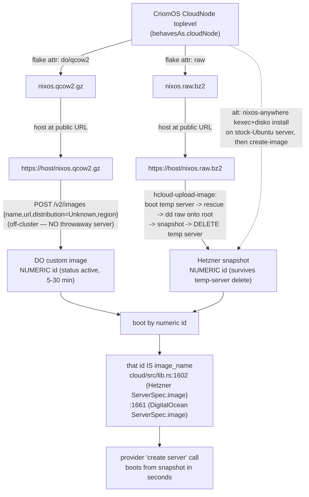

# 72 · Lane C — CriomOS CloudNode image build path (Spirit ad53, the unbuilt platform half)

## TL;DR

ad53 ("cloud-node OS images live in CriomOS as a `CloudNode`-species
profile mirroring `TestVm`; the daemon references only the built
snapshot id through the existing `image_name`") is recorded but its
**platform half is entirely unbuilt** — confirmed by report 68 lane 5
and re-confirmed here against source. The cloud daemon side is fully
plumbed (`image_name` reaches both adapters' `ServerSpec.image` at
`cloud/src/lib.rs:1602` Hetzner and `:1661` DigitalOcean); the missing
work is three small horizon-rs edits + one CriomOS gate module + one
**net-new** image-format flake attribute, none of which any cloud-repo
check touches.

Concrete spec:

1. **horizon-rs** — add `NodeSpecies::CloudNode`
   (`lib/src/species.rs:30`, after `TestVm`), a `cloud_node` arm in
   `TypeIs` (`lib/src/node.rs:173-201`), a `cloud_node` field in
   `BehavesAs` passed through in `derive` (`lib/src/node.rs:152-233`).
   This inherits `TestVm`'s leanness for free: set `cloud_node` and no
   heavy `type_is` flag, so edge/center/router/large_ai all derive false
   and their `mkIf`-gated module trees go inert.
2. **CriomOS** — a new gate module `modules/nixos/disks/cloud-node.nix`
   (the fourth disks-family member alongside `preinstalled` / `pod` /
   `liveiso`), `mkIf (behavesAs.cloudNode or false)`, imported from
   `criomos.nix:36-49`. Unlike `test-vm-guest.nix` (purely
   *suppressive*), this gate is *additive*: systemd-boot UEFI + mutable
   `/boot` + serial console + growpart + `services.cloud-init`. It does
   NOT need most of `test-substrate.nix` because it boots from a real
   provider disk, not a microVM host's volume.
3. **CriomOS** — a **new flake attribute** that wraps the CloudNode
   `system.build.toplevel` into a provider-format disk image (qcow2 for
   DigitalOcean URL upload, raw for Hetzner dd-into-rescue). This is the
   one piece the `TestVm` template gives **no precedent for** — `TestVm`
   boots as a microVM *guest*, never producing an uploadable disk.
4. **First-snapshot mint, per provider** — DigitalOcean `POST /v2/images`
   by URL (off-cluster, no throwaway server); Hetzner
   `hcloud-upload-image` (boot temp server into rescue, dd raw onto root,
   snapshot, delete) or `nixos-anywhere` then snapshot. Both then boot
   the resulting **numeric id**, which is what `image_name` carries.
5. **Where CI exercises it** — `CriomOS-test-cluster`, NOT the cloud repo.
   Add a `CloudNode` fixture node + a `cloud-node-toplevel` package +
   (optionally) a boot smoke check there, mirroring the `mercury-toplevel`
   / `vm-mercury` TestVm wiring. The cloud repo's checks are all
   `craneLib.cargo*` (Rust-only, `cloud/flake.nix:132-180`) and will
   never build a NixOS closure — that asymmetry is exactly why ad53's
   platform half stayed invisible.

The load-bearing distinction throughout: the cloud daemon **can** boot
any image id today (the value is already plumbed); what **does not exist
in production** is the CriomOS code that *produces* that id.

## 1 · The CloudNode species addition — mirroring TestVm

### 1.1 The three horizon-rs seams (the type lane)

`TestVm` is added through exactly three coordinated edits, fully
traceable; `CloudNode` slots into the identical seams.

**Seam 1 — the enum variant.** `lib/src/species.rs:13-31`:
`NodeSpecies` ends at `TestVm` (the tenth variant, with a doc comment).
Add an eleventh:

```rust
pub enum NodeSpecies {
    Center, LargeAi, LargeAiRouter, Hybrid, Edge, EdgeTesting,
    MediaBroadcast, Router, RouterTesting, TestVm,
    /// On-demand cloud compute node — a first-class cluster role whose
    /// substrate is a provider VM (Pod), distinct from TestVm (which runs
    /// on a co-host's KVM). A CloudNode derives a lean profile: it is a
    /// virtual_machine but NOT edge/center/router. The provider boots it
    /// from a baked snapshot; the daemon references that snapshot id.
    CloudNode,
}
```

The variant serializes as the bare PascalCase atom `CloudNode` per the
nota convention noted at `species.rs:1-5`.

**Seam 2 — `TypeIs::from_species`.** `lib/src/node.rs:171-201`. `TypeIs`
has one bool per species; `from_species` (`:187-200`) sets exactly the
matching one. Add a `cloud_node: bool` field and arm:

```rust
cloud_node: matches!(s, NodeSpecies::CloudNode),
```

**Seam 3 — `BehavesAs::derive`.** `lib/src/node.rs:152-233`. `BehavesAs`
(`:152-169`) carries the facets CriomOS gates on. `derive` (`:204-233`)
computes each. `test_vm` is a pure passthrough of `type_is.test_vm`
(`:220`). Add a `cloud_node: bool` field to `BehavesAs` and the same
passthrough:

```rust
let cloud_node = type_is.cloud_node;
// ... in the returned struct:
BehavesAs { center, router, edge, next_gen, low_power, bare_metal,
            virtual_machine, iso, large_ai, test_vm, cloud_node }
```

**The leanness mechanism comes free** (`node.rs:204-220`). `large_ai`,
`router`, `edge`, `center` all derive from `type_is` flags a `CloudNode`
does NOT set, so they stay false — exactly TestVm's leanness, verbatim.
`virtual_machine` derives `true` because the substrate is
`MachineSpecies::Pod` (`node.rs:212`) — a CloudNode IS a provider VM, so
it should declare `MachineSpecies::Pod` in its proposal. One subtlety:
`iso = !virtual_machine && io_disks_empty` (`node.rs:213`), so a
Pod-substrate CloudNode never accidentally derives `iso`.

`behaves_as` serializes camelCase (`node.rs:153`), so the new field
appears in the projected horizon JSON as `behavesAs.cloudNode` — the
exact key the CriomOS gate reads.

### 1.2 The CriomOS gate module (the render lane)

`criomos.nix:16-49` imports the disks family and the per-species gates.
`test-vm-guest.nix` is imported at `criomos.nix:44`; add the CloudNode
gate beside it (and/or in the disks family — it is a disk renderer):

```mermaid
flowchart TD
    subgraph horizon["horizon-rs (type lane — 3 edits)"]
        SP["species.rs:30<br/>+ NodeSpecies::CloudNode"]
        TI["node.rs:187-200<br/>TypeIs.cloud_node arm"]
        BA["node.rs:204-233<br/>BehavesAs.cloud_node passthrough"]
        SP --> TI --> BA
    end
    subgraph criomos["CriomOS (render lane — 1 import + 1 module)"]
        IMP["criomos.nix:44<br/>+ ./disks/cloud-node.nix"]
        GATE["cloud-node.nix<br/>mkIf (behavesAs.cloudNode or false)<br/>{ systemd-boot UEFI, mutable /boot,<br/>  console=ttyS0, growpart,<br/>  cloud-init, sshd, root deploy key }"]
        IMP --> GATE
    end
    subgraph build["NEW — net-new, no TestVm precedent"]
        GEN["flake attr: cloud-node image<br/>qcow2 (DO) / raw (Hetzner)"]
    end
    BA -. projects behavesAs.cloudNode .-> GATE
    GATE -. system.build.toplevel .-> GEN
    GEN -. upload -> numeric id .-> WIRE["image_name on the wire<br/>(cloud/src/lib.rs:1602 / :1661 — READY)"]
```

Note the gate differs from `test-vm-guest.nix` in *direction*:
`test-vm-guest.nix:45-53` is **purely suppressive** (forces docs off, a
lean win). The CloudNode gate is **additive** — it turns ON the
cloud-boot surface §2 lists. It is closer in spirit to `liveiso.nix`
(which adds `isoImage` config) than to the suppressive TestVm gate.

### 1.3 The image-format output (the net-new build leg)

This is the one leg with **no TestVm precedent** and where the real
design effort lands. CriomOS today has **no image-format output at all**:
grep across `flake.nix`, `modules/`, `checks/` finds no
`nixos-generators`, no `nixos-generate`, no `system.build.images`, no
`qcow`/`raw-efi`/`digital-ocean`/`hetzner` attribute (verified — only
`liveiso.nix:33` `isoImage` exists, and even *that* has no package output
wiring it into the flake; the ISO is built ad-hoc, not as a flake attr).

Two candidate shapes for the attribute (pin one):

- **`nixos-generators`** (numtide) — `nixosGenerate { format = "do";
  modules = [...]; }` for the DO qcow2.gz, `format = "raw"` /
  `"raw-efi"` for Hetzner. Requires adding `nixos-generators` as a flake
  input.
- **nixpkgs-native `system.build.images.<variant>`** /
  `nixos-rebuild build-image` (the 25.05+ path) — no extra input, but the
  variant attribute names shift across nixpkgs releases and I could NOT
  verify which the LiGoldragon nixpkgs fork exposes (the fork is not
  checked out under `/git/github.com/LiGoldragon/`; the flake pins
  `github:LiGoldragon/nixpkgs?ref=main`, `CriomOS/flake.nix:5`).

**UNVERIFIED — pin before implementing:** which image-format mechanism
the pinned nixpkgs fork supports, and the exact variant attribute names.
The design is mechanism-agnostic (it is one flake attribute consuming the
CloudNode `toplevel` either way), but the operator must confirm against
the live fork. Place the attribute where the test cluster can build it
(§4) — practically, a `packages.cloud-node-do-image` /
`cloud-node-hetzner-image` in `CriomOS-test-cluster/flake.nix` built from
a CloudNode fixture's `fixtureSystem`, since that is the flake that
already evaluates CriomOS into concrete toplevels.

## 2 · The minimal CloudNode profile — secret-free, like TestVm

The first cutover is **secret-free**, mirroring how `TestVm` deploys with
only the operator key and no sops material. The gate module
(`disks/cloud-node.nix`) carries:

**sshd + deploy/operator key in root authorized_keys.** Already mostly
free: `normalize.nix:171-176` sets `services.openssh.enable = true` with
`PasswordAuthentication = false`, and `users.nix:45-49` sets
`users.users.root.openssh.authorizedKeys.keys = adminSshPubKeys`
(projected from horizon). For a *first-cutover* secret-free image where
no cluster admin keys may be projected yet, the gate appends the deploy
key the way `test-substrate.nix:151-152` does:
`users.users.root.openssh.authorizedKeys.keys = mkAfter [ deployKey ]`.
Also reassert root has a real login shell — `test-substrate.nix:141`
sets `users.users.root.shell = "${pkgs.bashInteractive}/bin/bash"` and
`:133-138` restores NSS (`nscd` on, passwd/group/shadow pinned to
`files`) because `network/default.nix` disables nscd and sshd otherwise
rejects root as "invalid user." A CloudNode that boots headless and
accepts a deploy needs the same NSS + shell prebakes the substrate
already proved (`test-substrate.nix:130-141`).

**nix daemon + configured substituters (build-on-target).** Comes from
`nix/client.nix`: `nix.settings.substituters = cacheUrls`
(`client.nix:78`), `trusted-public-keys = trustedBuildPubKeys`
(`:77`), `trusted-binary-caches = cacheUrls` (`:79`), with
`experimental-features = nix-command flakes` (`:84`). These are projected
from `horizon.node.cacheUrls` / `horizon.cluster.trustedBuildPubKeys`, so
a CloudNode automatically gets the cluster's binary caches when its
horizon names them — build-on-target works with no gate-module edit. For
unsigned local closures during cutover, `test-substrate.nix:128` shows
the prebake: `nix.settings.require-sigs = mkForce false` (a substrate
property, not a daemon change).

**systemd-boot UEFI bootloader + mutable /boot.** `preinstalled.nix:40-46`
already renders the bootloader from `horizon.node.io.bootloader`:
`systemd-boot.enable = bootloader == "Uefi"` and
`efi.canTouchEfiVariables = bootloader == "Uefi"`. So a CloudNode whose
proposal sets `Bootloader::Uefi` (`species.rs:98-102`) gets systemd-boot
for free. The gate must ensure `/boot` is a **mutable** vfat ESP — the
provider-baked disk needs a writable ESP so `switch-to-configuration` can
write loader entries. `test-substrate.nix:185-196` shows the label
alignment the UEFI substrate uses (root ext4 label `nixos`, ESP vfat
label `ESP`); the CloudNode disko/image layout must produce the same so
systemd-boot finds the ESP. `canTouchEfiVariables = true` is correct on a
real provider VM with UEFI vars (unlike a hermetic test); confirm the
provider exposes writable EFI NVRAM, else fall back to a removable-media
install (`efiInstallAsRemovable`).

**Serial console + growpart + cloud-init (additive, gate-only).** Not in
any existing module — these are the CloudNode-specific additions:
`boot.kernelParams = mkAfter [ "console=ttyS0" ]` (the substrate already
uses this exact line, `test-substrate.nix:164`, for boot observability —
mandatory on a headless cloud VM); growpart/online root-FS resize so the
single baked image fits any provider disk size; `services.cloud-init`
(or DO's metadata fetch) for SSH-key injection + hostname on first boot.
DO custom images require cloud-init >=0.7.7, sshd at boot, ext3/ext4
(report 65 §3). **No GUI** — comes free from the leanness (no `edge`
facet -> no desktop/home tree).

**Secret-free, like TestVm.** No sops, no `secrets.nix` material in the
first image. The gate leans on the same secret-free posture
`test-vm-guest.nix` + `test-substrate.nix` use: keys-only sshd, one
deploy key, no encrypted cluster secrets. Cluster secrets arrive later
via a normal lojix deploy *into* the booted node, not baked into the
snapshot.

## 3 · First-snapshot mint, per provider



### 3.1 DigitalOcean — direct custom-image upload by URL (no throwaway)

DO has a **true custom-image upload API**, so the first mint needs **no
throwaway server** and happens entirely off-cluster:

1. Build the CloudNode qcow2.gz via the §1.3 flake attribute (DO format
   bundles cloud-init + growpart; report 65 §3).
2. Host it at a public URL.
3. `POST /v2/images` with `{name, url, distribution: Unknown, region}`
   (DO has no NixOS `distribution`; `Unknown` is community practice),
   or `doctl compute image create cloud-node --image-url
   https://host/nixos.qcow2.gz --region nyc1`. Formats raw/qcow2 accepted,
   <=100 GB uncompressed, requires cloud-init>=0.7.7 + sshd at boot +
   ext3/ext4.
4. Poll until status `active` (5-30 min); read the **numeric image id**.
5. That numeric id is what the daemon passes as `image_name` — landing at
   `cloud/src/digitalocean.rs:95` `pub image: String` via
   `cloud/src/lib.rs:1661` (`image: plan.image_name.as_str().to_owned()`).

### 3.2 Hetzner — snapshot-from-bootstrap (chicken-and-egg)

Hetzner Cloud has **no disk-image upload API**; the only way in is to
**snapshot a running server** (`POST /servers/{id}/actions/create_image`,
`type=snapshot`), which survives server deletion and is referenced by
numeric id. So the first mint **must bootstrap once**:

- **Option A — no install hop (`apricote/hcloud-upload-image`).** Build
  the CloudNode raw.bz2, host it, then `hcloud-upload-image upload
  --image-url https://host/nixos.raw.bz2 --architecture x86
  --compression bz2 --location nbg1`. The tool boots a temp server into
  rescue, `dd`s the raw image onto the root disk, snapshots, deletes the
  temp server — leaving a reusable snapshot id. Cleanest image-home ->
  snapshot path.
- **Option B — install hop (`nixos-anywhere`).** Create a stock-Ubuntu
  server, `nixos-anywhere --flake .#<cloud-node-host>` (kexec + disko
  partition + install), then `hcloud server create-image <id>
  --type snapshot`. Reuses the disko/`nixos-anywhere` path the Phase-2
  install fork already leans toward for first install.

Then routine spin-up is fast: `hcloud server create --image
<snapshot-id> --type cx22 --location nbg1` — the numeric snapshot id
lands at `cloud/src/hetzner.rs:82` via `cloud/src/lib.rs:1602`.

**Both providers converge on the same shape:** mint once -> a private
image referenced by **numeric id** -> that id is exactly what `image_name`
already carries end-to-end. **No wire change, no daemon code change** to
boot from a snapshot — confirmed: `image_name` reaches both adapters'
`ServerSpec.image` unchanged (report 68 §3-4; `lib.rs:1602`/`:1661`).

**UNVERIFIED — re-confirm before scripting:** exact `hcloud` /
`hcloud-upload-image` / `doctl` flag names and defaults against the
installed tool versions, and Hetzner's `create_image type=snapshot` JSON
field shapes against `docs.hetzner.cloud` (report 65 §3 flagged the
Hetzner OpenAPI page renders as a JS app; semantics came from the hcloud
Python client docs + secondary sources, not a live API call this session).

## 4 · Where this lands so cloud CI / CriomOS checks exercise it

Report 68 lane 5/7 pinned the core failure: **ad53's platform half lives
in two repos the cloud CI never touches.** Re-confirmed against source:

- The **cloud repo's checks are Rust-only.** `cloud/flake.nix:132-180`:
  every check is `craneLib.cargoBuild` / `cargoTest` / `cargoClippy` /
  `cargoFmt`. None evaluates a NixOS configuration; none references
  CriomOS or `horizon`. So a CloudNode image profile is **structurally
  invisible** to cloud CI — the cloud side compiles green forever whether
  or not CloudNode exists (report 68 §4 "tension: no compile-time or
  test-time link from the cloud daemon to the image profile").

- The CriomOS build/test that *does* evaluate node closures lives in
  **`CriomOS-test-cluster`**, not CriomOS itself. `CriomOS/flake.nix`
  exposes only `nixosConfigurations.target` (the network-neutral deploy
  surface) and policy `checks/` that eval *fragments* — there is no
  per-node toplevel or image output. `CriomOS-test-cluster/flake.nix`
  is where:
  - `fixtureSystem` (`:314-339`) builds a concrete CriomOS toplevel from
    a fixture horizon JSON with `deployment.includeHome = false`;
  - `mercury-toplevel` (`:413`) is the TestVm guest's lean toplevel and
    `atlas-toplevel` (`:419`) its host — the exact `packages` entries a
    CloudNode would mirror;
  - `mkVmTest` (`:70`, `lib/mkVmTest.nix`) auto-generates `vm-<node>`
    runNixOSTest checks from the host's hosted-Pod set (`:199-203`);
  - fixtures live in `fixtures/horizon/*.json` — `mercury.json` already
    carries `"species": "TestVm"` + `"testVm": true`.

**So the work lands in `CriomOS-test-cluster` to be exercised:**

1. **horizon-rs** — the three §1.1 edits. horizon-rs's own test suite
   (projection unit tests) covers the species/facet derivation; that is
   the type-lane CI.
2. **CriomOS** — the §1.2 gate module + the §1.3 image-format flake
   attribute. CriomOS's policy `checks/` can add a `cloud-node-role-policy`
   fragment check (mirroring `nix-role-policy` /
   `image-exchange-keys-scoped-to-co-hosts`, which assert projected facts
   produce the right config) to prove `behavesAs.cloudNode` yields
   systemd-boot + sshd + the deploy key.
3. **CriomOS-test-cluster** — add a `fixtures/horizon/<cloud-node>.json`
   with `"species": "CloudNode"`, a `cloud-node-toplevel` package via
   `fixtureSystem` (`:314`), and the §1.3 image attribute
   (`cloud-node-do-image` / `cloud-node-hetzner-image`) so CI **actually
   builds the provider image closure**. Optionally a boot smoke check
   (a runNixOSTest that boots the CloudNode toplevel and asserts sshd +
   root deploy key reachable) — note this is a *standalone* boot, not the
   `mkVmTest` host/guest shape (a CloudNode has no co-host; it boots
   directly on a provider VM), so it uses a plain `runNixOSTest` node
   rather than `mkVmTest`.

**The asymmetry to flag for the operator/psyche:** because the image
profile lives in CriomOS-test-cluster and the daemon lives in the cloud
repo with no cross-link, the two must be integrated by hand — a green
cloud CI proves nothing about whether a baked CloudNode image exists or
boots. The closing of that gap (a check that boots the *actual* CloudNode
image and feeds its id to a daemon dry-run) is a cross-repo integration
the existing CI structure does not provide and would need to be added
deliberately if end-to-end coverage is wanted.

## Open questions for the psyche / operator

1. **Image-format mechanism + nixpkgs fork support** — `nixos-generators`
   input vs nixpkgs-native `system.build.images`? Unverifiable this
   session (fork not checked out locally). Pin against the live
   `github:LiGoldragon/nixpkgs?ref=main`.
2. **Hetzner first-mint tool** — `hcloud-upload-image` (no install hop,
   cleanest) vs `nixos-anywhere` (install hop, reuses the disko path).
   Report 65 §4 left this as the live sub-choice; still open.
3. **Default architecture** — x86_64 vs ARM. One closure per arch
   (horizon-rs enforces `HostSetArchMismatch`, `node.rs:685-714`).
   Report 65 leaned ARM/CAX11; not captured in Spirit.
4. **Boot-coverage depth** — policy-fragment check only (cheap, proves
   config), or a full runNixOSTest boot smoke (proves it boots), or a
   cross-repo daemon-dry-run integration (proves end-to-end)? The CI
   structure supports the first two cheaply; the third is net-new.
