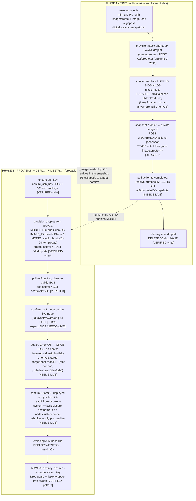

# 5 · The CriomOS-on-DigitalOcean deploy recipe — synthesis

cloud-designer, 2026-06-20. Reconciles Lane A (image-mint path),
Lane B (DO boot-mode reality), Lane C (minimal provable deploy), and
Lane D (re-usable harness) into one ordered, reproducible recipe plus the
test-harness that wraps it. Every load-bearing fact carries a `file:line`
or URL; each recipe step is tagged **[VERIFIED]** (source-confirmed this
session) or **[NEEDS-LIVE]** (inferred / blocked, must be confirmed on a
live run).

## The one reconciled truth the four lanes converge on

Three facts, each independently confirmed this session, fully determine
the recipe:

1. **DO droplets boot legacy BIOS/GRUB, never UEFI, and a custom image
   cannot change that** — DO docs: *"UEFI boot is not supported. Custom
   images must boot using BIOS"* ([DO custom-image limits][do-limits]).
   **Consequence:** lojix's `bootctl`/`BootOnce` activation is structurally
   impossible on DO this week (`lojix/src/schema_runtime.rs:3616-3689`);
   the deploy must be GRUB-BIOS activated via bootloader-agnostic
   `switch-to-configuration switch`. (Lane B)
2. **CriomOS already renders a GRUB/MBR node** — the gate is
   `CriomOS/modules/nixos/disks/preinstalled.nix:41`:
   `grub.enable = bootloader == "Mbr"`. So the DO node's horizon must
   project `io.bootloader = Mbr`, NOT `Uefi`. **But that block sets no
   `grub.devices`** (verified: `preinstalled.nix:37-46` enables grub and
   never names the install disk), so a Mbr horizon needs
   `boot.loader.grub.devices = [ "/dev/vda" ]` supplied by the horizon or
   a one-line gate module, or GRUB install fails at activation. (Lane C +
   this session)
3. **The mint side needs a token-scope fix and a daemon REST extension.**
   The live token at `gopass digitalocean.com/api-token` can
   create/delete droplets and ssh keys but **every image-minting call
   returns 403 `missing the required permission image:create`** — including
   the droplet *snapshot* action (Lane A, live-probed). And the cloud
   daemon's `digitalocean.rs` has **no snapshot / `/actions` / `/v2/images`
   surface at all** (verified this session: only `/v2/droplets` and
   `/v2/account/keys` are hit; `grep` for snapshot/actions/images →
   nothing). So minting a *reusable pre-made image* is gated on (a) a
   write-scoped token and (b) new daemon code.

The honest split that falls out: **deploy-from-stock-image + activate via
nixos-rebuild is provable live THIS WEEK with the current token and zero
new daemon code; minting the reusable CriomOS golden image is a
separate, multi-session task** behind the token-scope fix and the daemon
REST extension.

## The flow



Two deploy substrates the same Phase 2 supports (Lane C + Lane D):

- **Image-as-deploy (MODE 1, the eventual goal):** the pre-made snapshot
  *is* CriomOS; P5 collapses from a `nixos-rebuild switch` into a pure
  boot-and-confirm (the OS arrived in the image). Needs Phase 1 done.
- **Boot-then-activate (MODE 2, runnable today):** boot a stock
  `ubuntu-24-04-x64` (or a plain NixOS) droplet and push CriomOS with
  `nixos-rebuild switch --target-host`. Proves the full deploy spine
  without any minted image. This is the week-one provable slice.

## Part 1 — THE recipe (ordered command sequence)

Token is read into a shell var and **never echoed**. `curl` hits the exact
REST paths the daemon's in-process `HttpApi` uses
(`cloud/src/digitalocean.rs`); in the harness these are
`HttpApi::ensure_ssh_key`/`create_server`/`get_server`/`delete_server`
calls, not curl — curl here is only the human-readable equivalent.

### Phase 0 — token + auth (once)

```bash
# [VERIFIED] handle exists; scope is read+droplet/ssh-write but NOT image:create.
TOKEN=$(gopass show -o digitalocean.com/api-token)   # NEVER print it
API=https://api.digitalocean.com/v2
auth=(-H "Authorization: Bearer $TOKEN" -H "Content-Type: application/json")
```

### Phase 1 — MINT the reusable CriomOS image (multi-session, blocked today)

```bash
# *** PRECONDITION (BLOCKED): mint a DO Personal Access Token carrying
#     image:create + image:read and re-store at the SAME gopass handle.
#     Without it every step below 403s at the snapshot action. ***  [Lane A, live-probed]

# 1.1 [VERIFIED-write] ssh key DO can inject (422 on empty body == write OK).
PUBKEY=$(cat ~/.ssh/id_ed25519.pub)
FINGERPRINT=$(curl -fsS "${auth[@]}" -X POST "$API/account/keys" \
  -d "{\"name\":\"criomos-mint\",\"public_key\":\"$PUBKEY\"}" \
  | python3 -c 'import sys,json;print(json.load(sys.stdin)["ssh_key"]["fingerprint"])')

# 1.2 [VERIFIED-write] stock Ubuntu droplet (ubuntu-24-04-x64 present in account).
DROPLET_ID=$(curl -fsS "${auth[@]}" -X POST "$API/droplets" -d '{
  "name":"criomos-mint","region":"nyc3","size":"s-2vcpu-2gb",
  "image":"ubuntu-24-04-x64","ssh_keys":["'$FINGERPRINT'"],"ipv6":true,"monitoring":true
}' | python3 -c 'import sys,json;print(json.load(sys.stdin)["droplet"]["id"])')

# 1.3 [VERIFIED] poll to active + public IPv4 (same loop as Tier-1).
until IP=$(curl -fsS "${auth[@]}" "$API/droplets/$DROPLET_ID" \
  | python3 -c 'import sys,json;d=json.load(sys.stdin)["droplet"];
import sys
nets=[n["ip_address"] for n in d["networks"]["v4"] if n["type"]=="public"]
print(nets[0] if d["status"]=="active" and nets else "")'); [ -n "$IP" ]; do sleep 10; done

# 1.4 [NEEDS-LIVE] convert in place to GRUB-BIOS NixOS (the only impurity).
#     PROVIDER=digitalocean wires grub on /dev/vda + DHCP. Confirm the precise
#     NIX_CHANNEL that builds clean on the live droplet (nixos-25.05 = 2025/26 stable).
ssh -o StrictHostKeyChecking=accept-new root@$IP \
  'curl -fsSL https://raw.githubusercontent.com/elitak/nixos-infect/master/nixos-infect \
   | NIX_CHANNEL=nixos-25.05 PROVIDER=digitalocean bash -x'
until ssh -o StrictHostKeyChecking=accept-new -o ConnectTimeout=5 root@$IP nixos-version; do sleep 10; done
#     Lane 3 fidelity variant (full CriomOS, needs disko + droplet >=2.5GB RAM):
#     nix run github:nix-community/nixos-anywhere -- --flake .#target --target-host root@$IP

# 1.5 [BLOCKED -> NEEDS-LIVE after scope fix] snapshot -> reusable private image.
ACTION_ID=$(curl -fsS "${auth[@]}" -X POST "$API/droplets/$DROPLET_ID/actions" \
  -d '{"type":"snapshot","name":"criomos-base-2026-06-20"}' \
  | python3 -c 'import sys,json;print(json.load(sys.stdin)["action"]["id"])')   # *** 403 today ***

# 1.6 [NEEDS-LIVE] poll the snapshot action to completion (minutes).
until [ "$(curl -fsS "${auth[@]}" "$API/droplets/$DROPLET_ID/actions/$ACTION_ID" \
  | python3 -c 'import sys,json;print(json.load(sys.stdin)["action"]["status"])')" = completed ]; do sleep 15; done

# 1.7 [NEEDS-LIVE] resolve the minted numeric IMAGE_ID (the pre-made image).
IMAGE_ID=$(curl -fsS "${auth[@]}" "$API/droplets/$DROPLET_ID/snapshots" \
  | python3 -c 'import sys,json;print(json.load(sys.stdin)["snapshots"][0]["id"])')
echo "CriomOS golden image id: $IMAGE_ID  (home region: nyc3)"

# 1.8 [VERIFIED-write] tear down the mint droplet (404 == already gone == OK).
curl -fsS "${auth[@]}" -X DELETE "$API/droplets/$DROPLET_ID"
```

### Phase 2 — PROVISION → DEPLOY → CONFIRM → DESTROY (provable this week)

`IMAGE` is the numeric `$IMAGE_ID` from Phase 1 (**MODE 1**, image-as-deploy)
or `ubuntu-24-04-x64` / a plain NixOS slug (**MODE 2**, boot-then-activate,
runnable today). `REGION` **must** equal the image's home region in MODE 1
([DO docs][do-create]: *"You can only create Droplets in the same region as
your custom image."*).

```bash
IMAGE=${CRIOMOS_IMAGE:-ubuntu-24-04-x64}   # numeric id => MODE1, slug => MODE2
REGION=${DO_REGION:-nyc3}                   # MODE1: must match IMAGE home region
SIZE=${DO_SIZE:-s-2vcpu-2gb}

# 2.1 [VERIFIED-write] ensure ssh key (prefix-named for the sweep).
FINGERPRINT=$(curl -fsS "${auth[@]}" -X POST "$API/account/keys" \
  -d "{\"name\":\"criome-deploy-test\",\"public_key\":\"$(cat ~/.ssh/id_ed25519.pub)\"}" \
  | python3 -c 'import sys,json;print(json.load(sys.stdin)["ssh_key"]["fingerprint"])')

# 2.2 [VERIFIED-write] provision droplet FROM IMAGE.
DROPLET_ID=$(curl -fsS "${auth[@]}" -X POST "$API/droplets" -d '{
  "name":"criome-deploy-test","region":"'$REGION'","size":"'$SIZE'",
  "image":"'$IMAGE'","ssh_keys":["'$FINGERPRINT'"],"ipv6":true,"monitoring":true
}' | python3 -c 'import sys,json;print(json.load(sys.stdin)["droplet"]["id"])')

# 2.3 [VERIFIED] poll to Running, capture public IPv4 (same loop as 1.3).
until IP=$(curl -fsS "${auth[@]}" "$API/droplets/$DROPLET_ID" \
  | python3 -c 'import sys,json;d=json.load(sys.stdin)["droplet"];
import sys
nets=[n["ip_address"] for n in d["networks"]["v4"] if n["type"]=="public"]
print(nets[0] if d["status"]=="active" and nets else "")'); [ -n "$IP" ]; do sleep 10; done

# 2.4 [NEEDS-LIVE] confirm the node is BIOS (chooses the activation path).
ssh -o StrictHostKeyChecking=accept-new root@$IP \
  '[ -d /sys/firmware/efi ] && echo UEFI || echo BIOS; efibootmgr 2>&1 | head -1'   # expect BIOS

# 2.5 DEPLOY CriomOS.
#  MODE 1 (image-as-deploy): the snapshot IS CriomOS -> no push; deploy == the boot.
#  MODE 2 (boot-then-activate) [NEEDS-LIVE]: push CriomOS#target, Mbr horizon, GRUB on /dev/vda.
#  Bootloader-agnostic: switch-to-configuration switch, NO bootctl (Lane B/C).
nixos-rebuild switch \
  --flake /git/github.com/LiGoldragon/CriomOS#target \
  --target-host root@$IP \
  --override-input system     path:/git/github.com/LiGoldragon/CriomOS/stubs/no-system \
  --override-input horizon    path:<do-node-horizon-flake> \
  --override-input deployment path:/git/github.com/LiGoldragon/CriomOS/stubs/default-deployment \
  --override-input secrets    path:/git/github.com/LiGoldragon/CriomOS/stubs/no-secrets
#  Robust fallback if --override-input does not forward on the nixpkgs fork:
#  pin a tiny content-addressed do-deploy flake whose #target is fully resolved
#  (Mbr horizon + boot.loader.grub.devices=[/dev/vda] gate), then:
#  nixos-rebuild switch --flake <do-deploy-flake>#target --target-host root@$IP

# 2.6 [NEEDS-LIVE] CONFIRM "CriomOS deployed" (not merely "NixOS reachable").
ssh root@$IP 'readlink /run/current-system'                 # == the closure nixos-rebuild built
ssh root@$IP 'hostname -f'                                   # == <node>.<cluster>.criome (horizon)
ssh root@$IP 'cat /run/current-system/nixos-version'        # carries the CriomOS toplevel label
ssh root@$IP 'systemctl is-active sshd && grep -c "PasswordAuthentication no" /etc/ssh/sshd_config'

# 2.7 witness line (grep target for the parent agent / CI-adjacent assertion).
echo "DEPLOY WITNESS droplet_id=$DROPLET_ID ipv4=$IP region=$REGION image=$IMAGE deploy=<criomos-confirmed|ssh-reachable> result=OK"

# 2.8 [VERIFIED-write] ALWAYS DESTROY (dns record -> droplet -> ssh key; 404 == OK).
curl -fsS "${auth[@]}" -X DELETE "$API/droplets/$DROPLET_ID"
curl -fsS "${auth[@]}" -X DELETE "$API/account/keys/$FINGERPRINT"
```

### The load-bearing gap on the deploy side (must be closed in `<do-node-horizon-flake>`)

`preinstalled.nix:41` turns GRUB *on* for an Mbr horizon but the block
(`:37-46`, read this session) sets **no `boot.loader.grub.devices`**. A BIOS
GRUB install with no device fails activation. The DO horizon (or a 1-line
gate module imported by the throwaway `do-deploy` flake) MUST add
`boot.loader.grub.devices = [ "/dev/vda" ]` (DO virtio disk; matches the
canonical nixpkgs [digital-ocean-config.nix][do-config]). The same gate
supplies the headless-cloud prebakes Lane C named (nscd/passwd files, root
shell, `console=ttyS0`, growpart). This gate is the embryo of the real
`modules/nixos/disks/cloud-node.nix`.

## Part 2 — the re-usable harness (Lane D, locked)

**Home:** a new `cloud/tests/digitalocean_deploy_live.rs` integration test
plus a sibling flake app `apps.digitalocean-deploy-live-test`, extending the
proven Tier-1 lifecycle pattern (`cloud/tests/digitalocean_live.rs` —
verified this session: `#[ignore]` at `:28`, `LiveCleanup` Drop guard at
`:215-216`, `criome-live-test-<pid>-<ts>` naming at `:147`). It drives the
**in-process `digitalocean::HttpApi`** (the production adapter), never
doctl (not installed). Rejected: a standalone shell app — it would
re-roll a second divergent REST client in bash with no typed cleanup.

**Parametrization** — env vars, each with a `digitalocean` module-const
default so an unset run still does something cheap and safe:

| Env var | Default | Meaning |
|---|---|---|
| `DIGITALOCEAN_ACCESS_TOKEN` | gopass `digitalocean.com/api-token` | required; flake wrapper injects, never echoes |
| `CRIOMOS_IMAGE` | `DEFAULT_IMAGE` (`ubuntu-24-04-x64`) | numeric snapshot id ⇒ MODE 1; slug ⇒ MODE 2 |
| `DO_REGION` | `DEFAULT_REGION` (`nyc1`) | MODE 1: must match image home region |
| `DO_SIZE` | `DEFAULT_SIZE` (`s-1vcpu-512mb-10gb`, sub-cent/run) | droplet size slug |
| `DEPLOY_DNS_DOMAIN` | unset | if set, publish A record via cloudflare adapter, delete on teardown |
| `DEPLOY_SSH_CONFIRM` | `1` | `1` = ssh + read OS marker; `0` = Running+IPv4 only |
| `CRIOMOS_MARKER` | a sensible `/etc/os-release` NixOS line | the string the confirm greps |
| `DEPLOY_POLL_SECONDS` / `_ATTEMPTS` | `5` / `36` (3 min) | poll budget to Running |
| `DEPLOY_SSH_ATTEMPTS` | `30` | ssh-reachability retries |

**Always-destroy** — two layers:
1. **Primary: Rust `Drop` guard** `DeployCleanup` generalizing
   `LiveCleanup` (`digitalocean_live.rs:215`). Holds each created resource
   as `Option<typed-id>` (droplet `HostIdentifier`, ssh fingerprint,
   optional cloudflare `(ZoneIdentifier, RecordIdentifier)`); each teardown
   `take()`s, deletes, and re-stores on failure so `Drop` retries. Fires on
   success, `assert!` failure, `?` early-return, and panic-unwind. DNS
   record deleted **before** the droplet so no A record outlives its target.
2. **Secondary: shell `trap sweep EXIT`** in the flake wrapper — a
   prefix-named (`criome-deploy-test-`) curl sweep of `/v2/droplets` that
   catches a `kill -9` before `Drop` runs. Idempotent; 404 == success
   (`digitalocean.rs:197` already treats 404-on-delete as Ok).

**Witness** — one machine-greppable line:
`DEPLOY WITNESS droplet_id=<id> ipv4=<a.b.c.d> region=<r> image=<image> dns=<fqdn|none> deploy=<criomos-confirmed|ssh-reachable|running-only> result=OK`.
The `deploy=` field is the honest confirm level.

**Opt-in gating (CI never spends money)** — three established gates:
`#[ignore]` on the fn; `#![cfg(feature = "digitalocean")]` so it isn't
compiled into the default binary; and a `nix flake check` entry that runs
`--ignored --list` only (compiles + lists, never executes), mirroring
`cloud/flake.nix:155`.

Full Rust + Nix skeletons are in Lane D's report
(`4-harness-shape.md` §"File skeleton" / §"Flake-app skeleton"); they land
verbatim with the free-function placeholders (`poll_until_running`,
`confirm_deploy`) reshaped into methods on data-bearing types
(`DropletPoll`, `DeployConfirmation`) per workspace Rust discipline.

## Part 3 — honest scope for one work session

| Slice | Status | Why |
|---|---|---|
| Provision droplet from a stock image, poll to Running, observe IPv4, destroy | **Provable today** | Tier-1 already proves this green (report 64); write scope confirmed live |
| Land the `digitalocean_deploy_live.rs` harness + flake app (compiles, `nix flake check` green, MODE 2 ssh-reachable confirm) | **Provable this week** | Pure extension of the proven Tier-1; no token-scope change, no new daemon REST |
| MODE 2 deploy: `nixos-rebuild switch --target-host` CriomOS#target onto a NixOS droplet, GRUB-BIOS | **Provable this week, gated on the horizon gap** | needs the `do-node-horizon-flake` with `bootloader=Mbr` + `grub.devices=[/dev/vda]` + headless prebakes; once that flake exists the activation itself is bootloader-agnostic and bypasses lojix's UEFI assumption |
| MODE 1: boot from a *reusable pre-made CriomOS image* and confirm | **Multi-session** | blocked on the token-scope fix (image:create) AND a new daemon snapshot/`/actions`/`/v2/images` REST surface |
| Full lojix `Deploy … BootOnce` (headless rollback) on DO | **Deferred indefinitely on DO** | DO is BIOS-only by policy; `bootctl`/systemd-boot cannot run. Either teach lojix a GRUB rollback path, or prove `BootOnce` on a UEFI provider (Hetzner) — DO covers GRUB-BIOS `Switch`, Hetzner covers UEFI `BootOnce` |

The defensible one-session claim: **"CriomOS is deployed and confirmed on a
live DigitalOcean droplet via the cloud daemon's own HttpApi, then fully
destroyed,"** via MODE 2 (boot a NixOS droplet, push CriomOS#target with an
Mbr horizon, confirm the running closure is CriomOS, destroy). It does NOT
claim a reusable pre-made image (Phase 1) nor lojix-managed activation.

## Part 4 — the single recommended FIRST live action

**Land and run the harness in MODE 2 against a stock droplet — TODAY,
before any token or image work.**

```bash
cd /git/github.com/LiGoldragon/cloud
export DIGITALOCEAN_ACCESS_TOKEN=$(gopass show -o digitalocean.com/api-token)
nix run .#digitalocean-deploy-live-test     # MODE 2: stock image, ssh-reachable confirm, always destroy
```

Why this first, not the token-scope fix:

- It runs **green on the current token** (create/poll/destroy scope is
  live-confirmed; MODE 2 needs no `image:create`).
- It exercises the **exact production adapter** (`HttpApi`) and the
  **always-destroy guarantee** end-to-end, de-risking the harness itself
  before any money-spending mint work.
- It produces the **`DEPLOY WITNESS` line** — the concrete proof artifact —
  and validates the whole provision→observe→confirm→destroy spine.
- The two genuinely blocking, slower tracks (mint a write-scoped DO PAT;
  add the daemon's snapshot/`/actions`/`/v2/images` REST surface) then
  proceed in parallel against a harness already known to work, and MODE 1
  flips on automatically the moment `CRIOMOS_IMAGE` is set.

[do-limits]: https://docs.digitalocean.com/products/custom-images/details/limits/
[do-create]: https://docs.digitalocean.com/products/custom-images/how-to/create-droplets/
[do-config]: https://github.com/NixOS/nixpkgs/blob/master/nixos/modules/virtualisation/digital-ocean-config.nix
