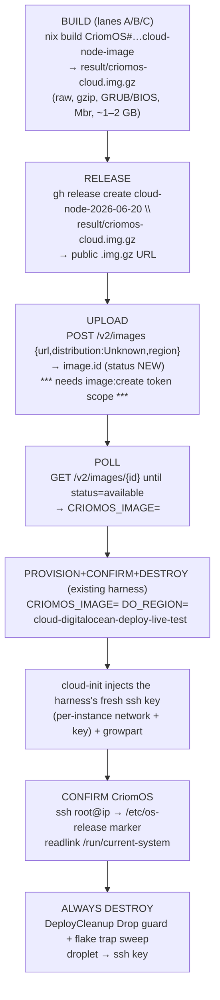

# 74/4 — Lane D · end-to-end: build → UPLOAD → provision → confirm → destroy

cloud-designer, 2026-06-20. Resolves the **upload mechanism** for the new
MINIMAL declarative CriomOS cloud-node image (~1–2 GB content-sized, NOT a
60 GB converted-droplet snapshot) and wires it into one ordered, reproducible
end-to-end sequence: build the image → upload it to DigitalOcean → resolve the
numeric image id → run the existing deploy harness with `CRIOMOS_IMAGE=<id>` →
cloud-init injects the fresh ssh key → confirm CriomOS is running → destroy.

Every load-bearing fact carries a `file:line` or a URL. Steps are tagged
**[VERIFIED]** (source/code-confirmed this session) or **[NEEDS-LIVE]**
(inferred / blocked, must be confirmed on a live run). The image-build leg
(the raw-format flake attribute, the `CloudNode` species/module) is lanes
A/B/C's scope; this report consumes their artifact and owns everything from
the built image file onward.

## The pivot the minimal image unlocks

Report 73's mint path was **snapshot-based**: boot a stock droplet, infect it
to NixOS, `POST /v2/droplets/{id}/actions {snapshot}`, destroy the droplet
(`73/5-recipe.md:144-159`). That produces a ~60 GB disk-sized snapshot and is
blocked on the `image:create` token scope (`73/6-built-and-tested.md` TL;DR:
*"the live DigitalOcean token lacks the `image:create` scope, so
minting/snapshotting an image `403`s"*).

The Spirit-2u57 directive replaces that with a **declaratively-built,
content-sized raw image** (~1–2 GB), and a small raw image makes the
**custom-image-by-URL** import viable: `POST /v2/images` with a `url`
field pointing at a publicly-fetchable raw/qcow2 file
([DO upload how-to][do-upload]; [DO images API][do-images-api]). This is
cleaner than the snapshot path in three ways: (1) no throwaway droplet, no
in-place infect; (2) the bytes are the exact CriomOS closure, reproducible
from the flake; (3) the upload is a single REST call, not a poll over a
droplet action. **It does still need the same `image:create` token scope** —
custom-image creation is an `image:create` operation just like snapshotting —
so the one psyche-only precondition from report 73 (re-mint the DO PAT with
`image:create`) carries over unchanged.

## 1 · The upload mechanism — RESOLVED

### DO custom-image-by-URL constraints (verified this session)

| Constraint | Value | Source |
|---|---|---|
| Accepted formats | raw (`.img`, MBR **or** GPT), qcow2, VHDX, VDI, VMDK | [DO upload how-to][do-upload] |
| Compression | gzip **or** bzip2 accepted | [DO upload how-to][do-upload] |
| Max size | ≤ 100 GB **uncompressed**, including filesystem | [DO upload how-to][do-upload] |
| Boot firmware | **BIOS only — UEFI custom images forbidden** | [DO custom-image limits][do-limits] (and `73/2-do-boot-mode.md:67-72`) |
| URL must | end in the file extension (e.g. `…/criomos-cloud.img.gz`, not `…?dl=0`) | [DO upload how-to][do-upload] |
| URL must | be publicly fetchable AND the host must answer **HEAD** requests | [DO upload how-to][do-upload] |
| Region | image lands in **one** datacenter (the `region` field); transfer to others later | [DO upload how-to][do-upload]; [DO add-regions][do-regions] |

The CriomOS cloud-node image is `raw` (`.img`), gzipped to `.img.gz`, BIOS/GRUB
(`Bootloader::Mbr`, `species.rs:100`), well under the 100 GB ceiling. All
constraints are satisfied by construction.

### Where to host the URL — three options compared

DO fetches the URL **server-side**, so the file must stay publicly reachable
for the whole import (minutes), the resolved URL should end in the extension,
and the host must answer HEAD.

**(a) GitHub release asset on a LiGoldragon repo — RECOMMENDED, with one
caveat handled.** Public, reproducible, no extra credentials, version-pinned
to a tag. Probed live this session: a `github.com/<owner>/<repo>/releases/
download/<tag>/<file>` URL **302-redirects** to
`release-assets.githubusercontent.com/...` with a **signed, ~1-hour-expiring**
query string whose tail is signature params, **not** `.img.gz` (verified:
`curl -sS -I` on a real release asset returned `HTTP/2 302` →
`location: https://release-assets.githubusercontent.com/...&se=<expiry>...`).
Two consequences:
  - DO follows the redirect server-side, and the backing store
    (`release-assets.githubusercontent.com`, Azure-blob-backed) **does**
    support HEAD and range requests — so the import itself works.
  - But the *resolved* URL doesn't end in `.img.gz`, and the signature
    **expires in ~1 hour**. For an import that completes well inside that
    window this is fine; if an import ever stalls past the signature
    expiry it fails. **Mitigation:** pass the stable
    `github.com/.../releases/download/<tag>/criomos-cloud.img.gz` URL (which
    *does* end in the extension and re-issues a fresh signed redirect on each
    fetch); DO re-resolves on fetch. This is the cleanest reproducible host.

**(b) DO Spaces — REJECTED for the default path.** A Spaces bucket gives a
clean stable `https://<bucket>.<region>.digitaloceanspaces.com/criomos-cloud.img.gz`
URL that ends in the extension and supports HEAD, and it's same-provider (fast
intra-DC fetch). But it needs **Spaces access keys** (a separate credential
pair beyond the API token), which is exactly the credential-sprawl the
workspace avoids; and the bucket is mutable, un-pinned state. Keep it as the
**fallback** when (a)'s redirect/expiry ever bites, or for images too large to
attach to a GitHub release (release assets cap at 2 GB each — our ~1–2 GB image
fits, but a margin-thin one argues for Spaces).

**(c) Temporary host (ngrok / `python -m http.server` over a tunnel) —
REJECTED.** Non-reproducible, ephemeral, no HEAD guarantees, and a live tunnel
is operational state that outlives no record. Only acceptable as a one-off
manual debug, never the recipe.

**Decision: GitHub release asset on a LiGoldragon repo is the default; DO
Spaces is the documented fallback.** Both end in `.img.gz`, both answer HEAD,
both are reproducible from a tag/object key. The temporary host is out.

### The exact `POST /v2/images` call

`distribution` should be `Unknown` (NixOS is not in DO's closed distribution
list — the accepted set is Arch/CentOS/CoreOS/Debian/Fedora/FreeBSD/Gentoo/
openSUSE/RancherOS/Rocky/Ubuntu/Unknown, [DO images API][do-images-api]).
`region` is the home datacenter; the deploy must later create the droplet in
the **same** region (DO: *"You can only create Droplets in the same region as
your custom image"*, `73/5-recipe.md:166-168`).

```bash
TOKEN=$(gopass show -o digitalocean.com/api-token)   # NEVER echo it
API=https://api.digitalocean.com/v2
auth=(-H "Authorization: Bearer $TOKEN" -H "Content-Type: application/json")

REGION=nyc3                                            # image home region
RELEASE_TAG=cloud-node-2026-06-20                      # the LiGoldragon release tag
IMAGE_URL=https://github.com/LiGoldragon/CriomOS/releases/download/$RELEASE_TAG/criomos-cloud.img.gz

# 1. create the custom image from the public URL (needs image:create scope).
IMAGE_ID=$(curl -fsS "${auth[@]}" -X POST "$API/images" -d "{
  \"name\":\"criomos-cloud-$RELEASE_TAG\",
  \"url\":\"$IMAGE_URL\",
  \"distribution\":\"Unknown\",
  \"region\":\"$REGION\",
  \"description\":\"CriomOS cloud-node, declarative raw image, GRUB/BIOS\",
  \"tags\":[\"criomos\",\"cloud-node\"]
}" | python3 -c 'import sys,json;print(json.load(sys.stdin)["image"]["id"])')
echo "custom image id: $IMAGE_ID  (status begins NEW)"
```

The response carries `image.id` (a numeric integer) and `image.status`, which
**begins `NEW`** and transitions to `available` when the import finishes
([DO images API][do-images-api]: status ∈ `NEW`/`available`/`pending`/
`deleted`/`retired`).

### Poll until `available`

```bash
# 2. poll GET /v2/images/{id} until status == available (import takes minutes).
until [ "$(curl -fsS "${auth[@]}" "$API/images/$IMAGE_ID" \
  | python3 -c 'import sys,json;print(json.load(sys.stdin)["image"]["status"])')" = available ]; do
  echo "image $IMAGE_ID still importing…"; sleep 20
done
echo "CRIOMOS_IMAGE=$IMAGE_ID  (region $REGION, status available)"
```

### (Optional) transfer to additional regions

A custom image is single-region at creation; to deploy in another datacenter,
transfer first ([DO add-regions][do-regions]):

```bash
# POST /v2/images/{id}/actions {transfer} — only if a second region is needed.
curl -fsS "${auth[@]}" -X POST "$API/images/$IMAGE_ID/actions" \
  -d '{"type":"transfer","region":"nyc2"}'
```

## 2 · The full end-to-end sequence



### Step-by-step

**Step 0 — token precondition [BLOCKED until psyche acts].** Re-mint the DO PAT
with **`image:create`** (full scope is simplest) and re-store at the same
handle `gopass digitalocean.com/api-token`. Without it the `POST /v2/images`
in §1 returns `403 missing the required permission image:create` — the same
gate report 73 hit on the snapshot action (`73/5-recipe.md:144-147`,
`73/6-built-and-tested.md` TL;DR). Droplet create/poll/destroy and ssh-key
write already work on the current token (live-proven: droplet `578965503`,
`73/6-built-and-tested.md`).

**Step 1 — BUILD the image [NEEDS-LIVE; lanes A/B/C own the attribute].**
```bash
cd /git/github.com/LiGoldragon/CriomOS
nix build .#cloud-node-image     # the new raw-format flake attribute (report 65 §3)
# → result/criomos-cloud.img.gz : raw, gzipped, GRUB/BIOS, Mbr, ~1–2 GB
```
The system *definition* is the `CloudNode` species + `cloud-node.nix` module
(`65-cloud-node-image-home.md:60-72`); the **image-format wrapper** (raw + gzip)
is "a *new* flake attribute" (`65-cloud-node-image-home.md:69-72`). It MUST set
`boot.loader.grub.devices = [ "/dev/vda" ]` — `preinstalled.nix:41` enables GRUB
for an `Mbr` bootloader but the block (`:37-46`) names no device, so a BIOS GRUB
install fails activation without it (`73/5-recipe.md:227-237`). The image must
bake cloud-init (per-instance network + ssh-key injection) and growpart
(`65-cloud-node-image-home.md:60-67`; `73/2`-recommended BIOS/GRUB shape).

**Step 2 — RELEASE the artifact [NEEDS-LIVE].**
```bash
gh release create cloud-node-2026-06-20 \
  result/criomos-cloud.img.gz \
  --repo LiGoldragon/CriomOS \
  --title 'CriomOS cloud-node image 2026-06-20' \
  --notes 'Declarative raw GRUB/BIOS cloud-node image for DigitalOcean custom-image import.'
# public URL: https://github.com/LiGoldragon/CriomOS/releases/download/cloud-node-2026-06-20/criomos-cloud.img.gz
```
(`gh` resolves `result/` symlink to the real store path on upload.)

**Step 3 — UPLOAD + POLL [NEEDS-LIVE, gated on Step 0].** The exact
`POST /v2/images` + poll-until-`available` from §1. Yields `CRIOMOS_IMAGE` (a
numeric id) and the home `REGION`.

**Step 4 — PROVISION + CONFIRM + DESTROY [harness EXISTS; runs green in mode 2
today, flips to mode 1 with `CRIOMOS_IMAGE` set].**
```bash
cd /git/github.com/LiGoldragon/cloud
export DIGITALOCEAN_ACCESS_TOKEN=$(gopass show -o digitalocean.com/api-token)
CRIOMOS_IMAGE=$IMAGE_ID DO_REGION=$REGION \
  CRIOMOS_MARKER='ID=nixos' \
  nix run .#digitalocean-deploy-live-test
```
This is the harness already on branch `cloud-designer-do-deploy-test`
(`tests/digitalocean_deploy_live.rs`, `flake.nix`
`apps.digitalocean-deploy-live-test`). A **numeric** `CRIOMOS_IMAGE` is
recognized as mode 1 (pre-made custom image) by `DeployParameters::is_custom_image`
(the image string being all-ASCII-digits, per the harness's `is_custom_image`
predicate); a slug stays mode 2. Internally it:
  1. mints a throwaway ed25519 key (`TemporarySshKey`) — the **fresh key** —
     and `ensure_ssh_key`s it onto the account;
  2. `create_server` from the custom image in `DO_REGION`, prefix-named
     `criome-deploy-test-<pid>-<ts>`;
  3. `DropletPoll::until_running` polls to `Running` + IPv4 over the in-process
     `HttpApi`;
  4. `DeployConfirmation::resolve` SSHes in with the fresh key and reads the
     OS marker.

**Step 5 — cloud-init injects the fresh key + grows the disk [NEEDS-LIVE,
image-side].** DO injects the create-call's `ssh_keys` fingerprint into
`root` at first boot **via cloud-init**, and the image's growpart resizes root
to the droplet disk (`65-cloud-node-image-home.md:60-67`). This is exactly why
the image must carry cloud-init: a custom image gets no DO-side key injection
without it. The harness's `DeployConfirmation::wait_for_ssh` retries ssh until
cloud-init has applied the key.

**Step 6 — CONFIRM CriomOS [NEEDS-LIVE].** For mode 1 the image **is** CriomOS,
so the confirm is a boot-and-read, not a `nixos-rebuild` push: set
`CRIOMOS_MARKER` to a CriomOS-sharp `/etc/os-release` line so the witness
field reads `criomos-confirmed`, not the generic `ID=nixos`. The harness reads
`/etc/os-release`; for a stronger confirm add
`readlink /run/current-system` and `hostname -f` (`73/5-recipe.md:213-217`).
Leave `DEPLOY_FLAKE` **unset** in mode 1 — there is no remote switch; the OS
arrived in the image.

**Step 7 — ALWAYS DESTROY [VERIFIED pattern, live-proven mode 2].** Two layers,
both already built: the Rust `DeployCleanup` `Drop` guard tears down droplet
then ssh key on success, `assert!` failure, `?`-return, and panic; the flake
wrapper's `trap sweep EXIT` is a prefix-named curl sweep catching a `kill -9`
before `Drop` runs (`73/6-built-and-tested.md` artifact table; live-proven
clean teardown, droplet `578965503`). The custom image itself is **not**
destroyed by the harness — it is the reusable artifact; delete it manually
(`DELETE /v2/images/$IMAGE_ID`) only when retiring that build.

### The one witness line

```
DEPLOY WITNESS droplet_id=<id> ipv4=<a.b.c.d> region=<region> image=<numeric-id> deploy=criomos-confirmed result=OK
```
`deploy=criomos-confirmed` (vs `ssh-reachable` / `running-only`) is the honest
confirm level the harness already emits from `DeployLevel::as_witness_field`.

## 3 · The cluster-data declaration (per-node config in goldragon/datom.nota)

Spirit 2u57: the per-node config is declared in the **cluster data**
(`goldragon/datom.nota`, a horizon-rs `ClusterProposal`). The DO node is a new
`NodeProposal` entry in the nodes map. Field order is positional, source-decl
order (`proposal.rs:45-101`): `(species size trust machine io pubKeys
linkLocalIps nodeIp wireguardPubKey nordvpn wifiCert
wireguardUntrustedProxies wantsPrinting wantsHwVideoAccel routerInterfaces
online services)`. The **`io` block is the load-bearing leg**: its second
positional is the `Bootloader`, which MUST be `Mbr` for DO
(`io.rs:14`, `species.rs:100`; encode order `io.rs:98-107` =
`(Keyboard Bootloader {disks} [swaps] compressedSwap?)`), and the single root
disk is `/dev/vda` (DO virtio disk, `73/2-do-boot-mode.md:104`).

A minimal DO cloud node modeled on the existing `vm-testing` entry
(`datom.nota:156-179`), assuming a `CloudNode` species (report 65) is added to
`NodeSpecies`:

```nota
;; new entry in the nodes map of goldragon/datom.nota
cloud-do-1 (CloudNode
  Min
  Max
  (Pod (Some X86_64) 2 None None None None None (Some 2) (Some 25) None [])
  (Qwerty
    Mbr
    {
      / (/dev/vda Ext4 [])
    }
    [])
  (AAAAC3NzaC1lZDI1NTE5AAAA<operator-deploy-pubkey-base64> None None)
  []
  None
  None
  False
  False
  []
  False
  False
  None
  (Some True)
  [(TailnetClient)])
```

The `(Qwerty Mbr { / (/dev/vda Ext4 []) } [])` `io` block is the new fact this
node contributes — it is what makes `preinstalled.nix:41`
(`grub.enable = bootloader == "Mbr"`) fire and `systemd-boot` stay off. The
`machine` is shown as a `Pod` (cloud VM) variant; the exact `MachineSpecies`
for a DO droplet is a horizon-rs detail lanes A/B/C resolve when adding the
`CloudNode` species — the **`Mbr` bootloader + `/dev/vda` disk** are the parts
this lane asserts. The `cloud-do-1` magnitudes (`Min`/`Max` etc.) and the
operator deploy pubkey are placeholders to be filled by the operator landing
the entry.

## 4 · Honest scope and the one blocker

| Slice | Status | Why |
|---|---|---|
| Resolve the upload mechanism (host, `POST /v2/images`, poll, region) | **Done, this report** | DO by-URL constraints verified; GitHub-release-asset host chosen with the redirect/expiry caveat handled; exact calls given |
| Provision-from-custom-image → confirm → destroy harness | **Exists, runs green mode 2 today** | `tests/digitalocean_deploy_live.rs` on `cloud-designer-do-deploy-test`; `CRIOMOS_IMAGE=<id>` flips it to mode 1 with no code change (`73/6-built-and-tested.md`) |
| BUILD the minimal raw cloud-node image (flake attribute, `CloudNode` species/module, cloud-init, growpart, `grub.devices=[/dev/vda]`) | **Lanes A/B/C; NEEDS-LIVE** | report 65 §1–§3 design; the raw-format attribute does not yet exist |
| UPLOAD + run mode-1 end-to-end live | **Blocked on ONE psyche action** | re-mint the DO PAT with **`image:create`** at `gopass digitalocean.com/api-token`; then Steps 1–7 run with no code change |
| Land the `cloud-do-1` node entry in `goldragon/datom.nota` | **Operator, after the `CloudNode` species lands** | the `(Qwerty Mbr { / (/dev/vda Ext4 []) } [])` io block is specified here |

**The single blocker that is not lanes-A/B/C work and not operator work: the
`image:create` token scope.** It gates the snapshot path (report 73) and the
by-URL path identically. Once the token carries it, the by-URL path is strictly
cleaner — no throwaway droplet, reproducible bytes, one REST call — and the
whole sequence (build → release → `POST /v2/images` → poll → `CRIOMOS_IMAGE=<id>`
deploy → confirm → destroy) runs end-to-end against the already-built harness.

## Verified vs. needs-live (summary)

**Verified this session:** DO by-URL formats/compression/size/HEAD/region
constraints ([do-upload], [do-images-api], [do-limits], [do-regions]); GitHub
release-asset 302→signed-expiring-redirect behavior (live `curl -I` probe);
`Bootloader::Mbr` exists (`species.rs:100`) and `Io` encode order
(`io.rs:98-107`); `NodeProposal` field order (`proposal.rs:45-101`);
`preinstalled.nix:41` GRUB gate with no device; the deploy harness exists and
recognizes a numeric `CRIOMOS_IMAGE` as mode 1; the cloud adapter has **no**
`/v2/images` surface (grep of `src/digitalocean.rs` on the branch — only droplet
image-slug handling), so the upload is a curl/`gh` step, not daemon code, today.

**Needs-live / blocked:** the `image:create` token re-mint (psyche-only); the
raw image build attribute (lanes A/B/C); the actual `POST /v2/images` →
`available` import; first-boot cloud-init key injection on the CriomOS custom
image; the `criomos-confirmed` marker match.

## Sources

- [DO docs — How to Upload Custom Images (formats, gzip/bzip2, ≤100 GB, URL ends in extension, HEAD requirement, single region)][do-upload]
- [DO docs — Images API reference (POST /v2/images fields, status NEW→available, numeric id, GET /v2/images/{id})][do-images-api]
- [DO docs — Custom Images Limits (UEFI unsupported; BIOS only)][do-limits]
- [DO docs — Add Custom Images to Additional Regions (POST /v2/images/{id}/actions {transfer})][do-regions]
- Live probe: `curl -sS -I` on a GitHub release-download URL → `HTTP/2 302` → `release-assets.githubusercontent.com/...&se=<~1h expiry>` (this session)
- Code: `horizon-rs/lib/src/species.rs:98-102` (Bootloader::Mbr), `horizon-rs/lib/src/io.rs:12-22,98-107` (Io shape + encode order), `horizon-rs/lib/src/proposal.rs:45-101` (NodeProposal field order), `CriomOS/modules/nixos/disks/preinstalled.nix:37-46` (GRUB gate, no device), `cloud/tests/digitalocean_deploy_live.rs` + `cloud/flake.nix` (branch `cloud-designer-do-deploy-test`)
- Prior reports: `65-cloud-node-image-home.md` (CriomOS owns the image, raw-format flake attribute), `73-criomos-do-deploy/2-do-boot-mode.md`, `73-criomos-do-deploy/5-recipe.md`, `73-criomos-do-deploy/6-built-and-tested.md`

[do-upload]: https://docs.digitalocean.com/products/custom-images/how-to/upload/
[do-images-api]: https://docs.digitalocean.com/reference/api/reference/images/
[do-limits]: https://docs.digitalocean.com/products/custom-images/details/limits/
[do-regions]: https://docs.digitalocean.com/products/custom-images/how-to/add-regions/
