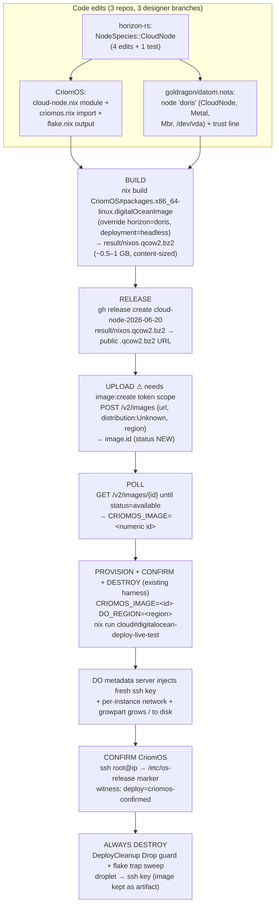

# 74/5 — Synthesis: the minimal declarative CriomOS DigitalOcean cloud-node image

*cloud-designer report 74, file 5 (synthesis). 2026-06-20. Spirit `2u57`:
the cloud-node CriomOS image is a NEW image type, built DECLARATIVELY from the
CriomOS configuration, kept MINIMAL and content-sized (~1–2 GB, NOT a 60 GB
converted-droplet snapshot), with per-node config declared in the cluster data
(`goldragon/datom.nota`, a `horizon-rs` `ClusterProposal`). DigitalOcean is
BIOS/GRUB-only (no UEFI) → `Bootloader::Mbr` + GRUB on `/dev/vda` + per-instance
provisioning + growpart.*

This file reconciles the four lane reports (`1-image-build`, `2-cluster-data`,
`3-species`, `4-end-to-end`) into ONE ordered, source-verified plan. Where lanes
disagreed I verified the source this session and chose; the resolutions are
called out inline. Every claim cites `file:line`.

## The three load-bearing reconciliations (verified this session)

1. **Substrate is `MachineSpecies::Metal`, NOT `Pod`.** Lane D's draft used
   `Pod`; Lanes A/B/C and source agree it is wrong. A `Pod` is validated for a
   non-empty in-cluster host-set on every projection
   (`horizon-rs/lib/src/horizon.rs:57` → `node.rs:652`); a host-less provider VM
   with `super_node = None` is rejected `Error::UnresolvableArch`
   (`node.rs:665`). This is not theoretical — the regression test
   `project_rejects_pod_with_explicit_arch_and_absent_super_node` already exists
   (`horizon-rs/lib/tests/horizon.rs:651`). A droplet IS the bare machine it
   boots on (it owns `/dev/vda`, growpart-resizes its own root), so `Metal` with
   explicit `arch` is honest and skips both Pod validators
   (`node.rs:657`, early-return on non-Pod). **Use `Metal`.**

2. **Image format is `qcow2`, NOT raw.** Lane D's mermaid/steps said
   `result/criomos-cloud.img.gz` (raw). The upstream module hard-codes
   `format = "qcow2"`
   (`<nixpkgs>/nixos/modules/virtualisation/digital-ocean-image.nix:63`,
   verified at store path
   `/nix/store/75bkaivfbwq3x8cs7155hag7hs1chjcx-source`), and `postVM` runs
   gzip/bzip2 over the qcow2 (`:88-99`). So the artifact is
   **`nixos.qcow2.bz2`** (bzip2 chosen for the smallest upload). DigitalOcean
   accepts qcow2 (`4-end-to-end.md:45` constraints table). The release/upload
   steps below use the **`.qcow2.bz2`** extension, not `.img.gz`.

3. **The module wires into `criomos.nix`, NOT `disks/default.nix`.** Lane A
   proposed adding `./cloud-node.nix` to `modules/nixos/disks/default.nix`. That
   file is **dead code** — `criomos.nix:17` imports
   `./disks/preinstalled.nix` directly, and nothing imports `disks/default.nix`
   (`grep` across `modules/` returns only the `criomos.nix:17` direct import).
   Lane C is right: import the cloud-node module in `criomos.nix` next to
   `test-vm-guest.nix` (`criomos.nix:44`). **Wire it in `criomos.nix`.**

Two more reconciliations, sequenced rather than chosen:

4. **Species: new `NodeSpecies::CloudNode` (Lane C) is the end-state; the
   string-prefix gate (Lane A) and `Edge` (Lane B) are interim.** `Edge`
   over-derives `has_video_output`/`edge` (`node.rs:207`,`:410`) a headless
   server doesn't want; `TestVm` is lean but forces `Pod` and fires the host
   microVM emitter (`test-vm-host.nix:163`, gated on `behavesAs.testVm`). A
   purpose-built `CloudNode` deriving only `cloud_node` (no role facets, not
   `virtual_machine`) is correct. The plan lands `CloudNode` and gates the
   CriomOS module on the derived `behavesAs.cloudNode` facet — cleaner than
   `lib.hasPrefix "digitalocean-"` on the location string.

5. **`/dev/vda` for the `/` mount, per the prompt.** GRUB-BIOS targets the whole
   disk `/dev/vda` (`boot.loader.grub.devices`, set by the DO config at
   `digital-ocean-config.nix:59`); the `/` filesystem mount is `/dev/vda` per
   the directive. If the final make-disk-image partition table mounts `/` on the
   partition `/dev/vda1` (the `legacy` table makes one primary partition), the
   `Io` disk device should follow the real table. Flagged as an open question;
   the entry uses `/dev/vda` per the prompt.

## The end-to-end flow



## Part 1 — Ordered implementation steps, exact edits per repo

Three designer feature branches, one per repo, under
`~/wt/github.com/LiGoldragon/<repo>/` (worktree base confirmed present).
horizon-rs lands FIRST (CriomOS gate + datom.nota species both depend on it).

### Repo 1 — horizon-rs (branch `cloud-designer-cloud-node-species`)

Land Lane C's four edits + one test verbatim. All in
`/git/github.com/LiGoldragon/horizon-rs/lib/`. Each line number verified this
session against source.

**Edit 1 — `src/species.rs`**, after `TestVm,` (`species.rs:30`, before the
`NodeSpecies` closing brace), add the doc-commented variant:

```rust
    /// A cloud provider node (DigitalOcean, etc.) — a first-class
    /// cluster role whose CriomOS config is rendered into a NEW minimal,
    /// content-sized cloud image built declaratively from the projection
    /// (NOT a snapshot of a converted droplet). Like `TestVm` it derives
    /// a deliberately lean profile — it sets `cloud_node` and NONE of the
    /// heavy `type_is` role flags, so edge/center/router/large_ai all stay
    /// false and the desktop/server/LLM module trees never derive onto it.
    /// Unlike `TestVm` it is NOT a `Pod` guest: it is the bare machine it
    /// boots on (`MachineSpecies::Metal`), has no `super_node`, resolves
    /// its own arch, and so derives `virtual_machine` false. The cloud
    /// image's bootloader follows `io.bootloader` (`Bootloader::Mbr` for
    /// DigitalOcean BIOS/GRUB); cloud-init network/ssh injection and
    /// growpart are emitted by the CriomOS cloud-image module gated on
    /// `behaves_as.cloud_node`.
    CloudNode,
```

**Edit 2 — `src/node.rs`**, in `struct TypeIs` after `pub test_vm: bool,`
(`node.rs:183`):

```rust
    pub cloud_node: bool,
```

**Edit 3 — `src/node.rs`**, in `TypeIs::from_species` after
`test_vm: matches!(s, NodeSpecies::TestVm),` (`node.rs:198`):

```rust
            cloud_node: matches!(s, NodeSpecies::CloudNode),
```

**Edit 4a — `src/node.rs`**, in `struct BehavesAs` after the `test_vm` field
(`node.rs:168`):

```rust
    /// The cloud-node lean image-profile gate. True only for a
    /// `NodeSpecies::CloudNode` node. CriomOS gates the minimal
    /// cloud-image module (cloud-init + growpart + image-format build)
    /// on this facet. A sibling of `test_vm`: both are lean-profile
    /// gates orthogonal to the role facets. Unlike `test_vm` it does NOT
    /// imply `virtual_machine` — a cloud node is `Metal` from CriomOS's
    /// view, not a Pod guest of one of our hosts.
    pub cloud_node: bool,
```

**Edit 4b — `src/node.rs`**, in `BehavesAs::derive` after
`let test_vm = type_is.test_vm;` (`node.rs:220`):

```rust
        // A CloudNode derives the same lean shape as TestVm — it carries
        // `cloud_node` and nothing else, leaving edge/center/router/large_ai
        // false because `NodeSpecies::CloudNode` sets none of their
        // `type_is` flags. It is NOT a Pod, so `virtual_machine` is false
        // and (with declared disks) `iso` is false: it is the bare machine
        // it boots on.
        let cloud_node = type_is.cloud_node;
```

and in the `BehavesAs { … }` struct literal after `test_vm,` (`node.rs:231`):

```rust
            cloud_node,
```

**New test — `lib/tests/horizon.rs`**, a sibling of
`project_test_vm_pod_derives_lean_profile_and_carries_host_location_disk`
(`horizon.rs:506-534`). Name `project_cloud_node_metal_derives_lean_profile`: a
`Metal` node, `Bootloader::Mbr`, one `/dev/vda Ext4` disk, no `super_node`;
assert `behaves_as.cloud_node`, `!behaves_as.virtual_machine`,
`!behaves_as.iso`, and `edge`/`center`/`router`/`large_ai`/`next_gen` all false.
(The `TestVm` test at `:524-531` is the exact template; flip `test_vm`→
`cloud_node` and `virtual_machine` true→false.)

**Verify:** `cargo test -p horizon` (round-trips the `#[derive(NotaDecode,
NotaEncode)]` on the new unit variant — `species.rs:10-12`; confirm it
encodes/decodes `(CloudNode …)` like `(TestVm …)`). Adding an enum variant is
byte-identical for every node that doesn't name it.

Operator lands main + rebases consumers; designer ships the branch.

### Repo 2 — CriomOS (branch `cloud-designer-cloud-node-image`)

Depends on Repo 1's `behavesAs.cloudNode` facet being available in the projected
horizon JSON.

**New file — `modules/nixos/disks/cloud-node.nix`.** Imports the upstream DO
image module (plants `system.build.digitalOceanImage`, pulls in
`digital-ocean-config.nix` which sets `grub.devices=["/dev/vda"]` at
`digital-ocean-config.nix:59`, `growPartition=true` at `:48`, the `ttyS0` serial
console at `:49-50`, and the 169.254.169.254 metadata-server per-instance
ssh-key + hostname injection at `:74-215`). Gate on the derived facet:

```nix
{
  lib,
  inputs,
  horizon,
  ...
}:
let
  inherit (lib) mkIf mkDefault;
  isCloudNode = horizon.node.behavesAs.cloudNode or false;
in
{
  imports = [
    # Plants system.build.digitalOceanImage (content-sized qcow2 via
    # make-disk-image: format=qcow2, partitionTableType=legacy → pure
    # MBR/BIOS, diskSize="auto" → closure-sized) and pulls in
    # digital-ocean-config.nix (grub.devices=["/dev/vda"],
    # boot.growPartition=true, ttyS0 console, DigitalOcean metadata-server
    # per-instance ssh-key + hostname injection). The build attribute
    # exists on every node but is only meaningful on a cloud node and only
    # exposed by the flake there; the config block below is gated so it is
    # inert weight elsewhere.
    (inputs.nixpkgs + "/nixos/modules/virtualisation/digital-ocean-image.nix")
  ];

  config = mkIf isCloudNode {
    # Smallest practical upload: bzip2 over the qcow2.
    virtualisation.digitalOceanImage.compressionMethod = "bzip2";

    # diskSize "auto" = content-sized: make-disk-image measures the closure
    # and sizes the partition to closure + ~5.2% + 512 MiB — NOT a fixed
    # 60 GB. growpart (boot.growPartition, from digital-ocean-config) then
    # expands / to the real droplet disk on first boot.
    virtualisation.diskSize = mkDefault "auto";

    services.qemuGuest.enable = true;

    # Belt-and-braces: assert the MBR/GRUB-on-/dev/vda contract the DO
    # module relies on, so a mis-declared node fails the build instead of
    # producing an unbootable droplet.
    boot.loader.grub.enable = true;
    boot.loader.grub.devices = lib.mkForce [ "/dev/vda" ];

    # Minimality: a headless cloud node carries no docs, no firmware blobs,
    # no fontconfig. deployment.includeHome=false (the headless override)
    # already drops home-manager/desktop; these trim the rest of the metal
    # weight. A droplet boots a known virtio environment.
    documentation.enable = mkDefault false;
    documentation.nixos.enable = mkDefault false;
    documentation.man.enable = mkDefault false;
    documentation.doc.enable = mkDefault false;
    hardware.enableAllFirmware = mkDefault false;
    hardware.enableRedistributableFirmware = mkDefault false;
    fonts.fontconfig.enable = mkDefault false;
    boot.initrd.includeDefaultModules = mkDefault false;
  };
}
```

Resolution note vs Lane A: the original gate was `bootloader == "Mbr" &&
lib.hasPrefix "digitalocean-" location`. With the `CloudNode` species landed
(Repo 1) the gate is the derived `behavesAs.cloudNode` facet — no string match,
exactly how `test-vm-guest.nix:45` gates on `behavesAs.testVm`. Lane A's
`services.cloud-init` block is DROPPED by default: `digital-ocean-config.nix`
already provides DigitalOcean's native metadata-server provisioning (key +
network + hostname), so generic `services.cloud-init` is additive closure weight
the directive's minimality argues against. Re-add it only if portability to
non-DO cloud-init hosts is wanted (open question).

**Edit — `modules/nixos/criomos.nix`**, add the module to the `imports` list
next to `./test-vm-guest.nix` (`criomos.nix:44`):

```nix
    ./disks/cloud-node.nix
```

(NOT `disks/default.nix` — that file is dead code; see reconciliation 3.)

**Edit — `flake.nix`**, in the returned attrset after
`nixosConfigurations.target = target;` (`flake.nix:180`), expose the build
derivation. `system` is in scope (`flake.nix:110`):

```nix
      # The minimal, content-sized DigitalOcean image built declaratively
      # from this node's CriomOS configuration: a bzip2-compressed qcow2
      # (make-disk-image, format=qcow2, partitionTableType=legacy → pure
      # MBR/BIOS, diskSize="auto" → closure-sized, ~0.5–1 GB compressed, NOT
      # a 60 GB snapshot). Only meaningful when `target` is a cloud node
      # (behavesAs.cloudNode); for any other node the cloud-node module is
      # gated off and this attribute is unbuilt, so `nix build` fails fast.
      packages.${system}.digitalOceanImage =
        target.config.system.build.digitalOceanImage;
```

Designer ships the `next`/feature branch under `~/wt`; operator owns CriomOS
main + rebase.

### Repo 3 — goldragon/datom.nota (branch `cloud-designer-cloud-node-data`)

Depends on Repo 1 (`CloudNode` must parse). Add node `doris` inside the nodes
map (the first `{…}`, `datom.nota:5-180`), right after the `balboa` entry
(`balboa` closes at `datom.nota:27`), 4-space node indent matching the file:

```nota
    doris (CloudNode
      Min
      Max
      (Metal (Some X86_64) 1 (Some [DigitalOcean Droplet]) None None None None (Some 2) (Some 25) (Some digitalocean-nyc3) [])
      (Qwerty
        Mbr
        {
          / (/dev/vda Ext4 [])
        }
        [])
      (AAAAC3NzaC1lZDI1NTE5AAAAIArEPLACEHOLDERdorisCloudNodeSshKeyReplaceMe00000000 None None)
      []
      None
      None
      False
      False
      []
      False
      False
      None
      None
      [(TailnetClient)])
```

Then add the trust line `doris Max` to the trust.nodes inner map
(`datom.nota:217-224`, the `{…}` after `(Max {} {…} …)`, the same block holding
`balboa Max`/`vm-testing Max`), so projected trust resolves to `Max`
consistently. (Trust `Zero` would DROP the node — `horizon.rs:48-51`; trust
defaults to the cluster floor if absent, but every node writes it explicitly.)

Field map (17 positions, `proposal.rs:45-101`; verified against `balboa`
`datom.nota:6-27` and `vm-testing` `datom.nota:156-179`):

- pos0 `CloudNode` = species (the new variant from Repo 1).
- pos1 `Min` = size (honest small-droplet; not `Zero`).
- pos2 `Max` = trust (cluster owns the droplet; `Zero` drops it).
- pos3 `(Metal (Some X86_64) 1 (Some [DigitalOcean Droplet]) None None None None (Some 2) (Some 25) (Some digitalocean-nyc3) [])`
  = machine, 12 positional (`machine.rs:14-67`): `Metal` (NOT `Pod` — see
  reconciliation 1), arch `(Some X86_64)`, cores `1`, model
  `(Some [DigitalOcean Droplet])` (bracket-delimited — contains a space), mother
  board/super_node/super_user/chip_gen all `None`, ram `(Some 2)`, disk
  `(Some 25)`, location `(Some digitalocean-nyc3)` (bare — `-` stays bare;
  matched to the image upload region `nyc3` below), super_nodes `[]`.
- pos4 `(Qwerty Mbr { / (/dev/vda Ext4 []) } [])` = io (`io.rs:98-107`):
  keyboard `Qwerty`, bootloader **`Mbr`** (THE load-bearing field — flips
  `preinstalled.nix:41` `grub.enable = bootloader == "Mbr"`; first `Mbr` in the
  cluster), disks single `/` → `(/dev/vda Ext4 [])` (NO `/boot` — BIOS GRUB
  embeds in the MBR gap), swap `[]`. The 5th `compressed_swap` is the
  droppable-tail (`io.rs:113` accepts 4..=5); mirroring `balboa`
  (`datom.nota:13-15`) the entry above ends after the swap `[]` with NO 5th
  element — the safest round-trip form. (Lane B flagged a draft `[]` at pos4;
  the entry omits it, matching `balboa`.)
- pos5 `(…PLACEHOLDER… None None)` = pub_keys (`proposal.rs:510-518`): ssh
  PLACEHOLDER (base64-charset only, non-empty — `pub_key.rs:31-38`,`:59-69`; NO
  `ssh-ed25519 ` prefix, `.line()` adds it at `:71-73`), nix `None`, yggdrasil
  `None`. MUST replace with the droplet's real ed25519 host pubkey blob before a
  real deploy.
- pos6 `[]` link_local_ips; pos7 `None` node_ip (DO assigns public IP
  per-instance; node joins via Tailnet — see open Q on mesh address); pos8
  `None` wireguard_pub_key; pos9 `False` nordvpn; pos10 `False` wifi_cert; pos11
  `[]` wireguard_untrusted_proxies; pos12 `False` wants_printing; pos13 `False`
  wants_hw_video_accel; pos14 `None` router_interfaces; pos15 `None` online
  (= default-online, `node.rs:397`); pos16 `[(TailnetClient)]` services (how a
  static-IP-less cloud node joins — dials the Tailnet controller; ouranos holds
  `TailnetController`).

Sizing (`1` core, `Some 2` GiB RAM, `Some 25` GiB disk, `digitalocean-nyc3`) is
placeholder small-droplet — set to the chosen DO plan + region. The model name
is a free string (not a `KnownModel`), so it drives no model-specific config.

## Part 2 — minimal build command, expected size, upload-by-URL mechanism

### Build (the single FIRST build action)

The flake's `target` is overridden per-deploy by lojix inputs (`horizon`,
`pkgs`, `system`, `deployment`). Build the `doris` projection with the headless
deployment:

```bash
nix build /git/github.com/LiGoldragon/CriomOS#packages.x86_64-linux.digitalOceanImage \
  --override-input horizon  path:<projected-doris-horizon> \
  --override-input deployment path:<headless-deployment-stub>
```

where `<headless-deployment-stub>` supplies `deployment.includeHome = false`
(drops home-manager/desktop — `flake.nix:116`, `criomos.nix:13`,`:34`) and
`<projected-doris-horizon>` is the `doris` viewpoint projected from
`goldragon/datom.nota` (the existing lojix projection path that produces every
deploy's `horizon` input). Result: `result/nixos.qcow2.bz2`.

### Expected size (minimality scorecard)

Content-sized on three independent levers:

1. **`diskSize = "auto"`** → `make-disk-image.nix` measures the closure (`du` over
   the store paths) and sizes the partition to `closure + ~5.2% ext4 reserve +
   512 MiB additionalSpace` (`make-disk-image.nix:110,114`). NO 60 GB region;
   growpart fills the droplet disk at RUNTIME.
2. **qcow2 + bzip2.** Sparse qcow2 over a content-sized partition, then bzip2 —
   unused regions cost almost nothing; the upload is dominated by the compressed
   store closure.
3. **Headless closure.** `includeHome = false` drops the desktop (the bulk of an
   edge image); the module additionally drops docs/firmware/fontconfig/default
   initrd modules. `CloudNode` derives NO role facets, so no desktop/edge/center/
   router/LLM module tree derives onto it (`node.rs` derive leaves them false).

**Expected:** uncompressed content-sized qcow2 ~1.5–2 GB; bzip2 upload artifact
**~0.5–1 GB** — inside the Spirit `2u57` ~1–2 GB target, far below a 60 GB
snapshot. (Final number is whatever the closure measures; the mechanism
guarantees it tracks content, not disk geometry.)

⚠ **Minimality risk to watch:** if the build accidentally pulls
`includeHome = true` (the default when `deployment` is unset — `flake.nix:113`),
the desktop tree derives and the image balloons. The headless deployment
override is load-bearing; verify the built closure size before upload, and
verify `behavesAs.cloudNode` is true in the projected horizon (else the module
is gated off and `digitalOceanImage` is unbuilt → `nix build` fails fast, which
is the intended failure, not a silent fat image).

### Upload by URL (host: GitHub release asset on a LiGoldragon repo)

Recommended host = **GitHub release asset** (public, reproducible, version-pinned
to a tag, no extra credentials). DO fetches server-side; the stable
`github.com/.../releases/download/<tag>/<file>` URL ends in the extension and
re-issues a fresh signed redirect on each fetch (the 302 →
`release-assets.githubusercontent.com` signed URL expires ~1 h, but an import
completes well inside that window; `4-end-to-end.md:63-81`). Fallback = DO
Spaces (needs separate access keys — credential sprawl; only if the artifact
nears the 2 GB release-asset cap, which our ~0.5–1 GB image clears).

```bash
gh release create cloud-node-2026-06-20 \
  result/nixos.qcow2.bz2 \
  --repo LiGoldragon/CriomOS \
  --title 'CriomOS cloud-node image 2026-06-20' \
  --notes 'Declarative content-sized qcow2 GRUB/BIOS cloud-node image for DigitalOcean custom-image import.'
# public URL:
# https://github.com/LiGoldragon/CriomOS/releases/download/cloud-node-2026-06-20/nixos.qcow2.bz2
```

```bash
TOKEN=$(gopass show -o digitalocean.com/api-token)   # NEVER echo it
API=https://api.digitalocean.com/v2
auth=(-H "Authorization: Bearer $TOKEN" -H "Content-Type: application/json")
REGION=nyc3                                            # image home region == datom location
RELEASE_TAG=cloud-node-2026-06-20
IMAGE_URL=https://github.com/LiGoldragon/CriomOS/releases/download/$RELEASE_TAG/nixos.qcow2.bz2

# create the custom image from the public URL (needs image:create scope)
IMAGE_ID=$(curl -fsS "${auth[@]}" -X POST "$API/images" -d "{
  \"name\":\"criomos-cloud-$RELEASE_TAG\",
  \"url\":\"$IMAGE_URL\",
  \"distribution\":\"Unknown\",
  \"region\":\"$REGION\",
  \"description\":\"CriomOS cloud-node, declarative content-sized qcow2, GRUB/BIOS\",
  \"tags\":[\"criomos\",\"cloud-node\"]
}" | python3 -c 'import sys,json;print(json.load(sys.stdin)["image"]["id"])')
echo "custom image id: $IMAGE_ID  (status begins NEW)"

# poll GET /v2/images/{id} until status == available
until [ "$(curl -fsS "${auth[@]}" "$API/images/$IMAGE_ID" \
  | python3 -c 'import sys,json;print(json.load(sys.stdin)["image"]["status"])')" = available ]; do
  echo "image $IMAGE_ID still importing…"; sleep 20
done
echo "CRIOMOS_IMAGE=$IMAGE_ID  (region $REGION, status available)"
```

`distribution: Unknown` (NixOS isn't in DO's closed list); `region` is the home
DC and the droplet must later be created in the SAME region. The upload is a
curl/`gh` step, NOT daemon code (the cloud adapter has no `/v2/images` surface —
`digitalocean.rs` handles only droplet image-slug selection).

## Part 3 — live-test sequence (existing harness, CRIOMOS_IMAGE=<id>)

The harness exists on cloud branch `cloud-designer-do-deploy-test`
(`tests/digitalocean_deploy_live.rs`, `flake.nix` app
`digitalocean-deploy-live-test`, binary `cloud-digitalocean-deploy-live-test`).
A numeric `CRIOMOS_IMAGE` is recognized as mode 1 (pre-made custom image) by
`is_custom_image` — all-ASCII-digits (`digitalocean_deploy_live.rs:163-167`);
env vars `CRIOMOS_IMAGE`/`DO_REGION`/`CRIOMOS_MARKER` are read at `:131-139`.

```bash
nix run /git/github.com/LiGoldragon/cloud#digitalocean-deploy-live-test \
  --override-input ... \
  # with env:
  #   DIGITALOCEAN_ACCESS_TOKEN=$(gopass show -o digitalocean.com/api-token)
  #   CRIOMOS_IMAGE=$IMAGE_ID
  #   DO_REGION=nyc3            # MUST equal the image home region
  #   CRIOMOS_MARKER='ID=nixos' # a CriomOS-sharp /etc/os-release line for criomos-confirmed
```

(Run from a checkout of the `cloud-designer-do-deploy-test` branch; leave
`DEPLOY_FLAKE` UNSET — mode 1 has no remote switch, the OS arrived in the image.)

Internally (all already built):
1. mints a throwaway ed25519 key (`TemporarySshKey`) — the FRESH key — and
   `ensure_ssh_key`s it onto the account;
2. `create_server` from the custom image in `DO_REGION`, prefix-named
   `criome-deploy-test-<pid>-<ts>`;
3. `DropletPoll::until_running` polls to `Running` + IPv4;
4. **cloud-init / DO metadata injection (image-side):** DO's metadata server
   injects the create-call's `ssh_keys` fingerprint into `root` at first boot
   (the image carries `digital-ocean-config.nix`'s metadata services), and
   growpart resizes `/` to the droplet disk. The harness's `wait_for_ssh`
   retries ssh until the key is applied — this is the per-instance network +
   ssh-key injection confirm.
5. `DeployConfirmation::resolve` (`:241-265`) SSHes in with the fresh key, reads
   `/etc/os-release`, and emits `DeployLevel::CriomosConfirmed` →
   `"criomos-confirmed"` (`:357-360`) when the marker matches.

The one witness line:
```
DEPLOY WITNESS droplet_id=<id> ipv4=<a.b.c.d> region=<region> image=<numeric-id> deploy=criomos-confirmed result=OK
```

**ALWAYS DESTROY (two layers, both built):** the Rust `DeployCleanup` `Drop`
guard tears down droplet then ssh key on success / `assert!` / `?`-return /
panic; the flake wrapper's `trap sweep EXIT` is a prefix-named curl sweep
catching a `kill -9` before `Drop`. The custom IMAGE is NOT destroyed (it is the
reusable artifact) — delete it with `DELETE /v2/images/$IMAGE_ID` only when
retiring that build.

## Part 4 — recommended FIRST build action + honest scope

### The single recommended FIRST build action

**Land the three code branches in order (horizon-rs → CriomOS → datom.nota),
then run the headless build of the `doris` projection** —
`nix build CriomOS#packages.x86_64-linux.digitalOceanImage` with the headless
deployment + `doris` horizon overrides — and **measure the resulting
`result/nixos.qcow2.bz2` size**. This is the action that proves the whole
directive at once: it exercises the new species (it must project), the new
module (it must derive only on `behavesAs.cloudNode`), the flake output (it must
exist), AND the minimality claim (the size is the verdict). It needs NO
DigitalOcean credentials and NO psyche action — it is pure local build. Do this
before touching the upload/deploy path.

### Buildable now vs needs psyche input

| Slice | Status |
|---|---|
| horizon-rs `CloudNode` species (4 edits + test) | **Buildable now** — verified line numbers; `cargo test -p horizon` |
| CriomOS `cloud-node.nix` + `criomos.nix` import + `flake.nix` output | **Buildable now** — upstream DO module + `behavesAs.cloudNode` gate verified |
| `goldragon/datom.nota` `doris` entry + trust line | **Buildable now** — field map verified against `balboa`/`vm-testing` |
| Build `digitalOceanImage` + measure size | **Buildable now** — local `nix build`, no credentials |
| Release artifact (`gh release`) | **Buildable now** — public LiGoldragon repo |
| `POST /v2/images` upload + poll | **BLOCKED on psyche** — re-mint the DO PAT with `image:create` scope at `gopass digitalocean.com/api-token` |
| mode-1 end-to-end deploy → confirm → destroy | **Runs after upload** — harness exists, no code change |

### Steps that risk the minimality requirement (flagged)

1. **`includeHome = true` default** (`flake.nix:113`). If the build runs without
   the headless deployment override, the desktop tree derives and the image
   balloons far past 1–2 GB. The headless override is load-bearing — verify the
   projected `deployment.includeHome` is false.
2. **Re-adding `services.cloud-init`** (Lane A's optional block). It is additive
   closure weight on top of DO's native metadata provisioning; the plan drops it
   by default for minimality. Add only if non-DO portability is explicitly
   wanted.
3. **The gate mis-firing.** If `behavesAs.cloudNode` is false on the projected
   `doris`, the module is gated off and `digitalOceanImage` is unbuilt — `nix
   build` fails fast (intended), not a silent fat image. Confirm the facet is
   true in the projection before reading too much into a build failure.

## Open questions for the psyche / horizon-rs operator

1. **Substrate ratification.** The plan uses `MachineSpecies::Metal` (Pod is
   rejected for a host-less provider VM — `horizon.rs:651` test). A future
   host-less cloud substrate (`MachineSpecies::Cloud` or empty-host-set Pod) is
   the cleaner long-term shape but is a schema change. Recommend Metal now,
   tracked for later. Confirm.
2. **cloud-init vs DO native metadata.** The plan drops generic
   `services.cloud-init` (DO's metadata server covers key + network + hostname).
   If portability to other cloud-init hosts is wanted, re-add it (larger
   closure). Which does the psyche want?
3. **`/dev/vda` whole-disk vs `/dev/vda1` partition.** The `/` mount uses
   `/dev/vda` per the directive; GRUB targets the whole disk `/dev/vda`. If the
   `legacy` partition table mounts `/` on `/dev/vda1`, the `Io` disk device
   should follow the real table. Confirm against the built image's partition
   table.
4. **Mesh reachability.** `node_ip` is `None` (DO assigns the public IP
   per-instance); the node joins solely via the `TailnetClient` service. Confirm
   no static mesh address (`5::N/128` like other nodes) is required.
5. **Droplet sizing/region.** `1` core / `Some 2` GiB / `Some 25` GiB /
   `digitalocean-nyc3` are placeholder small-droplet values; set to the chosen
   DO plan + region (and keep the datom location == the image upload `region` ==
   the deploy `DO_REGION`).
6. **Token scope (the one hard blocker).** Re-mint the DO PAT with `image:create`
   (or full scope) at `gopass digitalocean.com/api-token`; confirm when done so
   the upload + mode-1 end-to-end can run.

## Follow-up (not blocking the first image)

Promote `behavesAs.cloudNode` to fully replace any location-string reasoning
across CriomOS — already done in this plan (the module gates on the derived
facet, not `lib.hasPrefix "digitalocean-"`). If more cloud providers join, a
provider-typed `Location` feeding the same `cloud_node` derivation keeps the gate
provider-agnostic.
