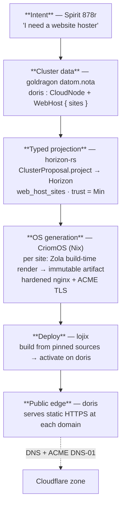
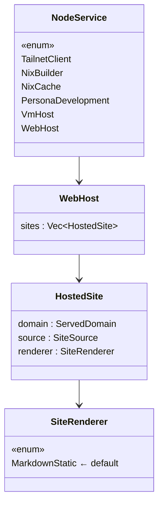
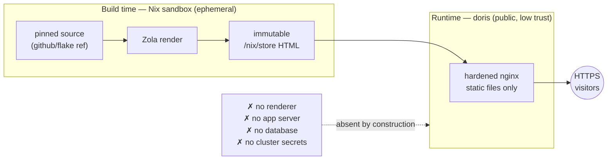
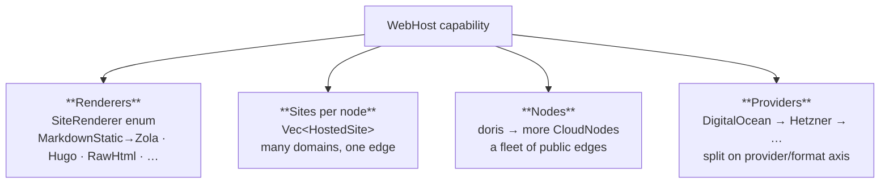
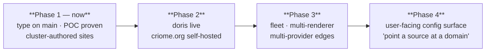

# The CriomOS web-hosting system — vision

cloud-designer, 2026-06-21. The psyche asked to see the vision for the whole
system. This is the full picture: from a sentence of intent down to a public
HTTPS edge, and outward to the fleet it becomes. Grounded in what already
exists — the typed `WebHost` capability landed on horizon-rs main
(`4a0e29f`), the POC proving the pipeline (report 79), doris declared as a
low-trust cloud node.

## The vision in one sentence

**A user says "host this site here," and a reproducible, intent-driven
cluster turns a pinned markdown source into an immutable artifact and serves
it over HTTPS from a low-trust public edge — with nothing dynamic to
compromise, and a one-line rollback if anything is wrong.**

The web host is the moment CriomOS stops being internal infrastructure and
grows a public face — the first capability that serves the outside world,
not just the cluster.

## The spine: intent flows down to a running edge

Every layer is typed, and each is projected from the one above it. Nothing is
inferred from a hostname or hand-edited at the bottom.

The load-bearing idea: **the renderer runs at the OS-generation layer, in the
Nix sandbox — never on the edge.** By the time bytes reach doris they are
plain, immutable HTML.

## The typed model — one capability, fully named

The cluster declares *what* doris hosts; CriomOS owns *how*. The whole
contract is the typed `WebHost` service (on main now):

`WebHost` is a sibling of `VmHost`/`NixCache` — an opt-in capability a
cluster authors onto a node, never guessed. Each `HostedSite` is three
distinct roles in three distinct types: a domain (the ACME TLS name), a
pinned source, and a renderer variant. The Nix layer reads this payload off
`horizon.node.services` exactly as the VM-test generator reads `VmHost`.

## Why it is reliable and secure — what lives where

The security argument is structural, not bolted on. The edge runs *only* a
static file server; the entire dynamic surface lives at build time, in the
sandbox, and is gone before deploy.

Four properties fall out of this shape:

- **No request-time execution.** The class of web-host RCE — template
  injection, deserialization, app-server bugs — cannot exist, because nothing
  dynamic is exposed. The compromise surface is nginx + the kernel.
- **Low-trust edge by design.** doris sits at trust `Min`; effective trust is
  `min(node, cluster)`, so even a fully-popped edge is floored out of every
  trusted cluster operation and holds no secrets. The role *is* the trust
  level (Spirit `5pf6`).
- **Reproducible + instantly reversible.** Same source → same store hash →
  same site; each deploy is a generation, rollback is a switch.
- **Minimal secrets.** Only the TLS key lives on the node, rotatable; DNS and
  ACME DNS-01 go through the Cloudflare token, off-node.

## How it scales — four independent axes

The same typed shape grows in four directions without new special cases:

| Axis | Today | Grows to | Cost of growth |
|---|---|---|---|
| Renderer | `MarkdownStatic` (Zola) | Hugo, raw-HTML passthrough, others | one enum variant + one Nix render path |
| Sites | one per node | many `HostedSite`s per node | already a `Vec` — zero structural change |
| Nodes | doris (one edge) | a fleet of low-trust CloudNodes | declare another node with `WebHost` |
| Provider | DigitalOcean | Hetzner, others | the audit's provider/format image split (#18) |

None of these is a rewrite. The typed model already admits all four; the work
is filling in enum variants and Nix render paths.

## Where it goes — from cluster-authored to a hosting service

Today the psyche authors sites in `datom.nota` (cluster-authored, the secure
default). The arc bends toward the literal ask — *"a service users can
configure"*:

- **Phase 1 (here).** `NodeService::WebHost` on horizon-rs main; the POC
  proves build-time render → static serve; doris declared low-trust.
- **Phase 2.** Land the CriomOS module + doris's site in `datom.nota`,
  provision doris, deploy. **CriomOS hosts its own project site (criome.org)
  on its own cluster** — the dogfooding proof.
- **Phase 3.** More edges, more renderers, a second provider — the fleet.
- **Phase 4.** A user-facing config surface so a user points a source at a
  domain without editing cluster data: the website *hoster*, as a service.
  Still build-time render underneath — the security model never changes.

## The principles it rests on

- **Intent is primordial.** The system exists because the psyche said so
  (878r); every layer is a faithful projection of that, not an agent's
  invention.
- **The type carries the meaning.** `WebHost`/`HostedSite`/`SiteRenderer` —
  no string keys, no bool flags. A new capability is a new typed service, not
  a config hack.
- **Beauty is the special case dissolving.** A web host is just another
  `NodeService` next to `VmHost` and `NixCache`; a public edge is just a node
  whose trust is `Min`. Nothing about hosting is bolted on — it reuses the
  whole cluster machine.
- **Reproducible or it didn't happen.** Pinned sources, immutable artifacts,
  generation rollback. The POC built from a pinned `nixpkgs` on the cluster
  builder, not an ambient toolchain.

## Where it sits in the larger CriomOS picture

The cluster is a typed, intent-driven fleet where every capability —
`NixBuilder`, `NixCache`, `VmHost`, `PersonaDevelopment`, `TailnetClient` —
is a service projected from cluster data and gated in Nix. The web host is
the first of these to face *outward*. It proves the same machine that runs
the cluster's internal infrastructure can also be its public voice: one typed
model, internal and external capabilities side by side, every edge as
trustworthy as it needs to be and no more.
