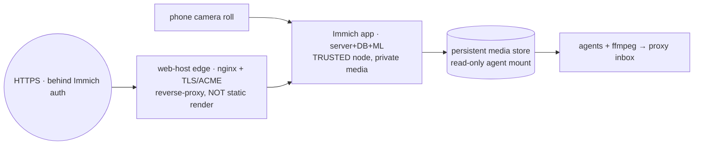

# Porting the Immich agentic media mirror into the CriomOS web-host system

cloud-designer, 2026-06-22. Per the psyche: the Immich agentic media mirror
(videographer proposal 6) is a build target and one of the first public
web-hosting deployments; cloud-designer ports and maintains the hosting in
tandem with videographer. Intent: Spirit `aa7l` (Decision), building on
`vgon` (Immich is the phone uploader; no Syncthing on the phone) and the
web-host direction `878r`.

## The shape shift: from static sites to a dynamic app

Everything the web-host system does today is **static** — markdown → Zola →
immutable files → nginx. Immich is the opposite: a long-running
**application** (server + PostgreSQL + Redis + a machine-learning service)
holding the psyche's **private** photos and videos. So this is the first
*dynamic-app* hosting target, and porting it extends the web-host system in
two ways — a new hosting mode, and a different trust posture.

## The port — three pieces

1. **Immich as a CriomOS service.** nixpkgs ships `services.immich` (server,
   PostgreSQL, ML, Redis). Port the videographer's container proposal to a
   CriomOS NixOS module gated on a cluster-authored capability, media on
   persistent storage at a documented path, declared via cluster data — the
   same discipline as every other node service. This replaces "deploy the
   upstream container set" with the reproducible Nix path.

2. **A reverse-proxy edge mode (the web-host extension).** Today a
   `HostedSite` renders a static `source`. Immich needs the edge to
   **proxy to a local app** instead — nginx `proxy_pass` to Immich's port,
   behind the same hardened TLS/ACME vhost. This is a typed addition to the
   web-host model: a `HostedSite` is either *rendered-static* (today) or
   *reverse-proxied-to-an-upstream* (new). One edge, two backends. This
   extension is reusable for any future dynamic app, not just Immich.

3. **The agent read-path.** A read-only mount of the originals + a writeable
   proxy inbox, exactly as the videographer specified (agents read
   originals, write proxies/contact-sheets to the inbox, never mutate Immich
   storage). The acceptance tests 1–7 in proposal 6 are the videographer's;
   the hosting side delivers paths 2, 5, 6, 7 (on-disk originals, network
   reachability, backup, restore smoke test).

## The trust + privacy posture — the load-bearing difference

This is where Immich departs hardest from the static web host, and it must be
gotten right:

- **Immich holds private personal media, so the low-trust static-edge model
  does NOT apply.** doris (trust `Min`, a public static edge with no secrets)
  is the wrong home. The node running Immich is a **trusted** node — private
  data, real authentication, backed-up storage. The always-on home/server
  node the videographer prefers is the right class.
- **"Public web hosting" here means publicly REACHABLE over HTTPS behind
  Immich's own authentication — not public content.** The library stays
  auth-gated; "public" is the network path (reachable from anywhere over
  TLS), the agentic convenience the proposal wants, replacing brittle Google
  Photos access. A separate curated public-gallery (Immich shared links) is a
  later option, never the default.
- **Privacy discipline holds throughout:** no media, tokens, or account
  identifiers in public reports, `Zero` Spirit records, beads, or chat
  (proposal 6, `cjrl`, AGENTS.md). The infra is public workspace work; the
  content is closed.
- **Backup is one unit** (DB + media), with a restore smoke test, per the
  proposal.

## The tandem split

- **cloud-designer (hosting/infra, this port):** the CriomOS Immich service
  module, the reverse-proxy edge mode, TLS/ACME + DNS (Cloudflare), the
  trusted-node placement, persistent storage, backup + restore, the agent
  read-path mounts.
- **videographer (media/craft):** capture, the phone uploader, the agent
  video workflow, proxy/contact-sheet defaults, acceptance tests 1, 3, 4, the
  Immich-alone-vs-gallery UX calls.

## Build order — and what I'll start now

The infra-neutral foundation needs no exposure decision, so I can start it
without touching private media:

1. **The reverse-proxy web-host mode** (the dynamic-app extension to the
   `HostedSite` model + the edge module) — reusable, testable with the same
   eval + VM-serve harness as the static mode. *This is the concrete start.*
2. The CriomOS `services.immich` module (gated on a cluster capability), on a
   trusted node, media on persistent storage.
3. Cluster data: declare Immich on the chosen trusted node + a reverse-proxy
   `HostedSite` for its domain.
4. Deploy, then the backup + restore smoke test.

## Open decisions (psyche / tandem)

1. **Which node hosts Immich?** A trusted always-on home/server node with disk
   + backup — explicitly **not** low-trust doris. (Which one?)
2. **Exposure model:** publicly-reachable-behind-Immich-auth over HTTPS (my
   read of "public web hosting") vs. private-mesh/VPN-first (the videographer's
   default). I'll design for public-behind-auth unless told otherwise.
3. **Auth for agents:** Immich's built-in auth + a long-lived read-only API
   key, vs. filesystem-first (`vgon`/proposal lean to filesystem-first).

Bead tracks this; `aa7l` is the intent.
