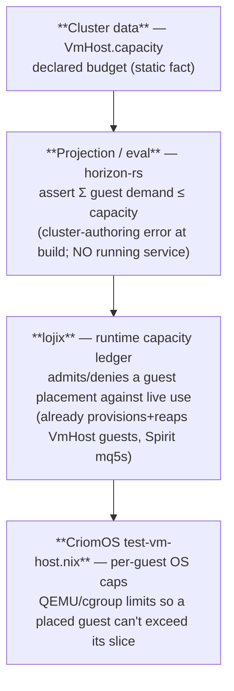

# VmHost capacity limits — typed budget + who holds it

cloud-designer, 2026-06-22. Per the psyche: the `VmHost` capability should
carry RAM/disk/CPU limits in its variant data, "held somehow by a service
(our system component?)." Intent: Spirit `tdvr`. This proposes the typed
shape and answers the holder question — grounded in existing intent, not a
new invention.

## Today vs. the gap

`NodeService::VmHost` (horizon-rs) carries `{ guest_subnet, kvm,
maximum_guests }` — a *count* ceiling but no *resource* budget. A host that
declares `maximum_guests = 4` can still be handed four guests that together
demand more RAM/disk/CPU than it has. The psyche's fix: add the resource
budget.

## The typed shape

```rust
VmHost {
    guest_subnet: TapSubnet,
    kvm: KvmAvailability,
    maximum_guests: Option<MaximumGuests>,
    capacity: Option<HostCapacity>,        // NEW — the resource budget
}

/// The resource budget a VmHost advertises for its guests: the ceiling the
/// summed guest demand must fit under. Three distinct roles, three distinct
/// types (newtype-per-role, skills/abstractions.md) — never three bare u32s.
pub struct HostCapacity {
    ram_gb:  GuestRamBudget,    // newtype(u32), GiB — mirrors machine.ram_gb
    disk_gb: GuestDiskBudget,   // newtype(u32), GiB — mirrors machine.disk_gb
    cores:   GuestCoreBudget,   // newtype(u32)      — mirrors machine.cores
}
```

Units mirror the per-node `Machine` fields (`ram_gb`, `disk_gb`, `cores`)
the guests are already sized in, so the fit-check is a direct sum. `Option`
so a host with no declared budget keeps today's count-only behaviour.

## Who holds the limit — three layers, one is "our system component"

A declared number is inert until something enforces it. The psyche's instinct
is right — a *service* must hold it. The clean answer is layered, and the
runtime holder is already named by existing intent:



1. **Static fit-check (no service).** The projection asserts the declared
   guest set's summed RAM/disk/cores ≤ the host budget — exactly how
   `mkVmTest` already asserts `hostedCount ≤ maximum_guests` and the subnet
   fit. Over-subscription becomes a loud eval error, not a mid-boot mystery.
2. **Runtime ledger = lojix (the answer to "our system component?").**
   Existing intent **`mq5s`** already makes lojix "the deploy component that
   provisions and reaps on-demand VmHost guests." Holding the live capacity
   ledger — admit a guest only if it fits current free budget — is a natural
   extension of what lojix already does, not a new daemon. lojix owns
   placement; placement is exactly where a capacity limit bites.
3. **Per-guest OS enforcement.** Once placed, `test-vm-host.nix` caps each
   guest's QEMU/cgroup RAM/CPU/disk to its allocation, so a guest can't
   exceed its slice even if it tries.

So: **cluster data declares it, the projection enforces the static fit for
free, lojix holds the runtime ledger, and the CriomOS VM-host module enforces
per-guest OS caps.** "Our system component" = lojix.

## Coordination — this is a breaking change to system-designer's active area

Adding `capacity` to `VmHost` changes its NOTA arity, which is a **breaking
datom-schema change** (proposal.rs's own warning: every datom + daemon
horizon-pin moves in lockstep). system-designer is **mid-deploy of prometheus
VmHost right now** (the goldragon + CriomOS locks), so landing this field
unilaterally would break their in-flight datoms. The implementation must
**sequence with system-designer**, not race them:

1. Confirm the typed shape + units (this proposal) with the psyche +
   system-designer.
2. system-designer lands the `capacity` field on `VmHost` + the projection
   fit-check together with their VmHost datom work (one lockstep wire bump).
3. lojix gains the runtime ledger (system-designer's lojix lane).
4. `test-vm-host.nix` caps per-guest QEMU/cgroup resources.

horizon-rs `proposal.rs` is shared territory (I added `WebHost` there); the
`VmHost` change is system-designer's to land given their active VmHost
deploy. I'm proposing the shape; they own the breaking-wire timing.

## Open

- Units: GiB for RAM/disk, integer cores — confirm (mirrors `Machine`).
- Is the budget the host's *total* guest allowance (my read) or a *per-guest*
  default? I read it as the host's total, summed-against — consistent with
  `maximum_guests` being a host-total count.
