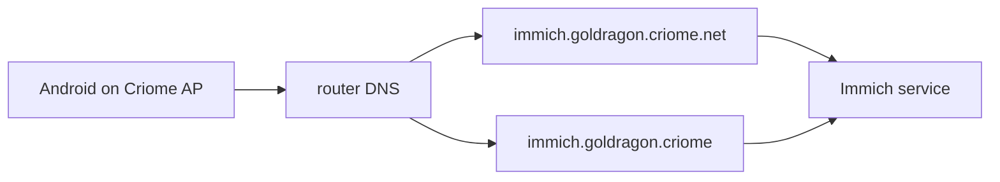

# 389 — Mobile media domain resolution PoC

## Intent Anchors

[Syncthing is excluded from the phone media mirror path because it is too heavy for the phone; Immich remains the phone uploader/gallery candidate and any raw-file surface must avoid adding Syncthing to Android.] (Spirit `vgon`)

[Mobile Android clients on the Criome WiFi access point should get near-native name resolution for cluster services; improve the AP-to-Android resolving path before falling back to ordinary public DNS names.] (Spirit `87ts`)

[Cluster configuration and Horizon should carry the public-domain mapping for ordinary DNS fallback: criome.net is assigned per cluster, with goldragon owning goldragon.criome.net; the exact NOTA shape is open, but the data belongs in cluster config rather than being hardcoded downstream.] (Spirit `iwbt`)

## Thesis

The right shape is two name planes over one service identity:



The `.criome` name is the internal cluster-native identity. The
`goldragon.criome.net` name is the phone-friendly public-DNS identity,
especially for TLS and apps that behave better with ordinary public
FQDNs. On the Criome WiFi AP, both should resolve to the private/LAN
service address. Away from the AP, `goldragon.criome.net` can later point
to a mesh ingress, tunnel, or no public address until remote upload is
explicitly enabled.

This keeps Syncthing out of Android entirely. Immich handles mobile
upload and gallery UX; agents get filesystem/API access on the server
side.

## Why this belongs in Horizon cluster data

A public zone assignment passes the Horizon cluster-data rule:

- **Variability:** another cluster owner may not use `criome.net`, or may
  own a different delegated domain.
- **Authority:** the cluster owner controls which public domain names
  point at the cluster.
- **Non-derivable:** Horizon cannot derive `goldragon.criome.net` unless
  told which public zone is assigned.

The implementation details do not belong in Horizon: DNS provider,
Cloudflare API shape, nginx ports, ACME challenge method, Immich port,
and local DNS daemon mechanics are CriomOS/cloud implementation facts.

The existing `horizon-rs` shape has `ClusterProposal.domains:
BTreeMap<DomainName, DomainProposal>` with `DomainSpecies::Cloudflare`.
That is provider-flavored and too thin for this role. The PoC should
not overload it silently. Either refine it deliberately or add a tail
field that names public-domain mappings directly.

## PoC schema direction

Use a tail field on `ClusterProposal` so existing positional NOTA stays
readable with an explicit default during migration:

```text
ClusterProposal = nodes users domains trust publicDomainMappings?
PublicDomainMapping = publicDomainName coverage
PublicDomainCoverage = FullSubdomain
```

A goldragon-shaped sample would read like this at the new tail position:

```nota
[(goldragon.criome.net FullSubdomain)]
```

The internal target zone is derived as `<cluster>.criome`, so the record
only authors what the cluster owner knows: the public zone. If later a
cluster maps multiple internal zones to multiple public zones, widen the
record then; do not make the first shape carry that complexity before it
is needed.

Recommended Rust nouns if this becomes implementation:

- `PublicDomainName` — newtype distinct from internal `DomainName` or
  `CriomeDomainName`.
- `PublicDomainMapping` — product of `PublicDomainName` and
  `PublicDomainCoverage`.
- `PublicDomainCoverage::FullSubdomain` — means every service name under
  `<cluster>.criome` may derive a parallel name under the public zone.

Projected `Cluster` should expose the mappings as JSON so CriomOS can
write DNS and service config without re-reading proposal data.

## DNS implementation shape

### AP-local resolution

On the router/AP node, CriomOS should render local DNS records for both
identity planes:

- `immich.goldragon.criome` → Immich host LAN/service address.
- `immich.goldragon.criome.net` → the same private address while on the
  Criome WiFi AP.

Android should be treated as an ordinary client resolving FQDNs. Do not
rely on DHCP search suffixes for the first proof, because mobile apps and
browsers are more predictable with full names. The AP should advertise
the router as DNS through DHCP, and the acceptance test should verify the
actual Android path rather than only a Linux laptop on the same WiFi.

Private DNS on Android is the main risk: strict DNS-over-TLS settings can
bypass DHCP-provided DNS. The PoC should document the required Android
setting for the network, or prove that the phone's current setting honors
AP DNS on the Criome SSID.

### Public-domain fallback

For `goldragon.criome.net`, cloud/DNS automation should eventually
publish records from the same cluster data. The first safe form is not a
publicly exposed Immich; it is a DNS shape that supports TLS and later
remote paths:

- AP split-horizon answer: private LAN address.
- Public answer: omitted, private mesh ingress, or explicit remote ingress
  only after remote upload is authorized.
- TLS: prefer ACME DNS-01 for `immich.goldragon.criome.net`, because it
  does not require public HTTP exposure.

This aligns with the cloud component direction: provider APIs are an
implementation surface for publishing cluster-authored DNS state, not the
place where cluster identity is invented.

## Immich service naming

Recommended first canonical phone URL:

`https://immich.goldragon.criome.net`

Reasons:

- Android and the Immich app get an ordinary public DNS name and a normal
  certificate story.
- The AP can still resolve it privately, so local upload uses LAN path.
- The `.criome` name remains available for native cluster clients and
  agent/operator diagnostics.

The internal name remains useful:

`https://immich.goldragon.criome`

but it needs either private trust roots or a non-public certificate story.
That is acceptable for agents and cluster nodes, less ideal for a phone
app. Use the public-domain name for phone UX unless the TLS story proves
cleaner another way.

## Minimal implementation sequence

1. **Horizon PoC**
   - Add `public_domain_mappings` at the tail of `ClusterProposal`.
   - Add `PublicDomainName`, `PublicDomainMapping`, and
     `PublicDomainCoverage`.
   - Project mappings into `Cluster`.
   - Tests: NOTA decode/encode, projection JSON, and a goldragon fixture
     asserting `goldragon.criome.net` survives projection.

2. **CriomOS DNS PoC**
   - Add a router DNS rendering path that consumes projected public-domain
     mappings.
   - For Immich, emit local records for both `.criome` and `.criome.net`
     service names.
   - Tests: Nix check proves a fixture horizon renders both records and
     does not use node-name predicates.

3. **Immich host PoC**
   - Deploy NixOS-native `services.immich` on the selected always-on host.
   - Store originals on backed-up persistent storage.
   - Expose agent read-only originals and writable proxy inbox separately.
   - No Syncthing.

4. **Android live acceptance, gated**
   - Only after explicit live authorization: connect Android to the Criome
     AP, open `https://immich.goldragon.criome.net`, upload a fresh short
     video, confirm it appears on disk, run `ffprobe`, and write a proxy
     to the agent inbox.

## Acceptance tests

Hermetic/static gates before live work:

- Horizon decodes and projects a cluster with
  `[(goldragon.criome.net FullSubdomain)]`.
- CriomOS renders AP-local DNS for `immich.goldragon.criome` and
  `immich.goldragon.criome.net` from projected data.
- Immich module uses NixOS-native service configuration, not OCI or
  Compose.
- Agent path policy is enforced by filesystem permissions: originals
  read-only, proxy inbox writable.
- Backup policy includes Immich media originals and database dump.

Live gates after authorization:

- Android on the Criome AP resolves the chosen phone URL through the AP
  DNS path.
- The Immich app uploads a fresh video without manual file transfer.
- The same original is visible on the server filesystem.
- A proxy can be generated into the agent inbox without mutating Immich
  storage.
- Restore smoke recovers one database record and one original file into a
  temporary location.

## Open choices

1. **Canonical phone URL:** recommended
   `immich.goldragon.criome.net`, with `.criome` kept as internal native
   identity.
2. **Public DNS exposure:** start with split-horizon local answer and no
   public Immich exposure unless remote upload is explicitly authorized.
3. **Horizon field name:** `public_domain_mappings` is the clearest PoC
   name, but implementation should pick the noun that matches the final
   type model.
4. **Existing `domains` map:** either leave it as provider inventory for
   now or redesign it in the same Horizon slice; do not overload
   `DomainSpecies::Cloudflare` to mean public service-zone mapping.
