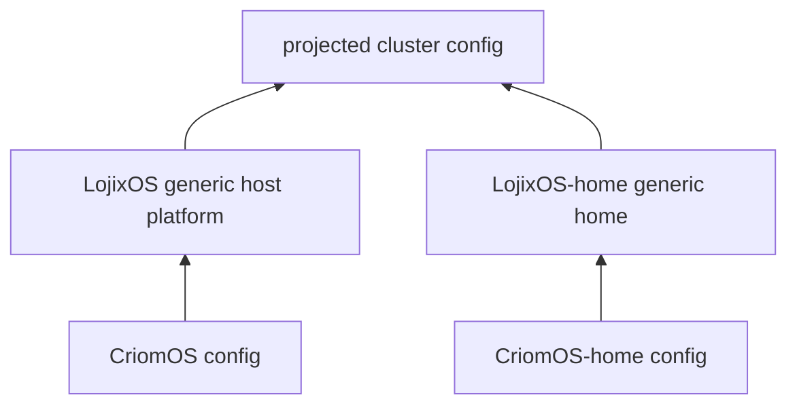

# 390 — Pan-cluster domain and LojixOS extraction

## Intent Anchors

[Cluster configuration and Horizon should carry the public-domain mapping for ordinary DNS fallback: criome.net is assigned per cluster, with goldragon owning goldragon.criome.net; the exact NOTA shape is open, but the data belongs in cluster config rather than being hardcoded downstream.] (Spirit `iwbt`)

[Mobile Android clients on the Criome WiFi access point should get near-native name resolution for cluster services; improve the AP-to-Android resolving path before falling back to ordinary public DNS names.] (Spirit `87ts`)

## Naming correction

`.criome.net` is not technically a top-level domain; `.net` is the TLD.
The load-bearing noun is **public cluster domain suffix** or **public
cluster domain root**. For `goldragon`, the concrete public cluster domain
is `goldragon.criome.net`.

The config should not ask every service to author its full public FQDN.
The cluster authors one or more public cluster domains, and services derive
parallel names from their service identity:

- internal native name: `immich.goldragon.criome`
- public phone/TLS name: `immich.goldragon.criome.net`

## Short-term Horizon shape

Add one cluster-level field at the end of `ClusterProposal` in
`/git/github.com/LiGoldragon/horizon-rs/lib/src/proposal.rs`:

```rust
pub struct ClusterProposal {
    pub nodes: BTreeMap<NodeName, NodeProposal>,
    pub users: BTreeMap<UserName, UserProposal>,
    pub domains: BTreeMap<DomainName, DomainProposal>,
    pub trust: ClusterTrust,
    pub domain_configuration: DomainConfiguration,
}

pub struct DomainConfiguration {
    pub internal_suffix: DomainSuffix,
    pub public_cluster_domains: Vec<PublicClusterDomain>,
}

pub struct PublicClusterDomain {
    pub domain_name: PublicDomainName,
    pub coverage: PublicDomainCoverage,
}

pub enum PublicDomainCoverage {
    ClusterSubdomain,
}
```

Those names are deliberately generic. `internal_suffix = criome` says the
native cluster namespace is `<cluster>.criome`; `domain_name =
goldragon.criome.net` says this public FQDN is the ordinary-domain mirror
for that cluster.

The corresponding authored NOTA tail is compact:

```nota
(criome [(goldragon.criome.net ClusterSubdomain)])
```

In the full `ClusterProposal`, it appears after `trust`. That means the
Goldragon proposal owns the public-domain assignment, while Horizon derives
service and user names.

Because production `nota-next` records are positional, implementation must
choose one of two migration paths:

1. update every current cluster proposal and fixture in the same branch; or
2. hand-write a temporary decoder for the shorter legacy shape.

Given the workspace's no-backward-compatibility bias, the cleaner PoC is
option 1 unless a live Stack A deploy requires reading older checked-out
Goldragon data during the migration window.

## Projected Horizon shape

Extend `/git/github.com/LiGoldragon/horizon-rs/lib/src/cluster.rs` so the
Nix layer consumes already-projected cluster domains:

```rust
pub struct Cluster {
    pub name: ClusterName,
    pub tailnet_base_domain: DomainName,
    pub trusted_build_pub_keys: Vec<NixPubKeyLine>,
    pub domain_configuration: DomainConfiguration,
}
```

Then update `/git/github.com/LiGoldragon/horizon-rs/lib/src/horizon.rs`:

```rust
let cluster = Cluster {
    name: viewpoint.cluster.clone(),
    tailnet_base_domain: DomainName::for_tailnet(
        &viewpoint.cluster,
        &self.domain_configuration.internal_suffix,
    ),
    trusted_build_pub_keys: ...,
    domain_configuration: self.domain_configuration.clone(),
};
```

This is where hardcoded `criome` starts leaving the projection. The current
`DomainName::for_tailnet(cluster)` and `CriomeDomainName::for_node(node,
cluster)` are the two visible hardcoded roots in `lib/src/name.rs`.

## Service-name derivation

Introduce a tiny projection helper on the cluster domain configuration:

```rust
impl DomainConfiguration {
    pub fn internal_service_name(
        &self,
        service: &ServiceName,
        cluster: &ClusterName,
    ) -> DomainName;

    pub fn public_service_names(
        &self,
        service: &ServiceName,
    ) -> Vec<DomainName>;
}
```

For the Immich case:

- `internal_service_name(immich, goldragon)` returns
  `immich.goldragon.criome`.
- `public_service_names(immich)` returns
  `immich.goldragon.criome.net` when `goldragon.criome.net` has
  `ClusterSubdomain` coverage.

This keeps service modules out of string concatenation. CriomOS reads the
projected names and renders DNS/TLS/web-service config.

## User identity cleanup

`/git/github.com/LiGoldragon/horizon-rs/lib/src/user.rs` currently derives:

```rust
let email_address = format!("{}@{}.criome.net", ctx.name, ctx.cluster);
let matrix_id = format!("@{}:{}.criome.net", ctx.name, ctx.cluster);
```

That becomes a consumer of `DomainConfiguration` too. The cluster's primary
public identity domain supplies user-facing identity:

- email: `li@goldragon.criome.net`
- Matrix: `@li:goldragon.criome.net`

If a cluster has no public domain configured, Horizon should either emit no
public identity fields or fail with a typed projection error for profiles that
need them. Do not silently fall back to hardcoded `criome.net`.

## CriomOS DNS rendering

`/git/github.com/LiGoldragon/CriomOS/modules/nixos/network/dnsmasq.nix`
already renders local router records from `horizon.node` and
`horizon.exNodes`:

```nix
mkAddressRecord {
  name = entry.criomeDomainName;
  value = address;
}
```

The pan-cluster domain addition extends the same fold. Conceptually:

```nix
mkPublicRecords = entry:
  let
    address = mkPrimaryAddress entry;
    publicDomains = horizon.cluster.domainConfiguration.publicClusterDomains or [ ];
  in
  lib.concatMap (domain: [
    (mkAddressRecord {
      name = "${entry.name}.${domain.domainName}";
      value = address;
    })
  ]) publicDomains;
```

For a service such as Immich, prefer projected service names over node names:

```nix
address = [
  "/immich.goldragon.criome/${immichAddress}"
  "/immich.goldragon.criome.net/${immichAddress}"
];
```

The first PoC can hard-test the Immich record shape, but the durable module
should render from projected service-domain values, not special-case the
string `immich` in `dnsmasq.nix`.

## Tests to add

Horizon tests:

- `lib/tests/proposal.rs`: `DomainConfiguration` decodes and round-trips
  from `(criome [(goldragon.criome.net ClusterSubdomain)])`.
- `lib/tests/cluster.rs`: projected `Cluster` carries the configured public
  cluster domain.
- `lib/tests/user.rs`: email and Matrix identity derive from the configured
  public cluster domain instead of hardcoded `criome.net`.
- `lib/tests/name.rs`: internal names derive from configured
  `internal_suffix`.

CriomOS tests:

- Extend `checks/resolver-role-policy/default.nix` so fixture horizon has
  `cluster.domainConfiguration.publicClusterDomains = [{ domainName =
  "goldragon.criome.net"; coverage = "ClusterSubdomain"; }]`.
- Assert router `dnsmasq.settings.address` contains both
  `/peer-test.goldragon.criome/<address>` and
  `/peer-test.goldragon.criome.net/<address>`.
- Add an Immich-focused check once the service module exists: the router
  renders `immich.goldragon.criome.net` to the Immich host address.

## Extraction into LojixOS

The same change exposes the larger split: most CriomOS code is not
intrinsically Criome-branded. The generic substrate is a NixOS platform
that consumes a projected cluster horizon and deploy intent. CriomOS is one
configuration of it.

Candidate layering:



`LojixOS` would own generic modules:

- networking resolver/router machinery;
- Nix builder/cache/client modules;
- test VM substrate;
- user and home plumbing;
- Immich/media mirror once generalized;
- deployment-kind wiring.

`CriomOS` would own the configured brand and cluster defaults:

- internal suffix: `criome`;
- public root policy: `criome.net` with `goldragon.criome.net` in
  Goldragon data;
- component names and defaults that are genuinely Criome-specific;
- any current bridge to domain-criome.

The extraction should not happen before the domain configuration PoC lands.
The PoC gives a concrete seam: a hardcoded brand/domain leaves the generic
module and enters configuration. After two or three such seams, extraction
becomes mechanical rather than speculative.

## Minimal migration sequence

1. Add Horizon `DomainConfiguration` and update Goldragon fixtures/data.
2. Replace hardcoded `criome.net` user identity derivation with projected
   public cluster domain.
3. Replace hardcoded internal `.criome` name constructors with configured
   internal suffix.
4. Extend CriomOS router DNS check for public cluster-domain aliases.
5. Add Immich service-domain projection and DNS rendering.
6. Only then extract generic modules into candidate `LojixOS` and
   `LojixOS-home` repositories or worktree branches, leaving CriomOS as the
   configured flake wrapper.

## Open ratification question

The report treats `LojixOS` / `LojixOS-home` as candidate names and the
extraction as a design direction, not yet settled intent. If the extraction
is ratified, the next design pass should decide whether these are new
repositories immediately or first feature branches/worktrees of CriomOS and
CriomOS-home that prove the seam before repository creation.
