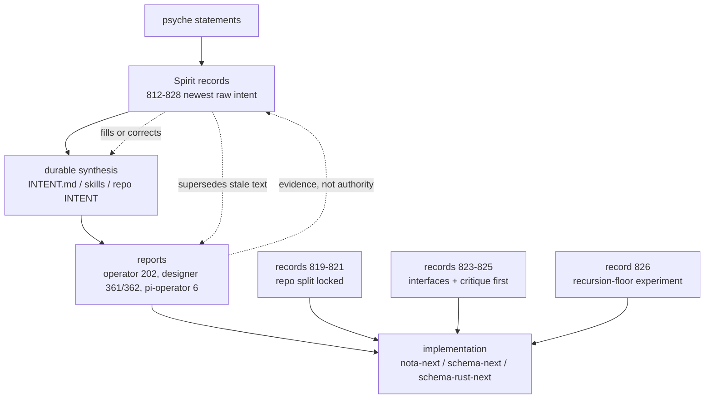

# Recent Spirit intent refresh — pi-operator

## Scope and sources

Previous pi-operator Spirit refresh stopped at record `811` (`2026-05-26 12:36:39`), with the bottom line that the NOTA/schema stack should start from delimiter-object NOTA, lower through schema macros to an assembled schema, emit Rust structurally, and keep Spirit/Signal/Sema contracts split by channel (`reports/pi-operator/6-recent-intent-reports-branch-read-2026-05-26/1-recent-intent.md` lines 3-7, 21, 31-33).

This refresh queried the deployed production Spirit CLI, confirmed by `readlink -f $(command -v spirit)` as `/nix/store/a7ym03j4h63grjkr6jkqk1y7v8rwxi22-spirit-v0.3.0/bin/spirit-v0.3.0`. Commands used:

```sh
spirit "(Observe Topics)"
spirit "(Observe (Records (None None WithProvenance)))"
spirit "(Observe (Records ((Some schema) None WithProvenance)))"
spirit "(Observe (Records ((Some nota) None WithProvenance)))"
spirit "(Observe (Records ((Some pi-operator) None WithProvenance)))"
```

Current observed log tail: **records 812-828**, newest `828` at `2026-05-26 13:54:22`. All records below are Spirit observations, not report inferences.

## File evidence retrieved

1. `INTENT.md` lines 38-83 — guidance/intent layering, Spirit as raw intent log, explicit supersession only by psyche.
2. `INTENT.md` lines 203-223 — NOTA bracket-only embedding-safe payload and CLI wrapping consequence.
3. `INTENT.md` lines 259-290 — schema-driven stack: one channel/contract/schema, data-only schemas, rkyv/NOTA/signal/sema vocabulary.
4. `skills/spirit-cli.md` lines 61-77, 145-176 — deployed Spirit one-argument NOTA invocation, record shape, observe shape.
5. `skills/nota-design.md` lines 169-227 — bracket strings, no quote strings, shell double-quote invocation, embedding-safety.
6. `skills/major-break-via-new-repo.md` lines 1-20, 52-65, 125-138, 183-188 — fresh repo exception, `-next` naming, old/new repo parallelism, cost threshold.
7. `skills/double-implementation-strategy.md` lines 39-75, 120-122 — operator/designer two-track method and a now-stale example that says `nota-next` branch.
8. `reports/pi-operator/6-recent-intent-reports-branch-read-2026-05-26/1-recent-intent.md` lines 3-33 — previous cut and prior bottom line.
9. `reports/operator/202-double-implementation-strategy-schema-stack-2026-05-26.md` lines 23-34, 124-141, 178-196 — operator-side strategy before records 819-821 settled open repo/name questions.
10. `reports/designer/361-latest-vision-schema-derived-nota-stack-2026-05-26.md` lines 35-49, 51-92, 94-179, 213-258, 260-298 — latest layered design, recursion-floor cut, repo strategy now partially stale.
11. `reports/designer/362-critique-of-operator-200-vision-correction-2026-05-26.md` lines 23-53, 60-82, 96-112, 135-153 — designer critique material and macro-position correction; repo strategy now superseded by later Spirit records.

## New Spirit records since 811 and supersession notes

| Record | Topics | Kind / magnitude | Durable content | Supersedes / refines |
|---:|---|---|---|---|
| 812 | `repository workflow operator designer` | Decision / Maximum | Operators create new replacement repos and work on their `main`; designers branch from that operator-created baseline. | Refines the broad designer-worktree/operator-main rule in `AGENTS.md` lines 323-333 by adding a fresh-replacement-repo exception. Supersedes previous report line 21's “NOTA branch in existing repo” implication when applied to stack replacements. |
| 813 | `repository workflow naming` | Decision / High | Use `next` suffix when a new repo upgrades a previous concept, not when it is a newly named concept. | Narrows `skills/major-break-via-new-repo.md` lines 52-65. |
| 814 | `schema repository workflow` | Decision / Maximum | Operator-created replacement repo `main` starts as an amalgamation of strongest prior prototype ideas. | Refines record 810 and operator report 202 lines 98-122: prototype audit is not just report input; it becomes the initial main baseline. |
| 815 | `workspace component-shape` | Decision / Maximum | Double implementation: operator track creates replacement repos; designer track runs worktree branches off operator main or design-prefixed repos; periodic comparison drives integration. | Expands 812 into durable workspace method; supersedes “new repo as merely escape hatch” framing in designer report 362 lines 23-32 and 104-112. |
| 816 | `workspace` | Decision / Maximum | Operator may work directly on `main` of **new concept-prototype repos**; production repos retain standard designer-feature/operator-rebase discipline. | Adds explicit exception to `AGENTS.md` lines 323-333 and limits it so production-track discipline still holds. |
| 817 | `workspace` | Decision / Maximum | Designer may create deletable `design-<concept>` repos for parallel exploration; delete after integration/retirement. | Adds a second design substrate beyond worktree branches in `skills/double-implementation-strategy.md` lines 61-75. |
| 818 | `workspace` | Principle / Maximum | Comparison is the integration mechanism; convergence is signal, divergence becomes psyche-review material; mitigates single-track drift. | Strengthens the intent-and-design engine in `INTENT.md` lines 28-36 with an implementation method. |
| 819 | `schema rust composer` | Decision / Maximum | Rust emission repo is `schema-rust-next`; Rust generation is separate from macros, with macros later/separate. | Resolves operator report 202's open composer-name question at lines 133-140 and 183-184. Supersedes the operator lean to `schema-composer` at lines 191-196. |
| 820 | `repository nota schema` | Decision / Maximum | Raw NOTA replacement repo is `nota-next`; it is the new NOTA implementation, not branch-only temporary surface. | Directly supersedes Spirit record 781 and prior report line 21 (“nota-next branch in existing nota repo”). Also makes `skills/double-implementation-strategy.md` lines 120-122 stale. |
| 821 | `schema repository` | Decision / Maximum | Schema-derived stack uses **separate repos** for `nota-next`, `schema-next`, `schema-rust-next`, not one combined integration repo. | Resolves operator report 202's open split question at lines 185-187 and supersedes the `nota-core-next` integration-sandbox framing in designer report 361 lines 213-258. |
| 822 | `forge schema rust` | Principle / Medium | Future forge may let generated Rust code become content-addressed crates, reducing separate generated-code repos outside Nix. | Medium future direction only; does not change current repo split from 819-821. |
| 823 | `schema implementation designer` | Constraint / Maximum | Before implementing schema-derived stack, operator reviews latest designer critique material and lets it shape implementation. | Elevates designer reports 361/362 from “interesting” to pre-implementation input. Fits `INTENT.md` lines 28-36: operator implements after intent + design are good enough. |
| 824 | `schema implementation interface` | Decision / Maximum | Next stack work implements concrete interfaces and presents them clearly; no report-only design loop. | Refines implementation readiness: reports are not enough; code/interface witness required. |
| 825 | `schema rust interface` | Constraint / Maximum | Presentation should especially show typical schema components and Rust code emission components as first-class interfaces. | Narrows 824 toward schema and Rust-emission interfaces. |
| 826 | `workspace component-shape` | Decision / Maximum | Designer parallel track tests the narrower recursion-floor cut: actually emit parts of `nota-codec` from `nota.schema`; outcome is load-bearing either way. | Challenges, but does not yet supersede, designer report 361 lines 84-92 where the wider hand-authored NOTA-core cut is adopted empirically. |
| 827 | `workspace design-nota-from-schema recursion-floor` | Decision / Maximum | A designer-assistant subagent records creation of `design-nota-from-schema` to test the narrower recursion-floor cut; feasibility outcome is load-bearing. | Operational echo of 826. I would not treat it as additional durable psyche intent beyond 826 because its text is first-person agent status; see capture hygiene note below. |
| 828 | `pi-operator reporting` | Constraint / Medium | This refresh should re-read current intent/reports, include visuals and code examples, and explicitly mark likes/dislikes. | Task-shape constraint for this meta-report, not a general schema-stack rule. |

## Current durable intent bullets

- **Spirit is the freshest raw intent surface.** `INTENT.md` says Spirit carries typed psyche statements and stores dense clarified descriptions with kind/magnitude/time; the intent layer outranks lower surfaces and supersession is explicit (`INTENT.md` lines 52-83). Current Spirit records 812-828 supersede stale report text where they conflict.
- **Use deployed `spirit` and one NOTA argument.** `skills/spirit-cli.md` lines 61-77 and 169-176 match the observed commands. Inline NOTA gets shell double quotes; NOTA strings are bracket forms, not quoted strings.
- **NOTA remains bracket-only and embedding-safe.** `INTENT.md` lines 203-223 plus `skills/nota-design.md` lines 169-227 make quote-free NOTA a load-bearing property, including CLI calls like `spirit "(Record (...))"`.
- **Schema remains data-contract architecture, not runtime effect logic.** `INTENT.md` lines 259-278: one channel equals one contract equals one schema; wire/storage/internal schemas split by boundary; schemas define data types only; schema specifies, signal moves, sema holds.
- **Major schema/NOTA work now goes through separate replacement repos.** The active split is `nota-next`, `schema-next`, `schema-rust-next` (records 819-821). The previous “branch in existing nota repo” and “maybe schema-composer or combined integration repo” language is stale.
- **Operator owns new replacement repo `main`; designer compares from a separate angle.** Records 812, 815-818: operator amalgamates prototypes into usable `main`; designer works from branches or deletable `design-<concept>` repos; comparison, not single-agent inference, drives convergence.
- **Prototype audit becomes implementation substrate.** Record 814 plus 823: operator must review latest designer critique/prototypes before implementation, and the initial `main` should be a best-of-prototypes amalgamation.
- **Implementation must show concrete interfaces.** Records 824-825: next work should expose schema component interfaces and Rust-emission interfaces, not remain only design prose.
- **NOTA structural floor is stable, but recursion floor is deliberately contested.** Existing durable shape: NOTA is a thin structural library with delimiter/source/object queries and `qualifies_as_*` candidates (`reports/designer/361` lines 35-49). New record 826 starts a parallel proof to see whether parts of `nota-codec` can be emitted from `nota.schema`; if it works, it changes the foundation.
- **Open carry-uncertainty persists.** Root field ordering from record 806 remains open (`reports/designer/361` lines 94-108). Recursion-floor Q2 is now actively being tested (`reports/designer/361` lines 260-284; Spirit record 826).

## Intent layering visual



Read direction: reports are useful witnesses, but newest Spirit records override stale report conclusions. Code should take its coordination surface from the current record set, then cite reports for design evidence.

## Good and risky NOTA / CLI snippets

### Good: observe current schema intent with deployed shape

```sh
spirit "(Observe (Records ((Some schema) None WithProvenance)))"
```

Why good: one CLI argument; `Observe` / `Records` shape matches `skills/spirit-cli.md` lines 169-176; `Some` wraps the topic filter; no flags.

### Good: record-shape example if capturing a future clarified psyche statement

```sh
spirit "(Record ([schema implementation interface] Decision [Implement concrete schema and Rust-emission interfaces rather than report-only design.] Maximum))"
```

Why good: topic vector first, then kind, bracket description, magnitude. This follows `skills/spirit-cli.md` lines 145-158. Do not run this unless it is actually psyche intent needing capture.

### Good: NOTA string form for shell embedding

```nota
[NOTA-in-anything-with-double-quote-strings is escape-free]
[|multi-line or bracket-safe content with [ and ] inside|]
```

Why good: bracket string and block string are canonical per `skills/nota-design.md` lines 169-189; no quote strings.

### Risky: flags and extra arguments

```sh
spirit --topic schema --kind Decision --format json
```

Why risky: violates single-argument component discipline and Spirit's NOTA operation surface (`skills/spirit-cli.md` lines 61-77; `AGENTS.md` lines 167-173).

### Risky: quoted strings inside NOTA

```sh
spirit "(Record ([schema] Decision "use schema-rust-next" Maximum))"
```

Why risky: quotation marks are not NOTA string syntax; canonical NOTA strings are bracket forms (`skills/nota-design.md` lines 169-207). It also breaks shell quoting unless escaped, destroying the whole embedding-safety point.

### Risky: labeled-record shape

```nota
(Record ((topics [schema]) (kind Decision) (description [x]) (magnitude Maximum)))
```

Why risky: NOTA records are positional, not labeled; the deployed Spirit record body is `([topics...] Kind [description] Magnitude)`, not `(key value)` pairs (`skills/spirit-cli.md` lines 145-158; `AGENTS.md` lines 201-205).

### Risky: single-quoted inline Spirit call with natural apostrophe

```sh
spirit '(Record ([schema] Decision [operator's baseline is main] Maximum))'
```

Why risky: the apostrophe terminates the shell string. The live skill explicitly prefers outer double quotes because NOTA itself never contains `"` (`skills/spirit-cli.md` lines 67-74; `skills/nota-design.md` lines 209-227).

## What I like about the current intent shape

1. **The new repo split is finally concrete.** Records 819-821 close the ambiguity in operator report 202 lines 178-196. `nota-next`, `schema-next`, and `schema-rust-next` are clearer than a conditional `schema-composer` / combined integration repo debate.
2. **Double implementation is a good anti-drift mechanism.** Records 815-818 make comparison structural. This matches the workspace engine: design and operator implementation check each other before action (`INTENT.md` lines 28-36).
3. **The operator baseline being an amalgamation is practical.** Record 814 prevents empty-repo ceremony: prior prototypes become evidence-bearing substrate, not dead branches. Operator report 202 lines 98-122 already lists what to mine.
4. **The interface-first instruction is healthy.** Records 824-825 push the stack out of report-only orbit. Concrete schema and Rust-emission interfaces are exactly the right witness for whether the schema-driven architecture works.
5. **The data/logic separation is holding.** `INTENT.md` lines 259-278 plus prior records keep schemas to data types and leave effects/runtime dispatch in Rust. That prevents old “schema defines effects/features” drift from returning.
6. **The recursion-floor experiment is the right kind of disagreement.** Record 826 does not settle by debate; it asks for empirical proof. If the narrower cut works, the foundation improves; if it fails, the wider kernel cut gains evidence.

## What I dislike or would audit closely

1. **Repo-strategy churn left stale guidance behind.** Previous report line 21, designer 361 lines 213-258, designer 362 lines 23-32 and 135-138, operator 202 lines 178-196, and `skills/double-implementation-strategy.md` lines 120-122 now conflict with records 819-821. Spirit wins, but agents opening those reports first can still be misled.
2. **Record 827 looks like a capture-hygiene smell.** Its description is first-person agent status (“I am the designer-assistant subagent...”), while `INTENT.md` lines 56-60 and `AGENTS.md` lines 210-219 frame Spirit as psyche-statement substrate. I would treat 826 as the durable psyche intent and 827 as operational evidence unless the parent confirms it came directly from psyche wording.
3. **Recursion-floor intent is intentionally unsettled.** Designer 361 lines 84-92 adopts the wider hand-authored NOTA-core cut; record 826 launches a narrower cut proof. That is good process, but any operator implementation must avoid hard-coding the wider cut as final until the design repo reports back.
4. **Root field ordering remains open.** Designer 361 lines 94-108 and 260-284 keep record 806 as carry-uncertainty. Imports-first is the current lean, not final psyche lock.
5. **`schema-rust-next` vs macro language needs clear boundary.** Record 819 says Rust emission is separate from macros, but existing reports often discuss `emit_schema!` as a macro/composer surface. Implementation should make the generated-Rust step first-class and keep Rust proc macros as a later consumer, not the architecture's center.
6. **Medium future forge intent should not destabilize today's repo split.** Record 822 is useful but only Medium. Do not use it to avoid creating `schema-rust-next` now; it is a future reduction path once forge can own content-addressed generated crates.

## Pi-operator bottom line

For immediate pi-operator/schema work: **treat records 812-828 as the active overlay on the previous report.** The durable direction is now separate replacement repos (`nota-next`, `schema-next`, `schema-rust-next`), operator-owned `main` seeded from prototype amalgamation, designer comparison track, concrete interface implementation, and explicit review of latest designer critiques before coding. Preserve prior NOTA/schema architecture unless the new recursion-floor experiment proves a narrower cut.