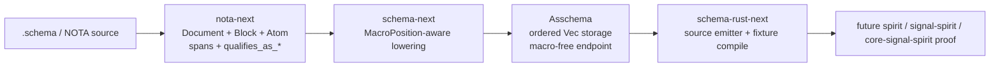

# Operator refresh — NOTA/schema implementation state, 2026-05-26

Read-only scout refresh after `reports/pi-operator/6-recent-intent-reports-branch-read-2026-05-26`. I inspected reports, locks, live repos, worktrees, and read-only jj/git status/log. I did not edit source or mutate jj/git state.

## Files Retrieved

1. `reports/operator/198-nota-structural-library-prototype-2026-05-26/0-frame-and-method.md` (lines 1-67) — prior operator structural-library implementation frame.
2. `reports/operator/198-nota-structural-library-prototype-2026-05-26/4-overview.md` (lines 1-151) — what landed in the schema operator prototype branch.
3. `reports/operator/199-nota-core-schema-stack-implementation-target-2026-05-26.md` (lines 1-220) — six-layer stack and first `nota-core-next` recommendation.
4. `reports/operator/200-latest-notacore-schema-vision-after-designer-359-2026-05-26.md` (lines 1-240) — correction toward existing repos, later superseded.
5. `reports/operator/201-operator-delta-after-designer-361-schema-derived-nota-stack-2026-05-26.md` (lines 1-174) — restores clean integration repo strategy after designer 361.
6. `reports/operator/202-double-implementation-strategy-schema-stack-2026-05-26.md` (lines 1-149) — current operator-side double-implementation strategy and suggested replacement repo split.
7. `reports/designer/364-mid-flight-code-inspection-2026-05-26.md` (lines 1-223) — latest cross-check of operator `nota-next` / `schema-next` and designer parallel work.
8. `/git/github.com/LiGoldragon/nota-next/src/parser.rs` (lines 17-171, 202-263) — current raw NOTA structural reader API.
9. `/git/github.com/LiGoldragon/nota-next/tests/block_queries.rs` (lines 1-75) — tests for spans, recursive shape, qualified symbols, and pipe text.
10. `/git/github.com/LiGoldragon/schema-next/src/asschema.rs` (lines 40-114) — ordered `Asschema` model.
11. `/git/github.com/LiGoldragon/schema-next/src/macros.rs` (lines 9-66) — position-aware macro trait.
12. `/git/github.com/LiGoldragon/schema-next/src/engine.rs` (lines 52-340) — current lowering engine and helper functions.
13. `/git/github.com/LiGoldragon/schema-next/tests/lowering.rs` (lines 1-96) — tests for ordered lowering and macro-position propagation.
14. `/git/github.com/LiGoldragon/schema-rust-next/src/lib.rs` (lines 22-177) — current Rust source emitter.
15. `/git/github.com/LiGoldragon/schema-rust-next/tests/emission.rs` (lines 1-35) and `tests/fixtures/spirit_generated.rs` (lines 1-64) — fixture/compile proof for emission.
16. `/home/li/wt/github.com/LiGoldragon/schema/operator-schema-driven-nota-parser-prototype-2026-05-26/src/object_block.rs` (lines 1-130, 205-286), `src/macro_pattern.rs` (lines 31-125), `src/nota_reader.rs` (lines 22-190) — prototype source material now superseded as target but still useful.
17. `/git/github.com/LiGoldragon/schema/ARCHITECTURE.md` (lines 1-28, 61-94), `src/shape_parser.rs` (lines 20-46), `src/multi_pass.rs` (lines 114-160), `src/engine.rs` (lines 1-43), `src/feature.rs` (lines 1-45) — stale six-position/features drift in old schema repo.
18. `/git/github.com/LiGoldragon/nota-codec/INTENT.md` (lines 23-41), `src/lexer.rs` (lines 154-169), `src/error.rs` (lines 115-124), `tests/horizon_rs_feedback_fixes.rs` (lines 170-214) — dirty intent file contradicting current quote-rejection code/tests.

## Current operator implementation target

The target has moved beyond the old schema worktree prototype. Operator report `202` makes replacement repositories the active strategy, and the repositories now exist with first operator-owned `main` commits:

- `nota-next` — raw NOTA structural floor.
- `schema-next` — position-aware schema macro engine plus ordered `Asschema`.
- `schema-rust-next` — Rust source emitter from `Asschema`.

The old `/home/li/wt/.../schema/operator-schema-driven-nota-parser-prototype-2026-05-26` branch remains important evidence and source material, but it is no longer the coordination surface for new work.



## Branch and worktree state

### Locks

Active operator lock:

- `/home/li/primary/orchestrate/operator.lock` claims `/home/li/primary/reports/operator` and `/git/github.com/LiGoldragon` for “implement schema-derived stack interfaces after designer critiques”.

Empty operator-adjacent locks:

- `cluster-operator.lock`
- `operator-assistant.lock`
- `pi-operator.lock`
- `second-operator.lock`
- `second-operator-assistant.lock`
- `primary-ngn8.lock`

Practical rule: pi-operator should not edit any `/git/github.com/LiGoldragon/*` repo while that broad operator lock is active. This report is the only write I made.

### New operator replacement repos

- `/git/github.com/LiGoldragon/nota-next`
  - status: clean
  - working copy `@`: `mptrmvxp` / `3fd57c60`, empty, no description
  - parent/main: `zxvuwkoz` / `0f21138d`, `bootstrap nota-next structural reader`

- `/git/github.com/LiGoldragon/schema-next`
  - status: clean
  - working copy `@`: `oumxonlq` / `c16e3ae4`, empty, no description
  - parent/main: `wopyrtpk` / `2558aaf5`, `bootstrap schema-next assembled schema engine`

- `/git/github.com/LiGoldragon/schema-rust-next`
  - status: clean
  - working copy `@`: `vrlowmqv` / `f53b224f`, empty, no description
  - parent/main: `wvvqvqpo` / `a290b7c7`, `bootstrap schema-rust-next source emitter`

### Old schema repo and worktrees

- `/git/github.com/LiGoldragon/schema`
  - status: clean
  - working copy `@`: `wryommku` / `9a80fd43`, empty, no description
  - parent: `qmvkpqqz` / `0e04c22`, bookmark `designer-schema-derived-nota-2026-05-26`, `schema: prototype block-by-block parser slice per records 774-777`
  - notable bookmarks include `operator-schema-driven-nota-parser-prototype-2026-05-26` at `skqzqpok` / `9dcc0244`, `schema: match macro shapes through structural nota blocks`, and `designer-schema-schema-prototype-2026-05-26` at `unvkvzzw` / `cc0c3405`, `schema: NOTA library narrowing + schema-schema as core Rust (records 799-807)`.

- `/home/li/wt/github.com/LiGoldragon/schema/operator-schema-driven-nota-parser-prototype-2026-05-26`
  - status: clean
  - `@`: `pqvlstmr` / `be3df64b`, empty
  - parent/bookmark: `skqzqpok` / `9dcc0244`, `schema: match macro shapes through structural nota blocks`

- `/home/li/wt/github.com/LiGoldragon/schema/operator-full-schema-spirit-2026-05-26`
  - status: clean
  - `@`: `zpkoxrpo` / `67ca79a3`, empty
  - parent/bookmark: `kwlkxtxs` / `2498e5b3`, `schema: add delimiter-first object pass`

- `/home/li/wt/github.com/LiGoldragon/schema/operator-schema-engine-338`
  - status: clean
  - `@`: `ryqtyntq` / `d007c4cd`, empty
  - parent/bookmark: `nwntkxsq` / `bfe4ff40`, `main operator/schema-engine-338`, `schema: use enum-shaped header endpoints`

- `/home/li/wt/github.com/LiGoldragon/schema/operator-node-shape-boundary`
  - status: clean
  - `@`: `nrurynyr` / `1fa037ac`, empty
  - parent/bookmark: `mtqmwksx` / `567ec839`, `schema: derive field names from types`

- `/home/li/wt/github.com/LiGoldragon/schema/fully-schema-and-nota-mvp`
  - status: clean
  - `@`: `kxxmyopy` / `22c8a746`, empty
  - parent: `ztwmlpsn` / `b754a0e4`, `schema: index macro candidates before lowering`

- `/home/li/wt/github.com/LiGoldragon/schema/designer-schema-derived-nota-2026-05-26`
  - git worktree, clean
  - HEAD: `0e04c22`, `schema: prototype block-by-block parser slice per records 774-777`

- `/home/li/wt/github.com/LiGoldragon/schema/designer-schema-schema-prototype-2026-05-26`
  - git worktree, clean
  - HEAD: `cc0c340`, `schema: NOTA library narrowing + schema-schema as core Rust (records 799-807)`

- Dirty/stale schema worktrees to avoid integrating blindly:
  - `designer-intent-cleanup-2026-05-26`: `M INTENT.md` on `xrxyxrmt` / `1b5c8037`, `schema: rewrite INTENT.md per psyche 2026-05-26 records 713-719`.
  - `designer-schema-full-stack-spirit-2026-05-25`: `M src/document.rs`, `M src/lib.rs`, `M src/multi_pass.rs` on `yuwtorqu` / `5533e5fa`, stale Features/effect-table line.
  - `designer-schema-poc-from-v0.3-main-2026-05-26`: `M src/engine.rs` on `uzuskuqq` / `2a5372f5`.

### Nota-codec

- `/git/github.com/LiGoldragon/nota-codec`
  - status: dirty, `A INTENT.md`
  - `@`: `qklotqmr` / `7b0896e9`, bookmark `nota-codec-intent-synthesis`, `nota-codec docs: synthesize INTENT.md — encoder canonical-emission, decoder migration-acceptance, embedding-safety contract`
  - parent/main: `rsltovoy` / `f761421c`, `nota-codec: reject quoted string delimiters`
  - important drift: added `INTENT.md` claims legacy quote-string acceptance, but current code/tests reject quote delimiters.

- `/home/li/wt/github.com/LiGoldragon/nota-codec/operator-nota-structural-shape-2026-05-26`
  - status: clean
  - `@`: `rlwsvlru` / `3da0b23d`, empty
  - parent/main: `rsltovoy` / `f761421c`, `nota-codec: reject quoted string delimiters`

### Designer parallel repo

- `/git/github.com/LiGoldragon/design-nota-from-schema`
  - status: dirty, all files added, no main bookmark yet
  - `@`: `qnppkzxk` / `13bd3c95`, no description
  - parent: root `zzzzzzzz` / `00000000`
  - role: designer parallel experiment, not current operator target.

## Key code I like

### `nota-next` has the right raw structural surface

`/git/github.com/LiGoldragon/nota-next/src/parser.rs` (lines 17-171, 202-263) is a good replacement-floor start: `Document::parse`, `Block::source_span`, `Block::reemit`, factual `is_*` methods, structural `qualifies_as_*` methods, and `demote_to_string` all live together.

```rust
pub fn reemit<'source>(&self, source: &'source str) -> &'source str {
    let span = self.source_span();
    &source[span.start.byte_offset..span.end.byte_offset]
}

pub fn qualifies_as_pascal_case_symbol(&self) -> bool {
    self.atom()
        .is_some_and(Atom::qualifies_as_pascal_case_symbol)
}

pub fn demote_to_string(&self) -> Option<&str> {
    match self {
        Self::Atom(atom) => Some(atom.text.as_str()),
        Self::PipeText(pipe_text) => Some(pipe_text.text.as_str()),
        Self::Delimited { .. } => None,
    }
}
```

The tests in `/git/github.com/LiGoldragon/nota-next/tests/block_queries.rs` (lines 1-75) pin the intended behavior rather than only testing happy parsing.

### `schema-next` corrected the position-blind macro issue

`/git/github.com/LiGoldragon/schema-next/src/macros.rs` (lines 9-66): `MacroPosition` goes into both `matches` and `lower`. This directly fixes the prototype weakness where the same square-bracket shape could lower as input even in output position.

```rust
pub trait SchemaMacro {
    fn name(&self) -> &'static str;

    fn matches(&self, object: &Block, position: MacroPosition) -> bool;

    fn lower(
        &self,
        object: &Block,
        position: MacroPosition,
        context: &mut MacroContext,
    ) -> Result<MacroOutput, SchemaError>;
}
```

### `Asschema` is ordered at the canonical layer

`/git/github.com/LiGoldragon/schema-next/src/asschema.rs` (lines 40-54) uses vectors for canonical storage and only derives lookup from the ordered data.

```rust
pub struct Asschema {
    pub identity: super::SchemaIdentity,
    pub imports: Vec<ImportDeclaration>,
    pub surfaces: Vec<RootSurface>,
    pub namespace: Vec<TypeDeclaration>,
}

impl Asschema {
    pub fn type_named(&self, name: &str) -> Option<&TypeDeclaration> {
        self.namespace
            .iter()
            .find(|declaration| declaration.name().as_str() == name)
    }
}
```

This is the right response to the old BTreeMap-order bug.

### `schema-rust-next` is separated from old signal macros

`/git/github.com/LiGoldragon/schema-rust-next/src/lib.rs` (lines 22-144) is a plain source emitter over `Asschema`, and `/git/github.com/LiGoldragon/schema-rust-next/tests/emission.rs` (lines 10-31) proves source fixture equality plus compiled fixture usability. No `signal_channel!` path appears in the emitter.

## Key code I dislike or would fence

### Non-test free functions violate the current Rust rule

The hard workspace rule says every Rust function is a method or associated function except `fn main` and test-module functions. These new repos have non-test free helpers:

- `/git/github.com/LiGoldragon/schema-next/src/engine.rs` (lines 252-279) has `fn lower_surface_variant(...)`.
- `/git/github.com/LiGoldragon/schema-next/src/engine.rs` (lines 340 onward) continues with `fn lower_fields(...)` and siblings.
- `/git/github.com/LiGoldragon/schema-rust-next/src/lib.rs` (lines 149-177) has `fn rust_type(...)` and `fn constant_name(...)`.

Example from `schema-rust-next/src/lib.rs`:

```rust
fn rust_type(reference: &TypeReference) -> String {
    match reference.name.as_str() {
        "Text" => "Text".to_owned(),
        "Integer" => "Integer".to_owned(),
        name => name.to_owned(),
    }
}

fn constant_name(name: &Name) -> String {
    let mut output = String::new();
```

Operator-safe cleanup: move these onto natural owners such as `impl SurfaceMacro`, `impl TypeDeclarationMacro`, `impl RustWriter`, or a small owner type.

### `schema-next` hard-codes a three-root MVP without isolating uncertainty

`/git/github.com/LiGoldragon/schema-next/src/engine.rs` (lines 62-93) rejects anything except three root objects and assumes imports, surfaces, namespace in that exact order.

```rust
if document.holds_root_objects() != 3 {
    return Err(SchemaError::ExpectedRootObjectCount {
        expected: 3,
        found: document.holds_root_objects(),
    });
}

let imports = self.lower_imports(document.root_object_at(0).expect("checked root count"), ...)?;
let surfaces = self.lower_surfaces(document.root_object_at(1).expect("checked root count"), ...)?;
let namespace = self.lower_namespace(document.root_object_at(2).expect("checked root count"), ...)?;
```

This is fine as a first MVP, but it crosses the open root-order/physical-layout uncertainty. The next operator should isolate the root layout behind one named type or enum before more code grows around positional indices.

### Old `schema` repo still teaches the stale six-position/features shape

`/git/github.com/LiGoldragon/schema/ARCHITECTURE.md` (lines 1-28, 61-94), `src/shape_parser.rs` (lines 20-46), and `src/multi_pass.rs` (lines 114-160) still treat six top-level values and `features` as the authored surface.

```rust
if self.values.len() != 6 {
    return Err(Error::InvalidSchemaText {
        context: "schema",
        message: format!("expected 6 top-level values, got {}", self.values.len()),
    });
}
```

That old repo is now predecessor material. It should not be used as the current implementation target except for mining tests and proven mechanics.

### `nota-codec` dirty INTENT contradicts live code

`/git/github.com/LiGoldragon/nota-codec/INTENT.md` (lines 23-41) says the decoder accepts legacy quoted strings. Current code in `src/lexer.rs` (line 162) rejects `"` with `QuoteStringDelimiter`, and tests in `tests/horizon_rs_feedback_fixes.rs` (lines 170-214) assert quoted and triple-quoted strings are rejected.

```rust
b'"' => Err(Error::QuoteStringDelimiter { offset: self.pos }),
```

Do not let that dirty `INTENT.md` become authoritative without correction.

## Risks, drift, and next operator-safe handoff notes

1. **Lock scope is broad.** `operator.lock` claims all `/git/github.com/LiGoldragon`; pi-operator should stay report-only until the lock narrows or releases.
2. **New replacement repos are the current target.** Start from `nota-next`, `schema-next`, and `schema-rust-next`, not the old schema prototype branch.
3. **Fix free functions early.** The new repos are young enough that moving helper functions onto owner types is cheap now and expensive later.
4. **Root layout needs a named seam.** Three-root MVP is implemented; root field ordering and physical-vs-logical section vocabulary remain drift-prone.
5. **Do not integrate stale Features branches.** Dirty `designer-schema-full-stack-spirit-2026-05-25` and old `/git/schema` feature surfaces still carry retracted schema `Features`/effect-table vocabulary.
6. **Resolve nota-codec guidance before reuse.** The code rejects quote delimiters; the dirty `nota-codec-intent-synthesis` file says otherwise.
7. **Cross-repo dependency ordering matters.** `schema-next` depends on `nota-next` by git branch `main`; `schema-rust-next` depends on `schema-next` by git branch `main`. Land lower-layer changes first or use an explicit local integration plan.
8. **No verification was run here.** I only inspected. Next operator should run the repos’ Nix/cargo checks before declaring the replacement stack green.

## Orchestrator update after scout completion

This scout captured a fast-moving moment. A later pi-operator read saw two state changes:

- `/git/github.com/LiGoldragon/design-nota-from-schema` is now clean at `qnppkzxk` / `95dc1137` (`Initial: design-nota-from-schema parallel exploration of narrower recursion-floor cut`), with `main` pushed. Designer report `reports/designer/363-design-nota-from-schema-comparison-2026-05-26.md` gives the verdict: type declarations can emit from `nota.schema`, but byte-recognition remains a hand-authored kernel floor.
- `/git/github.com/LiGoldragon/schema-rust-next` later showed `M src/lib.rs` in the working copy on empty descendant `vrlowmqv` / `e3397444` above `main` `a290b7c7`. Treat that as ongoing operator-owned work under the broad operator lock, not pi-operator material to edit.
