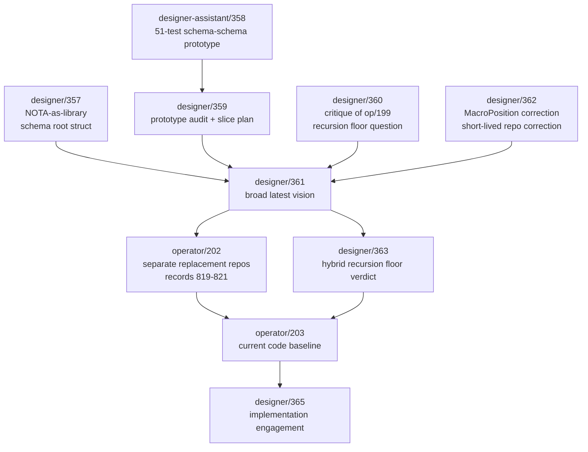
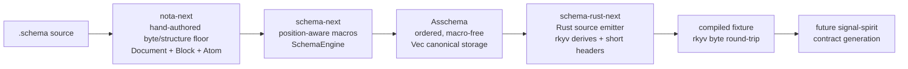
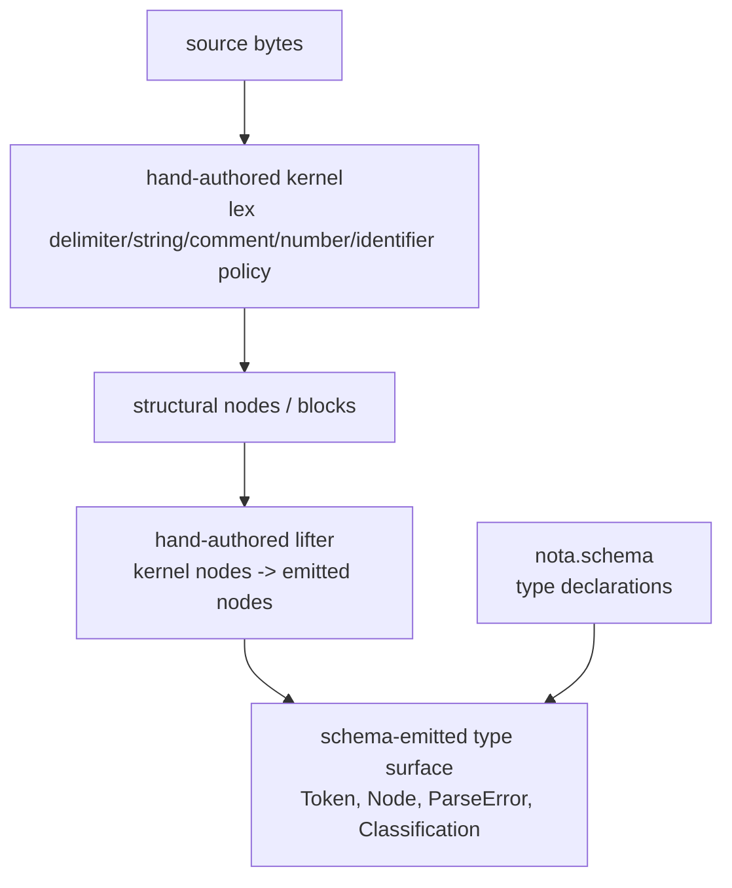
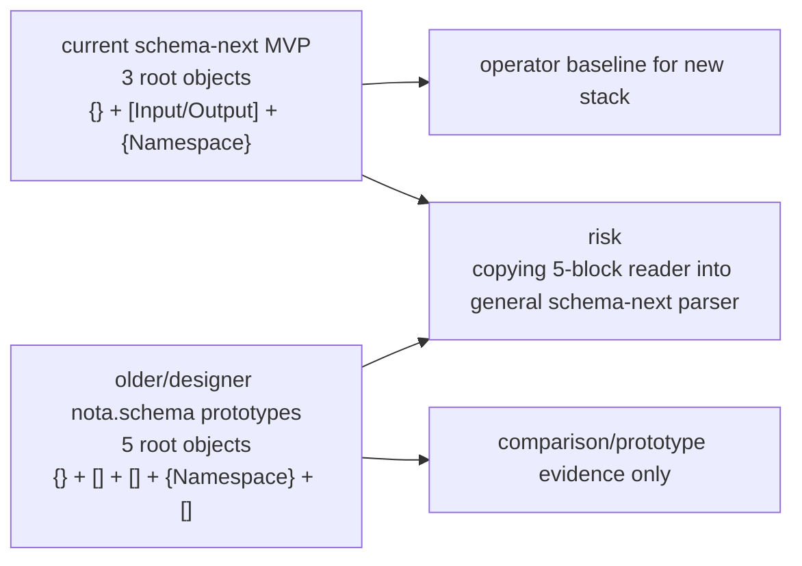

# Code Context

Read-only refresh for pi-operator. I inspected reports and source/checkouts only, did not run tests, did not mutate jj/git, and did not edit source. This file overwrites the earlier placeholder/fill-in for the assigned designer-refresh slice.

## Files Retrieved

1. `/home/li/primary/reports/designer/357-nota-as-library-schema-as-root-struct-2026-05-26.md` (lines 1-14, 24-92, 166-229) - prior refined vision; now status-bannered as superseded by `/361`, but still names the NOTA structural API, schema-schema, and field-ordering uncertainty.
2. `/home/li/primary/reports/designer-assistant/358-nota-library-schema-schema-prototype-2026-05-26.md` (lines 1-77, 189-254) - empirical prototype of records 799-807 with 51 tests, worktree/branch state, and open macro-position problems.
3. `/home/li/primary/reports/designer/359-implementation-target-design-from-prototype-audit-2026-05-26.md` (lines 1-260, 261-620) - best-parts audit and slice plan; important for survivals and anti-patterns.
4. `/home/li/primary/reports/designer/360-critique-of-operator-199-nota-core-implementation-target-2026-05-26.md` (lines 1-260) - critique that adds header derivation, schema diff/upgrade traits, Nix constraints, and recursion-floor question.
5. `/home/li/primary/reports/designer/361-latest-vision-schema-derived-nota-stack-2026-05-26.md` (lines 1-66, 94-213, 260-320) - broad current architecture map, Asschema, header derivation, schema diff, open questions, and late status update after `/363` + `/365`.
6. `/home/li/primary/reports/designer/362-critique-of-operator-200-vision-correction-2026-05-26.md` (lines 1-155) - captures `MacroPosition` in `lower` and the short-lived existing-branches-first correction.
7. `/home/li/primary/reports/designer/363-design-nota-from-schema-comparison-2026-05-26.md` (lines 1-251) - designer comparison verdict: type emission from `nota.schema` is feasible; byte recognition remains hand-authored.
8. `/home/li/primary/reports/designer/364-mid-flight-code-inspection-2026-05-26.md` (lines 1-279) - mid-flight source inspection; useful concerns, but partly overtaken by `/365` and current code.
9. `/home/li/primary/reports/designer/365-engagement-with-operator-203-schema-next-interface-2026-05-26.md` (lines 1-215) - latest designer engagement with concrete operator implementation across `nota-next`, `schema-next`, and `schema-rust-next`.
10. `/home/li/primary/reports/operator/202-double-implementation-strategy-schema-stack-2026-05-26.md` (lines 1-208) - supersedes repo-strategy portions of `/361`/`/362`; records 819-821 choose separate replacement repos.
11. `/home/li/primary/reports/operator/203-schema-next-interface-implementation-2026-05-26.md` (lines 1-318) - current implementation report with commits `6b4364d9`, `19591a7a`, `bfe0c7bb`, rkyv boundary, and known limits.
12. `/git/github.com/LiGoldragon/nota-next/src/lib.rs` (lines 1-14) - current replacement repo crate boundary and recursion-floor module docs.
13. `/git/github.com/LiGoldragon/nota-next/src/parser.rs` (lines 17-150, 251-515) - current structural NOTA reader: `Document`, `Block`, `AtomClassification`, parser, and remaining free helper functions.
14. `/git/github.com/LiGoldragon/nota-next/tests/block_queries.rs` (lines 1-70) - current tests for root-object order, recursive predicates, candidate classification, pipe text, and span errors.
15. `/git/github.com/LiGoldragon/schema-next/src/macros.rs` (lines 1-76) - current position-aware macro interface and one remaining free helper.
16. `/git/github.com/LiGoldragon/schema-next/src/asschema.rs` (lines 1-151) - current `Asschema` storage shape, private canonical vectors, accessors, and ordered type declarations.
17. `/git/github.com/LiGoldragon/schema-next/src/engine.rs` (lines 1-372) - current MVP lowering engine, three-root-object expectation, surface/type lowerers, and remaining free helpers.
18. `/git/github.com/LiGoldragon/schema-next/schemas/spirit-min.schema` (lines 1-13) - current MVP schema shape: `{imports}` + `[surfaces]` + `{namespace}`.
19. `/git/github.com/LiGoldragon/schema-next/tests/lowering.rs` (lines 1-98) - current lowering and macro-position tests.
20. `/git/github.com/LiGoldragon/schema-next/flake.nix` (lines 43-66) - current Nix checks, including scoped `no-btree-canonical` and `no-authored-features`.
21. `/git/github.com/LiGoldragon/schema-rust-next/src/lib.rs` (lines 1-172) - current Rust emitter, rkyv derives, short-header constants, and remaining free helpers.
22. `/git/github.com/LiGoldragon/schema-rust-next/tests/emission.rs` (lines 1-55) - current fixture comparison, compile-use test, and rkyv round-trip.
23. `/git/github.com/LiGoldragon/schema-rust-next/tests/fixtures/spirit_generated.rs` (lines 1-69) - current generated fixture with rkyv derives and short headers.
24. `/git/github.com/LiGoldragon/schema-rust-next/flake.nix` (lines 43-70) - current Nix checks for no old signal macro, no Rust macro surface, and generated rkyv boundary.
25. `/git/github.com/LiGoldragon/schema-rust-next/Cargo.toml` (lines 1-21) - current git dependency on `schema-next` main and rkyv dev-dependency.
26. `/git/github.com/LiGoldragon/design-nota-from-schema/crates/kernel/src/lib.rs` (lines 1-220) - comparison repo's explicit recursion-floor code documentation and kernel types.
27. `/git/github.com/LiGoldragon/design-nota-from-schema/crates/emit/src/lib.rs` (lines 1-180, 181-520) - comparison repo's 5-block reader, type emitter, BTreeMap derived index, content hash, and a stale/confusing ordering comment.
28. `/git/github.com/LiGoldragon/design-nota-from-schema/crates/integration/src/lifter.rs` (lines 1-76) - hand-authored kernel-to-emitted lifter, the strongest evidence for the hybrid recursion floor.
29. `/git/github.com/LiGoldragon/design-nota-from-schema/schemas/nota.schema` (lines 1-176) - enriched schema-derived type surface used by the comparison repo.
30. `/home/li/wt/github.com/LiGoldragon/schema/designer-schema-schema-prototype-2026-05-26/prototype/src/block_query.rs` (lines 1-306) - designer-assistant refined block query prototype.
31. `/home/li/wt/github.com/LiGoldragon/schema/designer-schema-schema-prototype-2026-05-26/prototype/src/schema_schema.rs` (lines 1-240) - designer-assistant schema-schema prototype with the pre-`MacroPosition` correction shape.
32. `/home/li/wt/github.com/LiGoldragon/schema/designer-schema-derived-nota-2026-05-26/prototype/src/blocks.rs` (lines 1-240) - designer-assistant block parser prototype with spans and recursive predicates.
33. `/home/li/wt/github.com/LiGoldragon/schema/designer-schema-derived-nota-2026-05-26/prototype/src/schema.rs` (lines 1-220) - older five-block/three-part schema reader prototype.
34. `/home/li/wt/github.com/LiGoldragon/nota/designer-schema-derived-nota-2026-05-26/schema/nota.schema` (lines 1-134) - old prototype foundational schema, useful but comment-heavy and partially superseded.

## Key Code

### Current designer architecture target and supersessions

The current target is a layered schema-derived stack with an honest hybrid recursion floor:

- **Superseded:** `/357` is explicitly status-bannered as superseded by `/361`; its API/naming substance survives, not its status as latest vision.
- **Absorbed:** `/358` proves the NOTA-library and schema-schema layer empirically, but its prototype macro shape was corrected later because `lower` must receive `MacroPosition`.
- **Absorbed with correction:** `/359` slice sequencing and anti-pattern list remain useful; repo targeting changed after records 819-821.
- **Partly superseded:** `/361` remains the broad architecture map, but its repo-strategy section is superseded by `/202` and `/203`: the active implementation surfaces are separate replacement repos, not `nota-core-next` and not the original `nota` repo's branch-only `nota-next`.
- **Updated by `/363`:** recursion floor is hybrid. Byte recognition stays hand-authored; schema-driven type declarations from `nota.schema` are feasible and worth absorbing.
- **Updated by `/365` + current code:** Rust emission over `Asschema`, short headers, Nix constraint checks, and rkyv boundary are now implemented in `schema-rust-next`, not merely aspirational.



### Like: position-aware macro lowering

`/358` discovered the position-blind bug; current `schema-next` has the corrected interface.

```rust
pub enum MacroPosition {
    RootImports,
    RootSurfaces,
    RootNamespace,
    Surface,
    NamespaceDeclaration,
    StructFields,
    EnumVariants,
}

pub trait SchemaMacro {
    fn name(&self) -> &'static str;
    fn matches(&self, object: &Block, position: MacroPosition) -> bool;
    fn lower(
        &self,
        object: &Block,
        position: MacroPosition,
        context: &mut MacroContext,
    ) -> Result<MacroOutput, SchemaError>;
}
```

Source: `/git/github.com/LiGoldragon/schema-next/src/macros.rs` lines 9-29.

### Like: Asschema canonical storage is private, ordered, and accessor-only

This answers `/364`'s public-field concern and preserves authored order.

```rust
pub struct Asschema {
    identity: super::SchemaIdentity,
    imports: Vec<ImportDeclaration>,
    surfaces: Vec<RootSurface>,
    namespace: Vec<TypeDeclaration>,
}

impl Asschema {
    pub fn imports(&self) -> &[ImportDeclaration] { &self.imports }
    pub fn surfaces(&self) -> &[RootSurface] { &self.surfaces }
    pub fn namespace(&self) -> &[TypeDeclaration] { &self.namespace }
}
```

Source: `/git/github.com/LiGoldragon/schema-next/src/asschema.rs` lines 40-80.

### Like: Nix checks turned design retractions into mechanical constraints

Current `schema-next` scoped the BTreeMap check to canonical storage, fixing `/365`'s false-positive concern.

```nix
no-btree-canonical = pkgs.runCommand "schema-next-no-btree-canonical" { } ''
  if grep -R "BTreeMap" ${src}/src/asschema.rs; then
    echo "BTreeMap must not be canonical assembled-schema storage" >&2
    exit 1
  fi
  touch $out
'';
no-authored-features = pkgs.runCommand "schema-next-no-authored-features" { } ''
  if grep -R "EffectTable\\|FanOutTargets\\|StorageDescriptor\\|Features" ${src}; then
    echo "retracted authored schema features are forbidden" >&2
    exit 1
  fi
  touch $out
'';
```

Source: `/git/github.com/LiGoldragon/schema-next/flake.nix` lines 47-60.

### Like: schema-rust-next now emits rkyv-capable fixture and tests bytes round-trip

This is newer than `/365`'s early status table and matches `/203`.

```rust
#[test]
fn generated_signal_input_round_trips_through_rkyv_bytes() {
    let input = generated::Input::Record(generated::Entry { /* ... */ });

    let bytes = rkyv::to_bytes::<rkyv::rancor::Error>(&input).expect("archive input");
    let decoded =
        rkyv::from_bytes::<generated::Input, rkyv::rancor::Error>(&bytes).expect("decode input");

    assert_eq!(decoded, input);
}
```

Source: `/git/github.com/LiGoldragon/schema-rust-next/tests/emission.rs` lines 39-55.

### Like: explicit recursion-floor marker in the comparison repo

This is the clearest documentation of the hybrid cut.

```rust
//! kernel — the bootstrap **recursion floor** of design-nota-from-schema.
//!
//! Every line in this crate is hand-authored Rust. NOTHING in this
//! crate emits from the schema; that direction would be circular —
//! the schema cannot be READ before code exists that knows how to
//! recognise NOTA delimiters in bytes.
```

Source: `/git/github.com/LiGoldragon/design-nota-from-schema/crates/kernel/src/lib.rs` lines 1-6.

### Dislike/risk: new repos still contain free helper functions

Workspace hard override forbids Rust free functions except tests and `fn main()`. Current new repos compile, but they still have non-test free helpers.

```rust
fn rust_type(reference: &TypeReference) -> String { /* ... */ }

fn constant_name(name: &Name) -> String { /* ... */ }
```

Source: `/git/github.com/LiGoldragon/schema-rust-next/src/lib.rs` lines 149-172. Similar issues: `/git/github.com/LiGoldragon/nota-next/src/parser.rs` lines 505-515 and `/git/github.com/LiGoldragon/schema-next/src/engine.rs` lines 258-280, 343-371.

### Dislike/risk: 5-block reader language is now dangerous to copy into schema-next

The comparison repo and older prototypes still speak five-block `nota.schema`; current `schema-next` MVP uses three root objects.

```rust
/// The source MUST be a 5-block top-level sequence per record 805.
pub fn read(source: &str) -> Result<SchemaModel, ReadError> {
    let mut kernel = Kernel::new(source);
    let blocks = kernel.parse_sequence().map_err(ReadError::Kernel)?;
    if blocks.len() != 5 {
        return Err(ReadError::UnexpectedTopLevelShape {
            expected_blocks: 5,
            actual_blocks: blocks.len(),
        });
    }
```

Source: `/git/github.com/LiGoldragon/design-nota-from-schema/crates/emit/src/lib.rs` lines 214-224. Current `schema-next` expects three root objects in `/git/github.com/LiGoldragon/schema-next/src/engine.rs` lines 73-81, and its fixture is `{}` + `[...]` + `{...}` in `/git/github.com/LiGoldragon/schema-next/schemas/spirit-min.schema` lines 1-13.

### Dislike/risk: misleading emitter comment

The comment says alphabetic sorting after natural order; the code just enumerates schema order. The behavior is right for order preservation, but the comment creates future confusion.

```rust
// Sort emissions alphabetically AFTER the natural declaration
// order, so multi-run emits are stable even if input ordering
// wobbles. We honour declaration order at the SOURCE; if the
// schema reorders bindings, output reorders deterministically.
// Use a stable index to preserve schema order.
for (index, declaration) in model.declarations().iter().enumerate() {
    Self::emit_one(&mut output, declaration, index);
}
```

Source: `/git/github.com/LiGoldragon/design-nota-from-schema/crates/emit/src/lib.rs` lines 418-424.

### Dislike/risk: prototype `nota.schema` files are comment-heavy and overclaim full codec emission

The old nota branch prototype says full encoder/decoder behavior emits from the namespace; `/363` refines this to type emission plus hand-authored byte recognition and lifter.

Source: `/home/li/wt/github.com/LiGoldragon/nota/designer-schema-derived-nota-2026-05-26/schema/nota.schema` lines 1-25 and `/git/github.com/LiGoldragon/design-nota-from-schema/schemas/nota.schema` lines 1-44.

## Architecture

### Current target stack



### Hybrid recursion floor



The important boundary: **types can emit from schema; byte-recognition policy cannot yet**. That is `/363`'s practical answer to record 746's maximal reading.

### Root-shape map



## Branch and worktree state

### Source/replacement repos under `/git/github.com/LiGoldragon`

| Path | Read-only state observed | Meaning for pi-operator |
|---|---|---|
| `/git/github.com/LiGoldragon/nota-next` | clean jj working copy; `main` at `6b4364d9` (`document nota recursion floor`) with empty `@` descendant `eb18416f` | Active raw NOTA replacement repo. Use this, not the old `nota` branch anchor, for current implementation state. |
| `/git/github.com/LiGoldragon/schema-next` | clean jj working copy; `main` at `19591a7a` (`scope btree constraint to assembled schema storage`) with empty `@` descendant `89fcd41b` | Active schema engine/Asschema repo. It already absorbed `/365`'s BTreeMap false-positive critique. |
| `/git/github.com/LiGoldragon/schema-rust-next` | clean jj working copy; `main` at `bfe0c7bb` (`track current schema-next main in emitter lock`) with empty `@` descendant `0a939b66` | Active Rust emission repo. Current fixture includes rkyv derives and byte round-trip test. |
| `/git/github.com/LiGoldragon/design-nota-from-schema` | clean jj working copy; `main` at `95dc1137` with empty `@` descendant `3cfcc7d2` | Designer comparison substrate; do not treat as production path. |
| `/git/github.com/LiGoldragon/spirit` | clean; `main` at `1d1ba727`; empty `@` descendant `167298fd` | Scaffold only; future consumer after generated contracts are ready. |
| `/git/github.com/LiGoldragon/signal-spirit` | clean; `main` at `8a87870e`; empty `@` descendant `357709dd` | Scaffold only. |
| `/git/github.com/LiGoldragon/core-signal-spirit` | clean; `main` at `bcd2d61d`; empty `@` descendant `acc92c8a` | Scaffold only. |
| `/git/github.com/LiGoldragon/schema` | clean; current `@` is empty `9a80fd43` over `designer-schema-derived-nota-2026-05-26` commit `0e04c22`; bookmarks include `designer-schema-schema-prototype-2026-05-26` at `cc0c340`, operator prototype at `9dcc0244`, main at `bfe4ff40` | Old/prototype source of ideas. Not the current coordination surface after `/202` and `/203`. |
| `/git/github.com/LiGoldragon/nota` | clean; current `@` on bookmark `nota-next` at `45a75433` over old `main` `8c23f39a`; `designer-schema-derived-nota-2026-05-26` at `abdd9db` | Old repo branch anchor and prototype schema. Current replacement is separate `/git/.../nota-next`. |

### Worktrees under `/home/li/wt/github.com/LiGoldragon`

| Worktree group | Observed state | Meaning |
|---|---|---|
| `schema/designer-schema-derived-nota-2026-05-26` | plain git worktree, clean at `0e04c22` | `/356` block parser prototype evidence. |
| `schema/designer-schema-schema-prototype-2026-05-26` | plain git worktree, clean at `cc0c340` | `/358` NOTA-library/schema-schema evidence. |
| `nota/designer-schema-derived-nota-2026-05-26` | plain git worktree, clean at `abdd9db` | old `nota.schema` authoring; comment-heavy prototype. |
| `schema/designer-intent-cleanup-2026-05-26` | jj worktree at `1b5c8037`, `M INTENT.md` | guidance cleanup branch, but now old relative to replacement-repo strategy. |
| `schema/designer-schema-full-stack-spirit-2026-05-25` | dirty; old effect-table/fan-out/storage work | Stale/retracted evidence. Avoid integration. |
| `schema/designer-schema-poc-from-v0.3-main-2026-05-26` | dirty `M src/engine.rs`; retracted POC surface | Stale/retracted evidence. Avoid integration. |
| `nota-codec/*` | several clean old worktrees; `designer-schema-derived-nota-2026-05-26` at `4f04b0e`; `operator-nota-structural-shape-2026-05-26` clean over main `f761421c` | Maintenance/prototype surfaces; current NOTA replacement is `nota-next`. |
| `signal-frame/*` | several old POC worktrees, some dirty; schema-derived docs branch at `07651ad`, main lineage `d61ebf2` | Do not mine old `signal_channel!`/feature-surface paths into `schema-rust-next`. |
| new `nota-next`, `schema-next`, `schema-rust-next` worktrees under `/home/li/wt` | none observed | Designer branches for replacement repos have not been set up under `~/wt` yet. |

## Practical implications for pi-operator

1. **Use the replacement repos as the current implementation truth.** For NOTA/schema work, start in `/git/github.com/LiGoldragon/nota-next`, `/git/github.com/LiGoldragon/schema-next`, and `/git/github.com/LiGoldragon/schema-rust-next`. Old `schema`/`nota` branches are prototype libraries, not current coordination surfaces.
2. **Carry the hybrid recursion-floor result.** Do not promise full byte-recognition emission from `nota.schema`. The current defensible split is: hand-authored kernel/byte policy; schema-emitted type declarations above it; hand-authored lifter unless a future mapping language is designed.
3. **Protect the no-Features boundary.** `schema-next` has a Nix check forbidding `EffectTable`, `FanOutTargets`, `StorageDescriptor`, and `Features`. Treat failures there as design protection, not nuisance.
4. **Fix free-function violations before canonizing new repos.** Current replacement code has free helper functions in non-test Rust. They need owner types/impl blocks before this line is held up as workspace-canonical.
5. **Do not conflate 3-root and 5-block shapes.** Current `schema-next` MVP uses 3 root objects. The 5-block reader belongs to older `nota.schema`/prototype evidence. If building a general parser, require a clear decision rather than silently mixing both.
6. **`schema-rust-next` is already beyond `/365`'s early table.** It emits rkyv derives and tests rkyv byte round-trip. Remaining gaps are NOTA readers/writers, dispatch tables, version projection, and full signal client/server code.
7. **Do not touch dirty old worktrees as part of current path.** Several stale `schema`/`signal-frame` worktrees are dirty and include retracted feature/effect surfaces. Read them only as anti-pattern/prototype context.

## Start Here

Open `/home/li/primary/reports/designer/365-engagement-with-operator-203-schema-next-interface-2026-05-26.md` first for designer's latest implementation engagement, then open `/home/li/primary/reports/operator/203-schema-next-interface-implementation-2026-05-26.md` and the three replacement repos to verify current code. For architecture rationale, use `/home/li/primary/reports/designer/363-design-nota-from-schema-comparison-2026-05-26.md` for the recursion-floor verdict and `/home/li/primary/reports/designer/361-latest-vision-schema-derived-nota-stack-2026-05-26.md` for the broad layer map.
