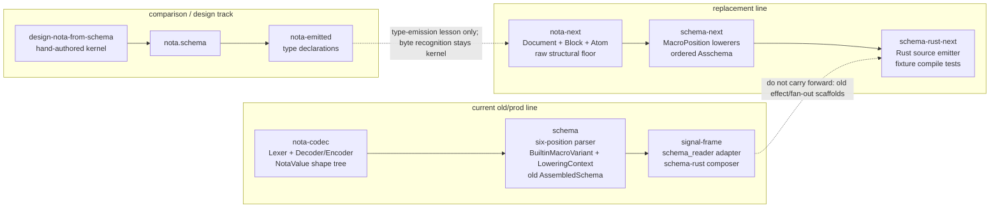

# Code Context

## Files Retrieved

1. `/home/li/primary/reports/pi-operator/6-recent-intent-reports-branch-read-2026-05-26/4-nota-designer-reports-and-branch.md` (lines 1-143) - baseline this refresh updates.
2. `/home/li/primary/reports/nota-designer/8-nota-schema-lowering-deviation-audit.md` (lines 1-20, 195-219, 303-316) - older nota-designer boundary: schema-owned lowering, data-carrying builtin macro inputs, and signal-frame adapter target.
3. `/home/li/primary/reports/nota-designer/9-operator-intent-capture-audit-schema-nota-shape-logic.md` (lines 20-42, 83-130) - latest nota-designer report; keeps `NotaValue` as shape substrate, not schema engine.
4. `/home/li/primary/reports/designer/361-latest-vision-schema-derived-nota-stack-2026-05-26.md` (lines 19-33, 35-92, 96-166, 301-338) - latest broad design before later repo-strategy supersession.
5. `/home/li/primary/reports/operator/202-double-implementation-strategy-schema-stack-2026-05-26.md` (lines 1-58, 60-82, 181-215) - current repo strategy: separate operator-owned replacement repos.
6. `/home/li/primary/reports/operator/203-schema-next-interface-implementation-2026-05-26.md` (lines 1-49, 51-184, 186-240) - first concrete `nota-next` / `schema-next` / `schema-rust-next` baseline.
7. `/home/li/primary/reports/designer/363-design-nota-from-schema-comparison-2026-05-26.md` (lines 1-79, 81-92, 251-266) - comparison proof: schema can emit codec types, not byte-recognition policy.
8. `/home/li/primary/reports/designer/364-mid-flight-code-inspection-2026-05-26.md` (lines 19-65, 67-154, 156-205) - designer read of live operator replacement code and comparison track.
9. `/git/github.com/LiGoldragon/nota-codec/src/lexer.rs` (lines 131-198) - quote rejection and bracket-string entry point.
10. `/git/github.com/LiGoldragon/nota-codec/src/value.rs` (lines 1-107, 216-267, 415-471) - generic `NotaValue` shape layer, record predicates, and sequence/block-string split.
11. `/git/github.com/LiGoldragon/nota-codec/src/encoder.rs` (lines 127-145, 274-301) - canonical bracket/bare/block string emission and escaping.
12. `/git/github.com/LiGoldragon/schema/src/shape_parser.rs` (lines 19-42, 79-113, 248-269) - current old-repo six-position parser and authored features.
13. `/git/github.com/LiGoldragon/schema/src/assembled.rs` (lines 8-67, 202-240) - old `AssembledSchema` canonical `BTreeMap` and route engine field.
14. `/git/github.com/LiGoldragon/schema/src/engine.rs` (lines 6-48, 50-120, 194-281) - old schema builtin macro inputs and lowering context.
15. `/git/github.com/LiGoldragon/schema/src/multi_pass.rs` (lines 1-85, 116-165) - old-repo `NotaValue`-driven multi-pass proof, still six-position.
16. `/git/github.com/LiGoldragon/schema/prototype/src/blocks.rs` (lines 76-175, 217-265) - designer prototype block/spans/recursive-predicate layer.
17. `/git/github.com/LiGoldragon/schema/prototype/src/macros.rs` (lines 1-96) - designer prototype macro shape classifier.
18. `/home/li/wt/github.com/LiGoldragon/schema/designer-schema-schema-prototype-2026-05-26/prototype/src/schema_schema.rs` (lines 136-239, 241-308, 316-389, 391-478) - `/358` schema-schema prototype and its known position-blind lowerer gap.
19. `/git/github.com/LiGoldragon/signal-frame/macros/src/schema_entry.rs` (lines 1-29) - `emit_schema!` now delegates through `schema::LoadedSchema` and `schema_rust::RustComposer`.
20. `/git/github.com/LiGoldragon/signal-frame/macros/src/schema_reader.rs` (lines 1-55, 57-115, 271-330) - `signal_channel!([schema])` adapter over `LoadedSchema` into legacy channel model.
21. `/git/github.com/LiGoldragon/signal-frame/schema-rust/src/lib.rs` (lines 55-105, 305-427) - current old composer still emits interaction/effect/fan-out/effect-table scaffolding.
22. `/git/github.com/LiGoldragon/nota-next/src/parser.rs` (lines 1-160, 201-275, 351-453) - replacement raw NOTA structural parser.
23. `/git/github.com/LiGoldragon/schema-next/src/macros.rs` (lines 1-75) - replacement position-aware macro trait.
24. `/git/github.com/LiGoldragon/schema-next/src/engine.rs` (lines 11-100, 103-180, 190-300) - replacement schema engine lowering source into `Asschema`.
25. `/git/github.com/LiGoldragon/schema-next/src/asschema.rs` (lines 1-130) - replacement ordered `Asschema` storage with accessor methods.
26. `/git/github.com/LiGoldragon/schema-rust-next/src/lib.rs` (lines 1-172) - replacement Rust source emitter and short-header constants.
27. `/git/github.com/LiGoldragon/design-nota-from-schema/crates/kernel/src/lib.rs` (lines 1-35, 178-235) - comparison kernel with explicit recursion-floor markers.
28. `/git/github.com/LiGoldragon/design-nota-from-schema/crates/emit/src/lib.rs` (lines 1-45, 47-110) - comparison emitter: schema-derived codec type declarations.
29. `/git/github.com/LiGoldragon/nota-codec/INTENT.md` (lines 7-41) and `/git/github.com/LiGoldragon/nota/README.md` (lines 37-76) - stale quote-acceptance guidance versus current code.
30. `/git/github.com/LiGoldragon/schema/INTENT.md` (lines 7-25) and `/home/li/wt/github.com/LiGoldragon/schema/designer-intent-cleanup-2026-05-26/INTENT.md` (lines 16-66) - old six-position guidance and the unintegrated cleanup branch.

## Key Code

### Current boundary, in one pass

There are now two live implementation lines plus one comparison track:

1. **Production/current old line**: `nota-codec` parses and encodes NOTA, exposes `NotaValue` for structural macro passes, `schema` consumes that shape through a six-position schema model, and `signal-frame` adapts `schema::LoadedSchema` into the old macro/composer paths.
2. **Replacement line**: `nota-next` is the raw structural NOTA floor, `schema-next` lowers it through position-aware macros into ordered `Asschema`, and `schema-rust-next` emits Rust source from `Asschema` without using the old signal macro.
3. **Comparison track**: `design-nota-from-schema` proves `nota.schema` can emit codec type declarations, but the byte recognizer and kernel-to-emitted lifter remain hand-authored.

### Snippets I like

`nota-codec` currently rejects quotation marks and reads strings only through bracket forms at string-like positions:

```rust
// /git/github.com/LiGoldragon/nota-codec/src/lexer.rs:162, 186-192
b'"' => Err(Error::QuoteStringDelimiter { offset: self.pos }),

pub(crate) fn read_string_after_opening_bracket(&mut self) -> Result<String> {
    if self.peek_byte() == Some(b'|') {
        self.pos += 1;
        self.read_block_string()
    } else {
        self.read_bracket_string()
    }
}
```

`nota-codec::NotaValue` is the right old-line shape substrate: it preserves record / sequence / map / atom and exposes predicate methods for macro dispatch without pretending to be the schema engine.

```rust
// /git/github.com/LiGoldragon/nota-codec/src/value.rs:20-25, 216-246
pub enum NotaValue {
    Record(Vec<NotaValue>),
    Sequence(Vec<NotaValue>),
    Map(Vec<NotaMapEntry>),
    Atom(NotaAtom),
}

pub fn record_head(&self) -> Option<&str> { ... }
pub fn has_data_shape(&self, expected_head: &str, expected_field_count: usize) -> bool { ... }
```

`schema-next` lands the `/200` correction: `MacroPosition` reaches both `matches` and `lower`, so the same delimiter shape can lower differently by role.

```rust
// /git/github.com/LiGoldragon/schema-next/src/macros.rs:8-30
pub enum MacroPosition {
    RootImports,
    RootSurfaces,
    RootNamespace,
    Surface,
    NamespaceDeclaration,
    StructFields,
    EnumVariants,
}

pub trait SchemaMacro {
    fn matches(&self, object: &Block, position: MacroPosition) -> bool;
    fn lower(
        &self,
        object: &Block,
        position: MacroPosition,
        context: &mut MacroContext,
    ) -> Result<MacroOutput, SchemaError>;
}
```

`schema-next` also fixes the old canonical-order problem by making `Vec` the storage for imports, surfaces, and namespace; lookup is derived by method, not canonical storage.

```rust
// /git/github.com/LiGoldragon/schema-next/src/asschema.rs:39-82
pub struct Asschema {
    identity: super::SchemaIdentity,
    imports: Vec<ImportDeclaration>,
    surfaces: Vec<RootSurface>,
    namespace: Vec<TypeDeclaration>,
}

pub fn namespace(&self) -> &[TypeDeclaration] { &self.namespace }
pub fn type_named(&self, name: &str) -> Option<&TypeDeclaration> { ... }
```

`signal-frame` has improved relative to nota-designer `/8`: `schema_reader.rs` is now an adapter over `schema::LoadedSchema`, not the private parser that report complained about.

```rust
// /git/github.com/LiGoldragon/signal-frame/macros/src/schema_reader.rs:1-5, 31-33
//! The schema language is parsed and assembled by the `schema` crate.
//! This module only translates the assembled signal shape into the
//! existing `signal_channel!` emission model.

let loaded = LoadedSchema::read_path(&path).map_err(|error| schema_error(&path, error))?;
SchemaConverter::new(&loaded).into_channel_spec()
```

### Snippets I do not like, or would not copy forward

The old `schema` repo still teaches and enforces six top-level values with a `features` vector. That is okay as compatibility substrate, but stale as current design truth.

```rust
// /git/github.com/LiGoldragon/schema/src/shape_parser.rs:26-41, 248-263
if self.values.len() != 6 { ... }
Schema::new(
    self.parse_imports(&self.values[0])?,
    self.parse_header(&self.values[1], "ordinary header")?,
    self.parse_header(&self.values[2], "owner header")?,
    self.parse_header(&self.values[3], "sema header")?,
    self.parse_namespace(&self.values[4])?,
    self.parse_features(&self.values[5])?,
)

match head {
    "Reply" => ...,
    "Event" => ...,
    "Observable" => ...,
    "Upgrade" => ...,
}
```

The current old `AssembledSchema` still uses `BTreeMap` for canonical type storage. New `schema-next` fixes this; do not port this shape forward.

```rust
// /git/github.com/LiGoldragon/schema/src/assembled.rs:8-14, 62-64
pub struct AssembledSchema {
    imports: Vec<ImportBinding>,
    routes: Vec<Route>,
    types: BTreeMap<Name, AssembledType>,
    features: Vec<Feature>,
}

pub fn types(&self) -> impl Iterator<Item = &AssembledType> {
    self.types.values()
}
```

The old `schema-rust` composer still emits runtime effect/fan-out/effect-table scaffolding from schemas. That is exactly the retracted territory the replacement repos fence out.

```rust
// /git/github.com/LiGoldragon/signal-frame/schema-rust/src/lib.rs:79-87, 410-423
let effect_items = self.effect_items(
    assembled,
    Leg::Ordinary,
    "Operation",
    "Effect",
    "FanOut",
    "FanOutOutput",
    "EffectTable",
)?;

pub struct #effect_table_ident;
impl #effect_table_ident {
    pub fn effect_for_operation(operation: #operation_ident) -> #effect_ident {
        operation.into()
    }
}
```

`nota-next` has the right raw-structure idea, but its current parser treats a single `;` as comment start while current NOTA spec says `;;` is the line-comment sigil. Verify before treating `nota-next` as grammar-complete.

```rust
// /git/github.com/LiGoldragon/nota-next/src/parser.rs:436-449
fn skip_spacing(&mut self) {
    match self.peek() {
        Some(';') => {
            while let Some(character) = self.peek() {
                self.bump();
                if character == '\n' { break; }
            }
        }
        _ => return,
    }
}
```

Several repos still have free functions in non-test Rust despite the new hard override that every Rust function is a method or associated function except tests and `main`. Examples include `nota-codec/src/value.rs:88-106`, `schema-next/src/macros.rs:57-65`, `schema-next/src/engine.rs:258-281`, and `schema-rust-next/src/lib.rs:149-172`. Treat this as a mechanical cleanup warning, not as an architecture blocker.

## Architecture



### What changed since the previous pi-operator nota-designer read

- There are no new files in `reports/nota-designer/` after report 9. The current boundary state moved through designer/operator reports `/361` through `/364` and operator `/202` through `/203`.
- The old `signal-frame` private schema-reader warning in nota-designer `/8` is partly fixed: `signal-frame/macros/src/schema_reader.rs` now calls `schema::LoadedSchema::read_path(...)` and translates assembled schema into the legacy channel model.
- The old `schema` crate now has more of the `/8` lowerer shape than the baseline implied: `BuiltinMacroVariant`, typed input structs, `LoweringContext`, and route engine propagation are present. But it is still six-position, feature-bearing, and `BTreeMap`-backed for canonical types.
- The active implementation target is now separate replacement repos: `nota-next`, `schema-next`, and `schema-rust-next` (operator `/202` and `/203`). Do not treat `nota-core-next` or existing old-branch names as the current coordination surface.
- The recursion-floor question is sharper: `/361` adopted a hand-authored raw NOTA floor; `/363` proved type declarations can emit from `nota.schema`, but byte recognition and lifting remain hand-authored.

### Boundary details

**Raw NOTA layer.** In old code, `nota-codec` owns production tokenization and typed decode/encode. Its generic `NotaValue` layer is useful for shape dispatch but deliberately not the schema engine. It treats `[|...|]` as a string atom and ordinary `[...]` as a `Sequence`; schema/typed positions decide later. In replacement code, `nota-next` is even thinner: `Document`, `Block`, `Atom`, spans, delimiter predicates, and `qualifies_as_*` candidate methods.

**Schema macro engine.** Old `schema` consumes `NotaValue` through six positions and lowers into old `AssembledSchema`. Replacement `schema-next` consumes `nota_next::Block` directly, uses `MacroPosition`, and lowers a three-root MVP shape into ordered `Asschema`: imports map, surface vector, namespace map.

**Signal/code adapters.** Old `signal-frame` has two paths: `emit_schema!` through `schema::LoadedSchema` + `schema_rust::RustComposer`, and `signal_channel!([schema])` through an adapter into the legacy channel model. Replacement `schema-rust-next` is source-emission only; it currently emits data types, root surface enums, and short-header constants, not NOTA readers/writers or full signal contracts.

## Branch / Worktree State

Observed read-only with `jj status`, `jj log`, and `jj workspace list`.

| Repo | Current observed state | Notes |
|---|---|---|
| `/home/li/primary` | Dirty before this report: `M protocols/active-repositories.md`, `A reports/operator/203-schema-next-interface-implementation-2026-05-26.md`, `M skills/double-implementation-strategy.md`; `@` change `tksvusqn` / commit `cbabf438` (empty no-description working copy) over `main` commit `7cdefa27` (`/364 mid-flight code inspection`) | This report adds its own file under `reports/pi-operator/7-.../`. |
| `/git/github.com/LiGoldragon/nota` | Clean. `@` bookmark `nota-next` at `45a75433` (`nota: next-branch start for schema-derived stack changes`) over `main` `8c23f39a` | This is the old `nota` repo with a branch marker, not the new `nota-next` repo. Designer worktree has `schema/nota.schema` at bookmark `designer-schema-derived-nota-2026-05-26` commit `abdd9db2`. |
| `/git/github.com/LiGoldragon/nota-codec` | Dirty with `A INTENT.md`. `@` bookmark `nota-codec-intent-synthesis` at `7b0896e9` over `main` `f761421c` (`nota-codec: reject quoted string delimiters`) | The dirty `INTENT.md` conflicts with code by claiming legacy quote acceptance. |
| `/git/github.com/LiGoldragon/schema` | Clean default workspace at empty change `9a80fd43` over `designer-schema-derived-nota-2026-05-26` commit `0e04c22f` | Important bookmarks: `designer-schema-schema-prototype-2026-05-26` at `cc0c3405`, `operator-schema-driven-nota-parser-prototype-2026-05-26` at `9dcc0244`, `main` at `bfe4ff40`. |
| `/git/github.com/LiGoldragon/signal-frame` | Clean default workspace at empty change `84465aab` over `main` `d61ebf25` (`signal-frame: constrain schema boxed nota codecs`) | Designer schema-derived docs branch exists at `07651adb`; old full-stack POC branches still present. |
| `/git/github.com/LiGoldragon/nota-next` | Dirty with `M src/lib.rs` (8 doc insertions). `@` change `f7f6af8b` over `main` `0f21138d` (`bootstrap nota-next structural reader`) | New replacement repo, operator-owned `main`; current dirty edit only documents recursion-floor role. |
| `/git/github.com/LiGoldragon/schema-next` | Dirty with `M src/asschema.rs`, `M src/engine.rs`, `M tests/lowering.rs`. `@` change `10b98e68` over `main` `2558aaf5` (`bootstrap schema-next assembled schema engine`) | Dirty changes make `Asschema` fields private with accessors and route users through `Asschema::new`. |
| `/git/github.com/LiGoldragon/schema-rust-next` | Dirty with `M src/lib.rs`. `@` change `fbef7f9d` over `main` `a290b7c7` (`bootstrap schema-rust-next source emitter`) | Dirty changes consume `Asschema` through accessors. |
| `/git/github.com/LiGoldragon/design-nota-from-schema` | Clean empty `@` change `3cfcc7d2` over `main` `95dc1137` (`Initial: design-nota-from-schema parallel exploration of narrower recursion-floor cut`) | Comparison repo, not replacement target. |

## Stale Guidance / Conflict Warnings

1. **Quote-string guidance conflict remains.** `nota-codec/src/lexer.rs:162` rejects `"` with `QuoteStringDelimiter`, but `/git/github.com/LiGoldragon/nota-codec/INTENT.md:27-41` still says the decoder accepts legacy quoted strings through `read_legacy_quote_string`; `/git/github.com/LiGoldragon/nota/README.md:74-76` repeats the same claim.
2. **Old `schema` repo INTENT is stale relative to the replacement target.** `/git/github.com/LiGoldragon/schema/INTENT.md:9-21` still says six fixed positional fields and feature-carried upgrade annotations. The cleanup branch `/home/li/wt/.../schema/designer-intent-cleanup-2026-05-26/INTENT.md:16-66` says schemas define data types only and no authored Features section, but that is not the default `/git` checkout.
3. **Repo strategy supersession chain matters.** `/361` still carries useful six-layer architecture, but `/202` supersedes its repo-strategy portions: the current active method is separate `nota-next`, `schema-next`, and `schema-rust-next` repos, not conditional `nota-core-next`.
4. **Physical schema shape is still in transition.** Old `schema` is six top-level values; `/358` and `design-nota-from-schema` use five-block/five-position vocabulary; `schema-next` currently accepts a three-root MVP (`{imports} [surfaces] {namespace}`). Before integrating, align code vocabulary with the latest root-struct model so agents do not confuse logical sections with physical top-level blocks.
5. **Old signal composer still emits retracted runtime surfaces.** `signal-frame/schema-rust` emits effect/fan-out/effect-table scaffolding. `schema-rust-next` correctly starts fresh and fences `signal_channel!`, but old `signal-frame` should be treated as legacy/reference for this boundary.
6. **Free-function hard override cleanup is pending.** New and old code both contain non-test free functions. If an operator edits these areas, make the next touch move helpers under natural owner types rather than adding more free helpers.
7. **`nota-next` is not grammar-complete yet.** It is the right raw structural direction, but current code treats single `;` as comment and has no inline `[text]` string handling at raw layer beyond ordinary square-bracket structure. That may be intended raw-layer minimalism; it still needs explicit tests against the NOTA spec before becoming canonical.
8. **Designer comparison narrows only the type-declaration cut.** `/363` is strong evidence that `nota.schema` can emit codec type declarations, not evidence that the byte recognizer should be schema-emitted now.

## Start Here

Start with `/home/li/primary/reports/operator/203-schema-next-interface-implementation-2026-05-26.md` because it is the first concrete implementation report after the repo-strategy decisions. Then open `/git/github.com/LiGoldragon/schema-next/src/macros.rs` to see the current boundary contract (`MacroPosition` in `matches` and `lower`) and `/git/github.com/LiGoldragon/nota-next/src/parser.rs` for the raw NOTA floor it consumes.

## Supervisor coordination

No supervisor contact needed; this was read-only scouting plus the requested report write.
