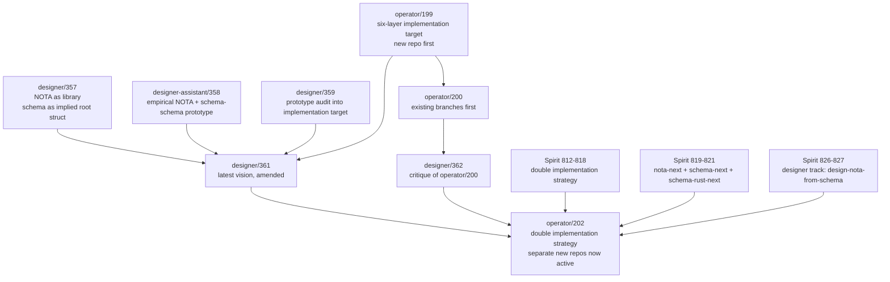
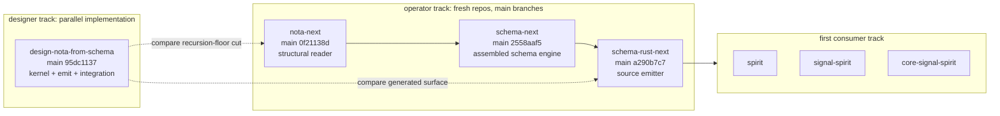
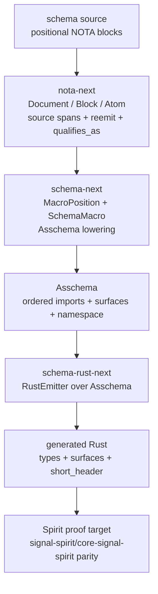
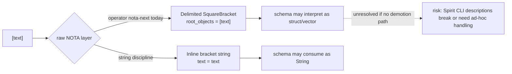
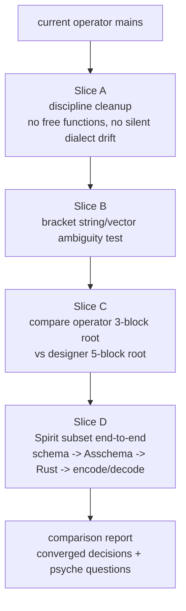
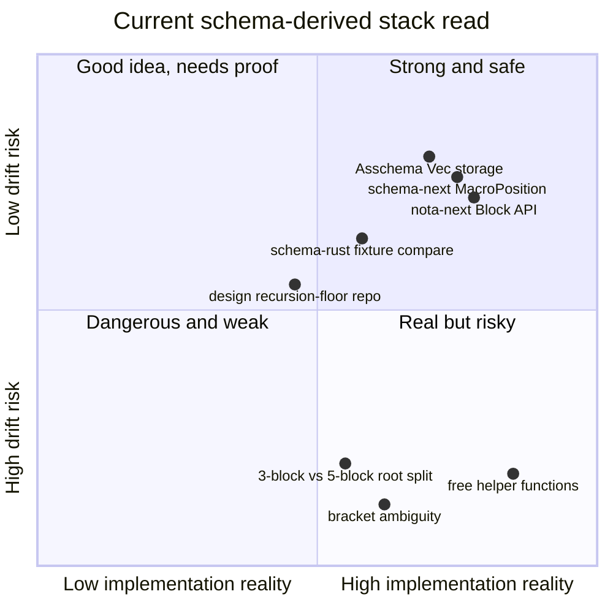

# Overview — refreshed intent/report/code visual audit

## Executive refresh

The biggest change since `reports/pi-operator/6-recent-intent-reports-branch-read-2026-05-26` is that the repo strategy moved again and then landed in source:

- The earlier conditional `nota-core-next` / existing-branch debate is now superseded by Spirit records `812-821` and operator report `202`.
- The active operator track is separate replacement repositories: `nota-next`, `schema-next`, and `schema-rust-next`, with operators allowed to work on `main` because these are fresh concept-prototype repos.
- The designer parallel track has begun in `design-nota-from-schema`, exploring the narrower recursion-floor cut: actually emit NOTA codec types from `nota.schema`.
- The current implementation question is no longer "should we make new repos?" It is "do these operator mains and the designer design repo converge, and where do they diverge enough to ask psyche?"
- While this refresh was running, new reports landed: operator `/203` documents the first concrete `nota-next` / `schema-next` / `schema-rust-next` interface baseline; designer `/363` reports the `design-nota-from-schema` recursion-floor experiment as partially feasible; designer `/364` inspects the two tracks mid-flight.

My read: the work is moving in the right direction. I like the new repo split and the first concrete interfaces. I dislike that the fresh implementation already carries a few old hazards: free functions in non-test Rust, two competing root-block counts, and not-yet-explicit bracket string ambiguity.

## Current supersession map



Practical interpretation:

- Use `operator/202` for repository strategy.
- Use `operator/203` for the first concrete interface baseline across `nota-next`, `schema-next`, and `schema-rust-next`.
- Use `designer/363` for the latest recursion-floor comparison verdict: type emission from `nota.schema` is feasible; byte recognition remains kernel work.
- Use `designer/364` for live code-inspection notes and convergence/divergence warnings.
- Use `designer/361` for architecture, but read its repo-strategy section as amended/superseded.
- Use `operator/199`, `operator/200`, `designer/359`, and `designer-assistant/358` as prototype evidence and implementation details, not final coordination truth.

## Fresh intent layer

Latest relevant records from the refreshed Spirit read:

| Records | Current meaning |
|---|---|
| `799-807` | NOTA is structural; schema-schema is the macro interface; root schema is implied by `.schema`; field ordering remains open. |
| `808` | `jj` editor-opening failures need lower-level cheat-sheet reinforcement. |
| `809-811` | Major architectural breaks can and should use new `-next` / longer-named prototype repos when old repo invariants contaminate work. |
| `812-818` | Double-implementation strategy: operator owns new repos' `main`; designer works from that baseline or design-prefixed repos; comparison is the integration mechanism. |
| `819-821` | The schema-derived stack splits into `nota-next`, `schema-next`, and `schema-rust-next`; rust emission is separate from macros. |
| `823-825` | Before implementation, operator should review designer critiques and present concrete schema/Rust interfaces, not report-only design. |
| `826-827` | Designer parallel implementation begins in `design-nota-from-schema`, focused on the narrower recursion-floor question: can nota-codec-like types emit from `nota.schema`? |
| `828` | This pi-operator refresh should include visuals, code, likes, and dislikes. |

## Current repo state snapshot



Observed state:

| Repo | State | Comment |
|---|---|---|
| `/git/github.com/LiGoldragon/nota-next` | clean, `main` at `0f21138d` (`bootstrap nota-next structural reader`) | Good operator main baseline. |
| `/git/github.com/LiGoldragon/schema-next` | clean, `main` at `2558aaf5` (`bootstrap schema-next assembled schema engine`) | Good operator main baseline. |
| `/git/github.com/LiGoldragon/schema-rust-next` | `main` at `a290b7c7` (`bootstrap schema-rust-next source emitter`), live working copy has `M src/lib.rs` | Now a real pushed jj/git repo; current dirty change appears to be ongoing operator work and should remain read-only for pi-operator. |
| `/git/github.com/LiGoldragon/design-nota-from-schema` | clean, `main` at `95dc1137` (`Initial: design-nota-from-schema parallel exploration of narrower recursion-floor cut`) | The designer experiment is now pushed and report `/363` gives the feasibility verdict. |
| `/git/github.com/LiGoldragon/nota-codec` | dirty `A INTENT.md` on `nota-codec-intent-synthesis` | Still a guidance-drift risk because quote/string migration language may conflict with current quote rejection. |

## Stack architecture — current best picture



What I like here: each layer has a data object boundary. NOTA is not pretending to be schema. Schema is not pretending to be codegen. Rust emission is not pretending to be macro parsing.

What I dislike: the boundaries are only partially enforced in code right now. The code shows the right skeleton, but the next slices need to turn the skeleton into invariant tests before agents start building expectations on top.

## Like #1 — `nota-next` exposes a clean structural object

From `/git/github.com/LiGoldragon/nota-next/src/parser.rs`:

```rust
#[derive(Clone, Debug, Eq, PartialEq)]
pub enum Block {
    Delimited {
        delimiter: Delimiter,
        span: SourceSpan,
        root_objects: Vec<Block>,
    },
    PipeText(PipeText),
    Atom(Atom),
}

impl Block {
    pub fn source_span(&self) -> SourceSpan { ... }

    pub fn reemit<'source>(&self, source: &'source str) -> &'source str { ... }

    pub fn is_parenthesis(&self) -> bool { ... }
    pub fn is_square_bracket(&self) -> bool { ... }
    pub fn is_brace(&self) -> bool { ... }

    pub fn holds_root_objects(&self) -> usize { ... }
    pub fn root_object_at(&self, index: usize) -> Option<&Block> { ... }

    pub fn qualifies_as_symbol(&self) -> bool { ... }
    pub fn qualifies_as_pascal_case_symbol(&self) -> bool { ... }
    pub fn qualifies_as_camel_case_symbol(&self) -> bool { ... }
    pub fn qualifies_as_kebab_case_symbol(&self) -> bool { ... }
}
```

Why I like it:

- It matches the `is_*` factual delimiter vs `qualifies_as_*` candidate-classification discipline from records `799-803`.
- It keeps spans and `reemit` close to the structural object, so diagnostics and exact source witnesses are possible.
- It gives schema macros a small, memorable vocabulary.

## Dislike #1 — `nota-next` currently has free helpers in non-test Rust

From `/git/github.com/LiGoldragon/nota-next/src/parser.rs`:

```rust
fn is_opening_delimiter(character: char) -> bool {
    matches!(character, '(' | '[' | '{')
}

fn is_closing_delimiter(character: char) -> bool {
    matches!(character, ')' | ']' | '}')
}

fn is_symbol_character(character: char) -> bool {
    character.is_ascii_alphanumeric() || matches!(character, '_' | '-')
}
```

Why I dislike it:

- Workspace hard override says every Rust function is a method or associated function on an `impl` block except tests and `fn main`.
- These are exactly the kind of orphan helpers the rule is meant to prevent.
- Natural owners exist: `Delimiter::is_opening_character`, `Delimiter::is_closing_character`, and `AtomClassification::is_symbol_character` or `SymbolAlphabet::contains`.

This is small mechanically, but high-signal culturally: fresh repos should start pristine on the discipline rules.

## Like #2 — `schema-next` threads macro position into lowering

From `/git/github.com/LiGoldragon/schema-next/src/macros.rs`:

```rust
pub trait SchemaMacro {
    fn name(&self) -> &'static str;

    fn matches(&self, object: &Block, position: MacroPosition) -> bool;

    fn lower(
        &self,
        object: &Block,
        position: MacroPosition,
        context: &mut MacroContext,
    ) -> Result<MacroOutput, SchemaError>;
}
```

Why I like it:

- This absorbs the concrete critique from `designer/362`: shape alone is insufficient because the same delimiter shape means different things in different root positions.
- It makes the macro engine honest: `matches` and `lower` see the same role information.
- It gives tests a hook: `macro_lowering_receives_macro_position` already proves the position reaches the macro.

## Dislike #2 — `schema-next` still has non-test free lowering functions

From `/git/github.com/LiGoldragon/schema-next/src/engine.rs`:

```rust
fn lower_surface_variant(object: &Block) -> Result<EnumVariant, SchemaError> { ... }

fn lower_fields(object: &Block) -> Result<Vec<FieldDeclaration>, SchemaError> { ... }

fn lower_enum_variants(object: &Block) -> Result<Vec<EnumVariant>, SchemaError> { ... }
```

Why I dislike it:

- Same free-function violation as `nota-next`.
- These have excellent type owners: `SurfaceMacro`, `TypeDeclarationMacro`, `FieldDeclaration`, `EnumDeclaration`, or a small `SurfaceVariantLowerer` type.
- Moving them behind owners would clarify which lowering belongs to macro dispatch and which belongs to declaration assembly.

## Like #3 — `Asschema` is finally order-preserving by construction

From `/git/github.com/LiGoldragon/schema-next/src/asschema.rs`:

```rust
#[derive(Clone, Debug, Eq, PartialEq)]
pub struct Asschema {
    pub identity: super::SchemaIdentity,
    pub imports: Vec<ImportDeclaration>,
    pub surfaces: Vec<RootSurface>,
    pub namespace: Vec<TypeDeclaration>,
}
```

Why I like it:

- `Vec` as canonical storage carries the order-preservation lesson from operator `/195` and designer `/359`.
- Lookup can be derived later; the source truth remains ordered.
- `imports`, `surfaces`, and `namespace` are straightforward enough for generated fixtures.

## Dislike #3 — root shape is still split across dialects

Current operator `schema-next` tests use a 3-block shape:

```rust
let source = "{} [] { Entry [Topic Kind] Kind (Decision Constraint) }";
```

Designer `design-nota-from-schema/schemas/nota.schema` uses a 5-block shape:

```nota
{
}

[]

[]

{
  Delimiter (Parenthesis SquareBracket Brace BlockString)
  TokenKind (RecordOpen RecordClose VectorOpen VectorClose MapOpen MapClose)
}

[]
```

Why I dislike it:

- Both may be legitimate experiments, but they cannot both be silent defaults.
- The reports already carry root-field-order uncertainty (`record 806`) and empty-section uncertainty; the code now also carries root-section-count uncertainty.
- This is exactly where double implementation should compare and produce a psyche-facing question or a convergence decision.

A good next report should say: "operator 3-block root vs designer 5-block root: here is what each buys and costs; choose or map them explicitly."

## Like #4 — `schema-rust-next` proves the composer is a separate artifact

From `/git/github.com/LiGoldragon/schema-rust-next/tests/emission.rs`:

```rust
#[test]
fn emits_rust_source_as_a_separate_artifact() {
    let source = include_str!("fixtures/spirit-min.schema");
    let asschema = SchemaEngine::default()
        .lower_source(source, SchemaIdentity::new("spirit", "0.1.0"))
        .expect("schema lowers");
    let generated = RustEmitter.emit_file(&asschema);

    assert_eq!(generated.path, "spirit.rs");
    assert_eq!(
        generated.code.as_str(),
        include_str!("fixtures/spirit_generated.rs")
    );
}
```

Why I like it:

- This is the compiled-fixture direction: generate source, compare it, include it, use it.
- It avoids the stale `signal_channel!` reuse path.
- It presents Rust emission as its own interface, matching records `819` and `825`.

## Dislike #4 — `schema-rust-next` is still too shallow to trust as composer architecture

Current emitter excerpt:

```rust
fn rust_type(reference: &TypeReference) -> String {
    match reference.name.as_str() {
        "Text" => "Text".to_owned(),
        "Integer" => "Integer".to_owned(),
        name => name.to_owned(),
    }
}

fn constant_name(name: &Name) -> String { ... }
```

Why I dislike it:

- It has non-test free helpers.
- It only emits type shells and short-header constants; it does not yet emit NOTA readers/writers, rkyv/archive surfaces, upgrade/downgrade traits, or real dispatch checks.
- That is fine for a bootstrap, but the report language around it should keep saying "source emitter baseline," not "composer complete."

## Like #5 — designer track directly tests the recursion-floor disagreement

From `/git/github.com/LiGoldragon/design-nota-from-schema/crates/kernel/src/lib.rs`:

```rust
//! kernel — the bootstrap **recursion floor** of design-nota-from-schema.
//!
//! Every line in this crate is hand-authored Rust. NOTHING in this
//! crate emits from the schema; that direction would be circular —
//! the schema cannot be READ before code exists that knows how to
//! recognise NOTA delimiters in bytes.
```

Why I like it:

- It names the recursion floor honestly instead of smuggling the cut into implementation.
- It directly tests the designer critique from records `826-827`: can the surface above the byte/delimiter kernel emit from `nota.schema`?
- It gives the double-implementation strategy something real to compare against operator `nota-next`.

## Dislike #5 — the design repo graduated, but its verdict changes the comparison

Current state for `/git/github.com/LiGoldragon/design-nota-from-schema`:

```text
main qnppkzxk / 95dc1137
Initial: design-nota-from-schema parallel exploration of narrower recursion-floor cut
working copy: clean empty descendant
```

Designer report `/363` says the narrower recursion-floor cut is **partially feasible**:

- codec type declarations can emit from `nota.schema`;
- byte-level lexer/delimiter recognition remains hand-authored recursion floor;
- kernel-to-emitted lifting is still hand-authored logic;
- the recommended synthesis is hybrid: keep operator's hand-authored byte-recognition floor, but let schema-generated type declarations narrow the cut above that floor.

Why I still dislike the integration risk:

- The design repo is now good evidence, but still intentionally deletable design substrate, not operator baseline.
- Operator should integrate its lesson through `nota-next` / `schema-next` / `schema-rust-next`, not by making `design-nota-from-schema` permanent infrastructure.
- The hybrid recommendation means the next comparison report should decide exactly which emitted type surfaces move into operator repos.

## Like #6 — generated NOTA types from `nota.schema` are concrete

From `/git/github.com/LiGoldragon/design-nota-from-schema/crates/nota-emitted/src/nota_types.rs`:

```rust
// AUTOGENERATED by emit-codec — DO NOT HAND-EDIT.
// Regenerate via `cargo run -p emit --bin emit-codec`.
// Source: schemas/nota.schema
// Schema content hash: 146c2cfdc79a5a63

#[derive(Debug, Clone, PartialEq)]
pub enum Delimiter {
    Parenthesis,
    SquareBracket,
    Brace,
    BlockString,
}

#[derive(Debug, Clone, PartialEq)]
pub enum Classification {
    Block(BlockKind),
    QualifiedSymbol(SymbolKind),
    String(StringForm),
    Literal(LiteralKind),
}
```

Why I like it:

- This is a real empirical answer to the narrower-cut question.
- The emitted surface carries `Classification` as data instead of burying it in parser logic.
- The content hash makes the generated file auditable.

## Dislike #6 — production schema fixtures should not inherit the teaching-comment style

The design repo `schemas/nota.schema` is richly commented, which is excellent for a design sandbox. It is not excellent as a canonical production schema fixture.

```nota
;; nota.schema — the foundational schema describing NOTA itself.
;;
;; This is the schema that nota-from-schema's codec layers emit from.
;; The bootstrap kernel (crates/kernel) reads THIS file by literal byte
;; recognition; everything else (the emitted codec surface) emits from
;; the namespace declared below.
```

Why I dislike it as production shape:

- Prior implementation-target reports explicitly warned: no comments in production `.schema` fixtures unless scoped as teaching fixtures.
- The schema text should be data; the rationale belongs in `ARCHITECTURE.md`, `INTENT.md`, or a report.
- If the design repo graduates, split `schemas/nota.schema` into `schemas/nota.schema` comment-free plus `docs/nota-schema-walkthrough.md`.

## Critical bracket-string issue

This deserves its own visual because it is a compact source of future drift.



The current `nota-next` parser has:

```rust
fn parse_object(&mut self) -> Result<Block, NotaError> {
    match self.peek() {
        Some('(') => self.parse_delimited(Delimiter::Parenthesis),
        Some('[') if self.peek_next() == Some('|') => self.parse_pipe_text(),
        Some('[') => self.parse_delimited(Delimiter::SquareBracket),
        Some('{') => self.parse_delimited(Delimiter::Brace),
        Some(_) => Ok(self.parse_atom()),
        None => Ok(self.parse_atom()),
    }
}
```

My read:

- For schema type vectors like `[Topic Kind]`, this is good.
- For inline bracket strings like `[description text]`, this is incomplete unless the schema layer can demote a square-bracket block to a string with exact content rules.
- The old hard override says NOTA strings come exclusively from bracket forms; the new structural design says raw NOTA should avoid final semantic decisions. Both can coexist, but the code needs an explicit bridge.

Proposed invariant to test soon:

```rust
#[test]
fn bracket_block_can_qualify_as_inline_string_without_losing_vector_shape() {
    let document = Document::parse("[description text]").expect("nota parses");
    let root = document.root_object_at(0).expect("root");

    assert!(root.is_square_bracket());
    assert!(root.qualifies_as_inline_string_candidate());
    assert_eq!(root.demote_to_string(), Some("description text"));
}
```

That exact method name is only a sketch; the important part is that the structural layer exposes the candidate and the schema layer decides.

## What I would do next if handed operator authority



Concrete handoff items:

| Priority | Action | Why |
|---|---|---|
| High | Move non-test free functions into owner types in `nota-next`, `schema-next`, and `schema-rust-next`. | Fresh repos should embody AGENTS hard overrides from the start. |
| High | Add a bracket-string/vector ambiguity test and API. | Prevents the single largest NOTA semantic drift. |
| High | Write the comparison between `schema-next` 3-block root and `design-nota-from-schema` 5-block root. | Double implementation only works when divergence is named. |
| Medium | Compare `design-nota-from-schema`'s emitted type surface against operator `schema-rust-next` and decide what to absorb. | It is valuable design evidence, but still intentionally deletable substrate. |
| Medium | Extend `schema-rust-next` from type shells to at least one generated NOTA reader/writer for Spirit `Record`. | Satisfies records `824-825`: concrete interfaces, not report-only design. |
| Medium | Strip production schema comments or keep comment-heavy files under docs/teaching fixtures. | Avoids teaching fixture becoming canonical data. |

## Current like/dislike scoreboard



## Final synthesis

What I like most:

1. The repo split now matches the architecture: raw NOTA, schema engine, Rust emitter.
2. The operator code is interface-shaped rather than report-only.
3. Designer is testing the hardest critique empirically instead of arguing in prose.
4. The compiled-fixture methodology is alive in `schema-rust-next`.
5. `Asschema` is order-preserving by construction.

What I dislike most:

1. Fresh repos already violate the no-free-function Rust rule in non-test code.
2. Root shape remains split across 3-block and 5-block dialects.
3. Bracket string vs vector ambiguity is not yet surfaced as an explicit structural candidate API.
4. `design-nota-from-schema` is valuable and now committed, but it remains intentionally deletable design substrate; do not treat it as integration baseline.
5. The generated Rust surface is still only a shell; the hard part is reader/writer/dispatch parity with Spirit v0.3.

Bottom line: this is healthier than the previous refresh. The active work is now real implementation across fresh repos, not just report synthesis. The next good operator move is not more architecture prose; it is a small discipline-and-ambiguity cleanup slice followed by a comparison report between the operator and designer tracks.
