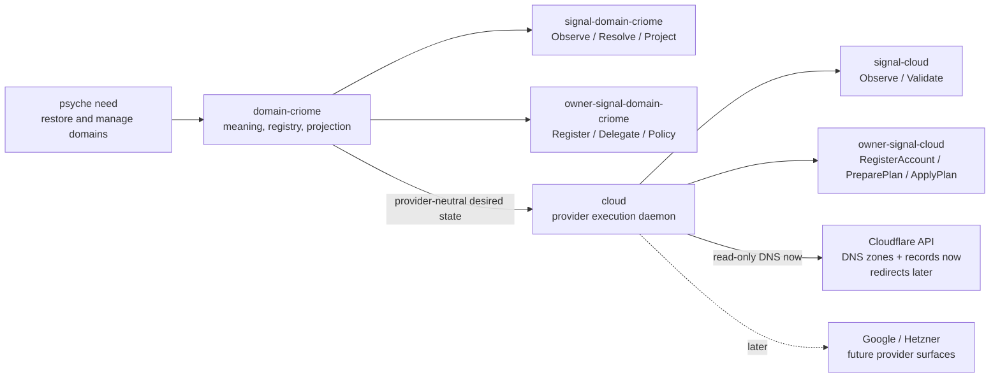
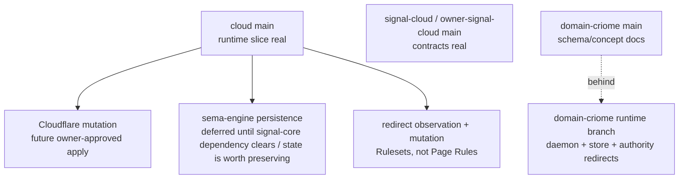
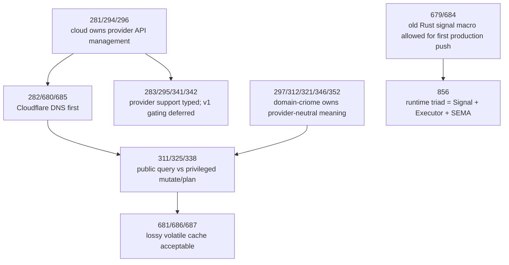

# Cloud component design recap — cloud-operator synthesis

Date of synthesis: 2026-05-27. Role lane: `cloud-operator`.

## Short verdict

Cloud design is no longer just research. The `cloud` triad exists and the runtime repo has a real first slice on `main`: thin CLI, daemon sockets, Signal frame I/O, owner/ordinary routing, in-memory policy/plan/cache state, and read-only Cloudflare DNS zone/record observation. Live mutation is intentionally blocked behind owner approval and still returns a typed rejection.

`domain-criome` is the paired meaning/projection component, but its runtime slice is not on `main`. The main domain repos mostly carry schema/concept work; the runtime branch `cloud-domain-criome-runtime` contains the better authority/delegation code (`NoRecords`, `NotAuthoritative`, authority registration), and remains the branch to inspect before any domain runtime continuation.

This overview incorporates all three read-only scout outputs: report-history (`1-history-and-report-scout.md`), repository state (`2-repository-scout.md`), and Spirit/guidance (`3-intent-and-guidance-scout.md`).

## The design in one picture



The important boundary is stable: `domain-criome` owns what domains mean; `cloud` owns how external providers are queried or changed.

## Current repository state

| Surface | Current state | Read |
|---|---|---|
| `cloud` | clean; `main` and `cloud-domain-criome-runtime` at `f09a7ddd` (`cloud: implement Cloudflare DNS read path`) | Active runtime baseline. Real daemon/CLI and Cloudflare read path exist. |
| `signal-cloud` | clean; `main` and `cloud-domain-criome-runtime` at `eb93c663` (`signal-cloud: add Cloudflare DNS record kinds`) | Active ordinary contract. `Observe` + `Validate`, no ordinary apply. |
| `owner-signal-cloud` | clean; `main` and `cloud-domain-criome-runtime` at `7d7dbee4` (`owner-signal-cloud: land runtime contract on main`) | Active owner contract. Plan preparation/approval/application live here. |
| `domain-criome` | clean; `main` at `166ef5bb` (`schema: add v0.1 concept schema`); runtime branch at `59ff764f` | Main is not the runtime baseline; branch has daemon/store/delegation runtime work. |
| `signal-domain-criome` | clean; `main` at `51a16b4d`; runtime branch at `200e1e59` | Main ordinary contract lacks latest `NoRecords` / `NotAuthoritative` branch behavior. |
| `owner-signal-domain-criome` | clean; `main` at `264406fe`; runtime branch at `98c674f2` | Main owner contract lacks branch authority-registration behavior. |

## What is real now

### `cloud` runtime

The real `cloud` path now exists in `/git/github.com/LiGoldragon/cloud`:

```text
src/bin/cloud.rs
src/bin/cloud-daemon.rs
src/client.rs
src/daemon.rs
src/frame_io.rs
src/cloudflare.rs
src/lib.rs
tests/runtime.rs
```

The CLI is a thin Signal client. It rejects flags and extra arguments, decodes exactly one NOTA request or a file path, routes by request head to ordinary vs owner socket, performs a Signal handshake, sends a rkyv frame, and prints a NOTA reply.

The daemon binds ordinary and owner Unix sockets and replies over `signal-frame`. The runtime store is still in-memory and mutex-backed, but that matches the current MVP carve-out: Cloudflare remains source of truth, and cache loss is acceptable for the first slice.

### Cloudflare read-only path

The runtime now has a direct Cloudflare HTTP client shape:

```rust
pub trait CredentialSource: Send + Sync {
    fn token(&self, handle: &CredentialHandle) -> Result<Token>;
}

pub trait Api: Send + Sync {
    fn zones(&self, token: &Token, name: Option<&DomainName>) -> Result<Vec<ApiZone>>;
    fn records(&self, token: &Token, zone: &ZoneIdentifier) -> Result<Vec<ApiRecord>>;
}
```

And the production credential source currently resolves a credential handle as an environment variable:

```rust
impl CredentialSource for EnvironmentCredentialSource {
    fn token(&self, handle: &CredentialHandle) -> Result<Token> {
        std::env::var(handle.as_str())
            .map(Token::new)
            .map_err(|_| Error::CredentialUnavailable(handle.as_str().to_owned()))
    }
}
```

That matches Spirit records `682` and `689` enough for the first slice, but it should be treated as an initial/semi-risky auth pattern. The safer deployment design in `reports/second-designer/196` recommends scoped Cloudflare tokens plus systemd `LoadCredential=` and agenix/sops-style encrypted-at-rest secret handling.

### Owner gate for mutation

The owner contract owns plan preparation, approval, and application:

```rust
signal_channel! {
    channel Owner {
        operation RegisterAccount(Registration),
        operation RotateCredential(Rotation),
        operation SetPolicy(Policy),
        operation PreparePlan(PlanPreparation),
        operation ApprovePlan(Approval),
        operation ApplyPlan(Application),
        operation RetireAccount(Retirement),
    }
}
```

But `cloud` deliberately does not fake live mutation yet:

```rust
fn apply_plan(&self, application: Application) -> OwnerReply {
    if !self.plan_exists(&application.plan) {
        return OwnerReply::RequestRejected(OwnerRequestRejected {
            reason: owner_signal_cloud::RejectionReason::PlanUnknown,
        });
    }
    if !self
        .approved_plans
        .lock()
        .expect("approved plans mutex")
        .iter()
        .any(|plan| plan == &application.plan)
    {
        return OwnerReply::RequestRejected(OwnerRequestRejected {
            reason: owner_signal_cloud::RejectionReason::PlanNotApproved,
        });
    }
    OwnerReply::RequestRejected(OwnerRequestRejected {
        reason: owner_signal_cloud::RejectionReason::CapabilityUnauthorized,
    })
}
```

That is good: the ceremony exists, but writes to Cloudflare remain blocked until the provider mutation actor/path is real.

## What is still design-only or branch-only



The key branch-only domain behavior is:

```rust
fn resolve(&self, query: ResolutionQuery) -> DomainReply {
    if let Some(delegation) = self.delegation_for_name(&query.name) {
        if let Some(address) = delegation.address() {
            return DomainReply::Resolved(ResolutionResult {
                query,
                addresses: vec![address],
            });
        }
        return DomainReply::NoRecords(NoRecords { query });
    }
    if let Some(authority) = self.authority_for_name(&query.name) {
        return DomainReply::NotAuthoritative(authority);
    }
    if self.domain_exists(&query.name) {
        return DomainReply::NoRecords(NoRecords { query });
    }
    DomainReply::RequestRejected(RequestRejected {
        reason: signal_domain_criome::RejectionReason::DomainUnknown,
    })
}
```

That branch better matches Spirit records `312`, `344`, `345`, `346`, and `352` than current `main` does. Do not implement domain-criome from current main alone without checking the runtime bookmark.

## Spirit intent map



Current durable read:

- Cloud is provider execution, not a generic domain model.
- Cloudflare DNS is the first useful production ground.
- Ordinary cloud can observe/validate; privileged cloud registers accounts, prepares plans, approves plans, applies plans.
- The first state can be in-memory/volatile and refillable from Cloudflare.
- Provider support must be typed (`NotBuilt`, compiled-but-unconfigured, configured/authorized), but v1 need not be blocked on build-time feature gating.
- `domain-criome` remains provider-neutral and record-only.
- The old `signal_channel!` path is authorized for the first production push; schema-derived Signal/Executor/SEMA remains the long-term direction.

## Naming and guidance drift

There are three policy-signal names in circulation:

| Name | Status in cloud context |
|---|---|
| `owner-signal-cloud` | Current repo and current code. Use for live work unless a rename is explicitly assigned. |
| `meta-signal-cloud` | Older tentative preference, Minimum certainty. Do not use as current target. |
| `core-signal-cloud` | Newer privileged-surface direction in Spirit records `767`/`768` and a line in current `skills/component-triad.md`; not yet applied to cloud repos. |

For this recap, the safe wording is **privileged policy/control signal**. When referring to existing code, use the exact existing repo name `owner-signal-cloud`. If a rename task appears, treat it as a coordinated migration rather than a casual file move.

## Context-maintenance triage

| Item | Action | Reason |
|---|---|---|
| `reports/system-operator/156` | Keep as design rationale | Cloudflare API facts and redirect/Page Rules posture remain useful. |
| `reports/system-operator/157` | Keep as design rationale | Google/Hetzner scope and provider-neutral model remain future context. |
| `reports/system-operator/158` | Keep, but annotate mentally as partly superseded | Signal foundation remains right; owner/meta/core naming portions are drifting. |
| `reports/system-operator/159` | Keep as rationale, not action plan | Pre-creation repo state is superseded, but scaffold reasoning is useful. |
| `reports/system-operator/160` | Forward into this recap | Good historical birth report, but current repo state has advanced beyond it. |
| `reports/second-designer/196` | Keep as production design rationale | Best production push plan; some implementation details changed (direct `ureq` path instead of recommended `cloudflare` crate / kameo actor). |
| `reports/cloud-designer/2` | Keep with caution | Useful recap; some operation names and database maturity claims are stale against live code. |
| `reports/cloud-operator/1-7` | Future triage needed | These are inherited pi-operator reports after the lane rename, not cloud design reports. Do not delete in this pass; run a separate lane-retirement/context-maintenance pass if the user wants the cloud-operator directory cleaned. |

## Likes

1. The cloud/domain split is clean. Provider APIs and credentials stay out of domain meaning.
2. The ordinary/owner split is now embodied in code: `signal-cloud` observes/validates, `owner-signal-cloud` prepares/applies.
3. The runtime refuses fake mutation. `ApplyPlan` has the right ceremony and a typed `CapabilityUnauthorized` stop.
4. The tests protect real architectural edges: no `signal-core`, no provider access from CLI, owner vs ordinary routing, not-built provider replies, and Cloudflare cache behavior.
5. The direct `Api` and `CredentialSource` traits make Cloudflare testable without real credentials.

## Dislikes and risks

1. `cloud` has non-test free helper functions (`fresh_exchange`, `encode_reply`, `handshake_reply_for`); `domain-criome` runtime branch has several free helpers. That violates the current Rust rule if touched now. Move helpers onto owner types before expanding.
2. Cloudflare credentials are environment-variable handles in code today. This is acceptable as first slice per Spirit, but deployment should prefer scoped token plus systemd credential file, not broad process environment leakage.
3. `cloud` main has real runtime, while `domain-criome` main does not. The pair can be misread as equally mature; they are not.
4. `protocols/active-repositories.md` and older reports say the runtime repos are documentation-only at birth. That is stale for `cloud` now.
5. Policy-signal naming is unsettled. Do not mix `owner`, `meta`, and `core` casually in code or reports.
6. The schema-engine future is real but not blocking. Do not let schema migration block Cloudflare DNS usefulness; do not let the old macro path become permanent by accident.
7. Cloud provider calls can block both daemon listeners today: the daemon holds an outer `Arc<Mutex<Store>>` while request handling may perform HTTP calls. This works for a first read path, but it is not the actor/nonblocking shape described by architecture.
8. Redirect observation returns an empty listing once Cloudflare is configured, even though Rulesets redirect observation is not implemented. That can falsely mean "no redirects exist" rather than "redirect observation is unavailable." Prefer a typed unavailable/unsupported result until the Rulesets path is real.
9. Capability policy is stored more than enforced: runtime capability state mostly checks provider account existence; `PreparePlan` does not yet enforce zone allowlists or capability directives.
10. Planning is still a stub: desired records become create lists, update/delete lists stay empty, and there is no remote diff. Safe mutation needs list-before-mutate planning first.

## Next practical handoff

For `cloud`:

1. Keep working from `main` at `f09a7ddd`.
2. Fix method-discipline/free-function cleanup before larger edits if touching affected files.
3. Avoid long provider calls under the outer daemon store lock; move Cloudflare HTTP work behind a provider actor/worker or otherwise release the listener-level lock before network I/O.
4. Add safer credential loading (`LoadCredential=`/file path source) without breaking existing env-handle tests.
5. Make redirect observation return typed unavailable until Cloudflare Rulesets read support exists; keep Page Rules legacy/import-only.
6. Enforce owner policy in capability reports and plan preparation: zone allowlists, capability directives, and provider/account scope.
7. Replace the plan stub with list-before-mutate diffing before enabling any `ApplyPlan` mutation.
8. Only then add owner-approved mutation (`ApplyPlan`) with cache invalidation and typed provider failures.

For `domain-criome`:

1. Compare `main` against `cloud-domain-criome-runtime` before doing anything.
2. Decide whether to merge/rebase branch authority behavior (`NoRecords`, `NotAuthoritative`, `RegisterAuthority`) onto main or recreate it under the schema concept branch.
3. Keep provider vocabulary out of domain contracts.
4. Preserve projection-to-cloud as provider-neutral records/redirects only.

For context maintenance:

1. This report forwards the cloud design context into `reports/cloud-operator/8-cloud-component-design-recap-2026-05-26/`.
2. A separate cleanup pass should classify the inherited old `pi-operator` reports now living under `reports/cloud-operator/1-7`.
3. Do not retire system-operator cloud reports yet; they preserve design alternatives and provider/API rationale.
