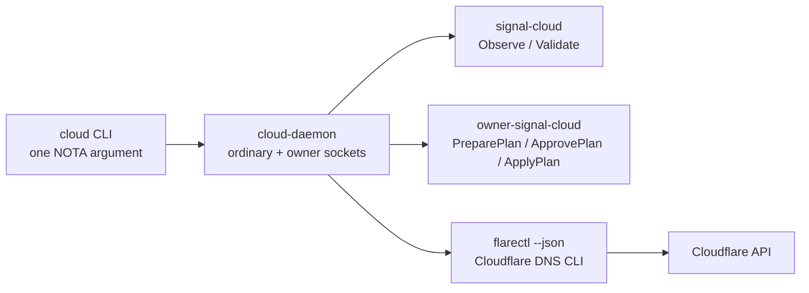

# Cloudflare DNS tool implementation — cloud-operator

## What landed

Implemented the first working Cloudflare DNS tool path in `/git/github.com/LiGoldragon/cloud` using the old hand-written NOTA / `signal_channel!` stack.

Commit pushed on `cloud/main`:

- `58862593` — `cloud: apply Cloudflare DNS plans via flarectl`

The existing component shape stays intact:



## Implementation shape

- Added `src/cloudflare_cli.rs`.
- Default Cloudflare provider path is now `FlarectlApi`, which shells out to `flarectl --json`.
- Kept the existing direct `HttpApi` as `ProviderClient::production_http()` for future fallback/redirect work.
- Extended the internal Cloudflare `Api` trait with DNS mutation methods: `create_record`, `update_record`, and `delete_record`.
- `ApplyPlan` now applies approved DNS-record plans instead of always returning `CapabilityUnauthorized`.
- `cloud-daemon` is wrapped by the flake package with `flarectl` in `PATH`.

## What works now

- `cloud` CLI still speaks only to `cloud-daemon`.
- `cloud-daemon` uses owner policy to map `Provider::Cloudflare` + zone to a credential handle.
- The credential handle names an environment variable such as `CLOUDFLARE_DNS_TOKEN`.
- Ordinary `Observe(Records(...))` reads DNS records through Cloudflare.
- Owner `PreparePlan` + `ApprovePlan` + `ApplyPlan` can create/update/delete DNS records through `flarectl`.
- Last-known records cache updates after read and after successful plan application.

## Redirects

`flarectl` supports `pagerules list`, but not redirect/page-rule creation or update. Redirect mutation remains future work. The likely path is direct Cloudflare API / Rulesets for redirects while keeping `flarectl` for DNS.

## Validation

Run in `/git/github.com/LiGoldragon/cloud`:

```text
cargo test
nix flake check
```

Both passed. Current tests cover the `flarectl` command-shape adapter with a mock runner plus the pre-existing daemon/CLI/runtime tests.

## Caveats

- Live Cloudflare JSON field names still need verification against the real account; parser accepts common `flarectl` table JSON aliases (`ID`, `Name`, `Type`, `Content`, `Proxy`/`Proxied`).
- DNS deletion still follows the current plan model's name-keyed deletion semantics.
- Provider calls can still block the daemon request path; actorizing the Cloudflare provider remains a follow-up.
- Secrets are still environment-token handles for this first slice; safer systemd credential-file loading remains recommended before deployment.
