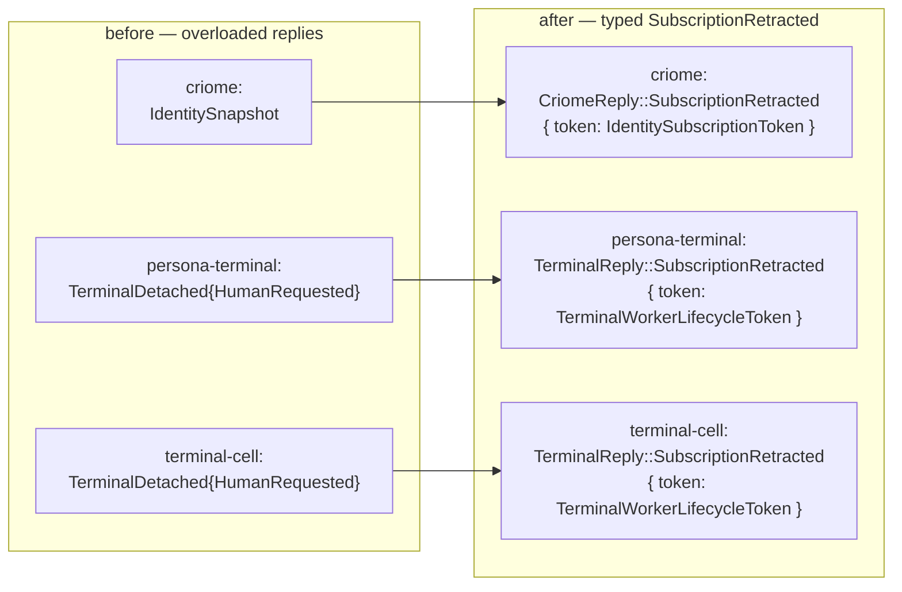

## 121 — Readiness Audit Resolution: Path A landed + sema-engine cleaned

*Operator-assistant implementation report, 2026-05-15. Resolves the
designer §3.1 path-A decision from DR/179 and the sema-engine
readiness gaps from DR/179 + DA/71.*

## 0 · Headline

Seven commits across six repos. The wave-3 streaming contracts now
carry a typed `SubscriptionRetracted` reply variant (Path A), and the
sema-engine kernel is correctness-tight and documentation-honest.

| Repo | Commit | What |
|---|---|---|
| `sema-engine` | `2a4cbfd1` | `cargo fmt` sweep — unblocks `nix flake check` (DA/71 Issue A, DR/179 Bug B) |
| `sema-engine` | `3fd65fc1` | `Engine::assert` rejects pre-existing keys with typed `DuplicateAssertKey`; same check inside `commit` for `WriteOperation::Assert` (DA/71 Issue B, DR/179 Bug A). +2 tests; 32 tests green. |
| `sema-engine` | `ea00c12d` | README + ARCHITECTURE.md cleanup — drop `Atomic`/`AtomicBatch`/seven-roots, make `Engine::commit` shape honest (`CommitRequest<RecordValue>`, not `Request<Payload>`), add Assert-fresh + single-owner constraints, retire Package-Order / Rename-Map sections (DA/71 Issues C/G/H/I + DR/179 §2 + Q3) |
| `signal-criome` | `e41b8ad0` | New `SubscriptionRetracted` reply variant carrying the retracted `IdentitySubscriptionToken`; round-trip coverage |
| `criome` | `cbe5c941` | `SubscriptionRegistry::close_subscription` returns `CriomeReply::SubscriptionRetracted` instead of `IdentitySnapshot`. Cargo.lock bumped to pick up the new variant. |
| `signal-persona-terminal` | `872cef4d` | New `SubscriptionRetracted` reply variant carrying the retracted `TerminalWorkerLifecycleToken`; hand-written `From` impl; round-trip coverage |
| `persona-terminal` | `ac3aa824` | `close_worker_lifecycle_subscription` returns `TerminalReply::SubscriptionRetracted` instead of `TerminalDetached{HumanRequested}`. Reply→terminal-name routing and `signal_cli` pretty-printer pick up the new variant. |
| `terminal-cell` | `5633a59b` | `handle_signal_request`'s retraction arm writes `SubscriptionRetracted` to the wire instead of `TerminalDetached{HumanRequested}`. |

## 1 · Path A — what changed

Before today, both streaming contracts (`signal-criome`,
`signal-persona-terminal`) overloaded an existing reply variant for the
subscription-retraction ack. The overloads were always typed lies:

| Daemon | Old overloaded reply | Semantic mismatch |
|---|---|---|
| `criome` | `IdentitySnapshot` | "registry state at close time" ≠ "your subscription is closed" |
| `persona-terminal` | `TerminalDetached{HumanRequested}` | "terminal detached at your request" ≠ "your subscription is closed" |
| `terminal-cell` | `TerminalDetached{HumanRequested}` | same |

Path A added a typed `SubscriptionRetracted(SubscriptionRetracted)` to
each streaming contract's reply enum. The payload is a per-contract
`NotaRecord` carrying the retracted subscription token so callers can
match the ack to the request they sent.

Each `SubscriptionRetracted` record carries its channel's
`<Channel>SubscriptionToken` newtype, so the NOTA head is unique
per-contract (no cross-contract head collision concern). The proc-macro
emits the variant; consumers got a hand-written `From<Payload>` impl in
the persona-terminal case to keep parity with the existing per-variant
`From` pattern there.

The `Rejected` arm is unchanged on all three daemons: a retraction whose
token was never registered still returns the contract's existing
rejection variant (`Rejection{UnknownIdentity}` in criome,
`TerminalRejected{NotConnected}` in persona-terminal). Path A names the
*successful* close; the rejection arm is independent.

## 2 · sema-engine — what changed

### 2.1 · `Engine::assert` is now fresh-only

Before today, `Engine::assert` called `sema::Table::insert` without
checking whether the key already existed. The table accepted the
overwrite under `SignalVerb::Assert` in the commit log — silently
violating the Signal kernel meaning where `Assert` is for fresh
identities and `Mutate` is the only replacement path. The same gap
existed inside `commit`'s `WriteOperation::Assert` arm.

The fix is symmetric to the existing `RecordNotFound` arm on `Mutate` /
`Retract`:

- New `Error::DuplicateAssertKey { table, key }` variant.
- Pre-existence check in `Engine::assert` that returns
  `DuplicateAssertKey` without touching the table or commit log.
- Same check inside the commit loop for any `WriteOperation::Assert`;
  failure rolls back the whole bundle.
- Two new tests in `tests/engine.rs`: single-call and multi-op-commit
  shapes. Engine test count goes 14 → 16; full sema-engine suite 30 → 32.

This is the most consequential correctness fix for downstream Lojix work
— a deploy entry must not silently replace a live-set row under the
wrong verb.

### 2.2 · `cargo fmt` is now clean

Three small reflows in `src/engine.rs`, `tests/engine.rs`,
`tests/subscriptions.rs`. The runtime test surface was already green;
this just unblocks the `nix flake check -L` release gate.

### 2.3 · README and ARCHITECTURE.md are honest

The README still mentioned `Atomic` / "seven SignalVerb roots" /
`AtomicBatch` (all gone in the wave-3 six-root migration); ARCH still
claimed `Engine::commit` takes a `signal_core::Request<Payload>` (it
takes the engine-native `CommitRequest<RecordValue>`); both carried
roadmap and rename-map sections per `skills/architecture-editor.md`
should live in reports, not architecture.

Edited:

- **README** — names the six SignalVerb roots, names the structural
  multi-op-commit shape, drops `AtomicBatch`, adds the
  `DuplicateAssertKey` semantics and single-owner constraint, names the
  test surface.
- **ARCHITECTURE.md** — fixes the `Engine::commit` constraint to be
  honest about the engine-native `CommitRequest<RecordValue>` shape,
  adds Assert-fresh and single-owner constraints, replaces the
  misleading `RequestBuilder::with(MindRequest::...).build()` example
  with the actual `CommitRequest::new(family).assert(...).mutate(...)`
  shape, and retires the Package-Order roadmap + Rename-Map history.

## 3 · signal-core stayed in operator's lane

DA/71 §2.2 and DR/179 §1 also call out signal-core proc-macro hardening
gaps (record-head uniqueness validation, `opens` on non-`Subscribe`
variants, reverse `belongs` cross-reference, orphan stream rejection,
compile-fail diagnostic tests). Those are operator's claim today —
`operator.lock` holds `/git/github.com/LiGoldragon/signal-core` with
reason "signal-core proc-macro validation diagnostics" (BEADS
`primary-6jww`). Operator's signal-core bumps landed during this session
(working-copy bumps in three of the repos I touched moved signal-core
from `dd127942` to `25212c0d`); the proc-macro hardening itself is
operator's lane and isn't tracked here.

## 4 · Coverage map after this report

Final state of the wave-3 cutover plus today's readiness sweep:

| Surface | Status |
|---|---|
| Contract crates (lib + tests green) | 8/8 |
| Daemon crates (lib + tests green) | 10/10 |
| Subscription-retraction handlers | 3/3 use the typed `SubscriptionRetracted` reply (Path A complete) |
| Push-delta primitive | 1/3 daemons (`terminal-cell` only) — wave-4 work |
| `sema-engine` correctness | `Assert` fresh-only; in-commit dedup intact; `Mutate`/`Retract` missing-record rejection intact |
| `sema-engine` release gate | `nix flake check -L` green |
| `sema-engine` docs | README + ARCH honest with implementation |

## 5 · Forward items not in operator-assistant's lane

### 5.1 · Wave-4 push-delta primitive (operator)

The `SubscriptionRegistry` actor in `criome` and the
`lifecycle_subscriptions` Vec in `persona-terminal` track the
**receive side** of subscription bookkeeping. The **send side** — actually
pushing deltas to open subscribers — is not yet implemented in those
two daemons. Their Subscribe still returns a snapshot at registration
time and never emits live events. `terminal-cell` is the only daemon
with a real push primitive (`stream_signal_worker_lifecycle` at
`terminal-cell/src/bin/terminal-cell-daemon.rs:727`).

The wave-4 work is producer-side delta emission in `criome` (identity
registry mutation events) and `persona-terminal` (worker lifecycle
events). The registry actors landed in `/119` are the receive-side
infrastructure.

### 5.2 · signal-core proc-macro hardening (operator)

Operator's active claim — see §3 above. Tracked as
BEADS `primary-6jww`.

### 5.3 · Remaining sema-engine readiness items (defer to first
consumer)

DA/71 surfaces three items not blocking first-consumer use:

- **Snapshot allocation isn't actor-safe under concurrent callers.** The
  ARCH now explicitly states single-owner ownership as a constraint;
  Lojix's intended single-actor daemon sidesteps this. Promote to a
  hard internal-serialization fix if a second consumer ever needs
  concurrent access.
- **Prevalidation reads sit outside the write transaction.** Same root
  cause; same single-owner mitigation.
- **Multi-table commit not exposed.** `CommitRequest<RecordValue>` is
  per-table. Lojix may want cross-table atomicity later; not on the
  critical path for the first slice.

## 6 · Discipline notes

- Seven commits, seven pushes. `jj st` checked before every commit; only
  the working files in each repo bundled.
- `cargo fmt` ran on every repo before `cargo test` / `nix flake check`
  (per `skills/jj.md` and `skills/testing.md`). The minor fmt-only diffs
  on peer files (`root.rs` and `transport.rs` in criome,
  `socket.rs` in terminal-cell) were folded into the commits along with
  the semantic change — verified via `jj diff -r <change> --stat` to
  carry no syntactic delta.
- No claim contention with operator's signal-core work. Operator was
  on signal-core proc-macro hardening throughout; this session
  consumed signal-core via Cargo.lock bumps (`dd127942` → `25212c0d`
  picked up by `cargo update -p signal-persona-terminal` /
  `cargo update -p signal-criome` in each consumer).

## 7 · Pointers for the next agent

| Need | Where |
|---|---|
| Source of the §3.1 designer call | `reports/designer/179-signal-core-sema-engine-lojix-readiness-audit.md` + `reports/designer-assistant/71-signal-core-and-sema-engine-lojix-readiness-audit.md` |
| Spec for path A's typed reply pattern | `reports/designer/176-signal-channel-macro-redesign.md` + `reports/operator-assistant/119-wave-2-phase-5-retraction-handlers-2026-05-15.md` §2 |
| Subscription registry pattern (criome) | `/git/github.com/LiGoldragon/criome/src/actors/subscription.rs` |
| Subscription registry pattern (persona-terminal) | `/git/github.com/LiGoldragon/persona-terminal/src/signal_control.rs` (`open_worker_lifecycle_subscription`, `close_worker_lifecycle_subscription`) |
| Push-delta producer example (wave-4 reference) | `/git/github.com/LiGoldragon/terminal-cell/src/bin/terminal-cell-daemon.rs` (`stream_signal_worker_lifecycle`) |
| sema-engine correctness fix shape | `/git/github.com/LiGoldragon/sema-engine/src/engine.rs:79` (Assert pre-existence check), `:285` (Assert pre-existence inside commit), `:567` (`duplicate_assert_key` helper) |
| sema-engine test shape | `/git/github.com/LiGoldragon/sema-engine/tests/engine.rs:357-417` (two new DuplicateAssertKey tests) |
| Hand-written `From<Payload>` precedent (signal-persona-terminal) | `/git/github.com/LiGoldragon/signal-persona-terminal/src/lib.rs:1057` |
