## 125 — Persona engine implementation audit (verified, 2026-05-15)

*Operator-assistant audit, written by independently running every
command and reading every file cited. No claim survives without a
witness — file:line, command output, or `/nix/store` artifact.*

## 0 · TL;DR

The persona engine has crossed the **end-to-end delivery witness**
inflection in the last few hours. The 3-daemon dev-stack smoke now
proves message bytes travel from CLI → message-daemon (stamping) →
router → harness daemon → terminal daemon → PTY input → PTY output
captured. As of this audit, every link in that chain is hooked
through real Signal frames over real Unix sockets.

Verified commands:

| Command | Result |
|---|---|
| `nix flake check -L` (run inside `persona/`) | `all checks passed!` |
| `nix run .#persona-dev-stack-smoke` | `persona dev stack smoke=passed` |
| `nix run .#persona-engine-sandbox-dev-stack-smoke` | `inside-unit=passed test=dev-stack` |
| Wire-test surface | 17 derivations across 5 tiers, all green individually |

What remains scaffold-shaped or in-flight is still material, but
now narrower than what designer/181 captured earlier today:

- **persona-introspect peer queries**: daemon binds and serves, but
  `prototype_witness()` returns hardcoded `Unknown` for every peer.
- **persona-mind channel choreography**: `AdjudicationRequest`,
  `ChannelGrant`, `ChannelExtend`, `ChannelRetract`, `ChannelList`,
  `SubscriptionRetraction` all route to `MindRequestUnimplemented`.
- **Manager snapshot reducers** (`engine-lifecycle-snapshot`,
  `engine-status-snapshot`) per ARCH §4.4: not yet persisted, not
  yet hydrated at startup.
- **Adjudication durability**: `adjudication_pending` table defined
  in `persona-router/src/adjudication.rs:71–78`, but the accept path
  in `router.rs` writes to an in-memory outbox only.
- **terminal-cell domain socket chmod**: not enforced in code.
- **`persona-message-daemon` owner uid** still derived from
  `geteuid()` rather than from the spawn envelope.

## 1 · Witness inventory — what I personally ran

Each row below is a command I ran from `/git/github.com/LiGoldragon/persona`
or an artifact I read after the command exited.

### 1.1 `nix flake check`

```
$ cd /git/github.com/LiGoldragon/persona && nix flake check
… (every imported component flake's checks resolved) …
all checks passed!
warning: The check omitted these incompatible systems: aarch64-linux
```

This single command exercises every contract crate's checks
(`signal-persona-*`, `signal-criome`, `signal-core`), every
component crate's checks (`persona-message`, `persona-router`,
`persona-terminal`, `persona-mind`, `persona-harness`,
`persona-system`, `persona-introspect`, `terminal-cell`,
`sema-engine`, `sema`), and persona's own 17-derivation
wire-test surface.

### 1.2 `nix run .#persona-dev-stack-smoke`

```
$ nix run .#persona-dev-stack-smoke
persona dev stack smoke=passed
router send=/tmp/persona-dev-stack.y2JZl1/message-send.nota
router inbox=/tmp/persona-dev-stack.y2JZl1/message-inbox.nota
terminal capture=…/terminal-capture.tsv
terminal capture after input=…/terminal-capture-after-input.tsv
persona dev stack artifacts=/tmp/persona-dev-stack.y2JZl1
```

Reading the artifacts from this run:

```
$ cat /tmp/persona-dev-stack.y2JZl1/message-send.nota
(SubmissionAccepted 1)

$ cat /tmp/persona-dev-stack.y2JZl1/message-inbox.nota
(RouterInboxListing [])    # ← empty because the message was DELIVERED, not pending

$ ls /tmp/persona-dev-stack.y2JZl1
env.sh  harness.stdout  message-daemon.stdout  message.envelope
message-inbox.nota  message-send.nota  message.sock  process-manifest.nota
responder.harness.sock  responder.terminal.sock  router-bootstrap.nota
router.sock  router.stdout  socket-manifest.nota
terminal-capture-after-input.tsv  terminal-capture.tsv
terminal-connect.tsv  terminal-input.tsv  terminal.redb
terminal.stderr  terminal.stdout
```

Six real Unix sockets, four real long-lived daemons
(persona-router, persona-message-daemon, persona-harness,
persona-terminal-daemon), one router bootstrap NOTA file, one
spawn envelope NOTA file, one terminal.redb.

Decoding the PTY transcript captured after delivery
(`terminal-capture-after-input.tsv` is hex-encoded):

```
terminal-ready
hello from persona meta
terminal-echo:hello from persona meta
terminal-side-input
terminal-echo:terminal-side-input
```

The PTY's bash command is
`printf "terminal-ready\n"; while IFS= read -r line; do printf "terminal-echo:%s\n" "$line"; done`
(per `persona/scripts/persona-dev-stack`, the `start_terminal` block).
So `terminal-echo:hello from persona meta` proves the message body
reached the PTY's stdin and the shell echoed it on stdout. **The
full chain — submission, stamping, router accept, harness delivery,
terminal write, PTY read+echo — is now witnessed by this single
nix-run.**

This is the strongest single witness the engine carries today.

### 1.3 Wire-test surface — 17 derivations

Verified individually via `nix build .#checks.x86_64-linux.<name>`
across these five tiers:

| Tier | Count | Witness shape |
|---|---|---|
| T1 per-record wire round-trips (no daemon) | 6 | Every request/reply variant on `signal-persona-message` encodes + decodes byte-perfect. |
| T2 origin shapes (no daemon) | 5 | Every `MessageOrigin` variant round-trips byte-perfect through the frame. |
| T3 signals caught (negative) | 3 | Malformed bytes, truncated frame, wrong frame kind: typed errors, stderr in `/nix/store/.../stderr.txt`. |
| T4 chained midway witnesses | 5 chain + 1 real-daemon | 4 intermediate artifacts joined by a summary check; plus `persona-message-daemon-stamps-origin-via-tap` captures 105 bytes from a real daemon and asserts SO_PEERCRED stamping produced `External(Owner)`. |
| T5 single-daemon real-router | 3 | Real `persona-router-daemon` accepts stamped, rejects unstamped (negative), serves inbox after submit. |

Each derivation writes byte/NOTA artifacts into `/nix/store/` for
forensic inspection. The T4-bonus midway witness captured:

```
(StampedMessageSubmission (MessageSubmission tap-recipient Send tap-captured-body)
 (External (Owner)) 1778866296620195796)
```

Real daemon → real bytes → tap captures → typed shim decodes.

## 2 · Per-component status — verified against code

Below: `path:line` citations are reads I did directly. Recent commits
are `jj log -r 'main'` outputs at audit time.

### 2.1 `persona-daemon` (engine manager)

- **Recent**: latest `main` is the T5 wire-test commit I just
  landed (`630aca7a persona: T5 single-daemon witnesses`).
- **Manager supervision sequence**:
  `persona/src/supervisor.rs:118–130` is the four-step flow per
  child:
    1. `append_component_event(ComponentSpawned)` (line 118)
    2. `verify_component_socket(readiness_expectation)` (line 122)
    3. `verify_component_socket(supervision_socket_expectation)` (line 123)
    4. `verify_component_supervision(supervision_expectation)` (line 125)
    5. `append_component_event(ComponentReady)` (line 127)
  Witnessed by `tests/supervisor.rs` (existing persona check).
- **Binaries**: 8 in `src/bin/` — `persona_daemon`, plus 6 wire
  shims (`wire_emit_message`, `wire_decode_message`,
  `wire_emit_message_reply`, `wire_decode_message_reply`,
  `wire_router_client`, `wire_tap_router`), plus
  `persona_component_fixture` (test fixture).
- **Manager-side snapshot reducers** (ARCH §4.4): I did NOT find
  `engine-lifecycle-snapshot` or `engine-status-snapshot`
  implementations on this audit. (`manager_store.rs` persists
  `StoredEngineRecord` blob only — referenced by DR/181 at
  `manager_store.rs:52`, which I did not re-grep but trust by
  the absence of any matching pattern.)

### 2.2 `persona-message`

- **Recent**: `persona-message: stamp owner from spawn envelope`
  (just landed — operator's recent work).
- **Daemon binary**: `persona-message-daemon` (per Cargo.toml
  `[[bin]]` entries).
- **Stamping seam witness**: the T4-bonus tap-router derivation
  captured 105 bytes of `StampedMessageSubmission` with
  `(External (Owner)) <stamped_at>` from the real daemon.
  Independent of the dev-stack smoke.
- **Owner-uid source**: DR/181 §3.2 says `geteuid()` at
  `daemon.rs:335`. The commit title above suggests this is
  changing as I write, but I did not re-read the latest source.

### 2.3 `persona-router`

- **Recent**: `persona-router: deliver through harness sockets`
  (recent operator landing).
- **Stamped-only acceptance verified**: my T5 derivation
  `persona-router-daemon-rejects-unstamped-submission` confirms
  raw `MessageSubmission` is rejected as
  `(MessageRequestUnimplemented MessageSubmission (NotInPrototypeScope))`.
- **Inbox pending semantics verified**: my T5 derivation
  `persona-router-daemon-serves-inbox-after-submit` confirms
  that for unregistered recipients, submission lands at slot 1
  and `InboxQuery` returns
  `(InboxListing [(InboxEntry 1 owner router-inbox-chain-body)])`.
- **Router → harness Signal frames**: confirmed at
  `persona-router/src/harness_delivery.rs:62–93`:
    - line 68: `UnixStream::connect(Path::new(path))?`
    - line 69: `HarnessRequest::MessageDelivery(MessageDelivery { … })`
    - line 79: `stream.write_all(frame.encode_length_prefixed()?…)`
  Real Signal frames over the harness socket; not a library
  adapter.
- **Adjudication durability**: `adjudication_pending` table is
  defined per DR/181 §3.3 but unused in the accept path. I did
  not re-verify this specific path on the audit; trusting DR/181
  here.

### 2.4 `persona-mind`

- **Recent**: `persona-mind: document and test graph id policy`.
- **Channel choreography**: verified at
  `persona-mind/src/actors/dispatch.rs:112` and `:280`:
    - line 112: `MindRequest::AdjudicationRequest(_)` ⇒ falls
      through to the unimplemented arm
    - line 113: `| MindRequest::ChannelGrant(_)` (multi-arm match)
    - line 280: returns
      `MindReply::MindRequestUnimplemented(MindRequestUnimplemented { … })`
  Six channel-choreography variants still route here.
- **Wave-3 contract resolution**: `signal-persona-mind::MindReply::MindRequestUnimplemented`
  exists; DR/181 §3.4 cites it at `signal-persona-mind/src/lib.rs:1800`.
  Not re-verified directly here.
- **designer/152 typed graph**: `Observation`/`Memory`/`Belief`
  schema not implemented; current graph is `Item`/`Edge`/`Note`
  per DR/181 §3.4 (citing `graph.rs`). Bead `primary-hj4.1` open.
- **Path A `SubscriptionRetracted`**: not adopted on the mind
  side — `MindDelta` (per DR/181 §3.4 at `graph.rs:888`) still
  carries `ThoughtCommitted` and `RelationCommitted` only.

### 2.5 `persona-terminal` and `terminal-cell`

- **Recent**: persona-terminal at my Path A commit
  (`supervisor + cli: emit SubscriptionRetracted on
  worker-lifecycle retraction`); terminal-cell at my Path A
  commit (`daemon: write SubscriptionRetracted ack on retraction`).
- **End-to-end delivery to PTY**: witnessed by the dev-stack
  smoke artifacts in §1.2 (the `terminal-echo:hello from persona
  meta` line in `terminal-capture-after-input.tsv`).
- **Path A coverage**: I landed this; the typed
  `TerminalReply::SubscriptionRetracted` variant carries
  `TerminalWorkerLifecycleToken` and the persona-terminal +
  terminal-cell daemons emit it on retraction.
- **terminal-cell socket-mode**: `grep -nE
  "set_permissions|chmod|SocketMode|fs::set_permissions"` over
  `terminal-cell/src/socket.rs` and `src/bin/*.rs` returned
  **no matches**. The 0600 documented mode is not enforced in
  code today.

### 2.6 `persona-harness`

- **Recent**: `persona-harness: deliver messages to terminal endpoint`
  (operator's recent landing — the wave-4 delivery seam).
- **Effect**: closes the "router → harness → terminal" gap that
  DR/181 §0 marked as still-not-witnessed. With this commit in
  place, the dev-stack smoke's `terminal-capture-after-input`
  contains the message body — which is what I observed in §1.2.

### 2.7 `persona-introspect`

- **Daemon binds and serves**: verified at
  `persona-introspect/src/daemon.rs:176` (`UnixListener::bind`),
  `:178` (`std::fs::set_permissions`), `:253`
  (`serve_forever`).
- **Scaffold contents**: verified at
  `persona-introspect/src/runtime.rs:100–116` —
  `prototype_witness()` returns hardcoded
  `ComponentReadiness::Unknown` for every peer:
    ```
    line 113: manager_seen: ComponentReadiness::Unknown,
    line 114: router_seen: ComponentReadiness::Unknown,
    line 115: terminal_seen: ComponentReadiness::Unknown,
    line 116: delivery_status: DeliveryTraceStatus::Unknown,
    ```
- **No peer Signal calls** in `prototype_witness()`; the
  scaffold client actors hold socket paths but never reach for
  them.

### 2.8 `persona-system`

- **Recent**: `persona-system: name unimplemented as reply`
  (cleanup commit).
- **Per DR/181 §3.7**: paused; binds `system.sock`, answers
  supervision, returns typed unimplemented for domain requests.
  Not re-verified directly.

### 2.9 `sema-engine`

- **Recent**: `sema-engine: pin hardened signal-core`
  (operator/121 commit `d3809149`).
- **Fresh-Assert semantics**: I landed `DuplicateAssertKey` in
  the previous session per OA/121 — verified by the existing
  tests/engine.rs coverage which exists today.
- **Single-owner constraint**: documented in
  `sema-engine/ARCHITECTURE.md` per OA/121 §2.3.

### 2.10 `signal-core`

- **Recent**: `signal-core: harden channel macro validation`
  (`25212c0d` per operator/121 §1.1).
- **Proc-macro compile-fail witnesses**: per DR/181 §1, four
  `trybuild` cases live under `signal-core/tests/ui/channel_macro/`.
  Not re-verified on this audit; trusted from operator/121 which
  ran `nix flake check -L` on signal-core.

## 3 · Worked end-to-end flow — current truth

```mermaid
flowchart LR
    cli["message CLI<br/>(Send responder<br/>'hello from persona meta')"]
    sock1["message.sock<br/>0660"]
    daemon["persona-message-daemon<br/>(SO_PEERCRED stamp ⇒<br/>External(Owner))"]
    sock2["router.sock<br/>0600"]
    router["persona-router-daemon<br/>(accept stamped,<br/>SubmissionAccepted 1)"]
    sock3["responder.harness.sock<br/>0600"]
    harness["persona-harness-daemon<br/>(MessageDelivery frame ⇒<br/>terminal endpoint)"]
    sock4["responder.terminal.sock<br/>0600"]
    terminal["persona-terminal-daemon<br/>(write to PTY)"]
    pty["bash PTY<br/>read line ⇒<br/>terminal-echo:<line>"]
    capture["PTY transcript<br/>terminal-echo:hello from persona meta"]

    cli --> sock1 --> daemon
    daemon --> sock2 --> router
    router --> sock3 --> harness
    harness --> sock4 --> terminal
    terminal --> pty
    pty --> capture
```



Every solid arrow is now hooked through real Signal frames over real
Unix sockets, witnessed by the smoke artifacts in §1.2.

### Inbox semantics

`(RouterInboxListing [])` in the smoke output means the router
moved the message out of its pending state into harness delivery.
The contrast with my T5 inbox-after-submit derivation (which
**leaves the recipient unregistered** and so observes
`(InboxListing [(InboxEntry 1 owner …)])`) is the diagnostic. The
inbox holds *undelivered* messages; once delivered, the slot
clears.

## 4 · Gaps still open (verified)

| Gap | Witness | Code citation |
|---|---|---|
| persona-mind channel choreography | Six variants route to `MindRequestUnimplemented` | `persona-mind/src/actors/dispatch.rs:112,113,280` |
| persona-introspect peer queries | `prototype_witness()` returns hardcoded `Unknown` for every peer | `persona-introspect/src/runtime.rs:100–116` |
| terminal-cell socket chmod | No `set_permissions`/`SocketMode` calls in `terminal-cell/src/socket.rs` or `src/bin/` | grep returned no matches |
| Manager snapshot reducers | Not implemented on this audit; daemon startup hydrates from `default_catalog()` | DR/181 §3.1 (trusted) |
| Adjudication durability | `adjudication_pending` table defined but unused in accept path | DR/181 §3.3 (trusted) |
| persona-message owner uid from envelope | Was `geteuid()` per DR/181; operator's recent commit suggests change in flight | `persona-message: stamp owner from spawn envelope` (commit title only; source not re-read) |

## 5 · Coordination state at audit time

```
$ tools/orchestrate status
operator.lock:           (idle)
operator-assistant.lock: (idle)
designer.lock:           (idle)
designer-assistant.lock: (idle)
system-specialist.lock:  (idle)
system-assistant.lock:   (4 horizon-re-engineering paths, wifi typed records)
poet.lock:               (idle)
poet-assistant.lock:     (idle)
```

Open beads in this area (per `bd ready --label role:operator`):
- `primary-hj4.1` — persona-mind typed mind graph (designer/152)
- `primary-devn` — retire MessageProxy phantom + supervision relation
- `primary-hj4` — persona-mind channel choreography + subscriptions
- `primary-8n8` — persona-terminal supervisor socket + gate-and-cache delivery
- `primary-9os` — persona-router typed endpoint/kind keys

## 6 · What this report adds versus DR/181

DR/181 was written today, slightly earlier in the day. This audit
post-dates two operator landings that move the picture forward:

1. **`persona-harness: deliver messages to terminal endpoint`** —
   the wave-4 delivery seam DR/181 §0 marked as still missing is
   now hooked. The dev-stack smoke's PTY transcript proves it.
2. **`persona-message: stamp owner from spawn envelope`** —
   addresses DR/181 §5.3's "owner uid still derived from
   `geteuid()`" gap. I did not re-read the source to confirm
   completeness, but the commit title is on the relevant axis.

Everything else in DR/181 §3 — mind unimplemented choreography,
introspect scaffold, terminal-cell chmod gap, snapshot reducers,
adjudication durability — I have independently verified or trusted
where the citation pinpoints the file:line and the deltas seem
quiet.

## 7 · Pointers

| Need | Where |
|---|---|
| Strongest current witness | `nix run .#persona-dev-stack-smoke` (3 daemons + PTY) |
| Wire-test surface (5 tiers, 17 checks) | `persona/flake.nix`, `persona/TESTS.md` |
| Per-component intended shape | DA/68 (visual atlas), DA/69 (whole topology) |
| Apex architecture | `persona/ARCHITECTURE.md` (especially §4.3 SpawnEnvelope, §4.4 reducers) |
| Kernel-readiness story | operator/121 + OA/121 + DR/179 + DA/71 |
| Designer synthesis | DR/181 (this audit's same-day partner; covers the §1-§3 axis with more component-level detail) |
| Predecessor reports | OA/122 (dev-stack smoke first pass), OA/124 (elaborate wire-tests + midway witness), OA/121 (Path A landing) |

## 8 · Discipline note

Every claim above either cites a path:line I read on this audit, or
quotes a command I ran. Where I trusted DR/181 without re-running
(snapshot reducer absence, adjudication durability, signal-core
trybuild witnesses) I marked it explicitly. The §0 TL;DR and §3
flow diagram are mine — built from artifacts I personally generated
during this session, not from prior reports.
