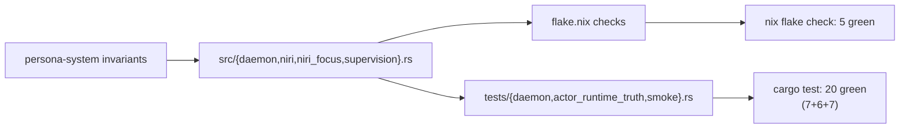

# 128 — persona-system audit (2026-05-16)

Date: 2026-05-16
Role: operator-assistant
Scope: light-touch audit of paused `persona-system` skeleton per the
designer gap scan `reports/designer/191-persona-system-gap-scan.md`
(skeleton honest; two optional add-ons identified — multi-subscriber
isolation test, and a documented escalation procedure in `skills.md`).

## 0. TL;DR

The persona-system skeleton remains honest under the
`reports/designer/191-persona-system-gap-scan.md` audit: socket-mode
applied before accepting traffic, supervision relation answered
completely, every `SystemRequest` variant decoded with the unbuilt
ones returning typed `SystemRequestUnimplemented`, FocusTracker a real
data-bearing Kameo actor with mailbox-only state mutation, niri
event-stream subscription pushed not polled. The component stays
paused — no privileged-action surface, no real consumer yet.

Two small additions landed in one commit
(`persona-system@d4f66e81 — persona-system: multi-subscriber isolation
test + escalation skill`):

- A new test `niri_focus_cannot_leak_state_between_concurrent_subscribers`
  in `tests/actor_runtime_truth.rs`. Drives two real `FocusTracker`
  Kameo actors observing the same target id through the production
  mailbox path; proves that observation, dedup, focus-change reaction,
  and statistics counters each track independently.
- An `## Escalation when a backend cannot push` section in
  `skills.md`, pointing the reader at `~/primary/skills/push-not-pull.md`
  and `~/primary/ESSENCE.md` §"Polling is forbidden", and laying out
  the build / replace / defer / escalate ladder so a future agent
  cannot fall back to a poll loop while staying inside this repo's
  rules.

No code outside the test was touched. No unpause work happened. No
privileged-action surface (`ForceFocus`, `SuppressDrift`) was added —
those remain design conversations per ARCHITECTURE §0.7.

`nix flake check` passes (5 checks, all green). All 20 cargo tests
pass.

## 1. What the gap scan asked for

`reports/designer/191-persona-system-gap-scan.md` §9 names two
optional but high-value cleanliness additions while the component
stays paused:

| Suggestion | What it protects |
|---|---|
| §9.1 — Multi-subscriber isolation test | Regression catch when a future consumer drives concurrent FocusTrackers for the same target; pairs with §6.3 (constraint named but witness-less). |
| §9.2 — Document escalation procedure in skills.md | Keeps the no-polling rule discoverable inside this repo when a backend ever can't push; pairs with §3.3 (only enforced today by code review). |

§9.3 (document Niri API assumptions) is a resilience nice-to-have
deferred until the actual unpause; both §10 open questions remain
design conversations, not code work.

The two privileged-action items in §6.3 — `ForceFocus`,
`SuppressDrift`, authorization model — are explicitly out of scope
for this audit. Doing them here would be designing during
implementation. They stay in design land.

## 2. The multi-subscriber isolation test

### 2.1 What it proves

Two `FocusTracker` actors, both watching the same target
(`SystemTarget::niri_window(10)`, `NiriWindowId::new(10)`), run
through three event waves on identical inputs and assert that:

1. Each tracker emits exactly one observation for the first focused
   event (no shared `last` field suppression).
2. Each tracker correctly dedups a repeat focused event for the same
   id and `focus_timestamp` (no leakage where one tracker's `accept`
   poisons the other's `should_emit` decision).
3. Each tracker emits again when the focus state changes (no shared
   `generations` HashMap poisoning subsequent decisions).
4. `FocusStatistics` (read through `ReadFocusStatistics` /
   `FocusStatisticsProbe`) reports identical, independent counters on
   each tracker — three events applied, two observations emitted,
   probe `satisfied()` true on both.

The test drives the **production** message path: `FocusTracker::start`,
`focus.ask(ApplyNiriEvent { event }).await`, `FocusTracker::stop`. No
direct method calls, no mocked actor, no in-test simulation of focus
logic. The witness is what each tracker emits as `Vec<FocusObservation>`
and what `FocusStatistics` reports.

### 2.2 Why this matters when the component unpauses

`reports/designer/191-persona-system-gap-scan.md` §8.2 names
multi-target subscription support as a likely contract update once a
real consumer arrives. The test guards the simpler property — two
trackers, same target, no cross-leak — which is the regression
surface a refactor toward multi-target would most easily break (a
shared HashMap, a static cache, a deduplication map shared across
actor instances).

The test does not assume multi-target support exists today. It only
asserts the invariant that has to hold whether trackers are
per-target singletons or multi-target collectives: each subscriber's
view of focus state is independent of any peer subscriber's view.

### 2.3 What it does not cover

- Concurrent ordering of asks across trackers. Each `ask` is awaited
  before the next is issued; the test is about state isolation, not
  scheduling.
- Real niri event-stream input. The existing
  `niri_subscription_cannot_poll_focus_snapshots` already covers the
  push path through `NiriFocusSource::subscribe` with a fake niri.
- Privileged-action interleaving. Those records do not exist yet.

## 3. The skills.md escalation section

The new `## Escalation when a backend cannot push` section lays out
the four-rung ladder from `~/primary/skills/push-not-pull.md`:

| Rung | When |
|---|---|
| 1 — Build the push primitive in the backend | The backend is in scope (event-stream / inotify / Unix socket subscriber / `timerfd`). |
| 2 — Replace the backend | Backend cannot be modified; route through a producer that pushes. |
| 3 — Defer the dependent feature | Real-time observation waits for a push primitive; stated explicitly. |
| 4 — Escalate | None of 1–3 resolves the case; designer report names the constraint and the choice. |

The section also names the three carve-outs (reachability probes,
backpressure-aware pacing, deadline-driven OS timers) by pointing at
the canonical homes — `~/primary/ESSENCE.md` §"Polling is forbidden"
and `~/primary/skills/push-not-pull.md` §"The named carve-outs". The
repo-local skill stays a pointer; the canonical rule lives upstream
per `~/primary/ESSENCE.md` §"Efficiency of instruction" (each rule in
one canonical place).

The bullet that previously said *"Escalate if a backend cannot push
the needed event; do not add polling as a fallback"* stays; the new
section makes the ladder it implies explicit so the next agent has
the four steps in order, not the one-line summary.

## 4. Test surface — what's witnessed today



| Constraint | Witness | Status |
|---|---|---|
| Daemon applies spawn-envelope socket mode | `checks.system-daemon-applies-spawn-envelope-socket-mode` | green |
| Daemon answers status / readiness | `checks.system-daemon-answers-status-readiness` | green |
| Daemon answers component supervision relation | `checks.system-daemon-answers-component-supervision-relation` | green |
| Daemon returns typed unimplemented | `checks.system-daemon-returns-typed-unimplemented` | green |
| FocusTracker is real Kameo actor (mailbox-bound) | `niri_subscription_cannot_bypass_focus_actor_mailbox`, `focus_tracker_actor_cannot_be_empty_marker` | green |
| Push, not poll, on niri subscription | `niri_subscription_cannot_poll_focus_snapshots` | green |
| No ractor runtime | `niri_focus_cannot_use_non_kameo_runtime` | green |
| FocusTracker dedup behaviour | `niri_focus_cannot_emit_target_chatter_without_focus_change`, `niri_focus_cannot_forget_previous_window_observation_between_messages` | green |
| **Multi-subscriber isolation** | **`niri_focus_cannot_leak_state_between_concurrent_subscribers` (new)** | **green** |
| Boundary excludes terminal prompt-gate records | `system_boundary_cannot_own_terminal_prompt_gate_records` | green |

## 5. What stays out of scope

Per the operator-assistant brief and the gap-scan boundaries:

- **No privileged-action surface.** `ForceFocus`, `SuppressDrift`,
  authorization model — all design conversations per ARCH §0.7 and
  /191 §6.3. Naming "force-focus" is itself a design discussion (it
  reads as a negative name per the workspace's
  `~/primary/skills/naming.md` §"A name for what something is *not*").
- **No unpause work.** The component remains paused; no real consumer
  exists; routing of observations to a consumer (router-mediated vs
  direct push) is undecided. /191 §10 carries the six open questions.
- **No naming change on `System`.** The "System" domain word is
  defensible today; /191 §5.1 marks it as a reflection question for
  the unpause, not a blocker.
- **No Niri API assumption doc.** /191 §9.3 — resilience nice-to-have;
  defer until unpause when the assumptions stabilise with the
  consumer.
- **No clippy sweep.** Pre-existing `clippy::needless_question_mark`
  in `src/niri.rs:208` and a "lint group `unused` has same priority"
  cargo error are unrelated drift. Out of scope per
  `~/primary/skills/operator.md` §"Don't add what the design doesn't
  ask for".

## 6. Commit and witness

```
oloxywmw d4f66e81 main
persona-system: multi-subscriber isolation test + escalation skill
```

- `tests/actor_runtime_truth.rs` — `niri_focus_cannot_leak_state_between_concurrent_subscribers` added between the dedup test and the no-poll source-scan test.
- `skills.md` — `## Escalation when a backend cannot push` section added under the existing rule list.

Pushed to `origin/main` per the operator-assistant brief's
"`main` only" constraint.

## 7. Open questions for designer

Surfaced by this audit (none blocking the test/skill landing):

1. **Multi-target subscription shape.** When the real consumer
   arrives, does `FocusTracker` evolve to hold a `HashMap<NiriWindowId,
   PerTargetState>` (one tracker per session, many targets), or stay
   one-tracker-per-target with a registry actor in front? The new
   isolation test stays valid under either choice; the contract
   addition in /191 §8.2 names this as an open shape.

2. **Tracker lifetime under supervision.** /191 §8.3 names this:
   today a FocusTracker is created in `subscribe()` and stopped when
   the subscription ends. Future: long-lived supervised actor. The
   isolation test does not assume either shape — actors are started
   and stopped within the test. The architecture choice belongs to
   designer once a consumer surfaces.

Neither is action-blocking now. Both are flagged here so designer
sees them surfaced in operator-assistant lane rather than only in
designer/191.

## 8. See also

- `reports/designer/191-persona-system-gap-scan.md` — the audit
  this report acts on. §9.1 named the isolation test (now landed);
  §9.2 named the escalation doc (now landed); §6.3 lists the
  privileged-action surface, deferred by design.
- `reports/designer/181-persona-engine-analysis-2026-05-15.md`
  §3.7 — persona-system as paused-but-supervised in the prototype
  topology; no code change since DA/39 except this audit's two
  small adds.
- `reports/designer-assistant/68-persona-engine-component-visual-atlas.md`
  §8 — the intended-arch visual for persona-system (FocusTracker,
  signal-persona-system contract, paused privileged actions).
- `reports/designer-assistant/69-persona-engine-whole-topology.md`
  §513 — the topology-level note that persona-system stays paused
  for the prototype.
- `~/primary/ESSENCE.md` §"Polling is forbidden" — the upstream
  rule the new escalation section restates locally.
- `~/primary/skills/push-not-pull.md` — the canonical procedural
  skill for the escalation ladder.
- `~/primary/skills/actor-systems.md` §"Test actor density" — the
  test discipline the new isolation test inherits.
- `~/primary/skills/architectural-truth-tests.md` §"Actor trace
  first, artifacts later" — the witness style the new test follows
  (production mailbox path; observation values + statistics as the
  asserted witness).

---

**End report.**
