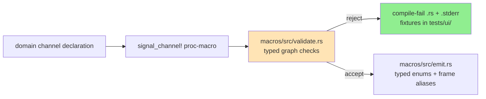
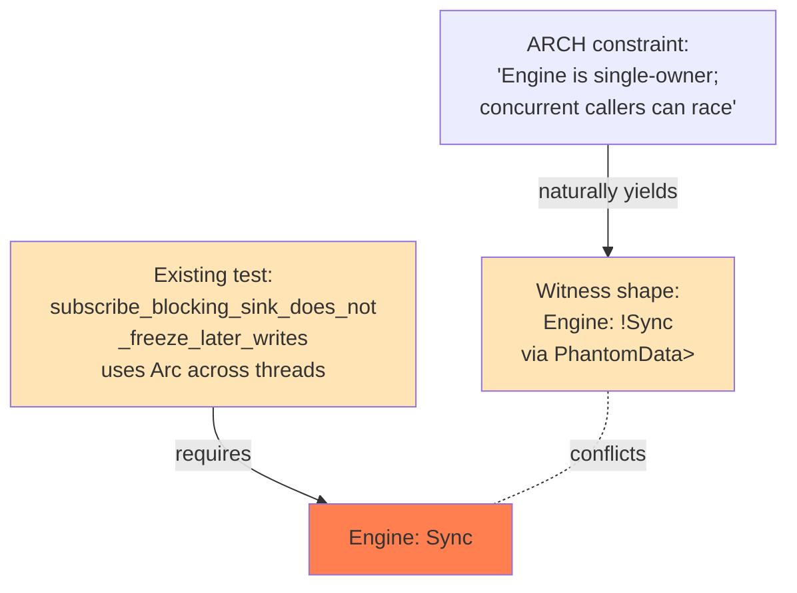

# 131 — Kernel stack audit: witness additions for signal-core, `!Sync` gap for sema-engine

**Date**: 2026-05-16
**Role**: operator-assistant
**Scope**: Light-touch witness additions to the wire kernel (`signal-core`)
and the database engine library (`sema-engine`), per the brief in DR/192
§4.2 "Constraints without witnesses".

---

## 0 · Headline

Two signal-core commits landed; sema-engine deferred. The kernels' load-bearing
constraints now carry stronger compile-time and byte-level witnesses on the
wire side. On the engine side, the natural `!Sync` witness collides with an
existing legitimate cross-thread test and is left open as a design question
for the designer lane.

| Repo | Commit | What |
|---|---|---|
| `signal-core` | `bfd67c61` | 4 new compile-fail witnesses for `signal_channel!`: unknown verb, duplicate variant name, close not Retract, close-token-type mismatch. Total goes from 4 → 8 cases. |
| `signal-core` | `f17efc1c` | Wire-format stability witness with two committed rkyv golden byte fixtures (`handshake_request_frame.bin`, `request_frame_single_assert.bin`). Catches feature-flag, rkyv-version, and platform-endianness drift. |
| `sema-engine` | — | Engine `!Sync` witness **deferred** — see §3 below. |

`nix flake check` is clean on `signal-core` after both commits.

---

## 1 · signal-core: 4 new compile-fail witnesses

### 1.1 · What landed

`tests/ui/channel_macro/` grows from 4 → 8 cases. The new fixtures pin
high-value misuse patterns the macro already rejects but did not have
witnessed `.stderr` fixtures for:

| Fixture | Catches | Validation site |
|---|---|---|
| `unknown_verb.rs` | `Atomic Create(...)` and any non-six-root verb (typos like `Asser`) | `macros/src/validate.rs::validate_verbs` |
| `duplicate_variant_name.rs` | Two request variants sharing the same Rust variant name (e.g. `Assert Create(X), Mutate Create(Y)`) | `macros/src/validate.rs::validate_variant_uniqueness` |
| `close_not_retract.rs` | Stream `close` variant tagged with a verb other than `Retract` (here `Mutate`) | `macros/src/validate.rs::validate_stream_relations` line 320 |
| `close_token_type_mismatch.rs` | Stream `token <Type>` not matching the close variant's payload type | `macros/src/validate.rs::validate_stream_relations` line 333 |

Each fixture's `.stderr` was generated with `TRYBUILD=overwrite` and the
emitted span-pointed diagnostic was reviewed for naming/positivity before
commit. Each `.stderr` is a real Rust compiler error message with a precise
source span.



Negative outcome: a future macro change that drops one of these validations
silently lets a malformed declaration pass; the corresponding compile-fail
test fails and surfaces the regression. Per ESSENCE §"Constraints become
tests" — these convert prose constraints in `ARCHITECTURE.md` into observable
witnesses.

### 1.2 · Why these four and not others

The macro's `validate.rs` enumerates ~16 distinct rejection paths. The first
4 witnesses (existing) covered the stream-relation graph; the 4 new ones
target the **verb spine + close-binding** layer:

- **Unknown verb** is the natural place a refactor would re-introduce
  `Atomic`. The witness names `Atomic` directly in the fixture, making the
  rejection a self-documenting precedent.
- **Duplicate variant name** catches the most common typo failure in growing
  channel declarations.
- **Close-not-Retract** and **Close-token mismatch** are the two paths by
  which stream close-channel binding can drift; both are load-bearing
  for `signal_channel!`'s claim that "every stream's close maps to a typed
  retract on the canonical token."

The remaining ~8 validation paths (e.g. `belongs` to undeclared stream,
event variant missing `belongs`, stream-opened-variant doesn't resolve to
reply) are partly covered by `orphan_stream.rs` and
`reverse_belongs_mismatch.rs`. Adding witnesses for each at this point would
be diminishing returns; further fixtures should land when a real consumer
bug surfaces them.

## 2 · signal-core: wire-format stability witness

### 2.1 · What landed

`tests/wire_format_stability.rs` pins two canonical encodings to byte-level
fixtures under `tests/golden/`:

| Fixture | Frame value | Catches |
|---|---|---|
| `handshake_request_frame.bin` | `ExchangeFrame::HandshakeRequest(HandshakeRequest::current())` | `ProtocolVersion`, `HandshakeRequest` record drift |
| `request_frame_single_assert.bin` | `ExchangeFrame::Request { exchange: ExchangeIdentifier(epoch=1, Connector, seq=0), request: Request::from(WireFixturePayload { sequence: 42, label: "stability witness" }) }` | `ExchangeIdentifier`, `LaneSequence`, `Operation`, `Request`, payload encoding |

The test uses a private fixture payload struct (`WireFixturePayload`) with
trivial fields (`u64 + String`) so domain-record drift doesn't couple to
this test. The witnesses are **about framing layer bytes**, not about
domain-payload encoding.

Failure mode caught: a future `rkyv` version bump, a feature-flag change
(losing `unaligned`, switching `little_endian`, etc.), or a platform that
honors `pointer_width_32` differently produces a byte mismatch and fails
the test with a diff showing offsets and the relevant fixture name. The
panic message names the canonical refresh path:

```
SIGNAL_CORE_WIRE_FIXTURE_OVERWRITE=1 cargo test --test wire_format_stability
```

— so a real intentional wire change can refresh fixtures, but unintentional
drift surfaces loudly.

### 2.2 · The flake source filter

`flake.nix`'s `cleanSourceWith` filter was extended:

```nix
filter = path: type:
    (craneLib.filterCargoSources path type)
    || (builtins.match ".*\\.stderr$" path != null)
    || (builtins.match ".*/tests/golden/.*\\.bin$" path != null);
```

Without this addition, `craneLib.filterCargoSources` skips `.bin` files and
the golden fixtures wouldn't make it into the nix build sandbox. The
glob is scoped to `tests/golden/*.bin` so it doesn't accidentally pull in
unrelated binary files from elsewhere in the repo tree.

### 2.3 · Verifying the witness fires

The witness was verified-by-mutation before commit. Changing
`WireFixturePayload::new(42, "stability witness")` → `new(43, ...)` made the
test fail with:

```
assertion `left == right` failed: wire-format drift in fixture
`/git/.../tests/golden/request_frame_single_assert.bin` — encoding changed
since the golden fixture was committed. Investigate before refreshing: a
real wire change requires coordinated consumer upgrades.
```

with both byte arrays printed and the offset of the diverged byte visible.
The mutation was reverted before the commit landed.

## 3 · sema-engine: `Engine: !Sync` deferred — open architectural question

### 3.1 · What was attempted

The brief suggested adding `Engine: !Sync` via a `PhantomData<Cell<()>>`
field. The single-owner constraint in `ARCHITECTURE.md` states:

> `Engine` is a single-owner handle. Snapshot allocation and prevalidation
> read transactions sit outside the write transaction, so concurrent
> callers on the same `Engine` can race the commit log. Component daemons
> must own each `Engine` from one actor and serialise all engine calls
> through that actor.

`!Sync` is the natural type-system enforcement for "no `&Engine` shared
across threads". Kameo's `Actor` trait requires `Send + 'static` only — not
`Sync` (verified against `kameo-0.20.0/src/actor.rs`). So adding `!Sync`
would not break the actor-ownership pattern.

The witness was implemented and the trait-resolution pattern was confirmed
to fire correctly: temporarily removing the `PhantomData<Cell<()>>` field
made the negative-witness test fail with the diagnostic the
`static_assertions::assert_not_impl_all`-style pattern emits ("multiple
impls satisfying `Engine: AmbiguousIfSync<_>` found").

### 3.2 · Why the witness was rolled back

Running the full `cargo test` revealed that `tests/subscriptions.rs`
contains an existing test —
`subscribe_blocking_sink_does_not_freeze_later_writes` (lines 443–489) —
which **deliberately wraps `Engine` in `Arc` and sends `Arc<Engine>` to a
worker thread**, then calls `engine.assert()` from both the main thread
and the spawned thread.

The test purpose is legitimate: it verifies that a slow/blocking
subscription sink does not stall later writes on the same engine. The way
it's set up makes the writes happen on two threads holding `&Engine`
through `Arc<Engine>`. Adding `!Sync` to `Engine` would break compilation
of this test because `Arc<T>: Send` requires `T: Send + Sync`.

This is a real design tension between two things both stated in `ARCHITECTURE.md`:

1. *"Engine is a single-owner handle … concurrent callers can race"* (the
   constraint the brief asks the witness to enforce).
2. The behavior the existing test asserts is observable through cross-thread
   `&Engine` access.



Per the brief: *"If the constraint would break legitimate use, document the
gap and leave it."* The witness was rolled back. `Engine`'s `Send + Sync`
status remains auto-derived (currently both, because every field is
`Send + Sync`).

### 3.3 · The architectural question for the designer lane

The choice points are:

**Option A — Tighten to `!Sync`, rewrite the test.**
Replace the test's `Arc<Engine>` cross-thread pattern with one of:
- Two separate `Engine` instances pointing at the same redb file (closer to
  the "single-owner per actor" pattern actually used in production).
- A single-thread "is the engine responsive after sink blocks" assertion
  using async tasks on one runtime.
- A drop-in cross-thread test that uses `Mutex<Engine>` and verifies the
  mutex doesn't deadlock — but this loses the "later write doesn't wait
  on first delivery" guarantee.

**Option B — Loosen the constraint, document `Sync` as intentional.**
Acknowledge that `&Engine` access from multiple threads is sometimes
legitimate (specifically, post-commit subscription delivery overlapping
with subsequent writes), and rewrite the `ARCHITECTURE.md` constraint to
distinguish between "concurrent commit-log writes" (truly forbidden,
caught by redb's write-transaction lock) and "overlapping calls in
general" (allowed). Add commentary explaining the redb-level write lock
already enforces serialization on the critical path.

**Option C — Add an inner `Mutex` and accept the constraint.**
Wrap the snapshot/log-counter logic in a mutex, making the race the
constraint warns about actually impossible, and keep the `Sync` external
interface. This loses the design value of "no implicit lock", but matches
how the test actually exercises the engine.

My recommendation: **Option A**. The test's pattern is real-world useful
but accidentally conflates "responsive engine" with "engine shared across
threads". Two `Engine`s on the same database, or a single-thread async
test, would assert the same property without contradicting the constraint.
But this is a designer call — see /192 §4.2 for the original wording of
the constraint and §2.1 for the engine's single-owner shape.

This deferral does **not** block any consumer. The constraint is currently
enforced by code-review discipline + the runtime danger of racing the
commit log; it just doesn't have a compile-time witness.

## 4 · Discipline notes

- **`main` only**, two commits, both pushed immediately. No branches.
- `nix flake check` green on signal-core after each commit.
- No refactoring of either kernel — only witness additions.
- The `Engine: !Sync` witness was implemented and tested locally before
  being rolled back; the rollback is recorded in §3.2 with the conflict
  diagnosis. No traces of the witness remain in `sema-engine`'s working
  tree.

## 5 · Completeness against the brief

| Brief item | Outcome |
|---|---|
| Engine `!Sync` witness | **Deferred** — see §3, conflict with `tests/subscriptions.rs`. Documented for designer. |
| Wire-format stability witness | **Landed** — 2 golden fixtures, `nix flake check` green. See §2. |
| Proc-macro compile-fail gaps | **Landed** — 4 new fixtures (4 → 8 total). See §1. |
| No refactoring | Honored — only `PhantomData` field attempted (rolled back), test files added. No structural change to either kernel's surface. |

## 6 · See also

- `/192` — Kernel stack gap scan; the design context for this work.
- `/177` — Typed Request/Reply spec + execution semantics.
- `/176` — `signal_channel!` proc-macro redesign.
- `signal-core` commits: `bfd67c61`, `f17efc1c`.
- `signal-core/ARCHITECTURE.md` §"Constraints" — the prose-level constraints
  these witnesses make falsifiable.
- `sema-engine/ARCHITECTURE.md` — "Engine is a single-owner handle"
  constraint, currently without compile-time witness; see §3 for the open
  question.
- `operator-assistant/121` — Prior kernel-readiness work that closed the
  fresh-key + sema-engine docs gaps.
