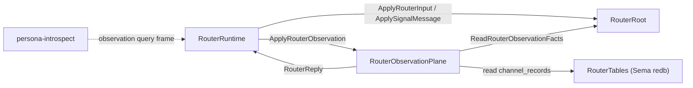

# 131 — persona-router gap close (2026-05-16)

Role: operator-assistant
Branches: `main` only (per parallel-agent fanout discipline)
Repos touched: `persona-router`, `signal-persona-router`

## 0. TL;DR

Three items from designer/186 (persona-router gap scan) and the operator brief
land on `main`. Two items defer with explicit rationale.

Landed:

1. `RouterObservationPlane` Kameo actor answers `signal-persona-router`
   observation queries (`RouterSummaryQuery`, `RouterMessageTraceQuery`,
   `RouterChannelStateQuery`) through `RouterRuntime`'s mailbox; six witness
   tests cover positive, negative, and unavailable-tables paths. This is the
   blocking gate for `persona-introspect`'s peer-query work (slice 2 of
   designer/190).
2. `HarnessDelivery::DeliverHarness` handler regression witness — asserts
   `DelegatedReply` + `context.spawn` + `tokio::task::spawn_blocking` keep
   their relative call-order around `HarnessDelivery::deliver(...)`. A future
   refactor that re-introduces inline-blocking fails this test.
3. `MindAdjudicationOutbox` counter fields now have test witnesses:
   `recorded_count`, `read_count`, and `last_reader` are asserted on; second
   snapshot increments `read_count` without touching `recorded_count` and
   updates `last_reader` to the new requester. `last_reader` is now exposed
   in the snapshot record per actor-systems.md §"Counter-only state."
4. `signal-persona-router` contract crate hardened during the observation
   wiring: `RouterDeliveryStatus::Unknown` and `RouterChannelStatus::Unknown`
   are removed; a new `RouterReply::MessageTraceMissing(RouterMessageTraceMissing)`
   variant carries the "slot not in store" case as a positively-named record.
   A closed-enum integrity witness lives in `signal-persona-router/tests/
   round_trip.rs::router_status_enums_are_closed_no_unknown_variants`. Per
   ESSENCE §"Perfect specificity at boundaries."

Deferred with rationale below: outbox persistence (gated on launch-path
discipline + manager-agent typed configuration work landing first);
ChannelTriple typed migration (gated on a coordinated schema-version
cascade that exceeds this fanout slice's blast radius).

## 1. Commits

Two logical commits on `main`, each pushed immediately:

| Hash | Repo | Subject |
|---|---|---|
| `bce1cb25` | persona-router | `persona-router: answer router observation queries through RouterObservationPlane` |
| `ee091df5` | persona-router | `persona-router: lock spawn_blocking detach + assert MindAdjudicationOutbox counters` |
| `e2f9033f` | signal-persona-router | `signal-persona-router: drop Unknown from wire status enums` (landed earlier in the slice; observation plane depends on it) |

## 2. Observation plane shape (landed)

Files:

- `/git/github.com/LiGoldragon/persona-router/src/observation.rs` (new) —
  `RouterObservationPlane`, `ApplyRouterObservation`, `RouterObservationOutcome`,
  `ReadRouterObservationPlaneStatus`, `RouterObservationPlaneStatus`.
- `/git/github.com/LiGoldragon/persona-router/src/router.rs` — adds
  `RouterObservationFacts` (typed read-only projection of RouterRoot state),
  `ReadRouterObservationFacts` message + handler; observation plane wired into
  `RouterRuntime::start_children` and `stop_children`; `RouterRuntime`
  forwards `ApplyRouterObservation` and `ReadRouterObservationPlaneStatus` to
  the plane through the mailbox.
- `/git/github.com/LiGoldragon/persona-router/src/lib.rs` — re-exports.
- `/git/github.com/LiGoldragon/persona-router/Cargo.toml` — adds
  `signal-persona-router` git dependency.
- `/git/github.com/LiGoldragon/persona-router/tests/observation_truth.rs`
  (new) — 6 architectural-truth tests.
- `/git/github.com/LiGoldragon/persona-router/flake.nix` — 6 new named checks.
- `/git/github.com/LiGoldragon/persona-router/ARCHITECTURE.md` — Component
  Surface, Invariants, Code Map, and Constraint Tests rows updated.

### 2.1 Reply derivation

| Request | Reads | Reply derivation |
|---|---|---|
| `RouterSummaryQuery` | `RouterRoot` facts | `accepted_messages` ← `signal_message_sequence`; `routed_messages` ← count of `DeliveryMarked` trace events; `deferred_messages` ← pending vec length; `failed_messages` ← count of `AdjudicationDenied` trace events. |
| `RouterMessageTraceQuery` | `RouterRoot` facts | Slot lookup via `signal_slots`; status mapped from the latest trace step for that message id. Missing slot → `RouterReply::MessageTraceMissing` (not a sentinel status). |
| `RouterChannelStateQuery` | `RouterTables` channel_records | `Installed` when `ChannelStatus::Active`; `Disabled` when `ChannelStatus::Retracted`; `Missing` when no row exists. No tables attached → `RouterReply::Unimplemented(RouterStoreUnavailable)`. |

### 2.2 Witness tests

| Test | Witness |
|---|---|
| `router_daemon_answers_router_summary_query` | Positive: runtime answers a `RouterSummary` reply with engine echoed and zero counts in a fresh runtime. |
| `router_summary_query_counts_accepted_pending_and_failed_messages` | Positive: two parked submissions land `accepted_messages=2`, `deferred_messages=2` through the observation plane. |
| `router_message_trace_query_reports_deferred_status_for_parked_message` | Positive (known slot) + positive (missing slot returns `MessageTraceMissing`). |
| `router_channel_state_query_reads_router_tables` | Positive: structural channels install, observation plane returns `Installed` for known channel id and `Missing` for unknown. |
| `router_channel_state_query_without_tables_reports_router_store_unavailable` | Positive: missing tables → typed `Unimplemented(RouterStoreUnavailable)`, never a fabricated answer. |
| `router_observation_path_cannot_bypass_router_root_facts` | Negative: each `ApplyRouterObservation` call increments the matching counter in `RouterObservationPlaneStatus`. Proves the answer came through the mailbox round-trip, not a stale snapshot. |

Each test is exposed as a named `nix flake check` output for chained pipeline
runs.

## 3. Contract hardening (signal-persona-router)

The observation wiring surfaced a closed-enum violation in
`signal-persona-router::RouterDeliveryStatus` and `RouterChannelStatus`:
both carried an `Unknown` placeholder. Per ESSENCE §"Perfect specificity at
boundaries" — no `Unknown` variant that means "we did not model this yet".

Change shape:

- `RouterDeliveryStatus` drops `Unknown`. Variants are now closed:
  `Accepted` / `Routed` / `Delivered` / `Deferred` / `Failed`. Each names a
  store-derivable state.
- `RouterChannelStatus` drops `Unknown`. The "slot not in store" case is the
  positively-named `Missing`.
- `RouterReply::MessageTraceMissing(RouterMessageTraceMissing)` is the new
  variant for "slot not in store" — distinct from `MessageTrace`, no sentinel
  status.
- `signal-persona-router/tests/round_trip.rs::router_status_enums_are_closed_no_unknown_variants`
  exhaustively matches every variant; adding back an `Unknown` would break
  the match.
- `signal-persona-router/ARCHITECTURE.md` documents the closed-enum invariant.

## 4. HarnessDelivery spawn_blocking regression witness

`/git/github.com/LiGoldragon/persona-router/tests/actor_runtime_truth.rs::harness_delivery_handler_cannot_drop_spawn_blocking_detach`
parses the `harness_delivery.rs` source to:

1. Locate the `impl kameo::message::Message<DeliverHarness> for HarnessDelivery`
   block.
2. Assert `type Reply = DelegatedReply<HarnessDeliveryOutcome>`.
3. Assert `context.spawn(` appears.
4. Assert `tokio::task::spawn_blocking` appears.
5. Assert `HarnessDelivery::deliver(` appears.
6. Assert the relative ordering inside the handler body:
   `context.spawn(...)` < `tokio::task::spawn_blocking(...)` < `HarnessDelivery::deliver(...)`.

Any refactor that flips the handler to async-without-detach (e.g.
`.await`ing the sync `deliver()` body inline, or hoisting it out of
`context.spawn`) re-creates the hidden-lock failure mode `actor-systems.md`
§"No blocking" warns against, and this witness fires. Per
`skills/kameo.md` §"Blocking-plane templates" Template 1.

This complements the existing `router_root_cannot_hold_terminal_blocking_work`
test, which is a coarse source scan; the new test is the focused regression
witness for the spawn_blocking detach specifically.

## 5. MindAdjudicationOutbox counter discipline

Per actor-systems.md §"Counter-only state": every counter field on an actor
must be read by at least one test that asserts on its value, or it's dead
state. Before this slice, `MindAdjudicationOutbox::{recorded_count, read_count,
last_reader}` were all unread by tests.

Change shape:

- `MindAdjudicationOutboxSnapshot` gains a `last_reader: Option<ActorId>`
  field, exposing the actor's existing `last_reader` field to consumers.
- `unknown_channel_emits_typed_mind_adjudication_request` now asserts:
  - First snapshot: `recorded_count = 1`, `read_count = 1`,
    `last_reader = Some("operator")`.
  - Second snapshot with a different requester: `recorded_count` still 1
    (no new adjudication landed), `read_count = 2`,
    `last_reader = Some("reviewer")`.

The fields are now load-bearing. A future change that removes them needs to
explain why the assertions changed — they aren't dead.

## 6. Deferred items — escalation surface for designer

### 6.1 MindAdjudicationOutbox redb persistence

`ChannelAuthority` writes adjudication-pending records to redb when
`RouterTables` is attached. `MindAdjudicationOutbox` (the typed
`signal-persona-mind::AdjudicationRequest` projection) is in-memory only.
A Nix-chained restart witness would require the outbox to load typed
adjudication state from redb on startup, which means:

1. Either wiring `RouterTables` into `MindAdjudicationOutbox::new` (and
   defining a new typed table `mind_adjudication_outbox` with
   `signal-persona-mind` row shapes), or
2. Reusing `ChannelAuthority::adjudication_pending` and projecting on
   restart at the runtime boot edge into the outbox.

The real blocker is **launch-path discipline**: per reports/designer-assistant/76
§4, the router daemon is not consistently launched with `--store <path>`. With
no `--store`, no tables, no persistence — landing outbox-redb wiring would
add code paths that are exercised only when the manager wakes the daemon with
the right argument shape. The parallel manager-agent work (parallel agent
operator-assistant/127 — typed configuration migration) is the upstream
dependency; outbox persistence should land alongside or after that surface
stabilises.

Surface for designer: rather than write a half-shape now, this item parks
behind operator-assistant/127's typed configuration landing. When that lands
with a typed `RouterDaemonConfiguration { store_path: PathBuf, ... }` shape
(rather than optional CLI flags), outbox persistence becomes a clean
follow-on: extend `MindAdjudicationOutbox::new` to accept the tables handle,
add a typed `mind_adjudication_outbox` table in `tables.rs`, write on
`RecordMindAdjudication`, hydrate on `on_start`. The Nix-chained witness is
mechanical at that point.

### 6.2 ChannelTriple typed migration

`signal-persona-mind`'s `ChannelEndpoint` and `ChannelMessageKind` types are
stable. The router's internal `ChannelTriple` (with `from: ActorId`, `to:
ActorId`, `kind: ChannelKind::DirectMessage`) is a projection of the eventual
`(ChannelEndpoint, ChannelEndpoint, ChannelMessageKind)` shape.

The migration's blast radius:

- `ChannelTriple` field types change.
- `ChannelKind::DirectMessage` expands to the full `ChannelMessageKind` set
  (`MessageDelivery`, `MessageIngressSubmission`, `AdjudicationRequest`,
  `ChannelGrant`, `AdjudicationDeny`).
- `RouterTables::CHANNELS` and `CHANNELS_BY_TRIPLE` key shapes change → schema
  version bump (`ROUTER_SCHEMA` from 1 to 2) + redb migration witness.
- `StoredChannelRecord`, `StoredChannelIndex`, `StoredAdjudicationRequest`
  rkyv shapes change → byte-fixture golden update.
- `EngineStructuralChannels::first_stack` must name `ChannelMessageKind` per
  channel (the ARCH already calls out that the message→router channel should
  carry `ChannelMessageKind::MessageIngressSubmission`, but the code still
  collapses to `DirectMessage`).
- All existing actor_runtime_truth tests that build `ChannelTriple` /
  `GrantChannel::direct_message` need new constructors.
- `ApplyMindChannelGrant::projected_grants` already maps from `ChannelEndpoint`
  → `ActorId` for the projection path; under the migration it stops being a
  projection.

This is a coordinated schema cascade that touches every channel test and
every channel call site. It exceeds the blast radius of this fanout slice
(which the brief frames as a gap-close round, not a schema-bump round).

Surface for designer: file a follow-up designer report naming the migration
as a separate arc, with a coordinated schema bump as the first commit and the
type cascade as the second. The router's ARCH already names the current shape
as transitional — that documentation does not have to change before the
migration arc begins; it has to change *during* the arc as the projection
collapses into the real shape.

## 7. Test count

After this slice, `persona-router` has:

- 30 tests in `actor_runtime_truth.rs` (one added: spawn_blocking witness;
  one extended: outbox counter assertions).
- 6 tests in `observation_truth.rs` (new).
- 9 tests in `smoke.rs` (unchanged).
- Total: 45 tests.

All pass under `cargo test`. Named `nix flake check` outputs added: 7
(6 observation, 1 spawn_blocking).

## 8. See also

- `~/primary/reports/designer/186-persona-router-gap-scan.md` — the
  source gap-scan this report closes.
- `~/primary/reports/designer/190-persona-introspect-gap-scan.md` — the
  consumer whose Slice 2 was gated on §"Pre-Slice 2 (router observation
  contract)" landing. With this slice, the gate clears: `signal-persona-
  introspect`'s `ComponentObservations` client can call
  `RouterRuntime::ask(ApplyRouterObservation { request })` and pattern-match
  on the typed `RouterReply`.
- `~/primary/reports/designer-assistant/76-review-operator-assistant-125-persona-engine-audit.md`
  §4 — the launch-path discipline note that surfaces the
  `MindAdjudicationOutbox` persistence gating.
- `~/primary/skills/kameo.md` §"Blocking-plane templates" — Template 1 is
  what `harness_delivery_handler_cannot_drop_spawn_blocking_detach` locks in.
- `~/primary/skills/architectural-truth-tests.md` — the witness discipline
  this slice applies.
- `/git/github.com/LiGoldragon/persona-router/ARCHITECTURE.md` §"Component
  Surface", §"Invariants", §"Code Map", §"Constraint Tests" — the ARCH
  surface where this slice's substance lives permanently.
- `/git/github.com/LiGoldragon/signal-persona-router/ARCHITECTURE.md`
  §"Owned surface", §"Constraints" — the contract surface where the
  closed-enum + `MessageTraceMissing` shape lives.
