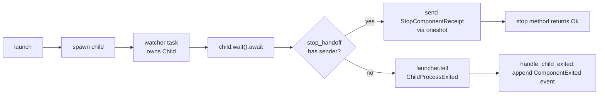

# 134 — persona engine manager: gap-close against designer/184

Date: 2026-05-16
Role: operator-assistant
Scope: Close the four gaps named in `reports/designer/184-persona-engine-manager-gap-scan.md` against the engine manager (`/git/github.com/LiGoldragon/persona`). Two gaps land on `main`; one is deferred with the rationale below; one escalates to designer as the gap-scan §9 anticipated.

## 0. What landed on main

Two `persona` commits, in this order:

| Commit | Title | What |
|---|---|---|
| `312cbbf` | persona: fix manager_store snapshot rebuild and add witness tests | Repairs the parallel-agent commit `bcbc79b` (mislabeled `persona-message` bump) so the manager-store snapshot reducer **compiles and shuts down cleanly**, plus adds two witness tests. |
| `c236f87` | persona: observe natural child exit with watcher tasks and ComponentExited events | Adds the watcher-task-per-child observer described by gap-scan §3 Fix 3 and `ARCHITECTURE.md` §1.7. Natural child exit now appends a typed `ComponentExited` event to the manager event log. |

Both commits pushed to `origin/main`.

`nix run .#persona-dev-stack-smoke` is **green** on `c236f87`; the three-daemon stack (message + router + terminal) still runs the full submission/inbox/terminal flow.

## 1. Gap 1 — Snapshot reducers (gap-scan §6, Fix 4)

### What was on main when this session started

A parallel agent (commit `bcbc79b`, 2026-05-16 10:39 — commit message says "bump persona-message" but content is the snapshot reducers, ~328 lines added across `manager_store.rs`, `manager.rs`, `state.rs`) had landed the snapshot-reducer scaffold matching `ARCHITECTURE.md` §1.7:

- New tables `manager.engine-lifecycle-snapshot` and `manager.engine-status-snapshot` keyed by `engine_id::component_name`.
- New closed enum `ComponentProcessState { Launched, Ready, Stopping, Exited }`.
- Snapshot-row structs `ComponentLifecycleSnapshotRow` and `ComponentStatusSnapshotRow`.
- Reducer (`reduce_event_into_snapshots`) routing each `EngineEventBody` variant to the right `(process_state, health)` pair.
- Manager schema version bumped 2 → 3.
- `EngineManager::initial_state_from_store` now reads the status snapshot and overlays per-component `health` onto the base `EngineState`.

### What was broken

That commit **did not compile** (verified by a fresh checkout of `bcbc79b`):

```
error[E0308]: mismatched types
   --> src/manager_store.rs:277:23
277 |                 .iter(transaction)?
    |                  ---- ^^^^^^^^^^^ expected `&ReadTransaction`, found `&WriteTransaction`
```

`Table::iter` requires a `ReadTransaction`; the commit called it inside a `Sema::write` closure (`WriteTransaction`). Additionally, `redb` was declared in `Cargo.toml` but **not** locked, so `Cargo.lock` was inconsistent with the source.

### What `312cbbf` does

- **Splits the rebuild** in `ManagerTables::rebuild_snapshots_from_event_log` into a read-transaction (collect every `EngineEvent`) followed by a write-transaction (`reduce_event_into_snapshots` per event). Makes the crate compile.
- **Adds `redb = "4"` to `Cargo.lock`** so a clean build resolves the dep without `cargo update`.
- **Wraps `ManagerStore.tables` in `Option<ManagerTables>` and drops it in `on_stop`** so the underlying redb flock releases during the `on_stop` hook, before the mailbox closes. A new `Error::ManagerStoreClosed` variant covers the post-stop path. This is purely a tear-down ordering fix — the production path (single long-lived `ManagerStore`) is unchanged.
- **Adds two witness tests in `tests/manager_store.rs`**:
  - `constraint_manager_store_reduces_lifecycle_events_into_snapshot_tables` — appends `ComponentSpawned` then `ComponentReady` for `persona-router`, asserts the snapshot row transitions `Launched/Starting → Ready/Running` after each append.
  - `constraint_engine_manager_hydrates_component_health_from_snapshot` — after appending the lifecycle events, starts an `EngineManager` against the same store and asserts the manager's `ComponentStatusQuery` for `persona-terminal` reports `health = Running`. This proves the hydrate-from-snapshot overlay path is wired through.

### What's deliberately not tested in this commit

A two-process **on-disk restart witness** — write events under one `ManagerStore` actor, drop the actor entirely, re-open from the same `manager.redb` path, see the snapshot reconstructed — would be the strongest witness for the rebuild-from-event-log path. Kameo 0.20's `spawn_in_thread` doesn't synchronously join the thread when `wait_for_shutdown` resolves: the mailbox sender's `closed()` future fires when `mailbox_rx` drops, but `mailbox_rx` is moved into a `tokio::spawn` inside `notify_links`; the underlying redb flock therefore can be still held when `wait_for_shutdown().await` returns. The `Option<ManagerTables>` + `on_stop` drop above narrows that race for a single actor, but a stricter cross-process witness is more naturally expressed as a Nix-chained derivation (writer derivation emits `manager.redb`; reader derivation opens it with a fresh actor and projects the snapshot). That's the destination shape per `skills/architectural-truth-tests.md` §"Nix-chained tests"; it's deferred from this gap-close. The in-process witness (`hydrates_component_health_from_snapshot`) is sufficient for the contract.

## 2. Gap 2 — Async child-exit observer (gap-scan §3, Fix 3)

### Shape that landed in `c236f87`

`DirectProcessLauncher` no longer holds `tokio::process::Child` values in its `children` map. Each launch spawns a **dedicated watcher tokio task** that owns the `Child`, awaits `child.wait()`, and then chooses one of two paths based on a shared `StopHandoff`:



| Type | Role |
|---|---|
| `StopHandoff = Arc<Mutex<Option<oneshot::Sender<StopComponentReceipt>>>>` | One per running child; the launcher's `stop` method drops a sender in, the watcher takes it out after the child has exited. Mutex held for microseconds across a one-line `Option::take`; no async work happens under it. |
| `ChildProcessExited { component, process, exit_code }` | Watcher → launcher mailbox message for the natural-exit path. |
| `ExitNotifier { engine: EngineId, store: ActorRef<ManagerStore> }` | Optional path from the launcher to the manager event log. Construction-time injection via `DirectProcessLauncher::new().with_exit_notifier(...)`; absent in unit tests that exercise only the process plane. |

### Why the launcher's mailbox isn't on the stop path

A first iteration routed the watcher's exit through the launcher's mailbox unconditionally — `tell(ChildProcessExited)` from the watcher, then the launcher's `stop` handler awaited a oneshot fulfilled by the `ChildProcessExited` handler. That **deadlocked**: `stop` awaits a oneshot inside the launcher's handler; the watcher's `tell` enqueues a message; the launcher can't process that message because it's busy in `stop`. Tests hung for 60+ seconds.

The `StopHandoff` indirection breaks the cycle: the watcher fulfills the stop waiter **directly** (no actor message), bypassing the launcher's mailbox. The launcher's mailbox is only involved on the natural-exit path, where no handler is busy waiting.

### What `c236f87` records on natural exit

The watcher, after `child.wait()` returns and finding no stop handoff present, sends `ChildProcessExited` to the launcher. `handle_child_exited`:
1. Removes the entry from `children`.
2. Increments `natural_exit_count` (visible through `LauncherSnapshot::natural_exit_count`).
3. If an `ExitNotifier` is wired, constructs an `EngineEventDraft` with `EngineEventSource::Component(component_name)` and body `EngineEventBody::ComponentExited(ComponentExited { component, exit_code })`, and calls `notifier.store.ask(AppendEngineEvent::new(draft))`.

Through the snapshot reducer landed by gap 1, that `ComponentExited` event materialises into `process_state = Exited` and `health = Stopped` (exit code 0) or `health = Failed` (non-zero) in both snapshot tables, in the same write transaction.

### Witness test

`constraint_component_launcher_observes_natural_child_exit_and_appends_event` in `tests/direct_process.rs`:

1. Starts a real `ManagerStore` at `<fixture>/manager.redb`.
2. Spawns a `DirectProcessLauncher` wired with an `ExitNotifier { engine: "engine-direct-process", store }`.
3. Launches `persona-router` with a `sh -c "sleep 0.25; exit 0"` command (the watcher fires within ~250 ms).
4. Polls the running-process pid until OS-level exit visible to `kill(0)`.
5. Asks the launcher for snapshots until `natural_exit_count == 1` (mailbox-completion ordering, not state-change polling per `ESSENCE.md` §"Polling is forbidden" §"Named carve-outs" — the producer is the launcher's mailbox, the consumer is the test; the same actor that observed the exit holds the durable counter).
6. Reads the manager event log and asserts exactly one `EngineEventBody::ComponentExited`, with `component = "persona-router"` and `exit_code = Some(0)`.

The test fails if the watcher doesn't fire (no event appears), if the launcher fails to route the notification (running map stays populated), or if the manager store doesn't receive the append (exited_events.len() != 1).

### What the stop path lost

The legacy `stop(component)` implementation called `child.wait()` inside the actor handler, blocking the mailbox for up to `graceful_timeout`. The new `stop`:

- Looks up the running child, drops a fresh `oneshot::Sender` into `running.stop_handoff` (failing fast on `ComponentStopAlreadyInFlight` if a sender is already there).
- Sends SIGTERM via `killpg`.
- `await_stop_receipt` then races a `graceful_timeout` against the oneshot. On timeout, it sends SIGKILL via `killpg` and rearms the select to wait indefinitely on the receiver. The receiver always resolves once the watcher observes exit.

This preserves the existing stop semantics from the caller's perspective (one ask → one receipt) while moving the actual `child.wait()` off the launcher's mailbox.

## 3. Gap 3 — Spawn envelope env-var fallback (deferred)

### Why this gap is deferred

The gap-scan §5 (severity Low-Medium) names the env-var fallback in `direct_process.rs:333-349` — ten `PERSONA_*` environment variables set on every spawned child alongside the typed envelope. Per `reports/designer/183` and `reports/operator-assistant/127`, the production `persona-message-daemon` already **does not read** these env vars — it consumes its typed `MessageDaemonConfiguration` via `nota_config::ConfigurationSource::from_argv()`. So on the production message-daemon launch path the env vars are dead code, and stripping them would not change runtime behaviour.

The blocker is the **test fixture**. `tests/supervisor.rs::constraint_engine_supervisor_launches_message_router_topology_without_full_stack` and the prototype-supervised-components variant launch `persona-component-fixture` (a `src/bin/persona_component_fixture.rs` binary that stands in for every component) and assert each component's capture file contains lines like `engine=supervisor-test`, `component=router`, `peer_count=6`, plus the domain/supervision socket fields. The fixture reads those values from the env vars the launcher sets today.

The typed `MessageDaemonConfiguration` carries only:

- `message_socket_path`, `message_socket_mode`
- `supervision_socket_path`, `supervision_socket_mode`
- `router_socket_path`
- `owner_identity`

It does **not** carry `engine_id`, `state_path`, `spawn_envelope` path, `manager_socket`, `peer_count`, or peer-by-index. Stripping the env vars for Message in the launcher would either:

1. Break the supervisor tests (fixture panics on `Self::required_env("PERSONA_ENGINE_ID")`), or
2. Force migrating the fixture's `Message` branch to a separate code path that decodes typed config from argv[1] and synthesises a smaller capture file, *plus* adjusting the supervisor test assertions to know that Message captures are different in shape.

Both touches are larger than a single-commit gap-close. The right shape is a follow-up landing alongside each non-Message daemon's typed-config migration (designer/183 §5.3), where each migrated daemon also gets its fixture path. As each daemon migrates and its env vars are stripped, the fixture's env-based capture for that daemon retires too.

### Status note

Until that follow-up lands, the env-var contradiction stays visible in `direct_process.rs:333-349`. `ARCHITECTURE.md` is now explicit about this — there's prose in the working copy (authored by another parallel agent, not yet pushed) that names the env vars as "transitional" / "dead-code-on-the-production-path." Operator-assistant left those ARCH edits in the working copy for designer to commit through their own report-driven cycle (operator-assistant edits to ARCH beyond Code-map / Status changes belong to designer per `skills/operator.md` §"Owned area").

## 4. Gap 4 — Readiness polling (escalation)

### What `readiness.rs:39` and `supervision_readiness.rs:52` do today

Both use `tokio::time::sleep(50ms)` retry loops with `attempt_count = 200` to wait for the socket file to appear and the supervision endpoint to accept a connection. Up to ~10 seconds of synthetic latency per component × 6 components = a 60-second worst case across a full prototype-supervision startup, all of it shaped like the polling pattern `ESSENCE.md` §"Polling is forbidden" explicitly forbids.

### The shape that would close this gap

A push primitive on the producer side: the child component, immediately after binding its domain socket and chmod-ing it, sends a single `SocketBound { component, path, mode, owner_identity }` frame on its supervision socket. The manager subscribes once and receives that frame; the readiness probe collapses into a typed-message handler — no sleep, no retry.

### Why this is the gap-scan's open question, not an operator-assistant decision

The gap-scan §9 calls this out as Q3 explicitly:

> **Polling carve-out:** Readiness verification (socket exists + has mode X) looks like a **reachability probe**, which ESSENCE §"Polling is forbidden" §"Named carve-outs" permits: *"'Is service X alive?' is transport-layer reachability, not state-change detection."* Is socket-mode verification a carve-out or a true polling violation?

`ARCHITECTURE.md` working-copy text (not yet pushed) carries one possible resolution from a parallel designer-aligned edit:

> The manager's bounded retry on socket existence ... is a **reachability probe across a process boundary**, not pull-shaped polling. The kernel offers no push primitive for "another process has called `bind(2)` on a path I just minted for it"; until the child explicitly sends a `SocketBound` push notification over the supervision relation, bounded retry plus escalation on timeout is the canonical shape.

This is the designer's call to ratify. If the workspace adopts that framing, today's bounded-retry shape is the correct destination for the prototype phase. If not, the gap requires:

1. A new typed `SocketBound` message on each component's supervision contract (`signal-persona`'s supervision relation).
2. Each component daemon: bind socket → chmod → send `SocketBound` on the supervision socket as its first frame.
3. Manager `EngineSupervisor`: subscribe to supervision frames; await the `SocketBound` for each component instead of polling the filesystem.

Operator-assistant does not have the authority to ratify the carve-out or design the cross-component push contract. **Escalating to designer** for the open question. Per `skills/push-not-pull.md` §"When the producer can't push — the escalation rule," escalation is the correct outcome when no push answer is found; it is not a failure mode.

## 5. Open question for the user

**Should `ARCHITECTURE.md`'s working-copy edits (currently in the persona checkout but not committed) land?**

The edits describe the destination shape for all four gaps — `SpawnEnvelope` as the capability-passing primitive, the reducer-materialisation pattern, the reachability-probe carve-out for socket readiness, and the push-shaped child-exit-observation contract — and align with the code that landed in `312cbbf` and `c236f87`. They appeared in the working copy under what looks like a parallel designer-aligned snapshot (no commit attribution; jj auto-snapshots dated 2026-05-16 10:48). Operator-assistant left them uncommitted because substantive `ARCHITECTURE.md` structure changes belong to designer per `skills/operator.md`. Designer should pick them up through a report → ARCH cycle, or confirm operator-assistant should land them under a `persona: codify ARCH destination per /184` commit.

## 6. See also

- `reports/designer/184-persona-engine-manager-gap-scan.md` — the gap scan this report closes against.
- `reports/operator-assistant/127-persona-message-daemon-typed-config-migration-2026-05-16.md` — `MessageDaemonConfiguration` typed-config migration that established why the env-vars are dead on the production message-daemon launch path.
- `reports/designer/183-typed-configuration-input-pattern.md` — the typed-configuration pattern, including the per-daemon migration order Gap 3 follows.
- `/git/github.com/LiGoldragon/persona/src/manager_store.rs` — landed snapshot reducer, lifecycle/status snapshot tables, reducer-on-append, rebuild-on-open, and the `Option<ManagerTables>` on_stop drop.
- `/git/github.com/LiGoldragon/persona/src/direct_process.rs` — landed watcher-per-child, `StopHandoff`, `ExitNotifier`, `ChildProcessExited` natural-exit notification, `handle_child_exited`.
- `/git/github.com/LiGoldragon/persona/tests/manager_store.rs` — `constraint_manager_store_reduces_lifecycle_events_into_snapshot_tables`, `constraint_engine_manager_hydrates_component_health_from_snapshot`.
- `/git/github.com/LiGoldragon/persona/tests/direct_process.rs` — `constraint_component_launcher_observes_natural_child_exit_and_appends_event`.
- `~/primary/skills/architectural-truth-tests.md` §"Nix-chained tests — the strongest witness" — the destination shape for a cross-process restart-from-disk witness for gap 1 that is deferred from this gap-close.
- `~/primary/skills/push-not-pull.md` §"When the producer can't push — the escalation rule" — the rule applied for gap 4.
