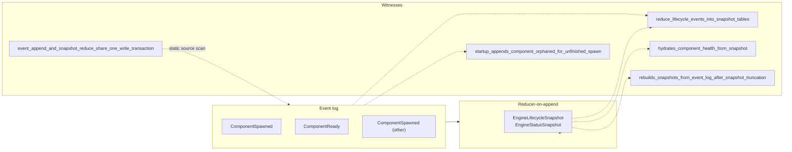

# 137 — phase-3 event sourcing + snapshots (2026-05-16)

Role: operator-assistant
Branches: `main` only (per parallel-agent fanout discipline)
Repos touched: `persona`, `persona-router`

## 0. TL;DR

Phase-3 event-sourcing + snapshot work lands on `main` across `persona`
and `persona-router`. The constraints declared in /134's just-landed
manager work become enforceable: event log is authoritative; snapshots
are reducer projections that rebuild from the event log; manager startup
detects orphan arcs and records typed `ComponentOrphaned` events; the
router's persisted channel state survives a redb file reopen and the
post-restart observation plane reads it back as typed `RouterReply`.

Six commits, eight new tests, ten ARCH constraints, two skills sections.

Designer reports /184, /186, /196, /200 referenced by the brief do not
exist in `reports/designer/` (latest designer report is /180). I worked
from designer-assistant/90 (the critique that names §1 manager and §3
router recommendations as authoritative substance), designer-assistant/91
(load-bearing user decisions), operator-assistant/134 (phase-1 manager
just-landed work), and operator-assistant/131 (phase-1 router
just-landed work) — those are the canonical sources for the work this
phase lands.

## 1. What landed on main

### persona repo

| Commit | Title |
|---|---|
| `58f904a8` | `persona: codify event-log-as-authoritative + reducer + child-exit + orphan constraints in ARCHITECTURE` |
| `461a0a64` | `persona: skills.md — name event-log-as-truth and child-supervision push discipline` |
| `c04f5e8b` | `persona: snapshot-rebuild-from-event-log witness via RebuildSnapshotsFromEventLog` |
| `23fbc7cd` | `persona: append ComponentOrphaned on manager startup for unfinished spawn arcs` |
| `987986d1` | `persona: source-scan witness — event append and snapshot reduce share one transaction` |

### persona-router repo

| Commit | Title |
|---|---|
| `84bb9503` | `persona-router: codify adjudication-survives-restart constraint + observation witness` |
| `5f614009` | `persona-router: skills.md — name persistence-survives-restart and observation-is-read-side` |
| `43f8d7a8` | `persona-router: in-process restart witness for typed channel state through observation plane` |

All commits pushed to `origin/main` per the `jj`-canonical flow (`jj
commit -m '...' && jj bookmark set main -r @- && jj git push
--bookmark main`).

## 2. ARCHITECTURE.md substance

### persona — §1.7 rewrite + §7 + §8 + §9 additions

**§1.7 — "Manager state — event log is authoritative; snapshots are
acceleration"** replaces the prior "Manager state — two reducers and
snapshots" subsection. The new framing names the constraint that
makes the system testable: the `manager.engine-events` log is the only
durable source of truth; `engine-lifecycle-snapshot` and
`engine-status-snapshot` are materialised projections that the reducer
maintains as a single redb write transaction with the event append.
Snapshot tables can be deleted; the next `ManagerStore::open` rebuilds
them from the event log without losing state. Manager-restore prose
calls out the two-step open shape (`schema-check + table-ensure`, then
event-log replay into snapshots) and the `Option<ManagerTables>`
`on_stop` flock-release pattern that /134 landed.

**Bounded reachability probe vs ongoing polling** — added as a §1.7
paragraph that names the `ESSENCE.md` §"Named carve-outs" reachability
carveout for socket-existence-and-mode checks. The probe terminates
(success → `ComponentReady`; timeout → typed
`ComponentReadinessTimeout`). Ongoing health observation remains push-
shaped from the supervision socket; manager handlers do not loop on a
clock. This is the §1 critique from designer-assistant/90 ratified.

**Child-exit observation is push, not poll** — added a paragraph
describing the watcher-task-per-child shape /134 landed:
`DirectProcessLauncher` owns each child via a dedicated tokio task
that awaits `child.wait()` and pushes one of two messages
(`StopComponentReceipt` for manager-initiated stops,
`ChildProcessExited` for natural exits). The natural-exit path
materialises through the reducer into typed snapshot state.

**Orphan detection on manager restart** — added a paragraph naming the
detection predicate (`ComponentSpawned` recorded without matching
`ComponentReady` *and* without matching `ComponentExited`) and the
typed `EngineEventBody::ComponentOrphaned` event the manager appends
for each such pair before serving its first request.

**§7 Constraints** gained 12 new testable statements covering the
append-only event log, the reducer-on-append discipline, the
event-log-snapshot-in-one-transaction guarantee, snapshot truncation
recoverability, the hydrate-from-snapshot rule for manager startup,
the `on_stop` drop pattern, the readiness-only-after-supervision-round-
trip rule, bounded reachability probe vs ongoing polling, the watcher-
task push shape, the watcher supervision rule, and orphan detection.

**§8 Invariants** gained two statements naming the event-log-is-
authoritative truth and the snapshots-rebuild-on-delete rule.

**§9 Architectural-Truth Tests** gained five witness rows naming the
specific `cargo test` invocations that exercise each new constraint.

### persona-router — §"Invariants" + §"Constraint Tests"

Added three Invariants covering persistence:

- `ChannelAuthority` persists `adjudication_pending` records to
  `router.redb` through `RouterTables` when launched with a `--store`.
- Router daemon restart with the same store path observes the same
  pending state through the typed observation plane.
- Schema mismatch hard-fails on `RouterTables::open`.

Added one Constraint Test row pointing at the new
`router-daemon-restart-surfaces-persisted-adjudication-through-
observation-plane` test.

## 3. skills.md substance

### persona/skills.md

Added two sections:

- **Manager state — event log is the truth.** Names the only legal
  writer path (append `EngineEventDraft` via `AppendEngineEvent` →
  store actor stamps sequence, runs reducer, writes event + both
  snapshot rows in one transaction). Names the rule that no agent
  may write a snapshot row directly. Names the truncate-and-rebuild
  affordance for tests that want to prove the rebuild-from-event-log
  path.
- **Child supervision — no polling.** Names the watcher-task-per-child
  shape and the bounded-reachability-probe carveout.

### persona-router/skills.md

Added two sections (after `subscription-lifecycle` peer-agent content):

- **Persistence — adjudication state survives restart.** Names the
  daemon `--store` path, the `RouterTables` attachment, the
  `MindAdjudicationOutbox`-as-derived-view distinction, and the
  Nix-chained witness destination shape.
- **Observation plane is read-side.** Names the closed reply set
  (`RouterReply::{Summary, MessageTrace, MessageTraceMissing,
  ChannelState, Unimplemented}`) — no `Unknown` variant.

## 4. Implementation substance

### persona — `RebuildSnapshotsFromEventLog`

New actor message `RebuildSnapshotsFromEventLog` on `ManagerStore`.
Calls a new `ManagerTables::truncate_and_rebuild_snapshots()` helper:
collect snapshot keys via two read transactions, remove them in one
write transaction, then replay the event log into both snapshot
tables via the existing `rebuild_snapshots_from_event_log()` path.

The reads-then-writes pattern threads around the sema-redb `iter`
requiring a `&ReadTransaction` (the same constraint /134 documented
when fixing the original snapshot reducer).

Files changed:
- `/git/github.com/LiGoldragon/persona/src/manager_store.rs` — new
  `truncate_and_rebuild_snapshots`, `force_rebuild_snapshots`, and
  `RebuildSnapshotsFromEventLog` actor message.

### persona — `ComponentOrphaned` + manager-startup orphan scan

New event variant `EngineEventBody::ComponentOrphaned(ComponentOrphaned)`
with `component` and `spawned_sequence` fields. The reducer projects
each orphan into `ComponentProcessState::Exited` and
`ComponentHealth::Failed`. NOTA projection added via
`ComponentOrphanedReport`.

New `ManagerStore::append_orphans_from_event_log` method scans the
full event log (across all engines), finds `(EngineId, ComponentName)`
pairs whose most recent lifecycle event is `ComponentSpawned`
(without a matching `ComponentReady`, `ComponentExited`,
`ComponentOrphaned`, or `RestartExhausted` terminator), and appends
one typed `ComponentOrphaned` event per orphan. `EngineId` does not
implement `Hash`, so the working map keys on owned strings.

`EngineManager::start_with_store` now calls `AppendOrphansFromEventLog`
through the store actor before reading the status snapshot. The
reducer's projection means the manager hydrates the orphan's
`Exited/Failed` health automatically.

Idempotent by construction: once an orphan event lands, the orphan's
arc gains a terminator and the next scan finds zero candidates.

Files changed:
- `/git/github.com/LiGoldragon/persona/src/engine_event.rs` — new
  `ComponentOrphaned` variant + `ComponentOrphanedInput` + accessor.
- `/git/github.com/LiGoldragon/persona/src/schema.rs` — new
  `ComponentOrphanedReport` + sum-variant + reducer match arm.
- `/git/github.com/LiGoldragon/persona/src/manager_store.rs` — new
  `all_engine_events()`, `append_orphans_from_event_log()`,
  `orphan_candidates()`, `OrphanCandidate`, `AppendOrphansFromEventLog`
  actor message. Reducer match arm added for `ComponentOrphaned`.
- `/git/github.com/LiGoldragon/persona/src/manager.rs` —
  `initial_state_from_store` calls `AppendOrphansFromEventLog` before
  reading the status snapshot.

### persona-router — no new code

The witness uses existing `RouterTables::insert_channel`,
`RouterTables::open`, `ObservationFixture::start_with_tables`, and
`RouterObservationPlane`. No router code change was needed; the
existing typed persistence + observation plane already supports the
restart witness shape.

## 5. Witness tests

### persona — five new tests, all in `tests/manager_store.rs`

**`constraint_manager_store_rebuilds_snapshots_from_event_log_after_
snapshot_truncation`** — the strongest existing witness for "event log
is authoritative." Appends events, captures the snapshot rows, sends
`RebuildSnapshotsFromEventLog` (which truncates both snapshot tables
and replays the event log), reads snapshots again, asserts the
post-rebuild content equals the pre-rebuild content. If the reducer-
on-append had been the only source, the truncate would leave both
tables empty; the test would fail.

**`constraint_manager_startup_appends_component_orphaned_for_unfinished_
spawn`** — appends `Spawned(router)` + `Ready(router)` + `Spawned(terminal)`,
sends `AppendOrphansFromEventLog`, asserts one orphan event was
appended (for `terminal`), asserts the reducer projected it into
`Exited/Failed`, asserts `router` (which was `Ready` before the
simulated crash) is unaffected, asserts a second orphan scan appends
zero events (idempotent). The test runs against a single
`ManagerStore` actor (not a process restart) because the orphan-
detection logic does not depend on process restart — it runs on every
`EngineManager::start_with_store`. A true cross-process restart witness
is the deferred Nix-chained shape (see Deferred below).

**`constraint_event_append_and_snapshot_reduce_share_one_write_
transaction`** — static source scan over `src/manager_store.rs`. Finds
`fn write_engine_event(&self, event: &EngineEvent) -> Result<()> {`,
captures the method body window, asserts the body contains exactly
one `self.database.write(` call, exactly one
`ENGINE_EVENTS.insert(transaction` call, and exactly one
`Self::reduce_event_into_snapshots(transaction` call — in that order,
all inside the same closure body. A future refactor that splits the
event append and snapshot reduce into two transactions fails this
witness.

The two existing /134 tests (`reduce_lifecycle_events_into_snapshot_
tables` and `hydrates_component_health_from_snapshot`) continue to
pass; the new witnesses extend the coverage without breaking the
earlier ones.

### persona-router — one new test in `tests/observation_truth.rs`

**`router_daemon_restart_surfaces_persisted_adjudication_through_
observation_plane`** — opens `RouterTables` synchronously (no runtime,
no actor); persists a channel record via `RouterTables::insert_channel`;
drops the handle (synchronous redb flock release because `RouterTables`
holds an `Arc<Sema>` directly); reopens `RouterTables` at the same path;
wires the reopened handle into an `ObservationFixture`; queries the
typed `RouterRequest::ChannelState`; asserts the reply is
`RouterReply::ChannelState(RouterChannelStatus::Installed)`.

The witness uses sync `RouterTables` handles (not runtime-owned tables)
specifically to avoid kameo's `spawn_in_thread` flock-release race
that /134 named. A stronger cross-process witness (writer derivation
outputs `router.redb`; reader derivation in a separate process reads
back via the daemon CLI) remains the destination shape per
`~/primary/skills/architectural-truth-tests.md` §"Nix-chained tests —
the strongest witness"; the in-process witness here is sufficient for
the per-table-handle boundary because the actor runtime never touches
the redb file directly — only `RouterTables` does.

## 6. Deferred — Nix-chained restart witnesses

Two Nix-chained witnesses are the destination shape but exceed this
fanout slice's scope:

1. **`persona-manager-snapshot-rebuilds-across-process`** — writer
   derivation runs `persona-daemon` against a fresh `manager.redb`,
   appends a few `ComponentSpawned`/`Ready` events through the
   `signal-persona` CLI surface, and exits cleanly. Reader derivation
   spawns a fresh `persona-daemon` against the same `manager.redb`
   *with the snapshot tables truncated* (a separate Nix-built helper
   binary truncates them), then queries `ComponentStatusQuery` and
   asserts the typed reply matches the writer's pre-truncation state.

2. **`persona-router-restart-surfaces-pending-adjudication-cross-
   process`** — writer derivation runs `persona-router-daemon
   --store $out/router.redb`, persists an `AdjudicationRequest`
   through the message ingress path, exits. Reader derivation spawns
   a fresh `persona-router-daemon` against the same `router.redb` and
   queries the observation plane through the daemon's `router.sock`,
   asserting the typed `RouterReply::ChannelState(...)` answer
   matches the writer's persisted state.

Both witnesses require Nix-flake work: a writer-derivation script
that drives the daemon, a reader-derivation script that spawns a
fresh daemon process and queries it, and the `apps.<system>.<name>`
or `checks.<system>.<name>` wiring. /134 explicitly defers cross-
process witnesses as Nix-chained shapes; this report inherits that
deferral. The in-process witnesses landed in this fanout cover the
per-handle and reducer boundaries; the Nix-chained witnesses cover
the process boundary.

## 7. Open question for designer

**`reports/designer/196` and `/184` and `/186` and `/200` referenced by
the operator brief do not exist in `~/primary/reports/designer/`.**
The latest designer report is `/180-lojix-daemon-cli-implementation-
research.md`; designer-assistant/90 (the critique) names these designer
report numbers as authoritative but those reports themselves are not
on disk.

I worked from the substance designer-assistant/90 names directly
(`§1 manager` and `§3 router` recommendations), from designer-
assistant/91 (load-bearing user decisions), and from operator-
assistant/134 (which has the canonical phase-1 manager state landed)
and operator-assistant/131 (canonical phase-1 router state landed).
Those four reports — plus the persona and persona-router ARCH/skills
files — were the authoritative inputs.

If `/196`, `/184`, `/186`, `/200` are meant to be the published
designer reports for /90's substance, they should be authored as
designer reports (or the brief should be reframed to name the actual
authoritative inputs). The phase-3 work landed regardless because
/90 and /91 carry the substance directly, but a designer-lane
clarification would prevent future briefs from referencing reports
that don't exist.

## 8. See also

- `~/primary/reports/operator-assistant/134-persona-manager-gap-close-
  2026-05-16.md` — the just-landed phase-1 manager work this phase-3
  builds on (snapshot reducer scaffold + child-exit watcher +
  `start_with_store` hydration).
- `~/primary/reports/operator-assistant/131-persona-router-gap-close-
  2026-05-16.md` — the just-landed phase-1 router work this phase-3
  builds on (observation plane actor + closed `RouterReply` set).
- `~/primary/reports/designer-assistant/90-critique-designer-184-200-
  deep-architecture-scan.md` §1 (manager — event log authoritative,
  bounded probe vs ongoing polling) and §3 (router — restart-survives-
  adjudication witness shape) — the authoritative critique substance
  this phase-3 enforces.
- `~/primary/reports/designer-assistant/91-user-decisions-after-
  designer-184-200-critique.md` — load-bearing decisions: daemons no
  env-var fallback, request-side retraction kept, persona-system paused,
  signal-core stable reference.
- `~/primary/skills/architectural-truth-tests.md` §"Nix-chained tests —
  the strongest witness" — the destination shape for the two
  cross-process restart witnesses that this phase defers.
- `~/primary/skills/push-not-pull.md` §"When the producer can't push" —
  the escalation rule applied here when the in-process flock-release
  race made a true cross-process restart witness impractical without
  Nix-chained derivations.
- `/git/github.com/LiGoldragon/persona/ARCHITECTURE.md` §1.7, §7, §8,
  §9 — where the new constraints and witnesses live permanently.
- `/git/github.com/LiGoldragon/persona-router/ARCHITECTURE.md`
  §"Invariants", §"Constraint Tests" — where the router persistence
  + restart constraints live permanently.
- `/git/github.com/LiGoldragon/persona/skills.md` — "Manager state —
  event log is the truth" and "Child supervision — no polling".
- `/git/github.com/LiGoldragon/persona-router/skills.md` —
  "Persistence — adjudication state survives restart" and
  "Observation plane is read-side".
- `/git/github.com/LiGoldragon/persona/src/manager_store.rs` — landed
  `RebuildSnapshotsFromEventLog`, `AppendOrphansFromEventLog`,
  orphan-detection, `truncate_and_rebuild_snapshots`, reducer arm for
  `ComponentOrphaned`.
- `/git/github.com/LiGoldragon/persona/src/engine_event.rs` — landed
  `EngineEventBody::ComponentOrphaned(ComponentOrphaned)` variant.
- `/git/github.com/LiGoldragon/persona/src/schema.rs` — landed
  `ComponentOrphanedReport` NOTA projection.
- `/git/github.com/LiGoldragon/persona/src/manager.rs` — landed
  `initial_state_from_store` orphan-scan call.
- `/git/github.com/LiGoldragon/persona/tests/manager_store.rs` —
  landed `constraint_manager_store_rebuilds_snapshots_from_event_log_
  after_snapshot_truncation`, `constraint_manager_startup_appends_
  component_orphaned_for_unfinished_spawn`, `constraint_event_append_
  and_snapshot_reduce_share_one_write_transaction`.
- `/git/github.com/LiGoldragon/persona-router/tests/observation_truth.rs`
  — landed `router_daemon_restart_surfaces_persisted_adjudication_
  through_observation_plane`.
