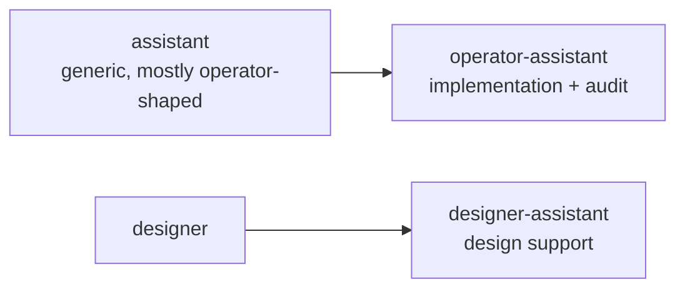

# 1 · Designer-assistant role bootstrap

Status: designer-assistant report for the role split requested on
2026-05-10.

Author: Codex as `designer-assistant`

---

## 0 · TL;DR

The generic `assistant` role is split into two named assistant
roles:

| Role | Lock file | Reports | Discipline |
|---|---|---|---|
| `operator-assistant` | `operator-assistant.lock` | `reports/operator-assistant/` | implementation and audit support under `skills/operator.md` |
| `designer-assistant` | `designer-assistant.lock` | `reports/designer-assistant/` | design, report, skill, and protocol support under `skills/designer.md` |

The old `assistant` role was operator-shaped in practice. Its skill
file and report directory move to `operator-assistant`, and the new
designer-assistant role gets its own skill, lock file, and report
surface.

---

## 1 · Files Changed

| Surface | Current shape |
|---|---|
| `protocols/orchestration.md` | six roles; helper-compatible role tokens |
| `AGENTS.md` | root role list names both assistants |
| `tools/orchestrate` | accepts `operator-assistant` and `designer-assistant` |
| `.gitignore` | ignores the two new runtime lock files |
| `skills/operator-assistant.md` | renamed and rewritten from the old `skills/assistant.md` |
| `skills/designer-assistant.md` | new role skill |
| `reports/operator-assistant/` | carries the prior assistant reports under the renamed role |
| `reports/designer-assistant/` | new designer-assistant report surface |

The moved report references now point at
`reports/operator-assistant/` so surviving cross-references keep
resolving.

---

## 2 · Operating Rule

Use `operator-assistant` for operator-shaped implementation support:
audits, tests, mechanical migrations, repo-local documentation drift,
and disjoint code slices.

Use `designer-assistant` for designer-shaped support: role-surface
changes, report inventories, skill/protocol edits, design audits, and
cross-reference cleanup.

Neither assistant role owns final judgment over its parent lane.
Unresolved design decisions return to designer; unresolved
implementation decisions return to operator or to a designer report
when they expose a structural gap.
