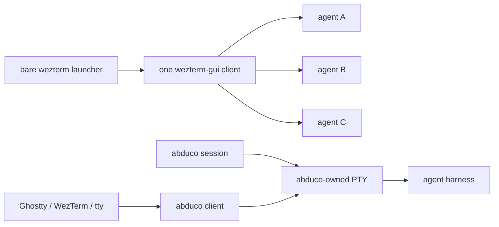
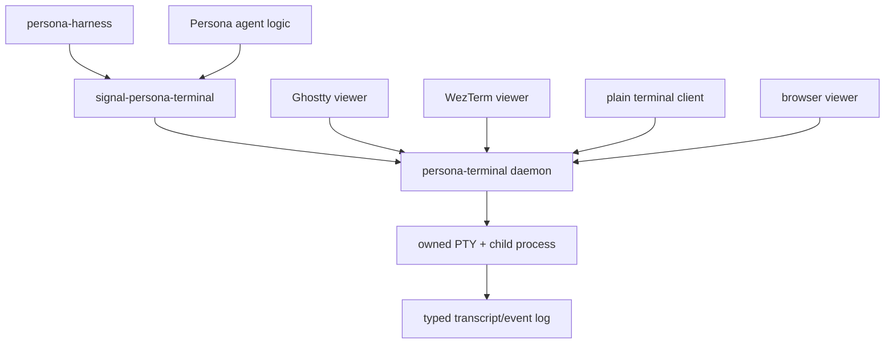

# 10 - Abduco terminal survivability research

*Designer-assistant research report. Question: can abduco/dvtm-style session
persistence reduce WezTerm blast radius for agent harnesses, and should
Persona stop treating WezTerm's mux as the durable terminal substrate?*

---

## Short answer

Yes, the idea makes sense. The useful primitive is not dvtm; it is
**abduco as a one-process session owner**. Abduco owns a PTY, runs the
application independently of the visible terminal, exposes a Unix socket,
and lets clients attach, detach, observe read-only, resize, and inject input.
That is exactly the survival boundary missing from the incident where one
WezTerm GUI client owned several agent windows and all died together.

But abduco is not enough as Persona's terminal truth. It deliberately does
not keep terminal state or transcript history. It forwards raw bytes. That
means:

- a GUI crash should not kill the child process if the child is under
  abduco;
- an attached terminal still feels much closer to a native terminal than
  tmux, because abduco is not doing tmux-style terminal emulation;
- output produced while no client is attached is not replayed as scrollback
  unless the application can redraw or a separate recorder captures it;
- programmatic input is easy (`abduco -p`), but programmatic read needs a
  connected observer or a separate transcript layer.

So my recommendation is:

**Use abduco as prior art and possibly an immediate containment launcher,
but make Persona's durable terminal component own the PTY and transcript
itself.** The existing `persona-wezterm` core already points that way:
`src/pty.rs` has a portable-pty daemon, Unix socket clients, scrollback replay,
input frames, and resize frames. That is closer to the right architecture than
WezTerm's mux or raw abduco.

The repo name `persona-wezterm` is now misleading. The architecture should
become `persona-terminal` as the durable PTY/session component, with WezTerm,
Ghostty, kitty, browser/xterm.js, or a plain terminal client as disposable
viewers.

---

## Terminology

The term you were reaching for is **terminal multiplexer**.

- WezTerm has a built-in mux and mux domains.
- tmux and dvtm are terminal multiplexers.
- dvtm is specifically a console window manager / multiplexer; it delegates
  session persistence to abduco.
- abduco is not a multiplexer. It is a terminal session manager: one command,
  one PTY, attach/detach clients.

That distinction matters. Persona does not primarily need pane/window
multiplexing. It needs:

1. the child process survives viewer death;
2. Persona can write input programmatically;
3. Persona can read/capture transcript programmatically;
4. humans can attach with any reasonable terminal;
5. GUI/compositor failure has small blast radius.

Abduco solves 1 and part of 2. Persona still needs to own 3.

---

## Local failure context

The relevant local reports are:

- `reports/system-specialist/101-chroma-wezterm-crash-suspects.md`
- `reports/system-specialist/102-wezterm-mux-survivability.md`
- `/git/github.com/LiGoldragon/persona-wezterm/reports/1-terminal-backend-survey.md`

The failure was not "all terminals everywhere died." It was more specific:
one WezTerm GUI client owned several windows/panes, and Niri/libwayland killed
that GUI client. Every agent whose terminal lived under that GUI client died
with it.

WezTerm has a mux-first mode that can keep panes alive when GUI windows go
away. `reports/system-specialist/102...` correctly says that needs a proof
test before trusting it. The incident path used bare `wezterm`, which can
reuse an existing GUI process and concentrate multiple windows into one
failure domain.

Abduco changes the owner:



In the second shape, the terminal GUI is a view. Killing the GUI should not
kill the agent.

---

## What abduco actually provides

Primary-source findings:

- The abduco README says it lets programs run independently from their
  controlling terminal and later be reattached. It positions abduco + dvtm as
  a simpler alternative to tmux/screen.
- The man page says a session is an abduco server process that spawns the
  command in its own pseudo terminal; clients connect through a Unix domain
  socket and relay standard input/output.
- The same man page says abduco works on raw I/O bytes and does not interpret
  terminal escape sequences; terminal state is not preserved across sessions.
- The man page documents `-r` read-only attach and `-p` pass-through standard
  input to an existing session.
- The source exposes a small packet protocol: content, attach, detach,
  resize, exit, and pid.

Local checks:

- Installed abduco is available at `/home/li/.nix-profile/bin/abduco`.
- Nixpkgs reports `abduco` as `0.6.0-unstable-2020-04-30`.
- `abduco -n da-test sh -c '...'` created a detached session, left the child
  running, and listed it by server pid and name.
- `printf 'echo injected > ...\nexit\n' | abduco -p io-test` successfully sent
  input into a detached shell session.

So abduco is not just theoretically appropriate. It works locally and gives
the session-survival behavior we need to test.

---

## What abduco does not provide

Abduco is intentionally thin. That is its strength and its limitation.

It does not provide:

- durable transcript history;
- semantic terminal-state capture;
- structured event stream;
- replay of output generated while nobody was attached;
- typed request/reply semantics;
- per-agent lifecycle metadata;
- authorization;
- health supervision beyond the abduco server process itself.

This is the critical point: **abduco preserves the process, not the
observation history**.

For a human shell, that may be fine. For Persona, it is not enough. Persona
needs to know what the agent printed even if no human viewer was attached.
That means a Persona-owned recorder or PTY daemon still has to sit at the
durable boundary.

---

## tmux comparison

Your tmux objection is structurally right.

tmux is excellent at keeping sessions alive, but it becomes its own terminal
state machine and control language. It owns panes, scrollback, layout,
rendering state, copy mode, and a command protocol. That means Persona would
be tempted to scrape or command tmux as truth.

Abduco is cleaner because it does not try to be the terminal truth. It only
keeps the process attached to a PTY and relays bytes. That aligns much better
with Persona's design instinct: one small owner for one real concern.

The tradeoff is that abduco gives back the transcript problem to Persona.
That is good. Transcript should be Persona's typed terminal event stream, not
tmux's pane buffer.

---

## WezTerm comparison

WezTerm can be used in two very different ways:

1. **GUI-as-owner**: bare `wezterm` starts or reuses a GUI process, and
   panes/windows live under that process. This is the dangerous shape from the
   incident.
2. **mux-first**: a WezTerm mux server owns panes, and GUI clients attach to
   the mux. This is the WezTerm-native survivability shape.

The mux-first shape might work, but it still leaves Persona tied to WezTerm's
mux API and release/runtime behavior. It also does not solve headless
independence as cleanly as a Persona-owned PTY daemon.

WezTerm remains valuable as:

- a human viewer;
- a disposable adapter;
- a mux implementation to test against;
- a useful terminal emulator with a programmatic CLI.

It should not be the process owner for critical agents.

---

## Existing Persona code is already close

`/git/github.com/LiGoldragon/persona-wezterm/src/pty.rs` already contains
the durable shape:

- starts a child command behind `portable-pty`;
- owns a Unix socket;
- accepts multiple clients;
- broadcasts PTY output;
- keeps an 8 MiB byte scrollback ring;
- accepts input frames;
- accepts resize frames;
- has a viewer and capture path.

`/git/github.com/LiGoldragon/signal-persona-terminal/src/lib.rs` already
defines the right contract direction:

- `TerminalConnection`
- `TerminalInput`
- `TerminalResize`
- `TerminalDetachment`
- `TerminalCapture`
- pushed `TranscriptDelta`
- `TerminalCaptured`
- `TerminalExited`

That is the architecture abduco points toward, but with the missing Persona
parts included.

The problem is not that the code needs more WezTerm. The problem is that the
repo is named and partially framed as WezTerm when the real component is
terminal transport / durable PTY ownership.

---

## Best architecture



Invariants:

- The child agent process is not a child of the GUI terminal.
- Every terminal session has one durable owner.
- Viewers are disposable.
- Transcript deltas are pushed as typed events.
- Programmatic input goes through `TerminalInput`, not terminal-specific
  `send-text` commands.
- Capture reads Persona's transcript/screen model, not WezTerm/tmux
  scrollback.
- WezTerm, Ghostty, kitty, or xterm.js can disappear without changing the
  harness contract.

This is also headless-friendly. A headless system can run the daemon and
typed terminal contract with no GUI viewer attached.

---

## Where abduco fits

### Good immediate use

Use abduco as a containment launcher for important manual agent sessions:

```sh
abduco -A codex-main codex
```

Then attach from Ghostty, WezTerm, a Linux console, or SSH. A terminal GUI
crash should not kill the agent process.

Programmatic input is possible:

```sh
printf 'status\n' | abduco -p codex-main
```

Read-only observation is possible:

```sh
abduco -r -a codex-main
```

This is useful immediately, especially while WezTerm remains suspect.

### Bad final use

Do not make abduco the thing Persona relies on for transcript truth. It is
not designed for that. It does not replay detached output or maintain a
semantic screen model.

### Possible adapter use

Build an `AbducoSession` adapter only if we want to interoperate with manual
sessions. The adapter should be explicitly second-class:

- connect to an abduco socket;
- send input through abduco's packet protocol or `abduco -p`;
- observe future bytes through a read-only client;
- mark capture as incomplete unless a Persona recorder was attached for the
  entire session.

---

## Candidate path

1. Rename or split `persona-wezterm` into a viewer-neutral terminal transport
   component. The natural name is `persona-terminal`.
2. Keep the current `portable-pty` daemon as the core, but remove the
   WezTerm-specific assumption from the architecture.
3. Make `signal-persona-terminal` the only Persona-facing boundary.
4. Keep WezTerm as one viewer adapter.
5. Add a plain terminal client/viewer so Ghostty, Linux console, SSH, or
   any terminal can attach.
6. Add an abduco compatibility/experiment launcher for manual sessions.
7. Prove survival:
   - start an agent under the durable terminal daemon or abduco;
   - attach with WezTerm;
   - kill `wezterm-gui`;
   - reattach from Ghostty/plain terminal;
   - verify the agent is alive and Persona can still capture transcript.

---

## Open design question

The only real decision I see:

**Should the first durable terminal owner be our existing `portable-pty`
daemon, or should we use abduco as the process owner and build Persona's
recorder beside it?**

My answer: keep the existing `portable-pty` daemon as the owner. It already
has the features abduco lacks: scrollback, capture, typed event direction,
and a clean path to `signal-persona-terminal`. Abduco should inform the
design and serve as an emergency/manual launcher, not replace the core.

---

## Sources

- abduco README: <https://github.com/martanne/abduco>
- abduco man page: <https://www.mankier.com/1/abduco>
- abduco source: <https://raw.githubusercontent.com/martanne/abduco/master/abduco.c>
- dtach project page: <https://dtach.sourceforge.net/>
- dvtm project page: <https://www.brain-dump.org/projects/dvtm/>
- WezTerm multiplexing docs: <https://wezterm.org/multiplexing.html>
- Ghostty/libghostty README section: <https://github.com/ghostty-org/ghostty>
- kitty remote-control protocol: <https://sw.kovidgoyal.net/kitty/rc_protocol/>
- shpool README on docs.rs: <https://docs.rs/crate/shpool/latest>
- Local: `reports/system-specialist/101-chroma-wezterm-crash-suspects.md`
- Local: `reports/system-specialist/102-wezterm-mux-survivability.md`
- Local: `/git/github.com/LiGoldragon/persona-wezterm/reports/1-terminal-backend-survey.md`
- Local: `/git/github.com/LiGoldragon/persona-wezterm/src/pty.rs`
- Local: `/git/github.com/LiGoldragon/signal-persona-terminal/src/lib.rs`

