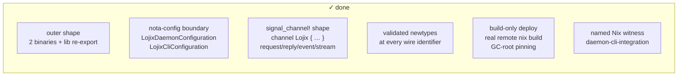

# 100 — lojix current-code audit, 2026-05-16

*Audit of the `horizon-re-engineering` worktree state of `lojix` and
`signal-lojix` against the recent design reports (designer/179,
designer/180, designer-assistant/94, designer-assistant/84) and the
system-specialist's own progress account (system-specialist/126).*

> **Status (2026-05-16):** Read-only audit. No code edits. The audit
> ran against the same-day worktree state — implementation landed by
> system-specialist (commits up to `78197649`) and the open-question
> design report (DA/94, same date) have not yet reconciled. This
> report names which design substance the code already realises,
> which it skips, and which open question the user should answer
> before durable sema state lands.

## 0 · TL;DR

The outer shape is right. The configuration boundary is well-done.
The build pipeline is real — `lojix-daemon` produces a working
CriomOS system closure for a real cluster node via a remote builder
and pins the realised output as a GC root. The end-to-end witness
`daemon-cli-integration` lives in the flake and is being run.

Three load-bearing gaps remain between *current code* and *design intent*:

1. **`sema-engine` is a dependency, not a substrate.** Every piece
   of "durable" state — event log, deployment counter, observation
   tokens — lives in actor memory. `Engine::open` is never called.
   This violates lojix ARCH C13 / C14 / C20, which the ARCH itself
   hedges around with "current implemented slice exposes the
   in-memory event log…" wording. SYS/126 names this as finish task
   #1 and #3.
2. **Identity-minting violates ESSENCE §"Infrastructure mints
   identity, time, and sender".** `RuntimeRoot::next_deployment()`
   does `format!("deployment_{n}")` with an in-process counter.
   ESSENCE's canonical anti-pattern is `format!("m-{}-...")` — this
   is the same shape. Two observation-token counters
   (`next_deployment_observation_token`,
   `next_cache_retention_observation_token`) share the same flaw.
   The fix is `Slot<…>` from sema-engine plus the engine's
   subscription tokens; both arrive together with finding (1).
3. **Subscriptions are one-shot snapshots, not pushed streams.**
   `DeploymentObservationSubscription` returns
   `DeploymentObservationSubscriptionOpened { token, observations }`
   with a filtered snapshot. The contract carries
   `DeploymentObservationStream` machinery and the macro emits the
   typed stream type; nothing in the daemon ever pushes
   `StreamingFrameBody::SubscriptionEvent` frames through it. The
   ARCH §"Invariants" point 3 says "Push, never poll" and C17 says
   "subscribers see them live"; neither is true yet. SYS/126 finish
   task #2 acknowledges this.

A fourth concern is coordination-shaped rather than implementation-
shaped: **DA/94's open question Q1 (two record families vs one with
a `Provenance` enum) has not been answered by the user**, and the
code has effectively committed to "one family" by shipping a single
`Generation` record. If /94 §3.1's argument still holds, the schema
needs the split *before* the durable sema state lands.

## 1 · What is well-done



### 1.1 Outer shape (C1–C3 ✓)

One crate `lojix` with two binaries (`lojix-daemon`, `lojix`) and a
library half that re-exports `signal_lojix` as `lojix::wire`.
Dependencies are pinned (`signal-core` main, `signal-lojix` branch,
`sema-engine` main, `nota-codec`, `kameo 0.20`, `tokio`,
`horizon-lib`).

### 1.2 Configuration boundary (Q6 ✓, C7b–C7d ✓)

`signal-lojix/src/lib.rs:289-309` owns both configuration records:

- `LojixDaemonConfiguration` — `daemon_socket_path`,
  `daemon_socket_mode`, `daemon_socket_group`, `state_directory`,
  `gc_root_directory`, `peer_daemons`, `operator_identity`,
  `owned_cluster`. Installs via
  `nota_config::impl_rkyv_configuration!`.
- `LojixCliConfiguration` — `daemon_socket_path`,
  `reply_rendering`. Installs via
  `nota_config::impl_nota_only_configuration!`.

This matches DA/94 §2 (per-binary configuration records) and Q6's
recommendation (configuration in `signal-lojix`, not in `lojix`).
The test file `tests/configuration_boundary.rs` is a witness.
`ReplyRendering` honestly carries only `Compact` (Pretty / NDJSON
were dropped to stay honest about implementation — matches
ESSENCE §"Today and eventually").

### 1.3 Streaming `signal_channel!` shape (Gap A from /180 ✓, Q5 partial)

`signal-lojix/src/lib.rs:646-688` uses the new proc-macro grammar:

```text
signal_channel! {
    channel Lojix {
        request Request { Assert … Mutate … Match … Subscribe … opens … Retract … }
        reply Reply { … }
        event Event { … belongs … }
        stream DeploymentObservationStream { token … opened … event … close … }
        stream CacheRetentionObservationStream { token … opened … event … close … }
    }
}
```

Two streams (deployment + cache retention). Subscriptions carry
typed filter records (Q3 ✓). Each stream's close is a typed
`Retract` request variant (Q5 recommendation taken; matches
DA/94 Q5(b) "symmetric close").

### 1.4 Validated newtypes at the wire surface

`signal-lojix/src/lib.rs:27-251` defines three macros
(`validated_identifier!`, `validated_single_line_text!`,
`validated_store_path!`) and applies them to every text-shaped
boundary: `ClusterName`, `NodeName`, `UserName`, `DeploymentId`,
`CacheRetentionMutationId`, `GenerationId`, `ProposalSource`,
`FlakeReference`, `FailureText`, `WirePath`, `OperatorIdentity`,
`UnixGroup`, `StorePath`, `DerivationPath`. No `pub` fields on any
of them; `TryFrom`/`AsRef`/`Display`/`from_text` only. Clean per
ESSENCE §"Perfect specificity at boundaries".

### 1.5 Real build pipeline

`lojix/src/deploy.rs` is 1,524 lines and carries a coherent set of
types for the build path:

- `BuildOnlyRequest` validates and runs.
- `BuilderPolicy` resolves `BuilderSelection` against the projected
  horizon. `BuildLocally` is hard-rejected with a typed message.
- `ArtifactMaterialization` writes generated flake inputs
  (horizon, system, deployment, secrets) into the state directory.
- `RemoteInputStage` mkdir + rsync to the selected SSH builder.
- `NixBuild` runs remote `nix build --refresh --no-link
  --print-out-paths` with `--override-input`s pointing at NAR-hash-
  pinned local paths.
- `GarbageCollectionRoots::PinBuiltOutput` symlinks the realised
  store path under
  `<gc-root>/<cluster>/<node>/<kind>/built/<deployment>` via
  atomic-rename.

SYS/126 documents the verified end-to-end smoke against goldragon
zeus → Prometheus → realised
`/nix/store/qsz55smwzwl11i9p150ikkw5zisrmf6p-nixos-system-zeus-…`.
That witness exists.

Naming throughout is full English (per ESSENCE §"Naming"):
`RuntimeConfiguration`, `BuildJobActor`, `GarbageCollectionRoots`,
`RemoteInputStage`, `ArtifactMaterialization`, `MaterializedArtifact`,
`ExtraSubstituters`, `NarHashInput`. No `Cfg`/`Op`/`Req` shapes.

## 2 · The three load-bearing gaps

### 2.1 `sema-engine` is a dependency, not a substrate

`lojix/Cargo.toml:33` pins `sema-engine`. Nothing in `lojix/src/`
calls `sema_engine::Engine::open`, `register_table`, `assert`,
`mutate`, `match_records`, `subscribe`, or `commit`.
`lojix::deploy::EventLogActor` is:

```rust
pub struct EventLogActor {
    deployment_observations: Vec<wire::DeploymentObservation>,
}
```

— a `Vec<…>` in actor memory. Restart loses everything.
`RuntimeRoot` carries no `Engine` handle. There is no
`SubscriptionSink<R>` impl bridging engine deltas to wire frames.

Direct violations:

| ARCH constraint | What it says | Current state |
|---|---|---|
| C13 | Live generation set lives in a sema-engine table | No table; `GenerationQuery` returns empty Vec |
| C14 | Event log is append-only via sema-engine `Assert` | In-memory `Vec` |
| C17 | Subscribers see deltas live | Snapshot at subscribe time only |
| C20 | `GenerationQuery` reads via sema-engine `Match` | Always empty |

The ARCH already hedges in C16/C17/C20 ("current implemented slice
exposes the in-memory event log through subscription-open
snapshots; live pushed stream frames remain part of the next
stream-delivery slice"). SYS/126 finish steps #1 (sema-backed event
log), #2 (live pushed observation streams), #3 (live generation
set) name the same three.

### 2.2 Agent-minted identifiers violate ESSENCE

`lojix/src/runtime.rs:134-138`:

```rust
fn next_deployment(&mut self) -> wire::DeploymentId {
    let value = format!("deployment_{}", self.next_deployment_identifier);
    self.next_deployment_identifier += 1;
    wire::DeploymentId::from_text(value).expect("generated deployment id")
}
```

ESSENCE §"Infrastructure mints identity, time, and sender" calls
out exactly this shape — `format!("m-{}-...")` — as the canonical
anti-pattern. The agent (here, the daemon) is:

- doing the clock's work (maintaining a monotonic counter);
- packing a typed value into a stringly-typed format
  (`"deployment_1"`);
- inventing a parallel identity scheme alongside the slot the
  store would assign on commit;
- holding the counter in memory so a restart resets it to 1 and
  collides with prior deployments.

Two more counters share the flaw:
`next_deployment_observation_token: u64` and
`next_cache_retention_observation_token: u64` at lines 96-97 of the
same file. These should be `SubscriptionTokenInner` values from
sema-engine's `subscribe` primitive — which would also give them
stable typed identity across the wire instead of two parallel
`*ObservationToken` newtypes in the contract.

Fix scope: lands together with §2.1 — once `Engine::assert` is the
write path, the engine assigns the slot; the reply carries the
typed slot back. The string-format counter dies. The two
observation-token counters become `SubscriptionTokenInner` per
sema-engine's subscribe surface.

### 2.3 Subscriptions are one-shot snapshots

`lojix/src/runtime.rs:210-224` and `deploy.rs:78-97` together:

- `Request::DeploymentObservationSubscription` mints a fresh token,
  asks `EventLogActor` for a filtered snapshot, and returns
  `Reply::DeploymentObservationSubscriptionOpened { token,
  observations }`.
- After the reply is sent, the daemon does nothing more. There is
  no `SubscriptionSink` impl, no `StreamingFrameBody::SubscriptionEvent`
  emission path, no per-connection subscriber registry.
- `BuildJobActor::append` only writes into the in-memory event log
  via `EventLogActor::ask(AppendDeploymentObservation { … })`.
  Subscribers opened *before* `append` still receive nothing live.

The contract has the streaming machinery, but the daemon implements
the subscription as `Match` masquerading as `Subscribe`. ESSENCE
§"Polling is forbidden" applies: today's only way to see a new
event is to re-`Subscribe` (which is polling, dressed up). ARCH
invariant §3 and C17 are aspirational.

The fix is the `SubscriptionSink` bridge per /180 Wave 2 step 8:
the daemon registers a sink with sema-engine; the sink converts
each `SubscriptionEvent::Delta` into a `StreamingFrame` and writes
it to the per-connection task. This work blocks on §2.1 (sema
state has to be the truth before its deltas mean anything).

## 3 · DA/94 design-substance gap

DA/94 is dated today (2026-05-16) and explicitly carries six
open questions for the user. The implementation landed over the
same day. The matrix of design recommendation vs current code:

| DA/94 question | Recommendation | Current code |
|---|---|---|
| Q1 — primordial vs tentative state (2 families vs Provenance enum) | **two families** | Single `Generation` record. No `local_host_facts` / `remote_host_beliefs`. |
| Q2 — partial SSH-dispatch outcomes | belief-with-uncertainty | N/A; SSH dispatch not implemented in build-only slice. |
| Q3 — trust capability today | Unix-group only | Matches: socket mode 0600 + optional group. |
| Q4 — per-host daemon shape | third binary in `lojix` | N/A; per-host scaffolding absent either way. |
| Q5 — subscription close path | symmetric `StreamClose` | Matches: two typed `Retract` variants per stream. |
| Q6 — configuration record location | in `signal-lojix` | Matches: both records there. |

Q1 is the load-bearing unresolved decision. By shipping a single
`Generation` record, the code has effectively committed to one
family. If /94 §3.1's argument still holds (different write paths,
different query shapes, type-checked provenance), the split needs to
happen *before* §2.1's sema state lands — otherwise the schema bump
later will require either a destructive migration or a parallel
table family bridged by a reducer.

The closely related substance (DA/94 §3.4's sole-operator invariant
test `out_of_band_nix_invocation_breaks_local_fact_correctness`) is
also absent. That test only makes sense once §2.1 lands; without
the local-fact table, "out of band" has nothing to corrupt.

## 4 · Smaller findings

### 4.1 Daemon-as-client (DA/94 §7, /180 Gap E) absent

`lojix/src/client.rs` is the CLI's client to the daemon. There is
no generic `SignalClient<R, P, E>` that the daemon could hold to
talk to `persona-mind`, `persona-introspect`, `clavifaber`, or a
peer `lojix-daemon`. `LojixDaemonConfiguration.peer_daemons:
Vec<PeerDaemonBinding>` is data-carried but unused — there is no
`PeerClientPool` actor. Per DA/94 Q4 the per-host gossip would
also need this surface; today's operator-side fabric needs it
already (the user named it explicitly as in-scope from day one).

### 4.2 `PeerObservationAssertion` (DA/94 §4) absent

The contract has no `Assert PeerObservationAssertion(…)` request
variant. When per-host daemons ship later, the contract bumps
schema. Cheap to add today, expensive to add later.

### 4.3 Hand-written `Request::operation_kind` (signal-lojix:690-710)

The proc-macro now emits `Request::request_kind()` automatically;
the hand-written `operation_kind` method is a parallel mapping with
its own typed enum (`OperationKind`). Either the macro-generated
form replaces this or the manual one needs a rename to clarify why
it exists.

### 4.4 Double-rejection of `BuildLocally`

`BuildOnlyRequest::validate_fast` rejects `BuildLocally` before any
tool runs; `BuilderPolicy::resolve` then also rejects it with a
different message. Either delete the second branch (`unreachable!`)
or let `validate_fast` go and centralise in `resolve`. Neither is
load-bearing — minor.

### 4.5 Reply variants `Subscription{Opened,Closed}` double-purpose

The macro grammar's `stream { opened … close … }` annotations
declare which reply/retract variants serve those roles. The reply
variants today *also* carry a snapshot vector in `Opened` — used
only because §2.3's live streaming isn't implemented. When
streaming lands, decide whether the snapshot stays on the open reply
(client knows what it joined into) or moves into the first
streamed event. Current shape works; the decision is forced once
the stream is live.

### 4.6 `LojixCliConfiguration` lacks `OperatorIdentity`

Both `LojixDaemonConfiguration` and `LojixCliConfiguration` could
plausibly carry the operator identity (the CLI for outbound auth,
the daemon for inbound dispatch attribution). Today only the daemon
does. If trust eventually moves to clavifaber-issued material at
handshake time (DA/94 §8), the CLI's identity has to come from
*somewhere* — either argv configuration or the connection's auth
proof. The latter is preferable per ESSENCE §"Infrastructure mints
identity"; flagged here so the decision is conscious when the trust
substrate arrives.

## 5 · Recommended next moves

In priority order, aligned with SYS/126's finish plan plus this
audit's findings:

1. **Get user sign-off on DA/94 Q1** (two record families vs one
   with a Provenance enum). This is the design decision that
   shapes §2.1's first sema slice. Until it lands, every other
   item in this list is downstream.
2. **Wire `sema-engine`.** First slice: event log as a typed
   record family with `Engine::assert` on the append path and
   `Engine::match_records` on the snapshot path. SYS/126 finish #1
   is the same item.
3. **Stop minting deployment IDs in user-space.** Once §2's
   `assert` returns a typed slot, the daemon emits the slot in
   `DeploymentAccepted.deployment` instead of `format!`-built
   strings. Same for the two observation-token counters via
   sema-engine's subscription tokens.
4. **Wire the `SubscriptionSink` bridge.** Per /180 Wave 2 step 8.
   `daemon/subscriptions.rs` converts each engine
   `SubscriptionEvent::Delta` into a `StreamingFrame` and writes
   it to the per-connection task. SYS/126 finish #2 same item.
5. **Land the sole-operator invariant test.** Once §2 puts the
   local fact in a typed table,
   `out_of_band_nix_invocation_breaks_local_fact_correctness`
   becomes a real architectural-truth witness per DA/94 §3.4.
6. **Decide on daemon-as-client surface scope.** Today's
   `peer_daemons` config field is unused; if the operator-side
   daemon talking to `persona-mind`/`persona-introspect`/
   `clavifaber` is on the near-term map (per DA/94 §7), file a
   bead for the `SignalClient` generic surface.

Items 7+ (closure copy, activation, rollback, cache retention,
production cutover) match SYS/126's order exactly and do not need
designer-side substance beyond what /180 §4 Wave 3–8 already names.

## 6 · See also

- `reports/designer-assistant/94-lojix-daemon-design-on-persona-engine-pattern.md`
  — primordial-vs-tentative state model, sole-operator invariant,
  daemon-as-client surface, six open questions (Q1–Q6). This audit
  applies its substance to the actual code.
- `reports/designer/180-lojix-daemon-cli-implementation-research.md`
  — six implementation gaps (A–F), eight-wave landing sequence.
  Gap A (channel wrap) and most of Gap B (Cargo.lock bumps) are
  closed; Gap D (streaming) is structurally in place but
  semantically not delivered (§2.3 above); Gap E (daemon-as-client)
  is absent (§4.1 above).
- `reports/designer/179-signal-core-sema-engine-lojix-readiness-audit.md`
  — kernel-readiness baseline; the kernels are ready, the consumer
  (lojix) hasn't yet consumed them.
- `reports/system-specialist/126-lojix-engine-progress-and-finish-plan.md`
  — system-specialist's own progress account; this audit's three
  load-bearing gaps line up exactly with SYS/126's finish steps
  #1, #2, #3.
- `reports/designer-assistant/84-horizon-rs-schema-fixes-and-json-roundtrip-seed.md`
  — adjacent: the horizon-rs schema fixes that this daemon's
  build path consumes.
- `/git/github.com/LiGoldragon/lojix/ARCHITECTURE.md` — 24
  constraints (C1–C24); the audit cross-checks each against the
  current worktree.
- `/git/github.com/LiGoldragon/signal-lojix/ARCHITECTURE.md` — wire
  vocabulary destination shape.
- `~/wt/github.com/LiGoldragon/lojix/horizon-re-engineering/` —
  audited worktree.
- `~/primary/ESSENCE.md` §"Infrastructure mints identity, time, and
  sender" — the rule §2.2 cites.
- `~/primary/ESSENCE.md` §"Polling is forbidden" — the rule §2.3
  cites.

*End report 100.*
