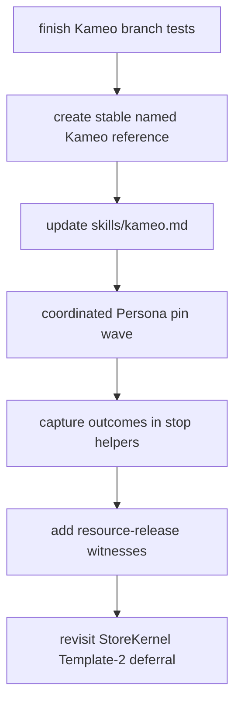

# 101 — Kameo lifecycle implementation impact

Date: 2026-05-16
Role: designer-assistant
Scope: assess how the Kameo lifecycle change affects current
Persona implementations, whether public usage is affected, and
which implementation patterns should change.

References:
- `reports/designer/204-kameo-lifecycle-canonical-design-2026-05-16.md`
- `reports/designer/205-kameo-lifecycle-migration-impact-2026-05-16.md`
- `reports/operator/130-kameo-terminal-lifecycle-implementation.md`
- `reports/designer-assistant/98-review-operator-130-kameo-lifecycle-implementation.md`
- Kameo branch `origin/kameo-push-only-lifecycle`

## 0. Verdict

The change affects **Kameo's public actor API**, but it does not
yet affect Persona's external component APIs or CLIs, because the
active Persona repositories still depend on crates.io
`kameo = "0.20"` rather than the fork branch.

Once Persona pins to the fork, the direct compile-impact appears
small:

- `wait_for_shutdown()` now returns `ActorTerminalOutcome`, but
  existing statement call sites that ignore it still compile.
- custom `on_link_died` implementations must add the new
  `outcome: ActorTerminalOutcome` parameter; I found no custom
  `on_link_died` overrides in the active Persona implementation
  repos.
- active Persona repos do not currently call Kameo `is_alive()`;
  the only `is_alive` hits were process helper functions, not
  actor refs.
- active Persona repos do not currently call
  `get_shutdown_result()`, `wait_for_shutdown_result()`, or
  `with_shutdown_result()`.

The deeper impact is semantic and architectural: many current
stop paths call `wait_for_shutdown().await` and discard the
result. That is source-compatible, but it wastes the new contract.
For resource-owning actors and supervisors, Persona should start
branching on `ActorTerminalOutcome` instead of treating actor
death as a boolean.

## 1. Important correction to Designer 205

Designer 205 is accurate for operator/130's reported commit
`1329a646`, but the remote branch has moved.

Current remote branch head:

```text
origin/kameo-push-only-lifecycle
44c0552 actor: split lifecycle control mailbox
```

That later commit materially addresses the two highest risks DA/98
and Designer 205 still treat as open:

1. **Control-plane separation.** `mailbox.rs` now stores ordinary
   messages and lifecycle/control signals in separate channels:
   `messages` plus `control`.
2. **Pending bounded send crossing closed admission.** ordinary
   messages are tagged with a generation; receivers drop stale
   queued user messages when the generation no longer matches.

New branch tests include:

- `control_signals_do_not_wait_for_bounded_user_mailbox_capacity`
- `pending_bounded_user_send_cannot_cross_closed_admission`

That does not mean the branch is finished, but it does mean the
adoption-blocker list should be updated. The "single bounded user
mailbox blocks link dispatch" critique was valid for `1329a646`;
it is no longer the current branch shape.

## 2. Public usage impact

### 2.1 Persona component CLIs and daemon protocols

No direct external break. `persona`, `persona-mind`,
`persona-router`, `persona-message`, `persona-introspect`,
`persona-system`, `persona-harness`, `persona-terminal`, and
`terminal-cell` still expose their own Signal/CLI surfaces. The
Kameo lifecycle change is internal to their actor runtimes.

This matters because users of `persona-message`, `persona status`,
`terminal-cell`, etc. should not see a CLI syntax change from this
alone.

### 2.2 Rust actor consumers

Kameo consumers do see a public API change.

| Surface | Impact | Migration |
|---|---|---|
| `ActorRef::wait_for_shutdown()` | return type changes from `()` to `ActorTerminalOutcome`; ignored call sites still compile | capture outcome where semantics matter |
| `WeakActorRef::wait_for_shutdown()` | same | same |
| `Actor::on_link_died` | signature adds `outcome: ActorTerminalOutcome` | add parameter and branch on `outcome.reason` |
| `is_alive()` | now means "accepting ordinary messages", not "terminal state not reached" | use `is_accepting_messages()` or `is_terminated()` |
| `shutdown_result` helpers | still compatibility surface | avoid in Persona; use terminal outcome |

The silent danger is not a compile break. The danger is code that
continues to compile while using old mental models, especially:

```rust
if !actor.is_alive() {
    restart_actor().await;
}
```

After the lifecycle change, that means "ordinary message admission
closed", not "the actor state is gone". Restart decisions should
wait for `ActorTerminalOutcome`.

## 3. Current implementation scan

### 3.1 Kameo dependency pins

All active Persona implementation crates I checked still depend on
crates.io `kameo = "0.20"`:

- `persona`
- `persona-mind`
- `persona-router`
- `persona-message`
- `persona-introspect`
- `persona-system`
- `persona-harness`
- `persona-terminal`
- `terminal-cell`

So none of the current implementation repos will see the lifecycle
change until a coordinated pin update lands.

Per workspace dependency discipline, the fork should be consumed
through a stable named reference once this branch is considered
the workspace Kameo interface. Do not pin Persona components to a
raw commit hash as the steady-state interface.

### 3.2 Custom `on_link_died`

I found no custom `on_link_died` implementations in the active
Persona implementation repos. The current breakage is mostly in
Kameo tests/testbeds, not Persona component code.

This is good: the signature break should not be a broad manual
edit across component actors.

### 3.3 `is_alive`

I found no Kameo `ActorRef::is_alive()` usage in the active
Persona repos. The matches were unrelated process helpers such as
`process_is_alive(pid)`.

This removes the biggest silent migration risk from current code,
but the skill should still be updated when the fork becomes
canonical: `is_alive()` is a compatibility alias and should not be
used in workspace actor code.

### 3.4 `wait_for_shutdown` call sites

There are many call sites that currently discard the terminal
outcome:

- `persona/src/manager.rs`
- `persona/tests/*`
- `persona-router/src/router.rs`
- `persona-router/tests/*`
- `persona-mind/src/actors/root.rs`
- `persona-introspect/src/daemon.rs`
- `persona-introspect/src/runtime.rs`
- `persona-harness/src/daemon.rs`
- `persona-harness/src/subscription.rs`
- `persona-system/src/daemon.rs`
- `persona-system/src/niri_focus.rs`
- `persona-terminal/src/supervisor.rs`

Discarding is acceptable for leaf tests where the only question is
"wait until stopped", but not for supervisors, resource-owning
actors, or component shutdown code.

## 4. Better patterns to adopt

### 4.1 Stop helpers should return or assert the terminal outcome

Current pattern:

```rust
pub async fn stop(reference: ActorRef<Self>) -> Result<()> {
    reference.stop_gracefully().await?;
    reference.wait_for_shutdown().await;
    Ok(())
}
```

Preferred pattern for resource-owning or component-root actors:

```rust
pub async fn stop(reference: ActorRef<Self>) -> Result<ActorTerminalOutcome> {
    reference.stop_gracefully().await?;
    let outcome = reference.wait_for_shutdown().await;
    Ok(outcome)
}
```

If the caller genuinely does not care about the outcome, make the
discard explicit:

```rust
let _outcome = reference.wait_for_shutdown().await;
```

For component roots, stronger is better:

```rust
let outcome = reference.wait_for_shutdown().await;
ensure!(outcome.state == ActorStateAbsence::Dropped);
ensure!(outcome.reason.is_normal());
```

### 4.2 Supervisors should fold child outcomes

Current parent shutdown code often does this:

```rust
let _ = child.stop_gracefully().await;
child.wait_for_shutdown().await;
```

The new shape lets the parent build a truthful child-shutdown
summary:

```rust
let _ = child.stop_gracefully().await;
let outcome = child.wait_for_shutdown().await;
self.child_shutdowns.push(ChildShutdown {
    child: ChildName::RouterRoot,
    outcome,
});
```

That is especially useful for `persona-router` and
`persona-introspect`, where root actors stop several child planes.
The parent can log or return which child ended cleanly, which
never allocated, and which failed cleanup.

### 4.3 Resource-owning actors need release witnesses

The new Kameo outcome is valuable only if we test it against the
real resources Persona cares about.

Add per-component tests for:

- `persona-mind::StoreKernel`: redb/sema-engine store lock can be
  reopened after `wait_for_shutdown()`.
- `terminal-cell::TerminalCell`: child process killed/reaped and
  control socket/path state is clean after terminal outcome.
- `persona-terminal::TerminalSupervisor`: terminal session
  records and control bindings do not survive as stale live state
  after shutdown.
- `persona-harness`: harness child process termination and
  transcript subscription handlers stop cleanly.
- `persona`: manager store redb file lock is released before a
  new manager store opens on the same path.

Kameo's branch test proves a `TcpListener` release. Persona still
needs its own resource witnesses.

### 4.4 StoreKernel Template-2 deferral can be revisited, not deleted yet

`persona-mind/src/actors/store/mod.rs` still contains the
Template-2 deferral comment explaining why `StoreKernel` does not
use supervised `spawn_in_thread`.

The branch now has:

- a `spawn_in_thread` release test for direct stop;
- a supervised restart release test for regular `spawn()`;
- no clearly visible supervised `spawn_in_thread` restart witness.

So the next step is not "remove the deferral"; it is:

1. add a Kameo test for supervised `spawn_in_thread` restart with
   an exclusive resource;
2. add a `persona-mind` StoreKernel reopen/restart witness;
3. then move StoreKernel to the intended blocking-plane topology
   if both tests pass.

### 4.5 Avoid `get_shutdown_result`

`wait_for_shutdown_result()` waits for the terminal lifecycle
before returning the old result surface. `get_shutdown_result()`
is still a nonblocking compatibility API, and the branch still
sets `shutdown_result` immediately before the terminal lifecycle
outcome in the stop path.

That creates a small observable compatibility window:

```text
get_shutdown_result() == Some(...)
is_terminated() == false
```

Persona should not use `get_shutdown_result()` for correctness.
If Kameo keeps it, it should either check terminal outcome before
returning `Some`, or be explicitly documented/deprecated as a
legacy diagnostic convenience.

### 4.6 `blocking_recv` needs scrutiny after split mailbox

The split mailbox made async `recv()` control-biased:

```rust
tokio::select! {
    biased;
    signal = control.recv() => ...
    queued = messages.recv() => ...
}
```

That is the right shape for actor loops.

But `blocking_recv()` currently checks `control.try_recv()` and
then blocks on the user-message channel. If a control signal
arrives after the `try_recv()` check while no user message arrives,
the blocking caller may remain parked on the message channel.

This may not affect the normal actor loop if Kameo uses async
`recv()` everywhere, but it is a public mailbox API edge and should
receive a targeted test or redesign. The clean shape is a blocking
wait that can be woken by either lane, not a try-control-then-block-
messages sequence.

### 4.7 Link handlers should branch on outcome, not legacy reason

The new `on_link_died` has both:

```rust
outcome: ActorTerminalOutcome,
reason: ActorStopReason,
```

Workspace code should treat `outcome` as the contract and
`reason` as legacy detail. `reason` carries old payloads such as
panic detail, but lifecycle decisions belong to
`outcome.state` and `outcome.reason`.

### 4.8 `is_alive` should disappear from workspace style

Even though current Persona code does not use Kameo `is_alive`,
the name is now too ambiguous. In workspace code:

- sendability: `is_accepting_messages()` or just send and handle
  `SendError`;
- terminal state: `is_terminated()`;
- correctness: `wait_for_shutdown()`.

The Kameo skill should say this plainly once the fork branch is
accepted.

## 5. Component-level impact

| Component | Current impact | Recommended change |
|---|---|---|
| `persona` | manager/store tests discard outcomes; manager store owns redb-like state | capture outcome in stop helpers; add release witness where store paths reopen |
| `persona-mind` | StoreKernel deferral is directly relevant | keep deferral until supervised `spawn_in_thread` + StoreKernel release tests pass |
| `persona-router` | root stops several child planes and discards outcomes | collect child terminal outcomes into a shutdown summary |
| `persona-message` | no direct issue found beyond standard Kameo pin | update with coordinated pin wave |
| `persona-introspect` | root stops many children and discards outcomes | fold child outcomes; store them in introspect's own diagnostics/sema if useful |
| `persona-system` | stop helpers discard outcomes | capture or explicitly discard; system is paused architecturally but still should follow pattern |
| `persona-harness` | subscription handlers and harness actor discard outcomes | capture handler outcomes where subscription shutdown matters |
| `persona-terminal` | supervisor stop discards outcome | return or assert terminal outcome; add control/socket cleanup witness |
| `terminal-cell` | owns child process and terminal session resources | add resource witness; ensure Kameo update does not change pass-through latency path |

## 6. What you did not ask, but matters

### 6.1 Kameo actor lifecycle is not daemon process lifecycle

The Kameo change helps components manage their internal actor
topology. It does not replace `persona-daemon`'s process-level
supervision of child daemons.

Persona still needs typed process events:

- component process spawned;
- component socket ready;
- component supervision relation ready;
- component process exited;
- process restart decision.

Do not let Kameo terminal outcomes leak into the cross-process
engine contract as if they describe daemon process state. They
describe actors inside a daemon.

### 6.2 Remote `PeerDisconnected` still looks semantically weak

The branch's `ActorTerminalOutcome::peer_disconnected()` uses
`state: Dropped`. A local node cannot prove a remote actor's state
was dropped. If Persona ever enables Kameo remote, this should
become a separate unknown/remote absence state before use.

Current Persona crates do not appear to enable Kameo remote; this
is future risk, not an immediate blocker.

### 6.3 The fork should get a named stable reference only after the remaining tests land

Do not repin the workspace just because the branch exists.

Minimum before workspace adoption:

1. Kameo lifecycle tests pass on the remote branch.
2. supervised `spawn_in_thread` exclusive-resource restart witness
   exists and passes.
3. `blocking_recv` split-mailbox edge is either fixed or proven
   irrelevant to actor loops.
4. Kameo skill is updated with the new public contract.
5. Components pin through a stable named reference, not a raw rev.

## 7. Suggested migration order



Within the Persona pin wave:

1. migrate any custom `on_link_died` signatures, if new ones have
   appeared;
2. ban Kameo `is_alive()` in workspace code;
3. capture or intentionally discard every `wait_for_shutdown`
   outcome;
4. add component-specific resource witnesses before relying on
   restart correctness.

## 8. Bottom line

Public Persona usage is not affected yet. Public Kameo usage is
affected.

The implementation impact is less about compile breaks and more
about correctness vocabulary. We now have a precise terminal
outcome; Persona should stop writing shutdown code as if "dead" is
a boolean. Component roots and supervisors should record, assert,
or return the terminal outcome, and every actor that owns an
exclusive resource needs a concrete release witness.

Designer 205's migration direction is right, but its current
"HIGH blockers are still open" framing should be revised against
branch head `44c0552`: the split control mailbox and generation
checks have landed. The remaining open questions are narrower:
supervised `spawn_in_thread`, `blocking_recv`, remote disconnect
truthfulness, outcome capture patterns, and component release
witnesses.
