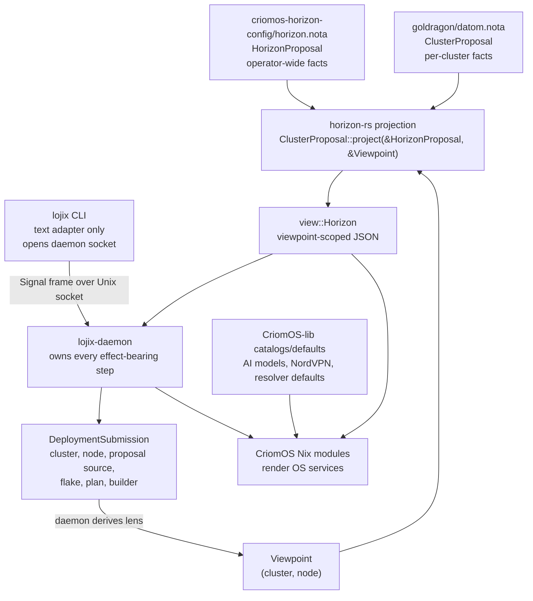
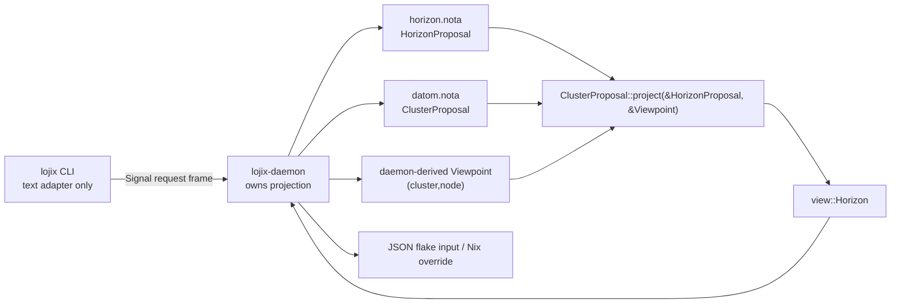

# 112 - Horizon/Lojix/CriomOS Direction Research

Date: 2026-05-17  
Role: designer-assistant

## Purpose

This report reconstructs the deleted
`reports/designer-assistant/110-ideal-cluster-schema-visualization-2026-05-17.md`
from jj operation history, compares it with the current
`horizon-leaner-shape` branch stack, and explains the earlier
recommendation:

> Refresh `horizon-rs/ARCHITECTURE.md` so it describes three projection
> inputs: `HorizonProposal`, `ClusterProposal`, and `Viewpoint`.

The short answer: the projection is no longer "read one
`datom.nota` and emit one Horizon view." It is now a three-input
reduction:

1. `HorizonProposal` - operator-wide horizon facts.
2. `ClusterProposal` - per-cluster authored facts.
3. `Viewpoint` - the concrete `(cluster, node)` lens for this deploy
   or debug request.

The code mostly implements this. The architecture prose still partly
reads like the old one-input system.

## What I Recovered From Report 110

The deleted `110` report was found via jj operation history at operation
`f09f19953722`. It was a schema sketch, not an implementation audit.
Its load-bearing claims:

- Cluster configuration should stay small.
- Cluster authors describe nodes, roles, placement, secrets, trust, and
  deliberate overrides.
- Defaults, provider catalogs, and operating-system implementation
  details live outside cluster data.
- Horizon is mostly a reducer/projector.
- CriomOS is allowed to render local service details from projected
  Horizon facts and CriomOS-owned defaults.
- A node can have multiple responsibilities. `Router` and `LargeAi`
  should not be mutually exclusive if Prometheus is both.

The report's ideal node shape:

```text
NodeProposal
  name
  species              # one primary noun
  roles/capabilities   # additive responsibilities
  placement
  trust
  machine/io facts
  public keys
  secret references
  explicit overrides
```

Illustrative example from that recovered report:

```nota
(Node prometheus
  species Edge
  trust Max
  roles [Router LargeAi NixBuilder]
  placement Metal
  machine (KnownMachine GmktecEvoX2)
  secrets [
    (UsesSecret router-wifi-sae-passwords WifiPassword)
    (UsesSecret nordvpn-credentials NordvpnCredentials)
  ]
  overrides [])
```

That schema is not implemented yet. Current `goldragon/datom.nota`
still uses the existing `NodeSpecies` shape, including
`LargeAiRouter`. The cleanup has made cluster data much leaner, but it
has not yet performed the species-plus-roles redesign.

## Current Implementation State

I inspected the active worktrees:

- `/home/li/wt/github.com/LiGoldragon/horizon-rs/horizon-leaner-shape`
- `/home/li/wt/github.com/LiGoldragon/signal-lojix/horizon-leaner-shape`
- `/home/li/wt/github.com/LiGoldragon/lojix/horizon-leaner-shape`
- `/home/li/wt/github.com/LiGoldragon/goldragon/horizon-leaner-shape`
- `/home/li/wt/github.com/LiGoldragon/CriomOS/horizon-leaner-shape`
- `/home/li/wt/github.com/LiGoldragon/CriomOS-lib/horizon-leaner-shape`

### What Landed Cleanly

`horizon-rs`:

- `HorizonProposal` exists in `lib/src/horizon_proposal.rs`.
- `ClusterProposal::project(&HorizonProposal, &Viewpoint)` is the live
  entrypoint.
- `HorizonProposal` now carries:
  - `operator`
  - `domain_suffixes`
  - `transitional_ipv4_lan`
  - `trusted_keys`
- `LanNetwork`, `LanCidr`, `DhcpPool`, and `ResolverPolicy` live under
  `view/network.rs`, not `proposal/network.rs`.
- `Ssid` lives on the projected router side.
- `horizon-cli` takes `--horizon`, `--proposal`, `--cluster`, and
  `--node`.

`signal-lojix`:

- `LojixDaemonConfiguration` now carries
  `horizon_configuration_source: WirePath`.

`lojix`:

- `RuntimeConfiguration::from_daemon_configuration` reads
  `configuration.horizon_configuration_source`.
- `BuildOnlyRequest` loads the pan-horizon config, loads the cluster
  proposal from the deploy submission, creates a `Viewpoint`, and calls
  `proposal.project(&horizon_proposal, &viewpoint)`.

`goldragon`:

- `datom.nota` no longer authors `domain`, `public_domain`, LAN,
  resolver policy, router SSID, AI model catalog, NordVPN catalog, or
  local-AI runtime config.
- It now authors provider selections:
  - `(AiProvider "criomos-local" prometheus CriomosLocalLlama None)`
  - `(NordvpnProfile (SecretReference "nordvpn-credentials"
    NordvpnCredentials) [])`

`CriomOS` / `CriomOS-lib`:

- CriomOS modules consume the lean projected Horizon.
- `CriomOS-lib` owns AI and NordVPN catalogs/defaults.
- `modules/nixos/llm.nix` enriches the cluster's AI provider selection
  from `criomos-lib.catalogs.ai.localLlama`.
- `modules/nixos/network/nordvpn.nix` enriches the cluster's NordVPN
  selection from `criomos-lib.catalogs.nordvpn`.

## How I See The System Operating

The current intended flow:



Correction from the user: the `lojix` CLI does not perform the work
above the daemon line. It does not read Horizon, project the cluster,
invoke Nix, stage flakes, derive a `Viewpoint`, or record deployment
state. It is only a human/agent text surface for the daemon:

```text
NOTA request text -> signal-lojix Request -> signal-core frame
daemon Reply -> NOTA reply text
```

Until agents can speak binary Signal directly, the CLI is the
translation adapter. The daemon is the actor that receives the request,
loads `HorizonProposal`, loads `ClusterProposal`, derives the
`Viewpoint` from the already-received request payload, calls
horizon-rs, invokes Nix, and records state. No arrow from CLI to Horizon
exists in the architecture.

The responsibilities:

| Layer | Owns |
|---|---|
| `criomos-horizon-config` | Horizon-wide authored facts: domain suffixes, temporary IPv4 LAN, later perhaps operator-wide trust roots. |
| `goldragon` cluster data | Cluster-owned facts: nodes, users, trust, secret bindings, provider selections, hardware, placement. |
| `horizon-rs` | Typed validation and projection from pan-horizon + cluster + viewpoint into one `view::Horizon`. |
| `signal-lojix` | Typed daemon/CLI startup configuration and deploy request/reply vocabulary. |
| `lojix` CLI | Thin text adapter: read one NOTA request, send one Signal frame to `lojix-daemon`, print one NOTA reply. |
| `lojix-daemon` | Deployment orchestration: read inputs, project Horizon, stage flakes, invoke Nix, record state in `sema-engine`. |
| `CriomOS` | Operating-system rendering from projected Horizon and CriomOS-owned defaults/catalogs. |
| `CriomOS-lib` | Shared Nix constants and provider/catalog data. |

This is the right high-level shape. The important correction is that
"not cluster data" does not mean "put it all in Horizon." Some facts
belong in pan-horizon config, some in Horizon projection code, and some
in CriomOS.

## What "Three Projection Inputs" Means

The phrase does not mean three NOTA files. It means three sources of
truth participate in one projection.

### 1. `HorizonProposal`

This is the operator-wide input. It answers:

- What horizon/operator is this?
- What internal and public domain suffixes does this horizon use?
- What temporary LAN facts apply while we are still IPv4-based?
- What future horizon-wide trust keys or roots apply?

Current example:

```nota
(HorizonProposal
  LiGoldragon
  (DomainSuffixes "criome" "criome.net")
  (TransitionalIpv4Lan
    "10.18.0.0/24"
    "10.18.0.1"
    (DhcpPool "10.18.0.100" "10.18.0.240")
    "TEMPORARY: single-router IPv4 LAN until IPv6-first networking lands")
  [])
```

This is not per-cluster data. Another operator hosting their own
CriomOS meta-cluster can supply a different pan-horizon file with
different domains.

### 2. `ClusterProposal`

This is the cluster-owned authored input. It answers:

- Which nodes exist?
- Which users exist?
- What trust, hardware, placement, public keys, and secret references
  are true for this cluster?
- Which provider profiles does this cluster select?

It should not carry provider catalogs, OS defaults, or derived domain
names.

### 3. `Viewpoint`

This is the request-time lens:

```rust
pub struct Viewpoint {
    pub cluster: ClusterName,
    pub node: NodeName,
}
```

It answers: "which node are we materializing right now?"

The same `HorizonProposal` and `ClusterProposal` project differently
depending on viewpoint. For `zeus`, `horizon.node` is `zeus` and
`prometheus` is an ex-node. For `prometheus`, `horizon.node` is
`prometheus` and router/AI fields become local.

This matters because many projected fields are viewpoint-scoped:

- `horizon.node.io` is filled only for the viewpoint node.
- `horizon.exNodes` excludes the viewpoint.
- builder configs and cache URLs are computed relative to the
  viewpoint.
- contained-node visibility is host/viewpoint dependent.

### Why the Architecture Needs to Say This

The current `horizon-rs/ARCHITECTURE.md` still opens with:

> Reads an authored `ClusterProposal` (NOTA-encoded `datom.nota`),
> validates it, and produces a viewpoint-scoped `view::Horizon`.

That sentence hides `HorizonProposal`, even though the code now requires
it. Later sections mention the new signature, so the file is internally
split between old and new mental models.

The accurate opening should say something like:

> `horizon-rs` reads a pan-horizon `HorizonProposal`, a per-cluster
> `ClusterProposal`, and a request-time `Viewpoint`, then reduces them
> into one viewpoint-scoped `view::Horizon` consumed by `lojix-daemon`
> and CriomOS/CriomOS-home Nix modules.

The diagram should likewise show all three projection inputs, while
preserving the daemon boundary:



That is what I meant by the refresh recommendation. It is an
architecture correction, not an implementation request.

The important part is the direction of control: `lojix` CLI only talks
to `lojix-daemon`; `lojix-daemon` talks to Horizon. The `Viewpoint` is
not a CLI-side object. It is a daemon-side projection lens derived from
the request payload after the daemon has received it.

## Current Documentation Drift

### `horizon-rs/ARCHITECTURE.md`

The code is closer to the intended shape than the prose.

Stale or misleading parts:

- Opening paragraph still frames the repo as one authored input
  (`ClusterProposal`) plus viewpoint.
- The main shape diagram has `datom.nota -> ClusterProposal -> output`;
  it does not show `horizon.nota` or the request-time `Viewpoint`.
- Owned-record table says `ClusterProposal` carries "tailnet / AI / VPN
  policy, cluster + public domain"; public/internal domain no longer
  live there, and AI/VPN are selections rather than full policy/catalog.
- `Cluster` projected-record row says it passes through LAN/resolver /
  tailnet / AI / VPN. LAN/resolver are now projected from
  `HorizonProposal`; tailnet's base domain is derived.
- The file references designer reports directly. Per
  `skills/architecture-editor.md`, architecture files should inline
  current truth and avoid report citations.

### `horizon-rs/skills.md`

This file has good four-bucket substance, but the top sections are
stale:

- It still says the repo "reads a cluster proposal in nota" rather than
  pan-horizon + cluster + viewpoint.
- It names retired/stale output families such as `TypeIs` and
  `ComputerIs`.
- It says the real consumer is `lojix-cli`; the new path is
  `lojix-daemon`.
- It references reports and `docs/DESIGN.md` as durable context.

### `CriomOS/ARCHITECTURE.md`

The high-level network-neutral statement is good, but the deploy naming
is stale:

- It still says forge-deploy is currently `lojix-cli`.
- It says the deploy CLI is `lojix-cli`.

The current direction is `lojix-daemon` plus thin `lojix` client.

### CriomOS module comments

Some implementation comments preserve the old vocabulary even while code
does the right thing:

- `modules/nixos/network/dnsmasq.nix` calls resolver listens "typed
  cluster policy." In the new model, resolver listens are projected
  local addresses, not cluster-authored policy.
- The same file says `cluster.lan` was something a datom might forget
  to author. In the new model, the datom should never author it.
- `modules/nixos/llm.nix` still has a comment saying "Resolve a
  model's source (from horizon's typed AiModelSource)." Today the
  cluster selects the provider; `CriomOS-lib` supplies model records.

These are prose/documentation drifts, not necessarily code-shape bugs.

## Design Gaps Needing User Intent

### 1. Exact node schema: species plus roles - settled direction

Current code still has species such as `LargeAiRouter`. Report 110
sketched:

```nota
species Edge
roles [Router LargeAi NixBuilder]
```

This is more aligned with your stated intent that a node can have
multiple responsibilities. The open design is the exact closed enum
set:

- What are the remaining `NodeSpecies` variants?
- What are the first `NodeRole` variants?
- Which current booleans or `behavesAs` fields become derived from
  roles?
- Are `Router`, `LargeAi`, `NixBuilder`, `NixCache`,
  `TailnetController`, and `ServiceHost` the right first role names?

User decision: yes, this direction is correct. `LargeAiRouter`-style
combinatorial species should be replaced by a primary species plus
additive roles/capabilities. The remaining design work is the exact
closed enum set and how existing `behavesAs` fields derive from it.

My recommendation: make this the next Horizon schema report before
another large Nix sweep. It affects `goldragon/datom.nota`,
`horizon-rs`, CriomOS module gates, and Lojix smoke fixtures.

### 2. Does `HorizonProposal.operator` earn its place now? - unclear

Current `HorizonProposal` carries `operator: OperatorName`.

It is plausible future data for multi-horizon identity, deployment log
identity, and future Criome/BLS attestations. It is not clearly used
today.

Question: should `operator` stay as a load-bearing pan-horizon fact now,
or should it wait until an actual consumer appears?

My recommendation: keep it if it appears in generated deployment/log
records soon; otherwise remove it until the Criome identity layer needs
it.

### 3. Does `HorizonProposal.trusted_keys` stay empty, or leave until Criome? - unclear

Current `HorizonProposal` has `trusted_keys: Vec<HorizonTrustedKey>`.

This gestures toward operator-wide trust roots, but the current system
still uses cluster-level keys and secrets. It risks becoming decorative
unless the next Criome/BLS arc consumes it.

Question: should this field remain in the v1 pan-horizon schema, or
should horizon-wide trust roots be designed later with the Criome/BLS
work?

My recommendation: remove or mark as deliberately unused in code/tests
until a real consumer exists.

### 4. Who derives canonical service labels? - settled direction

Current `HorizonProposal` has:

```rust
tailnet_base_domain(cluster) -> tailnet.<cluster>.<internal>
service_domain(cluster, service: &str)
```

You recently said reserved labels like `git` and `tailnet` do not need
to be configurable, and some simple string composition can live in
CriomOS instead of inflating Horizon.

Question: should Horizon derive service domains such as
`tailnet.goldragon.criome`, or should Horizon only provide the base
cluster/node domain facts while CriomOS service modules compose their
own canonical service labels?

My recommendation: keep node FQDNs and router SSID in Horizon. For
service-specific labels, decide case by case:

- `tailnet.baseDomain` may belong in Horizon because it is a projected
  cluster-level fact consumed by Headscale/dnsmasq.
- `git`, `vault`, and `mail` can wait until those services exist; do
  not generalize `service_domain(&str)` into a public policy surface.

User decision: let CriomOS compose service labels where the composition
is simple service-rendering logic. Horizon should not inflate into a
general service-domain string library. The remaining nuance is whether
`tailnet.baseDomain` is special enough to remain a projected cluster
field because both Headscale and DNS consumers read it.

### 5. Is `TransitionalIpv4Lan` now exactly right?

Current code implements the decision to stop building a hash allocator:

```nota
(TransitionalIpv4Lan
  "10.18.0.0/24"
  "10.18.0.1"
  (DhcpPool "10.18.0.100" "10.18.0.240")
  "TEMPORARY: single-router IPv4 LAN until IPv6-first networking lands")
```

This matches the recent user direction. The open part is whether the
warning string is data or documentation.

My recommendation: keep the warning in the authored file while the
shape is temporary, but also make the architecture say the same thing
so the warning is not only runtime data.

### 6. AI model materialization: system closure or runtime/cache layer?

You clarified that model files can live in the Nix store because
reproducibility matters. The issue is realizing huge GGUF payloads on
the wrong machine or moving them across the LAN.

Current CriomOS still builds `modelsDir` by referencing model fetch
derivations from the NixOS service. That makes the large-AI system
closure reach the GGUF fetches.

Question: should large model artifacts remain part of the system
toplevel for large-AI nodes, or should the system install a reproducible
model-materialization unit/cache profile that realizes model store paths
separately on the large-AI/cache host?

My recommendation: keep reproducible Nix fixed-output derivations, but
move realization out of the ordinary system toplevel if possible.
Design this as a separate AI model lifecycle report.

### 7. `owned_cluster` vs deploy request cluster in `lojix` - needs a plain-context report

`LojixDaemonConfiguration` carries `owned_cluster`. A
`DeploymentSubmission` also carries `cluster` and a `proposal_source`.

Question, restated without shorthand: should one running
`lojix-daemon` be the deployment daemon for exactly one cluster, or
should it be an operator-level daemon that can deploy several clusters?

The reason this came up is that the daemon's startup configuration says
`owned_cluster`, while each deploy request also says `cluster`. If both
exist, there must be a rule for whether they must match.

This matters for typed correctness. If the daemon is cluster-owned,
`DeploymentSubmission.cluster` should match `owned_cluster` unless
there is an explicit cross-cluster route. If the daemon is an
operator-wide deploy orchestrator, `owned_cluster` may be misnamed.

My recommendation: decide this before Lojix grows multi-cluster routing.
The likely clean names are:

- `owned_cluster` if one daemon supervises one cluster;
- `operator_horizon` or `default_cluster` if the daemon is
  operator-wide and can deploy several clusters.

## Implementation Consequences

Documentation corrections completed in the follow-up pass:

- `horizon-rs/ARCHITECTURE.md` now opens with the three-input
  projection and shows `HorizonProposal`, `ClusterProposal`, and
  `Viewpoint` in the diagram.
- `lojix/ARCHITECTURE.md` now has a loud CLI/daemon boundary: the CLI
  is a text adapter only; the daemon owns Horizon projection, Nix,
  GC-root work, and sema state.
- `signal-lojix/ARCHITECTURE.md` now says CLI configuration carries only
  socket/rendering facts; pan-Horizon paths, deploy plans, and builder
  choices are data-plane request payloads.
- `CriomOS/ARCHITECTURE.md` now names the new deploy path as
  `lojix-daemon` plus thin `lojix`, not legacy `lojix-cli`.

Documentation corrections still worth doing outside this pass:

1. Refresh `horizon-rs/skills.md` so its first page says
   pan-horizon + cluster + viewpoint, not one cluster proposal.
2. Fix misleading comments in `CriomOS` modules that call
   derived/projected values "cluster-authored policy."

Immediate design reports still needed:

1. Exact `NodeSpecies` / `NodeRole` / `NodeOverride` schema.
2. AI model materialization and cache/build-location strategy.
3. Lojix daemon ownership model: one cluster, operator-wide horizon, or
   eventual federated deploy router.
4. CLI/daemon boundary report, because the first graph in this report
   implied the CLI participated in projection and that violates the
   workspace-wide daemon-first CLI intent.

## Bottom Line

The new direction is coherent:

- `HorizonProposal` names the horizon/operator-wide facts.
- `ClusterProposal` names only cluster-owned facts.
- `Viewpoint` names the node-local lens.
- `horizon-rs` reduces the three into one view.
- `lojix-daemon` is the orchestrator that calls that reducer and drives
  Nix.
- CriomOS renders the OS from projected facts plus CriomOS-owned
  catalogs/defaults.

The most important remaining correction is not another basic cleanup of
domain/LAN constants. It is the next schema step from report 110:
replace overloaded species like `LargeAiRouter` with a primary
`species` plus additive roles/capabilities, so Prometheus can honestly
be an edge/router/large-AI/build node without encoding a combinatorial
species name.
