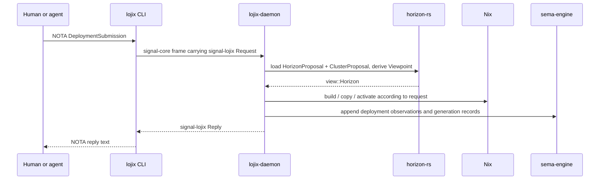

# 113 - Lojix Daemon Boundary And Open Context

Date: 2026-05-17  
Role: designer-assistant

## Purpose

This report corrects a bad implication in my previous graph: the
`lojix` CLI is not part of the deployment pipeline. It is a text
adapter for `lojix-daemon`.

The implementation already mostly follows the user's intent. The
problem was my diagram and some architecture prose that did not make the
boundary loud enough.

## Canonical CLI/Daemon Rule

All workspace CLIs in this family are thin wrappers around daemons.

For `lojix`:

```text
human/agent writes NOTA request
  -> lojix CLI decodes NOTA into signal-lojix::Request
  -> lojix CLI sends signal-core frame to lojix-daemon socket
  -> lojix-daemon performs all work
  -> lojix-daemon sends signal-lojix::Reply
  -> lojix CLI renders reply as NOTA text
```

The CLI does not:

- read `horizon.nota`;
- read `datom.nota`;
- call `ClusterProposal::project`;
- invoke Nix;
- stage override flakes;
- create or update GC roots;
- write `sema-engine` records;
- maintain deployment state.

Those actions belong to daemon actors.

The CLI exists because humans and current agents need a text surface
until they can speak binary Signal directly.

## What The Current Code Does

This part is healthy.

`/home/li/wt/github.com/LiGoldragon/lojix/horizon-leaner-shape/src/bin/lojix.rs`
does exactly the thin-client shape:

- reads `LojixCliConfiguration` from argv position 0 through
  `nota_config::ConfigurationSource`;
- reads one request from argv position 1+ or stdin;
- creates `lojix::Client`;
- calls `send_text_with_rendering`;
- prints the reply.

`src/client.rs`:

- decodes request text into `signal-lojix::Request`;
- opens the configured Unix socket;
- writes one `signal-core` frame;
- reads the reply frame;
- renders the reply payload back to NOTA.

The only code I found that imports `horizon_lib::{ClusterProposal,
HorizonProposal, Viewpoint}` is daemon-side deployment code in
`src/deploy.rs`. That is the right place.

## Correct Pipeline



## Architecture Edits Made

I edited:

- `/home/li/wt/github.com/LiGoldragon/horizon-rs/horizon-leaner-shape/ARCHITECTURE.md`
- `/home/li/wt/github.com/LiGoldragon/lojix/horizon-leaner-shape/ARCHITECTURE.md`
- `/home/li/wt/github.com/LiGoldragon/signal-lojix/horizon-leaner-shape/ARCHITECTURE.md`
- `/home/li/wt/github.com/LiGoldragon/CriomOS/horizon-leaner-shape/ARCHITECTURE.md`

The edits add or sharpen:

- `horizon-rs` projection has three inputs: `HorizonProposal`,
  `ClusterProposal`, and request-time `Viewpoint`.
- `lojix` CLI is a text-to-Signal adapter only.
- `lojix-daemon` owns projection, Nix invocation, GC-root updates, and
  `sema-engine` writes.
- `signal-lojix` data-plane requests carry deploy/query data; CLI
  configuration carries only socket and rendering configuration.
- CriomOS now names the new deploy path as `lojix-daemon` plus thin
  `lojix`, not legacy `lojix-cli`.

## Pan-Horizon Configuration Belongs To The Daemon

`lojix-daemon` needs the pan-horizon configuration source because the
daemon creates the projected Horizon view. The CLI must not carry this
path in its startup configuration.

The intended flow is:

```text
lojix CLI startup config:
  daemon socket + rendering mode

DeploymentSubmission payload:
  cluster + node + cluster proposal source + flake/plan/builder facts

lojix-daemon startup config:
  daemon socket + state directories + pan-horizon configuration source
```

This is what lets another operator host a separate CriomOS meta-cluster:
they run a daemon configured with a different `HorizonProposal` file
containing their domain suffixes and horizon-level facts. The deploy
request still names the specific cluster and node being materialized.

## User Decisions Captured

### Node shape

User answered yes: replace overloaded species like `LargeAiRouter` with
one primary species plus additive roles/capabilities.

Direction:

```nota
(Node prometheus
  species Edge
  roles [Router LargeAi NixBuilder])
```

Remaining design work: exact closed `NodeSpecies`, `NodeRole`, and
`NodeOverride` enums, and how current `behavesAs` fields derive from
them.

### Service domains

User decision: let CriomOS compose simple service labels. Horizon should
not become a general string-concat library for `git`, `vault`, `mail`,
etc.

Remaining nuance: `tailnet.baseDomain` may be a special case because
Headscale and DNS both consume it as a projected cluster-level fact. If
that still feels too inflated, the next pass should move even that
composition into CriomOS modules.

## Open Concept 1 - `HorizonProposal.operator`

Plain context:

`HorizonProposal` currently starts with:

```nota
(HorizonProposal LiGoldragon ...)
```

That `LiGoldragon` value is the operator/horizon identity. It could be
useful later for:

- deployment logs saying which horizon produced a view;
- cross-horizon/federated operations;
- future Criome/BLS signatures, where the horizon identity signs or
  validates deployment objects.

But today I did not see a concrete consumer that requires it. If no
consumer needs it, it may be decoration.

This is not "QMOSBS" or any new required subsystem. The intended future
reference is the Criome/BLS trust layer: the eventual place where
horizon identity and signing keys may become real.

Question needing user intent:

Should `LiGoldragon` stay in `HorizonProposal` now as a real
horizon-identity fact, or should it be removed until a concrete Criome
or deployment-log consumer uses it?

My current lean: keep it only if `lojix-daemon` records it in durable
deployment state soon. Otherwise remove it for now.

## Open Concept 2 - `HorizonProposal.trusted_keys`

Plain context:

`HorizonProposal` currently has an empty final vector:

```nota
[]
```

In code this is `trusted_keys: Vec<HorizonTrustedKey>`.

This gestures at future operator-wide trust roots: keys trusted across
all clusters in this horizon. That may eventually tie into Criome/BLS
authentication and signed deployment artifacts.

But current trust still appears cluster-local: node keys, secret
bindings, Nix build keys, and per-cluster trust records.

Question needing user intent:

Should horizon-wide trusted keys exist in the v1 pan-horizon config, or
should they wait until the Criome/BLS trust design is concrete?

My current lean: remove the field until a real consumer exists, unless
designer wants it as an explicit placeholder for the upcoming trust arc.

## Open Concept 3 - `owned_cluster` In `LojixDaemonConfiguration`

Plain context:

`LojixDaemonConfiguration` says:

```rust
pub owned_cluster: ClusterName
```

But each deploy request also says:

```rust
DeploymentSubmission {
    cluster,
    node,
    proposal_source,
    ...
}
```

That creates a question: if the daemon is configured as owning cluster
`goldragon`, what happens when someone sends a deployment request for
cluster `somebody_else`?

When I previously said "operator-wide", the plain meaning was "one
daemon owned by the horizon owner that can deploy several clusters."
That is different from "one daemon owned by a single cluster." The term
"operator" is overloaded enough that architecture should probably prefer
`horizon_owner` when it means the owner of a pan-horizon config.

Possible designs:

| Design | Meaning |
|---|---|
| One daemon per cluster | `owned_cluster` is authoritative. Every request's `cluster` must match it. Cross-cluster deploys require a different daemon or a future route. |
| One daemon per operator/horizon | `owned_cluster` is the wrong name. The daemon can deploy several clusters under one pan-horizon config. It should probably have `horizon_identity` or `default_cluster`, not `owned_cluster`. |
| Federation/router later | v1 may enforce one cluster; later daemon-to-daemon routing can be added explicitly. |

Question needing user intent:

Is `lojix-daemon` meant to be one daemon for one cluster, or one daemon
for an operator/horizon that may deploy multiple clusters?

My current lean: for v1, enforce one daemon per cluster. That makes
`owned_cluster` meaningful and lets the daemon reject mismatched
requests with a typed error. If you want users to host multiple
meta-clusters from one daemon, rename the field before implementation
builds more assumptions around it.

## Open Concept 4 - AI Model Store Paths And System Closure

Plain context:

You said model files can live in the Nix store because reproducibility
matters. I agree. My question was not "store or not store." It was
about *which derivation closure forces the model files to realize*.

Current shape in CriomOS:

- A large-AI node has a systemd service for llama.cpp.
- That service's `ExecStart` references `modelsDir`.
- `modelsDir` is built from fixed-output model fetch derivations.
- Because the service references `modelsDir`, the NixOS system
  toplevel can pull the GGUF model derivations into its closure.

That means a normal system build for a large-AI node may need to realize
huge model files.

There are two possible approaches:

### A - Models are part of the large-AI system closure

If node has role `LargeAi`, its NixOS system includes all required model
store paths.

Benefits:

- maximal reproducibility;
- activation cannot start the service without the models available;
- simple mental model.

Costs:

- building/evaluating/switching the host can drag huge GGUF files;
- wrong builder placement moves huge model files through the LAN;
- all model changes become system-closure changes.

### B - Models are reproducible store artifacts but materialized by a separate unit

The system closure contains a manifest or small derivation describing
which model store paths are needed. A separate `model-materialization`
unit or `lojix` phase realizes/copies those model store paths on the
large-AI/cache host before starting/restarting the service.

Benefits:

- still reproducible Nix store artifacts;
- avoids ordinary OS builds pulling every model artifact by accident;
- `lojix` can choose the right builder/cache host for heavy model
  realization.

Costs:

- more moving parts;
- activation must know whether model materialization succeeded;
- the llama service must order after model materialization.

Current user direction:

For v1, if a node has the `LargeAi` role, the model files may remain in
that node's system closure. Reproducibility matters more than avoiding
the closure. The risk is not "Nix store vs not Nix store"; the risk is
realizing or copying huge GGUF files on the wrong machine.

The follow-up design problem is build placement and fetching:

- use a canonical fetch/materialization path, likely involving Hugging
  Face's download tooling where that is the most reliable source;
- make sure large models are built or copied on the large-AI/cache host,
  not pulled repeatedly through a workstation or over Wi-Fi;
- revisit a separate materialization unit only if normal system builds
  start moving model payloads through the wrong path.

## Remaining Follow-Up Work

Already done in this pass:

- `horizon-rs/ARCHITECTURE.md` now shows the three projection inputs.
- `lojix`, `signal-lojix`, and CriomOS architecture files now state the
  daemon-first CLI boundary.

Still open:

1. Design the `NodeSpecies` + `NodeRole` + `NodeOverride` schema.
2. Decide whether `HorizonProposal.operator` and
   `HorizonProposal.trusted_keys` stay in v1.
3. Decide whether `lojix-daemon` is one-cluster or horizon-owner
   scoped.
4. Confirm the large-AI v1 rule as system-closure-first, with a later
   cache/materialization report if model payload movement becomes a
   problem.

## Bottom Line

The CLI/daemon boundary is now explicit: `lojix` CLI is not an
implementation surface. It is the textual adapter to the daemon. The
daemon owns every effect. The implementation already mostly obeys this;
the architecture now says it, and the earlier graph has been corrected.
