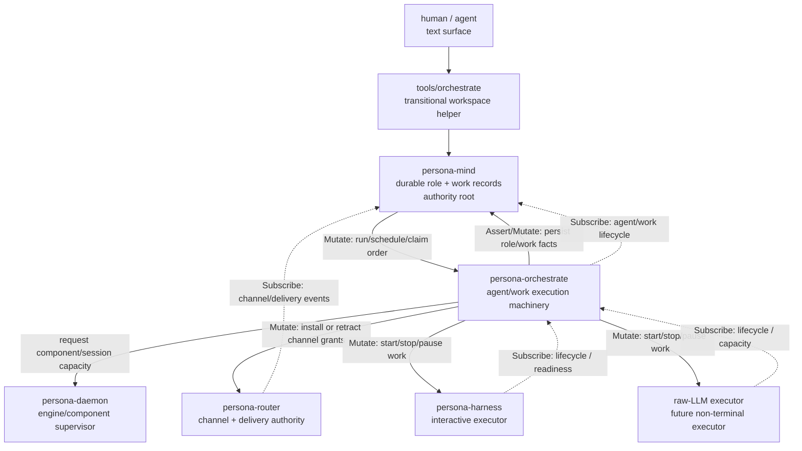
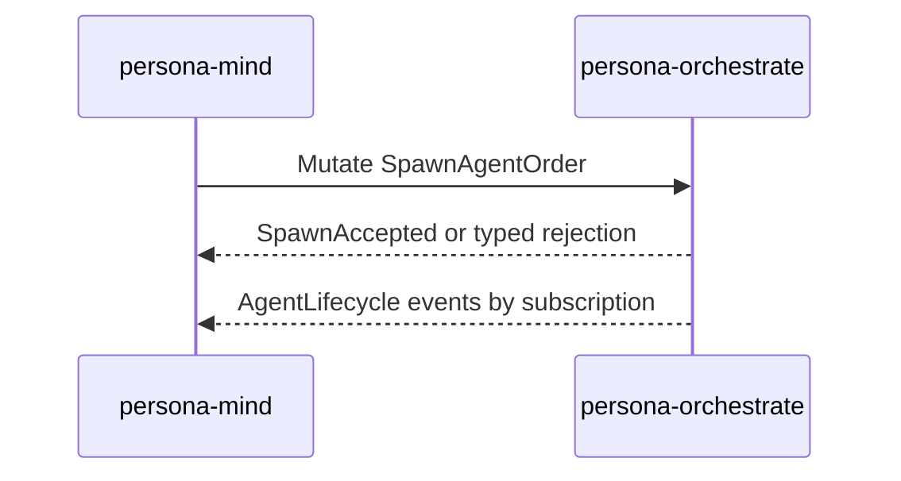
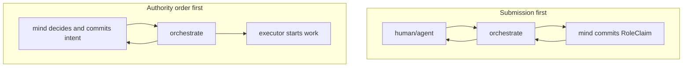
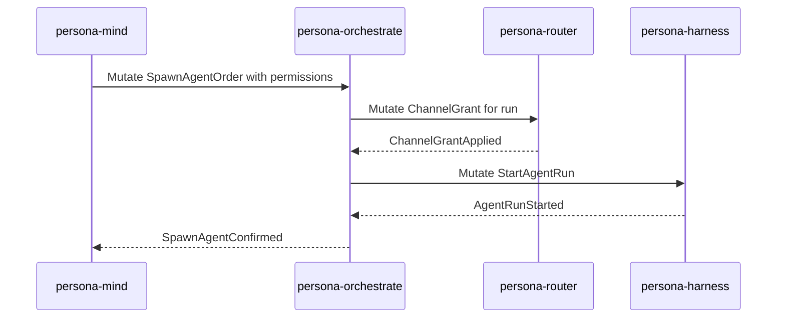
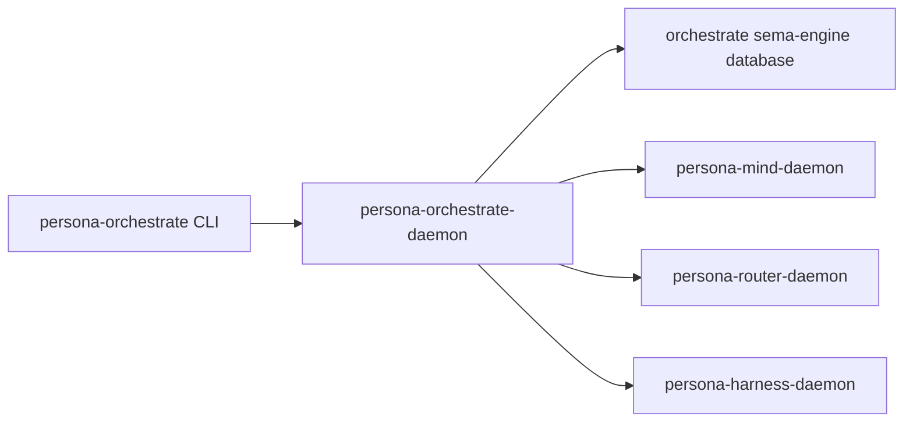

# 115 - Orchestrate integration architecture

Date: 2026-05-17
Role: designer-assistant
Status: architectural research and critique. No architecture files edited.

## 0. TLDR

`reports/second-designer-assistant/5-orchestrate-arc-state-and-intent-2026-05-17.md`
is directionally right: the workspace needs to distinguish
orchestration **records** from orchestration **machinery**. The
records already live in `signal-persona-mind` and `persona-mind`:
role claims, releases, handoffs, observations, activity submissions,
and early channel-adjudication records. The machinery does not yet
exist as a Persona component: spawning agents, supervising agent runs,
tracking executor capacity, resolving contested scope acquisition,
scheduling ready work, and escalating blocked work.

The important integration constraint is that there are now three
different things that can be accidentally conflated:

| Name | What it is today | Architectural role |
|---|---|---|
| `tools/orchestrate` / `orchestrate/AGENTS.md` | Shell helper and workspace coordination protocol using lock files. | Transitional human/agent coordination surface. It should stay thin and mind-direct during the Rust port. |
| `orchestrator` repo | Criopolis/Gas City cascade dispatcher. | Older, unrelated daemon. It is useful prior art but not the Persona component. |
| `persona-orchestrate` | Proposed Persona component. | Runtime orchestration machinery for agents/work/executors, speaking a new `signal-persona-orchestrate` contract. |

The clean model is:

User decision after this report's first draft: `persona-orchestrate`
is a full triad daemon. It has its own daemon, CLI, contract surface,
and sema-engine database. Co-resident deployment inside
`persona-mind` is not the target shape. The companion follow-up report
`reports/designer-assistant/116-permission-scoped-signal-contracts-and-sockets-2026-05-17.md`
develops the user's next insight: permission may be represented by
distinct Signal contract repos and distinct sockets, with
`persona-daemon` establishing socket permissions and the one-owner
chain.

## 1. Sources read

This report is based on:

- `reports/second-designer-assistant/5-orchestrate-arc-state-and-intent-2026-05-17.md`
  - landed state and forward intent for the `orchestrate/` directory,
    Rust-port spec, and proposed `persona-orchestrate` role.
- `orchestrate/AGENTS.md`
  - current shell-helper protocol and the stated target of a Rust
    `mind` CLI backed by `persona-mind`.
- `orchestrate/roles.list`
  - the current lane registry.
- `reports/designer/210-component-triad-decisions-and-mutate-authority-2026-05-17.md`
  - component-triad decision and `Mutate` authority semantics.
- `skills/component-triad.md`
  - daemon + CLI + signal contract shape; CLI has exactly one peer.
- `skills/contract-repo.md`
  - one contract repo per component wire surface, per-relation root
    families, authority and verb discipline.
- `/git/github.com/LiGoldragon/signal-core/ARCHITECTURE.md`
  - six verb roots and authority-direction framing.
- `/git/github.com/LiGoldragon/persona-mind/ARCHITECTURE.md`
  - mind as authority root and the new orchestrate slot in the
    authority chain.
- `/git/github.com/LiGoldragon/persona-router/ARCHITECTURE.md`
  - channel grants as inbound `Mutate` orders, obey-then-confirm.
- `/git/github.com/LiGoldragon/signal-persona-mind/src/lib.rs`
  - existing role, activity, adjudication, and channel records.
- `/git/github.com/LiGoldragon/signal-persona-harness/src/lib.rs`
  - current harness contract, which does not yet include a spawn or
    agent-run management relation.
- `/git/github.com/LiGoldragon/orchestrator/ARCHITECTURE.md`
  - older Criopolis cascade dispatcher, relevant mainly as a naming
    collision and prior-art warning.

## 2. Current state

### 2.1 Workspace helper state

The current `orchestrate/` directory is a workspace coordination
surface, not a Persona runtime component.

It owns:

- lane registry: `orchestrate/roles.list`;
- lane locks: `orchestrate/<lane>.lock`;
- protocol documentation: `orchestrate/AGENTS.md`;
- helper invocation: `tools/orchestrate claim|release|status`.

The target named in `orchestrate/AGENTS.md` is a Rust `mind` CLI,
backed by `persona-mind` and `signal-persona-mind`. In that target,
lock files disappear as an ownership mechanism. They do not become a
parallel state model in `persona-mind`.

This matters because the Rust port of `tools/orchestrate` should not
turn into the new runtime orchestrator. It should be a thin client
that reuses `signal-persona-mind` records and preserves existing helper
behavior until the real Persona orchestration component exists.

### 2.2 Existing mind records

`signal-persona-mind` already has an orchestration-record vocabulary:

| Record family | Current role |
|---|---|
| `RoleClaim` | A lane claims one or more scopes. |
| `RoleRelease` | A lane releases scope. |
| `RoleHandoff` | A lane transfers scope. |
| `RoleObservation` | Query current role/lane state. |
| `ActivitySubmission` | Append an activity fact. |
| `AdjudicationRequest` | Ask mind to adjudicate a channel/message situation. |
| `ChannelGrant` / `ChannelExtend` / `ChannelRetract` | Current channel-authority records. |
| `ChannelList` | Query channel state. |

The `signal_channel!` declaration currently maps the role records this
way:

| Variant | Current verb | Architectural reading |
|---|---|---|
| `RoleClaim` | `Assert` | Reasonable if a human/agent is asserting a claim request into mind. |
| `RoleRelease` | `Retract` | Reasonable as a retraction. |
| `RoleHandoff` | `Mutate` | Reasonable as an authority transition of an existing claim. |
| `RoleObservation` | `Match` | Correct. |
| `ActivitySubmission` | `Assert` | Correct as an appended fact. |

The channel records show a drift against the newly landed
authority-direction architecture:

| Variant | Current verb in code | Recent architecture says |
|---|---|---|
| `ChannelGrant` | `Assert` | `Mutate`, because installing a channel is an authority order to router. |
| `ChannelExtend` | `Mutate` | Fits the new framing. |
| `ChannelRetract` | `Retract` | Fits the new framing. |

This is not a criticism of the older code. It predates the settled
`Mutate` authority semantics. It is a concrete follow-up for the
contract audit that designer/210 already called for.

### 2.3 Existing harness contract

`signal-persona-harness` has a delivery and transcript surface:

| Request | Verb | Meaning |
|---|---|---|
| `MessageDelivery` | `Assert` | Router submits a message to a harness delivery path. |
| `InteractionPrompt` | `Assert` | Surface a prompt for human resolution. |
| `DeliveryCancellation` | `Retract` | Cancel a pending delivery. |
| `HarnessStatusQuery` | `Match` | Query harness readiness. |
| `SubscribeHarnessTranscript` | `Subscribe` | Stream transcript observations. |
| `HarnessTranscriptRetraction` | `Retract` | Close transcript subscription. |

It does **not** currently expose a relation for:

- spawning an agent session;
- selecting an executor kind;
- assigning a work item;
- pausing, resuming, cancelling, or draining an agent run;
- reporting executor capacity as a first-class stream.

Therefore `persona-orchestrate` cannot simply "issue Mutate to
persona-harness" today. The contract surface for that relation still
needs design. The current harness daemon is closer to "delivery to an
already configured harness" than "agent executor manager."

### 2.4 Existing `orchestrator` repo

The `/git/github.com/LiGoldragon/orchestrator` repository is a
Criopolis cascade dispatcher. It watches Gas City events, reads bead
metadata, dispatches the next cascade bead with `gc sling`, stores a
redb event cursor, and records dispatches as rkyv archives.

It is not `persona-orchestrate`.

It does provide useful warnings:

- "orchestrator" is already a real repo name in the workspace;
- cascade scheduling has prior state/dispatch concepts that may be
  worth mining later;
- the new Persona component should be named `persona-orchestrate`, not
  generically `orchestrator`, to avoid namespace confusion.

## 3. The architectural split

The split should be stated as four layers:

| Layer | Owner | What it owns | What it must not own |
|---|---|---|---|
| Workspace helper | `tools/orchestrate` / `orchestrate/AGENTS.md` | Transitional local lock files and ergonomic commands. | Runtime spawning/scheduling policy; Persona component state. |
| Mind | `persona-mind` + `signal-persona-mind` | Durable role records, work graph, decisions, facts, policy authority. | Agent process supervision and executor mechanics. |
| Orchestrate | `persona-orchestrate` + `signal-persona-orchestrate` + sema-engine state | Agent/work execution machinery: scheduling, spawn plans, scope acquisition workflow, lifecycle, backpressure, escalation. | Durable mind truth; engine-component supervision; terminal byte paths. |
| Engine manager | `persona-daemon` + `signal-persona` | Engine/component process lifecycle: start first-stack daemons, readiness, component status. | Work scheduling and role conflict policy. |

That split keeps each noun exact.

The `mind` answers: what is true, what is allowed, what work exists,
what claims and decisions are durable?

The `orchestrate` component answers: given those truths and orders,
which agent/executor should run, how is it started, what state is the
run in, what capacity remains, what is blocked?

The `persona-daemon` answers: which engine components are alive and
ready?

## 4. Contract relationships `persona-orchestrate` should have

### 4.1 Mind -> Orchestrate: authority orders

This is the relation designer/210 was reaching for:

Candidate request families:

| Request family | Likely verb | Why |
|---|---|---|
| `SpawnAgentOrder` | `Mutate` | Mind orders orchestrate to create or allocate an agent run. |
| `StopAgentOrder` | `Mutate` or `Retract` | If stopping mutates run state, `Mutate`; if it retracts a running allocation, `Retract`. Needs exact semantics. |
| `PauseAgentOrder` / `ResumeAgentOrder` | `Mutate` | Change stable agent-run state. |
| `SetExecutorPolicy` | `Mutate` | Change orchestrate's scheduling/capacity policy. |
| `AcquireScopeOrder` | `Mutate` only if issued by mind as authority | Orchestrate is being told to acquire a scope for a run. |
| `ReleaseScopeOrder` | `Retract` | Retract an active scope reservation. |
| `AgentLifecycleSubscription` | `Subscribe` | Mind observes agent-run state. |
| `OrchestrateSnapshotQuery` | `Match` | One-shot state view. |
| `SpawnPlanValidation` | `Validate` | Dry-run a spawn plan before committing. |

Important nuance: the word "acquire" can describe either an authority
order or a user request. A human/agent asking for scope is not
necessarily a top-down authority issuing `Mutate`. If the request is
"I would like to claim this scope; please adjudicate," then the
cleaner verb is `Assert` on a `ScopeAcquisitionSubmission`. If mind
has already decided "this run is authorized; install the scope," then
`Mutate AcquireScopeOrder` is correct.

That distinction is the biggest contract-shape risk in the current
proposal.

### 4.2 Orchestrate -> Mind: durable truth and policy

`persona-orchestrate` should not duplicate mind's role/work records.
It should either:

1. call `persona-mind` to persist existing `RoleClaim`,
   `RoleRelease`, `RoleHandoff`, `ActivitySubmission`, and work-graph
   records; or
2. receive orders from mind after mind has already committed the
   relevant durable fact.

These two flows are different:

Both may exist, but the contract should not pretend they are the same.

Question to resolve: does `persona-orchestrate` decide contested
role/scope acquisitions, or does it ask mind to decide and only execute
the result?

My recommendation: mind owns policy truth and durable conflict result;
orchestrate owns the workflow and execution state. In practical terms:

- external submissions enter as `Assert ScopeAcquisitionSubmission`;
- orchestrate checks local live state and asks mind to commit or reject;
- mind's reply is the durable authority result;
- orchestrate emits lifecycle/activity events and updates its own
  execution state.

### 4.3 Orchestrate -> Persona-daemon: component/session capacity

`persona-daemon` already owns engine/component supervision. A new
orchestrate component must not steal that role.

The clean boundary:

| Need | Owner |
|---|---|
| Start the six first-stack daemons. | `persona-daemon`. |
| Observe component readiness. | `persona-daemon` via supervision relation. |
| Start or allocate an agent run inside an already running executor component. | `persona-orchestrate`. |
| If an executor component is missing, request the engine manager to start it. | `persona-orchestrate` asks `persona-daemon` through a typed relation. |

If `persona-orchestrate` directly spawns OS processes for harnesses,
it overlaps with `persona-daemon`. If `persona-daemon` starts every
agent session, then orchestrate becomes only a scheduler and loses the
"machinery" it was supposed to own. The likely answer is a two-level
split:

- `persona-daemon` supervises component daemons;
- component daemons manage their own instances/sessions;
- `persona-orchestrate` orders those component daemons to create agent
  runs.

That means `persona-harness` likely needs a new executor-management
relation, not just delivery.

### 4.4 Orchestrate -> Router: channel grants

Recent architecture says channel grants are inbound `Mutate` orders to
router. The open question is who issues them:

- mind directly, as authority root; or
- orchestrate as the sequencer of a spawn pipeline, with authority
  delegated by mind's `SpawnAgentOrder`.

The current designer/210 diagram puts mind issuing channel grants
directly to router. That is safe but can make orchestrate a partial
sequencer: mind has to coordinate both spawn state and channel state.

The more operationally coherent pipeline is:

This keeps the multi-step spawn transaction in one component. Mind
still owns the policy decision and durable record, but orchestrate owns
the sequencing.

Question to resolve: should orchestrate be allowed to issue router
channel grants after mind delegates a spawn order, or must mind issue
every channel grant itself?

My recommendation: allow orchestrate to issue router grants only when
the grant is explicitly carried in the mind-authored `SpawnAgentOrder`
or referenced by a mind-authored policy record. That preserves mind as
authority root while letting orchestrate sequence the runtime work.

### 4.5 Orchestrate -> Harness and raw-LLM executor

`persona-harness` is currently a delivery target. The proposed
orchestrate role needs an executor relation.

The executor relation should probably not be hidden in
`MessageDelivery`. It is a different relationship:

| Delivery relation | Executor relation |
|---|---|
| Router sends content to an already selected harness. | Orchestrate starts/stops/supervises a unit of work. |
| Payload is message/prompt content. | Payload is run identity, work item, permissions, model/provider choice, terminal/session requirements. |
| Replies are delivery success/failure. | Replies are run accepted/rejected, started, completed, failed, blocked, capacity changed. |

This can be implemented in one of two ways:

| Option | Shape | Tradeoff |
|---|---|---|
| A | Add an executor-management relation to `signal-persona-harness`. | Fewer repos. Clear if harness is the executor component. |
| B | Create a generic `signal-persona-executor` relation implemented by harness and raw-LLM executor. | Cleaner multi-executor abstraction, but may be premature if only harness exists today. |

My recommendation for prototype: add a named executor-management
relation to each executor component contract, starting with
`signal-persona-harness`. Do not create a generic executor contract
until the raw-LLM executor has enough concrete shape to prove the
common vocabulary.

### 4.6 Orchestrate -> Terminal

For v1, orchestrate should not talk directly to `persona-terminal` or
`terminal-cell` except possibly through observations exposed by harness
or through a typed terminal-capacity relation if one becomes necessary.

The terminal domain owns prompt cleanliness, input gate, transcript
storage, and attach/viewer state. Orchestrate cares about whether an
agent run can proceed, not about raw PTY bytes. Direct terminal control
from orchestrate risks turning it into another multiplexer.

Recommendation: orchestrate interacts with terminal state through
harness/executor lifecycle and typed observations, not by opening
terminal data sockets.

## 5. What `signal-persona-orchestrate` should contain

This is an inferred first contract shape, not a final spec.

### 5.1 Identity newtypes

The contract will need closed, typed identity records:

| Type | Meaning |
|---|---|
| `OrchestrationIdentifier` | Stable id for an orchestration decision or workflow. |
| `AgentRunIdentifier` | One concrete spawned/allocated agent run. |
| `ExecutorIdentifier` | One executor daemon/session endpoint. |
| `WorkIdentifier` | Pointer to a mind-owned work item. |
| `ScopeIdentifier` | A claimable scope; may wrap path scope, task scope, or future typed scope. |
| `LaneName` or imported equivalent | Workspace lane, if lane remains part of agent identity. |
| `SpawnPlanIdentifier` | Optional stable id for a validated plan before commit. |

Avoid duplicating role records already owned by `signal-persona-mind`.
If `LaneName` already has a canonical mind-side type, import or move it
to the correct shared contract rather than shadowing it.

### 5.2 Request families

| Request | Verb | Origin | Notes |
|---|---|---|---|
| `SpawnAgentOrder` | `Mutate` | mind -> orchestrate | Authority order. Carries executor choice, work pointer, permission bundle, resource preferences. |
| `StopAgentOrder` | `Mutate` or `Retract` | mind -> orchestrate | Needs exact semantics. If stopping is state transition, use `Mutate`; if removing an active run allocation, use `Retract`. |
| `ScopeAcquisitionSubmission` | `Assert` | CLI/agent -> orchestrate | A desire/fact: "I request this scope." Orchestrate/mind adjudicate. |
| `AcquireScopeOrder` | `Mutate` | mind -> orchestrate | Authority says to acquire/install the scope. Distinct from submission. |
| `ScopeReleaseSubmission` | `Retract` | CLI/agent -> orchestrate | Human/agent releases a scope it holds. |
| `ReleaseScopeOrder` | `Retract` | mind -> orchestrate | Authority retracts a scope. |
| `SetSupervisionPolicy` | `Mutate` | mind -> orchestrate | Register restart/drain/escalation policy. |
| `BlockedWorkReport` | `Assert` | agent/executor -> orchestrate | Fact from below: this work is blocked. |
| `EscalationOrder` | `Mutate` | mind -> orchestrate | Authority order to surface/escalate something. |
| `OrchestrateSnapshotQuery` | `Match` | any authorized client | Current state. |
| `SpawnPlanValidation` | `Validate` | mind/CLI during development | Dry-run the plan and return why it would or would not run. |
| `AgentLifecycleSubscription` | `Subscribe` | mind/observer -> orchestrate | Push agent-run lifecycle. |
| `ExecutorCapacitySubscription` | `Subscribe` | mind/observer -> orchestrate | Push executor capacity changes. |
| `ScopeEventSubscription` | `Subscribe` | mind/observer -> orchestrate | Push contested/acquired/released scope events. |

The split between `Submission` and `Order` is deliberate. It protects
the newly settled `Mutate` semantics. A request from a subordinate or
peer is not automatically a `Mutate` just because it asks for a change.
`Mutate` is for an authority order.

### 5.3 Replies and events

Replies should distinguish synchronous acceptance from asynchronous
completion:

| Reply | Meaning |
|---|---|
| `SpawnOrderAccepted` | Orchestrate accepted the order and recorded the workflow. |
| `SpawnOrderRejected` | Typed failure before workflow begins: no executor, invalid permission bundle, conflict. |
| `AgentRunStarted` | Runtime start happened. May be an event rather than direct reply if start is asynchronous. |
| `AgentRunCompleted` | The run completed. Event stream. |
| `AgentRunFailed` | Typed failure after acceptance. Event stream. |
| `ScopeAcquired` | Scope acquisition committed. |
| `ScopeRejected` | Typed conflict or policy rejection. |
| `ScopeReleased` | Scope release committed. |
| `SupervisionPolicyAccepted` | Policy installed. |
| `OrchestrateSnapshot` | Current state reply. |
| `OrchestrateUnimplemented` | Prototype skeleton honesty. |

The contract must be explicit about whether `SpawnAgentOrder` is
single-flight synchronous "return only when running" or async
"accepted now, lifecycle events later." Given the workspace's broader
async-first Signal direction, the cleaner shape is:

1. request/reply confirms command acceptance and durable orchestration
   state;
2. subscription events report lifecycle progression.

### 5.4 Event streams

Minimum streams:

| Stream | Events |
|---|---|
| `AgentLifecycleStream` | `AgentRunRequested`, `AgentRunPlanned`, `AgentRunStarting`, `AgentRunRunning`, `AgentRunWaitingOnUser`, `AgentRunBlocked`, `AgentRunCompleted`, `AgentRunFailed`, `AgentRunStopping`, `AgentRunStopped`, `AgentRunCancelled`. |
| `ScopeEventStream` | `ScopeRequested`, `ScopeAcquired`, `ScopeContested`, `ScopeReleased`, `ScopeExpired`, `ScopeDenied`. |
| `ExecutorCapacityStream` | `ExecutorAvailable`, `ExecutorSaturated`, `ExecutorDegraded`, `ExecutorUnavailable`, `ExecutorRecovered`. |
| `EscalationStream` | `BlockedWorkEscalated`, `UserDecisionNeeded`, `AgentQuestionRaised`. |

Per push-not-pull discipline, any component that needs to react to
these conditions subscribes. It does not poll orchestrate.

## 6. What state `persona-orchestrate` owns

`persona-orchestrate` is a real stateful component and therefore owns
its state through sema-engine. The state is not the mind graph; it is
execution machinery state.

| State | Owner | Reason |
|---|---|---|
| Role claims/releases/handoffs | `persona-mind` | Durable coordination truth. |
| Work graph, dependencies, decisions | `persona-mind` | Central mind state. |
| Spawn plans and pending confirmations | `persona-orchestrate` | Runtime workflow state. |
| Agent run lifecycle | `persona-orchestrate` | Execution machinery. |
| Executor capacity snapshots | `persona-orchestrate` | Scheduling input, derived from subscriptions. |
| Scope acquisition attempts | `persona-orchestrate`, with committed result in mind | Workflow state around durable role records. |
| Escalation state | likely `persona-orchestrate`, with durable escalation fact in mind | Orchestrate handles delivery and follow-up. |
| Engine component readiness | `persona-daemon` | Component lifecycle, not work lifecycle. |

This gives a clean introspection story:

- ask mind: "what is true about roles/work?"
- ask orchestrate: "what is running or pending?"
- ask persona-daemon: "which components are alive?"

## 7. Deployment decision: full triad daemon

User decision after this report's first draft: every runtime component
is a triad daemon. `persona-orchestrate` is therefore a daemon with its
own actor root, CLI, contract surface, socket set, and sema-engine
database. The previous co-resident-actor option is superseded.

Consequences:

- `persona-orchestrate` owns execution machinery state through
  sema-engine.
- `persona-mind` remains the durable role/work/policy authority.
- `persona-daemon` spawns and supervises the component daemon and
  establishes its socket permissions.
- any future "owner" or restricted surface is another contract/socket
  surface of the daemon, not an in-process shortcut.

## 8. Current contract drift to fix or consciously defer

### 8.1 `ChannelGrant` verb mismatch

`signal-persona-mind` currently declares `Assert ChannelGrant`.
The new architecture says a channel grant is an authority order that
router obeys and confirms. That makes it a `Mutate`.

Possible resolutions:

| Resolution | Meaning |
|---|---|
| Change `ChannelGrant` to `Mutate` in `signal-persona-mind`. | Directly aligns code with new authority semantics. |
| Split into `ChannelGrantDecision` in mind and `RouterChannelGrantOrder` in router. | Keeps mind record as a fact and router order as a `Mutate`. Cleaner if mind's stored decision is not the same thing as the order. |
| Leave as `Assert` for now with a status note. | Avoids churn but preserves known drift. |

I prefer the split if the same record currently tries to be both "mind
decided this grant exists" and "router, install this grant." Those are
different relations.

### 8.2 `AcquireScope` as `Mutate`

Report 5 calls `AcquireScope` a `Mutate`. That is correct only when an
authority is ordering orchestrate to install scope. It is not correct
for a peer or human submitting a claim request for adjudication.

Suggested contract split:

- `Assert ScopeAcquisitionSubmission`: a caller asks for a scope;
- `Mutate AcquireScopeOrder`: mind orders orchestrate to install the
  accepted scope;
- `Retract ScopeReleaseSubmission` or `ReleaseScopeOrder`: release,
  depending on whether the actor is the holder or the authority.

### 8.3 `SpawnAgent` needs executor relation support

`signal-persona-harness` has no spawn/start-run relation. It has
delivery/status/transcript. A `SpawnAgent` order from orchestrate
needs somewhere to land.

This implies a new relation either in:

- `signal-persona-harness`, if harness owns agent-run lifecycle; or
- a new executor contract once raw-LLM and harness have enough shared
  shape to justify it.

### 8.4 Scope identity is underspecified

Today lock scopes are path locks or bracketed task tokens. Future
orchestration will need typed scope kinds:

| Scope kind | Example |
|---|---|
| Path scope | `/git/github.com/LiGoldragon/persona-router` |
| Task scope | `[primary-68cb]` |
| Report-lane scope | reports are lane-owned and usually exempt from lock flow. |
| Component scope | "persona-router architecture" or "signal-persona-router contract". |
| Work-graph scope | native mind work item once BEADS retires. |

The first contract should not preserve raw lock-file strings as the
only identity model. It can support them as one closed variant, but
the root should be a typed `Scope` enum.

### 8.5 "Conflict resolution policy" needs a precise owner

Report 5 says orchestrate owns conflict resolution policy, while mind
owns records. That can mean two different things:

1. orchestrate computes conflicts and mind merely persists the result;
2. mind decides policy and orchestrate runs the workflow.

Given mind is the authority root, option 2 is cleaner. Orchestrate can
maintain live execution conflict facts, but durable role acceptance
should be mind-owned unless the user explicitly wants policy delegated.

### 8.6 Permission-scoped contract surfaces are now a first-class design surface

User follow-up after this report's first draft: permission may be
represented as different Signal contract repos and sockets. Example:
`signal-persona-orchestrate` for the ordinary surface and an additional
OwnerSignal contract rendered as `owner-signal-persona-orchestrate` for
owner-only capabilities. The dedicated analysis is in
`reports/designer-assistant/116-permission-scoped-signal-contracts-and-sockets-2026-05-17.md`.

This interacts directly with `persona-orchestrate`: if
`persona-mind` owns `persona-orchestrate`, the privileged owner surface
for `persona-orchestrate` should be reachable only through the
permission mechanism `persona-daemon` establishes at spawn time. The
ordinary surface should not be able to express owner-only orders.

### 8.7 CLI naming is overloaded

There is:

- `tools/orchestrate` today;
- possible future `orchestrate` CLI;
- existing `orchestrator` repo;
- proposed `persona-orchestrate` daemon.

The architecture should reserve names now:

| Name | Suggested meaning |
|---|---|
| `tools/orchestrate` | Transitional workspace helper. |
| `persona-orchestrate` | Runtime component repo and daemon/library name. |
| `persona-orchestrate-daemon` | Long-running daemon binary if separate process. |
| `orchestrate` CLI | Possible thin CLI, but risky because it collides with helper expectations. |

My recommendation: keep `tools/orchestrate` as the transitional helper
name; call the runtime CLI `persona-orchestrate` or `orchestrate` only
after the helper retires. Do not reuse `orchestrator`.

## 9. Suggested staged design path

### Stage 1: Keep the helper Rust port narrow

The Rust port tracked by the operator bead should:

- read `orchestrate/roles.list`;
- preserve current lock-file format;
- decode commands into existing `signal-persona-mind` role records;
- perform the same overlap checks;
- not define `signal-persona-orchestrate`;
- not spawn or supervise agents.

This keeps the transitional surface honest.

### Stage 2: Design `signal-persona-orchestrate`

Deliver:

- contract repo architecture;
- examples-first NOTA for each request/reply/event;
- per-variant verb mapping;
- relation table naming endpoints, cardinality, authority, lifecycle;
- witness list:
  - `signal-persona-orchestrate-verb-mapping-covers-every-request-variant`;
  - `signal-persona-orchestrate-round-trips-every-record`;
  - `signal-persona-orchestrate-has-no-duplicate-mind-role-records`.

### Stage 3: Implement full triad daemon deployment

The deployment shape is settled: `persona-orchestrate` is a full triad
daemon with its own CLI, socket surface, contract surface, and
sema-engine database. The remaining design work is not whether it is a
daemon, but which permission-scoped sockets/contracts it exposes and
which component owns its owner surface.

### Stage 4: Add executor-management relation

Before `SpawnAgent` can be real, harness/raw-LLM need a landing
surface:

- start run;
- stop/pause/resume run;
- report lifecycle;
- report capacity;
- expose prompt/user-wait state if needed.

### Stage 5: Wire orchestration witnesses

Prototype witnesses should be architectural-truth tests, not toy unit
logic:

| Witness | Proves |
|---|---|
| `orchestrate-cli-has-exactly-one-signal-peer` | CLI only talks to orchestrate daemon/socket. |
| `orchestrate-daemon-does-not-open-mind-redb` | It talks to mind over Signal, not by stealing the database. |
| `spawn-order-installs-channel-before-run-start` | Runtime sequencing honors the authority chain. |
| `scope-submission-persists-mind-role-record` | Scope workflow writes the durable truth in mind. |
| `agent-lifecycle-pushes-initial-state-then-deltas` | Push-not-pull discipline. |
| `executor-capacity-gates-spawn-without-polling` | Backpressure uses subscriptions. |

## 10. Questions needing user attention

### Q1. Who owns conflict-resolution policy for scope claims?

Context: mind owns role records; report 5 says orchestrate owns
conflict resolution machinery. That can mean orchestrate decides
whether a claim is allowed, or mind decides and orchestrate only runs
the workflow.

My recommendation: mind owns durable policy and acceptance; orchestrate
owns the live workflow and execution state. Use `Assert
ScopeAcquisitionSubmission` for a request from a peer/human; use
`Mutate AcquireScopeOrder` only for an authority order from mind.

### Q2. Can orchestrate issue channel grants to router after mind
delegates a spawn?

Context: recent architecture says channel grants are `Mutate` orders to
router. The question is whether mind must issue each grant directly, or
whether orchestrate may issue grants that are explicitly included in a
mind-authored spawn order.

My recommendation: orchestrate may issue router grants only when the
grant is included in or referenced by a mind-authored order. That keeps
mind as authority root while letting orchestrate sequence the runtime
transaction.

### Q3. What is an "agent" identity?

Context: today agents are human-attended lanes with lock files. Future
orchestrate-spawned agents may be unattended runs. The architecture
needs to distinguish role/lane from run identity.

Suggested distinction:

| Concept | Meaning |
|---|---|
| Lane | Coordination persona such as `operator-assistant`. |
| Agent run | One spawned execution of an agent/harness/LLM executor. |
| Holder | The current actor holding a scope; may be a human-attended lane or an orchestrate-spawned run. |
| Work item | Durable task in mind graph. |

Question: should each spawned agent run occupy an existing lane, or can
orchestrate create sub-lanes/run identities under a main role?

### Q4. Which permission surfaces does `persona-orchestrate` need?

Context: the user introduced permission-scoped Signal contracts and
multiple sockets. `persona-mind` may own `persona-orchestrate`; other
components or users may have a more limited surface.

First guess:

| Surface | Who connects | Capability |
|---|---|---|
| ordinary orchestrate socket | CLI / authorized components | submit work, observe own runs, request scope. |
| OwnerSignal orchestrate socket | owning component, likely `persona-mind` | mutate scheduling policy, install permission bundles, stop/kill runs, supervise. |
| observation socket | introspect/mind/dev tools | subscribe/read lifecycle without control. |

The exact split belongs in the permission-socket report. User follow-up
settled the first pass: use `owner-signal-*` repo naming and create the
initial OwnerSignal chain end-to-end with
`owner-signal-persona-orchestrate`, `owner-signal-persona-router`, and
`owner-signal-persona-harness`. Each contract surface gets one actor
bound to its own socket from config or CLI environment fallback.

### Q5. Does orchestrate own its own database?

Context: execution machinery has state: pending spawn plans, lifecycle,
executor capacity, failed run records, escalation state. Mind should not
own all of that if we want a clean component boundary.

Answer after user correction: yes. As a triad daemon, orchestrate owns
its own sema-engine database for execution state. Mind keeps durable
role/work truth.

### Q6. Should executor management live in `signal-persona-harness` or
a new generic executor contract?

Context: `signal-persona-harness` lacks a spawn/start-run relation.
Raw-LLM executor is planned but not shaped yet.

My recommendation: start by adding a named executor-management relation
to `signal-persona-harness`; factor a generic executor contract only
when raw-LLM has enough concrete overlap to prove the abstraction.

### Q7. What happens to `tools/orchestrate` after `persona-orchestrate`
lands?

Context: `tools/orchestrate` is a helper name users already know. A new
runtime CLI named `orchestrate` could collide with that mental model.

My recommendation: keep `tools/orchestrate` as compatibility helper
until lock files retire. The runtime component should be named
`persona-orchestrate`; only reuse the bare `orchestrate` command if the
old helper has become a thin wrapper over the runtime daemon.

## 11. Bottom line

The right integration is not "move the shell helper into Persona."
The right integration is:

1. keep the shell helper/Rust port narrow and transitional;
2. keep mind as the durable role/work/policy authority;
3. create `persona-orchestrate` for agent/work execution machinery;
4. keep persona-daemon as engine/component supervisor;
5. design `signal-persona-orchestrate` with explicit separation
   between submissions from peers and authority orders from mind;
6. add an executor-management relation before claiming `SpawnAgent`
   is implementable.

The most urgent architecture corrections are the `AcquireScope` verb
ambiguity, the `ChannelGrant` Assert/Mutate drift, and the
permission-scoped socket/contract split now developed in
`reports/designer-assistant/116-permission-scoped-signal-contracts-and-sockets-2026-05-17.md`.
