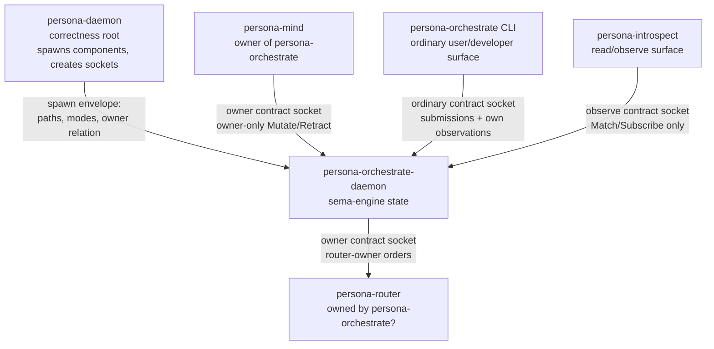
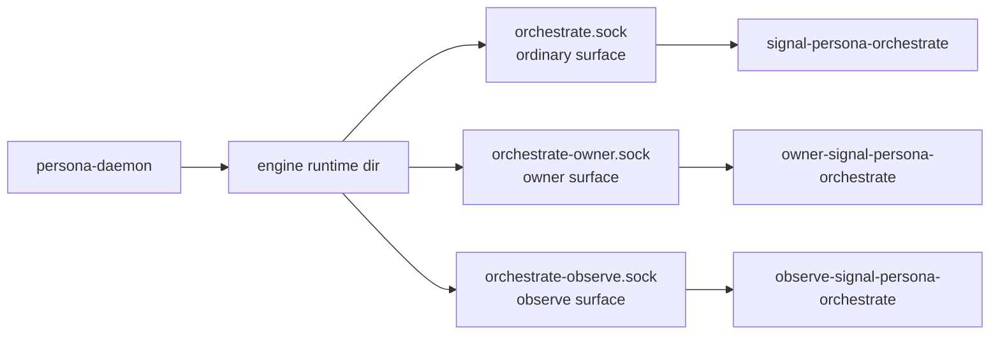
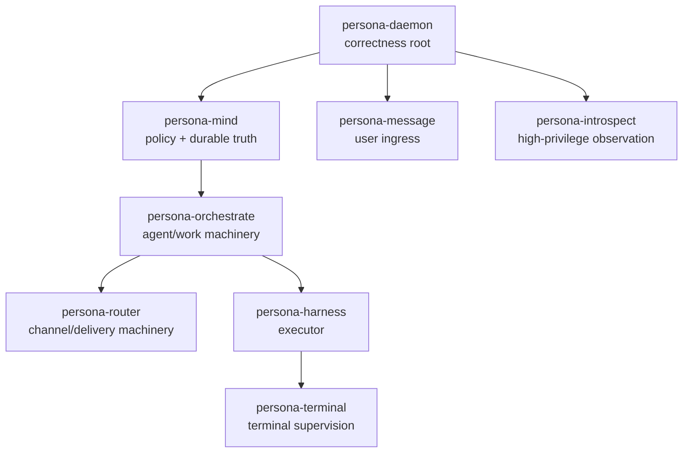
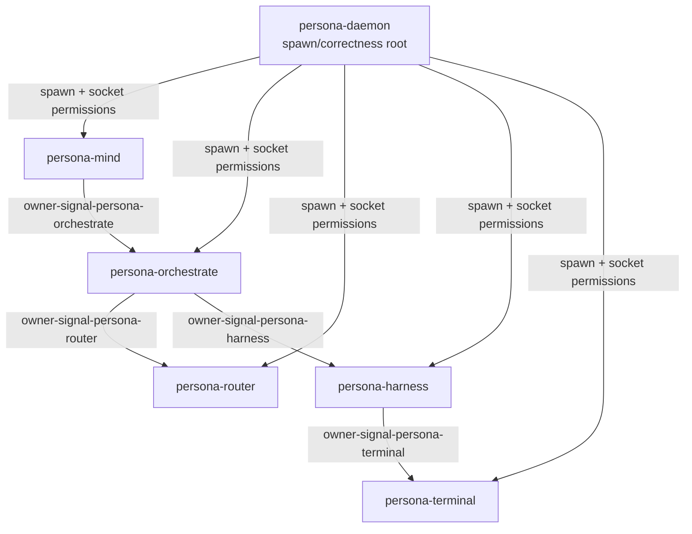

# 116 - Permission-scoped Signal contracts and sockets

Date: 2026-05-17
Role: designer-assistant
Status: brainstorm developed into architecture proposal; updated with
user decisions. No code edited.

## 0. TLDR

The user's idea is strong: permissions can be represented as **different
Signal contract repos plus different sockets**, rather than one broad
contract plus runtime permission gates. A limited peer cannot call a
privileged operation if its contract crate cannot express that
operation and the socket it can connect to does not accept that frame.

Applied to `persona-orchestrate`, the shape looks like this:

The conceptual rule:

> A component may have multiple Signal contract surfaces. Each surface
> is a distinct capability vocabulary and a distinct socket. The
> contract determines what can be said; the socket permissions determine
> who can say it.

This preserves the new triad decision: `persona-orchestrate` is still
one daemon and one sema-engine state owner. The component can expose
multiple contract/socket surfaces without becoming multiple
components.

User decision: Persona is permissioned. Owner-only sockets are an
**OS security boundary**, not merely a correctness convention. If all
trusted components run under the same Unix user, ordinary filesystem
mode bits cannot distinguish "mind may connect to this owner socket,
router may not." Same-UID execution can exist only as an unsafe
author-only development stage, not as the architecture. The architecture
therefore needs per-component Unix identities/groups or an equivalent
unforgeable file-descriptor/capability handoff from `persona-daemon`.

## 1. The idea

Instead of putting every operation into one contract and then asking
the daemon to decide at runtime whether the caller may do it, split the
surface by capability.

Example for `persona-orchestrate`:

| Contract repo | Socket | Who should reach it | What it can express |
|---|---|---|---|
| `signal-persona-orchestrate` | `orchestrate.sock` | ordinary authorized peers and CLI | submissions, own-run observation, limited queries. |
| `OwnerSignal persona-orchestrate` surface, rendered as `owner-signal-persona-orchestrate` unless the naming convention changes | `orchestrate-owner.sock` | the single owner component, likely `persona-mind` | owner-only `Mutate`/`Retract`: scheduling policy, spawn orders, kill/drain, permission bundles. |
| `observe-signal-persona-orchestrate` if a separate read boundary is needed | `orchestrate-observe.sock` | `persona-introspect`, mind, developer tools | `Match`/`Subscribe` views with no mutation authority. |

The limited contract does not include the privileged request variants.
That is better than a broad contract with runtime checks because wrong
callers cannot even compile against the privileged vocabulary unless
they depend on the privileged contract.

## 2. Why this fits the current architecture

### 2.1 It extends the triad, not replaces it

The triad says a runtime component is:

- a daemon;
- a CLI;
- one or more typed Signal contract surfaces;
- sema-engine-backed state owned by the daemon.

The first draft of the skill said "one contract" because the common
case is one surface. The permission idea shows the refinement: one
component owns one stateful daemon, but it may expose multiple contract
surfaces when those surfaces represent different capabilities and
different socket permissions.

The invariant stays:

- CLI talks to its own daemon, not to the world.
- Daemon speaks Signal on every control socket.
- Sema-engine owns durable daemon state.
- Contract crates own vocabulary, not runtime policy.

### 2.2 It matches "permission as shape"

The workspace preference is typed shape over runtime if-statements.
Permission-scoped contracts let the type boundary carry part of the
permission model:

| Runtime-gated single contract | Permission-scoped contracts |
|---|---|
| One `Request` enum contains every operation. | Each socket has a smaller `Request` enum. |
| Daemon checks caller class at runtime for privileged variants. | Unprivileged callers cannot express privileged variants. |
| Tests need to prove every gate rejects every wrong caller. | Tests prove wrong contracts do not contain privileged variants and wrong sockets reject frames. |
| More broad dependencies. | Callers depend only on the capability surface they need. |

Runtime validation still exists for malformed payloads, state
preconditions, and typed failure. But the capability boundary becomes
visible in the filesystem and the type graph.

### 2.3 It fits the filesystem ACL trust model

The user has already settled the local trust model:

- `persona-daemon` sets up the engine correctly;
- sockets live under per-engine run directories;
- modes/owners/groups establish who can connect;
- components inside the trusted federation mostly avoid repeated
  in-band authentication checks.

Permission-scoped sockets are a natural refinement:

The socket path and mode are part of the spawn envelope. The component
binds them. The manager verifies they exist, are Unix sockets, are in
the engine run directory, and have the declared permissions before the
component is marked ready.

## 3. One owner per component

The user added a second rule: only one owner per component maximum.

This creates a tree or rooted directed graph of authority:

This diagram is a hypothesis, not a settled owner graph. The rule is
what matters: one inbound owner edge per component.

The owner edge means:

- who may send owner-only orders;
- who may mutate scheduling/policy/configuration for that component;
- who receives privileged lifecycle observations;
- who is accountable for that component's downstream authority.

The owner edge does not mean:

- the owner opens the child component's database;
- the owner bypasses the child's daemon;
- the owner owns all facts the child stores;
- the owner can skip the child's contract.

The owner talks to the owned component through the owned component's
owner-scoped Signal socket.

## 4. Persona-daemon's role

`persona-daemon` establishes correctness. It should not become the
policy owner of every component's domain.

Its responsibilities:

| Responsibility | Meaning |
|---|---|
| Spawn envelope | Provide each component with run dir, socket paths, modes, owner relation, state paths. |
| Socket setup/verification | Create or verify runtime directories; verify sockets after bind; reject readiness if metadata is wrong. |
| Owner graph | Record the one-owner edge for each component. |
| Component lifecycle | Start/stop/restart component daemons; observe readiness and exit. |
| Permission substrate | Establish OS-level user/group/FD/capability conditions for each socket surface. |

It should not:

- decide routine work policy for mind/orchestrate;
- inspect child databases to enforce policy;
- route every message through itself;
- be the only owner edge in the graph unless the component is truly
  engine-root-owned.

## 5. Socket enforcement decision

The elegant idea has a hard Unix detail, and the user has settled the
direction: this is OS security. Persona is permissioned.

If every component runs under the same privileged Unix user, mode `0600`
on `orchestrate-owner.sock` proves "only that Unix user can connect."
It does **not** prove "only `persona-mind` can connect," because
`persona-router`, `persona-harness`, and `persona-orchestrate` may run
as the same UID.

That means there are three levels of enforcement, and only the third is
the architecture:

| Level | Mechanism | What it proves |
|---|---|---|
| Trust-domain boundary | Same persona Unix user; socket mode `0600`. | Only trusted Persona components can connect. Not enough for owner sockets. |
| Component correctness convention | Persona-daemon passes the owner socket path only to the owner component. | Honest components use only their assigned surfaces. Acceptable only as unsafe author-only development. |
| Strong per-component boundary | Per-component Unix identities/groups, inherited file descriptors, or capability handoff. | Non-owner components cannot connect even if they know the path. This is the architecture. |

`persona-daemon` establishes the correctness of the system by creating
the OS permission substrate, not by trusting every component to ignore
sockets it could open. The spawn envelope still records paths, modes,
owners, and expected surfaces, but owner-only means the kernel or an
equivalent unforgeable capability denies non-owner connection.

### 5.1 Strong enforcement options

| Option | Shape | Strength | Cost |
|---|---|---|---|
| Per-component Unix users | `persona-mind`, `persona-orchestrate`, `persona-router` run as distinct users. Owner sockets use mode/group ACLs. | Strong filesystem enforcement. | More OS/user management, more Nix/systemd work. |
| Per-component Unix groups | Components share a base user but have distinct supplementary groups. Owner socket group is only the owner group. | May work if process groups are genuinely distinct. | Still needs careful spawn setup; group leakage is possible. |
| Inherited file descriptors | Persona-daemon creates/listens or opens sockets and passes only the owner FD to the owner process. No pathname access needed. | Strong capability style; possession of FD is authority. | More complex daemon spawn/runtime; less inspectable by simple path. |
| Private runtime directories | Owner socket in a directory only owner can traverse. | Strong only with distinct Unix identities. | Same-UID components can still traverse if permissions allow same owner. |
| Peer credential allowlist | Daemon checks `SO_PEERCRED` PID/UID and spawn registry. | Stronger than path convention, but becomes runtime gate. | Reintroduces in-band-ish permission logic; PID reuse and lifecycle details matter. |
| Signed/capability handshake | Persona-daemon gives owner a token/key for owner socket. | Strong if implemented well. | More auth surface; closer to the AuthProof machinery we simplified away. |

Recommendation after the user decision: target per-component Unix
identities/groups as the first OS-visible design because it keeps
socket paths inspectable and fits Nix/systemd deployment. Keep inherited
file-descriptor capability handoff as the stronger future option for
surfaces where path visibility itself becomes undesirable. Avoid a broad
runtime credential gate as the main design; it reintroduces the
in-band-auth machinery the filesystem/capability boundary is meant to
replace.

## 6. Contract naming decision

The user suggested `ownerSignal-...`. The concept is good: the
permission class should be visible before the ordinary Signal surface.
Because workspace repository and crate names use lowercase hyphenated
English, I would render the concept as `OwnerSignal` in prose and
`owner-signal-persona-orchestrate` as the repo name. The Rust crate name
would be `owner_signal_persona_orchestrate`.

Options:

| Name | Strength | Weakness |
|---|---|---|
| `owner-signal-persona-orchestrate` | Reads as "OwnerSignal for persona-orchestrate." The permission class is visually first. | Breaks `signal-*` grouping. Tooling/search patterns must include `owner-signal-*`. |
| `signal-persona-orchestrate-owner` | Preserves `signal-*` grouping and component-first naming. | Rejected direction unless the user reverses course; permission class is too quiet. |
| `signal-owner-persona-orchestrate` | Preserves `signal-*` prefix while surfacing owner early. | Awkward English; looks like owner is part of component name. |
| `signal-persona-orchestrate/owner` module | One repo with modules per surface. | Reduces repo count, but repo count is not the goal; one dependency exposes all types unless feature-gated. |

Decision to carry forward unless the user corrects the rendering:
owner surfaces use the `OwnerSignal` concept, repo-rendered as
`owner-signal-<component>`. Ordinary surfaces remain
`signal-<component>`. Read-only observation surfaces can use
`observe-signal-<component>` if they are privileged enough to justify a
separate contract.

## 7. How many surfaces?

Split by security boundary. Repo count is not a reason to merge
surfaces. The user explicitly prefers clearer security boundaries over
avoiding "repo explosion"; editing an OwnerSignal contract is a bigger
deal and deserves a harder audit.

Suggested default surfaces:

| Surface | Contract | Socket | Verbs |
|---|---|---|---|
| Ordinary | `signal-persona-<component>` | `<component>.sock` | `Assert`, `Match`, `Subscribe`, limited `Validate`; no owner-only `Mutate`. |
| OwnerSignal | `owner-signal-<component>` | `<component>-owner.sock` | owner-only `Mutate`, privileged `Retract`, policy/configuration, kill/drain. |
| ObserveSignal | `observe-signal-<component>` if the read boundary is privileged | `<component>-observe.sock` | `Match`, `Subscribe`; no mutation. |
| Data plane | not necessarily Signal | component-specific | raw bytes or high-throughput stream. |

A component may not need all surfaces. The ordinary and observe
surfaces can be the same only when they are genuinely the same security
boundary. OwnerSignal is justified when owner-only operations exist that
should not even appear in the ordinary contract.

## 8. Applying this to `persona-orchestrate`

### 8.1 Ordinary contract

`signal-persona-orchestrate`:

| Family | Verb | Notes |
|---|---|---|
| `ScopeAcquisitionSubmission` | `Assert` | A caller asks to claim scope. Not an authority order. |
| `ScopeReleaseSubmission` | `Retract` | A caller releases its own scope. |
| `BlockedWorkReport` | `Assert` | An executor/agent reports blockage. |
| `OwnRunObservation` | `Match` | Query a run the caller is allowed to see. |
| `OwnRunLifecycleSubscription` | `Subscribe` | Observe own run lifecycle. |
| `SpawnPlanValidation` | `Validate` | Dry-run a proposed run, if safe to expose. |

### 8.2 Owner contract

`owner-signal-persona-orchestrate`:

| Family | Verb | Notes |
|---|---|---|
| `SpawnAgentOrder` | `Mutate` | Owner orders orchestrate to spawn/allocate a run. |
| `AcquireScopeOrder` | `Mutate` | Owner orders scope installation after policy decision. |
| `ReleaseScopeOrder` | `Retract` | Owner retracts a scope. |
| `StopAgentOrder` | `Mutate` or `Retract` | Exact semantics to settle. |
| `SetSchedulingPolicy` | `Mutate` | Owner changes scheduler policy. |
| `SetExecutorCapacityPolicy` | `Mutate` | Owner changes capacity/backpressure policy. |
| `OwnerSnapshotQuery` | `Match` | Full privileged state view. |
| `AgentLifecycleSubscription` | `Subscribe` | Full lifecycle stream. |

### 8.3 Observe contract

`observe-signal-persona-orchestrate` if the read boundary is privileged:

| Family | Verb | Notes |
|---|---|---|
| `OrchestrateSnapshotQuery` | `Match` | Possibly redacted state. |
| `AgentLifecycleSubscription` | `Subscribe` | Possibly redacted lifecycle stream. |
| `ExecutorCapacitySubscription` | `Subscribe` | Capacity/readiness stream. |
| `ScopeEventSubscription` | `Subscribe` | Conflict/acquisition/release stream. |

This may be unnecessary if ordinary contract can safely carry the same
read-only operations. It becomes useful when `persona-introspect` needs
a richer read surface than ordinary callers.

## 9. Applying this to the owner chain

If the user wants `persona-mind owns persona-orchestrate, which owns
persona-router`, then the authority chain could be:

This says `persona-daemon` starts everything and establishes the socket
permission substrate, but the domain owner relation is not
"persona-daemon owns everyone." Domain ownership flows through the
engine.

User answer: the candidate graph is good enough for now. Do not overfit
the rest of the engine yet; the system is young and still mostly run by
the author and the author's agents. The useful near-term owner chain is
`persona-mind -> persona-orchestrate -> persona-router/persona-harness`,
with terminal ownership routed through the harness/orchestrate decision
later.

## 10. Witness tests

Each permission surface should have architectural-truth witnesses:

| Witness | Proves |
|---|---|
| `<component>-owner-contract-contains-owner-only-variants` | Privileged operations live only in the owner contract. |
| `<component>-ordinary-contract-cannot-express-owner-operations` | Limited callers cannot compile/send privileged frames through ordinary surface. |
| `<component>-owner-socket-mode-matches-spawn-envelope` | Persona-daemon and component agree on owner socket metadata. |
| `<component>-ordinary-socket-rejects-owner-frame` | Wrong socket does not accept privileged frame family. |
| `<component>-owner-socket-connectivity-is-os-enforced` | A non-owner component cannot connect to the owner socket even if it knows the path. |
| `<component>-daemon-state-goes-through-sema-engine` | Multiple socket surfaces share one component state engine, not separate hidden stores. |
| `persona-daemon-owner-graph-has-at-most-one-owner-per-component` | Owner relation is a tree/rooted graph with no multiple owners. |

The fifth witness is load-bearing now. With same-UID components, it can
only fail honestly until per-component identities or FD capabilities
land. That failure is useful: it prevents the prototype from pretending
to enforce a boundary it does not enforce.

## 11. Benefits

1. **Capabilities become visible.** The repo dependency graph and socket
   list show who can do what.
2. **Privileged operations disappear from limited contracts.** This is
   stronger than a runtime gate on a broad enum.
3. **The owner graph is explicit.** One owner per component can become a
   typed spawn-envelope field and a daemon witness.
4. **Persona-daemon remains correctness root.** It creates the runtime
   substrate without owning every domain policy.
5. **Introspection improves.** Each component can expose read-only
   observation surfaces without broad mutation authority.

## 12. Risks

| Risk | Why it matters | Mitigation |
|---|---|---|
| Contract repo count | Every permission level may become a repo. | This is acceptable when the boundary is real; owner contracts are high-audit surfaces. |
| Same-UID false security | Filesystem ACLs do not separate components with the same UID. | Architecture requires per-component UID/group or FD passing for owner surfaces. |
| Owner graph becomes too rigid | Some components may need multiple authorities. | Allow many observers/clients but only one owner; escalate exceptional multi-owner cases to user. |
| CLI confusion | Which socket does the component CLI use? | CLI uses ordinary component surface by default; owner actions need explicit owner CLI mode or a separate admin command. |
| Duplicate records | Ordinary and owner contracts may define similar types. | Shared nouns live in one contract only when safe; privileged wrappers live in owner contract. |

## 13. Settled answers

### A1. Owner sockets use per-component Unix users/groups first

Decision: owner-only enforcement is an OS security boundary, and the
first implementation target is per-component Unix users/groups. Owner
sockets are normal filesystem ACL boundaries established by
`persona-daemon`. Inherited file descriptors remain a possible later
hardening path for stricter surfaces; runtime credential gates are not
the main design.

### A2. Naming is settled as `owner-signal-*`

Context: you suggested `ownerSignal-...`. CamelCase is not a good
repository/crate spelling in this workspace, but the concept can be
`OwnerSignal` in prose and `owner-signal-persona-orchestrate` on disk.

Decision: render it as `owner-signal-*` for repo names and
`owner_signal_*` for Rust crate names.

### A3. The first owner graph is good enough for now

Context: you gave the example "persona-mind owns
persona-orchestrate, which in turn owns persona-router." We need the
initial full graph to design sockets and spawn envelopes.

Candidate:

| Component | Owner |
|---|---|
| `persona-mind` | `persona-daemon` or engine root |
| `persona-orchestrate` | `persona-mind` |
| `persona-router` | `persona-orchestrate` |
| `persona-harness` | `persona-orchestrate` |
| `persona-terminal` | `persona-harness` or `persona-orchestrate` |
| `persona-message` | `persona-mind` or `persona-router` |
| `persona-introspect` | `persona-daemon` or `persona-mind` |

User answer: the candidate graph is good enough for now; defer the
rest. The system is still young and author-operated.

### A4. First pass creates the OwnerSignal chain end-to-end

Answered principle: repo count is not a concern. Security clarity wins.
OwnerSignal surfaces should be separate repos because editing one is a
bigger deal and needs a harder audit.

Decision: create `owner-signal-persona-orchestrate`,
`owner-signal-persona-router`, and `owner-signal-persona-harness` in
the first pass so the initial owner chain is represented end-to-end.

### A5. One actor per Signal contract surface

Context: triad says the CLI is a thin bridge to its own daemon. If the
daemon has ordinary and owner sockets, a normal user CLI should not
silently connect to owner. But developers may need a way to send owner
requests during testing.

Decision: the CLI has the access the OS grants to its process. It must
send the right contract type to the right socket. A component CLI or
daemon has one actor per Signal contract surface; each actor knows its
socket path from typed configuration, with an environment-variable
fallback allowed for CLI convenience.

## 14. Bottom line

Permission-scoped Signal contracts fit the workspace direction:
correctness is represented by shapes, not broad enums plus runtime
permission branches. The daemon remains one state owner with one
sema-engine database, but it may expose multiple typed Signal surfaces
when different callers have different capabilities.

The architecture decision is now stronger: owner-only sockets are OS
security boundaries. Same-UID component execution is not enough for the
finished system. `persona-daemon` must create stronger per-component
identities or pass unforgeable capabilities, and OwnerSignal contracts
should be separate repos because the separate repo is part of the audit
surface.

## 15. Follow-up decisions from user

The user answered the remaining questions after this report's previous
draft:

1. **OS security stands.** Persona is permissioned. OwnerSignal sockets
   are real OS security boundaries. The first implementation should
   target an OS-enforced mechanism, not merely a convention.
2. **Naming is `owner-signal-*`.** The concept can be named
   `OwnerSignal` in prose, but repository names use
   `owner-signal-<component>` and Rust crates use
   `owner_signal_<component>`.
3. **Do the first OwnerSignal chain end-to-end.** First pass should
   include `owner-signal-persona-orchestrate`,
   `owner-signal-persona-router`, and
   `owner-signal-persona-harness`, so the initial owner chain is
   represented rather than only the first link.
4. **One actor per Signal contract.** A CLI or daemon may have access
   to the sockets it is permissioned to write to, but it must send the
   right contract type to the right socket. Each Signal contract surface
   gets its own actor, and that actor knows its socket path from typed
   configuration or an environment-variable fallback for CLI
   convenience. No generic actor sends arbitrary Signal frames to
   arbitrary sockets.
