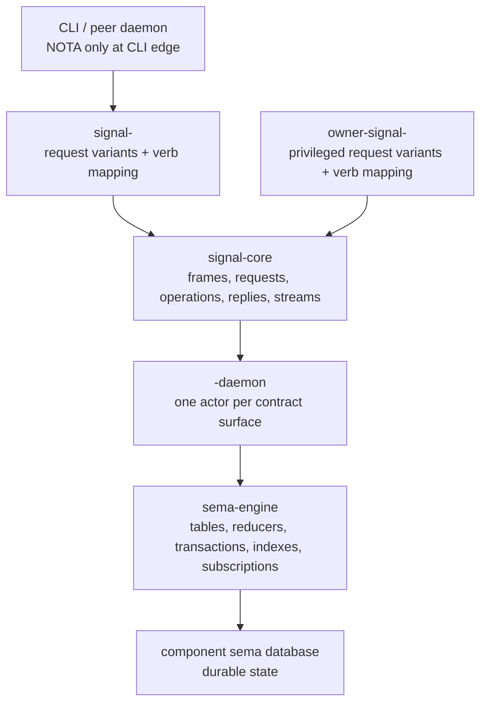

# 118 - Signal Core / sema-engine fit investigation brief

Date: 2026-05-17  
Role: designer-assistant  
Status: investigation brief for a future operator/designer pass. No code
investigation performed in this report by user request.

## 0. Purpose

The triad component shape now says every runtime component owns durable
state through **sema-engine** and speaks **Signal Core** frames through
its ordinary and permission-scoped Signal contracts. That is the right
architectural sentence, but it needs a focused implementation audit:

> Do `signal-core` and `sema-engine` actually play well together today,
> or do component authors have to write a bunch of adapter code,
> duplicate verb mappings, and hand-built reducers to make the two meet?

This report is not that audit. It is the brief for the agent who should
perform it.

## 1. Load-bearing architectural intent

The intended stack is:

The important design claim is:

> Signal Core names the operation at the wire boundary; sema-engine
> commits or queries the component's durable state using the same
> operation semantics.

That means the six verbs should line up cleanly:

| Signal Core verb | sema-engine responsibility |
|---|---|
| `Assert` | append/insert a new typed fact, event, or row. |
| `Mutate` | transition a record at stable identity under authority. |
| `Retract` | tombstone/remove a typed fact or active state. |
| `Match` | query by key, range, predicate, projection, or index. |
| `Subscribe` | open initial-state-then-deltas stream from commit log/state. |
| `Validate` | dry-run an operation or batch without committing. |

The investigation should test whether this is actually true in code.

## 2. What "plays well together" means

The fit is good if a component author can do this without ceremony:

1. Define request/reply/event payloads in `signal-<component>` or
   `owner-signal-<component>`.
2. Declare the per-request `SignalVerb` in the contract.
3. Receive `signal-core` frames in one typed socket actor.
4. Hand each typed request to a small reducer/handler that calls
   sema-engine through verb-shaped APIs.
5. Get typed outcomes, subscription deltas, and validation failures back
   without building a parallel mini database engine in the component.

The fit is bad if component authors must repeatedly invent:

- local `match request { ... }` verb dispatch that duplicates contract
  metadata;
- ad hoc transaction boundaries that should be sema-engine concepts;
- hand-written "validate but do not commit" copies of every reducer;
- per-component subscription fanout machinery that sema-engine should
  provide;
- stringly table names, raw `redb`, or schema checks outside
  sema-engine;
- one-off reply/error conversions that lose the Signal Core operation
  shape.

## 3. Repositories and files to inspect

Minimum audit set:

- `/git/github.com/LiGoldragon/signal-core`
  - `ARCHITECTURE.md`
  - operation/request/reply/frame types
  - `signal_channel!` proc-macro output
  - subscription/stream frame shape
- `/git/github.com/LiGoldragon/sema-engine`
  - `ARCHITECTURE.md`
  - public API
  - transaction model
  - table/index/reducer/subscription support
  - validation/dry-run support
- At least two components that are actively becoming triad daemons:
  - `/git/github.com/LiGoldragon/persona-terminal`
  - `/git/github.com/LiGoldragon/persona-introspect` or
    `/git/github.com/LiGoldragon/persona-mind`
- At least one non-Persona future consumer:
  - `lojix` design/branch if present

The investigator should not only read architecture. They should trace
actual code paths from a decoded Signal request into persistent state
and back into a typed reply.

## 4. Questions the investigation must answer

### Q1. Does `signal_channel!` emit enough metadata for sema-engine?

The contract macro knows every request variant and its `SignalVerb`.
Can a daemon ask the generated type for:

- the verb;
- the request kind;
- stream opened/closed relation, if any;
- reply kind;
- event kind;
- whether the operation is ordinary or owner-scoped by contract
  surface?

If not, components will duplicate this metadata in hand-written routing
tables. That is the first smell to look for.

### Q2. Does sema-engine expose verb-shaped operations?

Look for a public API that naturally maps to the six verbs. The exact
method names do not have to be `assert`, `mutate`, `retract`, `match`,
`subscribe`, `validate`, but the semantics should be present.

If sema-engine only exposes low-level table methods, the triad daemon
will need component-local verb reducers. That may be acceptable, but
the line must be explicit: sema-engine is then a storage/reducer kernel,
not a full Signal operation executor.

### Q3. Where does `Validate` live?

`Validate` is the easiest verb to fake and the hardest to make honest.
The audit should determine whether sema-engine can execute the same
reducer logic without committing, including:

- schema checks;
- uniqueness/index checks;
- permission/precondition checks supplied by the component;
- multi-operation validation;
- typed failure shape returned to the Signal reply.

If each component has to write separate validation logic, drift is
likely.

### Q4. Where do subscriptions come from?

The architecture says `Subscribe` is push, not polling. The audit must
check whether sema-engine can provide:

- initial state;
- commit deltas after the initial state;
- typed subscription tokens;
- close/retract semantics;
- per-table or per-query streams;
- backpressure/drop policy.

If not, every component will grow its own subscription machinery and
the Signal Core `Subscribe` verb will be mostly nominal.

### Q5. What is the transaction boundary?

Signal Core requests may contain one or more operations. The audit must
find the exact transaction semantics:

- Is a multi-operation request atomic?
- Does sema-engine support one transaction per Signal request?
- Do per-operation replies line up with commit/abort semantics?
- Can a component attach domain side effects, such as spawning a child
  process, without lying about what has committed?

This is especially important for `CreateSession`: sema-engine can
record intent or session state, but starting a PTY child is an external
effect. The audit should identify the pattern for durable state plus
external side effect without pretending one database transaction
magically includes the process spawn.

### Q6. Are owner-signal operations first-class?

The new triad shape says privileged owner operations live in
`owner-signal-<component>` contracts and distinct sockets. The audit
should check whether sema-engine state/reducer code can stay shared
without merging the contract surfaces back together.

Good shape:

- ordinary socket actor decodes ordinary contract;
- owner socket actor decodes owner contract;
- both call component-owned reducers over sema-engine;
- reducers know domain policy, but the contract/socket split prevents
  unauthorized vocabulary from entering.

Bad shape:

- one broad internal enum contains all ordinary and owner requests;
- every socket decodes the broad enum;
- runtime gates decide permission for each variant.

### Q7. Can errors stay typed from wire to state and back?

The audit should identify whether errors become strings anywhere
between Signal request decode, sema-engine execution, and Signal reply.
Good fit means typed failures:

- decode/protocol failure;
- schema-version mismatch;
- validation failure;
- precondition failure;
- conflict;
- not found;
- permission/vocabulary mismatch;
- subscription closed.

## 5. Concrete witnesses to ask operator for

The eventual implementation should produce real tests, not only source
inspection:

| Witness | Proves |
|---|---|
| `signal-core-request-executes-through-sema-engine-assert` | A real Signal `Assert` request commits a typed row/fact through sema-engine and returns a typed reply. |
| `signal-core-request-executes-through-sema-engine-mutate` | A real Signal `Mutate` request transitions a stable record through sema-engine. |
| `signal-core-validate-does-not-commit` | `Validate` runs the same reducer/precondition path without altering tables. |
| `signal-core-subscribe-receives-initial-state-then-delta` | `Subscribe` is backed by sema-engine push semantics, not polling. |
| `owner-signal-request-uses-same-reducer-through-owner-socket` | Owner-signal surface calls the same component state machinery without broadening the ordinary contract. |
| `wrong-contract-frame-does-not-reach-reducer` | A frame from the wrong contract/socket is rejected before sema-engine mutation. |
| `multi-operation-request-has-clear-commit-semantics` | A multi-operation Signal request either commits with coherent per-operation replies or aborts without partial durable state. |

## 6. Expected outputs

The investigator should produce:

1. A report naming whether the current fit is good, partial, or bad.
2. A table mapping each Signal Core verb to the concrete sema-engine API
   used to implement it.
3. A list of boilerplate or adapter code repeated in components.
4. A recommendation: keep sema-engine as-is, add thin helper APIs, or
   reshape sema-engine so it becomes a fuller Signal operation engine.
5. A minimal implementation plan for whichever witness tests are
   missing.

## 7. Design bias

Do not preserve transitional APIs out of politeness. If sema-engine
needs to change so runtime components can cleanly execute Signal Core
operations, change sema-engine. The persona engine is not production
yet, and the workspace preference is beautiful design over backwards
compatibility.

The desired endpoint is not "Signal Core next to sema-engine." It is:

> Signal Core is the wire grammar of operations; sema-engine is the
> durable execution substrate for those operations.

The audit should judge the code against that sentence.
