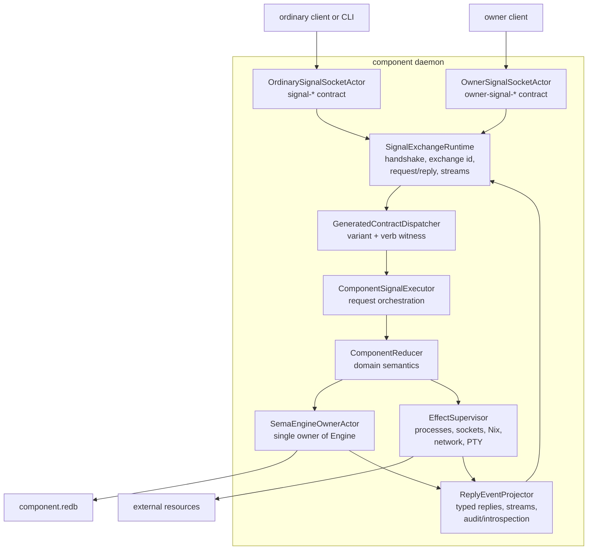
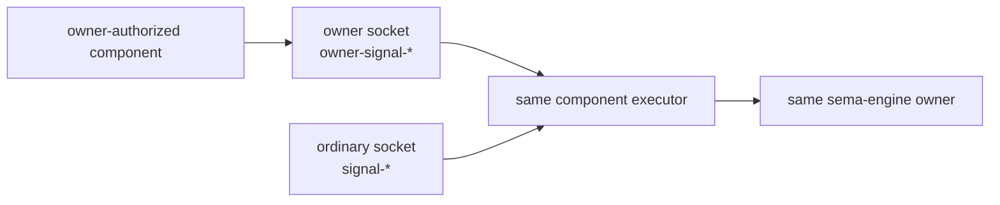
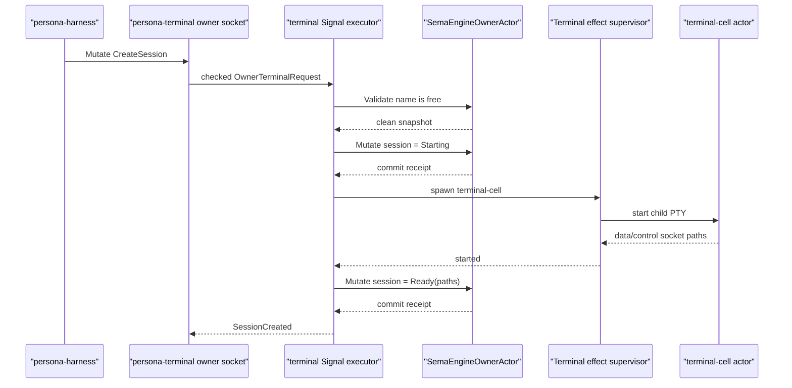
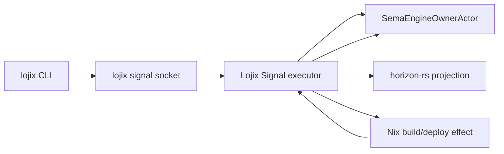

# 119 - Full Signal executor architecture concept

Date: 2026-05-18  
Role: designer-assistant  
Status: concept report. No repository code edited.

## 0. Answer to the immediate correction

Yes: terminal session lifecycle has already moved into OwnerSignal.

The current workspace state is:

- `owner-signal-persona-terminal` exists.
- `owner-signal-persona-terminal::OwnerTerminalRequest` carries:
  - `Mutate CreateSession(CreateSession)`
  - `Retract RetireSession(RetireSession)`
- ordinary `signal-persona-terminal` no longer carries
  `CreateSession` or `RetireSession`;
- `persona-terminal` depends on `owner-signal-persona-terminal` and has
  an owner request actor path that currently returns typed
  `OwnerTerminalRequestUnimplemented { reason: NotBuiltYet }`;
- the missing work is runtime execution and owner Unix socket wiring, not
  contract placement.

That correction matters for the Signal executor concept: OwnerSignal is
not a later permission layer. It is part of the component execution surface
from the beginning.

## 0.5 Consideration of second-operator-assistant/3

`reports/second-operator-assistant/3-full-signal-executor-architecture-consideration-2026-05-18.md`
has been rewritten as an operator complement to this report. The two reports
now converge. Its most useful contribution is still the separation of three
meanings of "full Signal executor":

1. **Engine as protocol host**: sema-engine accepts Signal requests,
   knows contract channels, dispatches variants, and shapes replies.
2. **Engine as transaction grouper**: sema-engine stays contract-blind
   but grows a multi-table transaction handle when pressure proves it.
3. **Component-local execution plane**: each daemon owns Signal sockets,
   dispatch actors, component reducers, sema-engine state, and effects.

This report means the third thing. The first thing is the wrong shape. A
contract-aware sema-engine would violate the kernel/domain split: sema-engine
is a database library, not a protocol host, not an actor runtime, and not a
component reducer.

The second operator assistant's report also narrows near-term work:

- sema-engine helper additions such as `validate_write`, `commit_multi`, and
  `unsubscribe` should not be added speculatively;
- a multi-table transaction primitive is real but should wait for an actual
  consumer that cannot be modeled more cleanly as one table mutation;
- a macro-generated dispatcher trait is a signal-core-macros question, not a
  sema-engine question, and should land only if it improves clarity over
  explicit Rust pattern matching.

So the refined position is:

> Keep sema-engine as the verb-shaped database executor. Build Signal
> execution as a daemon-local actor plane. Extract shared executor helpers
> only after `persona-terminal` and `lojix-daemon` prove the same shape.

The operator complement adds one implementation warning this report should
carry forward: every daemon-local `SemaEngineOwnerActor` is a state-bearing
actor around an exclusive redb handle. Until the Kameo lifecycle and
`spawn_in_thread` resource-release path are proven for that shape, the safe
default is the StoreKernel pattern already used in `persona-mind`: one owned
engine handle behind one supervised actor, with resource-release witnesses
before restart is trusted.

## 1. What "full Signal executor" should mean

A full Signal executor should not be a global daemon that knows every
contract. It should be a **component-local execution plane** inside each
triad daemon.

The executor is the standard path from:

```text
Signal frame received on a typed socket
-> verified Signal exchange
-> typed contract request
-> verb-aware handler dispatch
-> sema-engine state operation and/or honest external effect
-> typed reply/event
-> durable audit/introspection record
```

"Full" means it handles the whole lifecycle of a Signal exchange. It does
not mean "generic enough to execute all domain semantics without component
code." Domain semantics still belong to the component.

It also does not mean "sema-engine becomes the executor." Sema-engine
executes database verbs over registered record families. The Signal
execution plane coordinates sockets, Signal frames, contract dispatch,
component reducers, sema-engine calls, external effects, replies, streams,
and introspection.

The executor should become the reusable shape every component daemon uses:

- `persona-mind`
- `persona-router`
- `persona-harness`
- `persona-terminal`
- `persona-message`
- `persona-introspect`
- `persona-orchestrate`
- `lojix-daemon`
- future Criome-facing daemons

Each component has its own contracts, sockets, state tables, side effects,
and authority surfaces. The executor gives them the same skeleton.

## 2. Current architecture facts this concept relies on

### Signal core

`signal-core` is the wire kernel. It owns:

- `ExchangeFrame` and `StreamingFrame`;
- handshake records;
- async exchange identifiers and stream event identifiers;
- `SignalVerb`, now closed at six roots:
  `Assert`, `Mutate`, `Retract`, `Match`, `Subscribe`, `Validate`;
- `Operation<Payload>`;
- `Request<Payload>` as a non-empty operation list;
- structural atomicity through a multi-operation request, not an
  `Atomic` verb;
- `Reply<ReplyPayload>` with accepted/rejected and per-operation replies;
- the `signal_channel!` proc macro that lets contract crates declare
  typed request/reply/event families and per-variant verb mappings.

Signal core deliberately does not own auth, sockets, actors, state,
reducers, or domain records.

### Sema engine

`sema-engine` is the database execution substrate. It owns:

- registered record families;
- `Assert`, `Mutate`, `Retract`;
- structural multi-op commit;
- `Match`;
- `Validate`;
- `Subscribe`;
- commit log;
- table introspection;
- query/read-plan vocabulary.

It deliberately does not own sockets, Kameo actors, tokio runtime,
Persona contracts, authorization, or component domain validation.

One important constraint is load-bearing: an `Engine` is a single-owner
handle. Component daemons must serialize engine calls through one owning
actor.

### Component triad

Every component is a triad:

- CLI: translates human/agent text into Signal and speaks only to its
  daemon.
- Daemon: owns sockets, actors, state, side effects, and execution.
- Signal contract repo(s): define typed request/reply/event vocabulary.

The triad now also says:

- daemon state goes through sema-engine;
- privileged authority uses separate OwnerSignal contracts and sockets;
- one actor per signal contract surface is expected.

## 3. The executor shape



The important point: the socket actor is not the executor, and
sema-engine is not the executor. The executor is the component-local path
that coordinates Signal semantics, component reducers, Sema state, and
external effects.

## 4. The planes

### 4.1 Socket and permission surface

Each Signal contract gets its own ingress actor:

- ordinary component socket for ordinary `signal-*` contract;
- owner socket for `owner-signal-*` contract;
- future observe/introspection sockets if a component has such a surface.

The socket decides **which contract family** is legal on that connection.
The socket does not decide "is Mutate legal?" globally. Owner-only
requests are not legal on an ordinary socket because the ordinary contract
does not contain those variants.

For example, `persona-terminal` should have:

- an ordinary terminal socket that accepts `signal-persona-terminal`;
- an owner terminal socket that accepts `owner-signal-persona-terminal`;
- a supervision socket that accepts `signal-persona` supervision.

The persona daemon establishes correctness by creating sockets with the
right paths, owners, groups, and modes. The executor receives the already
classified surface as part of the execution envelope.

### 4.2 Signal exchange runtime

The exchange runtime owns frame-level Signal semantics:

- handshake;
- protocol version;
- exchange identifier;
- async request/reply matching;
- streaming event identifiers;
- request decoding;
- reply encoding;
- connection-level errors.

Payloads do not carry correlation identifiers. The frame layer owns
exchange identity. Domain records do not need to know that an async
transport exists.

### 4.3 Contract dispatch

The `signal_channel!` proc macro already owns the typed request/reply/event
family and the `signal_verb()` witness. One possible extension is for the
macro, or a sibling executor macro, to generate a dispatch trait:

```rust
#[async_trait]
pub trait OwnerTerminalHandler {
    async fn mutate_create_session(
        &mut self,
        request: CreateSession,
        context: &mut ExecutionContext,
    ) -> Result<SessionCreated, OwnerTerminalExecutionError>;

    async fn retract_retire_session(
        &mut self,
        request: RetireSession,
        context: &mut ExecutionContext,
    ) -> Result<SessionRetired, OwnerTerminalExecutionError>;
}
```

The exact trait shape can change. The design point is stable:

- macro-generated code may do boring, contract-shaped dispatch if repeated
  manual matches become mechanical enough to justify it;
- domain reducers stay handwritten;
- every handler method name includes the Signal verb;
- the generated code rejects verb/payload mismatch before domain logic.

The macro should not generate reducers, database schemas, or process-spawn
logic. Those are component decisions.

This is not required for the first executor pass. Explicit Rust pattern
matching is acceptable when each match arm carries real routing meaning, trace
nodes, or actor-plane decisions. A generated trait earns its place only if it
removes noise without hiding the daemon's actor topology.

### 4.4 Component executor

The component executor receives a checked request and executes each
operation in order.

For a single operation, it dispatches once. For a multi-operation request,
it must preserve structural atomicity at the domain level. That does not
mean every external effect becomes part of a redb transaction. It means
the component must choose an honest execution pattern:

- pure state request: one sema-engine commit can be the atomic boundary;
- state plus external effect: use durable pending state plus an effect
  step, then commit success/failure;
- impossible atomicity: reject or return a typed invalidation before
  starting effects.

This is where the executor protects us from lying about atomicity.

### 4.5 Component reducer

The reducer owns domain semantics. It answers:

- Is this operation valid in the current component state?
- Which sema-engine records change?
- Which side effects are required?
- Which typed reply or event should be produced?
- Which audit/introspection records should be appended?

The reducer is component-specific. A generic executor cannot infer that
`CreateSession` means "reserve terminal name, spawn a terminal-cell actor,
then publish a data socket path."

### 4.6 SemaEngineOwnerActor

Every component daemon should have one actor that owns its `sema-engine`
`Engine` handle.

All component state operations go through it:

- `Assert`;
- `Mutate`;
- `Retract`;
- multi-op commit;
- `Match`;
- `Validate`;
- `Subscribe`;
- commit-log reads.

This preserves sema-engine's single-owner constraint and gives every
component one durable ordering point.

This actor is not a casual helper. It owns an exclusive database handle. Its
supervision strategy must prove release-before-restart for the database file.
Until the Kameo state-bearing actor path is fully witnessed for threaded
actors, use the established component StoreKernel discipline rather than
inventing per-component redb ownership patterns.

### 4.7 Effect supervisor

Anything that touches the outside world is not a database operation:

- spawning a PTY;
- starting a Nix build;
- launching a viewer;
- opening a network connection;
- writing a file outside the component database;
- talking to another daemon.

The executor should treat these as effect steps, not pretend sema-engine
can roll them back.

The standard effectful pattern should be:

1. Validate and reserve durable intent.
2. Commit pending state.
3. Run the effect.
4. Commit success or failure.
5. Emit the reply/event from the committed result.

This is a saga/outbox discipline, but we do not need to import that naming
into user-facing prose if it feels ugly. The core rule is enough:
external effects happen around durable state transitions honestly.

### 4.8 Reply, event, audit, introspection

The executor should produce:

- typed replies for the original exchange;
- typed stream events for subscribers;
- durable sema-engine commit log entries;
- component introspection records where needed.

Nexus/NOTA belongs at ingress/egress: CLI parsing, human-readable logs,
agent-readable reports, and UI display. Inside the daemon, Signal frames
and sema-engine records remain rkyv-shaped typed data.

## 5. OwnerSignal as a first-class executor surface

OwnerSignal should not be special-cased as "ordinary Signal plus a flag."
It is a separate contract surface:



The owner socket and ordinary socket may share the same component executor
and Sema owner actor. They must not share the same request vocabulary.

For terminal:

- ordinary `signal-persona-terminal` can list/resolve sessions, acquire
  gates, write injections, and observe terminal events;
- owner `owner-signal-persona-terminal` can create and retire sessions;
- both mutate the same component database through the same Sema owner
  actor;
- only the owner surface can express lifecycle mutation.

This is the cleaner shape than putting permission checks inside one bloated
request enum. The Rust type graph makes the security boundary visible.

## 6. Worked example: owner terminal `CreateSession`



If the spawn fails after the pending row is committed, the executor does
not pretend the request never happened. It commits a failure state or
retracts the reservation through a typed terminal lifecycle rule, then
returns a typed failure reply. The exact terminal policy still needs
operator design, but the executor architecture should force this honesty.

## 7. Worked example: Lojix deployment submission

The same shape applies outside Persona.

The `lojix` CLI should not call Horizon, Nix, or deployment code directly.
It should parse text, construct a Signal frame, send it to `lojix-daemon`,
and render the daemon's reply.

Inside `lojix-daemon`:



A deployment request is not "CLI work." It is a daemon Signal request.
The executor records the deployment submission, runs projection/build
effects under the daemon, and commits deployment state through sema-engine.

## 8. Where a shared crate might land

If the reusable executor is extracted, it should be a library, not a daemon.
The extraction should wait until at least two components have implemented the
same execution plane. The likely first pair is `persona-terminal` and
`lojix-daemon`.

Candidate shape:

```text
signal-executor/
  owns generic execution envelope, request-loop traits, reply assembly,
  and effect-step interfaces.

signal-core/
  continues to own frame, verb, operation, request, reply, macro.

sema-engine/
  continues to own database verb execution.

component daemon/
  owns sockets, Kameo actors, domain reducers, side effects, tables.
```

The first version should be modest. It can define common nouns and traits:

- `ExecutionEnvelope`
- `ExecutionSurface`
- `ExecutionContext`
- `ExecutionOutcome`
- `ExecutionFailure`
- `EffectStep`
- `ComponentStore`

It should not depend on `signal-persona-*`, `owner-signal-*`, or component
daemons. It should not depend on Kameo. It should not make sema-engine
contract-aware. Kameo actors and sema-engine owner actors wrap it in component
repos.

## 9. Design risks

### 9.1 God-executor risk

If the executor tries to understand every domain request, it becomes a
second introspector and a security hazard. Execution stays component-local.

### 9.2 Transaction lie risk

External effects cannot be rolled back by redb. The executor must make
effectful operations visibly multi-step in component state.

### 9.3 Macro overreach risk

The proc macro should generate contract dispatch and witnesses, not domain
behavior. Once a macro starts generating reducer logic, design becomes hard
to inspect.

### 9.4 Split-brain state risk

If ordinary and owner sockets keep separate store handles, state ordering
breaks. Both surfaces must converge on the same Sema owner actor inside the
daemon.

### 9.5 "Sema is enough" risk

Sema-engine executes database verbs. It does not replace component reducers.
Every component still needs explicit domain state machines.

### 9.6 State-owner restart risk

The executor plane makes one actor per daemon the owner of the sema-engine
handle. If that actor is restarted before the previous handle has truly
dropped, components can hit redb/resource contention or, worse, trust a false
shutdown witness. The Kameo lifecycle work reduces this risk, but every
component still needs a resource-release witness for its state owner before
restart policy is considered production-shaped.

## 10. Immediate implementation path

The clean first implementation target is `persona-terminal`, because it now
has both ordinary and owner Signal surfaces.

Recommended order:

1. Add the owner Unix socket listener in `persona-terminal`.
2. Introduce a `TerminalSignalExecutor` internal module with two ingress
   adapters:
   - ordinary `signal-persona-terminal`;
   - owner `owner-signal-persona-terminal`.
3. Route both through one Sema owner actor.
4. Implement owner `CreateSession` as the first effectful operation with
   durable pending/ready/failure state.
5. Implement owner `RetireSession` with explicit terminal-cell shutdown and
   durable retired state.
6. Add witnesses:
   - ordinary socket cannot decode owner request;
   - owner socket reaches owner handler;
   - create commits session state only through Sema owner;
   - failed spawn leaves typed failure state;
   - retire removes or marks session and invalidates data socket;
   - multi-op request either commits all state operations or aborts before
     effects begin.

The second target should be `lojix-daemon`, because it proves the executor
is not Persona-specific.

The first two targets should both include source-shape or runtime witnesses
that prove the Sema owner actor is the only owner of the component
`Engine` handle. If the actor is supervised, also prove the database can be
reopened after shutdown/restart.

## 11. Questions that still need design attention

### Q1. Do we want a real `signal-executor` repo now?

Refined recommendation after considering second-operator-assistant/3:
probably not before the first two consumers. Implement the execution plane
inside `persona-terminal` first, then `lojix-daemon`. Extract a small
library-only `signal-executor` crate only once the shared nouns are proven.

### Q2. Should the proc macro generate handler traits?

Refined recommendation: defer until measured repetition appears. The macro
already emits request/reply/event families and verb witnesses. Handler-trait
generation is attractive, but explicit matches are not automatically ugly if
the arms encode actor routing and trace decisions.

### Q3. Should effectful operations be required to use durable pending state?

Recommendation: yes for operations that create, destroy, or mutate external
resources. This is the only honest way to combine sema-engine state with
PTY/process/Nix/network effects.

### Q4. Should ordinary and owner surfaces always share one store actor?

Recommendation: yes. A component has one durable state owner. Multiple
sockets are permission surfaces, not multiple databases.

### Q5. Is sema-engine ready enough for the executor?

Probably yes for current consumers, but the recent fit audit is internally
uneven: its top verdict says no API additions are required, while older
sections still mention possible helper gaps. Before building a shared
executor crate, one operator should do a clean sema-engine API witness
against the terminal and Lojix execution examples.

After considering second-operator-assistant/3, the safer statement is:
sema-engine is ready enough as a contract-blind database executor for the
first daemon-local execution planes. It is not ready, and should not be made
ready, to act as a contract-aware Signal protocol host.

## 12. Bottom line

The full Signal executor should be understood as a component-local standard
execution plane:

```text
socket surface -> Signal exchange -> generated contract dispatch
-> component reducer -> sema-engine owner actor + effect supervisor
-> typed replies/events + introspection
```

OwnerSignal is already part of that shape. The terminal contract split
proves the pattern: owner-only authority is a separate contract and socket,
but execution still converges inside the same component daemon and the same
component state owner.

The phrase should not be read as "grow sema-engine into a full Signal
executor." Sema-engine remains the database executor. Signal execution lives
in daemon actor topology.
