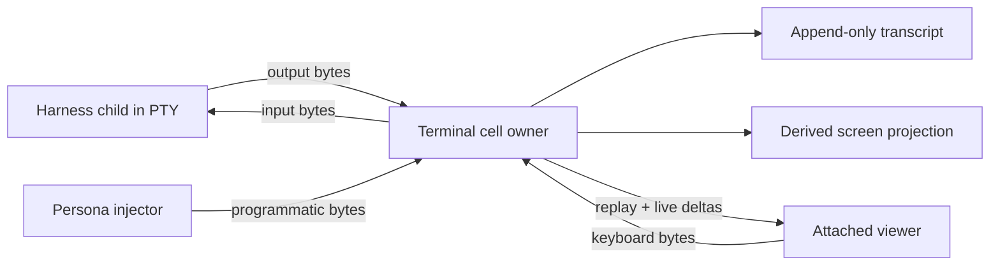

# 12 - Terminal Cell Owner Spike

Role: designer-assistant.

Question: can Persona own a small terminal-session primitive that supports
reattach with scrollback, preserves normal application behavior, and still lets
Persona inject raw input such as harness slash commands?

## TL;DR

Yes. The right primitive is not "tmux, smaller." It is a terminal cell:
one durable PTY owner, one append-only transcript, disposable viewers, and an
out-of-band control/input plane.



The prototype repo is `/git/github.com/LiGoldragon/terminal-cell`.
It now proves daemon-first attach as well as the original in-process PTY
shape:

| Witness | Result |
|---|---|
| `detached_output_is_replayed_to_late_subscriber` | Passes. Output emitted before any subscription is replayed to a late subscriber. |
| `programmatic_input_uses_the_same_pty_input_port` | Passes. Programmatic `/usage\r` bytes go through the PTY input path and are observed by the child. |
| `screen_projection_is_derived_from_transcript` | Passes. A `vt100` projection is built from transcript bytes, not from viewer state. |
| `terminal_exit_is_observable_without_polling_the_child` | Passes. The actor records child exit and can answer/wake exit observers without process-table polling. |
| `agent_terminal_accepts_prompt_and_terminal_cell_reads_response` | Passes. A deterministic agent-like terminal process accepts an injected prompt and the terminal cell reads its response from transcript. |
| `agent_terminal_usage_probe_is_prompt_input_not_terminal_semantics` | Passes. A `/usage\r` probe is carried as raw PTY input and interpreted only by the agent fixture. |
| `daemon_accepts_programmatic_prompt_and_capture_reads_transcript` | Passes. A daemon owns the `TerminalCell`; socket clients send a prompt, wait on transcript text, and capture the response. |
| `attach_view_replays_transcript_without_owning_the_child` | Passes. A late `view --once` client replays transcript without owning the child. |
| `daemon_exposes_terminal_exit_status` | Passes. A socket client can block until the child exits and print the recorded terminal exit status. |
| `nix run .#live-coding-agent-witness` | Passes. A real Codex CLI is launched in the terminal cell, prompted through the socket, and the transcript captures the LLM response marker. |
| `nix run .#ghostty-agent-witness` | Passes. Ghostty runs the attach view, the view pushes an attachment-ready signal, a prompt is injected through the daemon, and the captured transcript contains the response. |
| `nix run .#ghostty-agent-session` | Passes. A durable Ghostty view stays attached to a daemon-owned cell for human inspection until closed explicitly. |

Verification:

- `cargo test` passes in `terminal-cell`.
- `nix flake check` passes as the pure build/fmt/clippy gate.
- `nix run .#session-witnesses` passes as the host-visible stateful PTY
  witness.
- `nix run .#agent-terminal-witness` passes as the deterministic agent-dialogue
  PTY witness.
- `nix run .#daemon-witness` passes as the daemon/client/socket witness.
- `nix run .#live-coding-agent-witness` passes as the real LLM-backed coding
  agent witness and writes
  `target/live-coding-agent-witness/transcript.txt`.
- `nix run .#ghostty-agent-witness` passes as the GUI-terminal attach witness
  and writes `target/ghostty-agent-witness/transcript.txt`.
- `nix run .#ghostty-agent-session` opens a durable visible session and writes
  its socket, pids, logs, and transcript under
  `${XDG_RUNTIME_DIR:-/tmp}/terminal-cell/session-*`.

The Ghostty witness launches with the GTK app ID/class
`com.ligoldragon.terminalcellwitness`. On Niri 25.11, this can be paired with a
targeted window rule so the test window opens without stealing focus:

```kdl
window-rule {
    match app-id=r#"^com\.ligoldragon\.terminalcellwitness$"#
    open-focused false
}
```

## Why This Is Possible

Direct pass-through and detached scrollback are compatible if "direct" means
"tee the PTY stream." The owner reads every PTY output byte continuously. While
a viewer is attached, the owner forwards those same bytes to the viewer without
adding panes, prefix keys, copy mode, status UI, or its own application grammar.
While no viewer is attached, the same reader keeps draining the PTY and appends
output to transcript truth so the child does not block on full PTY buffers.

This is the important difference from abduco/dtach. They prove minimal
detach/reattach, but they do not own a durable transcript. It is also the
important difference from tmux/Zellij. They own a terminal workspace and
re-render state through their own UI model; Persona wants a byte owner with
derived projections.

## External Evidence

| Tool | Useful lesson | Limit |
|---|---|---|
| `zmx` | Closest public shape: session persistence, native scrollback, reattach restoring terminal state/output, raw send to PTY, history output, no windows/tabs/splits. | Still an external product with its own command language and Zig implementation. |
| `shpool` | Daemon-owned persistent shell sessions and native-terminal philosophy. | Shell-oriented; not a typed Persona contract or durable append-only transcript API. |
| `abduco` | Very small detach/attach process owner. | No transcript truth for detached output. |
| `dtach` | Explicit detach-only design and minimalism. | Does not track screen contents. |
| `portable-pty` | Gives Rust PTY master reader, writer, resize, and child lifecycle. | Library primitive, not a session owner. |
| `vt100` / `termwiz` | Screen projections can be derived from bytes. | Projection is an index, not truth. |

Primary sources used include:

- <https://github.com/neurosnap/zmx>
- <https://github.com/shell-pool/shpool>
- <https://github.com/martanne/abduco>
- <https://dtach.sourceforge.net/>
- <https://docs.rs/portable-pty/latest/portable_pty/>
- <https://docs.rs/vt100/latest/vt100/>
- <https://docs.rs/termwiz/latest/termwiz/>

## Prototype Shape

`terminal-cell` is intentionally generic. It is not Persona-prefixed because
the primitive is useful outside Persona, and because the production split is
still a design decision. If the shape graduates, the likely production owner is
`persona-terminal`, with `persona-wezterm` narrowed to a WezTerm adapter.

Current prototype nouns:

| Noun | Role |
|---|---|
| `TerminalCell` | Kameo actor that owns the PTY writer, transcript, subscribers, and waiters. |
| `TerminalTranscript` | Append-only in-memory output deltas sequenced by `TerminalSequence`. |
| `TranscriptSubscription` | Replay from a sequence plus live broadcast receiver. |
| `TerminalInput` | Raw bytes plus provenance (`Viewer` or `Programmatic`). |
| `TerminalExit` | Child status recorded as actor state and exposed through actor/socket waiters. |
| `ScreenProjection` | `vt100` projection derived from transcript bytes. |
| `TerminalCellSocketClient` | Thin Unix-socket client used by command-line tools and viewers. |
| `terminal-cell-daemon` | Daemon that owns the actor and exposes socket requests. |
| `terminal-cell-view` | Attach client run inside Ghostty or another terminal. It replays transcript, subscribes live, enables raw mode, and forwards keyboard bytes. |
| `terminal-cell-exit` | Socket client that waits for and prints the child exit status. |
| `agent-terminal-fixture` | Deterministic agent-like terminal binary used to prove prompt/response and usage-probe dialogue through the PTY. |

The prototype uses blocking OS threads for PTY read and child wait. Those
threads do not own state; they push typed messages into the `TerminalCell`
actor. That keeps the actor as the single owner while acknowledging that PTY
read and child wait are blocking host operations.

The daemon waits for Kameo actor startup before binding and announcing its
socket. The Ghostty witness found this race: if the socket is announced before
the actor is running, a fast GUI attach can hit `actor not running`. The fixed
shape is "actor startup first, socket ready second, view attachment third."

The live Codex witness found a second important edge: a modern coding-agent TUI
is not the same as a line-oriented process. Prompt text and the submit key must
be treated as separate terminal inputs. Coalescing prompt bytes and Enter into
one write is not a faithful enough model for Codex; the passing witness sends
text, waits for a small echoed word, then sends Enter as its own PTY write and
waits for a response marker that was not present in the prompt.

## Production Constraints Recorded

I updated `/git/github.com/LiGoldragon/persona-wezterm/ARCHITECTURE.md` with
the constraints that should survive the future split:

- the terminal owner owns the child process group and PTY;
- viewer close/crash/replacement never owns or kills the child;
- transcript is append-only truth with generation/sequence;
- reattach is sequence-based;
- screen and scrollback are derived projections;
- input is raw byte transport;
- programmatic input and viewer keyboard input use the same input port;
- slash-command usage probes are harness-adapter behavior;
- quota interpretation belongs in `persona-harness` or a harness contract;
- terminal events are pushed, not polled;
- the owner has no panes/tabs/status/copy-mode/prefix-key/application grammar.

That last point is the "do not mess up the application" constraint. The
terminal owner has a control plane, but it does not superimpose a terminal
workspace UI on the child.

## Hard Edges

The first production version still needs real work:

- Persistent transcript storage, not only an in-memory vector/ring.
- Sequence-indexed replay that can survive daemon restart.
- Parser checkpoints so reattach does not replay hours of bytes.
- Terminal mode tracking: alternate screen, bracketed paste, mouse/focus modes,
  synchronized output, cursor visibility.
- Input gating for harness slash commands. `/usage\r` is byte transport, but
  deciding when it is safe to send belongs to a harness adapter that knows the
  harness is idle and focused in the composer.
- Secret handling for input logs. Programmatic input can include sensitive
  data; raw input provenance and redaction policy need typed records.
- Single-writer or transaction policy between human keyboard input and Persona
  injection.
- Persistent child-exit storage and typed `TerminalExited` emission over
  `signal-persona-terminal`.

## Game Plan Update

Switch the architecture direction away from a WezTerm-centered terminal owner
and toward Terminal Cell as the backend-neutral primitive.

Current repo state:

- `/git/github.com/LiGoldragon/terminal-cell` exists locally and on GitHub as
  `LiGoldragon/terminal-cell`.
- `persona-terminal` does not exist yet on GitHub.
- `/git/github.com/LiGoldragon/persona-wezterm` is the existing terminal
  transport repo. Its name is now stale for the intended owner shape: WezTerm
  should be one viewer/adapter, not the noun that owns terminal truth.

Recommended migration:

1. Keep `terminal-cell` generic while the primitive hardens.
2. Create or rename to a production `persona-terminal` repo when we are ready
   to wire the Persona stack. If `persona-wezterm` is renamed, update path
   dependencies, architecture references, active-repo docs, and any
   `signal-persona-terminal` boundary tests in the same pass.
3. Seed `persona-terminal` with the proven Terminal Cell shape: daemon-owned
   PTY, append-only transcript, pushed subscriptions, raw input, screen
   projection, child-exit observation, and Nix witnesses.
4. Keep `signal-persona-terminal` as the harness-to-terminal contract. The
   terminal owner moves bytes and terminal facts; `persona-harness` decides
   slash-command semantics and provider-usage interpretation.
5. Keep `persona-system` responsible for OS/window/focus policy. Terminal Cell
   should expose enough viewer identity for `persona-system` to observe, but it
   should not learn Niri focus rules or placement policy.
6. Keep the live coding-agent witness. The deterministic fixture is necessary
   but not sufficient; the real target is an LLM-backed harness that can be
   prompted through the cell and read back from transcript.

## Recommendation

Continue with a production `persona-terminal` split once the operator is ready:

1. Move the backend-neutral PTY owner out of `persona-wezterm` or rename the
   repo to `persona-terminal`.
2. Keep `signal-persona-terminal` as the contract.
3. Keep WezTerm, Ghostty/plain terminal, browser terminal, and possible zmx or
   abduco interop as viewer/adapters.
4. Add the transcript persistence and sequence replay witnesses before making
   it the live harness owner.
