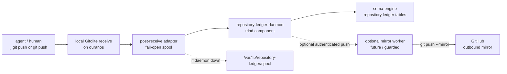

# Local Gitolite Receive And Repository Ledger Implementation Plan

Date: 2026-05-18  
Role: designer-assistant  
Status: operator implementation plan, updated after production
Horizon service-variant deployment

## 0. Decision

Build the first repository receive point as a **local CriomOS service on
the development workstation**.

The chosen shape:

- `Gitolite` is the first canonical Git receive point.
- `repository-ledger` is the triad component that records accepted
  pushes in `sema-engine`.
- GitHub is an outbound mirror only, not the canonical receive point.
- The first deployment is local to the workstation named `ouranos` in
  current cluster data. The user calls this Uranus in chat; the current
  datom spells it `ouranos`.
- The GitHub mirror credential, if enabled in this slice, stays on that
  workstation. Do not place a GitHub write credential on a cloud host for
  this first implementation.
- The only Git receive implementation in this pass is Gitolite.
- Do not name any daemon after a cluster. Component names stay generic:
  `repository-ledger-daemon`, `repository-ledger`, and the contract repos
  named below.

The implementation target is small and concrete: local agents push to a
local Gitolite remote; Gitolite accepts or rejects the push; a
`post-receive` hook notifies `repository-ledger-daemon`; the daemon reads
the canonical bare repository and commits typed ledger rows.



## 1. Why local first

The user wants the first service in production CriomOS, but only on the
development workstation, so that it is easy to deploy and test while
keeping any GitHub mirror credential local.

This also matches the current project maturity:

- The repository ledger is for agents and the user, not public hosting.
- The canonical receive event is still the important semantic boundary:
  local commits are drafts; accepted pushes are workspace facts.
- Running Gitolite locally lets the operator test receive hooks,
  fail-open spooling, and ledger import without cloud networking or TLS
  work.

## 2. GitHub mirror credential reality

I found no GitHub repository setting that means "trust this external
domain and mirror every push from it" without an authenticated writer.
The official GitHub mirror path is still a local mirror clone plus
`git push --mirror` into GitHub. That push requires normal GitHub write
authentication.

Useful GitHub facts:

- GitHub documents mirror maintenance as `git fetch` followed by
  `git push --mirror`; it does not describe a native pull-mirror setting
  where GitHub trusts an external Git domain as authority.
- A deploy key with write access can push to one repository, but GitHub
  warns that deploy-key private keys are usually long-lived credentials
  and must be protected.
- A GitHub Actions workflow receives a repository-scoped
  `GITHUB_TOKEN`; that token can authenticate inside the workflow, with
  configurable permissions. That can avoid storing a PAT on the
  workstation, but it means GitHub must run a workflow that can reach and
  fetch from the canonical remote. It is not a native "GitHub trusts this
  external receive point" mechanism.

Implementation consequence:

- First slice may skip GitHub mirroring entirely.
- If mirroring lands in the first slice, use a per-repository write
  deploy key or GitHub App credential stored only on the local
  workstation, not in cloud infrastructure.
- A later design can decide whether GitHub Actions should periodically
  pull from a reachable canonical remote using `GITHUB_TOKEN`, but that
  is not the first path.

Sources:

- GitHub "Duplicating a repository" documents mirror updates as
  `git fetch` + `git push --mirror`:
  <https://docs.github.com/en/repositories/creating-and-managing-repositories/duplicating-a-repository>
- GitHub deploy keys can be write-capable but are long-lived
  server-held credentials:
  <https://docs.github.com/en/authentication/connecting-to-github-with-ssh/managing-deploy-keys>
- GitHub Actions `GITHUB_TOKEN` is a repository-scoped installation
  token created for each workflow job:
  <https://docs.github.com/en/actions/concepts/security/github_token>

## 3. CriomOS / Horizon gate

This section is updated by the newer production reports:

- `reports/system-specialist/145-persona-gitolite-server-production-shape-2026-05-19.md`
- `reports/system-specialist/146-production-horizon-service-variant-rework-2026-05-19.md`
- `reports/system-specialist/147-production-horizon-circle-back.md`

The old recommendation in this report was "add a
`persona_development` field to `NodeServices`." That is superseded.
Production now uses a service-variant vector.

The cluster data selects:

```nota
(PersonaDevelopment [(GitoliteServer)])
```

The projected `horizon.node.services` carries externally tagged service
variants. CriomOS consumes them through:

```text
modules/nixos/node-services.nix
```

The Gitolite receive module gates on
`PersonaDevelopment` containing `GitoliteServer`. The rule stays the
same: do not add a node species such as `DevelopmentEdge`, do not use a
node-name predicate, and do not make cluster data author Gitolite paths,
ports, hook paths, or socket wiring.

## 4. Gitolite slice

Use the NixOS Gitolite module if present in the pinned Nixpkgs. Current
NixOS option indexes expose:

- `services.gitolite.enable`
- `services.gitolite.adminPubkey`
- `services.gitolite.dataDir`
- `services.gitolite.commonHooks`
- `services.gitolite.user`
- `services.gitolite.group`

The NixOS wiki's minimal shape is:

```nix
services.gitolite = {
  enable = true;
  adminPubkey = "<ssh public key>";
};
```

For this workspace, the CriomOS module should wrap that shape and gate
it on the Horizon service role:

```nix
let
  hasGitoliteServer =
    nodeServices.personaDevelopmentHas (horizon.node.services or [ ]) "GitoliteServer";
in
lib.mkIf hasGitoliteServer {
  services.gitolite = {
    enable = true;
    adminPubkey = /* owner-owned local public key; private half stays outside Nix */;
    dataDir = "/var/lib/gitolite";
    commonHooks = [ repositoryLedgerPostReceiveHook ];
  };
}
```

The operator should verify the exact pinned Nixpkgs option names before
coding; the current public option index lists `commonHooks` as the
mechanism for common hook installation.

Sources:

- NixOS wiki Gitolite module example:
  <https://wiki.nixos.org/wiki/Gitolite>
- Current option index for `services.gitolite.*`:
  <https://mynixos.com/options/services.gitolite>
- Gitolite's own hook docs say hooks are standard Git hooks, with common
  and repo-specific hook installation paths:
  <https://gitolite.com/gitolite/non-core.html>

## 5. Repository-ledger triad

`repository-ledger` is a normal stateful triad component:

```text
repository-ledger/
  repository-ledger-daemon
  repository-ledger
signal-repository-ledger/
owner-signal-repository-ledger/
```

Required constraints:

- The daemon owns all state in `sema-engine`.
- The CLI only talks to `repository-ledger-daemon`.
- Normal queries use `signal-repository-ledger`.
- Privileged mutable configuration uses `owner-signal-repository-ledger`.
- The owner-signal actor inside the daemon is the only privileged
  runtime configuration surface. Static files may provide bootstrap
  defaults needed to start the daemon, but they are not the privileged
  change plane after startup.

Owner-signal should cover:

- repository registration,
- Gitolite repository mapping,
- mirror target registration,
- mirror credential reference registration,
- hook-spool import policy,
- retention policy.

Normal signal should cover:

- recent accepted pushes,
- report repository changes by role/lane,
- query by repository type,
- query by time window,
- query by branch/bookmark/tag,
- fetch commit/change metadata for agent context.

There is no `permission-signal-repository-ledger` middle tier. That was
an earlier hallucinated shape. Components have the ordinary
peer-callable `signal-*` contract and the owner-only `owner-signal-*`
contract.

## 6. Hook adapter

The Gitolite `post-receive` adapter is deliberately small. It does not
parse the full commit history and does not become the ledger.

It receives Git's standard post-receive stdin rows:

```text
<old-object-id> <new-object-id> <ref-name>
```

Then it writes either:

1. a Signal request to the local `repository-ledger-daemon`, or
2. a durable spool record under `/var/lib/repository-ledger/spool` if the
   daemon cannot be reached.

The hook must fail open for the first slice: once Gitolite has accepted
the push and moved refs, a ledger outage must not retroactively reject
the Git push. The daemon later imports the spool and records that the
notification was delayed.

The daemon must treat the hook payload as a wake-up signal. It reads the
canonical bare repository to verify refs and commit metadata before
committing ledger rows.

## 7. State model

Minimum `sema-engine` tables:

| Table | Key | Purpose |
|---|---|---|
| `repositories` | `RepositoryId` | Known canonical repositories and their type. |
| `repository_receive_points` | `RepositoryId` | Local Gitolite path, default branch, mirror policy. |
| `accepted_ref_updates` | `(RepositoryId, RefName, Sequence)` | Accepted push ref movements. |
| `commit_observations` | `(RepositoryId, ObjectId)` | Commit metadata imported from canonical repo. |
| `change_observations` | `(RepositoryId, ChangeId)` | Optional `jj` change identity when present. |
| `spool_imports` | `SpoolRecordId` | Delayed hook notifications and import outcome. |

Repository type should be a typed enum, not a string dispatch key. First
variants:

```rust
pub enum RepositoryKind {
    Code,
    ReportLane,
    Architecture,
    Skill,
    SystemConfiguration,
}
```

Roles remain string-like for now because workspace roles are still
allowed to evolve. The ledger can match `reports/<role>/` path prefixes
without closing role names into an enum yet.

## 8. Implementation order

1. Add the Horizon/CriomOS gate:
   - already landed in production as
     `PersonaDevelopment [(GitoliteServer)]`;
   - keep using the service-variant vector in any follow-up;
   - do not regress to boolean fields or node-name gates.
2. Enable Gitolite on the gated node:
   - already landed as the production receive slice;
   - current hook durably spools receive notifications under
     `/var/lib/repository-ledger/spool`;
   - next system-specialist work is a live push witness, if wanted.
3. Implement `repository-ledger` skeleton:
   - triad repo plus two contract repos;
   - sema-engine database opens on startup;
   - owner-signal actor can register a repository;
   - normal-signal actor can query recent pushes.
4. Implement hook ingestion:
   - local socket call to daemon;
   - fail-open spool;
   - daemon spool replay.
5. Implement canonical repo importer:
   - resolve repository path from registry;
   - read refs and commit metadata;
   - record accepted ref update rows.
6. Add optional GitHub mirror later:
   - either per-repository deploy key on the workstation, or defer;
   - do not make GitHub mirror success required for local accept.

## 9. Witnesses

The operator should land these as tests or Nix checks:

| Witness | Proves |
|---|---|
| non-development node does not enable Gitolite | The service is gated by Horizon service variant, not node name. |
| only `ouranos` projects `PersonaDevelopment [(GitoliteServer)]` in current cluster data | The local dev receive point is not accidentally cluster-wide. |
| Gitolite accepts a local test push | The canonical receive point works. |
| post-receive adapter receives old/new/ref rows | The hook path is real. |
| hook writes spool when daemon is down and exits successfully | Git pushes are not rejected by ledger outages. |
| daemon imports spool on restart | Delayed notifications become ledger state. |
| daemon verifies refs from the bare repository before commit | Hook payload is not trusted as database of record. |
| normal CLI queries only its daemon | Triad CLI invariant. |
| owner-signal is required to register repositories or mirror targets | Privileged mutable config does not bypass the daemon owner actor. |
| GitHub mirror disabled still passes the local receive test | GitHub is outbound optional, not authority. |

## 10. Remaining decisions for the user

Only two decisions still look worth user attention:

1. **Live Gitolite push witness now or after the daemon exists.** The
   system slice can prove a real Git push creates a durable spool record
   before the Rust daemon exists. The alternative is to wait and test the
   full receive-to-ledger path once `repository-ledger-daemon` exists.
2. **GitHub mirror in the first slice or later.** I recommend later. The
   local receive plus ledger witness is enough to prove the architecture,
   and deferring mirror avoids introducing a GitHub write credential into
   the first implementation.
